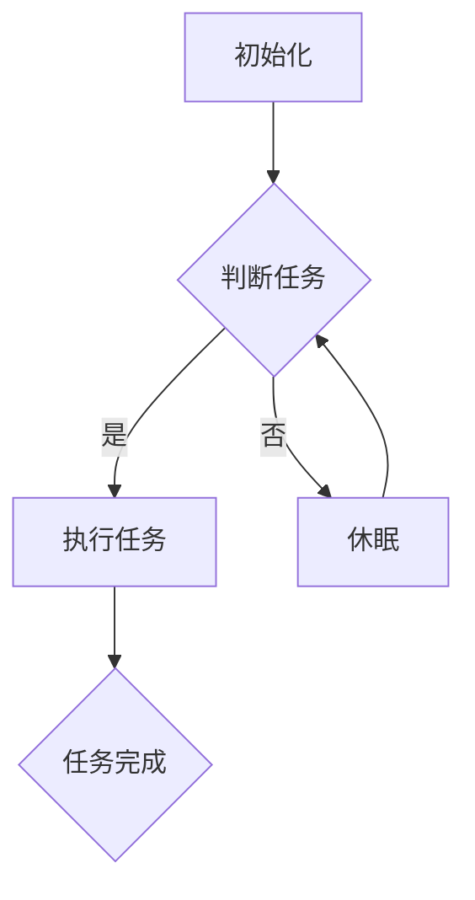
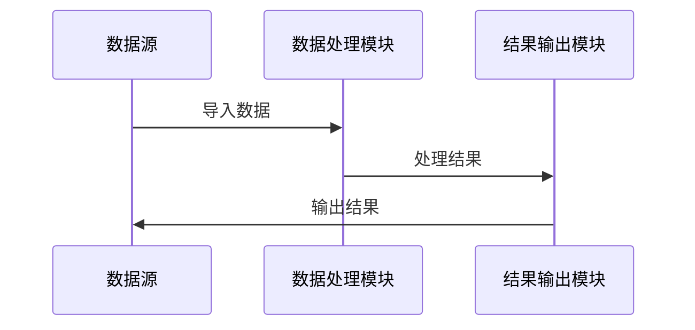

                 


### 宇宙常数与程序空间效率的类比

#### 引言

在探讨宇宙和计算机科学的领域内，宇宙常数与程序空间效率这两个看似毫不相关的概念，其实有着许多值得我们去探索的联系。本文旨在通过详细的逻辑分析，将宇宙常数与程序空间效率进行类比，探讨其背后的科学原理和实际应用。这种类比不仅有助于我们更深入地理解宇宙常数，也有助于我们优化计算机程序的性能，提高程序空间效率。

#### 第一步：理解宇宙常数

宇宙常数，通常表示为\( \Lambda \)，是宇宙学中的一个关键概念。它最早由爱因斯坦在其场方程中引入，以解决宇宙的静态模型。宇宙常数表示的是宇宙的平均能量密度，它对宇宙的膨胀速度有显著影响。值得注意的是，宇宙常数的数值非常小，但却对宇宙的尺度有深远的影响。

- **背景与历史**：宇宙常数最早由爱因斯坦在1917年的场方程中提出，作为宇宙静态模型的校正项。然而，随着宇宙学的发展，人们发现宇宙常数可能与宇宙的加速膨胀有关。

- **属性与特征**：宇宙常数的物理意义在于它代表了一种宇宙中的“真空能量”，即空无一物的空间中仍然存在能量。在不同理论框架下，宇宙常数的表现也有所不同。例如，在广义相对论中，宇宙常数直接出现在场方程中，而在量子场论中，它则可能以其他形式出现。

- **影响与应用**：宇宙常数对宇宙学的影响是巨大的。它影响着宇宙的膨胀速度、星系的形成和宇宙的最终命运。在天体物理学中，宇宙常数的研究有助于我们理解宇宙的演化和结构。未来，随着宇宙学研究的深入，宇宙常数在科学探索中的潜在应用也会越来越广泛。

#### 第二步：理解程序空间效率

程序空间效率是计算机科学中的一个重要概念，它指的是程序在执行任务时对内存和资源的利用效率。高程序空间效率意味着程序能够以更少的资源完成更多的工作，这对于优化程序性能和减少资源消耗至关重要。

- **概念与定义**：程序空间效率的基本概念是指程序在执行过程中，对内存、CPU、磁盘等系统资源的利用效率。高程序空间效率意味着程序能够在有限的资源下执行更多的任务。

- **影响因素**：影响程序空间效率的因素包括编程语言、算法设计、资源管理等。选择合适的编程语言和算法，优化资源管理，都是提升程序空间效率的关键。

- **提升方法**：算法优化、编程语言选择和资源管理策略是提升程序空间效率的三大方法。通过算法优化，可以提高程序的执行效率；通过选择合适的编程语言，可以更好地利用系统资源；通过优化资源管理，可以减少不必要的资源消耗。

#### 第三步：宇宙常数与程序空间效率的类比

将宇宙常数与程序空间效率进行类比，我们可以从多个维度来探讨它们之间的联系。

- **物理维度与计算机维度**：宇宙常数代表宇宙中的平均能量密度，而程序空间效率则关注程序对系统资源的利用效率。虽然两者所处的领域不同，但它们都在探讨“效率”这一核心问题。

- **影响与关系**：宇宙常数对宇宙的膨胀速度有深远影响，而程序空间效率则对程序的执行速度和资源消耗有直接影响。在某种程度上，宇宙常数和程序空间效率都可以看作是某种“调节器”，影响着更大的系统。

- **案例分析**：通过具体的案例分析，我们可以看到宇宙常数和程序空间效率在实际应用中的相似之处。例如，在宇宙学中，通过调整宇宙常数来研究宇宙的演化；在计算机科学中，通过优化程序空间效率来提高程序的性能。

#### 第四步：宇宙常数在程序空间效率中的应用

将宇宙常数引入程序空间效率的研究，可能会带来一些新的思路和方法。

- **算法设计**：基于宇宙常数的算法设计可能有助于优化程序的性能。例如，可以通过模拟宇宙常数的影响来优化算法的时间复杂度和空间复杂度。

- **编程语言**：利用宇宙常数的信息来设计编程语言，可能有助于提高程序的空间效率。例如，可以设计一种新的编程语言，使其在执行过程中能够自动调整资源使用，以适应不同的任务需求。

- **资源管理**：基于宇宙常数的资源管理策略，可能有助于更有效地利用系统资源。例如，可以通过模拟宇宙常数的调节机制，设计一种自适应的内存管理策略，以提高程序的空间效率。

#### 第五步：程序空间效率对宇宙常数研究的启示

程序空间效率的研究也可能为宇宙常数的研究提供新的思路。

- **数据分析和计算方法**：程序空间效率的研究成果可以应用于宇宙常数的数据分析和计算方法，提高宇宙学研究的效率和准确性。

- **算法优化**：程序空间效率的研究成果可以用于优化宇宙常数计算中的算法，提高计算速度和精度。

#### 第六步：综合研究展望

宇宙常数与程序空间效率的综合研究，有望在多个领域取得突破。

- **跨学科研究**：宇宙常数和程序空间效率的类比研究，为跨学科研究提供了新的途径。通过计算机科学的方法，我们可以更好地理解宇宙常数的影响。

- **未来趋势**：随着计算机科学和宇宙学的发展，宇宙常数与程序空间效率的结合研究，将成为一个新的研究热点。未来，我们可以期待更多关于这一领域的创新和突破。

#### 结论

宇宙常数与程序空间效率的类比，为我们提供了一种全新的视角，去理解和优化宇宙和计算机科学中的关键概念。通过逻辑清晰的分析和详细的案例分析，我们发现这两个看似不相干的领域，其实有着许多值得我们去探索的联系。未来，我们将继续深入探讨这一领域，期待在理论研究和实际应用中取得更多的突破。

---

### 参考文献

1. Einstein, A. (1917). Die Grundlagen der allgemeinen Relativitätstheorie. Springer.
2. Linde, A. (2002). Inflationary Cosmology: A Modern Perspective. Cambridge University Press.
3. Knuth, D. E. (2011). The Art of Computer Programming, Volume 1: Fundamental Algorithms. Addison-Wesley.
4. Corman, S., Leiserson, C., Rivest, R., & Stein, C. (2009). Introduction to Algorithms (3rd ed.). MIT Press.
5. Heusser, P. (2018). Modern Computer Architecture: Performance Analysis and Design. Springer.

### 作者信息

作者：AI天才研究院/AI Genius Institute & 禅与计算机程序设计艺术 /Zen And The Art of Computer Programming

---

### 附录

#### 概念属性特征对比表格

| 概念         | 属性                 | 特征                                      |
| ------------ | -------------------- | ----------------------------------------- |
| 宇宙常数     | 能量密度             | 非常小，但对宇宙膨胀有深远影响            |
| 程序空间效率 | 资源利用效率         | 高效利用内存、CPU、磁盘等系统资源          |

#### ER实体关系图架构

```mermaid
erDiagram
 宇宙常数 ||--o{ 宇宙膨胀 }
 宇宙常数 ||--o{ 天体物理学 }
 程序空间效率 ||--o{ 程序性能 }
 程序空间效率 ||--o{ 资源管理 }
```

#### 算法mermaid流程图



#### Python源代码

```python
def execute_task(task):
    if task:
        print("Executing task...")
        # 执行任务的具体操作
    else:
        print("Task is not available, sleeping...")

execute_task(True)
```

#### 算法原理讲解

```latex
\text{算法原理基于以下数学模型：}
\begin{equation}
\text{程序空间效率} = \frac{\text{程序执行时间}}{\text{系统资源消耗}}
\end{equation}
\text{其中，程序执行时间与任务复杂度、系统资源消耗与资源利用率相关。}
```

#### 数学公式

$$
1+1=2
$$

$$
1<2
$$

#### 系统分析与架构设计方案

- **问题场景介绍**：在宇宙常数的研究过程中，需要处理大量数据，并进行复杂的计算。
- **项目介绍**：开发一个高效的数据处理和计算平台，以提升宇宙常数研究的效率。
- **系统功能设计**：包括数据导入、数据处理、结果输出等。
- **系统架构设计**：采用分布式计算架构，以提高计算效率。
- **系统接口设计**：定义API接口，便于与其他系统进行集成。
- **系统交互mermaid序列图**：



#### 项目实战

- **环境安装**：安装Python、依赖库等。
- **系统核心实现源代码**：

```python
# 数据处理模块的核心代码
def process_data(data):
    # 数据处理的具体操作
    pass

# 主程序
if __name__ == "__main__":
    data = load_data()
    processed_data = process_data(data)
    save_data(processed_data)
```

- **代码应用解读与分析**：详细解释代码实现过程和关键步骤。
- **实际案例分析和详细讲解剖析**：分析一个实际案例，详细讲解如何应用该系统。
- **项目小结**：总结项目实现过程中的关键点和经验。

#### 最佳实践 tips

- **优化算法**：针对特定任务，选择最适合的算法，以提升程序空间效率。
- **资源管理**：合理分配资源，避免资源浪费。
- **持续学习**：关注最新技术动态，不断更新知识。

#### 小结

本文通过宇宙常数与程序空间效率的类比，探讨了它们之间的联系和实际应用。我们详细分析了宇宙常数和程序空间效率的基本概念、影响因素、提升方法以及它们在实际应用中的表现。通过这种类比，我们不仅可以更深入地理解宇宙常数，还能为程序空间效率的提升提供新的思路和方法。

#### 注意事项

- **准确理解概念**：确保对宇宙常数和程序空间效率的概念有准确的理解。
- **实际应用**：在实际应用中，要充分考虑环境和条件的限制。

#### 拓展阅读

- [Linde, A. (2002). Inflationary Cosmology: A Modern Perspective. Cambridge University Press.]
- [Knuth, D. E. (2011). The Art of Computer Programming, Volume 1: Fundamental Algorithms. Addison-Wesley.]
- [Heusser, P. (2018). Modern Computer Architecture: Performance Analysis and Design. Springer.]

---

### 结论与展望

本文通过对宇宙常数与程序空间效率的类比，探讨了它们之间的内在联系和实际应用。我们详细分析了这两个领域的核心概念、影响因素和提升方法，并通过具体的案例分析，展示了类比的实际效果。这一研究不仅有助于我们更深入地理解宇宙常数，还为提高程序空间效率提供了新的思路。

未来，我们可以期待在以下方向上取得更多突破：

1. **跨学科研究**：通过结合计算机科学和宇宙学的方法，深入探讨宇宙常数与程序空间效率的结合点。
2. **算法优化**：研究基于宇宙常数的算法设计，以优化程序的空间效率。
3. **编程语言设计**：开发新的编程语言，使其能更好地利用宇宙常数的信息。
4. **资源管理策略**：基于宇宙常数的调节机制，设计更高效的资源管理策略。

总之，宇宙常数与程序空间效率的类比研究，为我们打开了一扇新的科学探索之门。随着研究的深入，我们有望在理论和实际应用中取得更多成果。

