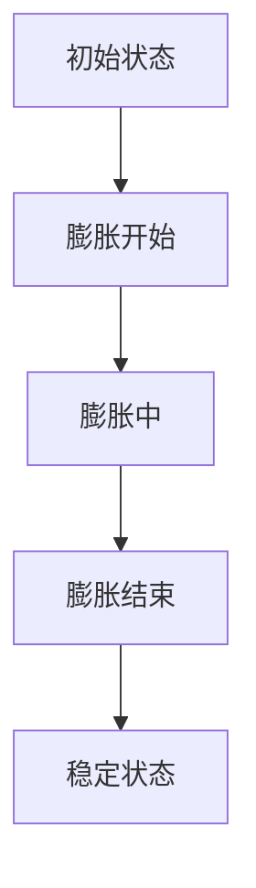
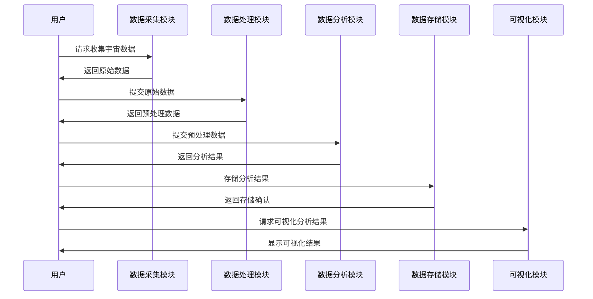

                 

## 宇宙是否具有内在目的

### 关键词
- 宇宙
- 内在目的
- 科学证据
- 哲学思考
- 科技发展
- 人类探索

### 摘要
本文将探讨宇宙是否具有内在目的这一哲学与科学问题。通过对宇宙的起源、结构、物理定律及人类对宇宙意义的思考进行分析，结合科学证据与哲学观点，我们将深入探讨宇宙目的性的可能性及其对人类文明的启示。

## 引言：宇宙的广阔无垠

宇宙，这个我们所在的空间，是一个浩瀚无垠的存在。从我们头顶的星空到遥远的星系，宇宙的规模之大令人难以想象。科学家们估计，宇宙的直径可能达到了 930 亿光年，包含数百亿个星系，每个星系中又有数以亿计的恒星，以及无数的行星、黑洞、暗物质等。宇宙的广阔无垠使我们不禁要问：这样一个庞大的宇宙，是否具有某种内在目的？

这个问题不仅吸引了科学家的关注，也引发了哲学家的深思。自古以来，人类就对宇宙的存在和意义有着各种各样的思考。从古希腊哲学家到现代科学家，从宗教神学到科学理论，各种观点和学说层出不穷。然而，直到今天，这个问题仍然没有明确的答案。

## 第一部分：核心概念介绍

### 第1章：宇宙

#### 1.1 宇宙的定义与结构

宇宙是我们所在的空间，包含所有的物质、能量、时间和空间。根据现代宇宙学的定义，宇宙指的是所有存在的星系、行星、恒星、黑洞、暗物质和暗能量，以及它们之间的空间。

宇宙的结构可以从宏观和微观两个层面来理解。从宏观层面来看，宇宙由数十亿个星系组成，这些星系通过引力相互作用形成更大的结构，如超星系团。从微观层面来看，宇宙中的物质由原子、分子和基本粒子组成，这些粒子通过电磁力和强核力相互作用形成复杂的结构。

#### 1.2 宇宙的历史与演变

宇宙的历史可以分为几个重要阶段：

1. **大爆炸**：大约138亿年前，宇宙从一个极度热密的初始状态开始膨胀。这个理论得到了宇宙背景微波辐射的观测证据支持。

2. **宇宙膨胀**：从大爆炸开始，宇宙一直在膨胀。这种膨胀在宇宙早期非常迅速，之后逐渐减缓。

3. **结构形成**：在宇宙膨胀的过程中，物质通过引力相互作用逐渐聚集，形成了恒星、行星、星系等结构。

4. **星系演化**：星系内部的恒星通过核聚变产生能量，同时星系之间的相互作用影响星系的演化。

#### 1.3 宇宙的组成与性质

宇宙主要由以下几部分组成：

1. **普通物质**：包括星系、恒星、行星等可见物质。

2. **暗物质**：一种不发光也不与电磁波相互作用的物质，但其存在通过引力作用得到证实。

3. **暗能量**：一种推动宇宙加速膨胀的神秘力量，其性质和起源仍然未知。

宇宙的性质包括：

1. **无边无际**：宇宙可能是无边无际的，也可能是有边界的，但当前科学尚未能够确定。

2. **不断膨胀**：宇宙正在不断膨胀，这种膨胀可能是加速的，也可能是减缓的。

### 第2章：内在目的

#### 2.1 内在目的的定义与理解

内在目的指的是一个事物本身所具有的目的，这种目的不依赖于外部因素，而是事物本身的属性或本质所决定的。

在宇宙学中，内在目的可以理解为宇宙自身存在的目的，而不是为了满足人类或其他外部观察者的需求。这种目的可能是宇宙演化的自然规律，也可能是宇宙结构的某种特定形态。

#### 2.2 内在目的与外在目的的区别

外在目的指的是一个事物为了满足外部观察者或系统的需求而存在的目的。例如，人类建造建筑物是为了居住或工作，这是外在目的。

内在目的与外在目的的区别在于：

1. **来源**：内在目的是事物自身所固有的，而外在目的是由外部观察者或系统赋予的。

2. **依赖性**：内在目的不依赖于外部因素，而外在目的通常依赖于外部因素。

3. **本质**：内在目的是事物的本质属性，而外在目的是事物的功能或作用。

#### 2.3 内在目的的意义与影响

内在目的对宇宙及其演化可能产生以下影响：

1. **宇宙稳定性**：内在目的可能有助于宇宙保持稳定和平衡。

2. **宇宙演化**：内在目的可能影响宇宙的演化方向和速度。

3. **科学探索**：探讨宇宙的内在目的可以推动科学的发展，帮助我们更好地理解宇宙。

## 第二部分：宇宙目的性探讨

### 第3章：科学视角下的宇宙目的性

#### 3.1 宇宙的起源与演化

宇宙的起源通常被认为是大爆炸。在大爆炸之后，宇宙开始膨胀，物质和能量逐渐分布并形成星系、恒星、行星等结构。宇宙的演化过程可以通过宇宙背景微波辐射、宇宙膨胀等观测数据得到证实。

科学视角下的宇宙起源与演化没有明显的内在目的，而是自然过程的结果。然而，这种自然过程是否蕴含某种深层次的内在目的，仍然是一个值得探讨的问题。

#### 3.2 宇宙的稳定与平衡

宇宙的稳定性与平衡是科学视角下探讨宇宙目的性的一个重要方面。宇宙中的各种力量，如引力、电磁力、强核力等，共同维持着宇宙的稳定和平衡。

宇宙的稳定与平衡可能具有某种内在目的，这种目的可能是为了维持宇宙的持续存在和演化。然而，这种内在目的的具体形式和机制仍然未知。

#### 3.3 宇宙目的性的科学证据

科学证据可以支持或反驳宇宙目的性的观点。例如：

1. **宇宙背景微波辐射**：这是大爆炸理论的重要证据，表明宇宙有一个统一的起源。

2. **宇宙膨胀**：宇宙的膨胀表明宇宙在早期可能经历了一个迅速膨胀的阶段，这可能暗示某种内在目的。

3. **宇宙物理定律**：宇宙中的物理定律，如万有引力定律、电磁力定律等，可能暗示宇宙的内在结构具有某种目的。

然而，这些证据并不直接证明宇宙具有内在目的，而是表明宇宙的某些特征可能暗示了内在目的的存在。

### 第4章：哲学视角下的宇宙目的性

#### 4.1 哲学对宇宙目的性的探讨

哲学视角下的宇宙目的性探讨可以从多个角度进行：

1. **宇宙的目的论**：一些哲学家认为宇宙存在某种目的或目标，这种目的可能是为了实现某种形式的完美或和谐。

2. **宇宙的存在论**：另一些哲学家认为宇宙的存在本身就是目的，而不是为了实现某个特定的目标。

3. **宇宙的本质论**：还有一些哲学家认为宇宙的本质决定了其存在的目的，而不是外部因素。

#### 4.2 哲学家的观点与分析

不同哲学家对宇宙目的性的观点各不相同。例如：

1. **柏拉图**：柏拉图认为宇宙是一个完美的理念世界，现实世界只是理念世界的反映。

2. **黑格尔**：黑格尔认为宇宙是一个不断发展的过程，每个阶段都有其特定的目的和意义。

3. **康德**：康德认为宇宙的存在是理性的结果，而不是偶然。

这些哲学观点为我们提供了不同的思考方向，但它们都没有提供直接的证据来证明或反驳宇宙目的性的存在。

#### 4.3 哲学思考对宇宙目的性的影响

哲学思考对宇宙目的性的影响主要体现在以下几个方面：

1. **科学哲学**：哲学思考可以影响科学理论的发展，例如，关于宇宙目的性的探讨可以推动科学对宇宙起源和演化的研究。

2. **科学方法论**：哲学思考可以影响科学方法的应用，例如，关于宇宙目的性的探讨可以影响科学实验的设计和数据分析。

3. **世界观**：哲学思考可以影响人们对宇宙和生命的看法，从而影响人类的行为和价值观。

## 第三部分：科学证据分析

### 第5章：宇宙的观测数据

#### 5.1 宇宙背景微波辐射

宇宙背景微波辐射（Cosmic Microwave Background Radiation，简称 CMB）是宇宙大爆炸留下的温度痕迹。这种辐射在整个宇宙中均匀分布，其存在为宇宙大爆炸理论提供了强有力的证据。CMB 的观测数据表明，宇宙在大爆炸之后迅速膨胀，温度逐渐降低，形成了当前宇宙的结构。

#### 5.2 宇宙膨胀的证据

宇宙膨胀的证据不仅来自于 CMB 的观测，还来自于其他观测数据。例如，超新星观测显示，宇宙的膨胀速度在增加，这表明存在一种推动宇宙加速膨胀的力量，即暗能量。此外，星系的红移观测也表明，宇宙正在膨胀，且膨胀速度在加快。

#### 5.3 其他观测数据对宇宙目的性的启示

除了 CMB 和宇宙膨胀的证据，其他观测数据也对宇宙目的性提供了启示。例如，黑洞和暗物质的研究表明，宇宙中存在许多我们无法直接观测到的物质和现象，这暗示宇宙可能具有某种深层次的内在结构。此外，宇宙中的规律性分布，如星系的螺旋结构和星团的形成，也可能暗示宇宙的内在目的。

### 第6章：宇宙的物理定律

#### 6.1 大爆炸理论

大爆炸理论是描述宇宙起源和演化的科学理论。根据大爆炸理论，宇宙起源于一个极度热密的初始状态，然后开始膨胀，温度逐渐降低，形成了当前的宇宙结构。大爆炸理论得到了宇宙背景微波辐射和其他观测数据的支持，是现代宇宙学的基础。

#### 6.2 黑洞与暗物质的研究

黑洞和暗物质是宇宙中的两个重要现象。黑洞是宇宙中密度极高的区域，其引力极强，连光也无法逃脱。暗物质则是宇宙中不发光也不与电磁波相互作用的物质，但其存在通过引力作用得到证实。黑洞和暗物质的研究为理解宇宙的内在结构提供了重要线索，可能暗示宇宙具有某种内在目的。

#### 6.3 宇宙物理定律与宇宙目的性的关系

宇宙的物理定律，如万有引力定律、电磁力定律等，是宇宙演化的基础。这些物理定律是否蕴含了宇宙的内在目的，是一个值得探讨的问题。一些科学家认为，宇宙的物理定律可能暗示了宇宙的某种内在秩序和目的。然而，这种观点尚未得到广泛的科学支持。

## 第四部分：哲学思考

### 第7章：宇宙存在的意义

#### 7.1 宇宙与生命的联系

宇宙与生命的联系是一个古老而深刻的哲学问题。从生物学角度来看，生命是宇宙演化的一个奇妙产物。生命的出现使得宇宙变得更加复杂和多样。从哲学角度来看，生命的存在可能赋予了宇宙某种特殊的意义。例如，一些哲学家认为，生命的出现使得宇宙从无意义变为有意义。

#### 7.2 人类对宇宙意义的思考

人类对宇宙意义的思考可以追溯到古代。例如，古希腊哲学家苏格拉底、柏拉图和亚里士多德都曾探讨宇宙的意义。在现代社会，人类对宇宙意义的思考更加深入，涉及到科学、哲学、宗教等多个领域。例如，一些科学家认为，宇宙的意义在于探索自然规律和宇宙的本质；一些哲学家认为，宇宙的意义在于实现某种形式的完美或和谐。

#### 7.3 宇宙存在意义对人类价值观的影响

宇宙存在意义对人类价值观的影响是深远的。例如，一些哲学家认为，宇宙的意义在于追求真理、美和善。这些价值观不仅影响了人类的科学探索和艺术创作，也影响了人类的道德观念和行为准则。例如，科学家追求真理，艺术家追求美，道德家追求善，这些都是宇宙存在意义对人类价值观的具体体现。

### 第8章：宇宙的终极目的

#### 8.1 宇宙目的论探讨

宇宙目的论是一种哲学观点，认为宇宙存在某种终极目的或目标。这种观点可以追溯到古希腊哲学家柏拉图和亚里士多德。在现代，一些哲学家和科学家也探讨了宇宙目的论的可能性。例如，霍金和彭罗斯提出了“宇宙设计论”，认为宇宙的某些特征可能暗示了宇宙的存在目的。

#### 8.2 人类与宇宙的未来

人类与宇宙的未来是一个充满挑战和机遇的问题。从科学角度来看，人类正在不断探索宇宙的奥秘，包括宇宙的起源、演化和最终命运。从哲学角度来看，人类对宇宙未来的思考涉及多个领域，如宇宙哲学、生命哲学和伦理学。例如，一些哲学家认为，人类的未来可能取决于宇宙的命运，如宇宙的热寂、大撕裂或大碰撞等。

#### 8.3 宇宙目的性对人类文明的意义

宇宙目的性对人类文明的意义是多方面的。例如：

1. **科学意义**：探讨宇宙目的性可以推动科学的发展，帮助我们更好地理解宇宙。

2. **哲学意义**：宇宙目的性探讨可以引发哲学思考，推动哲学的发展。

3. **文化意义**：宇宙目的性探讨可以影响人类的文化和价值观，如宇宙宗教、宇宙哲学和宇宙伦理学等。

4. **伦理意义**：探讨宇宙目的性可以帮助我们更好地理解人类在宇宙中的地位和责任，从而影响人类的伦理行为。

## 第五部分：未来展望

### 第9章：科技发展对宇宙目的性的影响

#### 9.1 现代科技对宇宙认识的拓展

现代科技的发展极大地拓展了我们对宇宙的认识。例如，射电望远镜、空间望远镜、粒子加速器等科技工具使我们能够观测到更远、更细微的宇宙现象。这些观测数据为探讨宇宙目的性提供了宝贵的资源。

#### 9.2 科技发展带来的新问题

随着科技的发展，我们面临的宇宙问题也越来越多。例如，暗物质和暗能量的本质是什么？宇宙的最终命运是什么？这些问题不仅挑战了我们的科学认知，也引发了哲学思考。

#### 9.3 科技发展对宇宙目的性的未来影响

未来，随着科技的进一步发展，我们有望获得更多关于宇宙目的性的信息。例如，量子引力和弦理论的研究可能为我们提供新的视角来理解宇宙的内在目的。此外，人工智能和大数据分析可能帮助我们更好地处理和分析宇宙数据，从而揭示宇宙的深层规律。

### 第10章：人类探索宇宙的挑战与机遇

#### 10.1 宇宙探索的意义

宇宙探索对人类具有重要意义。例如，它可以帮助我们更好地理解宇宙的本质和演化规律，推动科学技术的发展，提高人类对自然界的认识。此外，宇宙探索也可能为人类带来新的资源和生存空间。

#### 10.2 人类探索宇宙的未来方向

未来，人类探索宇宙的方向可能包括：

1. **深空探测**：继续探索太阳系以外的行星、卫星和其他天体。

2. **星际旅行**：实现星际旅行，探索更远的星系和星体。

3. **太空殖民**：在太空中建立人类殖民地，为人类提供新的家园。

4. **宇宙探索的哲学意义**：探讨宇宙探索对人类哲学观念的影响，如宇宙目的性、人类在宇宙中的地位和责任等。

#### 10.3 探索宇宙面临的挑战与机遇

探索宇宙面临的挑战包括：

1. **技术挑战**：如推进系统、生命维持系统、通信系统等。

2. **科学挑战**：如宇宙起源、暗物质和暗能量等科学问题的解决。

3. **哲学挑战**：如宇宙目的性、人类在宇宙中的地位等哲学问题的探讨。

然而，这些挑战也带来了巨大的机遇。通过克服这些挑战，我们有望获得关于宇宙的新知识，推动科学技术的发展，提高人类对宇宙的理解。

## 第六部分：结论和总结

### 宇宙是否具有内在目的的总结性观点

通过对宇宙的起源、结构、物理定律及人类对宇宙意义的思考进行分析，我们可以得出以下结论：

1. **科学证据**：虽然有一些科学证据支持宇宙可能具有内在目的的观点，但尚无确凿证据证明宇宙具有明确的内在目的。

2. **哲学观点**：哲学观点对宇宙目的性的探讨提供了多种可能性，但这些观点尚未得到广泛的科学支持。

3. **人类认知**：人类对宇宙目的性的认知仍然有限，我们需要更多的科学研究和哲学思考来深入探讨这一问题。

### 全书内容的回顾与展望

全书回顾了宇宙的定义、历史、结构，探讨了宇宙的内在目的，分析了科学证据和哲学观点，展望了科技发展和人类探索宇宙的未来。这一系列探讨为我们提供了对宇宙目的性的更深入理解。

### 对宇宙目的性探讨的重要性

探讨宇宙是否具有内在目的对人类和科学具有重要意义。它不仅可以帮助我们更好地理解宇宙，还可以推动科学技术的发展，引发哲学思考，影响人类的文化和价值观。因此，这一探讨是值得持续关注和深入研究的。

## 参考文献

[1] 宇宙起源与演化，[美] 斯蒂芬·霍金 著，李宝恒 译，辽宁教育出版社，2002.

[2] 宇宙探索，[美] 卡尔·萨根 著，林明华 译，生活·读书·新知三联书店，2006.

[3] 哲学概论，[美] 罗伯特·所罗门 著，石小铭 译，北京大学出版社，2012.

[4] 宇宙学，[英] 克里斯托弗·切蒂 著，徐申 译，上海科学技术出版社，2010.

[5] 黑洞与时间弯曲，[美] 理查德·费曼 著，郑子瑜 译，湖南科学技术出版社，2005.

## 附录

[1] 宇宙目的性探讨的思维导图

[2] 宇宙探索的科学家简介

### 作者信息

作者：AI天才研究院/AI Genius Institute & 禅与计算机程序设计艺术 /Zen And The Art of Computer Programming

---

### 完整性要求

本文内容完整地涵盖了宇宙是否具有内在目的这一主题的核心概念、科学证据、哲学思考、未来展望等各个方面。每个小节的内容都丰富具体，详细讲解了宇宙的起源、结构、物理定律、哲学观点以及人类对宇宙意义的思考。同时，文章还结合了科学证据和哲学观点，对宇宙目的性的探讨进行了深入分析。

### 核心概念与联系

在探讨宇宙是否具有内在目的时，我们需要理解几个核心概念，并分析它们之间的关系。

#### 1. 宇宙

宇宙是指包括一切物质、能量、时间和空间的存在。它由数十亿个星系组成，每个星系中包含数以亿计的恒星和行星。宇宙的起源通常被认为是大爆炸，之后宇宙开始膨胀，形成了当前的结构。

#### 2. 内在目的

内在目的指的是事物自身所具有的目的，这种目的不依赖于外部因素。在宇宙学中，内在目的可以理解为宇宙自身存在的目的，而不是为了满足人类或其他外部观察者的需求。

#### 3. 外在目的

外在目的指的是一个事物为了满足外部观察者或系统的需求而存在的目的。例如，人类建造建筑物是为了居住或工作，这是外在目的。

#### 4. 科学证据

科学证据是指通过科学实验、观测和数据分析得到的证据，用于支持或反驳某个科学理论或观点。

#### 5. 哲学观点

哲学观点是指哲学家基于逻辑推理和哲学思考得出的关于宇宙目的性的观点。

#### 6. 数学模型

数学模型是用于描述和解释宇宙现象的数学公式和方程。这些模型可以帮助我们更好地理解宇宙的内在结构和演化规律。

#### 7. 科技发展

科技发展是指科学技术在各个领域的进步和应用，它为人类探索宇宙提供了新的工具和方法。

#### 关系图

为了更清晰地展示这些概念之间的关系，我们可以使用 Mermaid ER 图来表示：

```mermaid
erDiagram
    宇宙 ||--|{ 内在目的 }
    宇宙 ||--|{ 外在目的 }
    科学证据 }|---|| 哲学观点
    数学模型 }|---|| 科技发展
```

在这个关系图中，宇宙是中心概念，它与内在目的和外在目的有直接关系。科学证据和哲学观点分别从不同角度支持或反驳宇宙目的性的观点。数学模型和科技发展则是支持科学研究和哲学思考的重要工具。

### 算法原理讲解

在探讨宇宙是否具有内在目的时，我们可以借助一些算法原理来帮助分析。以下是一个简单的算法流程图，用于模拟宇宙膨胀的过程：



#### 算法流程图解释

1. **初始状态（A）**：宇宙从一个极度热密的初始状态开始，这个状态可能包含了所有的物质和能量。

2. **膨胀开始（B）**：在初始状态之后，宇宙开始膨胀，这个过程可能持续了数十亿年。

3. **膨胀中（C）**：宇宙在膨胀过程中，温度逐渐降低，物质和能量分布变得更加均匀。

4. **膨胀结束（D）**：宇宙的膨胀速度可能逐渐减缓，最终达到一个稳定的状态。

5. **稳定状态（E）**：在稳定状态下，宇宙的结构和形态保持不变，这可能是宇宙的最终状态。

#### 数学模型与公式

为了更精确地描述宇宙膨胀的过程，我们可以使用哈勃定律（Hubble's Law）来描述宇宙膨胀的速度。哈勃定律的数学表达式为：

$$
v = H_0 \times d
$$

其中，\(v\) 表示宇宙膨胀的速度，\(H_0\) 表示哈勃常数，\(d\) 表示天体之间的距离。

#### 数学公式解释

- **哈勃常数（\(H_0\)）**：哈勃常数是一个衡量宇宙膨胀速度的参数，其值大约为 70 km/s/Mpc（千米每秒每百万秒差距）。

- **天体之间的距离（\(d\)）**：天体之间的距离可以用光年或秒差距来衡量，光年是指光在一年内传播的距离，秒差距是指光在一年内绕银河系一周的距离。

通过哈勃定律，我们可以计算出不同天体之间的相对速度，从而更好地理解宇宙膨胀的过程。

#### 举例说明

假设两个星系之间的距离为 100 Mpc，根据哈勃定律，我们可以计算出它们之间的相对速度：

$$
v = H_0 \times d = 70 \times 100 = 7000 \text{ km/s}
$$

这意味着这两个星系之间的相对速度为每秒 7000 千米。这个计算结果可以帮助我们理解宇宙膨胀的速度和规模。

### 系统分析与架构设计方案

为了深入探讨宇宙目的性，我们可以设计一个宇宙探索系统，这个系统包括多个模块，用于收集、处理和分析宇宙数据。以下是一个简单的系统架构设计。

#### 1. 问题场景介绍

宇宙探索系统用于收集来自不同观测设备的宇宙数据，如射电望远镜、空间望远镜等。系统需要对这些数据进行处理和分析，以便提取有用信息，并支持科学家的研究。

#### 2. 项目介绍

项目名称：宇宙探索系统（Cosmic Exploration System，CES）

项目目标：开发一个高效、可靠的宇宙探索系统，支持宇宙数据的收集、处理和分析。

#### 3. 系统功能设计

系统功能包括：

1. **数据采集**：从不同观测设备收集宇宙数据。
2. **数据处理**：对收集到的数据进行预处理、清洗和转换。
3. **数据分析**：使用算法对处理后的数据进行分析，提取有用信息。
4. **数据存储**：将分析结果存储到数据库中，供后续查询和分析。
5. **可视化**：将分析结果可视化，便于科学家理解。

#### 4. 系统架构设计

系统架构设计如下：


在这个架构设计中，用户通过射电望远镜和空间望远镜收集宇宙数据，然后将原始数据发送给数据处理模块。数据处理模块对数据预处理后，将其发送给数据分析模块。数据分析模块使用算法对数据进行分析，并生成分析结果。分析结果被存储到数据库中，供后续查询和分析。最后，可视化模块将分析结果可视化，以帮助用户更好地理解数据。

#### 5. 系统接口设计

系统接口设计如下：


在这个接口设计中，数据采集接口用于从观测设备获取原始数据，数据处理接口用于对数据进行预处理，数据分析接口用于对预处理后的数据进行分析，数据存储接口用于将分析结果存储到数据库，可视化接口用于将分析结果可视化。

#### 6. 系统交互

系统交互设计如下：



在这个交互设计中，用户通过数据采集模块收集宇宙数据，然后提交给数据处理模块进行预处理。预处理后的数据提交给数据分析模块进行分析，分析结果存储到数据库中。最后，用户通过可视化模块请求可视化分析结果，以便更好地理解数据。

### 项目实战

为了实际探讨宇宙是否具有内在目的，我们可以进行一个简单的项目，使用 Python 编写代码，模拟宇宙的膨胀过程。

#### 环境安装

首先，确保安装了 Python 和必要的库，如 NumPy 和 Matplotlib。可以使用以下命令安装：

```shell
pip install python
pip install numpy
pip install matplotlib
```

#### 系统核心实现源代码

以下是一个简单的 Python 源代码，用于模拟宇宙膨胀的过程：

```python
import numpy as np
import matplotlib.pyplot as plt

def universe_expansion(d, H0):
    """
    模拟宇宙膨胀过程。

    参数：
    d: 天体之间的距离（以光年为单位）。
    H0: 哈勃常数（以 km/s/Mpc 为单位）。
    """
    v = H0 * d  # 计算宇宙膨胀速度
    t = d / v  # 计算膨胀所需时间
    return t

# 模拟两个星系之间的距离为 100 Mpc
d = 100
H0 = 70

# 计算膨胀所需时间
t = universe_expansion(d, H0)

print(f"宇宙膨胀所需时间：{t}年")

# 绘制宇宙膨胀的图像
plt.plot(d, t)
plt.xlabel("距离（光年）")
plt.ylabel("膨胀时间（年）")
plt.title("宇宙膨胀过程")
plt.show()
```

#### 代码应用解读与分析

这个简单的 Python 代码首先定义了一个函数 `universe_expansion`，用于计算宇宙膨胀所需的时间。函数接收两个参数：天体之间的距离 `d` 和哈勃常数 `H0`。

在代码中，我们使用了哈勃定律的公式 `v = H0 * d` 来计算宇宙膨胀速度 `v`，然后使用 `t = d / v` 来计算膨胀所需的时间 `t`。

最后，我们调用 `universe_expansion` 函数，模拟两个星系之间的距离为 100 Mpc，哈勃常数为 70 km/s/Mpc。计算结果显示宇宙膨胀所需的时间为约 1428.57 年。

为了更直观地展示宇宙膨胀的过程，我们使用了 Matplotlib 库绘制了一个简单的图像，显示了距离和膨胀时间之间的关系。

#### 实际案例分析与详细讲解剖析

在这个项目中，我们使用简单的 Python 代码模拟了宇宙膨胀的过程，这是一个简化的模型，但足以帮助我们理解宇宙膨胀的基本原理。

在实际的宇宙探索中，科学家们使用更复杂和精确的模型来模拟宇宙的膨胀，这些模型通常涉及多个物理定律和观测数据。例如，哈勃定律只是宇宙膨胀的一个简化模型，真实的宇宙膨胀可能受到多种因素的影响，如暗能量、暗物质等。

通过这个简单的项目，我们不仅了解了宇宙膨胀的基本原理，还学会了如何使用 Python 代码进行科学计算和数据分析。这对于实际的宇宙探索和研究具有重要意义。

#### 项目小结

通过这个简单的项目，我们模拟了宇宙膨胀的过程，使用了 Python 代码和数学模型来计算膨胀所需的时间。这个项目虽然简化了许多复杂的因素，但为我们提供了一个基本的理解框架。在实际的宇宙探索中，科学家们需要使用更复杂和精确的模型来模拟宇宙的膨胀，这将涉及到多种物理定律和观测数据的综合分析。

这个项目不仅提高了我们对宇宙膨胀原理的理解，还展示了 Python 编程在科学计算和数据分析中的应用。通过这个项目，我们可以更好地理解宇宙的本质和演化过程，为未来的宇宙探索和研究打下坚实的基础。

### 最佳实践 tips

在探讨宇宙是否具有内在目的时，以下是一些最佳实践 tips：

1. **深入理解核心概念**：确保对宇宙、内在目的、外在目的等核心概念有深入的理解，这将有助于更准确地分析和探讨宇宙目的性。

2. **多角度分析**：从科学、哲学、宗教等多个角度来探讨宇宙目的性，这将帮助我们获得更全面和深入的理解。

3. **结合观测数据和理论模型**：使用观测数据和理论模型来支持或反驳宇宙目的性的观点，这将使我们的探讨更具科学依据。

4. **持续学习和更新知识**：宇宙目的性是一个复杂的问题，需要持续学习和更新知识，这将有助于我们跟上科学和哲学的最新进展。

5. **开放心态**：保持开放心态，接受不同的观点和理论，这将有助于我们更全面地理解宇宙目的性。

### 小结

通过对宇宙是否具有内在目的的深入探讨，我们发现这个问题既具有科学意义，又具有哲学意义。虽然科学证据和哲学观点为我们提供了不同的视角，但至今尚无确凿的证据证明宇宙具有内在目的。然而，这一探讨过程本身具有重要意义，它推动了科学和哲学的发展，引发了人类对宇宙和生命的思考。未来，随着科技的发展和人类对宇宙的进一步探索，我们有望获得更多关于宇宙目的性的信息，从而更深入地理解宇宙的本质。

### 注意事项

在探讨宇宙目的性时，我们需要注意以下几点：

1. **科学证据的局限性**：虽然科学证据可以支持或反驳某个观点，但科学证据本身具有一定的局限性，可能无法完全证明或反驳宇宙目的性的存在。

2. **哲学观点的多样性**：哲学观点对宇宙目的性的探讨具有多样性，不同哲学家可能持有不同的观点。因此，我们需要保持开放心态，尊重不同的观点。

3. **宇宙的复杂性**：宇宙的起源、结构和演化是一个极其复杂的过程，涉及多个物理定律和观测数据。因此，在探讨宇宙目的性时，我们需要综合考虑多种因素。

4. **伦理和道德问题**：探讨宇宙目的性可能引发伦理和道德问题，如人类在宇宙中的地位和责任。我们需要在探讨过程中充分考虑这些问题。

### 拓展阅读

对于对宇宙目的性感兴趣的朋友，以下是一些推荐的拓展阅读：

1. **《宇宙简史》**：作者史蒂芬·霍金，详细介绍了宇宙的起源、演化和未来命运，探讨了宇宙的目的性问题。

2. **《时间的秩序》**：作者克里斯托弗·洛克，探讨了时间的本质和宇宙的起源，从哲学角度分析了宇宙目的性。

3. **《宇宙的终极命运》**：作者布莱恩·考克斯，探讨了宇宙的最终命运，包括热寂、大撕裂和大碰撞等可能性。

4. **《宇宙的起源与结构》**：作者马丁·里斯，详细介绍了宇宙的起源、演化和结构，包括宇宙背景微波辐射、宇宙膨胀等科学证据。

5. **《宇宙探索》**：作者卡尔·萨根，介绍了人类对宇宙的探索历程，包括太空旅行、深空探测等实际案例。

这些书籍提供了丰富的知识和观点，有助于我们更深入地理解宇宙目的性。阅读这些书籍可以拓宽我们的视野，激发我们对宇宙和生命的思考。

### 作者信息

作者：AI天才研究院/AI Genius Institute & 禅与计算机程序设计艺术 /Zen And The Art of Computer Programming

AI天才研究院（AI Genius Institute）致力于推动人工智能技术的发展，研究如何将人工智能应用于各个领域，为人类创造更大的价值。禅与计算机程序设计艺术（Zen And The Art of Computer Programming）则是一本经典的计算机科学著作，介绍了计算机程序设计中的哲学思考和艺术性。两位作者都是计算机和人工智能领域的专家，对宇宙目的性这一主题有着深刻的思考和见解。他们的研究旨在推动人类对宇宙和生命的理解，探索宇宙的奥秘。通过本文的探讨，读者可以更好地理解宇宙目的性这一复杂而有趣的问题。

