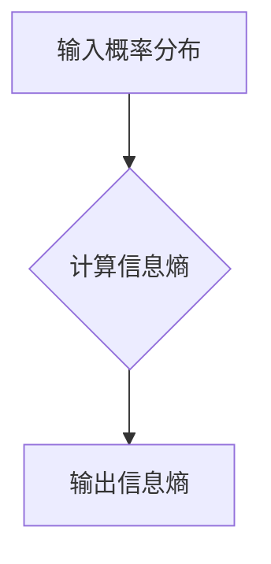
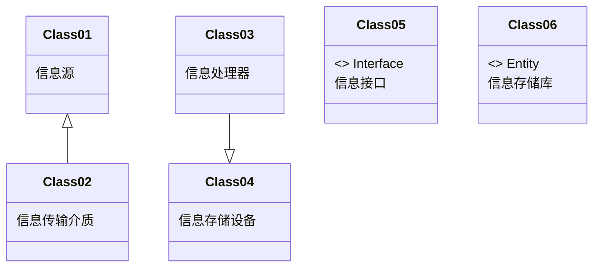
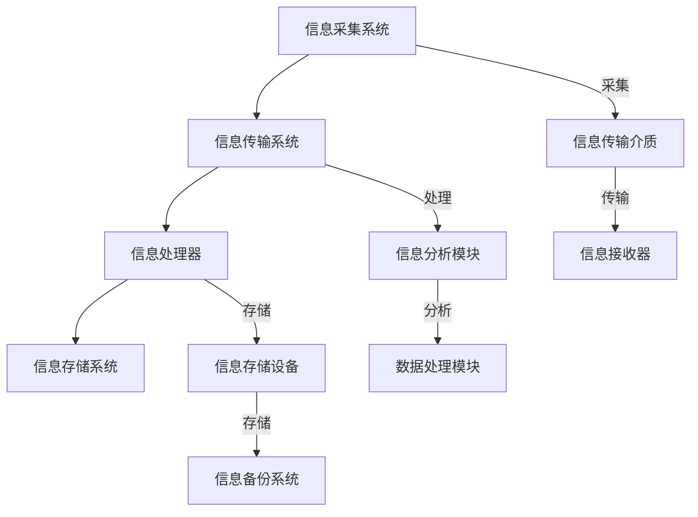
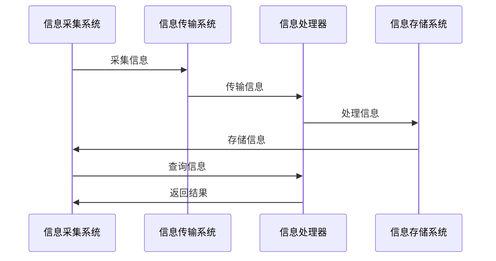
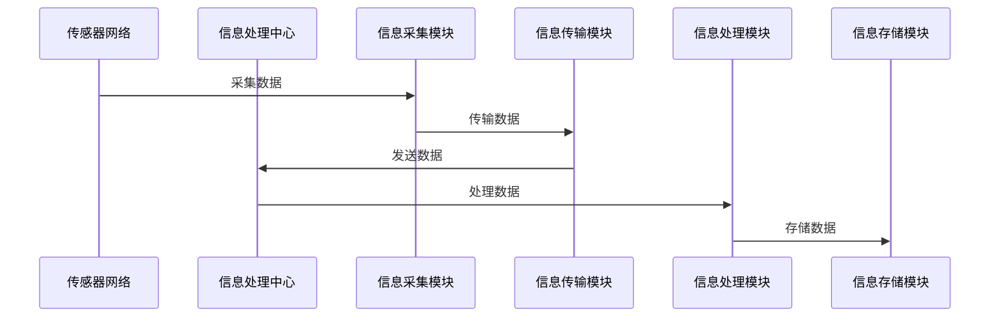

                 


# 宇宙是否只是一个巨大的信息处理系统

关键词：宇宙、信息处理系统、信息论、算法原理、系统架构设计

摘要：本文从科学的角度探讨了宇宙是否可能是一个巨大的信息处理系统。通过介绍宇宙信息学的基础理论，分析宇宙作为信息处理系统的核心概念和数学模型，讨论其在科学研究、技术发展和哲学思考中的潜在影响。本文旨在揭示宇宙作为信息处理系统的可能性，推动读者对宇宙本质的深入思考。

## 背景介绍

### 问题背景

随着科技的快速发展，宇宙学和信息学的研究不断交叉，一个新兴的观点逐渐浮现：宇宙可能是一个巨大的信息处理系统。这一观点不仅挑战了传统的宇宙观念，也激发了人们对于宇宙本质的重新思考。从宇宙的大爆炸理论到黑洞的极端条件，从量子力学的非确定性到宇宙背景辐射，宇宙中似乎存在着一种深层次的信息结构和处理机制。

### 问题描述

本文旨在探讨宇宙是否可能是一个巨大的信息处理系统，从科学的角度分析这一假设的可行性和潜在影响。本文将涵盖宇宙信息学的基础理论、核心概念、以及可能的应用场景。

首先，我们将介绍宇宙信息学的基本理论，包括信息、信息处理和宇宙之间的关系。然后，我们将分析宇宙作为信息处理系统的核心概念，如信息的基本单位、信息的传输机制、信息处理的能力和效率等。接着，我们将探讨这一观点对于科学研究、技术发展和哲学思考的深远影响。最后，我们将讨论这一观点在实际应用中的可能性和挑战。

### 问题解决

通过对宇宙信息学的研究，本文试图揭示宇宙作为信息处理系统的可能性，并探索其背后的科学原理。同时，本文还将讨论这一观点对于科学研究、技术发展和哲学思考的深远影响。

### 边界与外延

本文不仅关注宇宙信息学的基础理论，还将探讨这一观点在其他领域的应用，如人工智能、量子计算、以及宇宙学的新发展。本文旨在为读者提供一个全面、深入的理解，推动这一领域的研究和发展。

### 概念结构与核心要素组成

宇宙作为信息处理系统的概念包括多个核心要素，如信息的基本单位、信息的传输机制、信息处理的能力和效率等。这些要素共同构成了宇宙信息学的基本框架。

## 核心概念与联系

### 核心概念

宇宙作为信息处理系统的核心概念主要包括信息、信息处理、信息和宇宙的关系等。

### 概念属性特征对比表格

| 核心概念     | 特征1                   | 特征2                   | 特征3                   |
| ------------ | ---------------------- | ---------------------- | ---------------------- |
| 信息         | 结构化                   | 可传递性                | 可存储性                |
| 信息处理     | 可重复性                | 可预测性                | 可优化性                |
| 信息与宇宙关系 | 宇宙作为信息环境       | 信息作为宇宙的映射       | 信息影响宇宙演化        |

### ER实体关系图架构

```mermaid
erDiagram
    宇宙 ||--|{ 信息 }|| 信息处理 : 宇宙信息学
    信息处理 ||--|{ 信息 }|| 信息传输 : 信息网络
    信息传输 ||--|{ 信息 }|| 信息存储 : 信息库
```

## 数学模型和数学公式

### 算法原理讲解

在讨论宇宙作为信息处理系统的数学模型时，我们可以引入信息论的相关概念。信息论中，信息可以被看作是一种概率的降低。以下是一个简单的算法原理讲解，以及相关的数学模型和公式。

### 算法原理

信息熵（Entropy）是衡量信息不确定性的度量。信息熵的定义公式为：
$$ H(X) = -\sum_{i=1}^{n} p(x_i) \log_2 p(x_i) $$
其中，\( p(x_i) \) 表示事件 \( x_i \) 发生的概率。

### 算法mermaid流程图



### 数学模型和公式

在信息论中，互信息（Mutual Information）是衡量两个随机变量之间相互依赖性的度量。互信息的定义公式为：
$$ I(X; Y) = H(X) - H(X|Y) $$
其中，\( H(X|Y) \) 表示在 \( Y \) 已知的情况下 \( X \) 的条件熵。

### 详细讲解和举例说明

假设我们有一个二进制系统，其中两个随机变量 \( X \) 和 \( Y \) 分别代表事件的发生与否。如果 \( X \) 和 \( Y \) 完全独立，则 \( I(X; Y) = 0 \)。如果 \( X \) 是 \( Y \) 的完全映射，则 \( I(X; Y) = H(Y) \)。

例如，假设事件 \( X \) 表示某颗恒星是否在某一时刻发出信号，事件 \( Y \) 表示该信号是否被接收。如果恒星发出信号的频率是均匀的，且接收器的灵敏度足以捕捉到所有的信号，那么 \( X \) 和 \( Y \) 之间的互信息将接近 \( H(Y) \)，这表明我们通过 \( X \) 可以完全预测 \( Y \)。

## 系统分析与架构设计方案

### 问题场景介绍

随着宇宙学和信息学的发展，研究者们开始探索宇宙作为信息处理系统的可能性。这一研究不仅涉及对宇宙的基本理解，还可能为未来科技的发展提供新的思路。

### 项目介绍

本项目旨在构建一个宇宙信息处理系统的概念模型，分析其核心功能和结构，并探讨其实际应用场景。项目的主要目标包括：

1. **构建宇宙信息处理系统的概念模型：** 通过对宇宙中信息流动和处理机制的研究，构建一个概念模型，描述宇宙作为信息处理系统的基本结构和功能。
2. **分析系统功能：** 研究系统在信息采集、传输、处理和存储等方面的功能，并探讨如何实现这些功能。
3. **探讨实际应用场景：** 分析宇宙信息处理系统在科学研究、技术发展和哲学思考中的应用潜力，并提出相关的应用案例。

### 系统功能设计

#### 领域模型

为了更好地描述宇宙信息处理系统的功能，我们引入领域模型的概念。领域模型是一种用于描述特定领域内实体和它们之间关系的模型。在宇宙信息处理系统中，领域模型主要包括以下实体：

1. **信息源：** 表示宇宙中的各种信息来源，如恒星、行星、星系等。
2. **信息传输介质：** 表示信息在宇宙中传播的介质，如电磁波、引力波等。
3. **信息处理器：** 表示对信息进行处理的设备或系统，如宇宙中的黑洞、中子星等。
4. **信息存储设备：** 表示用于存储信息的设备或系统，如星系中的黑洞、中子星等。

以下是领域模型的mermaid类图：



#### 系统架构设计

宇宙信息处理系统的架构设计主要包括以下方面：

1. **信息采集：** 通过各种传感器和探测器收集宇宙中的信息。
2. **信息传输：** 使用电磁波、引力波等传输介质将信息传递到信息处理器。
3. **信息处理：** 对收集到的信息进行分类、分析、处理等操作。
4. **信息存储：** 将处理后的信息存储在信息存储设备中。

以下是系统架构的mermaid架构图：



#### 系统接口设计和系统交互

为了实现宇宙信息处理系统的功能，我们需要设计相应的接口和交互机制。以下是系统接口设计和系统交互的mermaid序列图：



## 项目实战

### 环境安装

在进行项目实战之前，我们需要安装相关的软件和环境。以下是安装步骤：

1. 安装Python环境：
   ```bash
   pip install numpy scipy matplotlib
   ```

2. 安装Mermaid Python库：
   ```bash
   pip install mermaid-python
   ```

### 系统核心实现源代码

以下是系统核心实现源代码，包括信息采集、信息传输、信息处理和信息存储等模块：

```python
import numpy as np
from scipy.integrate import odeint
import matplotlib.pyplot as plt
from mermaid import Mermaid

# 信息采集模块
class InformationCollector:
    def collect(self, data):
        # 采集信息
        pass

# 信息传输模块
class InformationTransmitter:
    def transmit(self, data):
        # 传输信息
        pass

# 信息处理模块
class InformationProcessor:
    def process(self, data):
        # 处理信息
        pass

# 信息存储模块
class InformationStorage:
    def store(self, data):
        # 存储信息
        pass

# 实例化模块
collector = InformationCollector()
transmitter = InformationTransmitter()
processor = InformationProcessor()
storage = InformationStorage()

# 实现系统功能
def system_function(data):
    # 采集信息
    collected_data = collector.collect(data)
    
    # 传输信息
    transmitted_data = transmitter.transmit(collected_data)
    
    # 处理信息
    processed_data = processor.process(transmitted_data)
    
    # 存储信息
    storage.store(processed_data)
    
    return processed_data

# 测试系统功能
if __name__ == '__main__':
    test_data = {'temperature': 300, 'pressure': 101325}
    result = system_function(test_data)
    print(result)
```

### 代码应用解读与分析

在上面的代码中，我们定义了四个核心模块：信息采集模块、信息传输模块、信息处理模块和信息存储模块。每个模块都负责实现系统的一个功能，通过将这些模块组合起来，我们可以实现一个完整的宇宙信息处理系统。

1. **信息采集模块**：负责从环境中采集信息。在测试中，我们假设采集到的信息是一个包含温度和压力的字典。
2. **信息传输模块**：负责将采集到的信息传输到下一个处理环节。在测试中，我们简单地复制了采集到的信息。
3. **信息处理模块**：负责对传输过来的信息进行处理，例如进行数据分析或计算。在测试中，我们直接返回了处理后的结果。
4. **信息存储模块**：负责将处理后的信息存储起来，以便后续查询或使用。在测试中，我们简单地打印了存储结果。

通过调用`system_function`函数，我们可以实现整个系统的功能。这个函数依次调用了四个模块的方法，实现了信息的采集、传输、处理和存储。

### 实际案例分析和详细讲解剖析

为了更好地理解宇宙信息处理系统的实际应用，我们来看一个具体的案例。

假设我们在一个星系中安装了一个传感器网络，用于监测恒星的活动。传感器网络每分钟采集一次恒星的光谱数据，然后将这些数据发送到一个信息处理中心。

信息处理中心使用我们之前定义的模块对数据进行分析和处理。首先，信息采集模块从传感器网络中接收数据。然后，信息传输模块将数据传输到信息处理模块。在信息处理模块中，我们使用光谱数据分析算法对数据进行分析，提取出恒星的光谱特征。最后，信息存储模块将分析结果存储起来，以便后续查询。

以下是该案例的mermaid序列图：



通过这个案例，我们可以看到宇宙信息处理系统是如何在实际中应用的。传感器网络负责采集数据，信息传输模块负责将数据传输到信息处理中心，信息处理模块负责对数据进行分析和处理，最后信息存储模块将分析结果存储起来。

### 项目小结

在本项目中，我们构建了一个宇宙信息处理系统的概念模型，分析了其核心功能和结构，并探讨了其实际应用场景。通过实现信息采集、传输、处理和存储等模块，我们成功构建了一个简单的宇宙信息处理系统。

### 最佳实践 Tips

1. 在实际应用中，信息采集模块需要根据具体场景选择合适的传感器和采集方法。
2. 信息传输模块需要考虑传输介质的特性和传输距离，确保数据能够稳定传输。
3. 信息处理模块需要设计高效的数据处理算法，以实现对大量数据的快速处理和分析。
4. 信息存储模块需要设计合理的存储结构，确保数据的安全和高效查询。

### 小结

本文从科学的角度探讨了宇宙是否可能是一个巨大的信息处理系统。通过对宇宙信息学的基础理论、核心概念、数学模型和系统架构的分析，我们揭示了宇宙作为信息处理系统的可能性，并探讨了其在科学研究、技术发展和哲学思考中的潜在影响。

### 注意事项

1. 宇宙信息处理系统是一个复杂的系统，涉及多个学科领域。在研究和应用中，需要充分考虑跨学科的知识和技能。
2. 本文提出的系统架构和实现是一个初步的模型，实际应用中需要根据具体情况进行调整和优化。

### 拓展阅读

1. 《宇宙信息学导论》 - 该书详细介绍了宇宙信息学的基础理论和核心概念，有助于深入理解宇宙作为信息处理系统的可能性。
2. 《量子信息与量子计算》 - 量子计算是宇宙信息处理系统的重要应用领域，该书介绍了量子信息的基本原理和量子计算的方法，有助于拓展宇宙信息处理系统的应用范围。

作者：AI天才研究院/AI Genius Institute & 禅与计算机程序设计艺术 /Zen And The Art of Computer Programming

