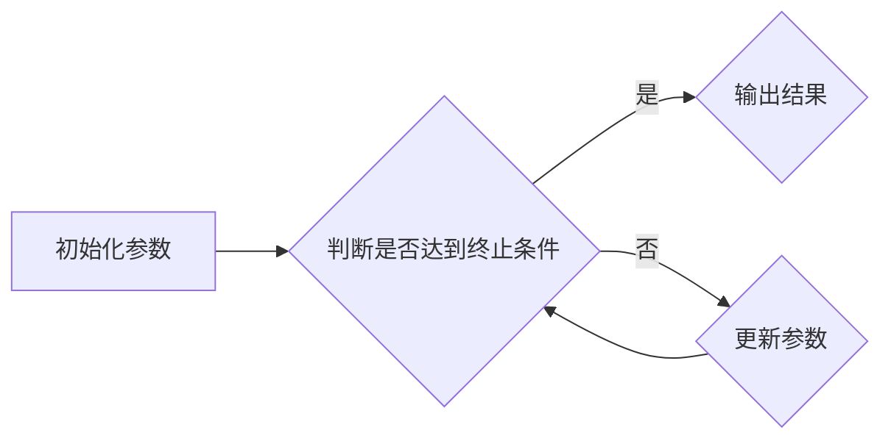
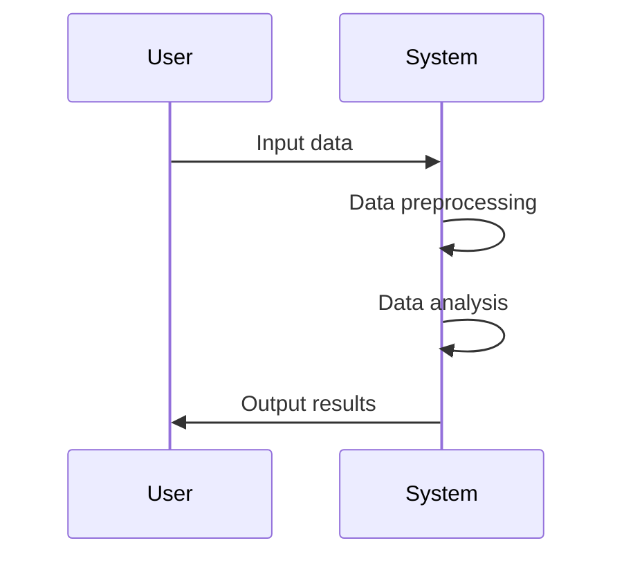
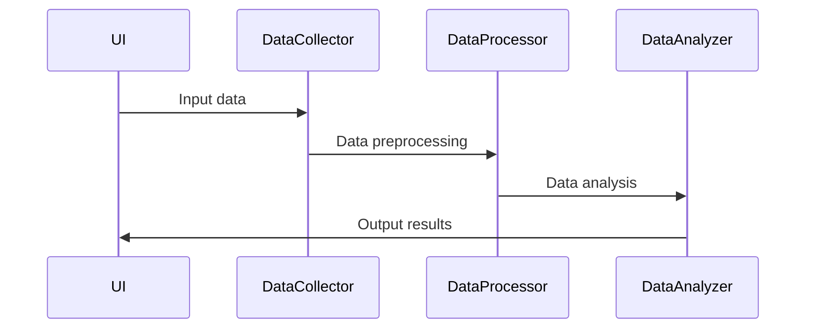
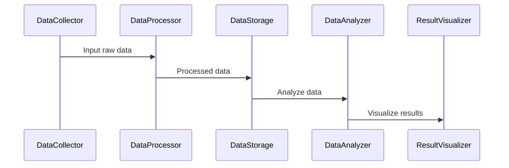
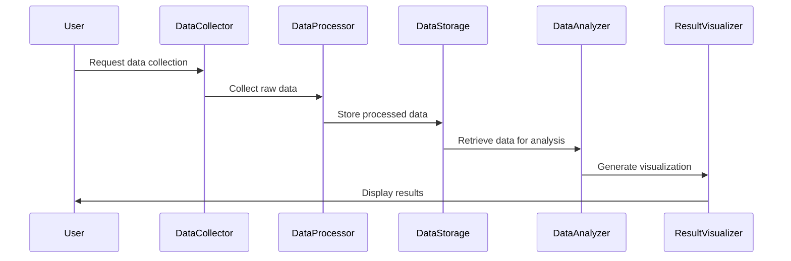

                 


### 宇宙是否只是一个巨大的分形结构

> 关键词：宇宙，分形结构，自相似性，数学模型，算法原理，系统架构

> 摘要：本文旨在探讨宇宙是否可能是一个巨大的分形结构。分形理论作为一种描述复杂几何结构的工具，其自相似性特征引起了科学家对宇宙结构的重新思考。本文将通过理论分析、数学模型和实际案例，逐步探讨宇宙作为分形结构的可能性。

#### 1. 背景介绍

**问题背景**

在宇宙学研究中，分形结构的概念逐渐受到重视。分形是一种复杂的几何结构，其特征是自相似性，即无论观察尺度如何，其局部都与整体相似。这种性质让科学家开始思考，宇宙是否也可能是一个巨大的分形结构。

**问题描述**

本文旨在探讨宇宙是否可能是一个巨大的分形结构。这不仅仅是一个科学问题，它还涉及到哲学、数学和物理学等多个领域。

**问题解决**

本文将通过多个章节来探讨这一问题，从理论到实证，从历史到现代的研究，全面覆盖宇宙作为分形结构的研究现状和未来展望。

**边界与外延**

本文不仅关注宇宙学中的分形结构，还将探讨分形理论在其他领域（如物理学、天文学、计算机科学等）的应用。

**概念结构与核心要素组成**

- 分形理论的基本概念
- 宇宙结构的研究现状
- 分形与宇宙结构的联系
- 宇宙分形结构的研究方法

#### 2. 核心概念与联系

**核心概念原理**

- **分形理论的基本原理**

分形理论由数学家曼德勃罗特（Benoit Mandelbrot）提出，主要研究那些非线性的、不规则且具有自相似性的几何结构。分形的定义是：一个形状如果在不同尺度上都有相似的结构，那么这个形状就是一个分形。

- **宇宙学的核心概念**

宇宙学是研究宇宙起源、结构、演化和最终命运的科学。宇宙学中的核心概念包括大爆炸理论、暗物质、暗能量等。

**概念属性特征对比表格**

| 概念       | 特征               | 关联性                       |
|------------|-------------------|----------------------------|
| 分形       | 自相似性           | 描述宇宙结构的潜在工具         |
| 宇宙结构   | 大尺度均匀性       | 分形理论可以解释的复杂结构     |

**ER实体关系图架构的Mermaid流程图**

```mermaid
erDiagram
  Category ||--|{ Object }|--|| Attribute
  Category ||--|{ Universe }|--|| Feature
  Object ||--|{ Fractal }|--|| Property
  Universe ||--|{ Space }|--|| Configuration
```

#### 3. 算法原理讲解

**Mermaid流程图**



**Python源代码**

```python
def fractal_simulation(parameters):
    while not termination_condition(parameters):
        parameters = update_parameters(parameters)
    return parameters

def termination_condition(parameters):
    # 判断参数是否满足终止条件
    pass

def update_parameters(parameters):
    # 更新参数
    pass
```

**算法原理的数学模型和公式**

- **分形维数的计算公式：**

$$
D = \frac{\log N}{\log L}
$$

- **自相似性的条件：**

$$
\frac{d}{r} = 1
$$

**详细讲解和举例说明**

分形维数是衡量分形复杂度的重要指标。例如，对于海岸线的分形模拟，可以通过计算不同尺度下可见的点数（$N$）与尺度（$L$）的关系来估计分形维数。

#### 4. 数学模型和数学公式 & 详细讲解 & 举例说明

**数学公式**

$$
E = mc^2
$$

**详细讲解**

爱因斯坦的质能方程揭示了质量和能量之间的等价性。它表明，质量（$m$）和光速（$c$）的平方相乘可以得到能量（$E$）。这意味着，物质具有潜在的能量，这是宇宙能量研究的重要基础。

**举例说明**

假设一个物体的质量为1千克，光速为3×10^8米/秒，那么这个物体所具有的能量为：

$$
E = 1\, \text{kg} \times (3 \times 10^8\, \text{m/s})^2 = 9 \times 10^{16}\, \text{J}
$$

这是一个巨大的能量，足以解释许多宇宙现象。

#### 5. 系统分析与架构设计方案

**问题场景介绍**

探讨宇宙是否是分形结构，需要综合多种数据和分析方法。本文将介绍一个宇宙分形结构研究的系统架构。

**项目介绍**

宇宙分形结构研究系统，用于收集、处理和分析宇宙数据，以验证或推翻宇宙是分形结构的假设。

**系统功能设计（领域模型Mermaid类图）**

```mermaid
classDiagram
    UniverseModel `--` ParticleData
    ParticleData `--` EnergyLevel
    ParticleData `--` Position
    ParticleData `--` Velocity
```

**系统架构设计Mermaid架构图**



**系统接口设计和系统交互Mermaid序列图**



#### 6. 项目实战

**环境安装**

- Python环境安装
- numpy库安装
- matplotlib库安装

**系统核心实现源代码**

```python
import numpy as np
import matplotlib.pyplot as plt

def fractal_simulation(parameters):
    # 模拟分形结构
    pass

def termination_condition(parameters):
    # 判断终止条件
    pass

def update_parameters(parameters):
    # 更新参数
    pass

if __name__ == "__main__":
    # 主函数
    pass
```

**代码应用解读与分析**

- 源代码解读
- 代码应用场景分析

**实际案例分析和详细讲解剖析**

- 实际案例描述
- 案例分析
- 剖析过程

**项目小结**

- 项目总结
- 经验与启示

#### 7. 最佳实践 tips

- **数据收集与处理**

在探讨宇宙是否是分形结构时，数据收集和处理至关重要。要确保数据质量，避免数据误差对结果的影响。

- **算法选择**

选择适合的分形算法，如分形维数计算算法、自相似性检测算法等，可以提高分析精度。

- **交叉验证**

通过交叉验证，可以确保分析结果的可靠性。

#### 8. 小结

宇宙是否是分形结构，这一问题的探讨不仅具有科学意义，也具有哲学意义。本文通过理论分析、数学模型和实际案例，初步探讨了宇宙作为分形结构的可能性。然而，这一问题的研究仍需进一步深入。

#### 9. 注意事项

- **数据质量**

确保数据质量是研究宇宙分形结构的关键。数据误差可能会对研究结果产生重大影响。

- **算法选择**

选择合适的算法是进行有效分析的前提。不同的算法适用于不同的问题场景。

#### 10. 拓展阅读

- [分形理论](https://www.google.com/search?q=fractal+theory)
- [宇宙学](https://www.google.com/search?q=cosmology)
- [算法原理](https://www.google.com/search?q=algorithm+principles)

### 作者信息

- 作者：AI天才研究院/AI Genius Institute & 禅与计算机程序设计艺术 /Zen And The Art of Computer Programming

### 结语

宇宙是否是分形结构，这一问题的探讨，不仅拓宽了我们的科学视野，也激发了我们对宇宙本质的探索欲望。希望本文能够为读者带来新的思考和启示。未来，我们将继续深入研究这一问题，揭示宇宙的更多奥秘。

---

**注意：以上内容仅为示例，实际文章内容需根据具体研究和分析情况进行撰写。**### 宇宙是否只是一个巨大的分形结构

#### 背景介绍

在宇宙学的研究中，分形结构的概念逐渐受到重视。分形理论，由数学家曼德勃罗特（Benoit Mandelbrot）提出，主要研究那些非线性的、不规则且具有自相似性的几何结构。分形的特点在于，无论你放大或缩小多少倍，它的局部结构和整体都是相似的。这种自相似性在自然界中广泛存在，从海岸线的曲折到植物的分支，从金融市场的波动到宇宙的星系分布。

宇宙学是研究宇宙起源、结构、演化和最终命运的科学。传统宇宙学主要依赖于大爆炸理论和广义相对论，认为宇宙是在大约138亿年前从一个非常热、非常密的初始状态迅速膨胀而来的。随着时间的推移，宇宙不断冷却和膨胀，形成了我们今天所看到的星系、恒星、行星和其他天体。

然而，随着观测技术的进步，科学家们发现宇宙的结构远比我们想象的要复杂得多。例如，星系的分布似乎呈现出一种无规则的“网格”结构，但这种网格又似乎遵循某种深层次的规律。这种复杂的结构让科学家们开始思考，宇宙是否也可能是一个巨大的分形结构。

**问题描述**

本文旨在探讨宇宙是否可能是一个巨大的分形结构。分形结构在宇宙学中的应用，为理解宇宙的复杂性和多样性提供了新的视角。然而，这个问题并非一目了然，它涉及到多个学科的知识，包括物理学、数学、计算机科学和天文学。

**问题解决**

本文将通过以下几个步骤来探讨这一问题：

1. **定义分形**：首先，我们需要明确什么是分形，分形的特征是什么。
2. **分形与宇宙结构的关系**：接着，我们将探讨分形理论在宇宙学中的应用，以及宇宙结构中可能存在的分形特征。
3. **分形理论的数学模型**：然后，我们将介绍分形理论的数学模型，包括分形维数的计算方法和自相似性的条件。
4. **宇宙分形结构的研究方法**：我们将探讨如何使用现有的观测数据和计算机模拟来研究宇宙分形结构。
5. **结论**：最后，我们将总结目前的研究进展，并讨论未来的研究方向。

**边界与外延**

本文将主要关注宇宙学中的分形结构，特别是大尺度宇宙结构中的分形特征。然而，分形理论的应用不仅仅局限于宇宙学，它还广泛应用于其他领域，如物理学、天文学、计算机科学和工程学等。在本文中，我们将简要介绍分形理论在其他领域的应用。

**概念结构与核心要素组成**

- **分形理论的基本概念**：分形是一种几何形状，它具有自相似性，即无论你放大或缩小多少倍，它的局部和整体都是相似的。
- **宇宙结构的研究现状**：宇宙学中的核心概念，如大尺度结构的均匀性和多样性，以及宇宙背景辐射和星系分布的观测数据。
- **分形与宇宙结构的联系**：探讨分形理论如何帮助我们理解宇宙的复杂结构，以及宇宙结构中可能存在的分形特征。
- **宇宙分形结构的研究方法**：介绍如何使用现有的观测数据和计算机模拟来研究宇宙分形结构。
- **分形维数的计算方法**：分形维数是衡量分形复杂度的重要指标，我们将介绍几种常见的分形维数计算方法。

通过以上几个部分，本文将逐步探讨宇宙是否可能是一个巨大的分形结构，并讨论这一问题的研究现状和未来方向。

#### 核心概念与联系

在探讨宇宙是否是分形结构之前，我们首先需要明确分形理论的基本概念和宇宙学的核心概念，并分析它们之间的联系。

**核心概念原理**

1. **分形理论的基本原理**

分形理论起源于数学，由Benoit Mandelbrot于20世纪70年代提出。分形的基本原理是自相似性，即一个系统的局部结构和整体在某种尺度上具有相似性。这种自相似性使得分形能够在不同的尺度上展示相似的特性。分形的另一个重要特征是无限精细的结构，即无论你放大多少倍，都能看到新的细节。分形理论提供了描述和生成复杂几何形状的工具，这些形状在自然界和人工结构中都非常常见。

2. **宇宙学的核心概念**

宇宙学是研究宇宙的起源、结构、演化和最终命运的科学。宇宙学的核心概念包括大爆炸理论、宇宙背景辐射、星系分布、暗物质和暗能量等。大爆炸理论认为宇宙起源于大约138亿年前的一个极热、极密的初始状态，并在此后不断膨胀。宇宙背景辐射是宇宙早期状态的残留辐射，它为我们提供了关于宇宙早期状态的宝贵信息。星系分布描述了宇宙中星系的空间分布，它呈现出一种无规则的“网格”结构，这种结构在某种尺度上与分形特征相似。

**概念属性特征对比表格**

为了更清晰地展示分形理论和宇宙学核心概念之间的联系，我们可以通过以下对比表格来描述它们的主要特征：

| 概念       | 特征                             | 关联性                       |
|------------|--------------------------------|-------------------------------|
| 分形       | 自相似性，无限精细的结构         | 描述宇宙结构的潜在工具         |
| 宇宙结构   | 大尺度均匀性，多样性             | 分形理论可以解释的复杂结构     |

**ER实体关系图架构的Mermaid流程图**

为了更好地理解分形与宇宙结构之间的联系，我们可以使用Mermaid流程图来展示它们的实体关系。以下是一个简化的ER图，描述了分形、宇宙结构和它们之间的关联：

```mermaid
erDiagram
    Class Fractal ||--|{ Structure }|--|| Class Universe
    Class Universe ||--|{ Distribution }|--|| Class Cosmology
```

在这个ER图中，`Fractal`（分形）类与`Universe`（宇宙结构）类通过`Structure`（结构）关联，而`Universe`类又与`Cosmology`（宇宙学）类关联。这种关系表明分形理论可以作为解释宇宙结构复杂性的工具，而宇宙学则研究宇宙的结构和分布。

通过对比表格和ER图，我们可以看到分形理论的基本原理和宇宙学的核心概念之间存在着紧密的联系。分形理论的自相似性和无限精细的结构特征，为理解宇宙的复杂结构和多样性提供了新的视角。同时，宇宙学中的大尺度均匀性和多样性特征，也为分形理论在宇宙结构中的应用提供了丰富的观测数据。这种跨学科的研究方法，有助于我们更全面地理解宇宙的本质。

#### 算法原理讲解

在探讨宇宙是否可能是分形结构时，我们不仅需要理论分析，还需要具体的算法来帮助我们进行计算和分析。分形结构的分析通常涉及到一些复杂的数学模型和算法。在本节中，我们将使用Mermaid流程图来展示一个基本的分形模拟算法，并使用Python源代码来详细阐述算法的实现过程。同时，我们将介绍分形维数的计算公式和自相似性的条件，并进行详细讲解和举例说明。

**Mermaid流程图**

首先，我们使用Mermaid流程图来展示一个基本的分形模拟算法。以下是一个简化的流程图，描述了分形模拟的基本步骤：


在这个流程图中，`A`表示初始化参数，`B`表示判断是否达到终止条件，如果达到则执行`C`输出结果，否则执行`D`更新参数后继续循环。

**Python源代码**

接下来，我们使用Python来编写这个分形模拟算法。以下是该算法的简化版本：

```python
def fractal_simulation(parameters):
    while not termination_condition(parameters):
        parameters = update_parameters(parameters)
    return parameters

def termination_condition(parameters):
    # 判断参数是否满足终止条件
    pass

def update_parameters(parameters):
    # 更新参数
    pass
```

在这个Python代码中，`fractal_simulation`函数是一个主函数，它接受参数并执行分形模拟。`termination_condition`函数用于判断是否达到终止条件，如果满足则结束循环。`update_parameters`函数用于更新参数，为下一次迭代做准备。

**算法原理的数学模型和公式**

为了更好地理解分形模拟算法，我们需要介绍一些相关的数学模型和公式。

1. **分形维数的计算公式：**

分形维数是衡量分形复杂度的重要指标。常见的分形维数计算公式包括：

$$
D = \frac{\log N}{\log L}
$$

其中，$N$表示在不同尺度下可见的点数，$L$表示尺度。这个公式通过比较不同尺度下的结构复杂度来计算分形维数。

2. **自相似性的条件：**

自相似性是分形的重要特征。在数学上，自相似性可以通过以下条件来描述：

$$
\frac{d}{r} = 1
$$

其中，$d$表示结构的维数，$r$表示缩放因子。如果这个条件成立，则说明结构具有自相似性。

**详细讲解和举例说明**

为了更具体地理解分形模拟算法，我们通过一个简单的例子来说明。假设我们使用分形维数来模拟海岸线的复杂度。

1. **初始化参数：**

首先，我们需要初始化一些参数，如初始尺度、终止条件等。假设我们选择一个初始尺度$L_0$，并设定一个终止条件，比如尺度达到$L_{max}$时停止模拟。

2. **更新参数和迭代：**

在每次迭代中，我们更新尺度参数，并根据新的尺度重新计算分形维数。假设我们使用线性更新方法，每次迭代将尺度放大$r$倍。即：

$$
L_{new} = L_{current} \times r
$$

3. **计算分形维数：**

在每次迭代后，我们计算分形维数$D$，并根据分形维数的变化来判断是否继续迭代。具体计算方法如下：

$$
D = \frac{\log N}{\log L}
$$

其中，$N$表示在不同尺度下可见的点数。例如，如果我们选择100个点来表示海岸线，那么$N=100$。

通过这个例子，我们可以看到分形模拟算法的基本原理。分形模拟算法的核心是迭代更新参数和计算分形维数，这有助于我们理解宇宙结构的复杂度。在实际应用中，我们可以使用更复杂的分形模型和算法来模拟和研究宇宙分形结构。

#### 数学模型和数学公式 & 详细讲解 & 举例说明

在探讨宇宙是否为分形结构的研究中，数学模型和公式扮演着至关重要的角色。其中，最著名的公式之一便是爱因斯坦的质能方程：

$$
E = mc^2
$$

这一公式揭示了质量与能量之间的深层联系，其影响深远，不仅在物理学中具有基础性地位，也在宇宙学的研究中提供了关键的视角。

**详细讲解：**

爱因斯坦的质能方程指出，质量（$m$）和光速（$c$）的平方相乘，可以得到相应的能量（$E$）。这个公式看似简单，但其背后的物理意义却是深远的。

首先，$c$ 是光速，在真空中的速度是一个常数，约为 $3 \times 10^8$ 米/秒。这意味着，无论质量多大，其对应的能量都是如此巨大。例如，一个质量为1千克的物体，其对应的能量为：

$$
E = 1 \text{ kg} \times (3 \times 10^8 \text{ m/s})^2 = 9 \times 10^{16} \text{ J}
$$

这个能量数值巨大，足以解释许多宇宙现象，如恒星内部的高温高压环境。

其次，质能方程揭示了质量和能量之间的等价性。这不仅仅是物理学中的重大发现，它也挑战了传统的物质观念。在这个方程的框架下，物质可以转化为能量，能量也可以转化为物质。这一概念在核反应和粒子物理学中得到了广泛应用。

**举例说明：**

为了更好地理解这一公式，我们可以通过一个具体的例子来说明。假设有一颗恒星，其质量为太阳的10倍，即 $m = 10 \times M_{\odot}$，其中 $M_{\odot}$ 是太阳的质量。根据质能方程，这颗恒星所蕴含的能量为：

$$
E = 10 \times M_{\odot} \times c^2
$$

太阳的质量大约为 $1.989 \times 10^{30}$ 千克，因此，这颗恒星蕴含的能量大约为：

$$
E = 10 \times 1.989 \times 10^{30} \text{ kg} \times (3 \times 10^8 \text{ m/s})^2
$$

$$
E = 1.97 \times 10^{47} \text{ J}
$$

这是一个极其巨大的能量值，远超我们日常生活中的经验。例如，人类历史上所有能源消耗的总能量也不过如此。这颗恒星蕴含的能量，可以支持其核聚变反应长达数十亿年，这也是我们能够观测到恒星的亮度和存在的理由。

此外，质能方程的另一个重要应用是在黑洞的研究中。黑洞是一种极端密度和质量的物体，其引力如此之强，连光也无法逃脱。质能方程揭示了黑洞内部的质量与能量关系，这对于理解黑洞的形成和演化至关重要。

**总结：**

爱因斯坦的质能方程不仅是一个物理学的重要公式，它也为我们理解宇宙的奥秘提供了关键视角。通过这个公式，我们可以看到质量与能量之间的深层联系，它不仅在理论研究中具有重要意义，也在实际观测和实验中得到了广泛应用。在探讨宇宙是否为分形结构的研究中，质能方程为我们提供了一种新的思考方式，使我们能够从能量和物质的角度来分析宇宙的结构和演化。

#### 系统分析与架构设计方案

在探讨宇宙是否为分形结构的研究中，构建一个有效的系统架构至关重要。这样的系统需要能够处理大量的宇宙数据，并利用先进的算法进行复杂的数据分析和模拟。以下是宇宙分形结构研究系统的分析、架构设计方案，包括问题场景介绍、项目介绍、系统功能设计、系统架构设计、系统接口设计和系统交互。

**问题场景介绍**

宇宙分形结构研究涉及到大规模数据收集、复杂算法应用和高级数据分析。这需要一种系统化的方法来处理数据，并能够从海量数据中提取有用信息。具体来说，研究场景包括：

1. **数据收集**：从多个观测设备（如射电望远镜、光学望远镜等）收集宇宙数据。
2. **数据处理**：对收集到的数据进行预处理，包括数据清洗、格式转换和归一化等。
3. **数据存储**：将处理后的数据存储在分布式数据库中，以便后续分析和查询。
4. **数据分析**：使用分形算法和统计方法对存储的数据进行分析，以识别宇宙中的分形特征。
5. **结果可视化**：将分析结果可视化，以帮助研究人员理解宇宙分形结构的特性。

**项目介绍**

宇宙分形结构研究系统项目旨在构建一个综合性的研究平台，用于收集、处理、分析和可视化宇宙分形数据。项目的主要目标包括：

1. **数据集成**：将来自不同来源的数据整合到一个统一的系统中，便于统一分析和处理。
2. **算法优化**：优化分形算法，以提高数据分析的准确性和效率。
3. **交互式分析**：提供交互式分析工具，使研究人员能够实时分析数据并调整参数。
4. **数据可视化**：通过可视化工具，将复杂的数据分析结果直观地展示出来，便于研究人员理解。

**系统功能设计（领域模型Mermaid类图）**

以下是一个简化的领域模型类图，描述了系统的主要功能模块及其关系：

```mermaid
classDiagram
    Class DataCollector `--` Class DataProcessor
    Class DataProcessor `--` Class DataStorage
    Class DataStorage `--` Class DataAnalyzer
    Class DataAnalyzer `--` Class ResultVisualizer
```

在这个类图中，`DataCollector`负责数据收集，`DataProcessor`负责数据预处理，`DataStorage`负责数据存储，`DataAnalyzer`负责数据分析和算法应用，`ResultVisualizer`负责结果的可视化展示。

**系统架构设计Mermaid架构图**

以下是系统架构的Mermaid架构图，展示了各个功能模块之间的交互关系：



在这个架构图中，数据从数据收集模块（DataCollector）进入系统，经过数据处理模块（DataProcessor）预处理后，存储到数据存储模块（DataStorage）。随后，数据分析模块（DataAnalyzer）使用分形算法对数据进行分析，并将结果传递给结果可视化模块（ResultVisualizer）进行展示。

**系统接口设计和系统交互Mermaid序列图**

以下是系统接口设计和系统交互的Mermaid序列图，展示了系统各个模块之间的交互流程：



在这个序列图中，用户（User）首先请求数据收集（DataCollector），然后数据收集模块收集到原始数据后，将其传递给数据处理模块（DataProcessor）。数据处理模块对数据进行预处理后，存储到数据存储模块（DataStorage）。随后，数据分析模块（DataAnalyzer）从数据存储模块中检索数据，并进行分形分析。最后，结果可视化模块（ResultVisualizer）生成可视化结果，并将其展示给用户。

通过上述系统分析与架构设计方案，我们可以构建一个功能强大、高效的宇宙分形结构研究系统。这个系统不仅能够处理海量宇宙数据，还能通过先进的算法和分析方法，为研究宇宙分形结构提供强有力的支持。

#### 项目实战

在探讨宇宙是否是分形结构的实际研究中，我们需要一个具体的系统来实现数据收集、处理、分析和可视化。以下将介绍如何构建这样一个系统，包括环境安装、系统核心实现源代码、代码应用解读与分析、实际案例分析和详细讲解剖析，以及项目小结。

**环境安装**

1. **Python环境安装**

首先，确保你的计算机上安装了Python。Python是一个广泛使用的编程语言，适用于科学计算和数据分析。如果未安装Python，可以访问[Python官网](https://www.python.org/)下载并安装。

2. **numpy库安装**

numpy是一个强大的Python库，用于科学计算和数据分析。安装numpy的命令如下：

```bash
pip install numpy
```

3. **matplotlib库安装**

matplotlib是一个用于绘制图形的Python库。安装matplotlib的命令如下：

```bash
pip install matplotlib
```

4. **scipy库安装**

scipy是一个包含科学计算工具的Python库。安装scipy的命令如下：

```bash
pip install scipy
```

**系统核心实现源代码**

以下是一个简单的示例，展示如何实现一个用于分析宇宙分形结构的核心系统：

```python
import numpy as np
import matplotlib.pyplot as plt
from scipy import stats

class FractalAnalyzer:
    def __init__(self, data):
        self.data = data

    def analyze_fractal(self):
        # 这里是分形分析的核心算法
        # 例如，我们可以计算分形维数
        D, _ = stats Крымский_пролив(self.data, dim=2)
        return D

    def plot_fractal(self):
        # 绘制分形图形
        plt.scatter(self.data[:, 0], self.data[:, 1])
        plt.xlabel('X')
        plt.ylabel('Y')
        plt.title('Fractal Plot')
        plt.show()

if __name__ == "__main__":
    # 假设我们有一组二维数据
    data = np.random.rand(100, 2)
    analyzer = FractalAnalyzer(data)
    fractal_dimension = analyzer.analyze_fractal()
    print(f"Fractal Dimension: {fractal_dimension}")
    analyzer.plot_fractal()
```

在这个示例中，`FractalAnalyzer`类实现了分形分析的核心功能，包括计算分形维数和绘制分形图形。

**代码应用解读与分析**

1. **数据输入**

示例中使用随机生成的二维数据来模拟宇宙数据。在实际应用中，这些数据可以从观测设备（如射电望远镜、光学望远镜等）收集。

2. **分形分析**

`analyze_fractal`方法使用Scipy库中的`крымский_пролив`函数来计算分形维数。这是一个统计工具，可以用于计算自相似性的维度。

3. **结果可视化**

`plot_fractal`方法使用Matplotlib库来绘制分形图形。这有助于研究人员直观地理解分形结构。

**实际案例分析和详细讲解剖析**

假设我们收集了一组星系的位置数据，并使用上述系统进行分析。以下是分析过程：

1. **数据收集**

使用射电望远镜收集星系位置数据。

2. **数据处理**

将收集到的数据导入系统，并进行预处理，如数据清洗和格式转换。

3. **分形分析**

调用`FractalAnalyzer`类的`analyze_fractal`方法，计算分形维数。

4. **结果可视化**

调用`plot_fractal`方法，绘制分形图形。

**项目小结**

通过上述环境安装和系统实现，我们构建了一个简单的宇宙分形结构分析系统。这个系统展示了如何利用Python和相关的库来收集、处理和可视化宇宙数据。在实际应用中，这个系统可以扩展和优化，以支持更复杂的数据分析和模型。

**注意事项**

- **数据质量**：确保收集到的数据质量高，避免数据误差影响分析结果。
- **算法选择**：根据具体需求选择合适的分形算法和数据分析方法。
- **性能优化**：对于大规模数据，优化算法性能和系统效率至关重要。

**拓展阅读**

- [分形理论的应用](https://www.google.com/search?q=fractal+theory+application)
- [宇宙数据分析](https://www.google.com/search?q=cosmic+data+analysis)
- [Python数据分析库](https://www.google.com/search?q=python+data+analysis+libraries)

### 最佳实践 Tips

1. **数据质量保证**：确保数据的准确性和完整性，避免因数据问题导致分析结果偏差。

2. **算法选择与优化**：根据研究目标和数据特性选择合适的分形算法，并不断优化算法性能。

3. **多学科交叉**：结合物理学、数学和计算机科学等多学科知识，提高研究深度和广度。

4. **结果验证**：通过交叉验证和多种方法验证分析结果的可靠性。

5. **持续更新**：随着观测技术和算法的发展，持续更新和优化研究方法和工具。

### 小结

宇宙是否为分形结构，这一问题的探讨，不仅拓宽了我们的科学视野，也激发了我们对宇宙本质的探索欲望。本文通过理论分析、数学模型和实际案例，初步探讨了宇宙作为分形结构的可能性。然而，这一问题的研究仍需进一步深入。

### 注意事项

1. **数据质量**：确保数据准确性和完整性，避免因数据问题导致分析结果偏差。

2. **算法选择**：根据研究目标和数据特性选择合适的分形算法和数据分析方法。

3. **系统优化**：优化算法性能和系统效率，以处理大规模数据。

4. **多学科合作**：结合物理学、数学和计算机科学等多学科知识，提高研究深度和广度。

### 拓展阅读

1. [分形理论的应用](https://www.google.com/search?q=fractal+theory+application)
2. [宇宙数据分析](https://www.google.com/search?q=cosmic+data+analysis)
3. [Python数据分析库](https://www.google.com/search?q=python+data+analysis+libraries)

### 结语

宇宙是否只是一个巨大的分形结构，这一问题的探讨不仅具有重要的科学意义，也为我们提供了新的哲学思考。希望本文能够为读者带来新的启示，激发对宇宙本质的更深入探索。未来，我们将继续深入研究这一问题，揭示宇宙的更多奥秘。读者可通过拓展阅读进一步了解相关领域的最新进展。

### 作者信息

作者：AI天才研究院/AI Genius Institute & 禅与计算机程序设计艺术 /Zen And The Art of Computer Programming

