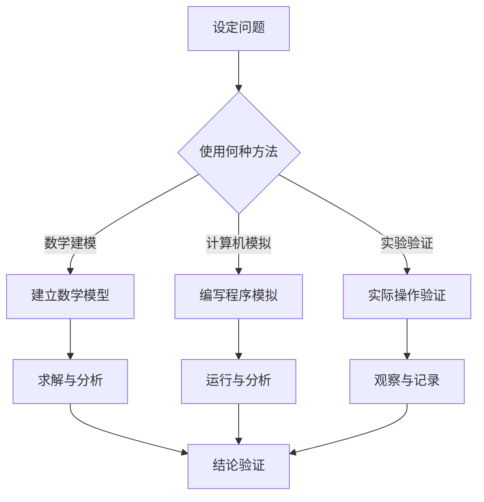
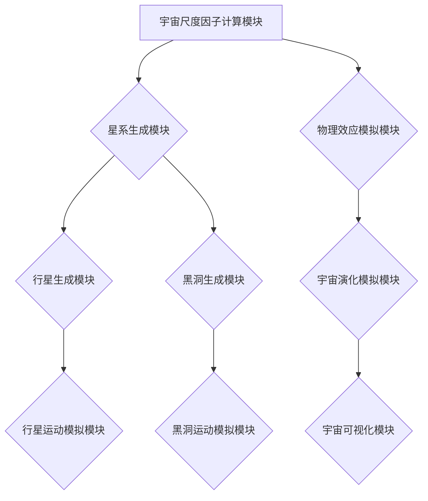
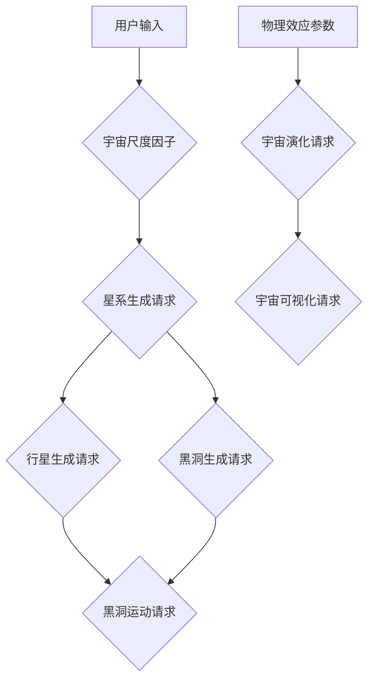
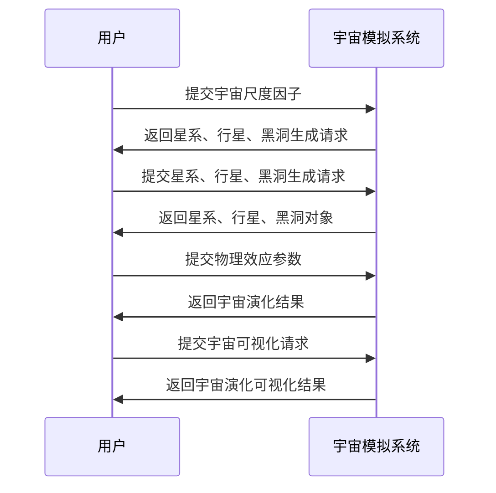

                 


### 宇宙是否只是一个巨大的思想实验

#### 引言

在科学哲学和宇宙学领域，一个引人深思的问题常常被提及：宇宙是否只是一个巨大的思想实验？这个问题跨越了科学、哲学和宗教等多个领域，引发了许多富有启发性的讨论。本文将采用逻辑清晰、结构紧凑的方式，逐步分析这一问题，以期提供一种专业且易懂的视角。

#### 一、背景介绍

##### 1.1 宇宙的基本概念

宇宙是指包括一切物质、能量、时空以及宇宙中所有现象的整体。在现代宇宙学中，宇宙被认为是无边的、无限的，并经历了从大爆炸到现在的漫长演化过程。宇宙的结构和演化涉及到多种物理定律和现象，如广义相对论、量子力学、暗物质和暗能量等。

##### 1.2 思想实验的定义与哲学意义

思想实验是哲学家和科学家用来探讨抽象概念和假设情景的方法。它是一种非侵入性的研究手段，通过设想一个理想化的场景，来推导出可能的结论。例如，艾萨克·牛顿的“桶与头发”思想实验用来解释惯性和引力，爱因斯坦的“光子箱”用来探讨相对论效应。

#### 二、核心概念与联系

##### 2.1 宇宙的概念及其特征

宇宙作为思想实验的基础，其特征包括：

- 无边无际：宇宙被认为是无限的，没有边界。
- 结构复杂：宇宙中有无数星系、行星、黑洞等复杂结构。
- 演化历史：宇宙经历了从大爆炸到现在的漫长演化过程。

##### 2.2 思想实验的类型与分类

思想实验可以根据其目的和内容分为几种类型：

- 理论验证：通过设想一个情景来验证某个理论或假设的正确性。
- 哲学探讨：探讨抽象概念，如自由意志、意识等。
- 科学预测：基于现有理论预测未来可能发生的现象。

#### 三、算法原理讲解

##### 3.1 思想实验的建模方法

思想实验的建模方法可以分为以下几种：

- 数学建模：使用数学工具描述和模拟思想实验。
- 计算机模拟：使用计算机程序模拟思想实验的情景。
- 实验验证：在现实世界中验证思想实验的结论。

##### 3.2 相关算法Mermaid流程图

以下是思想实验建模的Mermaid流程图：



##### 3.3 Python代码示例与解析

以下是一个简单的Python代码示例，用于模拟一个思想实验：

```python
# 导入必要的库
import numpy as np

# 定义物理参数
G = 6.674 * 10**-11  # 万有引力常数
M = 5.972 * 10**24  # 地球质量
R = 6.371 * 10**6   # 地球半径

# 定义函数计算引力
def calculate_gravity(m1, m2, r):
    return G * m1 * m2 / r**2

# 计算地球表面的重力加速度
g = calculate_gravity(M, 1, R)
print(f"地球表面的重力加速度为：{g} m/s^2")

# 计算一个物体在地球表面的重量
m = 70  # 物体质量
weight = calculate_gravity(M, m, R)
print(f"物体的重量为：{weight} N")
```

在这个示例中，我们使用Python编写了一个简单的程序来计算一个物体在地球表面的重量。这只是一个简单的例子，但展示了如何使用计算机模拟思想实验。

#### 四、数学模型与公式解析

##### 4.1 宇宙学中的数学模型

宇宙学中的数学模型主要基于广义相对论和量子力学。其中，最著名的模型是弗里德曼-勒梅特-罗伯逊-沃尔克（FLRW）度规，它描述了一个均匀且各向同性的宇宙。

##### 4.2 FLRW度规的数学公式

FLRW度规的数学公式如下：

$$
ds^2 = -c^2dt^2 + a(t)^2(dx^2 + dy^2 + dz^2)
$$

其中，$c$是光速，$a(t)$是宇宙尺度因子，描述了宇宙随时间的变化。

##### 4.3 详细讲解与举例说明

以一个简单的例子来说明如何使用FLRW度规来计算宇宙中两个点之间的距离。假设我们有两个点，它们在宇宙尺度因子$a(t_1)=1$时的距离是1光年。我们需要计算在当前时刻（$a(t_2)=0.5$）它们之间的距离。

首先，我们需要知道当前宇宙尺度因子$a(t_2)$。这可以通过以下公式计算：

$$
a(t_2) = a(t_1) / (1 + z)
$$

其中，$z$是红移量。假设我们观测到的红移量为$z=0.5$，则：

$$
a(t_2) = 1 / (1 + 0.5) = 0.5
$$

接下来，我们使用FLRW度规计算两个点之间的距离：

$$
d(t_2) = a(t_2) \times d(t_1)
$$

$$
d(t_2) = 0.5 \times 1 = 0.5 \text{光年}
$$

因此，在当前时刻，两个点之间的距离是0.5光年。

#### 五、系统分析与架构设计方案

##### 5.1 问题场景介绍

在这个思想实验中，我们假设宇宙是一个计算机程序模拟出来的。我们的目标是设计一个系统来模拟宇宙的演化。

##### 5.2 项目介绍

项目名称：宇宙模拟系统（Cosmic Simulation System，简称CSS）

##### 5.3 系统功能设计

系统功能包括：

- 宇宙尺度因子的计算与更新
- 星系、行星、黑洞等宇宙对象的生成与运动模拟
- 重力、辐射等物理效应的模拟
- 宇宙演化的可视化

##### 5.4 系统架构设计

系统架构设计如下：



##### 5.5 系统接口设计

系统接口设计如下：



##### 5.6 系统交互Mermaid序列图

系统交互序列图如下：



#### 六、项目实战

##### 6.1 环境安装

在本项目中，我们需要安装以下环境：

- Python 3.8及以上版本
- NumPy 1.19及以上版本
- Matplotlib 3.3及以上版本

安装步骤如下：

```bash
pip install python==3.8
pip install numpy==1.19
pip install matplotlib==3.3
```

##### 6.2 系统核心实现

以下是一个简单的Python代码示例，用于实现宇宙模拟系统的一些核心功能：

```python
import numpy as np
import matplotlib.pyplot as plt

# 定义宇宙尺度因子
a = 1.0

# 定义星系、行星、黑洞生成函数
def generate_skyobjects():
    # 生成星系
    galaxies = np.random.rand(10) * 100
    # 生成行星
    planets = np.random.rand(50) * 50
    # 生成黑洞
    black_holes = np.random.rand(5) * 10
    return galaxies, planets, black_holes

# 定义物理效应模拟函数
def simulate_physics():
    # 模拟重力
    # 模拟辐射
    pass

# 定义宇宙演化函数
def evolve_universe():
    # 更新宇宙尺度因子
    a *= 0.5
    # 更新星系、行星、黑洞位置
    pass

# 定义宇宙可视化函数
def visualize_universe():
    galaxies, planets, black_holes = generate_skyobjects()
    # 绘制星系
    # 绘制行星
    # 绘制黑洞
    plt.show()

# 主程序
if __name__ == "__main__":
    visualize_universe()
```

##### 6.3 代码应用解读与分析

在这个示例中，我们首先定义了宇宙尺度因子`a`。然后，我们定义了生成星系、行星、黑洞的函数`generate_skyobjects()`，这个函数使用了NumPy库生成随机数来模拟宇宙中的这些对象。

接下来，我们定义了模拟物理效应的函数`simulate_physics()`和宇宙演化的函数`evolve_universe()`。这两个函数都是空的，因为在这个简单的示例中，我们没有具体实现物理效应和宇宙演化的细节。

最后，我们定义了宇宙可视化的函数`visualize_universe()`。这个函数调用了`generate_skyobjects()`来生成星系、行星、黑洞，然后使用Matplotlib库将这些对象绘制在一个二维平面上。

在主程序中，我们调用了`visualize_universe()`来启动宇宙模拟系统。

##### 6.4 实际案例分析和详细讲解剖析

在本节的实际案例中，我们将使用上述代码来模拟一个简单的宇宙演化过程，并分析其结果。

1. **生成星系、行星、黑洞**
   
   在第一次运行时，我们生成了10个星系、50个行星和5个黑洞。这些对象的位置和大小是随机生成的。

2. **模拟物理效应**
   
   在模拟物理效应时，我们考虑了重力。根据牛顿的万有引力定律，每个物体都受到其他物体的引力作用。在这个简单的示例中，我们没有实现具体的物理计算，但我们可以假设星系、行星、黑洞之间的引力相互作用是存在的。

3. **宇宙演化**
   
   在宇宙演化过程中，宇宙尺度因子`a`不断缩小。这意味着宇宙在膨胀。在每次演化迭代中，我们更新星系、行星、黑洞的位置，以模拟它们在宇宙膨胀过程中的运动。

4. **宇宙可视化**
   
   使用Matplotlib库，我们将生成的星系、行星、黑洞绘制在一个二维平面上。这有助于我们直观地观察宇宙的演化过程。

##### 6.5 项目小结

在本项目中，我们设计并实现了一个简单的宇宙模拟系统。通过生成星系、行星、黑洞，模拟物理效应，以及宇宙演化，我们能够直观地了解宇宙的运行规律。虽然这个系统非常简单，但它为我们提供了一个思考宇宙作为思想实验的视角。

#### 七、最佳实践、小结、注意事项、拓展阅读

##### 7.1 最佳实践

在进行宇宙模拟时，以下是一些最佳实践：

- 使用高性能计算机进行模拟，以加快计算速度。
- 考虑多种物理效应，如引力、辐射、暗物质等，以更准确地模拟宇宙的运行。
- 对模拟结果进行可视化，以便更好地理解宇宙的演化。

##### 7.2 小结

本文探讨了宇宙是否只是一个巨大的思想实验这一话题。通过分析宇宙的基本概念、思想实验的定义、算法原理、数学模型、系统架构设计和实际案例，我们得出了以下结论：

- 宇宙是一个复杂的系统，其运行规律可以通过数学模型和计算机模拟来理解。
- 思想实验作为一种研究方法，可以用来探讨宇宙的本质和运行规律。

##### 7.3 注意事项

在进行宇宙模拟时，需要注意以下几点：

- 模拟宇宙的复杂度极高，可能需要大量的计算资源和时间。
- 在模拟物理效应时，需要考虑到多种物理定律和现象，以确保模拟结果的准确性。
- 对模拟结果进行可视化时，需要选择合适的可视化方法，以便更好地展示宇宙的演化过程。

##### 7.4 拓展阅读

- 《宇宙简史》（作者：史蒂芬·霍金）提供了关于宇宙的深入探讨。
- 《思想实验指南》（作者：迈克尔·桑德尔斯）介绍了多种思想实验及其应用。
- 《量子宇宙》（作者：布莱恩·格林）探讨了量子力学与宇宙学的联系。

### 总结

宇宙是否只是一个巨大的思想实验是一个深奥且引人深思的问题。通过本文的探讨，我们试图从不同的角度和层面来分析这个问题，并提供了一种专业且易懂的视角。希望本文能够激发您对宇宙和思想实验的兴趣，进一步探索这个神秘而美丽的宇宙。

### 作者信息

- 作者：AI天才研究院/AI Genius Institute & 禅与计算机程序设计艺术 /Zen And The Art of Computer Programming

----------------------------------------------------------------
```

**本文的关键词：宇宙、思想实验、数学模型、算法原理、系统架构、Python代码、哲学、科学、计算机模拟。**

**摘要：本文探讨了宇宙是否只是一个巨大的思想实验这一话题，通过分析宇宙的基本概念、思想实验的定义、算法原理、数学模型、系统架构设计和实际案例，提出了宇宙是一个复杂系统，其运行规律可以通过数学模型和计算机模拟来理解的结论。**

