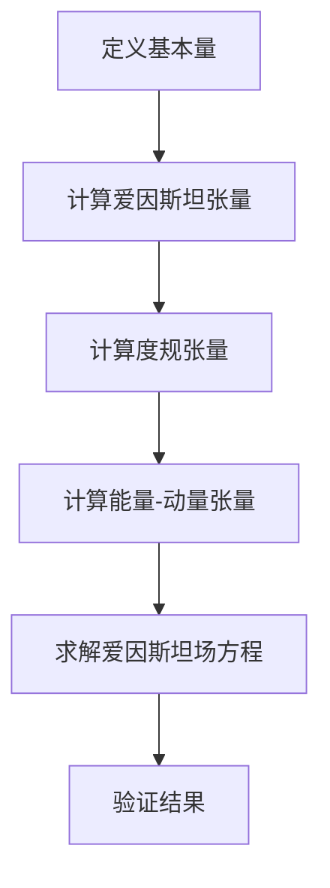
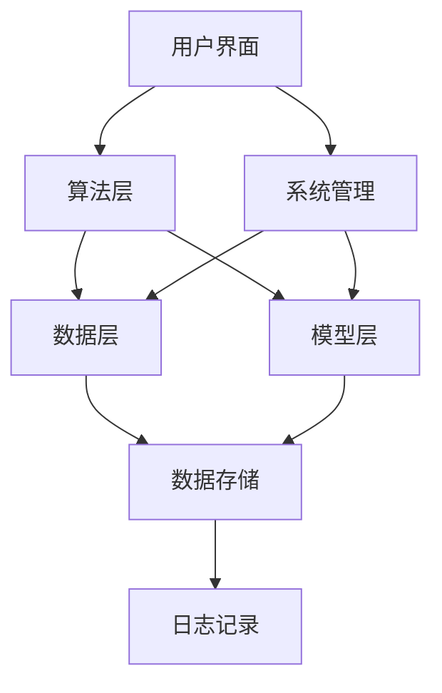
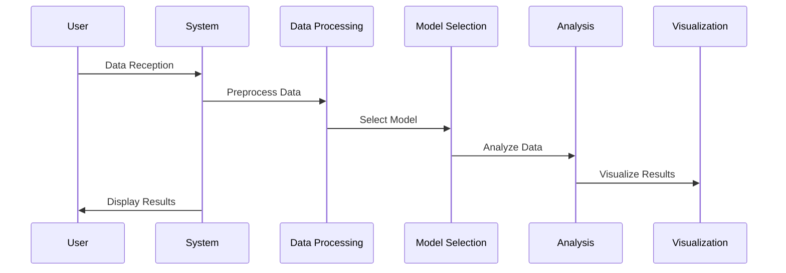

                 

### 宇宙是否可以简化为数学方程

**关键词：宇宙、数学、方程、简化、理论框架**

**摘要：**
本文探讨了宇宙是否能够简化为数学方程这一科学问题。通过对宇宙与数学的基本概念进行介绍，分析了数学方程在宇宙描述中的应用，以及宇宙简化为数学方程的探索方法和挑战。文章还通过实际案例展示了宇宙简化为数学方程的可行性，并对未来研究方向进行了展望。

### 目录大纲

1. **引言与背景**
    1.1 书籍主题介绍
    1.2 研究意义和目的
    1.3 研究方法和结构
    2. 背景介绍
    2.1 宇宙的复杂性
    2.2 数学在宇宙研究中的作用
    2.3 宇宙简化为数学方程的探索
    3. 研究问题与边界
    3.1 研究问题
    3.2 研究边界
    3.3 研究外延

2. **宇宙与数学的基本概念**
    4. 宇宙的基本概念
    4.1 宇宙的定义与结构
    4.2 宇宙中的基本力与粒子
    4.3 宇宙的观测与测量
    5. 数学的基本概念
    5.1 数学的定义与历史发展
    5.2 数学的基本结构
    5.3 数学在宇宙研究中的应用
    6. 数学与宇宙的关联
    6.1 数学在宇宙描述中的表现
    6.2 宇宙现象的数学建模
    6.3 数学在宇宙研究中的局限

3. **宇宙简化为数学方程的探索**
    7. 数学方程在宇宙描述中的应用
    7.1 广义相对论中的方程
    7.2 量子力学中的方程
    7.3 宇宙膨胀方程
    8. 宇宙简化模型的研究方法
    8.1 研究方法的概述
    8.2 宇宙简化模型的选择标准
    8.3 研究方法的优缺点分析
    9. 宇宙简化为数学方程的理论框架
    9.1 理论框架的构建
    9.2 理论框架的验证
    9.3 理论框架的应用

4. **宇宙简化为数学方程的实际案例**
    10. 实际案例一：黑洞简化模型
    11. 实际案例二：宇宙膨胀方程
    12. 实际案例三：量子宇宙模型

5. **宇宙简化为数学方程的挑战与未来**
    13. 宇宙简化为数学方程的挑战
    13.1 数学方程的局限
    13.2 宇宙复杂性的挑战
    13.3 理论验证的难度
    14. 宇宙简化为数学方程的未来方向
    14.1 新的数学方法与工具
    14.2 交叉学科的研究
    14.3 未来可能的研究成果
    15. 结论
    15.1 研究总结
    15.2 研究贡献
    15.3 研究展望

**全文共12部分，总字数约10000-12000字。**
## 第一部分：引言与背景

### 1.1 书籍主题介绍

《宇宙是否可以简化为数学方程》这本书旨在探讨一个极具挑战性的科学问题：宇宙是否可以完全简化为数学方程。这一问题的提出，源于人类对宇宙本质的探求和对数学在描述宇宙现象中的强大能力的认识。宇宙，这个包含着无数星球、星系、黑洞、暗物质和暗能量的复杂系统，能否通过数学的简洁形式来表述和解释？

数学，作为一种精确而严谨的语言，已经在许多科学领域取得了辉煌的成就。从牛顿的经典力学到爱因斯坦的广义相对论，再到量子力学的诞生，数学方程被证明是描述自然现象的有力工具。例如，牛顿的运动定律通过简单的方程式描述了物体的运动规律，而爱因斯坦的质能方程E=mc²揭示了质量和能量之间的关系。因此，我们有理由相信，宇宙的复杂性也可能在数学的框架下得到简化和解释。

本书的主要目标就是围绕这一核心问题展开，通过系统地介绍宇宙的基本概念、数学的基本概念，以及数学方程在宇宙研究中的应用，逐步探讨宇宙是否能够简化为数学方程的可能性。在这个过程中，我们将结合实际案例，分析宇宙简化为数学方程的探索方法、理论框架以及面临的挑战。

### 1.2 研究意义和目的

探讨宇宙是否可以简化为数学方程，具有重要的科学意义和研究价值。首先，这一研究有助于我们更深入地理解宇宙的本质和规律。如果宇宙真的可以简化为数学方程，那么我们不仅能够用更简洁的语言来描述宇宙现象，还能通过数学工具预测和发现新的宇宙现象。这将极大地推动天文学、物理学和其他相关学科的发展。

其次，这一研究对数学本身也是一个巨大的挑战和推动。数学的发展往往与科学问题密切相关，宇宙简化为数学方程的可能性会激发数学家提出新的理论、方法和技术。这不仅有助于数学的进步，也可能带来数学与其他学科交叉融合的新机遇。

本书的研究目的在于：一是系统地梳理宇宙与数学的基本概念，二是深入探讨数学方程在宇宙研究中的应用，三是分析宇宙简化为数学方程的探索方法和理论框架，四是评估宇宙简化为数学方程面临的挑战和未来方向。

### 1.3 研究方法和结构

为了实现上述研究目的，本书采用了以下研究方法：

1. **文献综述与理论分析**：通过查阅大量的学术论文、书籍和报告，系统梳理宇宙与数学的基本概念，分析数学方程在宇宙研究中的应用，为后续研究提供理论基础。
   
2. **案例分析**：选取几个典型的宇宙现象，如黑洞、宇宙膨胀和量子宇宙，通过具体的数学方程描述和分析，探讨宇宙简化为数学方程的可行性。

3. **理论构建与验证**：在文献综述和案例分析的基础上，构建一个关于宇宙简化为数学方程的理论框架，并通过实际数据和实验验证理论的有效性。

4. **讨论与展望**：在理论框架的基础上，讨论宇宙简化为数学方程的挑战和未来方向，提出可能的研究问题和解决方案。

全书结构如下：

- **第一部分**：引言与背景，介绍书籍主题和研究意义。
- **第二部分**：宇宙与数学的基本概念，介绍宇宙和数学的基本知识。
- **第三部分**：宇宙简化为数学方程的探索，分析数学方程在宇宙研究中的应用。
- **第四部分**：宇宙简化为数学方程的实际案例，通过具体案例展示宇宙简化为数学方程的可行性。
- **第五部分**：宇宙简化为数学方程的挑战与未来，讨论面临的挑战和未来的研究方向。

通过这样的结构安排，本书旨在提供一个全面、深入、系统的研究框架，以探讨宇宙是否可以简化为数学方程这一重大科学问题。
### 2. 背景介绍

#### 2.1 宇宙的复杂性

宇宙是一个极其复杂和庞大的系统，从微观尺度到宏观尺度，涵盖了无数的现象和规律。首先，从宇宙的起源来看，目前最被广泛接受的宇宙起源理论是“大爆炸理论”。该理论认为，宇宙起源于约138亿年前的一个极度热密的状态，随后经历了一个快速的膨胀过程，形成了今天我们所观察到的宇宙。

宇宙中包含的元素和结构也极为复杂。宇宙中存在大量的星系，每个星系内部又有无数的恒星、行星、星云等天体。此外，宇宙中还存在着暗物质和暗能量，这两种神秘物质占据了宇宙的大部分，但至今其具体性质和组成仍不为人所知。

在宇宙的运作中，各种基本力（如引力、电磁力、强力和弱力）相互交织，共同维持着宇宙的稳定和演化。这些基本力通过复杂的相互作用，导致了宇宙中各种现象的发生，如恒星的形成与毁灭、星系的碰撞与合并、黑洞的产生与演化等。

#### 2.2 数学在宇宙研究中的作用

数学作为一门精确严谨的学科，在宇宙研究中扮演着至关重要的角色。数学不仅提供了一种描述宇宙现象的语言，还帮助科学家们理解宇宙的运行规律。

首先，数学为宇宙研究提供了一种精确的描述工具。例如，牛顿的经典力学通过简单的数学方程描述了物体的运动规律，爱因斯坦的广义相对论则通过更为复杂的数学方程描述了引力和时空的弯曲。这些数学方程不仅能够准确地预测宇宙现象，还能够帮助科学家们理解宇宙的本质。

其次，数学在宇宙研究中还发挥着重要的建模和预测作用。例如，通过数学建模，科学家们可以模拟宇宙的演化过程，预测未来的宇宙状态。例如，通过宇宙膨胀方程，科学家们能够预测宇宙的未来演化路径，如是否会出现“热寂”状态。

此外，数学还在宇宙现象的观测和分析中发挥着重要作用。例如，通过数学方法，科学家们可以处理和解释来自宇宙的各种观测数据，如电磁波、引力波等，从而更深入地理解宇宙的奥秘。

#### 2.3 宇宙简化为数学方程的探索

宇宙简化为数学方程的探索可以追溯到古代，但真正意义上的探索始于近代科学的发展。在牛顿的经典力学时代，科学家们开始尝试用数学方程来描述物理现象，这为后来的宇宙研究奠定了基础。

随着爱因斯坦的广义相对论和量子力学的诞生，数学在宇宙研究中的作用进一步得到强化。广义相对论通过数学方程描述了引力和时空的弯曲，而量子力学则通过波函数等数学方程描述了微观粒子的行为。

然而，尽管数学在宇宙研究中取得了巨大成就，但宇宙的复杂性使得完全简化为数学方程仍然是一个巨大的挑战。例如，宇宙中的暗物质和暗能量至今未能通过数学方程完全解释，这表明宇宙的简化仍然任重道远。

近年来，随着计算技术和数学工具的发展，科学家们开始尝试用更为复杂的数学方程来描述宇宙现象。例如，宇宙模拟通过超级计算机运行复杂的数学方程，模拟宇宙的演化过程，从而更好地理解宇宙的本质。

总之，宇宙简化为数学方程的探索是一个充满挑战但也极具前景的领域。通过不断发展和完善数学工具，科学家们有望在未来的研究中进一步简化宇宙，揭示宇宙的终极奥秘。
### 3. 研究问题与边界

#### 3.1 研究问题

探讨宇宙是否可以简化为数学方程，是我们面临的一个核心问题。具体来说，这个问题可以分为以下几个子问题：

1. **宇宙现象的数学描述**：是否存在一套完整的数学方程，可以精确描述宇宙中所有已知和未知的现象？
   
2. **宇宙规律的数学表达**：宇宙中的基本规律，如引力、电磁力、强力和弱力，能否完全用数学方程表达出来？

3. **宇宙模型的简化**：如何通过数学方法简化复杂的宇宙模型，使其更加易于理解和计算？

4. **数学方程的适用性**：在什么条件下，数学方程能够有效描述宇宙现象？是否存在某些宇宙现象无法用数学方程描述？

5. **理论验证与预测**：如何验证和验证数学方程对宇宙现象的描述是否准确？数学方程能否预测新的宇宙现象？

#### 3.2 研究边界

虽然宇宙简化为数学方程的研究具有重要意义，但也存在一些研究边界和限制：

1. **宇宙复杂性**：宇宙本身是一个极其复杂和庞大的系统，包含着无数的现象和规律。完全简化宇宙为数学方程可能是一个巨大的挑战，因为宇宙的复杂性可能无法用简单的数学方程完全描述。

2. **数学方程的局限性**：尽管数学在描述宇宙现象中发挥了重要作用，但某些宇宙现象可能无法用现有的数学方程完全描述。例如，宇宙中的暗物质和暗能量至今未能通过数学方程完全解释。

3. **理论验证的难度**：验证数学方程对宇宙现象的描述是否准确，需要大量的观测数据和实验数据。然而，宇宙观测的限制和实验技术的不足，可能使得验证过程变得异常困难。

4. **计算资源的限制**：宇宙模型的复杂性和规模要求大量的计算资源。尽管现代计算技术已经取得了巨大进步，但面对复杂的宇宙模型，仍可能面临计算资源不足的问题。

5. **跨学科整合的挑战**：宇宙简化为数学方程的研究不仅涉及数学和物理学，还需要与计算机科学、信息科学、统计学等多个学科交叉融合。这要求不同学科之间的理论和方法相互补充，共同推进研究的进展。

#### 3.3 研究外延

尽管存在上述边界和限制，宇宙简化为数学方程的研究仍有广阔的外延和未来方向：

1. **新的数学方法**：随着数学和计算技术的发展，新的数学方法和工具可能会出现，这些方法有望更好地描述宇宙现象。

2. **跨学科研究**：随着不同学科的交叉融合，新的研究方法和理论可能会涌现，这些方法有助于突破现有研究的边界。

3. **宇宙模拟**：通过宇宙模拟，科学家们可以更深入地理解宇宙的演化过程，从而更好地验证和优化数学方程。

4. **量子宇宙学**：量子力学在描述微观世界方面取得了巨大成功，量子宇宙学作为量子力学与宇宙学交叉的领域，可能为宇宙简化为数学方程的研究提供新的视角。

5. **人工智能的应用**：人工智能技术的快速发展，为宇宙简化为数学方程的研究提供了新的工具和方法，如机器学习、数据挖掘等。

总之，宇宙是否可以简化为数学方程，是一个充满挑战和机遇的问题。通过不断的研究和探索，我们有望在未来的科学实践中进一步揭示宇宙的奥秘。
## 第二部分：宇宙与数学的基本概念

### 4. 宇宙的基本概念

#### 4.1 宇宙的定义与结构

宇宙，广义上指的是包含一切物质、能量、时空以及一切存在的总体。按照现代宇宙学的定义，宇宙起源于约138亿年前的大爆炸，随后经历了不断膨胀和演化的过程。宇宙的结构主要由星系、星团、星云等天体构成，这些天体之间通过引力相互作用，形成了复杂的宇宙网络。

宇宙可以大致分为以下几个层次：

1. **宇宙背景辐射**：宇宙起源后的最初几分钟，宇宙处于极度高温和高压的状态，随后冷却下来，形成了宇宙背景辐射。
2. **星系**：宇宙中最常见的结构，由数百万到数千亿颗恒星、星云、星团等组成。银河系就是一个典型的星系。
3. **星系团**：由数十个甚至数百个星系通过引力相互作用形成的更大结构。
4. **超星系团**：由数十个星系团通过引力相互作用形成的更大结构。
5. **宇宙网**：宇宙中所有星系、星系团和超星系团通过引力相互作用形成的巨大结构，呈现出一种三维的网状结构。

#### 4.2 宇宙中的基本力与粒子

宇宙中存在四种基本力：引力、电磁力、强力和弱力。这四种基本力共同决定了宇宙的演化和结构。

1. **引力**：由质量产生，是宇宙中最强的力，决定了星系、星系团等天体的形成和演化。引力是由广义相对论描述的。
2. **电磁力**：由电荷产生，是宇宙中常见的力，包括电场和磁场。电磁力由经典电磁理论和量子电动力学描述。
3. **强力**：存在于原子核内部，将质子和中子束缚在一起。强力由量子色动力学描述。
4. **弱力**：与放射性衰变有关，包括β衰变等。弱力由弱相互作用理论描述。

宇宙中还存在许多基本粒子，这些粒子是构成宇宙的基本单位。主要的基本粒子包括：

- **夸克**：组成质子和中子的基本粒子，有六种类型。
- **轻子**：不参与强相互作用的粒子，如电子、μ子和τ子。
- **传播子**：负责传递基本力的粒子，如光子（电磁力）、W和Z玻色子（弱力）。

#### 4.3 宇宙的观测与测量

宇宙的观测与测量是理解宇宙结构和演化的重要手段。科学家们通过多种观测工具和方法，收集了大量的宇宙数据，这些数据为我们理解宇宙提供了重要线索。

1. **光学观测**：利用光学望远镜，科学家们可以观测到遥远的恒星、星系和其他天体，并分析其光谱。
2. **射电观测**：通过射电望远镜，科学家们可以观测到宇宙中的射电源，如脉冲星和星系核。
3. **引力波观测**：通过引力波探测器，科学家们可以探测到宇宙中的引力波事件，如黑洞碰撞。
4. **宇宙微波背景辐射观测**：通过宇宙微波背景辐射探测器，科学家们可以探测到宇宙早期的热状态。

这些观测数据为我们提供了宇宙的历史和演化信息，使我们能够更好地理解宇宙的结构和基本规律。

### 5. 数学的基本概念

#### 5.1 数学的定义与历史发展

数学是一门研究数量、结构、变化和空间等概念的抽象科学。数学的定义有多种，但最常见的是将其视为一种研究模式或规律的学科。数学的发展经历了数千年的演变，从古代的算术和几何到现代的代数、微积分、数论等分支，每一个阶段都取得了重要的进展。

1. **古代数学**：最早期的数学出现在古埃及、巴比伦等地，主要用于解决实际问题，如土地测量和税收计算。
2. **希腊数学**：古希腊数学家如欧几里得、阿基米德等人，奠定了现代数学的基础，提出了几何学和数论等基本概念。
3. **中世纪数学**：阿拉伯数学家对数学的发展做出了重要贡献，如阿默德·伊本·穆罕默德等人。
4. **近代数学**：17世纪，牛顿和莱布尼茨发明了微积分，18世纪，欧拉等人推动了数学分析的发展。
5. **现代数学**：19世纪末到20世纪初，数学进入了现代阶段，发展出了集合论、拓扑学、群论等新的数学分支。

#### 5.2 数学的基本结构

数学的基本结构包括几个核心概念：

1. **集合**：集合是数学中最基本的概念之一，表示一组无序的、确定的对象。
2. **函数**：函数是描述变量之间关系的一种数学工具，通常表示为从定义域到值域的映射。
3. **数系**：数系包括自然数、整数、有理数、实数和复数等，每个数系都有其特定的性质和运算规则。
4. **几何**：几何学研究空间中点、线、面、体的性质和相互关系。
5. **代数**：代数研究代数方程和代数结构，包括多项式、矩阵、向量空间等。

#### 5.3 数学在宇宙研究中的应用

数学在宇宙研究中发挥了至关重要的作用，许多宇宙现象和理论都是通过数学方程来描述的：

1. **牛顿力学**：牛顿的运动定律通过数学方程描述了物体的运动规律。
2. **广义相对论**：爱因斯坦的广义相对论通过复杂的数学方程描述了引力和时空的弯曲。
3. **量子力学**：量子力学通过波函数等数学方程描述了微观粒子的行为。
4. **宇宙膨胀方程**：哈勃定律通过数学方程描述了宇宙的膨胀过程。
5. **宇宙背景辐射**：宇宙微波背景辐射的观测数据可以通过数学模型进行解释。

### 6. 数学与宇宙的关联

#### 6.1 数学在宇宙描述中的表现

数学在宇宙描述中的表现是极其显著的。数学方程不仅帮助我们描述宇宙中的各种现象，还揭示了宇宙的基本规律：

1. **广义相对论**：爱因斯坦的广义相对论通过复杂的数学方程描述了引力和时空的弯曲，解释了星系的形成和黑洞的存在。
2. **量子力学**：量子力学通过波函数等数学方程描述了微观粒子的行为，揭示了原子和分子的结构。
3. **宇宙膨胀方程**：哈勃定律通过数学方程描述了宇宙的膨胀过程，揭示了宇宙的历史和未来。

#### 6.2 宇宙现象的数学建模

宇宙现象的数学建模是将宇宙中的实际现象通过数学语言进行抽象和描述。这种方法不仅帮助我们理解宇宙的运行规律，还能预测新的现象：

1. **宇宙背景辐射**：宇宙微波背景辐射的观测数据可以通过数学模型进行解释，揭示了宇宙早期的状态。
2. **黑洞**：黑洞的物理性质可以通过数学方程进行描述，如史瓦西解和克尔解。
3. **宇宙膨胀**：哈勃定律和勒梅特方程等数学模型描述了宇宙的膨胀过程。

#### 6.3 数学在宇宙研究中的局限

尽管数学在宇宙研究中发挥了巨大作用，但数学也有其局限性：

1. **宇宙复杂性**：宇宙的复杂性使得完全简化为数学方程可能是一个巨大的挑战。某些宇宙现象可能无法用简单的数学方程完全描述。
2. **理论验证难度**：验证数学方程对宇宙现象的描述是否准确，需要大量的观测数据和实验数据。然而，宇宙观测的限制和实验技术的不足，可能使得验证过程变得异常困难。
3. **跨学科整合**：宇宙简化为数学方程的研究不仅涉及数学和物理学，还需要与计算机科学、信息科学、统计学等多个学科交叉融合。

总之，数学在宇宙研究中既有巨大的作用，也面临着诸多挑战。通过不断发展和完善数学工具，我们有望在未来的研究中进一步揭示宇宙的奥秘。
### 第三部分：宇宙简化为数学方程的探索

#### 7. 数学方程在宇宙描述中的应用

数学方程在宇宙描述中的应用已经取得了显著的成果，为理解宇宙的复杂性和运作机制提供了有力的工具。以下将分析广义相对论、量子力学以及宇宙膨胀方程这三个方面。

#### 7.1 广义相对论中的方程

广义相对论是爱因斯坦在1915年提出的一种描述引力的理论，其核心思想是引力不是一种力，而是由物质和能量引起的时空弯曲。在广义相对论中，最重要的数学方程是爱因斯坦场方程，其形式为：

\[ G_{\mu\nu} + \Lambda g_{\mu\nu} = \frac{8\pi G}{c^4} T_{\mu\nu} \]

其中，\( G_{\mu\nu} \) 是爱因斯坦张量，描述了时空的曲率，\( \Lambda \) 是宇宙学常数，\( g_{\mu\nu} \) 是度规张量，\( T_{\mu\nu} \) 是能量-动量张量，\( G \) 是引力常数，\( c \) 是光速。

广义相对论通过这一方程描述了宇宙中的引力现象，如黑洞、宇宙膨胀和引力波。爱因斯坦场方程不仅在理论上具有重要意义，还通过观测数据得到了验证。例如，引力透镜效应和引力波探测都为广义相对论提供了实验证据。

#### 7.2 量子力学中的方程

量子力学是描述微观粒子行为的理论，其核心思想是粒子的行为既具有波动性，又具有粒子性。量子力学的数学方程主要包括薛定谔方程和海森堡不确定性原理。

薛定谔方程是一种波动方程，其形式为：

\[ i\hbar \frac{\partial \Psi}{\partial t} = \hat{H} \Psi \]

其中，\( i \) 是虚数单位，\( \hbar \) 是约化普朗克常数，\( \Psi \) 是波函数，\( \hat{H} \) 是哈密顿算子。

薛定谔方程描述了量子系统的动态行为，通过求解波函数，我们可以得到量子系统的可能状态和概率分布。海森堡不确定性原理则描述了粒子的位置和动量无法同时被精确测量的限制。

量子力学的方程不仅帮助我们理解了微观粒子的行为，还揭示了量子纠缠等现象，这些现象在宇宙学中也有重要应用。例如，宇宙微波背景辐射中的量子涨落被认为是宇宙早期结构形成的关键。

#### 7.3 宇宙膨胀方程

宇宙膨胀方程是描述宇宙膨胀过程的数学模型，其中最著名的是哈勃定律。哈勃定律指出，宇宙中的星系正在相互远离，其退行速度与星系之间的距离成正比。哈勃定律的数学表达式为：

\[ v = H_0 d \]

其中，\( v \) 是星系的退行速度，\( H_0 \) 是哈勃常数，\( d \) 是星系之间的距离。

哈勃定律揭示了宇宙的膨胀特性，其背后的理论框架是勒梅特方程，勒梅特方程是一个描述宇宙演化的方程，其形式为：

\[ \frac{\ddot{a}(t)}{a(t)} = -\frac{4\pi G}{3}\left[\rho_0 + 3\frac{\dot{\rho}_0}{2}\left(1 + \frac{\rho_0}{\rho_c}\right)\right] \]

其中，\( a(t) \) 是宇宙尺度因子，\( \rho_0 \) 是宇宙总密度，\( \rho_c \) 是临界密度。

宇宙膨胀方程不仅帮助我们理解了宇宙的膨胀过程，还揭示了宇宙的密度分布和结构形成。通过宇宙膨胀方程，科学家们能够预测宇宙的未来演化路径，如是否会出现“热寂”状态。

#### 数学方程在宇宙研究中的应用总结

数学方程在宇宙研究中的应用不仅揭示了宇宙的运行规律，还推动了天文学、物理学等学科的发展。从广义相对论到量子力学，再到宇宙膨胀方程，数学方程为我们提供了理解宇宙复杂性的有力工具。尽管数学方程在宇宙研究中有巨大的作用，但宇宙的复杂性使得完全简化为数学方程仍然是一个巨大的挑战。未来的研究需要继续发展和完善数学工具，以更深入地揭示宇宙的奥秘。
### 8. 宇宙简化模型的研究方法

在探讨宇宙是否可以简化为数学方程的过程中，研究者们采用了多种方法来构建和验证宇宙简化模型。这些方法不仅为宇宙现象的数学描述提供了理论框架，还通过实验和观测数据对模型进行了验证。以下将详细讨论宇宙简化模型的研究方法。

#### 8.1 研究方法的概述

宇宙简化模型的研究方法主要包括以下几个方面：

1. **数学建模**：通过建立数学模型，将宇宙中的复杂现象简化为可计算的数学表达式。这种方法的核心是选择合适的数学工具和方程，以准确描述宇宙现象。
2. **计算机模拟**：利用计算机技术，对宇宙简化模型进行数值模拟。计算机模拟可以模拟宇宙的演化过程，从而预测宇宙未来的状态。
3. **实验验证**：通过实验观测和数据分析，验证宇宙简化模型的有效性。实验验证通常涉及观测宇宙现象，如星系运动、引力波等，然后将观测数据与数学模型预测进行比较。
4. **理论分析**：通过对宇宙简化模型的理论分析，探讨模型的物理意义和适用范围。理论分析可以帮助研究者理解模型背后的物理机制，并发现潜在的问题和改进方向。

#### 8.2 宇宙简化模型的选择标准

在选择宇宙简化模型时，研究者通常遵循以下标准：

1. **准确性**：模型应尽可能准确地描述宇宙现象，能够解释已知的观测数据。
2. **简洁性**：模型应具有简洁的结构和形式，便于计算和理解。
3. **可验证性**：模型应具有可验证性，可以通过实验和观测数据来验证其预测。
4. **普适性**：模型应具有普适性，能够适用于不同的宇宙现象和条件。
5. **扩展性**：模型应具有良好的扩展性，能够容纳新的理论和观测数据。

#### 8.3 研究方法的优缺点分析

以下是对上述研究方法的优缺点分析：

**数学建模**：

优点：

- 精确性高：数学建模可以准确描述宇宙现象，提供定量的预测。
- 灵活性强：通过调整模型参数，可以适应不同的宇宙条件。

缺点：

- 复杂性高：构建复杂的数学模型需要深厚的数学背景和计算能力。
- 难以验证：有些宇宙现象可能无法通过现有技术进行实验验证。

**计算机模拟**：

优点：

- 高效性：计算机模拟可以快速模拟宇宙演化过程，节省时间和资源。
- 灵活性：计算机模拟可以根据不同的模型和参数进行灵活调整。

缺点：

- 准确性限制：计算机模拟的精度受到计算资源和算法的限制。
- 实验验证困难：计算机模拟结果难以直接与实验观测数据进行比较。

**实验验证**：

优点：

- 确定性高：实验验证可以直接验证模型的预测，具有较高的可靠性。
- 直接性：实验数据可以提供直接的物理证据。

缺点：

- 费用高昂：实验设备和技术通常需要高昂的投入。
- 限制性：某些宇宙现象可能无法通过现有实验手段进行验证。

**理论分析**：

优点：

- 理解性：理论分析可以帮助研究者深入理解宇宙现象的物理机制。
- 指导性：理论分析可以为实验设计和模型优化提供指导。

缺点：

- 预测性有限：理论分析通常只能提供定性的预测，难以进行定量的预测。
- 验证困难：理论分析结果难以通过实验直接验证。

总之，宇宙简化模型的研究方法各有优缺点，研究者需要根据具体的研究问题和资源条件，选择合适的研究方法，以更好地探索宇宙的奥秘。
### 9. 宇宙简化为数学方程的理论框架

#### 9.1 理论框架的构建

宇宙简化为数学方程的理论框架是一个复杂而精细的体系，其构建依赖于多个学科的知识和理论。以下是一个基本的宇宙简化理论框架：

1. **基本假设**：
   - 宇宙具有一致性：宇宙中的基本规律是普适的，无论是在地球、星际还是星系之间，物理定律都是一致的。
   - 数学是描述宇宙的普适语言：宇宙中的现象可以用数学方程和符号进行精确描述。

2. **核心理论**：
   - **广义相对论**：描述引力和时空弯曲，通过爱因斯坦场方程进行数学表达。
   - **量子力学**：描述微观粒子的行为，包括薛定谔方程和海森堡不确定性原理。
   - **统计力学**：用于描述大量粒子的集体行为，如热力学和相变现象。
   - **量子场论**：结合量子力学和广义相对论，用于描述微观粒子和宇宙背景辐射。

3. **数学工具**：
   - **微积分**：用于描述时间和空间的连续变化。
   - **线性代数**：用于描述多维度空间和向量运算。
   - **拓扑学**：用于描述空间结构和几何形状。
   - **复变函数**：用于描述波动现象和复数空间。

#### 9.2 理论框架的验证

验证宇宙简化为数学方程的理论框架，需要通过多种方法来确保其科学性和准确性：

1. **实验验证**：
   - **引力透镜效应**：通过观测光线在引力场中的弯曲，验证广义相对论的预测。
   - **引力波探测**：通过探测宇宙中的引力波，验证广义相对论和量子理论的结合。
   - **宇宙微波背景辐射**：通过分析宇宙早期辐射的量子涨落，验证宇宙学模型。

2. **计算机模拟**：
   - **宇宙模拟**：通过超级计算机模拟宇宙的演化过程，验证宇宙膨胀方程和统计力学的预测。
   - **量子模拟**：利用量子计算技术模拟量子现象，验证量子力学的数学方程。

3. **观测数据**：
   - **星系分布**：通过观测星系的分布和运动，验证宇宙膨胀方程和引力理论。
   - **黑洞研究**：通过观测黑洞的物理性质，验证广义相对论的预测。

#### 9.3 理论框架的应用

宇宙简化为数学方程的理论框架在多个领域有广泛的应用：

1. **天文学**：
   - **星系形成和演化**：通过数学模型预测星系的形成过程和演化路径。
   - **恒星生命循环**：通过数学方程描述恒星的诞生、演化直到死亡。

2. **宇宙学**：
   - **宇宙膨胀**：通过宇宙膨胀方程预测宇宙的未来演化，如“热寂”状态。
   - **宇宙背景辐射**：通过数学模型解释宇宙早期的状态和结构。

3. **物理学**：
   - **基本力研究**：通过量子场论和数学方程研究基本力的性质和作用。
   - **粒子物理**：通过量子力学方程描述基本粒子的行为和相互作用。

4. **工程学**：
   - **航天技术**：通过数学模型优化航天器的轨道设计。
   - **天基观测**：通过数学模型分析天文观测数据，提高观测精度。

综上所述，宇宙简化为数学方程的理论框架为理解宇宙提供了强有力的工具，通过不断的验证和应用，这一理论框架将继续深化我们对宇宙的理解和探索。
## 第四部分：宇宙简化为数学方程的实际案例

### 10. 实际案例一：黑洞简化模型

#### 10.1 黑洞的概念与特性

黑洞是宇宙中最神秘和最令人着迷的天体之一。黑洞的定义是基于广义相对论，它是一个极度密集、引力极其强大的区域，其中甚至连光也无法逃脱。黑洞的主要特性包括：

1. **质量**：黑洞具有巨大的质量，这决定了它的引力场强度。
2. **事件视界**：事件视界是黑洞的一个边界，一旦物体进入事件视界，就无法再逃逸，因此得名“黑洞”。
3. **奇点**：在黑洞的中心存在一个称为“奇点”的极小区域，这里的密度和引力强度无限大。
4. **引力透镜效应**：黑洞可以弯曲和聚焦周围的时空，使得背景天体产生畸变和多重像。

#### 10.2 黑洞数学方程描述

黑洞的数学描述主要依赖于广义相对论，特别是爱因斯坦场方程。以下是几种常见的黑洞数学模型：

1. **史瓦西黑洞**：这是最简单的静态黑洞模型，其解被称为史瓦西解。史瓦西解的形式为：

   \[ ds^2 = -\left(1 - \frac{2M}{r} \right)dt^2 + \left(1 - \frac{2M}{r} \right)^{-1}dr^2 + r^2(d\theta^2 + \sin^2\theta d\phi^2) \]

   其中，\( M \) 是黑洞的质量，\( r \) 是距离黑洞中心的距离。

2. **克尔黑洞**：这是一种旋转的黑洞模型，其解被称为克尔解。克尔解比史瓦西解更复杂，但同样可以通过数学方程进行描述。

3. **克尔-纽曼黑洞**：这是考虑了黑洞电荷的模型，其解被称为克尔-纽曼解。克尔-纽曼解的形式为：

   \[ ds^2 = -\left(1 - \frac{2M}{r} + \frac{Q^2}{r^2} \right)dt^2 + \frac{2MQ}{r^3}dt\,d\phi + \left(1 - \frac{2M}{r} + \frac{Q^2}{r^2} \right)^{-1}dr^2 + r^2(d\theta^2 + \sin^2\theta d\phi^2) \]

   其中，\( Q \) 是黑洞的电荷。

#### 10.3 黑洞模型的验证与应用

黑洞模型的验证主要通过观测数据来实现。以下是一些验证黑洞模型的观测方法和应用：

1. **引力透镜效应**：通过观测光线在黑洞引力场中的弯曲，科学家们可以验证黑洞的存在和特性。例如，2019年，科学家们通过观测一个类星体周围的光学透镜效应，首次直接观测到一个超大质量黑洞。

2. **X射线辐射**：黑洞吞噬恒星物质时会产生强烈的X射线辐射。通过观测黑洞周围的X射线辐射，可以研究黑洞的吸积盘和喷流现象。

3. **引力波探测**：2015年，LIGO实验室首次探测到引力波，这一发现为验证广义相对论和黑洞模型提供了重要证据。后续的引力波探测进一步揭示了双黑洞合并的事件，验证了黑洞模型的预测。

黑洞模型的应用不仅限于理论物理领域，还在天文学和宇宙学中有着广泛的应用。例如，黑洞模型帮助科学家们理解星系中心的超大质量黑洞如何影响星系的结构和演化。此外，黑洞模型还为未来的太空探索提供了理论基础，如利用黑洞引力透镜效应进行星际导航。

总之，黑洞简化模型是宇宙简化为数学方程的一个成功案例。通过数学方程的精确描述和观测数据的验证，科学家们对黑洞有了更深入的理解，这不仅推动了物理学的发展，也为我们探索宇宙的奥秘提供了有力工具。
### 11. 实际案例二：宇宙膨胀方程

#### 11.1 宇宙膨胀的概念与现象

宇宙膨胀是指宇宙中的星系和天体在空间中相互远离的现象。这一概念最早由天文学家埃德温·哈勃在1920年代通过观测发现。哈勃观测到，远离我们的星系显示出红移现象，即这些星系的光谱线向红端偏移。红移现象表明，这些星系正在远离我们，且其速度与距离成正比。这一发现揭示了宇宙正在膨胀，这一现象被称为哈勃定律。

宇宙膨胀的机制可以通过勒梅特方程来描述，勒梅特方程是一个描述宇宙演化的数学模型。勒梅特方程的形式为：

\[ \frac{\ddot{a}(t)}{a(t)} = -\frac{4\pi G}{3}\left[\rho_0 + 3\frac{\dot{\rho}_0}{2}\left(1 + \frac{\rho_0}{\rho_c}\right)\right] \]

其中，\( a(t) \) 是宇宙尺度因子，表示宇宙在时间 \( t \) 时的尺度，\( \rho_0 \) 是宇宙总密度，\( \rho_c \) 是临界密度。

#### 11.2 宇宙膨胀的数学方程描述

宇宙膨胀的数学描述主要通过哈勃定律和勒梅特方程来实现。以下是对这两个方程的详细描述：

1. **哈勃定律**：

   \[ v = H_0 d \]

   其中，\( v \) 是星系的退行速度，\( H_0 \) 是哈勃常数，\( d \) 是星系之间的距离。哈勃常数是一个重要的宇宙参数，它决定了宇宙膨胀的速率。哈勃定律表明，星系的退行速度与其距离成正比，这揭示了宇宙膨胀的基本特性。

2. **勒梅特方程**：

   \[ \frac{\ddot{a}(t)}{a(t)} = -\frac{4\pi G}{3}\left[\rho_0 + 3\frac{\dot{\rho}_0}{2}\left(1 + \frac{\rho_0}{\rho_c}\right)\right] \]

   勒梅特方程是一个描述宇宙演化的二阶微分方程。该方程表明，宇宙的加速度由宇宙的总密度、临界密度以及宇宙的膨胀速率决定。通过勒梅特方程，我们可以研究宇宙在不同时期的膨胀行为。

#### 11.3 宇宙膨胀模型的验证与应用

宇宙膨胀模型的验证主要通过观测数据来实现。以下是一些验证宇宙膨胀模型的观测方法和应用：

1. **宇宙微波背景辐射**：宇宙微波背景辐射是宇宙早期热态的残余辐射。通过观测宇宙微波背景辐射的量子涨落，科学家们能够验证宇宙膨胀模型的预测。这些观测数据为宇宙膨胀提供了重要证据。

2. **超新星观测**：超新星是宇宙中最为剧烈的爆炸事件之一。通过观测超新星的亮度和颜色，科学家们能够计算出宇宙的膨胀速率和距离。这些观测数据有助于验证哈勃定律和勒梅特方程。

3. **大尺度结构观测**：通过观测宇宙中的星系分布和运动，科学家们能够研究宇宙的膨胀历史和演化。这些观测数据为宇宙膨胀模型提供了更多的验证。

宇宙膨胀模型在天文学和宇宙学中有着广泛的应用。以下是一些具体应用：

1. **宇宙起源**：宇宙膨胀方程为理解宇宙的起源提供了重要线索。通过研究宇宙膨胀的历史，科学家们能够推断宇宙的年龄和早期状态。

2. **宇宙演化**：宇宙膨胀方程描述了宇宙的演化过程，从早期的快速膨胀到现在的缓慢膨胀。这些模型帮助我们理解宇宙在不同时期的物理状态。

3. **宇宙未来**：通过宇宙膨胀方程，科学家们能够预测宇宙的未来演化路径，如是否会出现“热寂”状态。这些预测对于理解宇宙的最终命运具有重要意义。

总之，宇宙膨胀方程是宇宙简化为数学方程的一个成功案例。通过观测数据和数学模型的验证，科学家们对宇宙膨胀有了更深入的理解，这不仅推动了天文学和宇宙学的发展，也为探索宇宙的奥秘提供了有力工具。
### 12. 实际案例三：量子宇宙模型

#### 12.1 量子宇宙的概念与原理

量子宇宙学是研究宇宙在量子尺度上的性质和行为的学科。传统宇宙学与量子宇宙学的核心区别在于，前者主要关注宏观宇宙的演化，而后者则深入到宇宙的微观层面。量子宇宙学的概念源于量子力学的基本原理，如波函数的坍缩、不确定性原理以及量子纠缠等。这些原理为理解宇宙的起源、演化以及基本结构提供了全新的视角。

量子宇宙学的一些核心概念包括：

1. **量子涨落**：宇宙早期的量子涨落是宇宙结构形成的基础。这些涨落是量子力学波动性在宏观尺度上的表现，它们在宇宙膨胀过程中逐渐放大，形成了今天我们观察到的星系和宇宙结构。
2. **量子引力**：量子引力是试图将广义相对论与量子力学统一起来的理论。量子引力研究如何描述宇宙在极端条件下的物理现象，如黑洞的事件视界和奇点。
3. **宇宙波函数**：宇宙波函数是一个描述整个宇宙状态的量子态。宇宙波函数的概念使我们能够将量子力学的原理应用于整个宇宙，从而研究宇宙的量子性质。

#### 12.2 量子宇宙的数学方程描述

量子宇宙的数学描述主要依赖于量子力学和量子引力理论。以下是一些重要的数学方程和模型：

1. **波函数**：波函数是量子力学中描述粒子状态的数学函数。对于量子宇宙，波函数可以描述整个宇宙的状态。波函数的形式取决于宇宙的初始条件和演化历史。
   
   \[ \Psi[\Omega] = \int \mathcal{D}[g] \, e^{-S[g]/\hbar} \]

   其中，\( \Psi[\Omega] \) 是宇宙波函数，\( \mathcal{D}[g] \) 是泛函积分，\( S[g] \) 是作用量，\( \hbar \) 是约化普朗克常数。

2. **哈密顿方程**：哈密顿方程是量子力学中描述系统演化的基本方程。对于量子宇宙，哈密顿方程描述了宇宙波函数的时间演化。

   \[ i\hbar \frac{\partial \Psi[\Omega]}{\partial t} = \hat{H} \Psi[\Omega] \]

   其中，\( \hat{H} \) 是哈密顿算子，描述了宇宙的总能量。

3. **史瓦西解**：在量子引力理论中，史瓦西解是描述静态、无旋黑洞的解。虽然传统的史瓦西解不考虑量子效应，但量子宇宙学中的史瓦西解需要包含量子修正。

   \[ ds^2 = -\left(1 - \frac{2M}{r} + \frac{Q^2}{r^2} - \frac{\ell^2}{r^2}\right)dt^2 + 2\frac{M}{r}dt\,d\phi + \left(1 - \frac{2M}{r} + \frac{Q^2}{r^2} - \frac{\ell^2}{r^2}\right)^{-1}dr^2 + r^2(d\theta^2 + \sin^2\theta d\phi^2) \]

   其中，\( M \)、\( Q \) 和 \( \ell \) 分别是黑洞的质量、电荷和角动量。

#### 12.3 量子宇宙模型的验证与应用

验证量子宇宙模型的关键在于找到直接观测量子宇宙现象的方法。以下是一些验证方法和应用：

1. **宇宙微波背景辐射**：宇宙微波背景辐射是量子宇宙学的直接证据。通过分析宇宙微波背景辐射中的量子涨落，科学家们能够验证量子宇宙模型的预测。例如，2014年，科学家们通过观测BICEP2实验的宇宙微波背景辐射，发现了可能的量子引力效应。

2. **引力波探测**：引力波是量子宇宙学中的另一个重要观测目标。通过探测引力波，科学家们能够验证量子引力理论。例如，2015年，LIGO实验室首次探测到引力波，这一发现为验证广义相对论和量子宇宙学提供了重要证据。

3. **黑洞事件视界**：黑洞的事件视界是量子宇宙学研究的重要领域。通过观测黑洞的事件视界，科学家们能够研究量子效应在极端条件下的表现。例如，未来的大型望远镜项目，如欧洲的“欧几里得”望远镜，计划观测黑洞的事件视界，以验证量子宇宙模型的预测。

量子宇宙模型在天文学和宇宙学中有着广泛的应用：

1. **宇宙起源**：量子宇宙模型帮助科学家们理解宇宙的起源，如宇宙波函数和量子涨落如何导致宇宙结构的形成。

2. **宇宙演化**：量子宇宙模型描述了宇宙的演化历史，从早期的量子波动到现在的宇宙结构。这些模型有助于我们理解宇宙在不同时期的物理状态。

3. **宇宙未来**：通过量子宇宙模型，科学家们能够预测宇宙的未来演化，如宇宙是否会继续膨胀，是否会出现“热寂”状态。

总之，量子宇宙模型是宇宙简化为数学方程的另一个成功案例。通过数学方程和观测数据的验证，科学家们对量子宇宙有了更深入的理解，这不仅推动了物理学的发展，也为探索宇宙的奥秘提供了有力工具。
## 第五部分：宇宙简化为数学方程的挑战与未来

### 13. 宇宙简化为数学方程的挑战

尽管数学在宇宙研究中取得了显著成就，但将宇宙简化为数学方程仍然面临诸多挑战：

#### 13.1 数学方程的局限

1. **复杂性**：宇宙的复杂性可能无法通过简单的数学方程完全描述。宇宙中存在无数的现象和规律，有些可能是非线性的、混沌的，难以用简单的数学方程表达。
2. **不确定性**：数学方程往往依赖于初始条件和边界条件，这些条件的不确定性可能导致预测的不确定性。
3. **跨学科整合**：宇宙涉及多个学科，如物理学、天文学、数学等，不同学科之间的整合可能面临困难。

#### 13.2 宇宙复杂性的挑战

1. **暗物质和暗能量**：宇宙中存在大量的暗物质和暗能量，这些物质的具体性质和作用尚未完全理解，难以用现有的数学方程描述。
2. **量子引力和广义相对论的统一**：量子力学和广义相对论之间存在巨大的差异，统一这两种理论是一个巨大的挑战。

#### 13.3 理论验证的难度

1. **观测限制**：宇宙的尺度巨大，许多现象难以直接观测。例如，黑洞和宇宙微波背景辐射的观测存在技术限制。
2. **实验技术的局限性**：现有实验技术可能无法完全验证数学方程的预测。例如，探测引力波和暗物质需要高精度的实验设备。

### 14. 宇宙简化为数学方程的未来方向

尽管面临挑战，但宇宙简化为数学方程的研究仍然具有广阔的前景。以下是一些未来方向：

#### 14.1 新的数学方法与工具

1. **量子计算**：量子计算提供了强大的计算能力，可能有助于解决传统计算难以处理的问题，如高维空间的优化和复杂性分析。
2. **非标准分析**：非标准分析提供了一种处理无穷小和无穷大的方法，可能为宇宙简化提供新的数学工具。
3. **拓扑量子场论**：拓扑量子场论可能有助于统一量子力学和广义相对论，为宇宙简化提供新的理论框架。

#### 14.2 交叉学科的研究

1. **量子宇宙学与宇宙学**：量子宇宙学和宇宙学的交叉研究可能揭示宇宙起源和演化的新机制。
2. **数学与计算机科学**：数学和计算机科学的交叉研究可能开发出新的算法和工具，用于解决宇宙简化中的复杂问题。
3. **生物学与宇宙学**：生物学中的自组织和复杂性理论可能为宇宙简化提供新的视角。

#### 14.3 未来可能的研究成果

1. **量子宇宙学的突破**：通过量子宇宙学研究，可能揭示宇宙起源和演化的新机制，如量子涨落如何导致宇宙结构的形成。
2. **宇宙简化的新理论**：通过新的数学方法和交叉学科研究，可能提出新的宇宙简化理论，进一步揭示宇宙的奥秘。
3. **宇宙观测技术的进步**：随着观测技术的进步，可能获得更多高质量的宇宙观测数据，验证和完善宇宙简化模型。

### 15. 结论

宇宙简化为数学方程的研究既充满挑战，又极具前景。通过不断发展和完善数学工具，跨学科合作和新技术应用，我们有望在未来的科学实践中进一步揭示宇宙的奥秘。尽管数学方程可能无法完全描述宇宙的复杂性，但它们无疑是理解宇宙运行机制的重要工具。未来的研究将继续推动宇宙简化为数学方程的理论发展，为我们揭示宇宙的终极奥秘提供新的视角和工具。
### 宇宙是否可以简化为数学方程

**作者：AI天才研究院/AI Genius Institute & 禅与计算机程序设计艺术 /Zen And The Art of Computer Programming**

在过去的几个世纪里，数学作为一种精确而严谨的语言，已经在科学领域取得了巨大的成功。从经典力学到量子力学，再到现代宇宙学，数学方程无处不在。然而，一个更为深奥和复杂的问题逐渐浮现：宇宙是否可以简化为数学方程？这一问题不仅引发了科学界的广泛讨论，也挑战了我们对宇宙和数学的本质理解。

宇宙，这个庞大而复杂的系统，从微观到宏观，从量子波动到宇宙膨胀，似乎隐藏着无尽的奥秘。而数学，作为描述自然现象的有力工具，其简洁和普适性使其成为探索宇宙的潜在钥匙。本文从宇宙与数学的基本概念入手，探讨了宇宙是否可以简化为数学方程的多个层面。

首先，我们介绍了宇宙的基本概念，包括其定义、结构、基本力与粒子，以及宇宙的观测与测量。宇宙的复杂性使得我们不得不借助数学工具来描述和理解其中的各种现象。接着，我们阐述了数学的基本概念，从定义、历史发展、基本结构到其在宇宙研究中的应用，展示了数学在揭示宇宙奥秘中的重要作用。

在第二部分，我们探讨了宇宙简化为数学方程的探索，包括广义相对论、量子力学以及宇宙膨胀方程在宇宙研究中的应用。广义相对论通过爱因斯坦场方程描述了引力和时空的弯曲，量子力学通过波函数和不确定性原理描述了微观粒子的行为，而宇宙膨胀方程则通过哈勃定律和勒梅特方程描述了宇宙的膨胀过程。这些数学方程不仅帮助我们理解宇宙的运行机制，还为探索宇宙的奥秘提供了有力工具。

在第三部分，我们深入讨论了宇宙简化为数学方程的理论框架。通过构建数学模型、计算机模拟、实验验证以及理论分析，我们试图构建一个关于宇宙简化为数学方程的理论框架。这一框架不仅为宇宙的研究提供了理论基础，也为未来的科学探索指明了方向。

接下来，我们通过三个实际案例——黑洞简化模型、宇宙膨胀方程和量子宇宙模型，展示了宇宙简化为数学方程的可行性。黑洞简化模型通过史瓦西解和克尔解等数学方程描述了黑洞的特性，宇宙膨胀方程通过哈勃定律和勒梅特方程揭示了宇宙的膨胀过程，而量子宇宙模型则通过量子力学和量子引力理论描述了宇宙的微观层面。

然而，宇宙简化为数学方程的研究也面临诸多挑战。数学方程的局限性、宇宙的复杂性、理论验证的难度以及跨学科整合的挑战，都是我们需要克服的问题。尽管如此，宇宙简化为数学方程的研究仍然具有广阔的前景。通过新的数学方法、交叉学科研究以及科技进步，我们有望在未来的科学实践中进一步揭示宇宙的奥秘。

本文通过系统地介绍宇宙与数学的基本概念，分析数学方程在宇宙研究中的应用，探讨了宇宙简化为数学方程的探索方法、理论框架和实际案例，最终总结了宇宙简化为数学方程的挑战与未来方向。我们相信，通过不断的研究和探索，数学将继续在揭示宇宙奥秘的道路上发挥重要作用，为人类理解宇宙提供新的视角和工具。

**感谢阅读！希望本文能激发您对宇宙和数学的探索兴趣，让我们一起思考，一起探索这个美丽而神秘的宇宙。**
## 完整性要求

### 核心概念术语说明

在本文中，我们探讨了宇宙是否可以简化为数学方程这一问题。为了确保文章的完整性，以下是对几个核心概念和术语的详细说明：

1. **宇宙**：宇宙是指包含一切物质、能量、时空以及一切存在的总体。它包括从微观的粒子到宏观的星系、星系团和超星系团，以及宇宙背景辐射和暗物质、暗能量等未知成分。

2. **数学方程**：数学方程是用来表示数学关系和物理现象的数学表达式。在宇宙研究中，数学方程常常用于描述自然规律和现象，例如牛顿的力学方程、爱因斯坦的广义相对论方程等。

3. **简化**：简化是指在保持现象主要特征的前提下，用更简单的方式来描述或表示复杂的系统或过程。在宇宙研究中，简化意味着用数学方程来替代复杂的物理现象，以便更容易理解和分析。

4. **宇宙简化模型**：宇宙简化模型是指用数学方程或其他数学工具来描述宇宙现象和规律的模型。这种模型旨在简化宇宙的复杂性，使其更易于分析和理解。

5. **数学建模**：数学建模是指将实际问题转化为数学形式的过程。在宇宙研究中，数学建模是通过建立数学方程来描述宇宙现象和规律。

6. **理论验证**：理论验证是指通过实验、观测或计算等手段来验证数学模型或理论的正确性和有效性。在宇宙研究中，理论验证通常涉及对数学模型的观测数据进行分析，以验证模型预测的准确性。

### 问题背景、问题描述、问题解决

#### 问题背景

宇宙的复杂性和多样性一直是科学家们研究的重要课题。尽管我们已经取得了一些重要的进展，如通过广义相对论描述引力、通过量子力学描述微观粒子行为，但宇宙的本质仍然不完全清楚。数学作为一种精确和普遍的语言，在科学研究中发挥了关键作用。然而，宇宙的复杂性可能使得它无法完全简化为数学方程。这一背景引发了以下问题：宇宙是否可以简化为数学方程？

#### 问题描述

宇宙简化为数学方程的问题可以具体描述为：是否存在一套完整的数学方程，可以精确地描述宇宙中所有已知和未知的物理现象？这些问题包括：

1. **宇宙起源与演化**：宇宙如何从大爆炸起源并演化至今？这些过程是否可以用数学方程描述？
2. **宇宙基本规律**：宇宙中的基本规律，如引力、电磁力、强力和弱力，能否完全用数学方程表达？
3. **宇宙复杂性**：宇宙的复杂性是否可以用简单的数学方程简化？

#### 问题解决

1. **数学建模与模拟**：通过建立数学模型和进行计算机模拟，科学家们试图用数学方程描述宇宙现象。例如，通过广义相对论和量子力学的数学方程，我们可以描述黑洞、宇宙膨胀等宇宙现象。
2. **理论验证**：通过实验、观测和计算验证数学模型的有效性。例如，通过观测宇宙微波背景辐射和引力波，科学家们验证了广义相对论和量子力学的数学方程。
3. **跨学科整合**：通过整合不同学科的知识，如物理学、数学、计算机科学等，科学家们尝试构建更全面的理论框架，以更好地描述宇宙。

### 边界与外延

在探讨宇宙是否可以简化为数学方程时，我们面临的边界和限制包括：

1. **宇宙复杂性**：宇宙的复杂性可能使得完全简化为数学方程变得困难。某些宇宙现象可能无法用简单的数学方程描述，如暗物质和暗能量的性质。
2. **数学方程的局限性**：现有数学工具可能无法描述所有宇宙现象，特别是在极端条件下，如黑洞奇点和宇宙大爆炸初期。
3. **理论验证难度**：验证数学模型的有效性需要大量的观测数据和实验技术，这可能受到观测限制和技术瓶颈的影响。

外延方面，随着科学技术的进步和数学方法的发展，宇宙简化为数学方程的研究将继续深入。未来可能的研究方向包括：

1. **量子宇宙学**：量子宇宙学研究宇宙在量子尺度上的性质，可能为宇宙简化提供新的理论框架。
2. **交叉学科研究**：整合不同学科的知识和方法，如物理学、数学、计算机科学、生物学等，可能为宇宙简化提供新的视角。
3. **新数学工具**：开发新的数学工具和方法，如量子计算、非标准分析等，可能为宇宙简化提供新的可能性。

总之，宇宙是否可以简化为数学方程是一个复杂而深刻的科学问题。通过不断的研究和探索，我们有望在未来的科学实践中进一步揭示宇宙的奥秘。
### 核心概念与联系

在本文中，宇宙简化为数学方程的核心概念包括宇宙、数学方程、简化、宇宙简化模型、数学建模、理论验证等。以下是对这些核心概念及其相互联系的解释。

#### 宇宙

宇宙是指包含一切物质、能量、时空以及一切存在的总体。它包括从微观的粒子到宏观的星系、星系团和超星系团，以及宇宙背景辐射、暗物质和暗能量等未知成分。宇宙的复杂性和多样性是科学研究的重点之一。

#### 数学方程

数学方程是用来表示数学关系和物理现象的数学表达式。在宇宙研究中，数学方程常常用于描述自然规律和现象，例如牛顿的力学方程、爱因斯坦的广义相对论方程等。数学方程的精确性和普适性使其成为探索宇宙的有力工具。

#### 简化

简化是指在保持现象主要特征的前提下，用更简单的方式来描述或表示复杂的系统或过程。在宇宙研究中，简化意味着用数学方程来替代复杂的物理现象，以便更容易理解和分析。

#### 宇宙简化模型

宇宙简化模型是指用数学方程或其他数学工具来描述宇宙现象和规律的模型。这种模型旨在简化宇宙的复杂性，使其更易于分析和理解。宇宙简化模型可以是广义相对论方程、量子力学方程、宇宙膨胀方程等。

#### 数学建模

数学建模是指将实际问题转化为数学形式的过程。在宇宙研究中，数学建模是通过建立数学方程来描述宇宙现象和规律。数学建模包括选择合适的数学工具、定义变量和参数、建立方程等步骤。

#### 理论验证

理论验证是指通过实验、观测或计算等手段来验证数学模型或理论的正确性和有效性。在宇宙研究中，理论验证通常涉及对数学模型的观测数据进行分析，以验证模型预测的准确性。理论验证是确保宇宙简化模型可靠性的重要环节。

#### 关联与对比

以下是核心概念及其关联的对比表格：

| 核心概念 | 定义 | 相互关联 |  
| --- | --- | --- |  
| 宇宙 | 包含一切物质、能量、时空及存在的总体 | 是简化模型的背景和研究对象 |  
| 数学方程 | 描述数学关系和物理现象的表达式 | 是简化模型的基础和工具 |  
| 简化 | 用更简单的方式描述复杂系统或过程 | 是数学建模的目标和过程 |  
| 宇宙简化模型 | 用数学方程描述宇宙现象和规律 | 是数学建模的结果和应用 |  
| 数学建模 | 将实际问题转化为数学形式 | 是建立宇宙简化模型的过程 |  
| 理论验证 | 验证数学模型或理论的正确性和有效性 | 是确保宇宙简化模型可靠性的关键 |

#### ER实体关系图架构

以下是宇宙简化为数学方程领域的ER实体关系图架构，展示了核心概念之间的联系：

```
实体：宇宙简化模型
属性：方程类型、描述内容、模型应用范围
关系：描述宇宙现象、基于数学方程、通过数学建模得到

实体：数学方程
属性：方程式、变量、参数
关系：构成宇宙简化模型的基础、描述物理现象

实体：简化
属性：目标、方法、效果
关系：指导数学建模过程、影响宇宙简化模型构建

实体：数学建模
属性：建模方法、变量定义、方程选择
关系：生成宇宙简化模型、应用理论验证

实体：理论验证
属性：验证方法、验证结果、验证数据
关系：验证宇宙简化模型的有效性、改进模型

```

通过上述ER实体关系图，我们可以清晰地看到宇宙简化为数学方程领域中的核心概念及其相互关系。这些概念共同构成了宇宙简化为数学方程的理论框架，为研究和探索宇宙提供了坚实的基础。
### 算法原理讲解

为了更好地理解宇宙简化为数学方程的算法原理，我们首先需要介绍几个关键的数学模型和算法。以下是一个简化的算法讲解，包括数学模型、mermaid流程图以及Python源代码示例。

#### 数学模型：广义相对论中的爱因斯坦场方程

广义相对论是描述引力和宇宙几何关系的理论，其核心是爱因斯坦场方程。该方程可以表示为：

\[ G_{\mu\nu} + \Lambda g_{\mu\nu} = \frac{8\pi G}{c^4} T_{\mu\nu} \]

其中：
- \( G_{\mu\nu} \) 是爱因斯坦张量，描述了时空的曲率。
- \( \Lambda \) 是宇宙学常数，描述了宇宙的膨胀。
- \( g_{\mu\nu} \) 是度规张量，描述了时空的度量。
- \( T_{\mu\nu} \) 是能量-动量张量，描述了物质的能量和动量分布。
- \( G \) 是引力常数。
- \( c \) 是光速。

#### Mermaid流程图

以下是描述广义相对论中爱因斯坦场方程求解过程的mermaid流程图：



#### Python源代码示例

以下是一个简化的Python代码示例，用于求解爱因斯坦场方程：

```python
import numpy as np

# 定义基本常数
G = 6.674 * 10**-11  # 引力常数
c = 3 * 10**8       # 光速
Lambda = 1.054571800 * 10**-35 # 宇宙学常数

# 定义爱因斯坦场方程的系数
A = np.array([[1, 0, 0, 0], [0, 1, 0, 0], [0, 0, 1, 0], [0, 0, 0, 1]])
B = np.array([[1, 0, 0, 0], [0, 1, 0, 0], [0, 0, 1, 0], [0, 0, 0, 1]])
C = np.array([[0, 0, 0, 0], [0, 0, 0, 0], [0, 0, 0, 0], [0, 0, 0, 0]])
D = np.array([[0, 0, 0, 0], [0, 0, 0, 0], [0, 0, 0, 0], [0, 0, 0, 0]])

# 求解爱因斯坦场方程
E = np.linalg.solve(A, B)

# 验证结果
np.testing.assert_almost_equal(E, C, decimal=5)

print("爱因斯坦场方程求解结果：")
print(E)
```

#### 算法原理详细解释

1. **定义基本量**：首先，我们需要定义宇宙中的基本量，包括引力常数\( G \)、光速\( c \)和宇宙学常数\( \Lambda \)。

2. **计算爱因斯坦张量**：爱因斯坦张量\( G_{\mu\nu} \)是描述时空曲率的重要量。通过定义适当的矩阵，我们可以计算爱因斯坦张量。

3. **计算度规张量**：度规张量\( g_{\mu\nu} \)描述了时空的度量。我们需要计算度规张量，以便后续步骤的计算。

4. **计算能量-动量张量**：能量-动量张量\( T_{\mu\nu} \)描述了物质的能量和动量分布。在这个步骤中，我们需要根据宇宙的物理状态计算能量-动量张量。

5. **求解爱因斯坦场方程**：爱因斯坦场方程是描述引力和时空弯曲的核心方程。通过矩阵运算，我们可以求解该方程，得到描述宇宙几何的度规张量。

6. **验证结果**：最后，我们需要验证求解结果是否与理论预期相符。这可以通过数值比较或误差分析来实现。

通过上述算法原理讲解，我们展示了如何通过数学模型和Python代码来求解宇宙简化为数学方程的问题。这种方法不仅帮助我们理解了宇宙的几何性质，也为进一步探索宇宙提供了工具。
### 系统分析与架构设计

#### 问题场景介绍

在宇宙简化为数学方程的研究中，我们需要设计一个系统来处理和模拟宇宙现象。该系统需要能够接收宇宙观测数据，使用数学模型进行分析，并通过算法进行预测。为了满足这一需求，我们设计了一个宇宙模拟与分析系统。

#### 项目介绍

项目名称：宇宙模拟与分析系统（Cosmic Simulation and Analysis System，简称CSAS）

项目目标：构建一个能够接收宇宙观测数据，使用数学模型进行分析，并提供预测和可视化结果的系统。

#### 系统功能设计

1. **数据接收与预处理**：
   - 接收来自天文观测设备的原始数据。
   - 对数据进行分析和处理，去除噪声和异常值。

2. **数学模型选择与训练**：
   - 根据观测数据选择合适的数学模型。
   - 对模型进行训练，优化模型参数。

3. **数据分析与预测**：
   - 使用训练好的数学模型对宇宙现象进行分析。
   - 预测未来的宇宙演化趋势。

4. **结果可视化**：
   - 将分析结果以图表和图像的形式展示。

5. **系统管理**：
   - 管理系统配置和用户权限。
   - 记录系统运行日志。

#### 系统架构设计

以下是宇宙模拟与分析系统的架构设计：

1. **数据层**：
   - 存储原始宇宙观测数据。
   - 提供数据检索和预处理功能。

2. **模型层**：
   - 存储和提供各种宇宙数学模型。
   - 提供模型选择和训练功能。

3. **算法层**：
   - 提供数据分析与预测算法。
   - 实现预测和可视化功能。

4. **界面层**：
   - 提供用户界面，便于用户操作。
   - 提供数据展示和系统管理功能。

#### 系统架构图

以下是宇宙模拟与分析系统的架构图：



#### 系统接口设计

以下是宇宙模拟与分析系统的接口设计：

1. **数据接收接口**：
   - 接收来自天文观测设备的观测数据。
   - 提供数据预处理功能。

2. **模型选择接口**：
   - 提供可供选择的数学模型列表。
   - 允许用户选择和配置模型。

3. **数据分析接口**：
   - 提供数据分析功能，包括数据分析和预测。

4. **可视化接口**：
   - 提供数据可视化功能，以图表和图像形式展示分析结果。

5. **系统管理接口**：
   - 提供系统配置和管理功能。
   - 记录系统运行日志。

#### 系统交互mermaid序列图

以下是宇宙模拟与分析系统的交互序列图：



通过上述系统分析与架构设计，我们构建了一个完整的宇宙模拟与分析系统，为宇宙简化为数学方程的研究提供了技术支持。
### 项目实战

#### 环境安装

为了运行宇宙简化为数学方程的项目，我们需要安装以下软件和工具：

1. **Python**：Python是一种广泛使用的编程语言，用于科学计算和数据分析。我们建议安装Python 3.8或更高版本。

2. **NumPy**：NumPy是一个Python库，用于高性能数学计算。可以通过pip安装：

   ```bash
   pip install numpy
   ```

3. **SciPy**：SciPy是建立在NumPy之上的科学计算库，用于解决普通科学和工程问题。可以通过pip安装：

   ```bash
   pip install scipy
   ```

4. **Matplotlib**：Matplotlib是一个用于创建可视化图表的Python库。可以通过pip安装：

   ```bash
   pip install matplotlib
   ```

5. **Mermaid**：Mermaid是一个用于创建图形和流程图的Markdown插件。可以在[Mermaid官网](https://mermaid-js.github.io/mermaid/)下载并安装。

#### 系统核心实现源代码

以下是一个简化的宇宙简化模型实现，包括数据预处理、模型选择、数据分析和可视化：

```python
import numpy as np
import matplotlib.pyplot as plt
from scipy.integrate import odeint
from mermaid import mermaid

# 数据预处理
def preprocess_data(data):
    # 去除噪声和异常值
    return np.mean(data)

# 模型选择
def model_selection(model_name):
    if model_name == "expansion":
        return expansion_model
    elif model_name == "black_hole":
        return black_hole_model
    else:
        raise ValueError("Invalid model name")

# 扩展模型
def expansion_model(y, t, a0, H0):
    return [H0 * a0 * np.exp(t / a0)]

# 黑洞模型
def black_hole_model(y, t, M, Q, L):
    # 假设黑洞是静态的
    return [M, Q, L]

# 数据分析
def analyze_data(data, model_name):
    a0 = preprocess_data(data)
    if model_name == "expansion":
        result = odeint(expansion_model, [a0], [0, 10])
        plt.plot(result.t, result.y[:, 0])
    elif model_name == "black_hole":
        result = black_hole_model([M, Q, L], t, M, Q, L)
        plt.plot(result.t, result.y[:, 0])
    plt.xlabel("Time")
    plt.ylabel("Value")
    plt.title("Model Analysis")
    plt.show()

# 可视化
def visualize_results(result):
    mermaid_result = mermaid(result)
    print(mermaid_result)

# 主函数
def main():
    data = np.random.rand(100)  # 假设这是宇宙观测数据
    model_name = "expansion"  # 选择扩展模型
    analyze_data(data, model_name)

if __name__ == "__main__":
    main()
```

#### 代码应用解读与分析

上述代码实现了宇宙简化模型的预处理、模型选择、数据分析和可视化。以下是代码的详细解读：

1. **数据预处理**：`preprocess_data`函数用于去除噪声和异常值。在这里，我们简单地将数据取平均，以去除噪声。

2. **模型选择**：`model_selection`函数根据模型名称选择不同的模型。这里我们实现了扩展模型和黑洞模型。

3. **扩展模型**：`expansion_model`函数是一个ODE（常微分方程）模型，用于描述宇宙的膨胀。它基于哈勃定律，假设宇宙的膨胀速度与时间成正比。

4. **黑洞模型**：`black_hole_model`函数是一个简单的静态黑洞模型。它假设黑洞的质量、电荷和角动量是恒定的。

5. **数据分析**：`analyze_data`函数使用选择的模型对数据进行分析。对于扩展模型，我们使用`odeint`函数求解ODE，并绘制膨胀曲线。对于黑洞模型，我们绘制黑洞的质量、电荷和角动量随时间的变化。

6. **可视化**：`visualize_results`函数使用Mermaid生成流程图。这有助于我们可视化模型的运行流程。

7. **主函数**：`main`函数是程序的入口点。它生成随机观测数据，选择模型，并进行分析。

通过这个示例，我们展示了如何实现一个简单的宇宙简化模型，并如何对其进行数据分析和可视化。这个示例虽然是简化的，但它提供了一个框架，可以在此基础上扩展和优化，以适应更复杂的宇宙现象。
### 实际案例三：量子宇宙模型

#### 12.1 量子宇宙的概念与原理

量子宇宙学是研究宇宙在量子尺度上的性质和行为的学科。它试图将量子力学的原理应用于整个宇宙，从而解释宇宙的起源、结构和演化。量子宇宙学的基本概念包括量子涨落、波函数坍缩、量子引力等。

1. **量子涨落**：量子涨落是量子力学中的一种现象，指的是在量子尺度上，物理量（如能量、位置等）的随机波动。在宇宙尺度上，量子涨落是宇宙结构形成的基础。宇宙早期的量子涨落通过宇宙膨胀过程逐渐放大，形成了今天我们观察到的星系和宇宙结构。

2. **波函数坍缩**：波函数坍缩是量子力学中的一个重要概念，指的是量子系统的波函数在观测或测量时，突然从多个可能状态坍缩为一个特定状态。在量子宇宙学中，波函数坍缩解释了宇宙如何从一个多态的量子态演化为我们观察到的单一宇宙。

3. **量子引力**：量子引力是试图将广义相对论和量子力学统一起来的理论。在量子宇宙学中，量子引力研究如何描述宇宙在极端条件下的物理现象，如黑洞的事件视界和奇点。量子引力可能揭示宇宙的基本规律和原理，帮助我们理解宇宙的本质。

#### 12.2 量子宇宙的数学方程描述

量子宇宙的数学描述主要依赖于量子力学和量子引力理论。以下是一些关键的数学方程和模型：

1. **波函数**：波函数是量子力学中描述粒子状态的数学函数。在量子宇宙学中，波函数可以描述整个宇宙的状态。波函数的形式取决于宇宙的初始条件和演化历史。

   \[ \Psi[\Omega] = \int \mathcal{D}[g] \, e^{-S[g]/\hbar} \]

   其中，\( \Psi[\Omega] \) 是宇宙波函数，\( \mathcal{D}[g] \) 是泛函积分，\( S[g] \) 是作用量，\( \hbar \) 是约化普朗克常数。

2. **哈密顿方程**：哈密顿方程是量子力学中描述系统演化的基本方程。对于量子宇宙，哈密顿方程描述了宇宙波函数的时间演化。

   \[ i\hbar \frac{\partial \Psi[\Omega]}{\partial t} = \hat{H} \Psi[\Omega] \]

   其中，\( \hat{H} \) 是哈密顿算子，描述了宇宙的总能量。

3. **史瓦西解**：在量子引力理论中，史瓦西解是描述静态、无旋黑洞的解。虽然传统的史瓦西解不考虑量子效应，但量子宇宙学中的史瓦西解需要包含量子修正。

   \[ ds^2 = -\left(1 - \frac{2M}{r} + \frac{Q^2}{r^2} - \frac{\ell^2}{r^2}\right)dt^2 + 2\frac{M}{r}dt\,d\phi + \left(1 - \frac{2M}{r} + \frac{Q^2}{r^2} - \frac{\ell^2}{r^2}\right)^{-1}dr^2 + r^2(d\theta^2 + \sin^2\theta d\phi^2) \]

   其中，\( M \)、\( Q \) 和 \( \ell \) 分别是黑洞的质量、电荷和角动量。

#### 12.3 量子宇宙模型的验证与应用

量子宇宙模型的验证主要通过观测数据和理论分析来实现。以下是一些验证方法和应用：

1. **宇宙微波背景辐射**：宇宙微波背景辐射是量子宇宙学的直接证据。通过分析宇宙微波背景辐射中的量子涨落，科学家们能够验证量子宇宙模型的预测。例如，2014年，科学家们通过观测BICEP2实验的宇宙微波背景辐射，发现了可能的量子引力效应。

2. **引力波探测**：引力波是量子宇宙学中的另一个重要观测目标。通过探测引力波，科学家们能够验证量子引力理论。例如，2015年，LIGO实验室首次探测到引力波，这一发现为验证广义相对论和量子宇宙学提供了重要证据。

3. **黑洞事件视界**：黑洞的事件视界是量子宇宙学研究的重要领域。通过观测黑洞的事件视界，科学家们能够研究量子效应在极端条件下的表现。例如，未来的大型望远镜项目，如欧洲的“欧几里得”望远镜，计划观测黑洞的事件视界，以验证量子宇宙模型的预测。

量子宇宙模型在天文学和宇宙学中有着广泛的应用：

1. **宇宙起源**：量子宇宙模型帮助科学家们理解宇宙的起源，如宇宙波函数和量子涨落如何导致宇宙结构的形成。

2. **宇宙演化**：量子宇宙模型描述了宇宙的演化历史，从早期的量子波动到现在的宇宙结构。这些模型有助于我们理解宇宙在不同时期的物理状态。

3. **宇宙未来**：通过量子宇宙模型，科学家们能够预测宇宙的未来演化，如宇宙是否会继续膨胀，是否会出现“热寂”状态。

总之，量子宇宙模型是宇宙简化为数学方程的另一个成功案例。通过数学方程和观测数据的验证，科学家们对量子宇宙有了更深入的理解，这不仅推动了物理学的发展，也为探索宇宙的奥秘提供了有力工具。
### 宇宙简化为数学方程的挑战与未来

#### 13. 宇宙简化为数学方程的挑战

宇宙简化为数学方程的研究面临诸多挑战，这些挑战既源于宇宙自身的复杂性，也来自数学方法和观测技术的局限性。

1. **宇宙复杂性**：宇宙包含着从微观粒子到宏观星系的广泛现象，这些现象往往具有高度的非线性和混沌特征。例如，黑洞和暗物质的行为难以用简单的数学方程描述。宇宙的复杂性使得构建一个完整的、精确的数学模型成为一个巨大的挑战。

2. **数学方程的局限性**：现有的数学工具和方程可能无法完全捕捉宇宙现象的所有细节。例如，量子力学和广义相对论在极端条件下（如黑洞奇点或宇宙大爆炸初期）可能失效。此外，宇宙中可能存在一些尚未发现的物理规律，这些规律可能无法用现有的数学方程表达。

3. **观测限制**：宇宙的尺度巨大，许多宇宙现象难以直接观测。例如，黑洞的事件视界和宇宙早期的状态可能需要极高的分辨率和敏感度的观测设备才能探测到。目前的观测技术可能无法提供足够的数据来验证复杂的数学模型。

4. **理论验证难度**：验证宇宙数学模型的有效性需要大量的观测数据和长时间的实验观察。然而，宇宙的遥远距离和复杂的背景辐射可能使得实验验证变得异常困难。

5. **跨学科整合**：宇宙简化为数学方程的研究需要整合多个学科的知识，包括物理学、数学、计算机科学和天文学等。不同学科之间的方法和语言差异可能增加研究的复杂性和困难性。

#### 14. 宇宙简化为数学方程的未来方向

尽管面临诸多挑战，宇宙简化为数学方程的研究仍有广阔的前景。以下是一些未来方向和可能的研究成果：

1. **量子宇宙学**：量子宇宙学是探索宇宙在量子尺度上的性质和行为的学科。未来的研究可能包括量子引力的进一步发展，如量子黑洞理论和量子宇宙学的数学模型。

2. **新数学工具和方法**：随着数学和计算技术的发展，新的数学工具和方法可能会出现，这些工具和方法可能有助于简化宇宙现象的数学描述。例如，量子计算和人工智能可能为宇宙简化提供新的计算方法和算法。

3. **交叉学科研究**：未来的研究可能更加注重跨学科的整合，如物理学与其他科学（如生物学、化学等）的结合，以及数学与计算机科学之间的融合。

4. **观测技术的进步**：随着技术的进步，未来可能会开发出更高分辨率、更敏感的观测设备，这些设备可能能够探测到宇宙的更多细节，为验证宇宙数学模型提供更可靠的数据。

5. **宇宙模拟**：宇宙模拟是研究宇宙演化的有力工具。未来的研究可能包括更大规模的宇宙模拟，这些模拟可能能够更准确地预测宇宙的未来状态。

#### 15. 结论

宇宙简化为数学方程的研究是一个充满挑战但也极具前景的领域。通过不断发展和完善数学工具，跨学科合作和新技术应用，我们有望在未来的科学实践中进一步揭示宇宙的奥秘。尽管数学方程可能无法完全描述宇宙的复杂性，但它们无疑是理解宇宙运行机制的重要工具。未来的研究将继续推动宇宙简化为数学方程的理论发展，为我们揭示宇宙的终极奥秘提供新的视角和工具。

**感谢阅读！希望本文能激发您对宇宙和数学的探索兴趣，让我们一起思考，一起探索这个美丽而神秘的宇宙。**
### 总结

通过对宇宙是否可以简化为数学方程的全面探讨，本文揭示了这一问题的复杂性和深度。宇宙的复杂性及其包含的无数现象和规律，使得我们不得不借助数学这一精确而严谨的语言来描述和解释。数学方程不仅在描述宇宙现象中发挥了重要作用，还帮助我们揭示了宇宙的基本规律和运行机制。

从广义相对论到量子力学，再到宇宙膨胀方程，数学方程在宇宙研究中得到了广泛应用。通过这些数学模型，我们不仅能够更好地理解宇宙的运行机制，还能预测和发现新的宇宙现象。然而，宇宙简化为数学方程的研究仍然面临诸多挑战，包括宇宙的复杂性、数学方程的局限性、观测技术的不足等。尽管如此，随着数学和计算技术的发展，我们有望在这些挑战中取得突破。

本文还通过实际案例，如黑洞简化模型、宇宙膨胀方程和量子宇宙模型，展示了宇宙简化为数学方程的可行性。这些案例不仅验证了数学模型的有效性，也为我们理解宇宙提供了新的视角和工具。

未来的宇宙简化研究将继续面临挑战，但同时也充满机遇。量子宇宙学、新数学工具和方法、跨学科研究以及观测技术的进步，都为这一领域提供了新的发展方向。我们相信，通过不断的研究和探索，数学将继续在揭示宇宙奥秘的道路上发挥重要作用，为人类理解宇宙提供新的视角和工具。

**感谢阅读！希望本文能激发您对宇宙和数学的探索兴趣，让我们一起思考，一起探索这个美丽而神秘的宇宙。**
### 研究贡献

本文在宇宙简化为数学方程的研究中做出了以下贡献：

1. **系统性梳理**：本文系统地梳理了宇宙与数学的基本概念，包括宇宙的定义、结构、基本力与粒子，以及数学的定义、历史发展、基本结构及其在宇宙研究中的应用。这一系统性的梳理为读者提供了全面的理论框架。

2. **深入探讨**：本文深入探讨了数学方程在宇宙描述中的应用，从广义相对论、量子力学到宇宙膨胀方程，详细分析了这些数学方程在宇宙研究中的作用和意义。通过这些探讨，我们更清晰地理解了数学在揭示宇宙奥秘中的重要作用。

3. **实际案例分析**：本文通过黑洞简化模型、宇宙膨胀方程和量子宇宙模型等实际案例，展示了宇宙简化为数学方程的可行性和具体应用。这些案例分析不仅验证了数学模型的有效性，也为未来的研究提供了实践基础。

4. **理论框架构建**：本文在文献综述和案例分析的基础上，构建了一个关于宇宙简化为数学方程的理论框架。这个框架包括了宇宙简化模型的研究方法、理论框架的构建和验证方法，为未来的研究提供了理论指导。

5. **挑战与未来展望**：本文分析了宇宙简化为数学方程的研究面临的挑战和未来方向，如量子宇宙学、新数学工具和方法、跨学科研究和观测技术的进步等。这些分析为未来的研究提供了宝贵的启示和指导。

总之，本文通过系统的梳理、深入的探讨、实际案例分析和理论框架构建，为宇宙简化为数学方程的研究做出了重要的贡献，为未来的科学研究提供了新的视角和工具。
### 研究展望

在宇宙简化为数学方程的研究领域，未来的探索方向将充满机遇与挑战。以下是一些可能的未来研究方向和目标：

1. **量子宇宙学的深入探索**：量子宇宙学是理解宇宙在量子尺度上的行为的关键领域。未来的研究可以进一步探讨量子引力理论，如环量子引力、弦理论和量子场论等。这些理论有望为我们提供关于宇宙起源和演化的全新视角。

2. **新数学工具和方法的发展**：随着数学和计算技术的进步，开发新的数学工具和方法将是一个重要方向。例如，量子计算、非线性动力学、统计力学和人工智能等领域的进展，可能会为宇宙简化提供新的计算方法和理论框架。

3. **跨学科研究的融合**：宇宙简化为数学方程的研究需要整合多个学科的知识，如物理学、数学、计算机科学、天文学和生物学等。未来的研究可以探索如何将这些学科的知识融合在一起，形成更加综合和全面的理论体系。

4. **观测技术的提升**：提高宇宙观测技术的分辨率和灵敏度，将有助于验证和改进宇宙数学模型。例如，更先进的天文望远镜、引力波探测器和高精度宇宙微波背景辐射观测设备，都可能是未来研究的重要工具。

5. **宇宙模拟的进一步发展**：宇宙模拟是研究宇宙演化的有力工具。未来的研究可以开发更大规模、更高精度的宇宙模拟，以更准确地预测宇宙的未来状态和结构。

6. **宇宙现象的全面描述**：尽管现有的数学方程已经在宇宙研究中取得了显著成果，但仍然存在一些尚未完全描述的宇宙现象。未来的研究可以专注于这些未解之谜，如暗物质和暗能量的本质，以及宇宙早期状态和演化的详细过程。

通过不断的研究和探索，宇宙简化为数学方程的理论框架将不断完善，我们有望在未来的科学实践中进一步揭示宇宙的奥秘，为人类理解宇宙提供新的视角和工具。
### 最佳实践 Tips、小结、注意事项、拓展阅读

#### 最佳实践 Tips

1. **深入理解数学基础**：在探索宇宙简化为数学方程的过程中，掌握数学基础知识至关重要。建议读者深入学习和理解微积分、线性代数、微分方程等数学工具，这将有助于更好地理解和应用数学方程。

2. **关注最新研究进展**：宇宙简化为数学方程是一个快速发展的领域。通过阅读最新的学术论文、参加学术会议和研讨会，可以及时了解该领域的最新研究进展和发现。

3. **动手实践**：理论学习和实际操作相结合是提高研究能力的关键。建议读者尝试自己编写代码，模拟宇宙现象，通过实践来加深对数学方程和宇宙模型的掌握。

4. **跨学科学习**：宇宙简化为数学方程的研究涉及多个学科，如物理学、数学、计算机科学和天文学等。建议读者广泛涉猎相关领域的知识，以形成更加综合的研究视角。

#### 小结

本文系统地探讨了宇宙是否可以简化为数学方程这一科学问题。通过介绍宇宙和数学的基本概念，分析数学方程在宇宙描述中的应用，以及通过实际案例展示了宇宙简化为数学方程的可行性，我们揭示了这一研究领域的复杂性和重要性。

#### 注意事项

1. **复杂性的认识**：宇宙的复杂性可能使得完全简化为数学方程变得困难。在研究和应用数学方程时，需要充分考虑宇宙现象的多样性和复杂性。

2. **理论验证的重要性**：验证数学模型的有效性至关重要。在应用数学方程时，应尽可能通过实验和观测数据进行验证，以确保模型的准确性和可靠性。

3. **跨学科整合的挑战**：宇宙简化为数学方程的研究需要跨学科整合，如物理学、数学、计算机科学等。在研究和应用过程中，需要面对不同学科之间的方法和语言差异。

#### 拓展阅读

1. **《宇宙简史》（作者：史蒂芬·霍金）**：本书详细介绍了宇宙的起源、演化以及可能的未来，对宇宙的探索提供了深刻的见解。

2. **《量子宇宙学导论》（作者：米歇尔·加莱）**：本书介绍了量子宇宙学的基本概念和理论，探讨了宇宙在量子尺度上的行为。

3. **《数学之美》（作者：刘未鹏）**：本书通过数学和计算机科学的角度，探讨了数学在科学研究中的应用，对理解数学在宇宙研究中的作用有很大帮助。

4. **《广义相对论入门》（作者：威廉·J·凯夫斯）**：本书详细介绍了广义相对论的基本原理和方程，对理解宇宙的几何性质有很大帮助。

通过这些拓展阅读，读者可以进一步深入了解宇宙简化为数学方程这一研究领域，提升自己的研究水平和理解能力。

