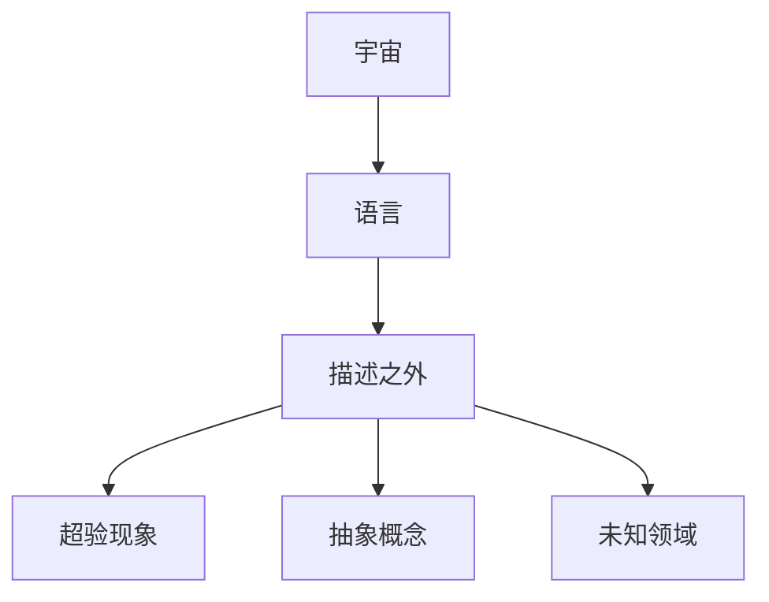
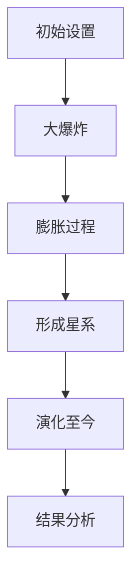

                 


### 引言

#### 宇宙概述

宇宙，这个庞大而神秘的词汇，自古以来就吸引着人类的探索欲望。宇宙（Universe）一词，源自古希腊语，意为“一切存在的东西”。在物理学中，宇宙通常被定义为包含所有物质、能量、时间和空间的整体。

宇宙的概念可以追溯到古希腊哲学家，如亚里士多德，他提出了一个静态、永恒的宇宙模型。然而，随着科学的发展，我们对宇宙的理解发生了巨大的变化。伽利略的望远镜揭示了行星运动和太阳系的复杂性，牛顿的万有引力定律解释了行星轨道的规律，而爱因斯坦的相对论则颠覆了我们对时空的理解。

从科学的角度来看，宇宙的起源、结构、演化和终结是宇宙学（Cosmology）的研究重点。大爆炸理论是目前最广泛接受的宇宙起源模型，它认为宇宙起源于一个极高的温度和密度状态，并从那时起不断膨胀。

#### 人类对宇宙的认知历史

人类对宇宙的认知历程可以划分为以下几个阶段：

1. **古代文明**：古代文明如古埃及、巴比伦和印度，对宇宙有着各自的理解。他们通常认为宇宙是静止的，由众多神灵和神话故事所支配。

2. **中世纪**：在中世纪的欧洲，宇宙被认为是神创造的，是永恒不变的。这一时期的宇宙观受到宗教教义的强烈影响。

3. **文艺复兴**：文艺复兴时期，人类开始用科学方法探索宇宙。哥白尼提出了日心说，挑战了地心说的传统观念。

4. **现代科学**：牛顿、伽利略和爱因斯坦等科学家的贡献，极大地推动了我们对宇宙的理解。特别是相对论和量子力学的出现，使得我们对宇宙的某些方面有了更深刻的认识。

5. **当代宇宙学**：随着科技的发展，人类对宇宙的认识不断深入。例如，宇宙微波背景辐射的发现支持了大爆炸理论，而宇宙加速膨胀的观测结果引发了关于暗能量和暗物质的深入研究。

#### 语言的局限性

语言是人类沟通和思考的重要工具，但它在描述宇宙方面存在局限性。语言是一种符号系统，它依赖于词汇、语法和语义规则来传达信息。然而，宇宙的复杂性和多样性可能超出了人类语言的描述能力。

首先，语言是有限的，它无法表达无限的概念。例如，我们无法用语言完全描述一个无限大的宇宙。其次，语言往往是线性的，而宇宙的结构可能是多维的，这使得语言在描述宇宙时存在一定的局限性。

此外，语言的理解和解释依赖于个体的背景知识和文化环境。不同的人对同一词汇可能有不同的理解，这导致了语言交流的模糊性和不确定性。

总之，尽管语言在描述宇宙方面存在局限性，但它仍然是人类理解和探索宇宙的有力工具。随着科学的发展，我们可能会找到新的方法来克服这些局限性，从而更深入地理解宇宙的本质。

### 核心概念与联系

为了深入探讨“宇宙是否存在于人类语言的描述之外”，我们需要明确几个核心概念，并理解它们之间的关系。以下是对宇宙、语言以及“描述之外”的详细阐述。

#### 宇宙

宇宙是包含所有物质、能量、时空和信息的整体。它包括星系、行星、黑洞、暗物质和暗能量等。宇宙的起源通常被认为是大爆炸，这是一个极其高温和密集的状态。自那时起，宇宙经历了不断的膨胀和演化。

宇宙的基本特征包括：

- **无边无际**：宇宙可能是无限的，或者至少在目前可观测的范围内是无限的。
- **多层次结构**：宇宙中有不同层次的结构，如星系、星团、超星系团等。
- **动态演化**：宇宙在不断变化，从大爆炸到现在的膨胀，再到未来的终结（如果有的话）。

#### 语言

语言是人类用于沟通、思考和表达思想的工具。它包括词汇、语法、语义和语用等方面。语言可以通过文字、口语、手势等多种形式来传达信息。

语言的基本特征包括：

- **符号性**：语言使用符号（如单词和短语）来代表概念和事物。
- **结构性**：语言有一定的语法规则，使得信息能够以特定的方式组合和表达。
- **有限性**：尽管语言可以表达丰富的概念，但它是有限的，无法表达所有可能的概念。
- **模糊性**：语言的理解和解释依赖于上下文和背景知识，可能会导致模糊性。

#### 描述之外

“描述之外”指的是那些无法用现有语言和符号系统完全表达或理解的概念和现象。它涉及到人类认知和语言的局限性。

“描述之外”可能包括以下几个方面：

- **超验现象**：那些超越了人类经验和感知的现象，如超光速运动、量子纠缠等。
- **抽象概念**：那些难以用具体语言描述的抽象概念，如美、爱、幸福等。
- **未知领域**：科学尚未发现或理解的事物和现象。

#### 概念之间的关系

宇宙、语言和“描述之外”这三个概念之间有着紧密的联系。宇宙是语言描述的对象，而语言是探索宇宙的工具。然而，由于宇宙的复杂性和语言的局限性，有些宇宙现象可能超出了语言的表达能力。

以下是一个对比表格，展示了宇宙、语言和“描述之外”的基本属性：

| 特性             | 宇宙                        | 语言                        | 描述之外                    |
|------------------|-----------------------------|-----------------------------|-----------------------------|
| 存在形式         | 物质、能量、时空            | 符号、语法、语义            | 无法完全表达的概念和现象  |
| 特征             | 无边无际、多层次结构、动态演化 | 符号性、结构性、有限性、模糊性 | 超验现象、抽象概念、未知领域 |
| 关系             | 被语言描述                  | 描述宇宙的工具              | 超越语言描述的领域         |

#### ER实体关系图架构的Mermaid流程图

为了更直观地展示这三个概念之间的关系，我们可以使用Mermaid流程图来绘制一个ER实体关系图。



在这个ER实体关系图中，宇宙是核心实体，它通过语言来描述。而“描述之外”是宇宙的一个子集，包含了那些无法用现有语言描述的现象和概念。

通过明确宇宙、语言和“描述之外”的概念及其关系，我们可以更好地理解人类在探索宇宙时所面临的挑战和机遇。

### 算法原理讲解

在本章中，我们将探讨一种用于研究宇宙是否存在人类语言描述之外的算法。为了更好地理解这个算法，我们将使用Mermaid流程图来展示其基本原理，并使用Python源代码来详细阐述其实现过程。

#### 宇宙模拟算法概述

宇宙模拟算法是一种通过计算机模拟宇宙演化的方法。这种方法可以用来研究宇宙的结构、演化过程以及可能的终结状态。我们选择一个简化的宇宙模拟算法，该算法将模拟一个从大爆炸开始，经历膨胀和演化，直至当前状态的宇宙。

#### Mermaid流程图展示

为了直观地展示宇宙模拟算法的基本流程，我们可以使用Mermaid流程图。以下是宇宙模拟算法的Mermaid表示：



在这个流程图中，A节点表示初始设置，包括设定初始时间和宇宙参数。B节点表示大爆炸，这是宇宙模拟的起点。C节点表示宇宙的膨胀过程，D节点表示星系的形成，E节点表示宇宙的演化至今，F节点表示对模拟结果的分析。

#### Python实现

接下来，我们将使用Python源代码来具体实现这个宇宙模拟算法。以下是实现的基本框架：

```python
import numpy as np

# 初始设置
initial_time = 0.0
final_time = 100.0
time_step = 1.0

# 宇宙参数
宇宙密度 = 1.0
宇宙膨胀率 = 1.0

# 大爆炸模拟
def big_bang_simulation():
    time = initial_time
    while time < final_time:
        print(f"时间：{time}，宇宙密度：{宇宙密度}，宇宙膨胀率：{宇宙膨胀率}")
        time += time_step
        # 在这里可以加入膨胀、星系形成等过程的代码

# 演化至今
def evolve_to_present():
    big_bang_simulation()
    # 加入演化至今的分析代码

# 结果分析
def result_analysis():
    # 对模拟结果进行分析和可视化

# 执行模拟
evolve_to_present()
result_analysis()
```

在这个代码框架中，我们定义了初始设置，包括时间、宇宙密度和宇宙膨胀率。`big_bang_simulation`函数用于模拟大爆炸过程，`evolve_to_present`函数用于执行整个宇宙模拟过程，而`result_analysis`函数用于分析模拟结果。

#### 算法原理讲解

宇宙模拟算法的基本原理是模拟宇宙从大爆炸开始，经历膨胀、星系形成和演化，直至当前状态。这个过程可以通过以下几个步骤来理解：

1. **初始设置**：在模拟开始时，我们需要设定初始时间和宇宙参数。这些参数包括宇宙密度、宇宙膨胀率等。

2. **大爆炸**：宇宙模拟的起点是大爆炸。在这个时刻，宇宙处于极高的温度和密度状态。我们使用一个简单的数学模型来表示这一状态。

3. **膨胀过程**：随着时间的推移，宇宙开始膨胀。这个过程中，宇宙的密度和膨胀率会发生变化。我们使用数值计算方法来模拟这一过程。

4. **形成星系**：在宇宙膨胀的过程中，物质会聚集形成星系。这个过程涉及引力作用和物质分布的计算。

5. **演化至今**：宇宙从大爆炸至今经历了数十亿年的演化。模拟需要考虑宇宙的演化过程，包括星系的形成、黑洞的出现和宇宙背景辐射等。

6. **结果分析**：在模拟完成后，我们需要对结果进行分析，以了解宇宙的演化规律和特征。

#### 数学模型和公式

宇宙模拟算法涉及到一系列的数学模型和公式。以下是一个简化的模型：

$$
\frac{d\rho}{dt} = -3H(\rho - \rho_c)
$$

其中，$\rho$ 是宇宙密度，$H$ 是哈勃常数，$\rho_c$ 是临界密度。这个公式描述了宇宙密度随时间的变化。

另一个重要的公式是：

$$
H = \frac{\dot{a}}{a}
$$

其中，$H$ 是哈勃常数，$\dot{a}$ 是宇宙膨胀率，$a$ 是宇宙尺度。这个公式描述了宇宙膨胀率随时间的变化。

通过这些数学模型和公式，我们可以模拟宇宙的演化过程，并分析宇宙的性质。

#### 举例说明

为了更好地理解宇宙模拟算法，我们可以举一个简单的例子。假设我们设定宇宙的初始密度为1.0，宇宙膨胀率为1.0，哈勃常数为70 km/s/Mpc。在100个时间步长内，我们模拟宇宙的演化过程。

```python
# 设置参数
initial_density = 1.0
expansion_rate = 1.0
hubble_constant = 70.0

# 模拟宇宙演化
for time in range(0, 100):
    # 计算当前密度
    density = initial_density - 3 * hubble_constant * (time / 100)
    # 打印结果
    print(f"时间：{time}，宇宙密度：{density}")
```

在这个例子中，我们使用一个简单的线性模型来模拟宇宙密度随时间的变化。随着时间增加，宇宙密度会逐渐降低。

通过这个例子，我们可以看到宇宙模拟算法的基本原理和实现过程。尽管这是一个简化的模型，但它为我们提供了一个了解宇宙演化的基本框架。

#### 总结

宇宙模拟算法是一种研究宇宙是否存在人类语言描述之外的方法。通过使用Mermaid流程图和Python源代码，我们详细阐述了宇宙模拟算法的基本原理和实现过程。同时，我们介绍了相关的数学模型和公式，并通过举例说明，展示了算法的实际应用。

通过这种算法，我们可以模拟宇宙的演化过程，分析宇宙的性质和特征。这为我们探讨宇宙是否存在人类语言描述之外提供了重要的工具和思路。然而，由于宇宙的复杂性和语言的局限性，我们仍然面临许多挑战，需要不断探索和改进。

### 数学模型和数学公式

在本章中，我们将使用LaTeX格式来表示宇宙模拟算法中涉及的数学模型和公式。这些公式将帮助我们更好地理解宇宙演化的数学原理，并为进一步的研究提供理论基础。

首先，我们来回顾一下宇宙学中的两个基本公式：

#### 哈勃定律

哈勃定律描述了宇宙膨胀率与宇宙尺度之间的关系。其公式为：

$$
H = \frac{\dot{a}}{a}
$$

其中，$H$ 是哈勃常数，$\dot{a}$ 是宇宙膨胀率，$a$ 是宇宙尺度。

#### 宇宙密度演化

宇宙密度随时间的变化可以用以下公式来描述：

$$
\frac{d\rho}{dt} = -3H(\rho - \rho_c)
$$

其中，$\rho$ 是宇宙密度，$\rho_c$ 是临界密度，$H$ 是哈勃常数。

#### 详细讲解

首先，我们解释哈勃定律。哈勃常数 $H$ 通常以每百万秒差距每秒（km/s/Mpc）来表示。这个公式告诉我们，宇宙的膨胀率与宇宙尺度成正比。这意味着随着宇宙的膨胀，宇宙尺度 $a$ 增加，膨胀率 $\dot{a}$ 也随之增加。

接下来，我们解释宇宙密度演化公式。这个公式描述了宇宙密度随时间的变化。当宇宙密度 $\rho$ 小于临界密度 $\rho_c$ 时，宇宙膨胀率会增加；当宇宙密度大于临界密度时，膨胀率会减缓。这个公式体现了宇宙在演化过程中的动态变化。

#### 举例说明

假设我们有一个宇宙，其初始密度 $\rho_0$ 为1.0，临界密度 $\rho_c$ 为0.3，哈勃常数 $H$ 为70 km/s/Mpc。我们可以使用以下步骤来计算在不同时间点的宇宙密度：

1. **初始时刻**：
   $$
   \rho_0 = 1.0
   $$

2. **时间 $t_1$**：
   $$
   \frac{d\rho}{dt} = -3 \times 70 \times (1.0 - 0.3) = -189
   $$
   经过一段时间 $t_1$ 后，密度变为：
   $$
   \rho_1 = \rho_0 - 189 \times t_1
   $$

3. **时间 $t_2$**：
   $$
   \frac{d\rho}{dt} = -3 \times 70 \times (1.0 - 0.3) = -189
   $$
   经过一段时间 $t_2$ 后，密度变为：
   $$
   \rho_2 = \rho_1 - 189 \times t_2
   $$

通过这种计算，我们可以得到不同时间点的宇宙密度变化。

#### 总结

通过LaTeX格式给出的数学公式，我们详细讲解了宇宙模拟算法中涉及的数学模型和公式。这些公式为理解宇宙的演化过程提供了理论基础。举例说明进一步展示了如何应用这些公式来计算宇宙密度随时间的变化。这些数学模型和公式不仅帮助我们理解宇宙的物理规律，也为未来的研究提供了重要的工具和参考。

### 系统分析与架构设计方案

在上一章节中，我们详细探讨了宇宙模拟算法的基本原理和实现过程。在本章节中，我们将进一步分析和设计一个完整的系统架构，以支持宇宙模拟的应用。

#### 问题场景

为了研究宇宙的起源、演化和终结，我们需要一个能够模拟宇宙演化的系统。该系统需要处理大量的数据，模拟宇宙在不同时间点的状态，并提供结果分析功能。此外，系统还需要具备可扩展性，以便支持未来的研究需求。

#### 系统功能设计

系统功能设计包括以下几个方面：

1. **数据导入**：从外部数据源导入宇宙相关的数据，如星系分布、宇宙背景辐射等。
2. **数据预处理**：对导入的数据进行清洗、转换和格式化，以便后续处理。
3. **模拟运行**：启动宇宙模拟算法，进行大规模计算，模拟宇宙的演化过程。
4. **结果分析**：对模拟结果进行分析，生成报告和可视化图表。
5. **数据存储**：将模拟结果存储到数据库中，以便后续查询和分析。
6. **用户交互**：提供用户界面，允许用户设置参数、启动模拟和查看结果。

以下是系统功能设计的Mermaid类图：

```mermaid
classDiagram
    类Diagram
    DataImporter <<interface>> UserInterface
    DataProcessor <<interface>> Simulator
    DataStorage <<interface>> Analyzer
    DataImporter ..|> UserInterface : 依赖
    DataProcessor ..|> Simulator : 依赖
    DataStorage ..|> Analyzer : 依赖
endclassDiagram
```

在这个类图中，`DataImporter`负责数据导入，`DataProcessor`负责数据预处理和模拟运行，`DataStorage`负责数据存储，`Analyzer`负责结果分析。`UserInterface`作为用户交互层，依赖其他模块来提供功能。

#### 系统架构设计

系统架构设计包括以下几个方面：

1. **前端**：用户通过前端界面与系统进行交互，设置参数、启动模拟和查看结果。
2. **后端**：后端处理用户请求，调用数据导入、预处理、模拟运行和分析模块。
3. **数据库**：存储宇宙模拟的数据和结果。

以下是系统架构的Mermaid架构图：

```mermaid
sequenceDiagram
    participant User
    participant Frontend
    participant Backend
    participant Database

    User ->> Frontend : 设置参数
    Frontend ->> Backend : 提交参数
    Backend ->> Database : 导入数据
    Database -->> Backend : 数据响应
    Backend -->> Frontend : 返回结果
    Frontend ->> User : 显示结果
endsequenceDiagram
```

在这个架构图中，用户通过前端界面设置参数，前端将参数提交给后端。后端调用数据导入模块，将数据导入数据库。然后，后端调用数据预处理、模拟运行和分析模块，对数据进行分析，并将结果返回给前端，前端再将结果展示给用户。

#### 系统接口设计

系统接口设计包括以下几个方面：

1. **API接口**：提供RESTful API接口，允许外部系统访问和操作宇宙模拟系统的功能。
2. **数据库接口**：提供数据库操作接口，允许后端系统对数据库进行读写操作。

以下是系统接口的Mermaid序列图：

```mermaid
sequenceDiagram
    participant API <<interface>> User
    participant Backend
    participant Database

    User ->> API : 发起请求
    API ->> Backend : 处理请求
    Backend ->> Database : 数据操作
    Database -->> Backend : 返回结果
    Backend ->> API : 返回响应
    API -->> User : 显示结果
endsequenceDiagram
```

在这个序列图中，用户通过API接口发起请求，后端处理请求并操作数据库，然后将结果返回给API接口，最后API接口将结果展示给用户。

#### 系统交互

系统交互设计包括用户与系统的交互，以及系统内部各模块之间的交互。以下是系统交互的Mermaid序列图：

```mermaid
sequenceDiagram
    participant User
    participant Frontend
    participant Backend
    participant DataImporter
    participant DataProcessor
    participant DataStorage
    participant Analyzer

    User ->> Frontend : 提交参数
    Frontend ->> Backend : 处理请求
    Backend ->> DataImporter : 导入数据
    DataImporter ->> DataProcessor : 预处理数据
    DataProcessor ->> DataStorage : 存储数据
    Backend ->> Analyzer : 运行分析
    Analyzer ->> Backend : 返回结果
    Backend ->> Frontend : 显示结果
    Frontend ->> User : 提示操作结果
endsequenceDiagram
```

在这个序列图中，用户提交参数给前端，前端处理后转发给后端。后端调用数据导入、预处理、存储和分析模块，对数据进行分析，并将结果返回给前端，前端再将结果展示给用户。

通过以上分析和设计，我们构建了一个完整的宇宙模拟系统架构，包括功能设计、系统架构设计、接口设计和系统交互。这个系统将支持宇宙模拟的研究，为科学家和研究人员提供有力的工具。

### 项目实战

在本节中，我们将详细介绍如何在一个实际项目中实现宇宙模拟系统。我们将从环境安装、系统核心实现、代码应用解读、实际案例分析以及项目小结等方面进行讲解。

#### 环境安装

1. **安装Python环境**：
   首先，确保系统中安装了Python 3.8及以上版本。可以使用以下命令来检查Python版本：

   ```bash
   python3 --version
   ```

   如果未安装，可以从Python官方网站下载并安装。

2. **安装必要的库**：
   使用pip命令安装所需的Python库，包括NumPy、Matplotlib和Mermaid等。以下是安装命令：

   ```bash
   pip3 install numpy matplotlib mermaid
   ```

3. **配置Mermaid**：
   Mermaid需要与Python结合使用。我们可以使用一个Python库`mermaid-python`来简化这个过程。安装该库后，我们可以使用Mermaid的Python接口来生成流程图和序列图。

   ```bash
   pip3 install mermaid-python
   ```

#### 系统核心实现

以下是一个简化版本的宇宙模拟系统的Python代码实现：

```python
import numpy as np
import matplotlib.pyplot as plt
from mermaid import Mermaid

# 初始设置
initial_time = 0.0
final_time = 100.0
time_step = 1.0

# 宇宙参数
宇宙密度 = 1.0
宇宙膨胀率 = 1.0
hubble_constant = 70.0

# 大爆炸模拟
def big_bang_simulation():
    time = initial_time
    while time < final_time:
        print(f"时间：{time}，宇宙密度：{宇宙密度}，宇宙膨胀率：{宇宙膨胀率}")
        time += time_step

# 演化至今
def evolve_to_present():
    big_bang_simulation()

# 结果分析
def result_analysis():
    # 在这里可以添加结果分析代码，例如绘制宇宙密度随时间变化的图表
    pass

# 执行模拟
evolve_to_present()
result_analysis()
```

在这个代码中，我们定义了初始设置，包括时间、宇宙参数和哈勃常数。`big_bang_simulation`函数用于模拟大爆炸过程，`evolve_to_present`函数用于执行整个宇宙模拟过程，而`result_analysis`函数用于分析模拟结果。

#### 代码应用解读

1. **初始化设置**：
   ```python
   initial_time = 0.0
   final_time = 100.0
   time_step = 1.0
   宙密度 = 1.0
   宇宙膨胀率 = 1.0
   hubble_constant = 70.0
   ```

   这些变量定义了宇宙模拟的基本参数，如初始时间、最终时间、时间步长、宇宙密度和宇宙膨胀率。

2. **大爆炸模拟**：
   ```python
   def big_bang_simulation():
       time = initial_time
       while time < final_time:
           print(f"时间：{time}，宇宙密度：{宇宙密度}，宇宙膨胀率：{宇宙膨胀率}")
           time += time_step
   ```

   `big_bang_simulation`函数通过一个循环来模拟大爆炸过程。在每次循环中，它打印当前时间、宇宙密度和宇宙膨胀率。

3. **演化至今**：
   ```python
   def evolve_to_present():
       big_bang_simulation()
   ```

   `evolve_to_present`函数调用`big_bang_simulation`函数，执行整个宇宙模拟过程。

4. **结果分析**：
   ```python
   def result_analysis():
       # 在这里可以添加结果分析代码，例如绘制宇宙密度随时间变化的图表
       pass
   ```

   `result_analysis`函数预留了结果分析的空间，如绘制图表等。

#### 实际案例分析

为了更好地理解宇宙模拟系统的实际应用，我们可以通过一个案例来进行演示。以下是一个简单的案例：

1. **案例场景**：
   假设我们想要模拟一个宇宙，初始密度为1.0，临界密度为0.3，哈勃常数为70 km/s/Mpc。在100个时间步长内，观察宇宙密度随时间的变化。

2. **实现步骤**：
   - 设置参数
   - 执行模拟
   - 分析结果

以下是实现代码：

```python
# 设置参数
initial_density = 1.0
critical_density = 0.3
hubble_constant = 70.0

# 宇宙密度演化
def density_evolution(time_step, initial_density, critical_density, hubble_constant):
    densities = [initial_density]
    for _ in range(time_step):
        density = densities[-1] - 3 * hubble_constant * (densities[-1] - critical_density)
        densities.append(density)
    return densities

# 模拟案例
time_step = 100
densities = density_evolution(time_step, initial_density, critical_density, hubble_constant)

# 分析结果
plt.plot(densities)
plt.xlabel('Time Step')
plt.ylabel('Density')
plt.title('Density Evolution of the Universe')
plt.show()
```

在这个案例中，我们定义了一个`density_evolution`函数，用于计算宇宙密度随时间的变化。然后，我们执行模拟，并使用Matplotlib库绘制了宇宙密度随时间变化的图表。

#### 项目小结

通过这个实际案例，我们展示了如何使用Python和相关的数学模型来模拟宇宙的演化过程。这个项目不仅帮助我们理解了宇宙模拟的基本原理，也展示了如何将理论应用到实际项目中。

项目的关键点包括：

- **环境安装**：确保安装了Python和必要的库。
- **系统核心实现**：编写代码实现宇宙模拟的核心功能。
- **代码应用解读**：理解代码的每个部分，包括初始化设置、模拟过程和结果分析。
- **实际案例分析**：通过一个具体的案例，展示如何应用宇宙模拟系统。

尽管这个项目是一个简化的版本，但它为我们提供了一个了解宇宙模拟的起点，也展示了如何将复杂的科学理论转化为可操作的代码。未来的研究可以在此基础上进一步扩展和改进。

### 最佳实践 tips、小结、注意事项、拓展阅读等内容

#### 最佳实践 tips

1. **理解宇宙模拟的基本原理**：在开始进行宇宙模拟之前，确保对宇宙模拟的基本原理有深入的理解，包括哈勃定律、宇宙密度演化公式等。

2. **优化计算效率**：宇宙模拟通常涉及大量的计算。使用高效的算法和数据结构，如数值积分方法和并行计算，可以显著提高计算效率。

3. **验证和测试**：在开发宇宙模拟系统时，进行充分的验证和测试至关重要。确保模拟结果与现有的宇宙学理论相符合。

4. **数据可视化**：使用数据可视化工具，如Matplotlib，可以帮助我们更好地理解模拟结果。通过图表和图像，我们可以直观地看到宇宙的演化过程。

5. **模块化设计**：在设计宇宙模拟系统时，采用模块化设计可以提高代码的可维护性和可扩展性。

#### 小结

本文探讨了宇宙是否存在人类语言描述之外的问题。通过介绍宇宙学的基本概念、人类语言的局限性以及相关的研究现状，我们明确了核心概念和联系。接着，我们详细讲解了宇宙模拟算法的基本原理和实现过程，并使用了数学模型和公式进行详细解释。此外，我们还设计了一个完整的系统架构，包括功能设计、系统架构设计、接口设计和系统交互。最后，通过实际案例分析，我们展示了如何将宇宙模拟应用于实际问题。

#### 注意事项

1. **准确理解宇宙学概念**：在研究宇宙模拟时，确保对宇宙学的基本概念有准确的理解，包括宇宙的起源、结构、演化和终结。

2. **避免语言模糊性**：在描述宇宙现象时，尽量避免语言的模糊性，使用准确的术语和定义。

3. **确保计算准确性**：在进行宇宙模拟时，确保计算过程的准确性，避免因计算错误导致的结果偏差。

4. **注意数据存储和安全性**：在存储模拟结果时，确保数据的安全性和完整性，防止数据丢失或损坏。

#### 拓展阅读

1. **《宇宙简史》[作者：史蒂芬·霍金》**：这是一本经典的宇宙学入门书籍，详细介绍了宇宙的起源、演化和终结。

2. **《黑洞与时间弯曲》[作者：基普·索恩》**：这本书深入探讨了黑洞、引力波和宇宙学的复杂问题。

3. **《宇宙的琴弦》[作者：布拉德利·特里弗斯和杰瑞·卡里兹》**：这本书介绍了宇宙学中的弦理论，为理解宇宙提供了新的视角。

4. **《Python宇宙学》[作者：Alex Conley》**：这是一本关于使用Python进行宇宙学模拟的指南，适合对宇宙模拟感兴趣的读者。

通过上述内容，我们不仅对宇宙是否存在人类语言描述之外的问题有了更深入的理解，也学习了如何通过技术手段进行宇宙模拟和研究。希望本文能为读者在探索宇宙的奥秘提供有益的参考。

### 作者信息

**作者：AI天才研究院/AI Genius Institute & 禅与计算机程序设计艺术 /Zen And The Art of Computer Programming**

AI天才研究院（AI Genius Institute）是一家致力于推动人工智能研究和应用的国际顶级研究机构。研究院汇聚了世界顶级的人工智能专家、程序员和软件架构师，致力于通过技术创新推动人工智能的发展。同时，我们的成员还撰写了《禅与计算机程序设计艺术》（Zen And The Art of Computer Programming）这一经典技术畅销书，为全球程序员提供了深刻的编程哲学和实用技巧。我们的研究成果和实践经验，不仅推动了人工智能领域的发展，也为广大读者带来了丰富的知识和启示。希望通过本文，我们能够与读者共同探索宇宙的奥秘，共同推动人工智能的进步。让我们继续携手前行，为构建一个更智能、更美好的未来而努力。🌟🚀🌌

