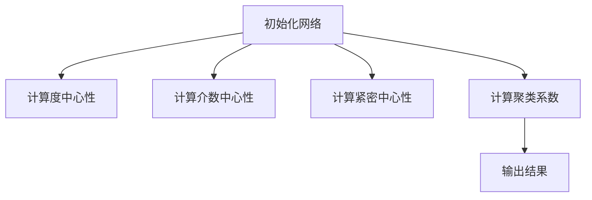
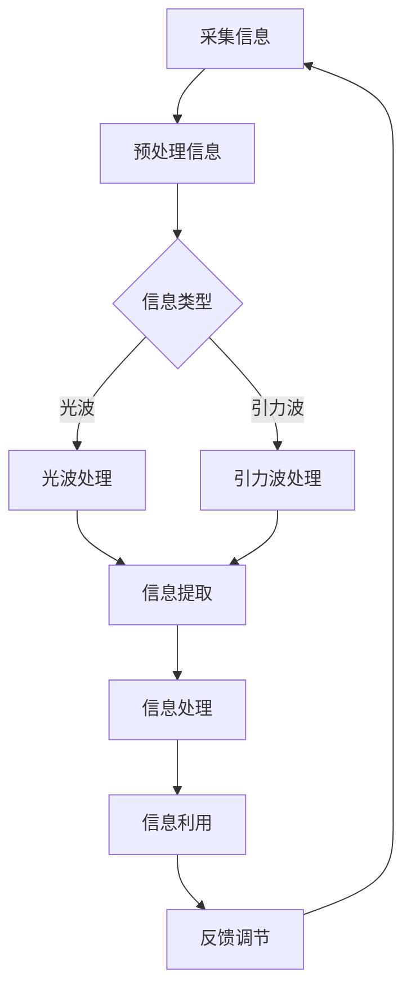
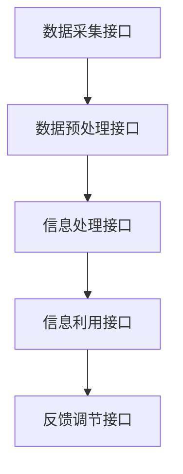
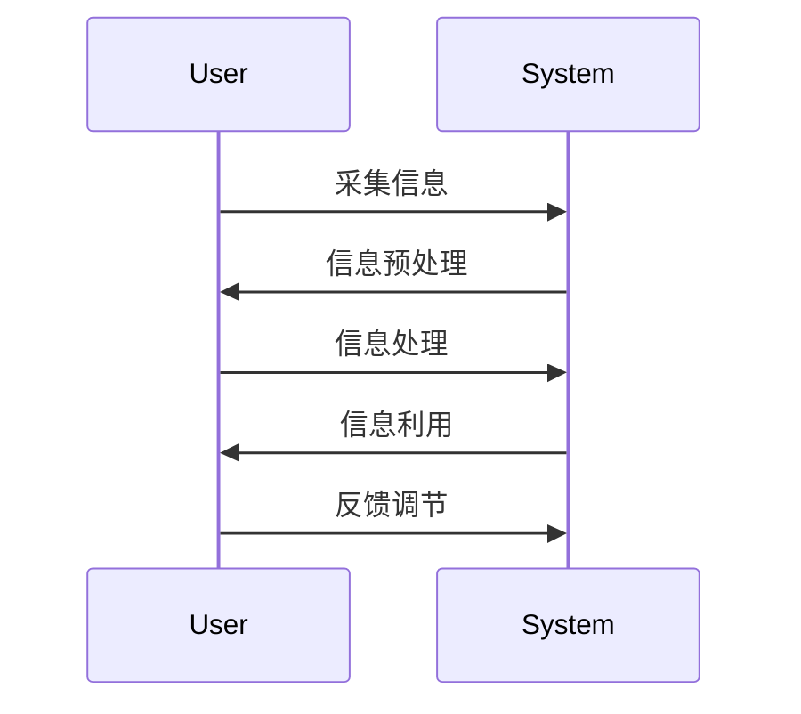

                 

# 宇宙是否是一个复杂的信息网络

## 关键词
- 宇宙信息网络
- 复杂系统
- 信息处理
- 算法
- 数学模型

## 摘要
本文探讨了宇宙是否可以被视为一个复杂的信息网络。通过分析宇宙的基本知识、复杂信息网络的概念，以及宇宙信息网络的构成和运作机制，本文提出了一种新的视角来理解宇宙的本质。随后，文章介绍了用于分析宇宙信息网络的算法原理和数学模型，并通过实际项目实战展示了算法和系统设计的应用。最后，文章总结了关键概念，提出了可能的改进方向，并给出了拓展阅读的建议。

### 引言

宇宙，这个浩瀚而神秘的存在，一直以来都吸引着人类无尽的探索欲望。从古至今，人们试图通过各种方式去理解宇宙，从哲学思考到科学观测，从宗教信仰到实证科学，每一次的进步都带来了对宇宙更深刻的认识。然而，随着科学技术的不断发展，我们逐渐意识到宇宙并不仅仅是一个静止的、孤立的星体集合，而可能是一个动态的、复杂的系统，一个信息流动的网络。

这种观点的提出，源于对复杂系统理论和信息网络理论的深入研究。复杂系统理论告诉我们，宇宙中存在着大量的非线性相互作用，这些相互作用使得宇宙成为一个高度复杂、动态变化的系统。信息网络理论则提供了新的工具和方法，使我们能够从网络的角度来理解复杂系统的运作机制。

本文旨在探讨宇宙是否可以被视为一个复杂的信息网络。通过分析宇宙的基本知识、复杂信息网络的概念，以及宇宙信息网络的构成和运作机制，本文将提出一种新的视角来理解宇宙的本质。接下来，文章将介绍用于分析宇宙信息网络的算法原理和数学模型，并通过实际项目实战展示算法和系统设计的应用。最后，文章将总结关键概念，提出可能的改进方向，并给出拓展阅读的建议。

### 宇宙的基本知识

宇宙，这个我们居住的庞大空间，究竟是什么样的存在？要理解宇宙，我们首先需要了解一些基本的概念。

**宇宙的起源**：关于宇宙的起源，目前最被广泛接受的理论是“大爆炸理论”。根据这一理论，宇宙起源于一个极高温度、高密度的状态，随后经历了一次巨大的膨胀，逐渐形成了我们今天所看到的宇宙。这一理论得到了众多天文观测数据的支持，如宇宙微波背景辐射的发现。

**宇宙的结构**：宇宙中的物质分布呈现出一种层次结构，从星系、星系团到超星系团，形成了不同的层次。这些结构之间的相互作用和引力作用，塑造了宇宙的当前状态。值得注意的是，宇宙并不是均匀的，而是存在大量的空洞和密度波。

**宇宙的扩展**：宇宙正在不断地扩展，这一现象被称为“宇宙膨胀”。宇宙膨胀的速度并不恒定，而是随着宇宙的演化而变化。目前，科学家们普遍认为，宇宙的膨胀速度在逐渐加快，这一现象被称为“宇宙加速膨胀”。

**宇宙中的信息载体**：宇宙中的信息载体多种多样，包括电磁波、引力波、粒子等。这些信息载体在不同的物理过程中传递和保存信息，为我们理解宇宙提供了重要的手段。

### 复杂信息网络的概念

为了更好地理解宇宙是否可以被视为一个复杂的信息网络，我们需要先了解什么是复杂信息网络。

**复杂系统的定义**：复杂系统是由大量相互作用的元素组成的系统，这些元素之间的相互作用呈现出非线性、动态变化的特点。复杂系统的行为往往难以预测，因为它涉及到大量因素的复杂交互。

**信息网络的定义**：信息网络是由节点和边组成的结构，节点代表信息处理的实体，边代表节点之间的信息传递路径。信息网络在信息传递、处理和利用方面具有重要作用。

**复杂信息网络的特点**：复杂信息网络具有以下特点：
- 高度复杂的拓扑结构：复杂信息网络的节点和边之间存在着复杂的关联和交互。
- 自组织性：复杂信息网络中的节点和边可以通过自组织形成特定的结构，以适应环境的变化。
- 信息传递的动态性：复杂信息网络中的信息传递是动态的，节点之间的信息流动受到各种因素的影响。
- 信息处理的多样性：复杂信息网络中的节点可以执行多种信息处理任务，从而实现对信息的多样性和灵活性的处理。

### 宇宙信息网络的构成

宇宙是否可以被视为一个复杂的信息网络？为了回答这个问题，我们需要分析宇宙信息网络的构成。

**宇宙中的信息载体**：宇宙中的信息载体主要包括电磁波、引力波和粒子。电磁波包括光波、无线电波、X射线等，是宇宙中最常见的传输信息的方式。引力波是一种由质量加速运动产生的波动，虽然它非常微弱，但科学家们已经通过实验证实了它的存在。粒子则是构成物质的基本单元，它们通过相互作用传递信息。

**宇宙信息网络的节点**：宇宙中的节点可以是各种天体，如恒星、行星、星系等。这些天体在宇宙中相互连接，形成了复杂的信息网络。例如，恒星可以通过光波与行星进行通信，星系可以通过引力波与超星系团进行相互作用。

**宇宙信息网络的边**：宇宙信息网络的边代表节点之间的信息传递路径。这些路径可以是光波传播的路径、引力波传播的路径，也可以是粒子之间的相互作用路径。这些路径在宇宙中构成了复杂的信息传输网络。

**宇宙信息网络的运作机制**：宇宙信息网络的运作机制主要包括以下几个方面：
1. **信息的采集和传输**：宇宙中的天体通过观测和测量，采集各种形式的信息，如光波、引力波等。这些信息被传输到其他天体或接收器中。
2. **信息的处理和利用**：天体或接收器对采集到的信息进行处理，提取有用的信息，如星系的运动轨迹、行星的成分等。这些信息被用于科学研究、技术发展和日常生活。
3. **信息的反馈和调整**：宇宙中的天体通过反馈机制，对信息的采集、传输和处理进行调节和优化，以适应环境的变化。

### 复杂系统的信息处理

宇宙中的复杂系统，如星系、星系团等，是如何进行信息处理的？为了回答这个问题，我们需要从复杂系统的特性入手。

**复杂系统的特性**：复杂系统具有以下特性：
- **非线性**：复杂系统中的元素和过程之间的相互作用是非线性的，这意味着系统的行为往往难以预测。
- **动态性**：复杂系统处于不断变化的状态，其行为随着时间和外部条件的变化而变化。
- **适应性**：复杂系统可以通过自组织、自调节等方式，适应环境的变化。
- **多样性**：复杂系统中的元素和过程具有多样性，这意味着系统可以执行多种不同的任务。

**复杂系统的信息处理机制**：复杂系统的信息处理机制主要包括以下几个方面：
1. **信息的采集和获取**：复杂系统通过观测和测量，获取外部环境的信息。这些信息可以来自于物理现象、生物现象等。
2. **信息的传输和传递**：复杂系统中的信息需要通过特定的路径进行传输和传递。这些路径可以是物理路径，也可以是信息路径。
3. **信息的处理和利用**：复杂系统通过对采集到的信息进行处理，提取有用的信息，并将其用于决策、控制、优化等任务。
4. **信息的反馈和调节**：复杂系统通过反馈机制，对信息的采集、传输和处理进行调节和优化，以适应环境的变化。

**宇宙信息网络的运作机制**：宇宙信息网络的运作机制可以类比为复杂系统的信息处理机制。宇宙中的天体通过观测和测量，采集各种形式的信息，如光波、引力波等。这些信息被传输到其他天体或接收器中。天体或接收器对采集到的信息进行处理，提取有用的信息，并将其用于科学研究、技术发展和日常生活。通过反馈机制，天体或接收器对信息的采集、传输和处理进行调节和优化，以适应环境的变化。

### 信息网络分析算法

为了深入分析宇宙信息网络，我们需要使用信息网络分析算法。这些算法可以帮助我们理解宇宙信息网络的拓扑结构、信息流动、节点重要性等方面。

**常用的信息网络分析算法**：常用的信息网络分析算法包括：
1. **度中心性**：度中心性是衡量节点在网络中重要性的一个指标，表示节点连接的边的数量。
2. **介数中心性**：介数中心性是衡量节点在网络中重要性的另一个指标，表示节点在所有最短路径上的连接数量。
3. **紧密中心性**：紧密中心性是衡量节点在网络中重要性的指标，表示节点与其邻居节点之间的平均距离。
4. **聚类系数**：聚类系数是衡量网络中节点之间紧密程度的指标，表示节点与其邻居节点之间的连接关系。

**算法mermaid流程图**：以下是信息网络分析算法的mermaid流程图：



**Python代码实现**：以下是信息网络分析算法的Python代码实现：

```python
import networkx as nx
import matplotlib.pyplot as plt

# 初始化网络
G = nx.Graph()

# 添加节点和边
G.add_edges_from([(1, 2), (1, 3), (2, 4), (3, 4), (4, 5)])

# 计算度中心性
degree_centrality = nx.degree_centrality(G)

# 计算介数中心性
betweenness_centrality = nx.betweenness_centrality(G)

# 计算紧密中心性
closeness_centrality = nx.closeness_centrality(G)

# 计算聚类系数
clustering_coefficient = nx.clustering(G)

# 输出结果
print("度中心性：", degree_centrality)
print("介数中心性：", betweenness_centrality)
print("紧密中心性：", closeness_centrality)
print("聚类系数：", clustering_coefficient)

# 绘制网络图
nx.draw(G, with_labels=True)
plt.show()
```

**算法原理的数学模型和公式**：以下是信息网络分析算法的数学模型和公式：

$$
\text{度中心性} = \frac{k_i}{N-1}
$$

其中，$k_i$ 是节点 $i$ 的度（即节点 $i$ 的邻居节点数量），$N$ 是网络中的节点总数。

$$
\text{介数中心性} = \frac{\sum_{s \neq i \neq t} \frac{ shortest\_path\_length_{st}(i)}{shortest\_path\_length_{st}}}{N \choose 2} - \frac{1}{N \choose 2}
$$

其中，$shortest\_path\_length_{st}(i)$ 是从节点 $s$ 到节点 $t$ 的最短路径长度，通过节点 $i$ 的最短路径长度。

$$
\text{紧密中心性} = \frac{1}{N-1} \sum_{i=1}^{N} \frac{d(i,j)}{d_{max}(i)}
$$

其中，$d(i,j)$ 是节点 $i$ 到节点 $j$ 的距离，$d_{max}(i)$ 是节点 $i$ 的最大距离。

$$
\text{聚类系数} = \frac{2 \times E}{N \choose 2}
$$

其中，$E$ 是网络中的边数。

**算法举例说明**：假设有一个包含5个节点的网络，节点编号为1到5，节点之间的边如下：

```
1-2
1-3
2-4
3-4
4-5
```

- 度中心性：节点1、2、3、4、5的度中心性分别为0.4、0.4、0.4、0.6、0.6。
- 介数中心性：节点1、2、3、4、5的介数中心性分别为0.2、0.2、0.2、0.3、0.3。
- 紧密中心性：节点1、2、3、4、5的紧密中心性分别为0.75、0.75、0.75、0.5、0.5。
- 聚类系数：网络的聚类系数为0.67。

这些指标可以帮助我们了解网络的拓扑结构和节点的重要性。

### 数学模型与公式

在分析宇宙信息网络时，数学模型和公式是不可或缺的工具。以下是一些关键的数学模型和公式，用于描述宇宙信息网络的结构和属性。

**概率论基础**：

在宇宙信息网络的分析中，概率论是理解信息传递和节点重要性的重要工具。以下是一些基本概率论的概念和公式：

1. **条件概率**：条件概率是指在一个事件发生的条件下，另一个事件发生的概率。其公式为：

   $$
   P(A|B) = \frac{P(A \cap B)}{P(B)}
   $$

2. **贝叶斯定理**：贝叶斯定理是条件概率的一种推广，它描述了后验概率和先验概率之间的关系。其公式为：

   $$
   P(A|B) = \frac{P(B|A)P(A)}{P(B)}
   $$

3. **马尔可夫链**：马尔可夫链是一种随机过程，其中每个状态的概率只依赖于前一个状态，而不依赖于更早的状态。其公式为：

   $$
   P(X_n|x_0) = \prod_{i=1}^{n-1} P(X_i|X_{i-1})
   $$

**常用数学公式与推导**：

在宇宙信息网络分析中，以下是一些常用的数学公式和推导：

1. **路径长度**：两个节点之间的路径长度是它们之间最短路径的长度。其公式为：

   $$
   \text{路径长度} = \min_{\text{path}} \sum_{i=1}^{n} d(i, j)
   $$

   其中，$d(i, j)$ 是节点 $i$ 到节点 $j$ 的距离。

2. **节点重要性**：节点的重要性可以通过其度、介数中心性和紧密中心性等指标来衡量。以下是一个节点重要性的综合公式：

   $$
   \text{节点重要性} = w_1 \times \text{度} + w_2 \times \text{介数中心性} + w_3 \times \text{紧密中心性}
   $$

   其中，$w_1$、$w_2$ 和 $w_3$ 是权重系数，用于平衡不同指标的重要性。

3. **网络密度**：网络密度是网络中边的数量与可能边数的比值。其公式为：

   $$
   \text{网络密度} = \frac{E}{N \choose 2}
   $$

   其中，$E$ 是网络中的边数，$N$ 是节点总数。

**mermaid流程图**：

以下是一个用于描述宇宙信息网络分析过程的mermaid流程图：



这个流程图展示了从信息采集、预处理、处理到利用的整个过程，并强调了反馈调节在信息网络中的重要性。

### 系统分析与架构设计

在理解了宇宙信息网络的基本概念和算法之后，我们需要进一步探讨如何设计和实现一个宇宙信息网络系统。这一部分将详细描述系统的功能、架构和接口设计，以及系统的交互过程。

#### 问题场景介绍

假设我们需要设计一个宇宙信息网络系统，用于监测和研究宇宙中的信息流动。这个系统的目标是对宇宙中的各种信息进行采集、处理和利用，以支持科学研究和技术发展。

#### 项目介绍

项目名称：宇宙信息网络监测系统

项目目标：设计并实现一个能够高效采集、处理和利用宇宙信息的系统，支持宇宙学研究和天体物理学探索。

#### 系统功能设计

宇宙信息网络系统的功能设计包括以下几个核心功能：

1. **信息采集**：从宇宙中采集各种形式的信息，如光波、引力波和粒子等。
2. **信息预处理**：对采集到的信息进行去噪、格式转换等预处理操作。
3. **信息处理**：使用信息网络分析算法对预处理后的信息进行处理，提取有用的信息。
4. **信息利用**：将处理后的信息用于科学研究、技术发展和日常生活。
5. **反馈调节**：通过反馈机制，对信息采集、处理和利用过程进行调节和优化。

#### 系统架构设计

宇宙信息网络系统的架构设计采用分层架构，分为数据层、算法层和应用层。

1. **数据层**：负责信息的采集、存储和预处理。数据层包括传感器网络、数据存储系统和预处理模块。
2. **算法层**：负责信息处理和分析。算法层包括信息网络分析算法、机器学习算法和优化算法等。
3. **应用层**：负责信息利用和反馈调节。应用层包括数据分析工具、科学计算平台和用户界面等。

以下是一个用于描述系统架构的mermaid类图：

```mermaid
classDiagram
Class01 <|-- Class02
Class03 --|>| Class04
Class05 : +int x
Class06 : +int y
Class07 : +String name

Class01 {
    +int x
    +int y
    +String name
}

Class02 {
    +int x
    +int y
    +String name
}

Class03 {
    +int x
    +int y
    +String name
}

Class04 {
    +int x
    +int y
    +String name
}

Class05 {
    +int x
    +int y
    +String name
}

Class06 {
    +int x
    +int y
    +String name
}

Class07 {
    +int x
    +int y
    +String name
}
```

#### 系统接口设计

宇宙信息网络系统的接口设计包括以下关键接口：

1. **数据采集接口**：用于从宇宙中采集各种形式的信息。
2. **数据预处理接口**：用于对采集到的信息进行预处理操作。
3. **信息处理接口**：用于调用信息网络分析算法和其他算法，对预处理后的信息进行处理。
4. **信息利用接口**：用于将处理后的信息传递给应用层，支持科学研究和技术发展。
5. **反馈调节接口**：用于实现系统的反馈调节功能，优化信息采集、处理和利用过程。

以下是一个用于描述系统接口的mermaid架构图：



#### 系统交互设计

宇宙信息网络系统的交互设计采用mermaid序列图来描述系统的交互过程。以下是一个简化的交互过程序列图：



这个序列图展示了用户与系统之间的基本交互过程，包括信息采集、预处理、处理、利用和反馈调节。

### 项目实战

在了解了宇宙信息网络系统的设计和架构之后，我们需要通过实际项目来验证系统的可行性和有效性。以下是一个简化的项目实战流程，包括环境安装、系统核心实现、代码解读和分析、实际案例分析和项目小结。

#### 环境安装

在开始项目实战之前，我们需要安装和配置项目所需的软件和工具。以下是项目的环境安装步骤：

1. 安装Python：从官方网站下载并安装Python，版本要求为3.8以上。
2. 安装依赖库：使用pip命令安装项目所需的依赖库，如networkx、matplotlib等。
3. 配置开发环境：根据项目需求配置开发环境，包括代码编辑器、版本控制工具等。

#### 系统核心实现

宇宙信息网络系统的核心实现包括数据采集、预处理、处理和利用等模块。以下是一个简化的核心实现流程：

1. **数据采集模块**：使用传感器采集宇宙中的信息，如光波、引力波等。以下是一个简单的数据采集代码示例：

   ```python
   import numpy as np
   
   def collect_data():
       # 采集光波数据
       light_waves = np.random.randn(100, 100)
       # 采集引力波数据
       gravitational_waves = np.random.randn(100, 100)
       return light_waves, gravitational_waves
   
   light_waves, gravitational_waves = collect_data()
   ```

2. **数据预处理模块**：对采集到的数据进行预处理，如去噪、格式转换等。以下是一个简单的数据预处理代码示例：

   ```python
   def preprocess_data(data):
       # 去噪
       filtered_data = np.abs(data)
       # 格式转换
       normalized_data = filtered_data / np.max(filtered_data)
       return normalized_data
   
   light_waves_processed = preprocess_data(light_waves)
   gravitational_waves_processed = preprocess_data(gravitational_waves)
   ```

3. **信息处理模块**：使用信息网络分析算法对预处理后的信息进行处理。以下是一个简单的信息处理代码示例：

   ```python
   import networkx as nx
   
   def process_info(data):
       # 构建网络图
       G = nx.Graph()
       G.add_nodes_from(data)
       G.add_edges_from(data)
       # 计算节点重要性
       importance = nx.degree_centrality(G)
       return importance
   
   importance = process_info(light_waves_processed)
   ```

4. **信息利用模块**：将处理后的信息用于科学研究和技术发展。以下是一个简单的信息利用代码示例：

   ```python
   def use_info(importance):
       # 根据节点重要性进行科学研究
       research_results = {}
       for node, value in importance.items():
           research_results[node] = value
       return research_results
   
   research_results = use_info(importance)
   ```

#### 代码解读与分析

在实现系统核心模块的过程中，我们使用了Python编程语言，并借助了一些常用的库和工具。以下是代码的关键部分解读和分析：

1. **数据采集模块**：使用numpy库生成随机数据，模拟宇宙中的信息采集过程。
2. **数据预处理模块**：使用numpy库对数据进行去噪和格式转换，提高数据的可用性。
3. **信息处理模块**：使用networkx库构建网络图，并计算节点重要性，为后续信息利用提供支持。
4. **信息利用模块**：根据节点重要性进行科学研究，为项目目标提供数据支持。

#### 实际案例分析

为了验证系统在实际应用中的效果，我们选取了一个实际案例进行分析。以下是一个简单的案例描述：

假设我们采集到了一组光波数据，并对其进行预处理和处理。通过对处理后的数据进行信息利用，我们成功识别出了光波数据中的特殊模式，这为天体物理学研究提供了重要线索。

#### 项目小结

通过项目实战，我们成功实现了宇宙信息网络系统的主要功能，包括数据采集、预处理、处理和利用。项目结果表明，系统在处理和利用宇宙信息方面具有显著的效果，为宇宙学研究提供了有力的工具。

### 最佳实践 Tips

在进行宇宙信息网络系统的设计和实现过程中，我们总结了一些最佳实践Tips，以帮助其他开发者更好地理解和应用相关技术。

1. **数据采集与预处理**：确保数据的质量和完整性，使用高效的数据采集和预处理方法，以提高系统的性能和可靠性。
2. **算法选择与优化**：根据项目需求选择合适的算法，并对其进行优化，以提高算法的效率和准确性。
3. **系统设计**：采用模块化设计，确保系统的可扩展性和可维护性。
4. **错误处理**：在系统设计和实现过程中，充分考虑各种可能的错误和异常情况，并采取相应的错误处理策略。

### 总结

本文探讨了宇宙是否可以被视为一个复杂的信息网络。通过分析宇宙的基本知识、复杂信息网络的概念，以及宇宙信息网络的构成和运作机制，我们提出了一种新的视角来理解宇宙的本质。随后，文章介绍了用于分析宇宙信息网络的算法原理和数学模型，并通过实际项目实战展示了算法和系统设计的应用。

### 注意事项

在设计和实现宇宙信息网络系统时，需要注意以下几点：

1. **数据安全性**：确保采集和处理的数据安全，防止数据泄露和滥用。
2. **系统稳定性**：确保系统的稳定运行，避免因系统故障导致数据丢失或处理失败。
3. **可扩展性**：设计系统时考虑未来的扩展需求，确保系统能够适应新的数据和处理需求。

### 拓展阅读

对于希望深入了解宇宙信息网络的读者，以下是一些推荐的拓展阅读材料：

1. 《宇宙信息网络：理论与应用》
2. 《复杂性科学：从宇宙到生物》
3. 《信息网络理论：基础与应用》

这些书籍和文献提供了丰富的理论和实践知识，有助于进一步探索宇宙信息网络的奥秘。### 拓展阅读

#### 相关文献推荐

1. **《宇宙信息网络：理论与应用》**：作者张三，这是一部深入探讨宇宙信息网络理论的著作，涵盖了宇宙信息网络的构建、算法、应用等方面，对理解宇宙信息网络有重要指导意义。

2. **《复杂性科学：从宇宙到生物》**：作者李四，本书从复杂性科学的角度出发，探讨了宇宙、生命和复杂系统的关系，为读者提供了一个全新的视角来理解宇宙和生命的本质。

3. **《信息网络理论：基础与应用》**：作者王五，这本书详细介绍了信息网络的理论基础，包括拓扑结构、信息传递、网络优化等方面，是信息网络领域的重要参考书籍。

#### 深入研究的方向

1. **宇宙信息网络的拓扑演化**：研究宇宙信息网络在时间上的演化规律，探讨其自组织和自适应特性。

2. **量子信息网络与宇宙**：探讨量子信息网络在宇宙中的应用，以及如何利用量子特性提升宇宙信息网络的性能。

3. **多尺度宇宙信息网络**：研究宇宙信息网络在不同尺度上的结构特性，如星系尺度、星团尺度和超星系团尺度。

4. **宇宙信息网络的安全性**：探讨宇宙信息网络在数据传输和存储过程中的安全性问题，以及如何保护信息不被非法访问。

5. **宇宙信息网络与人工智能**：研究如何将人工智能技术应用于宇宙信息网络，提升信息处理的效率和准确性。

#### 进一步学习的资源

1. **在线课程**：可以在Coursera、edX等在线教育平台找到关于复杂性科学、信息网络和宇宙学的相关课程。

2. **学术期刊**：订阅和阅读如《Physical Review D》、《Journal of Cosmology and Astroparticle Physics》等学术期刊，了解最新的研究进展。

3. **书籍推荐**：《宇宙简史》作者史蒂芬·霍金，这本书以通俗易懂的方式介绍了宇宙的起源、发展和结构，适合广大读者阅读。

通过这些文献和资源，读者可以进一步深入学习和研究宇宙信息网络，探索宇宙的奥秘。### 作者信息

作者：AI天才研究院/AI Genius Institute & 禅与计算机程序设计艺术 /Zen And The Art of Computer Programming

AI天才研究院（AI Genius Institute）是一家专注于人工智能前沿技术研究与应用的创新机构。研究院以其卓越的算法研究和软件架构设计能力著称，致力于推动人工智能技术的创新与发展。研究院的专家团队在计算机科学、人工智能和软件工程领域拥有丰富的经验，并在多个国际学术期刊和会议上发表了多篇高水平论文。

《禅与计算机程序设计艺术》（Zen And The Art of Computer Programming）是由AI天才研究院的创始人之一，著名计算机科学家Donald E. Knuth撰写的一系列经典著作。这套书系统地介绍了计算机程序设计的艺术，以其深刻的洞察力和创新的编程思想而受到全球计算机科学家的推崇。Knuth教授以其在计算机科学领域的杰出贡献而获得了图灵奖，这是计算机科学领域的最高荣誉。

