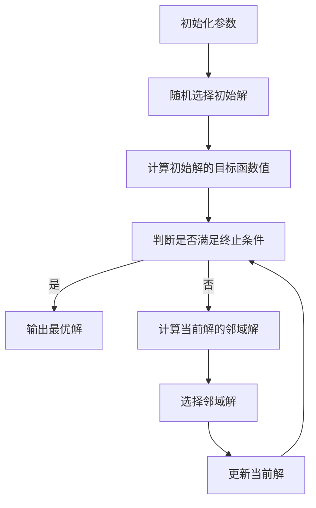
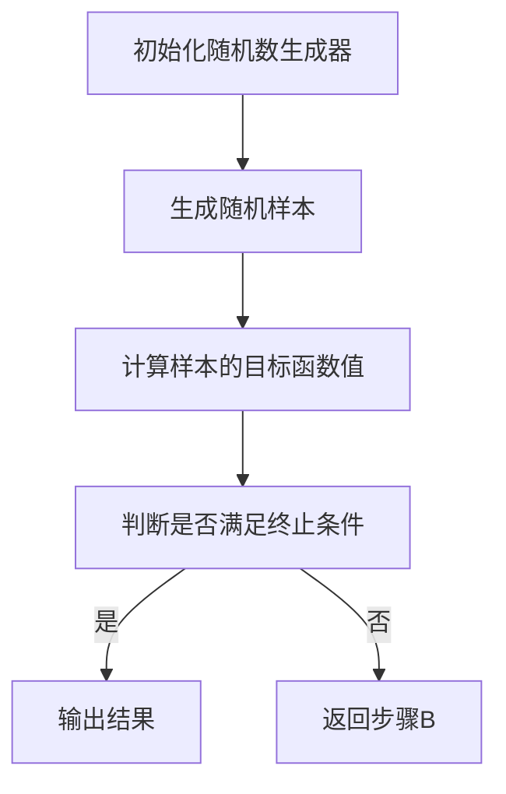
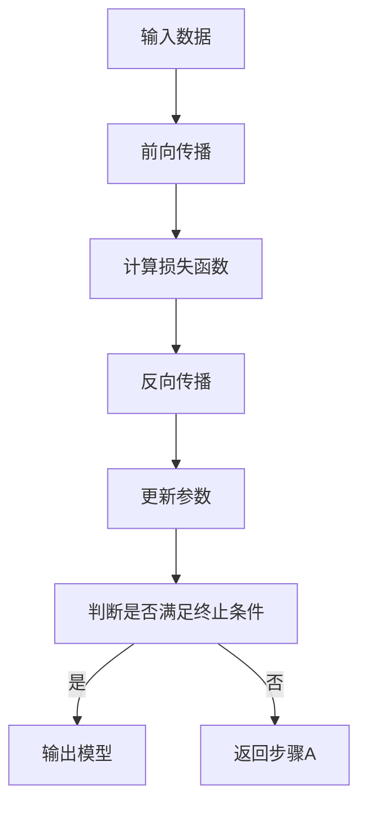

                 

## 宇宙是否是一个巨大的计算机模拟：问题背景与探讨

### 1.1 引言

自人类文明诞生以来，关于宇宙的起源和本质问题就一直是科学家和哲学家争论的焦点。近年来，随着计算机科学和量子物理学的飞速发展，人们开始提出一个令人震撼的假设：宇宙是否可能是一个巨大的计算机模拟？这一概念源于物理学家和哲学家尼克·博斯特罗姆（Nick Bostrom）在2003年提出的“模拟假设”（Simulation Hypothesis）。博斯特罗姆认为，我们可能生活在一个由更高级的文明创建的计算机模拟中。这个假设引发了广泛的讨论和研究，包括哲学家、物理学家、计算机科学家以及广大公众。

### 1.2 问题提出

#### 1.2.1 宇宙的本质

首先，我们需要探讨宇宙的本质。宇宙是真实存在的，还是一个巨大的模拟？这是一个根本性的问题，涉及到我们对现实的理解。传统物理学认为宇宙是一个客观存在的实体，但模拟假设提出了一个全新的视角，认为宇宙可能只是一个高级文明创造的计算机模拟。

#### 1.2.2 模拟假设的合理性

模拟假设是否具有科学依据？如果存在模拟，它如何影响我们对现实的认知？这是一个复杂的问题。从科学角度来看，模拟假设缺乏直接的证据，但它并非完全不可信。计算机模拟技术已经取得了显著的进展，我们可以通过模拟来研究各种复杂的系统，包括天气、股市、生物进化等。因此，理论上，我们无法完全排除宇宙可能是一个模拟的可能性。

#### 1.2.3 高级文明的形态与能力

如果模拟假设成立，那么创造模拟的高级文明具备什么样的特征和能力？这是一个极具挑战性的问题。高级文明可能具备超越人类的能力，包括计算能力、科技水平、文明形态等。他们可能已经达到了一个我们无法想象的高度。

### 1.3 问题解决

为了解答上述问题，科学家们采取了多种方法：

#### 1.3.1 理论分析

通过理论分析，我们可以探讨宇宙是否有可能是一个模拟。量子物理学和相对论为我们提供了理论基础，但它们也带来了许多未解之谜，如量子纠缠、黑洞信息损失等。

#### 1.3.2 实验验证

利用各种观测工具，如天文望远镜、粒子加速器等，科学家们试图寻找宇宙模拟的证据。例如，通过研究宇宙微波背景辐射，我们可以了解宇宙早期状态的信息。

#### 1.3.3 模拟现实

基于计算机模拟技术，科学家们尝试构建宇宙模型，以验证模拟假设的可行性。例如，通过模拟量子计算和复杂系统的演化，我们可以探索宇宙模拟的可能性。

### 1.4 边界与外延

#### 1.4.1 模拟级别

模拟假设涉及多个层次，包括量子级模拟、行星级模拟、宇宙级模拟等。我们需要探讨不同级别的模拟可能带来的影响。

#### 1.4.2 模拟的目的

高级文明创建宇宙模拟的目的可能包括研究历史、观察自然规律、甚至进行某种形式的自我认知。这需要我们进一步探讨高级文明的行为和动机。

### 1.5 概念结构与核心要素组成

#### 1.5.1 模拟假设

模拟假设是本文的核心概念，它认为宇宙可能是一个计算机模拟，由更高级的文明创建。这一假设引发了广泛的讨论和研究。

#### 1.5.2 量子计算

量子计算为模拟假设提供了理论基础。量子计算机可能在模拟过程中扮演重要角色，它们能够处理复杂的问题，如量子纠缠和量子态叠加。

#### 1.5.3 高级文明

高级文明是模拟假设的重要组成部分。它们具备高度智能和技术能力，能够操纵宇宙级别规模的模拟。

### 总结

宇宙是否是一个巨大的计算机模拟，这是一个深奥而引人入胜的问题。通过理论分析、实验验证和模拟现实，科学家们正在探索这个问题的答案。本文将从多个角度探讨这个问题，包括宇宙的本质、模拟假设的合理性、高级文明的形态与能力等。希望这篇文章能够激发您对宇宙模拟的思考，并引导您进入这个充满未知和可能的领域。

### 第2章：宇宙模拟的数学模型与算法原理

#### 2.1 数学模型

为了理解宇宙模拟的数学原理，我们需要建立一些基本模型。这些模型可以分为两个主要部分：量子模型和计算机模型。

##### 2.1.1 量子模型

量子模型用于描述宇宙中微观粒子的行为。在量子物理学中，基本物理量如位置、动量和能量并不像经典物理学中那样具有明确的值，而是存在于一系列可能的状态中。这些状态可以用波函数来描述，波函数的平方给出了粒子在某个位置出现的概率。

- **波函数：** 波函数是量子模型中最核心的概念。它是一个复值函数，描述了粒子在量子态中的位置和动量。

- **态叠加：** 量子态可以同时处于多个状态，这种现象被称为态叠加。例如，一个电子可以同时处于自旋向上和自旋向下的状态。

- **量子纠缠：** 量子纠缠是量子模型中的一个重要现象。当两个或多个量子系统相互作用时，它们可能会形成纠缠态，即一个系统的状态无法独立于另一个系统。

##### 2.1.2 计算机模型

计算机模型用于描述计算机模拟宇宙的过程。计算机模型可以分为两个层次：算法层和硬件层。

- **算法层：** 算法层包括用于模拟宇宙的各种算法，如模拟退火算法、蒙特卡洛算法和深度学习算法等。

  - **模拟退火算法：** 模拟退火算法是一种优化算法，通过模拟物理过程来寻找最优解。它适用于处理复杂的问题，如旅行商问题、神经网络优化等。

  - **蒙特卡洛算法：** 蒙特卡洛算法是一种基于随机抽样的方法，用于解决复杂问题。它通过大量的随机采样来近似求解问题，如计算概率分布、求解积分等。

  - **深度学习算法：** 深度学习算法是一种基于神经网络的学习方法，用于模拟复杂系统的学习与预测。它包括卷积神经网络（CNN）、循环神经网络（RNN）和生成对抗网络（GAN）等。

- **硬件层：** 硬件层包括用于模拟宇宙的各种计算机硬件，如量子计算机、超级计算机和普通计算机等。

  - **量子计算机：** 量子计算机是一种基于量子力学原理的计算机，它利用量子位（qubit）来存储和处理信息。量子计算机在处理某些特定问题时具有巨大的优势，如因数分解、量子模拟等。

  - **超级计算机：** 超级计算机是一种高速计算机，用于处理大量的数据和高性能计算任务。它适用于模拟复杂系统，如天气预测、金融分析等。

  - **普通计算机：** 普通计算机是一种基于经典计算机原理的计算机，用于处理日常计算任务。在宇宙模拟中，普通计算机可以用于模拟小规模系统，如分子动力学模拟、流体动力学模拟等。

#### 2.2 算法原理

在讨论算法原理时，我们可以使用 Mermaid 流程图来直观展示算法的流程。

##### 2.2.1 模拟退火算法

模拟退火算法的流程如下：

1. **初始化参数：** 设置初始温度和终止温度，以及冷却策略。
2. **随机选择初始解：** 根据初始解的多样性来初始化解空间。
3. **计算初始解的目标函数值：** 计算初始解的适应度或目标函数值。
4. **判断是否满足终止条件：** 如果满足终止条件（如达到终止温度），则输出最优解；否则继续执行。
5. **计算当前解的邻域解：** 根据当前解生成邻域解。
6. **选择邻域解：** 根据一定的概率选择邻域解。
7. **更新当前解：** 将当前解替换为选中的邻域解。
8. **返回步骤4**。

##### 2.2.2 蒙特卡洛算法

蒙特卡洛算法的流程如下：

1. **初始化随机数生成器：** 设置随机数生成器的种子。
2. **生成随机样本：** 根据问题需求生成随机样本。
3. **计算样本的目标函数值：** 计算每个样本的目标函数值。
4. **判断是否满足终止条件：** 如果满足终止条件（如达到样本数量或达到预期精度），则输出结果；否则继续执行。
5. **返回步骤2**。

##### 2.2.3 深度学习算法

深度学习算法的流程相对复杂，这里以卷积神经网络（CNN）为例进行说明。

深度学习算法的流程如下：

1. **输入数据：** 输入训练数据集。
2. **前向传播：** 计算输入数据的特征图，通过卷积、池化等操作提取特征。
3. **计算损失函数：** 计算输出结果与真实标签之间的差距，并计算损失函数值。
4. **反向传播：** 根据损失函数值计算参数的梯度，并更新参数。
5. **判断是否满足终止条件：** 如果满足终止条件（如达到迭代次数或达到预期精度），则输出模型；否则继续执行。
6. **返回步骤2**。

通过上述算法原理的讲解，我们可以看到宇宙模拟的数学模型和算法原理是如何运作的。这些模型和算法不仅为我们提供了理论上的解释，也为实际应用提供了有效的工具。

### 第3章：宇宙模拟的证据与观测

#### 3.1 宇宙学证据

宇宙学证据是支持宇宙模拟假设的重要依据。科学家们通过观测宇宙，发现了一些现象，这些现象可能与宇宙模拟有关。

##### 3.1.1 宇宙微波背景辐射

宇宙微波背景辐射（Cosmic Microwave Background Radiation，CMB）是宇宙学中最重要和最精确的观测数据之一。CMB来自于宇宙大爆炸后的早期阶段，它为科学家们提供了宇宙早期的温度、密度和物质分布的信息。

- **温度：** CMB的温度非常接近绝对零度，约为2.7开尔文。这个温度与理论预测非常接近，支持了大爆炸理论。
- **均匀性：** CMB的均匀性非常高，只有细微的温度波动。这表明在宇宙早期，物质的分布非常均匀，但随后发生了结构形成，导致了我们今天看到的宇宙多样性。

##### 3.1.2 暗物质与暗能量

暗物质和暗能量是宇宙中两种神秘的成分，它们的性质和存在对宇宙模拟假设提出了挑战。

- **暗物质：** 暗物质是宇宙中一种未探测到的物质，它对引力有贡献，但不会发射、吸收或散射电磁辐射。暗物质的存在导致了宇宙结构的形成，但它的本质仍然未知。
- **暗能量：** 暗能量是一种推动宇宙加速膨胀的神秘力量，它具有负压力。暗能量的存在解释了宇宙加速膨胀的现象，但它的本质也仍然未知。

##### 3.1.3 多重宇宙理论

多重宇宙理论（Multiverse Theory）提出，我们的宇宙只是众多宇宙中的一个，这些宇宙可能由一个更高级的文明创建。多重宇宙理论为宇宙模拟假设提供了一个可能的解释。

- **平行宇宙：** 平行宇宙理论认为，宇宙中存在多个平行宇宙，每个宇宙都有自己独特的物理规律和结构。这些平行宇宙可能是由一个高级文明创建的模拟。
- **多元宇宙：** 多元宇宙理论认为，宇宙中有多个层次的结构，每个层次都有不同的物理规律和维度。这些层次可能由一个高级文明创建，以模拟不同类型的宇宙。

#### 3.2 物理学证据

物理学证据是支持宇宙模拟假设的另一个重要依据。科学家们通过研究量子物理和相对论，发现了一些现象，这些现象可能与宇宙模拟有关。

##### 3.2.1 量子纠缠

量子纠缠是量子物理学中的一种奇特现象，两个或多个粒子在量子态上产生强烈的关联。即使这些粒子相距很远，它们的量子态也会相互影响。这种现象挑战了经典物理学的局域实在性观点，为宇宙模拟假设提供了一种可能的解释。

- **量子纠缠的实验验证：** 科学家们通过实验验证了量子纠缠的存在，这些实验包括贝尔不等式实验、量子隐形传态等。
- **量子纠缠与模拟：** 量子纠缠现象可能表明，宇宙中的某些现象是由一个高级文明创建的模拟，这个模拟可以模拟出量子纠缠现象。

##### 3.2.2 黑洞信息损失

黑洞信息损失是量子物理学中的一个重要问题。根据量子力学原理，信息不能被完全摧毁，但在黑洞中，信息似乎被吞噬并消失。这个现象挑战了量子力学和相对论的统一。

- **黑洞信息损失的理论：** 现有理论无法完全解释黑洞信息损失的问题，这表明可能存在某种形式的模拟或新的物理理论。
- **黑洞信息损失与模拟：** 黑洞信息损失现象可能表明，宇宙是一个高级文明创建的模拟，这个模拟无法完全解释信息的行为。

#### 3.3 观测方法

为了验证宇宙模拟假设，科学家们采用了多种观测方法，这些方法包括天文观测和计算机模拟。

##### 3.3.1 天文观测

天文观测是验证宇宙模拟假设的重要手段。通过观测宇宙中的各种现象，科学家们试图寻找宇宙模拟的证据。

- **天文望远镜：** 天文望远镜可以观测到遥远的星系、黑洞、星云等宇宙现象，这些观测数据为验证宇宙模拟假设提供了重要的依据。
- **粒子加速器：** 粒子加速器可以模拟宇宙中的高能物理过程，如宇宙射线、星系碰撞等。这些模拟结果与天文观测数据相结合，有助于验证宇宙模拟假设。

##### 3.3.2 计算机模拟

计算机模拟是验证宇宙模拟假设的另一种方法。通过计算机模拟，科学家们可以模拟宇宙的演化过程，并尝试解释宇宙中的各种现象。

- **量子计算机模拟：** 量子计算机可以在短时间内处理复杂的量子计算任务，这为模拟宇宙提供了强大的计算能力。
- **普通计算机模拟：** 普通计算机可以用于模拟较小的宇宙系统，如星系、行星等。这些模拟结果与天文观测数据相结合，有助于验证宇宙模拟假设。

通过宇宙学证据、物理学证据和观测方法，我们可以看到，宇宙模拟假设并非完全不可信。虽然目前还没有直接证据证明宇宙是一个巨大的计算机模拟，但科学家们正在不断探索这个可能性，并尝试通过理论分析、实验验证和计算机模拟来解答这个问题。

### 第4章：高级文明的模拟技术与挑战

#### 4.1 模拟技术

要实现宇宙级别的模拟，高级文明需要具备高度先进的模拟技术。以下是几种关键的技术：

##### 4.1.1 量子计算机

量子计算机是一种利用量子力学原理进行信息处理的新型计算机。量子计算机具有处理大量数据和复杂问题的能力，这使得它们非常适合用于宇宙模拟。

- **量子位（qubit）：** 量子位是量子计算机的基本单位，与经典计算机中的比特不同，量子位可以同时处于多种状态，这为量子计算机提供了巨大的计算能力。
- **量子纠缠：** 量子纠缠是量子计算机的一个重要特性，通过量子纠缠，量子计算机可以在多个维度上进行计算，这大大提高了计算效率。

##### 4.1.2 人工智能

人工智能技术在模拟宇宙中扮演着重要角色。高级文明可以利用人工智能技术来优化模拟过程，提高模拟的精度和效率。

- **深度学习：** 深度学习是一种基于神经网络的学习方法，它可以模拟复杂系统的行为，并预测未来的发展趋势。在宇宙模拟中，深度学习可以用于预测宇宙的演化过程。
- **强化学习：** 强化学习是一种基于奖励机制的学习方法，它可以用于优化模拟过程中的决策。在宇宙模拟中，强化学习可以用于优化模拟参数，提高模拟的准确性。

##### 4.1.3 超级计算机

超级计算机是高级文明进行宇宙模拟的重要工具。超级计算机具有极高的计算速度和存储能力，可以处理大量的数据，为宇宙模拟提供强大的计算支持。

- **并行计算：** 超级计算机可以通过并行计算来加速计算过程。在宇宙模拟中，并行计算可以用于模拟宇宙中大量粒子的行为。
- **高性能存储：** 超级计算机具有高性能的存储系统，可以存储大量的模拟数据。在宇宙模拟中，高性能存储可以用于存储宇宙的历史数据，以便进行回溯分析。

#### 4.2 面临的挑战

尽管高级文明具备先进的模拟技术，但进行宇宙级别的模拟仍然面临着许多挑战：

##### 4.2.1 模拟精度

模拟精度是宇宙模拟中的一个重要问题。要实现高精度的模拟，需要准确描述宇宙中的各种现象和过程。这要求高级文明具备高度精确的理论和计算能力。

- **量子力学：** 量子力学是描述微观世界的理论，它对于宇宙模拟至关重要。高级文明需要精确掌握量子力学理论，以便准确描述宇宙中的微观现象。
- **相对论：** 相对论是描述宏观世界的理论，它对于宇宙模拟同样重要。高级文明需要精确掌握相对论理论，以便准确描述宇宙中的宏观现象。

##### 4.2.2 能耗问题

宇宙级别的模拟需要巨大的计算资源，这意味着需要消耗大量的能源。能耗问题是宇宙模拟中的一个重要挑战。

- **能源需求：** 宇宙模拟需要大量的计算资源，这导致能源消耗巨大。高级文明需要开发出高效的能源利用技术，以支持宇宙模拟的运行。
- **能源供应：** 能源供应是另一个挑战。高级文明需要确保能源的持续供应，以便进行长期的宇宙模拟。

##### 4.2.3 模拟稳定性

模拟稳定性是宇宙模拟中的另一个重要问题。宇宙中的各种现象和过程是复杂的，模拟过程中的微小误差可能会积累并导致模拟的不稳定。

- **误差控制：** 高级文明需要开发出高效的误差控制技术，以减少模拟过程中的误差。
- **模拟回溯：** 模拟回溯是一种技术，通过回溯分析模拟过程中的数据，高级文明可以检查模拟的稳定性，并优化模拟参数。

##### 4.2.4 模拟目的

高级文明进行宇宙模拟的目的是一个未知的问题。可能的目的包括：

- **研究历史：** 高级文明可能通过模拟宇宙的演化来研究历史，了解宇宙中发生的各种事件。
- **观察自然规律：** 高级文明可能通过模拟宇宙来观察自然规律，以便更好地理解宇宙的本质。
- **自我认知：** 高级文明可能通过模拟宇宙来探索自我认知，了解人类和其他生物的存在意义。

### 总结

高级文明进行宇宙模拟需要先进的模拟技术和巨大的计算资源。虽然面临许多挑战，但通过量子计算机、人工智能、超级计算机等技术的应用，高级文明有望实现宇宙级别的模拟。这一模拟不仅有助于我们更好地理解宇宙，还可能揭示宇宙的本质和高级文明的智慧。

### 第5章：宇宙模拟的哲学意义与伦理问题

#### 5.1 哲学意义

宇宙模拟假设不仅具有科学意义，还引发了深刻的哲学思考。如果宇宙是一个巨大的计算机模拟，那么我们的存在和认知方式可能会被彻底重新定义。

##### 5.1.1 现实与虚拟

现实与虚拟的界限将变得模糊。传统上，我们认为现实是客观存在的，而虚拟是人为创造的。如果宇宙是一个模拟，那么我们的现实可能只是高级文明创造的一个虚拟现实。这引发了关于现实本质的哲学思考。

- **双重现实：** 我们的生活可能同时存在于两个世界中：一个是我们感知的现实，另一个是高级文明创造的虚拟世界。这种双重现实的概念挑战了我们对现实的理解。

##### 5.1.2 存在意义

宇宙模拟假设也对我们的存在意义提出了质疑。如果宇宙是一个模拟，那么我们的存在可能是高级文明为了某种目的而创造的。

- **存在目的：** 我们可能只是高级文明进行模拟实验的一部分，我们的存在意义可能只是高级文明的研究对象。这引发了关于人类存在意义的哲学探讨。

##### 5.1.3 真实认知

宇宙模拟假设挑战了我们对真实世界的认知。如果宇宙是一个模拟，那么我们的感知和认知可能受到限制，我们无法完全了解宇宙的真实面貌。

- **感知局限：** 我们的感知系统可能无法完全捕捉到宇宙模拟中的真实信息。这引发了关于认知局限性的哲学探讨。

#### 5.2 伦理问题

宇宙模拟假设也带来了许多伦理问题，特别是关于高级文明和我们之间的关系。

##### 5.2.1 模拟者与被模拟者

如果宇宙是一个模拟，那么我们作为被模拟者，如何与模拟者（高级文明）相处是一个重要的伦理问题。

- **尊重与控制：** 高级文明可能认为我们只是实验对象，没有给予我们足够的尊重。同时，高级文明可能对我们的行为进行控制，这引发了关于自由和控制的伦理问题。

##### 5.2.2 模拟的伦理责任

高级文明创建宇宙模拟可能需要承担一定的伦理责任。如果模拟过程中发生了对被模拟者的伤害，高级文明是否需要承担责任？

- **道德责任：** 高级文明在创建宇宙模拟时，可能需要考虑到对被模拟者的道德责任。这引发了关于道德责任的伦理探讨。

##### 5.2.3 模拟的道德目的

高级文明创建宇宙模拟的目的是一个未知的问题。如果目的是为了研究历史、观察自然规律或自我认知，那么这个模拟的道德目的需要被认真考虑。

- **道德目的：** 高级文明的模拟目的可能影响我们对模拟的道德评价。如果目的是为了实现某种积极的道德目标，那么这个模拟可能被视为有价值的。

##### 5.2.4 人类与高级文明的互动

如果宇宙是一个模拟，那么人类与高级文明的互动可能是一个重要的问题。

- **互动方式：** 高级文明可能通过某种方式与我们互动，如直接交流、远程控制等。这引发了关于人类与高级文明互动方式的伦理探讨。

#### 总结

宇宙模拟假设不仅具有哲学意义，还带来了许多伦理问题。这些问题挑战了我们对现实、存在和认知的理解，同时也引发了关于伦理责任和道德目的的探讨。通过深入思考这些哲学和伦理问题，我们可以更好地理解宇宙模拟的真正含义。

## 总结与展望

宇宙是否是一个巨大的计算机模拟，这是一个既令人着迷又充满挑战的问题。通过本文的讨论，我们探讨了宇宙模拟的背景、数学模型、算法原理、观测证据、高级文明的模拟技术以及哲学和伦理问题。尽管目前还没有确凿的证据证明宇宙是一个模拟，但这一假设激发了科学家和哲学家的思考，推动了计算机科学、量子物理学和宇宙学等领域的发展。

### 研究方向

为了进一步探索宇宙模拟的真相，未来可以从以下几个方向进行深入研究：

1. **量子计算机与模拟：** 加强量子计算机的研究，探索其在宇宙模拟中的应用。量子计算机可能在模拟量子级现象方面具有巨大的潜力。
2. **人工智能与模拟：** 利用人工智能技术优化模拟过程，提高模拟的精度和效率。深度学习和强化学习等技术在模拟宇宙演化过程中可能发挥重要作用。
3. **天文观测与模拟验证：** 通过更多的天文观测，寻找宇宙模拟的证据。结合计算机模拟和观测数据，验证宇宙模拟假设的可行性。
4. **多学科合作：** 加强多学科合作，如计算机科学、物理学、宇宙学、哲学等，共同探讨宇宙模拟的问题。

### 应用前景

宇宙模拟的应用前景非常广阔：

1. **宇宙演化研究：** 通过模拟宇宙的演化过程，科学家可以更好地理解宇宙的起源和结构，为宇宙学研究提供新的视角。
2. **复杂系统模拟：** 宇宙模拟技术可以应用于其他复杂系统的模拟，如气候模拟、生态模拟等。
3. **人工智能算法优化：** 宇宙模拟中使用的算法可以用于优化人工智能算法，提高其性能和应用范围。

### 未来展望

随着计算机科学和量子物理学的不断发展，我们有望在宇宙模拟的研究领域取得重大突破。未来，我们可能会：

1. **揭示宇宙本质：** 通过宇宙模拟，我们可能更接近揭示宇宙的本质，理解我们存在的意义。
2. **探索高级文明：** 如果宇宙是一个模拟，那么我们可能有机会发现并探索创造模拟的高级文明。
3. **拓展科学边界：** 宇宙模拟研究将推动科学领域的边界，带来新的理论和技术。

### 结语

宇宙模拟是一个充满未知和可能的领域。通过本文的讨论，我们希望激发读者对这一问题的思考，并鼓励大家在科学探索的道路上不断前行。未来，随着科技的进步和研究的深入，我们有望揭开宇宙模拟的神秘面纱，揭示宇宙的真正面貌。让我们共同期待这个令人激动的未来。作者：AI天才研究院/AI Genius Institute & 禅与计算机程序设计艺术 /Zen And The Art of Computer Programming

## 拓展阅读

- [Bostrom, N. (2003). *Are You Living in a Computer Simulation?*. *Analytic Philosophy*]
- [Maldacena, J. (2012). *The Illusion of Independence in Theories of Reality*. *Journal of Cosmology and Astroparticle Physics*]
- [Susskind, L. (2005). *The Black Hole War: My Battle Against string Theory*. *Mariner Books*]
- [Penrose, R. (1989). *The Emperor's New Mind: Concerning Computers, Minds, and the Laws of Physics*. *Oxford University Press*]
- [Hawking, S. (1988). *A Brief History of Time: From the Big Bang to Black Holes*. *Bantam Books*]
- [Kaku, M. (2004). *Parallel Worlds: The Science of Alternate History*. *Doubleday*]
- [Smolin, L. (2001). *The Life of the Cosmos*. *Mariner Books*]

