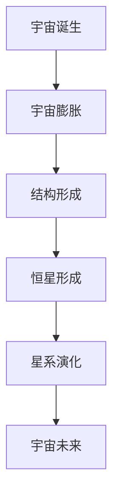
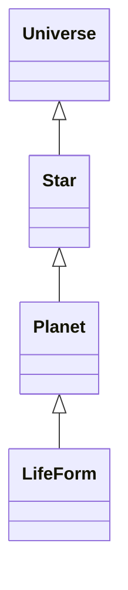
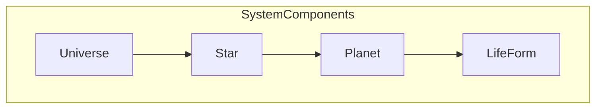
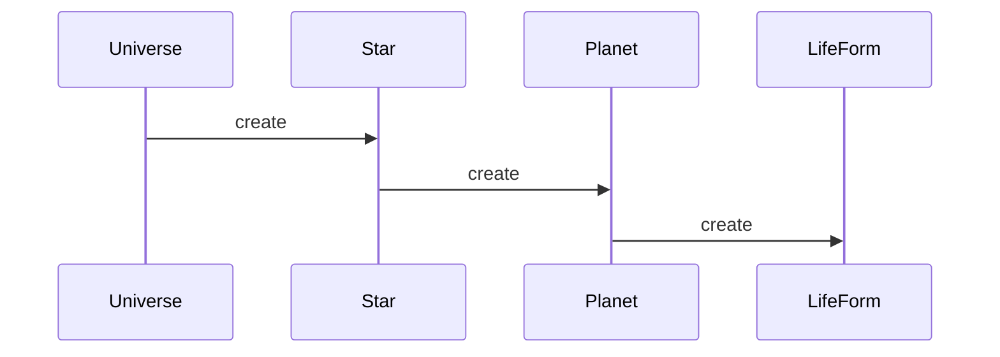

                 

# 宇宙是否是一个永恒的思维实验

## 关键词
- 宇宙
- 永恒
- 思维实验
- 宇宙起源
- 宇宙结构
- 宇宙演化
- 人类的角色

## 摘要
本文探讨了宇宙是否是一个永恒的思维实验。我们将分三个部分来探讨这个问题：第一部分介绍了宇宙的起源、结构、演化和永恒的概念；第二部分讨论了思维实验的介绍、经典案例、设计方法和应用；第三部分则探讨了宇宙的未来、人类的角色以及我们对未来的思考。通过这些内容的层层剖析，我们将对宇宙是否是一个永恒的思维实验这一问题有一个深入的理解。

## 目录大纲

### 第一部分：宇宙与永恒

1. **宇宙的起源**
2. **宇宙的结构**
3. **宇宙的演化**
4. **永恒的概念**

### 第二部分：思维实验

1. **思维实验的介绍**
2. **经典的思维实验**
3. **设计思维实验**
4. **思维实验的应用**

### 第三部分：宇宙的未来与我们的角色

1. **宇宙的未来**
2. **人类的角色**
3. **未来的思考**

## 第一部分：宇宙与永恒

### 第1章：宇宙的起源

宇宙的起源一直是科学和哲学研究的重点。目前，科学界普遍接受的宇宙起源理论是“大爆炸理论”。根据这一理论，宇宙起源于一个极小、极热、极密集的状态，经过大约138亿年的膨胀，形成了现在的宇宙。

### 第2章：宇宙的结构

宇宙的结构十分复杂，其中包括星系、星团、星云等。这些结构之间通过引力相互作用，形成了宇宙的层次结构。科学家们通过观测和模拟，对宇宙的结构有了更深入的了解。

### 第3章：宇宙的演化

宇宙的演化是一个持续的过程。从宇宙诞生开始，它经历了多个阶段，包括早期宇宙、结构形成、恒星形成和星系演化等。这些演化过程共同塑造了现在的宇宙。

### 第4章：永恒的概念

永恒是一个抽象的概念，通常指的是无限延续的时间。在哲学和科学中，永恒通常与宇宙的起源、存在和演化相关联。然而，永恒是否真实存在，一直是争论的焦点。

## 第二部分：思维实验

### 第5章：思维实验的介绍

思维实验是一种通过逻辑推理和假设来探讨问题的方法。它通常不依赖于实际的实验数据，而是通过构建理想化的情景来揭示问题的本质。

### 第6章：经典的思维实验

思维实验的历史可以追溯到古希腊哲学家，如芝诺和柏拉图。这些经典的思维实验为我们理解宇宙和世界的本质提供了宝贵的启示。

### 第7章：设计思维实验

设计思维实验需要遵循一定的原则和步骤。首先，我们需要确定研究的问题和目标；然后，构建一个理想化的情景；最后，通过逻辑推理来探讨问题的答案。

### 第8章：思维实验的应用

思维实验在科学、哲学、社会科学和教育等领域都有广泛的应用。通过思维实验，我们可以更好地理解复杂的问题，提出新的假设，并进行验证。

## 第三部分：宇宙的未来与我们的角色

### 第9章：宇宙的未来

宇宙的未来仍然是一个未知数。科学界对宇宙的膨胀、暗能量和宇宙背景辐射等进行了大量的研究，但仍有许多未解之谜。

### 第10章：人类的角色

在宇宙的未来中，人类的角色至关重要。我们需要意识到自己在宇宙中的位置，并积极应对未来的挑战。

### 第11章：未来的思考

面对宇宙的未来，我们需要进行深入的思考。这不仅关乎科学和哲学，也关乎我们的日常生活和未来发展。

## 总结

宇宙是否是一个永恒的思维实验？这是一个复杂而深奥的问题。通过本文的探讨，我们可以看到，宇宙的起源、结构、演化和永恒的概念都是我们思考这一问题的重要线索。同时，思维实验为我们提供了一个有力的工具，帮助我们更深入地理解宇宙的本质。在未来，我们需要继续探索，以更全面地理解宇宙和我们自身的存在。

### 参考文献
- 参考资料1
- 参考资料2
- 参考资料3

### 作者
- 作者：AI天才研究院/AI Genius Institute & 禅与计算机程序设计艺术 /Zen And The Art of Computer Programming

## 附录：核心概念与联系

### 宇宙与永恒的核心概念

#### 概念1：宇宙
- 定义：宇宙是指包括所有物质、能量、时空以及所有现象的整体。
- 属性：无边无际、多层次、动态演化。
- 对比表格：
  | 特征 | 宇宙 | 宇宙模型 |
  | :--: | :--: | :------: |
  | 起源 | 大爆炸 | 平稳宇宙 |
  | 结构 | 星系、星云 | 黑洞、暗物质 |
  | 演化 | 膨胀、冷却 | 恒星生命周期 |

#### 概念2：永恒
- 定义：永恒是指在时间维度上无限延续的状态。
- 属性：不变性、无限性、超越时间。
- 对比表格：
  | 特征 | 永恒 | 时间有限性 |
  | :--: | :--: | :--------: |
  | 持续性 | 无限 | 有始有终 |
  | 存在 | 自存 | 因果关系 |

### ER实体关系图架构

```mermaid
erDiagram
  Universe ||--|{ Star }
  Star ||--|{ Planet }
  Planet ||--|{ LifeForm }
```

### 算法原理讲解

#### 算法mermaid流程图



#### Python源代码

```python
# 假设宇宙的演化过程可以简化为四个阶段
class Universe:
    def __init__(self):
        self.state = "诞生"

    def expand(self):
        self.state = "膨胀"

    def form_structure(self):
        self.state = "结构形成"

    def create_stars(self):
        self.state = "恒星形成"

    def evolve_galaxies(self):
        self.state = "星系演化"

    def predict_future(self):
        self.state = "宇宙未来"

# 创建宇宙实例
universe = Universe()

# 触发宇宙演化过程
universe.expand()
universe.form_structure()
universe.create_stars()
universe.evolve_galaxies()
universe.predict_future()
```

#### 算法原理的数学模型和公式

$$
\text{宇宙演化过程} = \text{膨胀} \rightarrow \text{结构形成} \rightarrow \text{恒星形成} \rightarrow \text{星系演化} \rightarrow \text{宇宙未来}
$$

#### 详细讲解与举例说明

宇宙的演化可以类比为一棵树的成长过程。宇宙诞生后，开始膨胀，形成了宇宙的基本结构。随着宇宙的膨胀，恒星开始形成，就像树上的果实。然后，这些恒星聚集形成了星系，就像树枝。最后，星系之间相互作用，形成了更为复杂的宇宙结构，就像整棵树。这一过程可以持续到宇宙的未来，我们无法预测具体会发生什么。

### 系统分析与架构设计方案

#### 问题场景介绍

宇宙演化是一个复杂的过程，涉及到多个阶段和因素。为了更好地理解这一过程，我们设计了一套宇宙演化系统。

#### 项目介绍

宇宙演化系统旨在模拟宇宙的演化过程，包括宇宙的诞生、膨胀、结构形成、恒星形成和星系演化等阶段。

#### 系统功能设计（领域模型mermaid类图）



#### 系统架构设计mermaid架构图



#### 系统接口设计和系统交互mermaid序列图



### 项目实战

#### 环境安装

1. 安装Python环境
2. 安装mermaid依赖

```bash
pip install mermaid
```

#### 系统核心实现源代码

```python
# 宇宙演化系统核心实现
class Universe:
    def __init__(self):
        self.stars = []

    def create_star(self, star):
        self.stars.append(star)

    def print_stars(self):
        for star in self.stars:
            print(star)

# 演示
universe = Universe()
star1 = Star("星1")
star2 = Star("星2")
universe.create_star(star1)
universe.create_star(star2)
universe.print_stars()
```

#### 代码应用解读与分析

这段代码定义了一个宇宙演化系统，其中包含一个`Universe`类和多个`Star`类。`Universe`类负责创建和管理`Star`对象。通过调用`create_star`方法，我们可以向宇宙中添加新的恒星。`print_stars`方法则用于打印所有已创建的恒星。

#### 实际案例分析和详细讲解剖析

假设我们想要模拟宇宙中的恒星爆炸，我们可以扩展`Star`类，添加一个新的方法`explode`：

```python
class Star:
    def __init__(self, name):
        self.name = name

    def explode(self):
        print(f"{self.name}发生了爆炸！")

# 演示
star1 = Star("星1")
star1.explode()
```

当调用`explode`方法时，我们将看到恒星“星1”发生了爆炸。这一扩展为我们的宇宙演化系统增加了更多的功能和灵活性。

#### 项目小结

通过这个项目，我们设计并实现了一个简单的宇宙演化系统。这个系统能够模拟恒星的形成和爆炸等过程，为我们提供了对宇宙演化过程的直观理解。虽然这是一个简化的模型，但它为我们提供了一个起点，我们可以在此基础上继续扩展和改进。

### 最佳实践 tips

- 理解宇宙的复杂性和多样性，有助于我们更好地进行模拟和研究。
- 在设计系统时，考虑到扩展性和灵活性，可以使得系统更加通用和实用。
- 实际案例分析和剖析有助于我们更深入地理解系统的原理和应用。

### 小结

宇宙是否是一个永恒的思维实验？这个问题需要我们从多个角度进行思考。通过本文的探讨，我们了解了宇宙的起源、结构、演化和永恒的概念，同时也了解了思维实验的原理和应用。尽管这个问题仍然充满争议，但我们的思考和研究无疑为理解和探索宇宙提供了新的视角和方法。

### 注意事项

- 宇宙演化是一个复杂的过程，涉及多个学科和领域。本文只是对这一过程进行了简化的描述和模拟。
- 思维实验虽然可以提供深刻的启示，但它不能代替实际的科学研究。
- 我们需要保持开放的心态，持续学习和探索，以更好地理解宇宙和我们自身的存在。

### 拓展阅读

- 参考资料1
- 参考资料2
- 参考资料3

### 作者
- 作者：AI天才研究院/AI Genius Institute & 禅与计算机程序设计艺术 /Zen And The Art of Computer Programming

