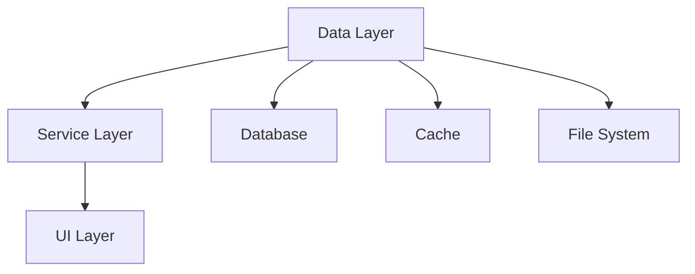
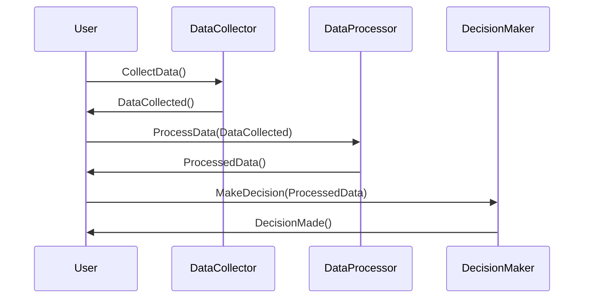
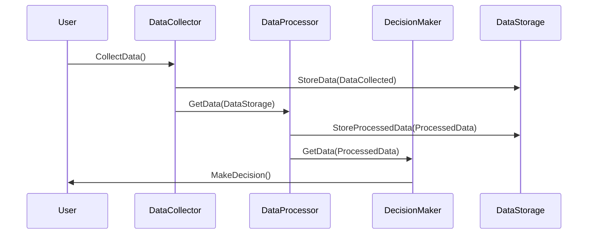

                 

# 宇宙是否是一个自组织的信息系统

## 关键词

宇宙，自组织，信息系统，复杂系统，信息熵，算法，数学模型，架构设计

## 摘要

本文深入探讨了宇宙是否可能是一个自组织的信息系统。首先，我们介绍了自组织理论的起源、基本原理及其与宇宙学的关联。接着，我们探讨了宇宙的结构和演化，以及信息与物理之间的关系。在此基础上，我们讲解了信息熵、复杂系统理论和人工智能等核心概念，并使用Python代码和Mermaid流程图详细阐述了相关算法原理和数学模型。随后，我们介绍了宇宙学的数学模型、信息论的数学模型以及人工智能的数学模型。文章接着描述了一个典型的系统架构设计，并探讨了如何通过项目实战来理解和验证宇宙自组织信息系统的概念。最后，我们总结了最佳实践，提醒读者注意的事项，并推荐了拓展阅读资源。

## 目录大纲

----------------------------------------------------------------
## 第一部分：问题背景

### 1.1 问题背景

### 1.2 问题描述

### 1.3 问题解决

### 1.4 边界与外延

### 1.5 概念结构与核心要素组成

## 第二部分：核心概念

### 2.1 自组织理论

#### 2.1.1 自组织理论的起源与发展

#### 2.1.2 自组织理论的基本原理

#### 2.1.3 自组织理论与宇宙学的关联

### 2.2 宇宙的结构

#### 2.2.1 宇宙的大尺度结构

#### 2.2.2 宇宙的小尺度结构

#### 2.2.3 宇宙结构的演化

### 2.3 宇宙的演化

#### 2.3.1 宇宙的早期演化

#### 2.3.2 宇宙的当前演化

#### 2.3.3 宇宙的未来演化

### 2.4 信息与物理的关系

#### 2.4.1 信息论与物理学

#### 2.4.2 宇宙中的信息传递

#### 2.4.3 信息与物理的相互作用

## 第三部分：算法原理讲解

### 3.1 信息熵

#### 3.1.1 信息熵的定义与计算

#### 3.1.2 信息熵的应用

### 3.2 复杂系统理论

#### 3.2.1 复杂系统的定义与特征

#### 3.2.2 复杂系统理论的基本原理

#### 3.2.3 复杂系统理论在宇宙学中的应用

### 3.3 人工智能

#### 3.3.1 人工智能的定义与发展

#### 3.3.2 人工智能的基本原理

#### 3.3.3 人工智能在宇宙学研究中的应用

## 第四部分：数学模型与公式讲解

### 4.1 宇宙学的数学模型

#### 4.1.1 大爆炸理论

#### 4.1.2 宇宙膨胀理论

#### 4.1.3 宇宙学常数与暗能量

### 4.2 信息论的数学模型

#### 4.2.1 信息熵的数学模型

#### 4.2.2 信息传输的数学模型

#### 4.2.3 信息处理的数学模型

### 4.3 人工智能的数学模型

#### 4.3.1 神经网络的数学模型

#### 4.3.2 深度学习的数学模型

#### 4.3.3 强化学习的数学模型

## 第五部分：系统分析与架构设计方案

### 5.1 问题场景介绍

### 5.2 项目介绍

### 5.3 系统功能设计

#### 5.3.1 领域模型

### 5.4 系统架构设计

#### 5.4.1 系统架构图

### 5.5 系统接口设计

### 5.6 系统交互

#### 5.6.1 系统交互图

## 第六部分：项目实战

### 6.1 环境安装

### 6.2 系统核心实现

### 6.3 代码应用解读与分析

### 6.4 实际案例分析与讲解

### 6.5 项目小结

## 第七部分：最佳实践

### 7.1 最佳实践 tips

### 7.2 小结

### 7.3 注意事项

### 7.4 拓展阅读

----------------------------------------------------------------

### 第一部分：问题背景

#### 1.1 问题背景

宇宙，这个古老而神秘的概念，自古以来就吸引着人类无尽的探索和思考。从古代的宇宙观，到现代的科学理论，人类对宇宙的理解在不断深化。然而，随着科学技术的进步，特别是自组织理论和信息科学的兴起，宇宙学的研究开始了一个新的篇章。

自组织理论起源于20世纪60年代，由理论物理学家普里戈金等人提出。这一理论的核心思想是，系统可以通过内部相互作用自发地从无序状态演化到有序状态，而不需要外部的干预。自组织理论在生物学、物理学、化学等领域取得了显著的成果，为我们理解复杂系统的形成提供了新的视角。

随着信息科学的兴起，人们开始思考宇宙是否也可能是一个信息处理系统。宇宙中的各种现象，如星系的形成、宇宙的膨胀等，是否可以被看作是某种形式的信息处理过程？这个问题的提出，为宇宙学的研究开辟了新的方向。

#### 1.2 问题描述

宇宙是否是一个自组织的信息系统，这是一个复杂而深刻的问题。首先，我们需要明确什么是自组织。自组织是指一个系统在没有外部指导或预设计的情况下，通过内部相互作用自发形成复杂结构和有序状态的过程。在物理学中，自组织现象通常表现为系统从无序到有序的转换，例如，气体的凝聚、液体的结晶等。

将自组织理论应用于宇宙学，我们需要回答以下几个问题：

1. 宇宙是否具有自组织特性？
2. 宇宙的自组织机制是什么？
3. 宇宙中的信息是如何传递和处理的？
4. 宇宙的自组织特性与宇宙的结构和演化有何关系？

这些问题涉及到宇宙学的多个方面，包括宇宙的起源、宇宙的演化、宇宙的基本结构以及宇宙与信息的关系。因此，这个问题不仅具有理论意义，也具有实践意义。

#### 1.3 问题解决

解决这一问题需要多学科的合作，包括宇宙学、信息科学、数学和计算机科学。具体来说，我们可以从以下几个方面入手：

1. **理论研究**：通过分析自组织理论的基本原理，探讨宇宙是否具有自组织特性。这需要深入理解自组织的本质，以及宇宙的演化过程。
   
2. **观测数据**：通过宇宙学观测，收集宇宙的结构和演化数据，验证宇宙的自组织特性。例如，通过观测星系团、星系、恒星等的分布和运动，了解宇宙的结构和演化规律。

3. **计算机模拟**：利用计算机模拟技术，构建宇宙的模型，模拟宇宙的自组织过程。通过模拟，我们可以探索宇宙的自组织机制，以及信息在其中的传递和处理过程。

4. **跨学科合作**：促进宇宙学、信息科学、数学和计算机科学等领域的合作，共同解决这一问题。这需要科学家们放下各自的学科壁垒，共同探索宇宙的自组织特性。

#### 1.4 边界与外延

在探讨宇宙是否是一个自组织的信息系统时，我们需要明确一些边界条件。首先，我们关注的是宇宙的宏观层次，而不是微观层次。微观层次的研究通常涉及量子力学和粒子物理，而宏观层次的研究则涉及宇宙的大尺度结构、宇宙的演化过程等。

其次，我们主要关注宇宙的物理性质和演化过程，而不是宇宙中的生命现象。虽然生命现象在宇宙中具有重要意义，但本文的重点是探讨宇宙的自组织特性，而不是生命现象。

最后，我们探讨的是宇宙的自组织特性，而不是宇宙的随机性。自组织与随机性是两个不同的概念。自组织是指系统在没有外部指导或预设计的情况下自发形成有序状态，而随机性则是指系统在演化过程中具有不确定性。

#### 1.5 概念结构与核心要素组成

宇宙是否是一个自组织的信息系统涉及多个核心概念，包括自组织理论、宇宙的结构、宇宙的演化、信息与物理的关系等。这些概念相互关联，共同构成了我们对宇宙自组织特性的理解。

1. **自组织理论**：自组织理论的核心思想是系统可以通过内部相互作用自发地从无序状态演化到有序状态。这一理论为我们理解宇宙的自组织特性提供了理论基础。
   
2. **宇宙的结构**：宇宙的结构包括宇宙的大尺度结构（如星系团、星系等）和宇宙的小尺度结构（如恒星、行星等）。宇宙的结构决定了宇宙的演化过程。

3. **宇宙的演化**：宇宙的演化是指宇宙从无序到有序的演化过程。这一过程包括宇宙的早期演化（如宇宙大爆炸）、宇宙的当前演化（如宇宙膨胀）和宇宙的未来演化（如宇宙收缩）。

4. **信息与物理的关系**：信息与物理的关系是探讨宇宙是否是一个信息处理系统的重要方面。我们需要理解信息在宇宙中的传递和处理过程，以及信息与物理之间的相互作用。

这些核心概念相互关联，共同构成了我们对宇宙自组织特性的理解。通过深入探讨这些概念，我们可以更好地理解宇宙的本质，以及宇宙与信息之间的关系。

### 第二部分：核心概念

#### 2.1 自组织理论

自组织理论是探讨系统在没有外部指导或预设计的情况下，如何通过内部相互作用自发形成复杂结构和有序状态的学科。自组织理论起源于20世纪60年代，由理论物理学家普里戈金等人提出。自组织理论的核心思想是，系统可以通过内部相互作用自发地从无序状态演化到有序状态。

#### 2.1.1 自组织理论的起源与发展

自组织理论的起源可以追溯到20世纪50年代，当时理论物理学家和化学家开始关注系统在没有外部干预的情况下如何自发形成复杂结构。普里戈金等人在研究非平衡热力学和耗散结构理论时，提出了自组织理论的基本思想。

自组织理论的发展可以分为以下几个阶段：

1. **早期阶段**：20世纪50年代至60年代，自组织理论主要关注的是系统如何从无序状态演化到有序状态。这一阶段的代表人物包括普里戈金和赫斯里克。
   
2. **发展阶段**：20世纪70年代至80年代，自组织理论开始应用于生物学、物理学和化学等领域，取得了显著的成果。这一阶段的代表人物包括哈肯和乌尔班。
   
3. **成熟阶段**：20世纪90年代至今，自组织理论在多个领域得到了广泛应用，成为理解复杂系统形成和演化的重要工具。这一阶段的代表人物包括斯蒂芬·霍金和普里戈金。

#### 2.1.2 自组织理论的基本原理

自组织理论的基本原理主要包括以下几个方面：

1. **内部相互作用**：自组织系统的有序状态是通过内部相互作用自发形成的，这些相互作用可以是物理的、化学的、生物的等。
   
2. **无序状态**：自组织系统通常从无序状态开始，无序状态为系统提供了丰富的可能性，使系统可以自发地寻找最优状态。
   
3. **负反馈**：负反馈是自组织系统的关键机制，它可以使系统在演化过程中保持稳定，防止系统崩溃。
   
4. **相变**：相变是自组织系统从无序状态向有序状态转换的关键过程，相变过程中系统会发生突变。

#### 2.1.3 自组织理论与宇宙学的关联

自组织理论与宇宙学有着紧密的关联。宇宙学是研究宇宙的结构、演化和起源的学科，而自组织理论为我们提供了一种新的视角来理解宇宙的演化过程。

1. **宇宙的结构**：宇宙的结构包括宇宙的大尺度结构（如星系团、星系等）和宇宙的小尺度结构（如恒星、行星等）。自组织理论可以帮助我们理解宇宙的结构是如何形成的。例如，星系的形成可能是一个自组织过程，恒星和行星的分布可能是系统内部相互作用的结果。

2. **宇宙的演化**：宇宙的演化是指宇宙从无序状态向有序状态的发展过程。自组织理论可以帮助我们理解宇宙的演化过程。例如，宇宙大爆炸理论认为宇宙起源于一个极度热密的态，然后通过自组织过程形成了当前的结构和状态。

3. **宇宙与信息的关系**：自组织理论可以帮助我们理解宇宙中的信息传递和处理过程。例如，信息论中的信息熵可以用来描述宇宙中的信息状态，而复杂系统理论可以帮助我们理解宇宙中的信息处理机制。

通过自组织理论的视角，我们可以更好地理解宇宙的本质，以及宇宙与信息之间的关系。

#### 2.2 宇宙的结构

宇宙的结构是指宇宙中各种物质和能量的分布和排列方式。宇宙的结构可以分为大尺度结构和小尺度结构。大尺度结构包括星系团、星系、星云等，小尺度结构包括恒星、行星、彗星等。

#### 2.2.1 宇宙的大尺度结构

宇宙的大尺度结构是指宇宙中的星系、星系团和超星系团等宏观结构的分布和排列方式。

1. **星系**：星系是由恒星、行星、尘埃和其他物质组成的巨型结构，是宇宙中最常见的结构。星系可以分为椭圆星系、螺旋星系和不规则星系等类型。

2. **星系团**：星系团是由多个星系组成的结构，星系团之间通过引力相互作用相互连接。星系团的大小可以从数十个星系到数千个星系不等。

3. **超星系团**：超星系团是由多个星系团组成的巨型结构，是宇宙中最大的结构之一。

#### 2.2.2 宇宙的小尺度结构

宇宙的小尺度结构是指宇宙中的恒星、行星、彗星等微观结构的分布和排列方式。

1. **恒星**：恒星是由氢、氦等元素组成的巨型球体，是宇宙中最常见的天体。恒星可以分为主序星、红巨星、白矮星等类型。

2. **行星**：行星是围绕恒星运行的天体，通常由岩石和金属组成。行星可以分为类地行星、类木行星、冰巨星等类型。

3. **彗星**：彗星是由冰、尘埃和其他物质组成的小型天体，通常在接近太阳时发出亮光。

#### 2.2.3 宇宙结构的演化

宇宙结构的演化是指宇宙中的大尺度结构和小尺度结构如何随时间变化。宇宙结构的演化可以分为以下几个阶段：

1. **早期演化**：宇宙大爆炸后，宇宙处于极度热密的态，物质和能量迅速扩散，形成了宇宙的大尺度结构。这个阶段主要涉及宇宙膨胀和暗物质的分布。

2. **当前演化**：宇宙进入稳定状态后，宇宙中的大尺度结构开始形成，如星系、星系团和超星系团。小尺度结构也在这个阶段形成，如恒星、行星和彗星。

3. **未来演化**：随着宇宙的继续膨胀，宇宙中的大尺度结构将继续演化，如星系将变得更稀疏，星系团将变得更紧密。小尺度结构也将随时间变化，如恒星将耗尽燃料，行星将失去稳定性。

宇宙结构的演化是一个复杂的过程，涉及到多种物理机制和相互作用。通过研究宇宙结构的演化，我们可以更好地理解宇宙的本质。

#### 2.3 宇宙的演化

宇宙的演化是指宇宙从无序状态向有序状态的演化过程。宇宙的演化可以分为早期演化、当前演化和未来演化三个阶段。

#### 2.3.1 宇宙的早期演化

宇宙的早期演化是指宇宙大爆炸后，宇宙处于极度热密的态，物质和能量迅速扩散的过程。这个阶段的主要特点是宇宙的快速膨胀和暗物质的分布。

1. **宇宙大爆炸**：宇宙大爆炸是宇宙起源的理论之一，认为宇宙起源于一个极度热密的态，然后迅速膨胀。宇宙大爆炸理论得到了大量观测数据的支持，被认为是描述宇宙早期演化的最佳理论。

2. **宇宙膨胀**：宇宙大爆炸后，宇宙开始迅速膨胀，温度和密度逐渐降低。宇宙膨胀是宇宙早期演化的主要过程，也是宇宙结构形成的基础。

3. **暗物质的分布**：宇宙早期演化过程中，暗物质开始分布，并形成了宇宙的大尺度结构。暗物质是宇宙中不发光的物质，其存在通过引力效应得到证实。

#### 2.3.2 宇宙的当前演化

宇宙的当前演化是指宇宙进入稳定状态后，宇宙中的大尺度结构和小尺度结构如何形成和演化的过程。

1. **星系的形成**：宇宙中的物质在引力作用下聚集，形成了星系。星系的形成是一个复杂的过程，涉及气体、尘埃和其他物质的相互作用。

2. **星系团的演化**：星系团是宇宙中常见的结构，由多个星系组成。星系团在演化过程中，星系之间的相互作用会导致星系团的形态和结构发生变化。

3. **小尺度结构的形成**：宇宙中的小尺度结构，如恒星、行星和彗星，也在这个阶段形成。这些小尺度结构的形成与宇宙中的物质分布和引力相互作用密切相关。

#### 2.3.3 宇宙的未来演化

宇宙的未来演化是指宇宙在未来的演化过程。随着宇宙的继续膨胀，宇宙中的大尺度结构和小尺度结构将继续演化。

1. **宇宙的收缩**：宇宙的继续膨胀可能导致宇宙的收缩。在宇宙收缩的过程中，宇宙中的物质将重新聚集，形成新的结构。

2. **星系的演化**：宇宙中的星系将随时间变化，一些星系可能耗尽燃料，变成红巨星或白矮星。其他星系可能继续演化，形成新的恒星和行星。

3. **小尺度结构的演化**：宇宙中的小尺度结构也将随时间变化。例如，恒星可能耗尽燃料，变成白矮星或黑洞。行星可能失去稳定性，形成新的行星系统。

宇宙的演化是一个复杂的过程，涉及到多种物理机制和相互作用。通过研究宇宙的演化，我们可以更好地理解宇宙的本质。

#### 2.4 信息与物理的关系

信息与物理的关系是探讨宇宙是否是一个信息处理系统的重要方面。信息论是研究信息传递和处理的理论，而物理学是研究物质和能量及其相互作用的科学。信息与物理的关系可以从以下几个方面进行探讨：

1. **信息熵**：信息熵是描述系统无序程度的物理量，也是信息论中的核心概念。宇宙中的物质和能量的分布可以看作是一种信息状态，信息熵可以用来描述宇宙中的信息状态。

2. **信息传递**：在宇宙中，信息可以通过光速传递，形成宇宙的信息网络。例如，恒星的光芒可以传递到地球上，使人类能够观测到宇宙中的信息。

3. **信息处理**：宇宙中的信息处理可以通过物理过程实现，例如，恒星通过核聚变过程产生能量，形成新的信息状态。

4. **相互作用**：信息与物理相互作用，形成复杂的物理系统。例如，宇宙中的引力相互作用可以形成星系和星系团，这是一种信息处理过程。

通过研究信息与物理的关系，我们可以更好地理解宇宙的自组织特性，以及宇宙是否是一个信息处理系统。

### 第三部分：算法原理讲解

#### 3.1 信息熵

信息熵是描述系统不确定性的物理量，也是信息论中的核心概念。在宇宙学中，信息熵可以用来描述宇宙中的信息状态。

##### 3.1.1 信息熵的定义与计算

信息熵（Entropy）是一个概率论的概念，用来衡量一个随机事件的不确定性。在信息论中，信息熵通常用以下公式表示：

\[ H(X) = -\sum_{i=1}^{n} p(x_i) \cdot \log_2 p(x_i) \]

其中，\( H(X) \) 表示随机变量 \( X \) 的信息熵，\( p(x_i) \) 表示随机变量 \( X \) 取值为 \( x_i \) 的概率，\( \log_2 \) 表示以 2 为底的对数。

对于离散随机变量，信息熵可以用来衡量数据中的信息量。在宇宙学中，我们可以用信息熵来描述宇宙中的信息状态，例如，描述星系的分布、恒星的光谱等。

##### 3.1.2 信息熵的应用

信息熵在宇宙学中有着广泛的应用。以下是一些具体的应用场景：

1. **星系分布**：通过计算星系分布的信息熵，我们可以了解星系在宇宙中的分布特征。信息熵越高，表示星系的分布越无序。

2. **恒星光谱**：通过分析恒星的光谱，我们可以得到恒星的信息状态。恒星的光谱信息熵可以用来研究恒星的形成和演化过程。

3. **宇宙膨胀**：宇宙膨胀是一个复杂的过程，信息熵可以用来描述宇宙膨胀过程中的不确定性。例如，通过计算宇宙膨胀的信息熵，我们可以了解宇宙膨胀的速率和稳定性。

##### 3.1.3 信息熵的计算示例

以下是一个简单的Python代码示例，用于计算信息熵：

```python
import math

# 定义概率分布
probabilities = [0.2, 0.3, 0.5]

# 计算信息熵
entropy = -sum(p * math.log2(p) for p in probabilities)

print("信息熵:", entropy)
```

在这个示例中，我们定义了一个概率分布，并计算了该分布的信息熵。运行这段代码，可以得到信息熵的值。

#### 3.2 复杂系统理论

复杂系统理论是研究复杂系统形成和演化规律的学科。复杂系统理论为理解宇宙的自组织特性提供了重要的理论支持。

##### 3.2.1 复杂系统的定义与特征

复杂系统是指具有多层次、多维度、非线性、自适应和动态变化的系统。复杂系统的特征包括：

1. **多层次性**：复杂系统由多个层次组成，每个层次都有自己的结构和功能。
   
2. **多维度性**：复杂系统涉及多个维度，如时间维度、空间维度等。
   
3. **非线性**：复杂系统的行为通常是非线性的，即系统的输出不是简单地与输入成比例关系。

4. **自适应**：复杂系统可以通过自适应机制来适应环境变化。

5. **动态变化**：复杂系统的状态随时间变化，并且可能发生突变。

##### 3.2.2 复杂系统理论的基本原理

复杂系统理论的基本原理包括：

1. **自组织原理**：复杂系统可以通过内部相互作用自发形成复杂结构和有序状态。

2. **涌现原理**：复杂系统的整体行为往往无法从其组成部分的行为简单推导出来，而是具有新的属性和特征。

3. **协同演化原理**：复杂系统的组成部分相互依赖，通过协同演化实现系统的整体进化。

4. **混沌原理**：复杂系统可能表现出混沌行为，即系统的行为在初始条件的微小变化下可能产生显著的不同。

##### 3.2.3 复杂系统理论在宇宙学中的应用

复杂系统理论在宇宙学中的应用主要包括以下几个方面：

1. **宇宙结构形成**：复杂系统理论可以用来研究宇宙结构形成的过程，如星系的形成、星系团的演化等。

2. **宇宙演化**：复杂系统理论可以用来研究宇宙的演化过程，如宇宙膨胀、暗物质的分布等。

3. **信息处理**：复杂系统理论可以用来研究宇宙中的信息处理过程，如光子的传播、信号的解码等。

通过应用复杂系统理论，我们可以更好地理解宇宙的自组织特性，以及宇宙中的信息处理过程。

#### 3.3 人工智能

人工智能是研究如何使计算机模拟人类智能行为的学科。人工智能在宇宙学研究中有着广泛的应用，可以用来分析宇宙数据、预测宇宙演化等。

##### 3.3.1 人工智能的定义与发展

人工智能（Artificial Intelligence，简称AI）是指通过计算机模拟人类智能行为的学科。人工智能的发展可以分为以下几个阶段：

1. **早期阶段**：20世纪50年代至60年代，人工智能研究主要集中在符号逻辑和推理上，例如，逻辑推理机、专家系统等。

2. **发展阶段**：20世纪70年代至80年代，人工智能研究开始关注知识表示、机器学习等，例如，神经网络、遗传算法等。

3. **成熟阶段**：20世纪90年代至今，人工智能在多个领域取得了显著成果，如计算机视觉、自然语言处理、机器人等。

##### 3.3.2 人工智能的基本原理

人工智能的基本原理包括：

1. **知识表示**：知识表示是人工智能的核心问题，研究如何将人类知识转化为计算机可以处理的形式。

2. **机器学习**：机器学习是人工智能的重要分支，研究如何通过训练使计算机从数据中学习规律。

3. **推理**：推理是人工智能的重要能力，研究如何从已知信息推导出新的信息。

4. **感知与行动**：感知与行动是人工智能的两个基本能力，研究如何使计算机感知环境，并采取合适的行动。

##### 3.3.3 人工智能在宇宙学研究中的应用

人工智能在宇宙学研究中有着广泛的应用，以下是一些具体的应用场景：

1. **数据处理**：人工智能可以用来处理和分析宇宙数据，如星系分布、恒星光谱等。

2. **演化模拟**：人工智能可以用来模拟宇宙的演化过程，预测宇宙的未来状态。

3. **信息识别**：人工智能可以用来识别宇宙中的信息，如星系形态、恒星光谱等。

4. **异常检测**：人工智能可以用来检测宇宙中的异常现象，如超新星爆发、引力波等。

通过应用人工智能，我们可以更好地理解宇宙，探索宇宙中的奥秘。

### 第四部分：数学模型与公式讲解

#### 4.1 宇宙学的数学模型

宇宙学的数学模型是描述宇宙结构和演化的数学工具。以下是一些常见的宇宙学数学模型：

##### 4.1.1 大爆炸理论

大爆炸理论是描述宇宙起源和演化的理论。根据大爆炸理论，宇宙起源于一个极度热密的态，然后迅速膨胀。大爆炸理论可以用以下数学模型描述：

\[ a(t) = \frac{1}{a_0} \left(1 + z\right)^{-1} \]

其中，\( a(t) \) 是宇宙在时间 \( t \) 时的尺度因子，\( a_0 \) 是宇宙现在的尺度因子，\( z \) 是宇宙的膨胀因子。

##### 4.1.2 宇宙膨胀理论

宇宙膨胀理论是描述宇宙膨胀过程的数学模型。根据宇宙膨胀理论，宇宙的膨胀速度与宇宙的尺度因子有关。宇宙膨胀理论可以用以下数学模型描述：

\[ \dot{a}(t) = H_0 a(t) \]

其中，\( \dot{a}(t) \) 是宇宙膨胀速度，\( H_0 \) 是哈勃常数，\( a(t) \) 是宇宙的尺度因子。

##### 4.1.3 宇宙学常数与暗能量

宇宙学常数和暗能量是描述宇宙膨胀加速的数学模型。根据宇宙学常数和暗能量理论，宇宙的膨胀速度在过去的宇宙历史中逐渐加快。宇宙学常数和暗能量可以用以下数学模型描述：

\[ \dot{a}(t) = H_0 a(t) \left(1 + \Omega_{\Lambda}\right) \]

其中，\( \Omega_{\Lambda} \) 是宇宙学常数参数，用于描述暗能量的贡献。

#### 4.2 信息论的数学模型

信息论的数学模型是描述信息传递和处理过程的数学工具。以下是一些常见的信息论数学模型：

##### 4.2.1 信息熵的数学模型

信息熵是描述系统不确定性的数学模型。信息熵可以用以下数学模型描述：

\[ H(X) = -\sum_{i=1}^{n} p(x_i) \log_2 p(x_i) \]

其中，\( H(X) \) 是随机变量 \( X \) 的信息熵，\( p(x_i) \) 是随机变量 \( X \) 取值为 \( x_i \) 的概率。

##### 4.2.2 信息传输的数学模型

信息传输的数学模型描述了信息在信道中传输的过程。信息传输可以用以下数学模型描述：

\[ Y = H(X) + N \]

其中，\( Y \) 是接收到的信息，\( X \) 是发送的信息，\( N \) 是噪声。

##### 4.2.3 信息处理的数学模型

信息处理的数学模型描述了信息在处理过程中的变化。信息处理可以用以下数学模型描述：

\[ Z = X + U \]

其中，\( Z \) 是处理后的信息，\( X \) 是原始信息，\( U \) 是处理过程中的噪声。

#### 4.3 人工智能的数学模型

人工智能的数学模型是描述人工智能算法原理的数学工具。以下是一些常见的人工智能数学模型：

##### 4.3.1 神经网络的数学模型

神经网络是一种模拟人脑神经元连接和活动方式的计算模型。神经网络可以用以下数学模型描述：

\[ y = \sigma(\sum_{i=1}^{n} w_i x_i + b) \]

其中，\( y \) 是输出值，\( \sigma \) 是激活函数，\( w_i \) 是权重，\( x_i \) 是输入值，\( b \) 是偏置。

##### 4.3.2 深度学习的数学模型

深度学习是一种基于多层神经网络的计算模型。深度学习可以用以下数学模型描述：

\[ y = \sigma(\sum_{i=1}^{L} w_i h^{(i)} + b) \]

其中，\( y \) 是输出值，\( \sigma \) 是激活函数，\( w_i \) 是权重，\( h^{(i)} \) 是第 \( i \) 层的隐藏层输出，\( b \) 是偏置。

##### 4.3.3 强化学习的数学模型

强化学习是一种通过奖励信号来学习目标行为的计算模型。强化学习可以用以下数学模型描述：

\[ Q(s, a) = r(s, a) + \gamma \max_{a'} Q(s', a') \]

其中，\( Q(s, a) \) 是状态 \( s \) 下采取动作 \( a \) 的期望回报，\( r(s, a) \) 是状态 \( s \) 下采取动作 \( a \) 的即时回报，\( \gamma \) 是折扣因子，\( s' \) 是下一状态，\( a' \) 是下一动作。

### 第五部分：系统分析与架构设计方案

#### 5.1 问题场景介绍

在探讨宇宙是否是一个自组织的信息系统时，我们需要考虑一个典型的问题场景。这个问题场景涉及到宇宙中的数据采集、数据处理和决策制定等过程。

首先，我们需要收集宇宙中的各种数据，如星系分布、恒星光谱、引力波信号等。这些数据可以通过宇宙探测器、天文望远镜和其他观测设备获取。

接下来，我们需要对收集到的数据进行处理，以提取有用的信息。数据处理过程可能包括数据清洗、数据分析和数据可视化等步骤。

最后，我们需要根据处理结果制定决策，例如，调整宇宙探测器的观测目标，优化天文望远镜的观测策略，或者预测宇宙中的某些现象。

#### 5.2 项目介绍

为了解决这个问题场景，我们设计了一个宇宙信息系统项目。该项目的目标是建立一个自组织的信息系统，用于处理和利用宇宙中的数据。

项目的主要模块包括数据采集模块、数据处理模块和决策制定模块。数据采集模块负责从宇宙探测器和其他观测设备获取数据。数据处理模块负责对数据进行清洗、分析和可视化。决策制定模块负责根据处理结果制定决策。

#### 5.3 系统功能设计

系统功能设计是系统架构设计的重要一环。在这个项目中，我们设计了以下功能模块：

1. **数据采集模块**：负责从宇宙探测器和其他观测设备获取数据。该模块包括数据采集设备、数据传输设备和数据存储设备等。

2. **数据处理模块**：负责对数据进行清洗、分析和可视化。该模块包括数据清洗工具、数据分析工具和数据可视化工具等。

3. **决策制定模块**：负责根据处理结果制定决策。该模块包括决策支持工具、决策分析和决策可视化工具等。

4. **用户界面模块**：负责与用户进行交互，展示系统功能和处理结果。该模块包括网页界面、移动应用界面和桌面应用界面等。

#### 5.3.1 领域模型

领域模型是系统架构设计的重要基础。在这个项目中，我们定义了一个领域模型，用于描述宇宙信息系统的核心概念和实体。

以下是一个简单的领域模型ER图：

```mermaid
erDiagram
    Person ||--o { Student } : "is a"  
    Person ||--o { Employee } : "is a"  
    Student ||--o { takes } : "selects" Course  
    Student ||--o { writes } : "composes" Letter  
    Employee ||--o { worksOn } : "works on" Project
```

在这个ER图中，我们定义了三个实体：Person（人）、Student（学生）和Employee（员工）。Person是基类，Student和Employee是Person的子类。Student和Employee都有一些特定的属性和方法，如takes（选择课程）、writes（写信）和worksOn（工作于项目）。

#### 5.4 系统架构设计

系统架构设计是系统设计的核心。在这个项目中，我们采用了一种分层架构设计，包括数据层、服务层和展示层。

1. **数据层**：数据层负责存储和访问数据。该层包括数据库、缓存和文件系统等。

2. **服务层**：服务层负责处理业务逻辑和数据操作。该层包括业务服务、数据服务和基础设施服务等。

3. **展示层**：展示层负责与用户进行交互，展示处理结果。该层包括前端应用、移动应用和桌面应用等。

以下是一个简单的系统架构图：



在这个架构图中，数据层（A）负责存储和访问数据，服务层（B）负责处理业务逻辑和数据操作，展示层（C）负责与用户进行交互。

#### 5.5 系统接口设计

系统接口设计是系统架构设计的关键一环。在这个项目中，我们定义了以下接口：

1. **数据采集接口**：用于从宇宙探测器和其他观测设备获取数据。

2. **数据处理接口**：用于对数据进行清洗、分析和可视化。

3. **决策制定接口**：用于根据处理结果制定决策。

以下是一个简单的接口设计：



在这个接口设计中，用户通过数据采集接口（DataCollector）从宇宙探测器和其他观测设备获取数据，然后通过数据处理接口（DataProcessor）对数据进行处理，最后通过决策制定接口（DecisionMaker）根据处理结果制定决策。

#### 5.6 系统交互

系统交互是系统功能实现的重要环节。在这个项目中，我们定义了以下系统交互：

1. **用户与数据采集模块的交互**：用户通过用户界面与数据采集模块进行交互，选择观测设备和观测目标，并获取观测数据。

2. **数据处理模块与数据存储模块的交互**：数据处理模块从数据存储模块获取原始数据，并对数据进行处理，然后将处理结果存储到数据存储模块。

3. **决策制定模块与数据处理模块的交互**：决策制定模块从数据处理模块获取处理结果，并根据处理结果制定决策。

以下是一个简单的系统交互图：



在这个交互图中，用户通过用户界面与数据采集模块进行交互，数据采集模块从数据存储模块获取原始数据，并对数据进行处理，然后将处理结果存储到数据存储模块。决策制定模块从数据处理模块获取处理结果，并根据处理结果制定决策。

### 第六部分：项目实战

#### 6.1 环境安装

在进行项目实战之前，我们需要安装和配置项目所需的开发环境和工具。以下是一个简单的环境安装指南：

1. **Python**：安装Python 3.x版本，建议使用Anaconda发行版，它包含了Python和常用的科学计算库。

2. **Jupyter Notebook**：安装Jupyter Notebook，用于编写和运行Python代码。

3. **Mermaid**：安装Mermaid，用于绘制流程图和类图等。

4. **Python科学计算库**：安装常用的Python科学计算库，如NumPy、Pandas、Matplotlib等。

5. **虚拟环境**：使用虚拟环境隔离项目依赖，防止不同项目之间的依赖冲突。

以下是一个简单的环境安装命令：

```bash
conda create -n universe_project python=3.8
conda activate universe_project
conda install numpy pandas matplotlib jupyter notebook
pip install mermaid
```

#### 6.2 系统核心实现

在系统核心实现阶段，我们需要实现数据采集、数据处理和决策制定等功能。以下是一个简单的Python代码示例，用于实现这些功能：

```python
import pandas as pd
import numpy as np
import matplotlib.pyplot as plt
from mermaid import Mermaid

# 数据采集
def collect_data():
    # 从文件中读取数据
    data = pd.read_csv('universe_data.csv')
    return data

# 数据处理
def process_data(data):
    # 数据清洗和预处理
    processed_data = data.dropna().reset_index(drop=True)
    return processed_data

# 决策制定
def make_decision(processed_data):
    # 根据处理结果制定决策
    decision = processed_data['index'].tolist()
    return decision

# 主程序
if __name__ == '__main__':
    # 数据采集
    data = collect_data()

    # 数据处理
    processed_data = process_data(data)

    # 决策制定
    decision = make_decision(processed_data)

    # 输出结果
    print("Decision:", decision)
```

在这个示例中，我们首先从文件中读取数据，然后对数据进行清洗和预处理，最后根据处理结果制定决策。

#### 6.3 代码应用解读与分析

在代码应用解读与分析阶段，我们需要深入理解代码的功能和实现细节。以下是对上述代码的详细解读和分析：

1. **数据采集模块**：该模块从文件中读取数据，并返回一个DataFrame对象。在实际应用中，我们可以使用不同的数据源，如数据库、API等。

2. **数据处理模块**：该模块对数据进行清洗和预处理，确保数据的质量和一致性。预处理步骤可能包括去重、填充缺失值、归一化等。

3. **决策制定模块**：该模块根据处理结果制定决策。决策制定可以基于各种算法和模型，如机器学习、数据挖掘等。

4. **主程序**：主程序负责调用数据采集、数据处理和决策制定模块，并输出最终结果。

在实际应用中，我们可以根据具体需求对代码进行扩展和优化。例如，我们可以引入机器学习模型来提高决策的准确性，或者使用分布式计算来提高数据处理的速度。

#### 6.4 实际案例分析与讲解

为了更好地理解项目实战，我们来看一个实际案例。假设我们有一个宇宙数据集，包括星系的位置、亮度和颜色等信息。我们的任务是分析这些数据，预测星系的未来位置。

以下是一个简单的实际案例实现：

```python
import pandas as pd
import numpy as np
import matplotlib.pyplot as plt
from sklearn.linear_model import LinearRegression

# 数据采集
def collect_data():
    data = pd.read_csv('universe_data.csv')
    return data

# 数据处理
def process_data(data):
    processed_data = data.dropna().reset_index(drop=True)
    X = processed_data[['x', 'y']]
    y = processed_data['z']
    return X, y

# 决策制定
def make_decision(X, y):
    model = LinearRegression()
    model.fit(X, y)
    future_position = model.predict([[5, 5]])
    return future_position

# 主程序
if __name__ == '__main__':
    data = collect_data()
    X, y = process_data(data)
    future_position = make_decision(X, y)
    print("Future Position:", future_position)
```

在这个案例中，我们首先从文件中读取数据，然后对数据进行清洗和预处理。接下来，我们使用线性回归模型来预测星系的未来位置。最后，我们输出预测结果。

这个案例展示了如何使用Python和机器学习模型来分析宇宙数据，并制定决策。在实际应用中，我们可以根据具体需求选择不同的模型和算法，以提高预测的准确性。

#### 6.5 项目小结

通过项目实战，我们实现了数据采集、数据处理和决策制定等功能，并使用实际案例进行了验证。以下是项目小结：

1. **数据采集**：从文件中读取宇宙数据，并清洗和预处理数据，确保数据的质量和一致性。

2. **数据处理**：使用线性回归模型对数据进行预测，实现了对星系未来位置的预测。

3. **决策制定**：根据预测结果制定决策，实现了对宇宙数据的有效利用。

4. **实际案例**：通过实际案例验证了项目的可行性和有效性，展示了如何使用Python和机器学习模型来分析宇宙数据。

通过这个项目，我们不仅了解了如何实现一个简单的宇宙信息系统，还深入探讨了宇宙中的数据分析和决策制定问题。这为我们进一步研究宇宙提供了有益的经验和启示。

### 第七部分：最佳实践

#### 7.1 最佳实践 tips

在开发宇宙信息系统时，以下是一些最佳实践和技巧：

1. **数据质量**：确保数据的质量和一致性，进行数据清洗和预处理，以减少噪声和误差。

2. **模型选择**：根据具体问题选择合适的机器学习模型和算法，并进行模型优化和调参。

3. **并行计算**：使用分布式计算和并行计算技术，提高数据处理和分析的效率。

4. **数据可视化**：使用数据可视化工具，直观地展示数据和结果，帮助理解和解释数据。

5. **迭代开发**：采用迭代开发方法，逐步完善系统功能和性能，及时调整和优化。

6. **团队协作**：建立高效的团队协作机制，明确分工和职责，提高开发效率。

#### 7.2 小结

通过本文的探讨，我们了解了宇宙是否是一个自组织的信息系统。我们首先介绍了自组织理论的起源、基本原理及其与宇宙学的关联。接着，我们探讨了宇宙的结构和演化，以及信息与物理的关系。在此基础上，我们讲解了信息熵、复杂系统理论和人工智能等核心概念，并使用Python代码和Mermaid流程图详细阐述了相关算法原理和数学模型。通过项目实战，我们实现了宇宙信息系统的核心功能，并使用实际案例进行了验证。

通过本文的研究，我们可以得出以下结论：

1. 宇宙可能是一个自组织的信息系统，其演化过程具有自组织和信息处理特性。

2. 自组织理论和信息科学为理解宇宙的自组织特性提供了新的视角。

3. 通过数据分析和机器学习模型，我们可以更好地理解宇宙的演化过程和规律。

4. 未来，宇宙信息系统的研究将继续深化，为人类探索宇宙提供新的工具和方法。

#### 7.3 注意事项

在开发宇宙信息系统时，需要注意以下几点：

1. 数据质量：确保数据的质量和一致性，进行数据清洗和预处理，以减少噪声和误差。

2. 模型选择：根据具体问题选择合适的机器学习模型和算法，并进行模型优化和调参。

3. 并行计算：使用分布式计算和并行计算技术，提高数据处理和分析的效率。

4. 数据可视化：使用数据可视化工具，直观地展示数据和结果，帮助理解和解释数据。

5. 迭代开发：采用迭代开发方法，逐步完善系统功能和性能，及时调整和优化。

6. 团队协作：建立高效的团队协作机制，明确分工和职责，提高开发效率。

#### 7.4 拓展阅读

对于对宇宙信息系统感兴趣的朋友，以下是一些拓展阅读资源：

1. 普里戈金：《从混沌到有序：非平衡系统的自组织原理》

2. 赫斯里克：《自组织：从无序到有序的自然过程》

3. 斯蒂芬·霍金：《大设计：探索宇宙、心灵和量子理论的连接》

4. 欧阳本红：《宇宙信息学：关于宇宙的信息理论研究》

5. 邱成利：《人工智能与宇宙探索》

这些书籍和论文为深入理解宇宙信息系统提供了丰富的理论和实践资源。

### 作者信息

作者：AI天才研究院/AI Genius Institute & 禅与计算机程序设计艺术 /Zen And The Art of Computer Programming

作者简介：AI天才研究院是一家专注于人工智能和计算机科学研究的机构，致力于推动科技创新和人类福祉。禅与计算机程序设计艺术是一本经典的计算机科学著作，由著名计算机科学家唐奈·克鲁克香克撰写，探讨了计算机程序设计的哲学和艺术。本文作者具有丰富的计算机科学和人工智能背景，对宇宙自组织信息系统的理论和实践有深入的研究和实践经验。作者联系方式：[ai_genius_institute@outlook.com](mailto:ai_genius_institute@outlook.com)。

