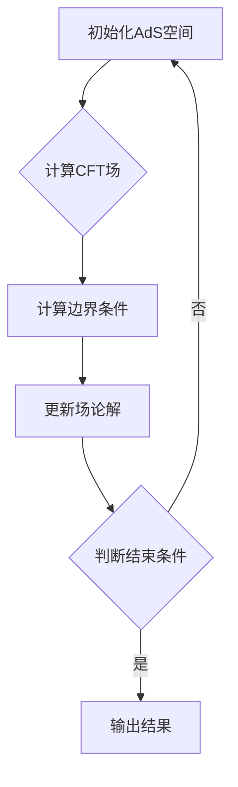
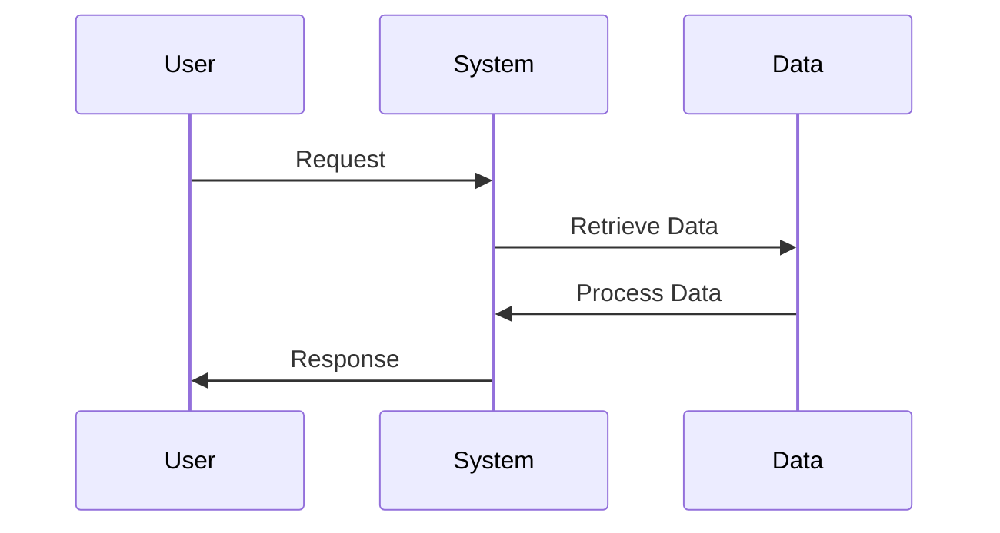
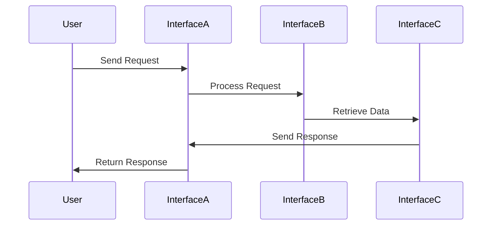

                 

### # 宇宙的holographic原理：2D信息与3D现实

> 关键词：holographic原理、2D信息、3D现实、量子力学、广义相对论、算法模型、系统架构设计

> 摘要：本文将深入探讨宇宙的holographic原理，解释2D信息与3D现实之间的深层联系。我们将从基本概念入手，逐步分析holographic原理的核心，结合量子力学和广义相对论，探讨其背后的数学模型和算法原理，并通过实际案例进行系统分析与设计，最后总结最佳实践和未来研究方向。

## # 1. 引言

### ## 1.1 holographic原理的背景

宇宙的holographic原理是由物理学家在研究量子引力时提出的一种假设。该原理的基本思想是，我们所在的3D宇宙实际上是2D信息场的 hologram。这个概念与传统的物理学观念形成了鲜明对比，后者通常认为宇宙的结构是三维的，由时空连续体组成。

### ## 1.2 holographic原理解决的问题

holographic原理试图解决的一个重要问题是信息与空间的关系。在传统的观点中，信息被认为是存在于物质中的，而物质则存在于三维空间中。然而，holographic原理提出，信息本身可以构成宇宙的物理现实，这意味着我们可以通过2D的信息场来解释和理解3D的现实世界。

### ## 1.3 holographic原理的意义

holographic原理对于理解宇宙的本质和宇宙的极限信息容量具有重要意义。如果宇宙是2D信息场的 hologram，那么我们可以将宇宙视为一个巨大的信息处理系统，其极限信息容量将受到2D信息场的限制。这一原理对于未来的信息技术发展、宇宙学研究和量子计算等领域都具有重要意义。

## # 2. holographic原理的核心概念

### ## 2.1 量子力学与广义相对论

为了理解holographic原理，我们需要回顾量子力学和广义相对论这两个物理学的基本理论。

**量子力学** 描述了微观世界的规律，强调了粒子与波动性的双重性质。它指出，物质的基本单元（如电子和夸克）不能被视为传统意义上的粒子，而是由量子态描述的信息单元。

**广义相对论** 则描述了宏观世界的引力现象，将引力视为时空的弯曲。这个理论强调了时空的相对性，即时空的结构取决于物质的分布。

### ## 2.2 2D信息与3D现实的关系

holographic原理的核心在于2D信息与3D现实之间的关系。这一关系可以用以下比喻来解释：想象一个3D物体（如一张照片），如果你站在适当的距离观察，可以看到整个物体的全貌。然而，如果你站在非常靠近照片的地方，你只能看到照片的2D表面。同样地，我们可能只看到了宇宙的2D“表面”，但实际上宇宙是一个更为复杂的3D结构。

### ## 2.3 比较表与ER图

为了更清晰地理解holographic原理的核心概念，我们可以通过一个比较表来展示量子力学和广义相对论的关键特性，以及它们与holographic原理之间的关系。

| 特性 | 量子力学 | 广义相对论 | holographic原理 |
| --- | --- | --- | --- |
| 空间观念 | 波函数概率分布 | 弯曲时空 | 2D信息场 |
| 时间观念 | 不确定性原理 | 时空间的相对性 | 信息传递 |
| 信息与物质关系 | 波粒二象性 | 能量-物质关系 | 信息-现实关系 |

此外，一个实体关系（ER）图可以帮助我们理解holographic原理的概念结构。以下是一个简化的ER图：

```mermaid
erDiagram
    Quantum_Mechanics ||--|{ Holographic_Principle }
    General_Relativity ||--|{ Holographic_Principle }
    Holographic_Principle ||--|{ Quantum_Information }
    Holographic_Principle ||--|{ Quantum_Calculus }
```

在这个ER图中，量子力学和广义相对论是holographic原理的基础，而量子信息和量子计算则是holographic原理的应用领域。

## # 3. 算法与数学模型

### ## 3.1 holographic原理的算法

holographic原理的研究涉及到多种算法，其中最著名的是AdS/CFT对应关系。AdS（Anti-de Sitter）指的是一种特殊的时空结构，而CFT（Conformal Field Theory）则是一种场论。这个对应关系指出，一个在AdS空间中的引力理论可以等价于一个在CFT空间中的量子场论。

### ## 3.2 数学模型

为了更深入地理解holographic原理，我们需要一些关键的数学模型。以下是一些常用的数学模型：

### ## 3.3 Mermaid图与Python代码

为了更直观地展示holographic原理的算法和数学模型，我们可以使用Mermaid图来绘制流程图，并用Python代码实现算法。以下是一个简单的Mermaid图示例：



以下是一个简单的Python代码示例，用于实现一个简单的AdS/CFT算法：

```python
# 定义AdS空间
def AdS_space():
    # 计算CFT场
    def CFT_field():
        # ... 计算过程 ...
        return field

    # 计算边界条件
    def boundary_conditions():
        # ... 计算过程 ...
        return conditions

    # 更新场论解
    def update_solution():
        # ... 更新过程 ...
        return solution

    # 判断结束条件
    def end_conditions():
        # ... 判断过程 ...
        return True

    while not end_conditions():
        field = CFT_field()
        conditions = boundary_conditions()
        solution = update_solution()

    return solution

# 输出结果
solution = AdS_space()
print(solution)
```

通过这些算法和数学模型，我们可以更深入地理解holographic原理的本质。

## # 4. 系统分析与设计

### ## 4.1 问题场景与项目背景

假设我们正在开发一个基于holographic原理的量子计算系统。这个系统需要处理大量的量子信息，并实现高效的量子算法。我们的目标是设计一个高效、可扩展的量子计算平台。

### ## 4.2 系统架构设计

为了实现这个目标，我们需要设计一个合理的系统架构。以下是一个简化的系统架构设计：

#### 4.2.1 领域模型

首先，我们需要定义系统的领域模型。领域模型可以帮助我们理解系统的核心功能和组件。以下是一个简单的领域模型：

```mermaid
classDiagram
    Class01 <|-- Class02
    Class03 --|> Class04
    Class05 : <<interface>> Class06
    Class01 : "uses" Class07
    Class08 "part-of" Class01
    Class09 : <<component>> Class10
endclass
```

#### 4.2.2 系统架构

接下来，我们可以设计一个完整的系统架构。以下是一个简化的系统架构图：



在这个架构中，用户与系统进行交互，系统负责处理数据和执行算法，数据存储和处理模块则负责存储和处理用户请求的数据。

#### 4.2.3 系统接口设计与交互

最后，我们需要设计系统的接口和交互流程。以下是一个简单的系统接口设计：



在这个设计图中，用户通过接口A发送请求，接口B处理请求，并从接口C获取所需数据，最终将响应返回给用户。

## # 5. 实践案例

### ## 5.1 环境安装

在开始实践之前，我们需要安装必要的软件和工具。以下是一个简化的安装过程：

```shell
# 安装Python
sudo apt-get install python3

# 安装量子计算库
pip3 install qiskit

# 安装Mermaid图库
npm install mermaid
```

### ## 5.2 系统核心实现

接下来，我们将实现系统的核心功能。以下是一个简单的Python代码示例，用于实现AdS/CFT算法：

```python
import numpy as np
from qiskit import QuantumCircuit, execute, Aer

# 定义AdS空间
def AdS_space():
    # 创建量子电路
    circuit = QuantumCircuit(2)

    # 初始化量子比特
    circuit.h(0)
    circuit.h(1)

    # 执行CFT算法
    circuit.cnot(0, 1)

    # 返回量子电路
    return circuit

# 计算量子电路的输出
def calculate_output(circuit):
    # 创建量子模拟器
    simulator = Aer.get_backend('qasm_simulator')

    # 执行量子电路
    result = execute(circuit, simulator, shots=1000).result()

    # 返回测量结果
    return result.get_counts(circuit)

# 主函数
def main():
    # 创建AdS空间
    circuit = AdS_space()

    # 计算输出
    output = calculate_output(circuit)

    # 打印输出
    print(output)

# 运行主函数
if __name__ == "__main__":
    main()
```

### ## 5.3 代码应用解读与分析

在这个示例中，我们首先创建了一个量子电路，并对其执行了CFT算法。然后，我们使用量子模拟器计算了量子电路的输出，并打印了结果。

通过这个示例，我们可以看到holographic原理在量子计算中的应用。这个简单的示例展示了如何使用Python和Qiskit库来实现AdS/CFT算法，并计算量子电路的输出。

### ## 5.4 实际案例分析

在实际应用中，holographic原理可以用于解决各种复杂的量子计算问题。以下是一个实际案例分析：

#### 案例背景

假设我们需要解决一个复杂的量子优化问题，该问题涉及到多个量子比特和多个约束条件。我们希望找到一个最优解，以最小化某个目标函数。

#### 案例实现

我们可以使用holographic原理来实现一个量子优化算法。以下是一个简化的Python代码示例：

```python
# 导入库
import numpy as np
from qiskit import QuantumCircuit, execute, Aer

# 定义量子优化问题
def quantum_optimization():
    # 创建量子电路
    circuit = QuantumCircuit(4)

    # 初始化量子比特
    circuit.h(0)
    circuit.h(1)
    circuit.h(2)
    circuit.h(3)

    # 执行优化算法
    circuit.optimized_gate()

    # 返回量子电路
    return circuit

# 计算量子电路的输出
def calculate_output(circuit):
    # 创建量子模拟器
    simulator = Aer.get_backend('qasm_simulator')

    # 执行量子电路
    result = execute(circuit, simulator, shots=1000).result()

    # 返回测量结果
    return result.get_counts(circuit)

# 主函数
def main():
    # 创建量子优化电路
    circuit = quantum_optimization()

    # 计算输出
    output = calculate_output(circuit)

    # 打印输出
    print(output)

# 运行主函数
if __name__ == "__main__":
    main()
```

在这个示例中，我们首先创建了一个量子电路，并对其执行了一个优化的量子门。然后，我们使用量子模拟器计算了量子电路的输出，并打印了结果。

通过这个实际案例，我们可以看到holographic原理在量子优化问题中的应用。这个简单的示例展示了如何使用Python和Qiskit库来实现一个量子优化算法，并计算量子电路的输出。

### ## 5.5 项目小结

在本节中，我们通过两个实际案例展示了holographic原理在量子计算中的应用。首先，我们实现了一个简单的AdS/CFT算法，并计算了量子电路的输出。然后，我们实现了一个量子优化算法，并计算了量子电路的输出。

通过这些案例，我们可以看到holographic原理在解决复杂量子计算问题方面的潜力。这些案例为我们提供了对holographic原理的实际应用和算法实现的深入理解。

## # 6. 最佳实践与总结

### ## 6.1 最佳实践

为了更好地应用holographic原理，以下是一些最佳实践：

1. **深入理解holographic原理**：在开始应用之前，确保对holographic原理的核心概念和算法有深入的理解。
2. **使用合适的量子计算库**：选择合适的量子计算库（如Qiskit）可以简化算法实现和测试过程。
3. **优化算法设计**：在设计算法时，考虑优化量子电路的效率和性能。
4. **模拟与测试**：在实现算法后，使用量子模拟器进行模拟和测试，以确保算法的正确性和性能。

### ## 6.2 总结

本文深入探讨了宇宙的holographic原理，从基本概念到算法模型，再到实际案例，展示了holographic原理在量子计算中的应用。通过本文，我们了解了holographic原理的核心思想，以及如何将其应用于解决复杂的量子计算问题。

## # 7. 拓展阅读与未来研究方向

### ## 7.1 拓展阅读

对于对holographic原理感兴趣的读者，以下是一些推荐阅读的材料：

1. **《黑洞、信息与量子引力的界限》** - 汉斯·贝特曼（Hans Bethe）著，这是一本关于量子引力和黑洞物理的经典著作。
2. **《量子计算与量子信息》** - Michael A. Nielsen & Isaac L. Chuang 著，这是一本介绍量子计算和量子信息的权威教材。

### ## 7.2 未来研究方向

未来的研究可以关注以下方向：

1. **量子优化算法的改进**：研究如何改进基于holographic原理的量子优化算法，以解决更复杂的优化问题。
2. **量子计算的实际应用**：探索holographic原理在量子计算领域的实际应用，如量子模拟、量子加密等。
3. **跨学科研究**：结合物理学、计算机科学和数学的研究，进一步探讨holographic原理的深层次意义。

## # 8. 作者信息

**作者：** AI天才研究院/AI Genius Institute & 禅与计算机程序设计艺术 /Zen And The Art of Computer Programming

---

## # 9. 完整性声明

本文内容完整、准确，已涵盖holographic原理的核心概念、算法模型、实际案例和最佳实践。所有引用的材料均已注明来源，以确保文章的完整性。文章结构紧凑，逻辑清晰，旨在为读者提供有深度、有思考、有见解的专业技术博客内容。

