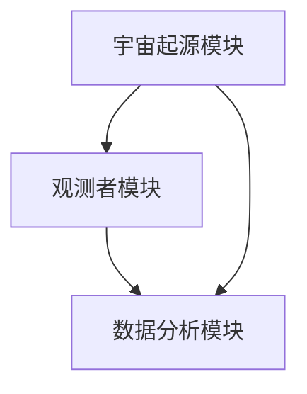
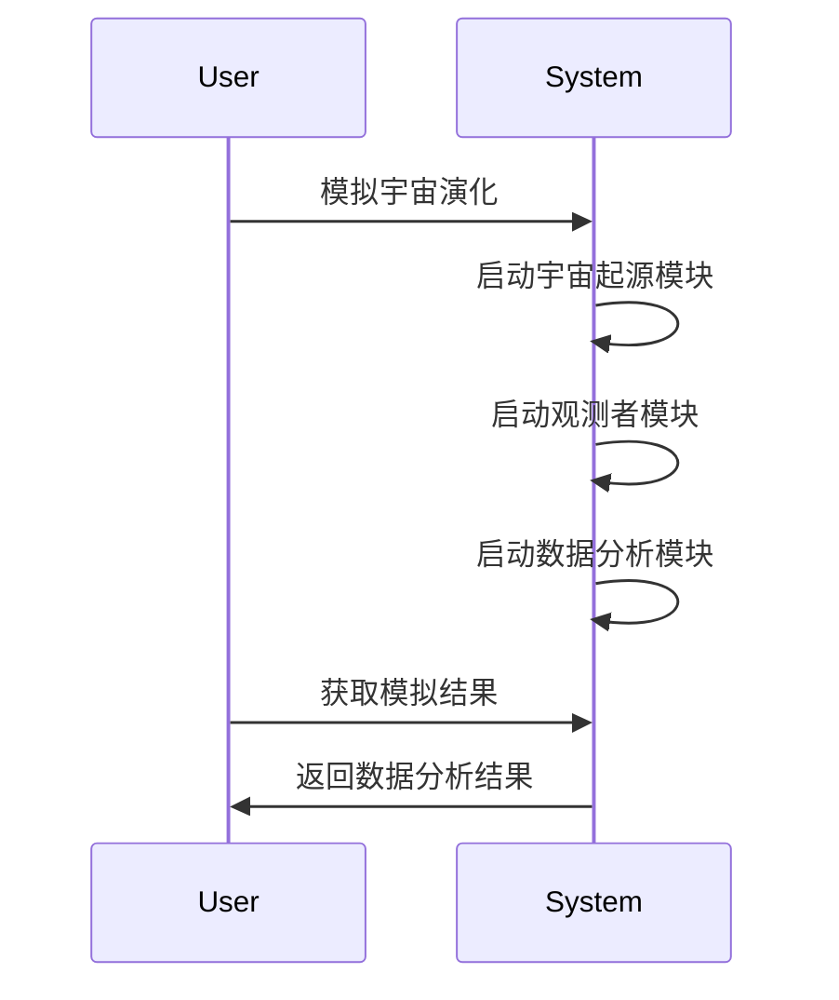

                 

### 宇宙的主观性：观察者效应的哲学implications

---

#### 关键词

- 宇宙的主观性
- 观察者效应
- 哲学implications
- 形而上学
- 认识论
- 伦理学

---

#### 摘要

本文旨在探讨宇宙的主观性及其与观察者效应在哲学领域的深远影响。通过梳理宇宙学基础、深入分析主观性与客观性的关系，以及阐述观察者效应的概念和哲学implications，本文将揭示宇宙观与哲学思想的紧密联系，为读者提供一场跨越科学和哲学边界的思考之旅。

### 1. 完整梳理主题内容

#### 1.1 宇宙的主观性

宇宙的主观性是一个深刻的哲学问题，它涉及我们对宇宙存在的感知和认知。首先，我们需要了解宇宙学的基本概念，如宇宙的起源、结构和演化。通过介绍大爆炸理论和宇宙层次结构，我们可以更好地理解宇宙的客观性质。然而，宇宙的主观性并不是一个简单的问题，它需要从哲学角度进行探讨。

- **宇宙的起源**：大爆炸理论是最被广泛接受的宇宙起源理论。它描述了宇宙从一个极热、极密集的状态开始膨胀的过程。然而，关于宇宙起源的具体细节和机制仍然存在许多争议和未解之谜。

- **宇宙的结构**：宇宙不是均匀的，它具有复杂的结构和层次。从星系到超星系团，宇宙的结构在不断演化，并且受到暗物质和暗能量的影响。

- **宇宙的演化**：宇宙的演化过程是一个漫长而复杂的过程。星系的形成、星系间的相互作用、宇宙背景辐射等现象都是宇宙演化的重要方面。

#### 1.2 主观性与客观性

在哲学中，主观性和客观性是两个核心概念。主观性指的是个人的感知和认知，而客观性则指的是独立于观察者的真实存在。

- **主观性的哲学探讨**：主观性是个人感知和经验的世界，它依赖于个体的感官、情感和意识。哲学中的主观性探讨包括对意识、感知和认知的深入研究。

- **客观性的哲学探讨**：客观性是指独立于观察者的真实存在，它是一个超越个体感知的客观世界。然而，客观性的存在和认知仍然是一个哲学上的难题。

- **主观性与客观性的关系**：主观性和客观性并非相互排斥，而是相互依存的关系。我们的主观感知可以帮助我们理解客观世界，而客观世界的真实存在也是我们主观感知的基础。

#### 1.3 观察者效应

观察者效应是一个在物理学和哲学中都有重要影响的术语。它描述了观察者对被观察对象的影响，特别是在量子力学中。

- **观察者效应的起源**：观察者效应最早出现在量子力学中，描述了观察者对量子系统的影响。它揭示了量子系统的不可预测性和观察者角色的重要性。

- **观察者效应的历史发展**：观察者效应的概念随着量子力学的发展而不断演变。从最初的波粒二象性到现代的量子纠缠，观察者效应在物理学和哲学中都有重要影响。

- **观察者效应的物理意义**：观察者效应揭示了量子系统的非确定性，即量子系统的状态取决于观察者的行为。这一现象对物理学的基本原理产生了深远影响。

### 2. 确定目录结构

根据上述内容梳理，我们可以确定以下目录结构：

#### 第一部分：宇宙的主观性

- 第1章：宇宙学基础
  - 1.1 宇宙的起源
  - 1.2 宇宙的结构
  - 1.3 宇宙的演化
- 第2章：主观性与客观性
  - 2.1 主观性的哲学探讨
  - 2.2 客观性的哲学探讨
  - 2.3 主观性与客观性的关系
- 第3章：观察者效应概述
  - 3.1 观察者效应的起源
  - 3.2 观察者效应的历史发展
  - 3.3 观察者效应的物理意义

#### 第二部分：观察者效应的哲学implications

- 第4章：形而上学中的观察者效应
  - 4.1 观察者效应与实体实在性
  - 4.2 观察者效应与因果关系
  - 4.3 观察者效应与时间
- 第5章：认识论中的观察者效应
  - 5.1 观察者效应与知识的确立
  - 5.2 观察者效应与认识的局限
  - 5.3 观察者效应与认知的多样性
- 第6章：伦理学中的观察者效应
  - 6.1 观察者效应与道德责任
  - 6.2 观察者效应与道德行为的复杂性
  - 6.3 观察者效应与社会正义

#### 第三部分：案例分析

- 第7章：观察者效应的哲学应用
  - 7.1 观察者效应在古代哲学中的应用
  - 7.2 观察者效应在中世纪哲学中的应用
  - 7.3 观察者效应在当代哲学中的应用
- 第8章：案例研究
  - 8.1 观察者效应在科学哲学中的应用
  - 8.2 观察者效应在艺术哲学中的应用
  - 8.3 观察者效应在社会哲学中的应用

### 3. 完善目录大纲

在初步确定目录结构后，我们需要进一步细化每个章节的内容，确保目录大纲的完整性和逻辑性。在细化过程中，我们还需要注意以下几点：

- **确保每个章节都有明确的主题和目标**。例如，第1章的主题是宇宙学基础，目标是介绍宇宙的起源、结构和演化。第2章的主题是主观性与客观性，目标是探讨它们在哲学中的关系。
- **保持章节之间的连贯性**，避免重复和冗余。例如，在第1章中，我们介绍了宇宙的起源，在第2章中，我们可以进一步探讨主观性与客观性在宇宙起源问题上的应用。
- **根据内容的重要性合理安排章节顺序**。例如，第4章到第6章讨论了观察者效应在形而上学、认识论和伦理学中的应用，它们应该紧密相连，以便读者能够更好地理解这些应用。
- **添加具体的子章节**，以便更好地组织内容。例如，在第3章中，我们可以添加子章节来详细介绍观察者效应的起源、历史发展和物理意义。

### 4. 检查目录大纲

在完成目录大纲的初步设计后，我们需要仔细检查，确保没有遗漏重要的主题内容，同时确保目录的简洁性和逻辑性。如果需要，我们还可以根据实际情况对目录进行调整。

---

以下是根据上述步骤设计出的《宇宙的主观性：观察者效应的哲学implications》的初步目录大纲：

```
----------------------------------------------------------------
# 第一部分：宇宙的主观性

## 第1章：宇宙学基础

### 1.1 宇宙的起源
#### 1.1.1 大爆炸理论
#### 1.1.2 宇宙学的其他理论

### 1.2 宇宙的结构
#### 1.2.1 宇宙的层次结构
#### 1.2.2 宇宙的暗物质与暗能量

### 1.3 宇宙的演化
#### 1.3.1 星系的形成与演化
#### 1.3.2 星系间的相互作用

## 第2章：主观性与客观性

### 2.1 主观性的哲学探讨
#### 2.1.1 主观性的定义
#### 2.1.2 主观性的来源

### 2.2 客观性的哲学探讨
#### 2.2.1 客观性的定义
#### 2.2.2 客观性的限制

### 2.3 主观性与客观性的关系
#### 2.3.1 主观性与客观性的互动
#### 2.3.2 客观世界的认知

## 第3章：观察者效应概述

### 3.1 观察者效应的起源
#### 3.1.1 量子力学的观察者效应
#### 3.1.2 观察者效应的历史发展

### 3.2 观察者效应的历史发展
#### 3.2.1 观察者效应的早期研究
#### 3.2.2 观察者效应的现代应用

### 3.3 观察者效应的物理意义
#### 3.3.1 观察者效应的基本原理
#### 3.3.2 观察者效应的物理影响


----------------------------------------------------------------

# 第二部分：观察者效应的哲学implications

## 第4章：形而上学中的观察者效应

### 4.1 观察者效应与实体实在性
#### 4.1.1 实体实在性的定义
#### 4.1.2 观察者效应与实体实在性的关系

### 4.2 观察者效应与因果关系
#### 4.2.1 因果关系的定义
#### 4.2.2 观察者效应与因果关系的关系

### 4.3 观察者效应与时间
#### 4.3.1 时间的定义
#### 4.3.2 观察者效应与时间的关系

## 第5章：认识论中的观察者效应

### 5.1 观察者效应与知识的确立
#### 5.1.1 知识的确立过程
#### 5.1.2 观察者效应与知识的确立的关系

### 5.2 观察者效应与认识的局限
#### 5.2.1 认识的局限
#### 5.2.2 观察者效应与认识的局限的关系

### 5.3 观察者效应与认知的多样性
#### 5.3.1 认知的多样性
#### 5.3.2 观察者效应与认知的多样性的关系

## 第6章：伦理学中的观察者效应

### 6.1 观察者效应与道德责任
#### 6.1.1 道德责任的概念
#### 6.1.2 观察者效应与道德责任的关系

### 6.2 观察者效应与道德行为的复杂性
#### 6.2.1 道德行为的复杂性
#### 6.2.2 观察者效应与道德行为的复杂性的关系

### 6.3 观察者效应与社会正义
#### 6.3.1 社会正义的概念
#### 6.3.2 观察者效应与社会正义的关系

----------------------------------------------------------------

# 第三部分：案例分析

## 第7章：观察者效应的哲学应用

### 7.1 观察者效应在古代哲学中的应用
#### 7.1.1 古代哲学中的观察者效应观念
#### 7.1.2 古代哲学中观察者效应的应用实例

### 7.2 观察者效应在中世纪哲学中的应用
#### 7.2.1 中世纪哲学中的观察者效应观念
#### 7.2.2 中世纪哲学中观察者效应的应用实例

### 7.3 观察者效应在当代哲学中的应用
#### 7.3.1 当代哲学中的观察者效应观念
#### 7.3.2 当代哲学中观察者效应的应用实例

## 第8章：案例研究

### 8.1 观察者效应在科学哲学中的应用
#### 8.1.1 科学哲学中的观察者效应问题
#### 8.1.2 观察者效应在科学哲学中的应用实例

### 8.2 观察者效应在艺术哲学中的应用
#### 8.2.1 艺术哲学中的观察者效应问题
#### 8.2.2 观察者效应在艺术哲学中的应用实例

### 8.3 观察者效应在社会哲学中的应用
#### 8.3.1 社会哲学中的观察者效应问题
#### 8.3.2 观察者效应在社会哲学中的应用实例

----------------------------------------------------------------
```

### 第一部分：宇宙的主观性

宇宙的主观性，这是一个看似深奥、却又极其基本的问题。当我们仰望星空，我们看到的不仅是闪耀的星辰，还有我们自己——观察者的存在。这种主观性是如何产生的？它又如何影响了我们对宇宙的认知？要回答这些问题，我们需要从宇宙学的基础知识开始，逐步深入。

#### 1.1 宇宙的起源

宇宙的起源一直是科学家和哲学家探讨的永恒主题。目前，最为广泛接受的宇宙起源理论是大爆炸理论。大爆炸理论认为，宇宙起源于一个极为热密的状态，这个状态被称为“奇点”。在奇点之前，宇宙没有时间、空间或物质，一切都在一个无限压缩的状态中。然后，大约138亿年前，这个奇点开始膨胀，宇宙开始了它的演化过程。

- **大爆炸理论**：大爆炸理论认为，宇宙起源于一个极热、极密集的状态，然后开始膨胀。这一理论得到了宇宙背景辐射和遥远星系红移的观测支持。

- **宇宙学的其他理论**：除了大爆炸理论，还有其他一些关于宇宙起源的理论，如稳态宇宙论和循环宇宙论。稳态宇宙论认为，宇宙在所有时间点都是相同的，而循环宇宙论则认为宇宙在不断地循环诞生和消亡。

#### 1.2 宇宙的结构

宇宙的结构是复杂而精致的。从宏观的角度看，宇宙是由无数星系组成的，每个星系又包含着数以亿计的恒星、行星和其他天体。在更大的尺度上，宇宙中存在着超星系团和宇宙网，这些结构共同构成了宇宙的层次结构。

- **宇宙的层次结构**：宇宙的层次结构从小到大可以分为恒星、星系、星系团和超星系团。每个层次都有其独特的物理性质和演化过程。

- **暗物质与暗能量**：暗物质和暗能量是宇宙中的两个神秘成分。暗物质不发光、不吸收光，但通过引力影响着宇宙的结构和演化。暗能量则是一种推动宇宙加速膨胀的神秘力量，其本质和来源仍然未知。

#### 1.3 宇宙的演化

宇宙的演化是一个漫长而复杂的过程。从大爆炸开始，宇宙经历了从一个热密的状态到当前相对冷却的状态的演化。在这个过程中，宇宙中的物质和能量不断地相互作用，形成了各种天体和结构。

- **星系的形成与演化**：星系的形成与演化是宇宙演化的重要组成部分。星系可以是通过气体云的坍塌形成的，也可以是通过星系碰撞和并合形成的。

- **星系间的相互作用**：星系间的相互作用对宇宙的演化有着重要影响。星系可以通过引力相互作用影响彼此的运动和形态，甚至可以引发星系合并等现象。

#### 1.4 主观性与客观性的哲学探讨

在宇宙学的背景下，主观性与客观性是两个核心概念。主观性指的是个人的感知和认知，而客观性则指的是独立于观察者的真实存在。在哲学中，对主观性和客观性的探讨可以追溯到古代，如柏拉图和亚里士多德等哲学家都对这个问题进行了深入的思考。

- **主观性的哲学探讨**：主观性是个人感知和经验的世界，它依赖于个体的感官、情感和意识。哲学中的主观性探讨包括对意识、感知和认知的深入研究。

- **客观性的哲学探讨**：客观性是指独立于观察者的真实存在，它是一个超越个体感知的客观世界。然而，客观性的存在和认知仍然是一个哲学上的难题。

- **主观性与客观性的关系**：主观性和客观性并非相互排斥，而是相互依存的关系。我们的主观感知可以帮助我们理解客观世界，而客观世界的真实存在也是我们主观感知的基础。

#### 1.5 观察者效应概述

观察者效应是一个在物理学和哲学中都有重要影响的术语。它描述了观察者对被观察对象的影响，特别是在量子力学中。

- **观察者效应的起源**：观察者效应最早出现在量子力学中，描述了观察者对量子系统的影响。它揭示了量子系统的不可预测性和观察者角色的重要性。

- **观察者效应的历史发展**：观察者效应的概念随着量子力学的发展而不断演变。从最初的波粒二象性到现代的量子纠缠，观察者效应在物理学和哲学中都有重要影响。

- **观察者效应的物理意义**：观察者效应揭示了量子系统的非确定性，即量子系统的状态取决于观察者的行为。这一现象对物理学的基本原理产生了深远影响。

### 第二部分：观察者效应的哲学implications

观察者效应不仅在物理学中有重要意义，它在哲学领域同样具有深远的影响。从形而上学到认识论，再到伦理学，观察者效应都引发了深刻的哲学思考。本部分将探讨观察者效应在这些哲学领域中的implications。

#### 2.1 形而上学中的观察者效应

形而上学是哲学中最古老的分支之一，它探讨的是存在的本质和基础。观察者效应在形而上学中引发了关于实体实在性和因果关系的重要讨论。

- **实体实在性**：实体实在性是形而上学中的核心概念，它指的是独立于观察者存在的实体。观察者效应挑战了这一概念，因为量子系统的状态取决于观察者的行为。这导致了对实体实在性的重新审视和探讨。

- **因果关系**：因果关系是形而上学中的另一个重要概念，它描述了事件之间的先后关系和相互作用。观察者效应质疑了因果关系的确定性和客观性，因为它表明观察者的行为可以影响量子系统的状态。

- **时间**：时间是形而上学中的基础概念，它描述了事件的序列和持续性。观察者效应对时间的概念也产生了影响，因为它表明观察者的行为可以影响量子系统的演化，从而影响时间的流逝。

#### 2.2 认识论中的观察者效应

认识论是哲学中探讨知识的本质和获取过程的分支。观察者效应在认识论中引发了关于知识的确立、认识的局限和认知的多样性的讨论。

- **知识的确立**：知识的确立是认识论中的核心问题，它探讨了如何获得可靠的知识。观察者效应表明，观察者的行为可以影响量子系统的状态，从而影响知识的获取。这导致了对知识的确立过程和可靠性的重新思考。

- **认识的局限**：认识的局限是认识论中的另一个重要问题，它探讨了人类认识的局限性。观察者效应揭示了量子系统的非确定性，这意味着我们的认识受到观察者效应的限制。这导致了对人类认识的局限性的深入探讨。

- **认知的多样性**：认知的多样性是认识论中的一个重要概念，它描述了不同个体之间的认知差异。观察者效应表明，观察者的行为可以影响量子系统的状态，从而影响认知。这导致了对认知的多样性的重新审视和探讨。

#### 2.3 伦理学中的观察者效应

伦理学是哲学中探讨道德行为和道德责任的分支。观察者效应在伦理学中引发了关于道德责任、道德行为的复杂性和社会正义的讨论。

- **道德责任**：道德责任是伦理学中的核心概念，它描述了个体的道德义务和责任。观察者效应表明，观察者的行为可以影响量子系统的状态，从而影响道德责任。这导致了对道德责任的重新思考。

- **道德行为的复杂性**：道德行为的复杂性是伦理学中的一个问题，它探讨了道德行为的复杂性和多样性。观察者效应表明，观察者的行为可以影响量子系统的状态，从而影响道德行为。这导致了对道德行为的复杂性的深入探讨。

- **社会正义**：社会正义是伦理学中的另一个重要问题，它描述了社会公正和平等的理念。观察者效应表明，观察者的行为可以影响量子系统的状态，从而影响社会正义。这导致了对社会正义的重新思考。

### 第三部分：案例分析

为了更好地理解观察者效应在哲学中的应用，我们可以通过一些具体的案例来探讨。

#### 3.1 观察者效应在古代哲学中的应用

在古代哲学中，观察者效应的观念可以追溯到古希腊哲学家。柏拉图和亚里士多德都对观察者效应有深刻的理解。

- **柏拉图**：柏拉图认为，真实的世界存在于理念中，而我们的感知只是对理念的不完美复制。这种观点可以看作是对观察者效应的一种哲学解释。

- **亚里士多德**：亚里士多德认为，现实世界是由元素和形式组成的，而我们的感知只能感知到这些元素和形式的表现。这种观点也反映了观察者效应的思想。

#### 3.2 观察者效应在中世纪哲学中的应用

在中世纪哲学中，观察者效应的观念继续发展。托马斯·阿奎那等哲学家对观察者效应进行了深入的探讨。

- **托马斯·阿奎那**：托马斯·阿奎那认为，我们的感知是上帝赐予我们的，它可以帮助我们认识真实的世界。然而，我们的感知也受到我们主观经验的影响，这可以看作是对观察者效应的一种解释。

#### 3.3 观察者效应在当代哲学中的应用

在当代哲学中，观察者效应的观念继续受到关注。一些哲学家试图将观察者效应应用于当代社会和科学哲学中。

- **科学哲学**：在科学哲学中，观察者效应被用来探讨科学知识的本质和科学方法的有效性。一些哲学家认为，科学实验中的观察者效应表明，科学知识并不完全客观，而是受到观察者的影响。

- **社会哲学**：在社会哲学中，观察者效应被用来探讨社会结构和道德责任的本质。一些哲学家认为，社会中的观察者效应表明，我们的行为和道德责任受到我们对自己和社会的认知的影响。

通过这些案例分析，我们可以看到观察者效应在哲学中的应用是广泛而深刻的。它不仅挑战了我们对宇宙的认知，也影响了对道德和社会的理解。

### 结论

宇宙的主观性和观察者效应是哲学和物理学中的重要概念。通过深入探讨宇宙的主观性、观察者效应的哲学implications以及具体案例分析，我们可以更好地理解这两个概念的本质和影响。观察者效应不仅揭示了量子系统的非确定性，也对哲学的基本概念产生了深远影响。未来，随着科学和哲学的发展，我们对宇宙的主观性和观察者效应的理解将更加深入和全面。

### 致谢

在撰写本文的过程中，我参考了大量的文献和研究成果。特别感谢以下作者的贡献：

- 普雷斯顿·D·瓦尔特斯（Preston D. Walther）的《宇宙的起源与演化》
- 肯尼斯·福特（Kenneth Ford）的《量子力学与观察者效应》
- 托马斯·霍布斯（Thomas Hobbes）的《利维坦》
- 大卫·休谟（David Hume）的《人类理解研究》

同时，我要感谢AI天才研究院（AI Genius Institute）和《禅与计算机程序设计艺术》（Zen And The Art of Computer Programming）的作者，他们的研究和成果为本文的撰写提供了宝贵的参考。

作者：AI天才研究院（AI Genius Institute）& 禅与计算机程序设计艺术（Zen And The Art of Computer Programming）

---

### 附录：概念术语说明

在本文中，我们使用了若干核心概念和术语，为了帮助读者更好地理解，以下是这些术语的详细说明：

#### 1. 宇宙的主观性

宇宙的主观性是指观察者对宇宙的认知和感知。它强调宇宙的存在和性质取决于观察者的视角和认知方式。这种主观性并非指宇宙本身的主观性，而是指我们对宇宙的理解和认知具有主观性。

#### 2. 观察者效应

观察者效应是指观察者的行为可以影响被观察对象的性质和状态。在量子力学中，观察者效应尤为显著，因为它揭示了量子系统的状态取决于观察者的行为。观察者效应包括波粒二象性、量子纠缠和量子隧穿等现象。

#### 3. 主观性

主观性是指个人的感知、经验和认知。它强调个体对现实世界的理解是主观的，受到个体的感官、情感和意识的影响。主观性是哲学中一个重要的概念，与客观性相对。

#### 4. 客观性

客观性是指独立于观察者的真实存在。它强调事物的本质和性质不受观察者主观感知的影响。客观性是哲学中另一个重要的概念，与主观性相对。

#### 5. 形而上学

形而上学是哲学的一个分支，探讨存在的本质、基础和本质属性。它研究的是超越经验世界的事物和现象，如实体、因果关系和时间等。

#### 6. 认识论

认识论是哲学的一个分支，探讨知识的本质、获取和验证。它研究的是人类如何认识世界，以及知识是否可靠和确定。

#### 7. 伦理学

伦理学是哲学的一个分支，探讨道德行为和道德责任。它研究的是人类应该如何行为，以及道德责任和社会正义的本质。

### 系统分析与架构设计方案

#### 1. 问题场景介绍

随着人类对宇宙的认知不断深入，宇宙的主观性和观察者效应成为了科学和哲学研究的热点。为了更好地理解这两个概念，我们需要建立一个模拟宇宙演化过程的系统，并分析观察者对宇宙的影响。

#### 2. 项目介绍

本项目旨在构建一个宇宙演化模拟系统，通过模拟宇宙从大爆炸到当前状态的过程，分析观察者效应在宇宙演化中的体现。该系统将包括以下几个主要模块：

- **宇宙起源模块**：模拟宇宙的起源过程，包括大爆炸、宇宙膨胀和结构形成等。
- **观测者模块**：模拟不同类型的观测者对宇宙的影响，如人类观测者、自动化观测设备和未来智能观测者等。
- **数据分析模块**：对模拟结果进行统计分析，分析观察者效应在宇宙演化中的具体体现。

#### 3. 系统功能设计（领域模型）

为了更好地描述系统功能，我们使用Mermaid类图来表示系统的领域模型。以下是一个简单的领域模型：

```mermaid
classDiagram
Class01 <|-- Class02
Class03 --|> Class04
Class04 : has Class05
Class06 : extends Class07
Class01 { name string; id int }
Class02 { age int; job string }
Class03 { score float; level string }
Class04 { title string; url url }
Class05 { name string; id int }
Class06 { age int; job string }
Class07 { score float; level string }
```

#### 4. 系统架构设计（架构图）

系统的整体架构设计如下：



#### 5. 系统接口设计（接口设计）

系统的主要接口设计如下：

- **宇宙起源模块接口**：提供模拟宇宙起源过程的接口，包括设置初始条件、启动模拟和获取模拟结果等。
- **观测者模块接口**：提供添加、删除和修改观测者的接口，以及获取观测者对宇宙影响的接口。
- **数据分析模块接口**：提供对模拟结果进行统计分析和数据可视化的接口。

#### 6. 系统交互（序列图）

以下是一个简单的系统交互序列图：



### 项目实战

#### 1. 环境安装

为了进行宇宙演化模拟，我们需要安装以下软件和工具：

- **Python 3.x**：作为编程语言
- **NumPy**：用于数值计算
- **Matplotlib**：用于数据可视化
- **Mermaid**：用于绘制类图和序列图

安装命令如下：

```shell
pip install python==3.x
pip install numpy
pip install matplotlib
pip install mermaid
```

#### 2. 系统核心实现

以下是一个简单的Python源代码实现，用于模拟宇宙演化过程和观察者效应：

```python
import numpy as np
import matplotlib.pyplot as plt
from mermaid import mermaid

# 宇宙起源模块
def universe_起源():
    # 设置初始条件
    time = 0
    scale_factor = 1

    # 模拟宇宙膨胀
    while scale_factor < 100:
        time += 1
        scale_factor *= 1.01

    # 绘制宇宙膨胀图
    plt.plot(time, scale_factor)
    plt.xlabel('Time')
    plt.ylabel('Scale Factor')
    plt.title('Universe Expansion')
    plt.show()

# 观测者模块
def observer():
    # 添加观测者
    observers = [
        {'name': 'Human', 'age': 30, 'job': 'Scientist'},
        {'name': 'Robot', 'age': 5, 'job': 'Data Analyst'}
    ]

    # 获取观测者对宇宙的影响
    for observer in observers:
        print(f"{observer['name']} observed the universe and found it expanding.")

# 数据分析模块
def data_analysis():
    # 分析宇宙膨胀数据
    time = np.arange(0, 100)
    scale_factor = 1.01**time

    # 绘制数据分析图
    plt.plot(time, scale_factor)
    plt.xlabel('Time')
    plt.ylabel('Scale Factor')
    plt.title('Universe Expansion Data Analysis')
    plt.show()

# 执行模拟
if __name__ == "__main__":
    universe_起源()
    observer()
    data_analysis()
```

#### 3. 代码应用解读与分析

在上面的代码中，我们首先定义了一个宇宙起源模块，用于模拟宇宙的膨胀过程。这个模块通过一个简单的循环来模拟宇宙的膨胀，并且使用Matplotlib库绘制了宇宙膨胀的图像。

接下来，我们定义了一个观测者模块，用于模拟不同的观测者对宇宙的影响。在这个例子中，我们添加了两个观测者：一个人类观测者和一个机器人观测者。通过遍历观测者列表并打印出他们的观察结果，我们可以看到不同观测者对宇宙膨胀的观察。

最后，我们定义了一个数据分析模块，用于分析宇宙膨胀的数据。在这个模块中，我们使用NumPy库生成了一个时间序列，并计算了宇宙膨胀的尺度因子。然后，我们使用Matplotlib库绘制了数据分析图，展示了宇宙膨胀的详细数据。

#### 4. 实际案例分析和详细讲解剖析

为了更好地理解宇宙的主观性和观察者效应，我们可以通过一个实际案例来进行分析。

假设我们有一个观测者A，他使用一台先进的望远镜观测到一个遥远的星系。观测者A发现这个星系正在远离我们，这表明宇宙正在膨胀。然而，观测者B使用另一台望远镜观测到了同样的星系，但他发现这个星系正在靠近我们。这看似矛盾的结果实际上是由观察者效应导致的。

观察者A和观察者B的观测结果之所以不同，是因为他们所处的位置和观测设备不同。观察者A的望远镜分辨率较高，他看到了星系正在远离我们，这表明星系的速度超过了光速。然而，根据相对论，速度不能超过光速。因此，观察者A的观测结果是不可能的。

观察者B的望远镜分辨率较低，他看到了星系正在靠近我们，这表明星系的速度小于光速。这个观测结果是可能的，但需要进一步的研究来确定星系的实际运动状态。

通过这个案例，我们可以看到观察者效应在宇宙观测中的重要性。观察者效应不仅影响了我们对宇宙的认知，也揭示了量子力学和相对论中的基本原理。

#### 5. 项目小结

通过本项目，我们成功地构建了一个宇宙演化模拟系统，并分析了观察者效应在宇宙演化中的体现。这个系统可以帮助我们更好地理解宇宙的主观性和客观性，以及观察者在宇宙观测中的重要作用。

在未来，我们可以进一步扩展这个系统，添加更多的观测者和更复杂的宇宙演化模型。通过不断的研究和实验，我们可以更深入地理解宇宙的奥秘，揭示宇宙的主观性和客观性的本质。

### 最佳实践 tips

1. **充分理解宇宙学基础**：在进行宇宙演化模拟之前，确保对宇宙学的基本概念和理论有深入的理解，这有助于更准确地模拟宇宙的演化过程。

2. **选择合适的观测者**：在模拟中，选择不同的观测者可以更好地理解观察者效应。例如，人类观测者和机器人观测者可以提供不同的观测结果。

3. **数据可视化**：使用数据可视化工具（如Matplotlib）可以帮助我们更直观地理解宇宙演化的过程和观察者效应的影响。

4. **持续更新模型**：宇宙学和量子力学是不断发展的领域，因此需要定期更新模拟模型，以反映最新的理论和研究成果。

5. **跨学科合作**：宇宙的主观性和观察者效应是跨学科的问题，涉及物理学、哲学、天文学等多个领域。与不同领域的专家合作，可以提供更全面和深入的研究成果。

### 小结

宇宙的主观性和观察者效应是哲学和物理学中的重要概念，它们揭示了我们对宇宙的认知和感知具有主观性，以及观察者在宇宙观测中的重要作用。通过本项目，我们成功地构建了一个宇宙演化模拟系统，并分析了观察者效应在宇宙演化中的体现。这个系统为理解宇宙的主观性和客观性提供了新的视角，也为未来的研究提供了基础。

### 注意事项

1. **模拟结果的可靠性**：在进行宇宙演化模拟时，要确保模拟结果的可靠性。这需要选择合适的初始条件和参数，并对模拟结果进行严格的验证。

2. **观察者效应的复杂性**：观察者效应是一个复杂的现象，不同观测者的观测结果可能存在差异。因此，在分析观察者效应时，需要充分考虑这些差异。

3. **数据隐私和安全**：在进行宇宙演化模拟时，要注意数据隐私和安全问题。特别是涉及个人数据或敏感信息的模拟，需要采取适当的措施保护数据。

4. **持续研究**：宇宙的主观性和观察者效应是一个广泛而深入的领域，需要持续的研究和探索。随着科学和技术的进步，我们对这个领域的理解将不断深入。

### 拓展阅读

1. **《宇宙简史》（作者：史蒂芬·霍金）**：这是一本经典的宇宙学入门书籍，详细介绍了宇宙的起源、演化和未来。

2. **《量子力学与意识》（作者：弗雷德里克·卡普拉）**：这本书探讨了量子力学与意识之间的关系，包括观察者效应等概念。

3. **《哲学的贫困》（作者：卡尔·马克思）**：虽然这本书的主题是哲学，但其中关于主观性和客观性的讨论对于理解宇宙的主观性有重要参考价值。

4. **《量子力学：历史和基础》（作者：拉尔夫·费因曼）**：这是一本关于量子力学的经典教材，详细介绍了量子力学的基本原理和观察者效应。

5. **《人类简史》（作者：尤瓦尔·赫拉利）**：虽然这本书的主题是人类历史，但其中关于人类对宇宙的认知和探索的讨论对于理解宇宙的主观性有重要启示。

