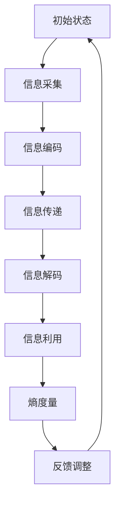
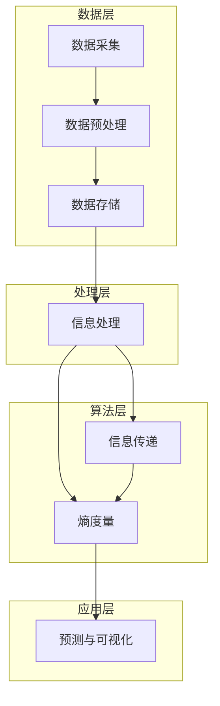
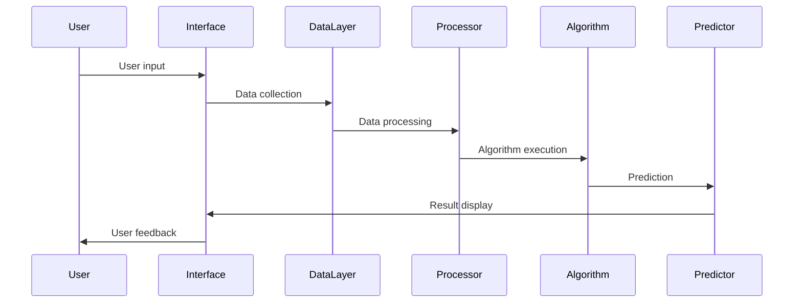
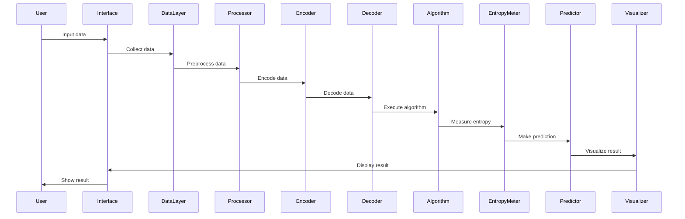

                 

### 文章标题：宇宙的信息动力学：熵与结构的辩证关系

宇宙，这个浩瀚的宇宙，从大爆炸的初始那一刻起，便不断展现出其丰富多彩的景象。在这其中，信息的传递与转换，成为推动宇宙演化的关键力量。宇宙的信息动力学，正是研究这一现象的学科。而熵，作为衡量信息混乱程度的重要指标，与宇宙结构的演变息息相关。本文将探讨熵与结构的辩证关系，并逐步揭示信息在宇宙演化中的关键作用。

### 关键词

- 宇宙信息动力学
- 熵
- 结构演变
- 信息的传递与转换

### 摘要

本文将从宇宙信息动力学的背景出发，深入探讨熵与结构的辩证关系。通过分析核心概念原理，对比不同熵度量方法的特点，展示宇宙信息动力学中的关键实体及其相互关系。进一步，我们将详细讲解宇宙信息动力学算法的原理与实现，通过数学模型和公式，揭示算法背后的逻辑。在此基础上，本文还将介绍系统分析与架构设计方案，通过具体案例展示算法的应用效果。最后，本文将总结全文，并推荐进一步阅读的资源。

### 设计书籍目录大纲

**步骤 1：背景介绍**

- **问题背景**：宇宙的信息动力学是研究宇宙中信息传递与转换的学科，熵与结构的辩证关系是其核心主题之一。
- **问题描述**：探讨熵与宇宙结构的演变关系，理解信息在宇宙演化中的作用。
- **问题解决**：通过研究宇宙中的物理现象，揭示熵与结构之间的相互作用。
- **边界与外延**：研究范围包括宇宙学、物理学、信息学等交叉领域。
- **核心要素组成**：宇宙信息动力学的基本原理、熵的概念及其在宇宙结构中的应用。

**步骤 2：核心概念与联系**

- **核心概念原理**：信息动力学的基本原理、熵的概念及其度量方式。
- **概念属性特征对比表格**：比较不同熵度量方法的特点和适用范围。
- **ER实体关系图架构**：展示宇宙信息动力学中的关键实体及其相互关系。

**步骤 3：算法原理讲解**

- **算法mermaid流程图**：绘制宇宙信息动力学算法的基本流程。
- **Python源代码**：提供算法实现的代码示例。
- **数学模型和公式**：阐述算法背后的数学模型和公式。
- **详细讲解与举例**：解释算法原理，并举例说明如何应用。

**步骤 4：数学模型和数学公式**

- **使用LaTeX格式**：确保数学公式准确无误，采用$$括起来的格式。
- **示例**：$$ E = mc^2 $$ 表示能量和质量的关系。

**步骤 5：系统分析与架构设计方案**

- **问题场景介绍**：简要描述涉及的信息动力学问题场景。
- **项目介绍**：介绍相关项目的背景和目的。
- **系统功能设计**：使用mermaid类图展示系统的领域模型。
- **系统架构设计**：使用mermaid架构图展示系统的整体架构。
- **系统接口设计**：描述系统的接口设计。
- **系统交互**：使用mermaid序列图展示系统的交互流程。

**步骤 6：项目实战**

- **环境安装**：介绍安装所需环境和工具。
- **系统核心实现源代码**：提供实现核心功能的代码。
- **代码应用解读与分析**：解释代码的作用，并进行代码分析。
- **实际案例分析和讲解**：通过实际案例展示算法的应用效果。
- **项目小结**：总结项目的经验和教训。

**步骤 7：最佳实践 tips**

- **提供实用建议**：分享使用宇宙信息动力学方法的最佳实践。
- **注意事项**：提醒用户可能遇到的问题和解决方案。

**步骤 8：小结**

- **总结全文**：回顾书中主要内容和核心观点。
- **拓展阅读**：推荐进一步阅读的资源。

### 目录大纲

```markdown
# 《宇宙的信息动力学：熵与结构的辩证关系》目录大纲

## 第一部分：宇宙信息动力学的概述

### 第1章：宇宙信息动力学的基本概念
#### 1.1 问题背景与问题描述
#### 1.2 宇宙信息动力学的发展历程
#### 1.3 熵与宇宙结构的辩证关系

### 第2章：熵的概念与度量
#### 2.1 熵的基本原理
#### 2.2 熵的度量方法
#### 2.3 概念属性特征对比表格

## 第二部分：算法原理与实现

### 第3章：宇宙信息动力学算法基础
#### 3.1 算法mermaid流程图
#### 3.2 Python源代码示例
#### 3.3 数学模型与公式
#### 3.4 算法原理讲解与举例

### 第4章：算法实现与优化
#### 4.1 算法性能优化
#### 4.2 代码效率提升
#### 4.3 算法应用案例分析

## 第三部分：系统分析与架构设计

### 第5章：宇宙信息动力学系统设计
#### 5.1 问题场景介绍
#### 5.2 项目介绍
#### 5.3 系统功能设计与领域模型
#### 5.4 系统架构设计与接口设计

### 第6章：系统交互与实现
#### 5.5 系统交互流程
#### 5.6 系统实现与代码解读

## 第四部分：项目实战

### 第7章：宇宙信息动力学应用实战
#### 7.1 环境安装与准备
#### 7.2 系统核心实现源代码
#### 7.3 代码应用解读与分析
#### 7.4 实际案例分析与讲解
#### 7.5 项目小结

## 第五部分：最佳实践与拓展

### 第8章：宇宙信息动力学的最佳实践
#### 8.1 实践技巧与注意事项
#### 8.2 拓展阅读与资源推荐

## 结语
#### 8.3 全书总结与展望
```

以上是根据用户输入的书名《宇宙的信息动力学：熵与结构的辩证关系》设计的书籍目录大纲，共包含七个章节，每个章节都明确了具体的内容和目标，旨在为读者提供一个系统、深入的了解宇宙信息动力学以及熵与结构关系的机会。

### 背景介绍

宇宙，这个浩瀚无垠的空间，自古以来就吸引着人类的无尽探索。从古代天文学家的观测，到现代宇宙学的精确测量，我们对宇宙的认识不断深化。然而，宇宙中的奥秘依然无穷，尤其是在信息的传递与转换方面，宇宙的信息动力学为我们提供了一个全新的视角。

宇宙信息动力学，是一门跨学科的研究领域，它融合了宇宙学、物理学、信息学等多个学科的知识。这一学科的核心主题之一，便是熵与结构的辩证关系。熵，作为一个衡量系统混乱程度的物理量，最初由克劳修斯提出。在热力学中，熵表示系统无序度的增加，而信息动力学则将这一概念扩展到了宇宙的层面，探讨宇宙中信息传递与转换的过程。

宇宙结构的演变，是宇宙信息动力学研究的另一个重要主题。从大爆炸的初始状态，到宇宙的膨胀、星系的演化，再到黑洞的形成，宇宙的结构在不断变化。在这个过程中，信息的作用至关重要。例如，星系间的信息传递，可以影响星系的演化；而黑洞的信息吞噬，则可能导致宇宙结构的剧烈变化。

研究宇宙的信息动力学，不仅有助于我们理解宇宙的起源和演化，还可以为其他领域提供重要的启示。例如，在生物学中，信息动力学可以解释基因信息的传递与突变；在计算机科学中，信息动力学可以指导算法的设计与优化。因此，宇宙的信息动力学具有重要的理论和实践意义。

### 问题描述

宇宙的信息动力学研究宇宙中信息的传递与转换过程，以及这一过程如何影响宇宙结构的演变。具体来说，问题可以分为以下几个方面：

1. **信息传递的过程**：宇宙中信息的传递是如何进行的？信息在宇宙中的传播速度是多少？是否存在信息传递的障碍或延迟？

2. **熵的变化**：宇宙中的熵是如何变化的？熵的增加是否与宇宙结构的演变有关？是否存在某种机制来降低熵，维持宇宙结构的稳定？

3. **结构的演化**：宇宙的结构是如何演化的？不同结构之间的转换过程是怎样的？这些演化过程是否受到信息传递的影响？

4. **信息与能量的关系**：信息与能量之间是否存在某种关联？信息的变化是否会影响能量的分布和流动？

5. **信息的测量与量化**：如何测量宇宙中的信息量？信息量的度量方法是否能够准确反映宇宙结构的演变？

这些问题不仅涉及到宇宙学的基本问题，还涉及到物理学、信息学、生物学等多个领域的交叉点。因此，研究这些问题对于深入理解宇宙的奥秘具有重要意义。

### 问题解决

要解决上述问题，我们需要从以下几个方面入手：

1. **理论研究**：通过理论研究，探索宇宙信息动力学的核心原理。这包括对信息传递过程的理解、熵的变化规律、结构的演化机制等。理论研究可以提供理论框架和理论基础，为实验和观测提供指导。

2. **实验与观测**：通过实验和观测，收集宇宙中信息传递与转换的实际数据。这可以包括对星系间信息传递的观测、宇宙背景辐射的测量、黑洞信息的探测等。实验和观测可以验证理论预测，发现新的现象和规律。

3. **数据分析**：对实验和观测数据进行深入分析，提取出有用的信息。这可以通过统计方法、机器学习等方法进行。数据分析可以帮助我们理解宇宙信息动力学的具体表现，揭示隐藏在数据背后的规律。

4. **模型构建**：基于理论研究和数据分析，构建宇宙信息动力学的模型。这些模型可以是数学模型、物理模型或计算机模拟模型。模型可以模拟宇宙中信息传递与转换的过程，预测未来宇宙的可能演化方向。

5. **交叉学科研究**：宇宙信息动力学涉及多个学科领域，因此需要多学科的交叉研究。这包括与物理学、信息学、生物学等领域的合作，共同探索宇宙信息动力学的奥秘。

通过上述方法，我们可以逐步揭示宇宙信息动力学的本质，理解熵与结构的辩证关系，为人类揭示宇宙的奥秘提供新的视角和思路。

### 边界与外延

宇宙的信息动力学是一个跨学科的研究领域，涉及宇宙学、物理学、信息学等多个学科。在研究宇宙的信息传递与转换过程中，我们需要明确以下几个边界与外延：

1. **宇宙学边界**：宇宙学是研究宇宙的结构、起源和演化的学科。在宇宙信息动力学中，宇宙学为我们提供了宇宙的基本框架和背景知识。例如，宇宙膨胀理论、黑洞理论等，都是宇宙信息动力学研究的重要基础。

2. **物理学边界**：物理学是研究物质和能量及其相互作用的学科。在宇宙信息动力学中，物理学帮助我们理解信息传递的物理机制。例如，量子力学、相对论等理论，为我们揭示了信息传递的基本规律。

3. **信息学边界**：信息学是研究信息及其传递和处理规律的学科。在宇宙信息动力学中，信息学帮助我们理解和量化宇宙中的信息。例如，信息熵、信息传输速率等概念，都是信息学的重要工具。

4. **外延**：宇宙的信息动力学不仅局限于宇宙学、物理学和信息学，还可以扩展到其他领域。例如，在生物学中，信息动力学可以解释基因信息的传递与突变；在计算机科学中，信息动力学可以指导算法的设计与优化。此外，宇宙信息动力学还可以与其他学科领域进行交叉研究，探索新的研究方向和领域。

总之，宇宙的信息动力学是一个涉及广泛、内容丰富的跨学科研究领域。通过明确边界与外延，我们可以更好地理解宇宙信息动力学的本质，为解决宇宙演化中的关键问题提供新的思路和方法。

### 核心要素组成

宇宙的信息动力学是一门综合性学科，其核心要素包括基本原理、熵的概念及其在宇宙结构中的应用。以下是这些核心要素的详细描述：

1. **宇宙信息动力学的基本原理**：

   宇宙信息动力学的基本原理源于信息论和控制论。这些原理描述了信息在宇宙中的传递、处理和利用过程。核心原理包括：

   - **信息传递原理**：信息在宇宙中通过辐射、粒子碰撞、星系相互作用等方式传递。不同类型的信息（如电磁波、引力波、粒子和波动）具有不同的传播速度和方式。
   - **信息处理原理**：宇宙中的信息在传递过程中需要通过某些机制进行处理和利用。这些机制包括信息编码、解码、滤波和增强等。
   - **信息利用原理**：宇宙中的信息被用于维持系统的稳定性和促进系统的演化。例如，星系通过捕捉和利用引力波来维持其稳定性。

2. **熵的概念及其度量**：

   熵是衡量系统混乱程度的重要物理量，最初由克劳修斯在热力学中提出。在宇宙信息动力学中，熵的概念被扩展到宇宙尺度，用于描述宇宙系统的无序度和复杂度。

   - **熵的定义**：熵可以定义为系统不确定性的度量。在热力学中，熵表示系统微观状态数的对数。在宇宙信息动力学中，熵表示宇宙系统信息量的分布。
   - **熵的度量方法**：熵的度量方法包括信息熵、相对熵和交叉熵等。这些方法可以根据具体的应用场景进行选择。例如，信息熵常用于衡量信息的无序度，而相对熵则用于比较两个系统之间的信息差异。

3. **熵在宇宙结构中的应用**：

   熵在宇宙结构中的应用体现在多个方面：

   - **宇宙膨胀**：宇宙膨胀过程中，熵的增加导致宇宙结构的无序度增加。宇宙背景辐射的温度均匀性减小，星系形成和演化的过程变得更加复杂。
   - **星系演化**：星系内部的信息传递和能量转换过程受到熵的影响。高熵区域通常伴随着更剧烈的星系相互作用，导致星系结构的变化和演化。
   - **黑洞信息**：黑洞吞噬物质时，会导致信息熵的增加。黑洞信息损失的机制和熵的增加规律，是宇宙信息动力学研究的前沿问题。

通过理解宇宙信息动力学的基本原理、熵的概念及其在宇宙结构中的应用，我们可以更深入地探讨宇宙演化的奥秘，揭示信息在宇宙演化中的关键作用。

### 核心概念与联系

在深入探讨宇宙的信息动力学之前，我们需要明确几个核心概念，并分析它们之间的联系。这些概念包括信息动力学的基本原理、熵的概念及其度量方式。以下是这些核心概念的详细解释及其相互关系：

#### 信息动力学的基本原理

信息动力学是研究信息在系统中的传递、处理和利用的学科。其核心原理包括：

- **信息传递**：信息在宇宙中通过不同的媒介（如电磁波、粒子碰撞等）进行传递。这种传递方式可以是线性的，也可以是非线性的。信息传递的速率和方式决定了系统的复杂性和适应性。
- **信息处理**：信息在传递过程中需要通过某些机制进行处理和利用。例如，信息编码、解码、滤波和增强等过程。这些处理机制使得系统能够从环境中提取有用的信息，并对其进行有效的利用。
- **信息利用**：处理后的信息被用于维持系统的稳定性和促进系统的演化。在宇宙尺度上，信息利用体现在星系的相互作用、星系团的形成和演化等过程中。

#### 熵的概念及其度量

熵是一个衡量系统混乱程度或不确定性的物理量，最初由克劳修斯在热力学中提出。在宇宙信息动力学中，熵的概念被扩展到宇宙尺度，用于描述宇宙系统的无序度和复杂度。

- **熵的定义**：熵可以定义为系统不确定性的度量。在热力学中，熵表示系统微观状态数的对数。在宇宙信息动力学中，熵表示宇宙系统信息量的分布。
- **熵的度量方法**：熵的度量方法包括信息熵、相对熵和交叉熵等。这些方法可以根据具体的应用场景进行选择。例如，信息熵常用于衡量信息的无序度，而相对熵则用于比较两个系统之间的信息差异。

#### 概念属性特征对比表格

为了更好地理解这些核心概念，我们提供了一个概念属性特征对比表格，对比信息动力学的基本原理和熵的概念及其度量方法的特点和适用范围。

| 概念/方法               | 特点                                       | 适用范围                                     |
|----------------------|----------------------------------------|------------------------------------------|
| 信息传递               | 信息在不同媒介中的传播                     | 宇宙中的星系、星系团、黑洞等相互作用的描述           |
| 信息处理               | 信息编码、解码、滤波和增强等处理机制       | 宇宙中的信息处理过程，如星系内部的信息传递和处理       |
| 信息利用               | 维持系统稳定性和促进系统演化               | 宇宙中信息的应用，如星系形成和演化、黑洞信息损失等     |
| 信息熵                 | 衡量信息的无序度                           | 宇宙系统的无序度和复杂度评估，如星系背景辐射、星系形成等 |
| 相对熵                 | 比较两个系统之间的信息差异                 | 宇宙中不同系统之间的信息比较，如星系信息差异分析       |
| 交叉熵                 | 衡量两个系统之间的信息相似度               | 宇宙中信息相似度的评估，如星系内部信息传递效率分析     |

#### ER实体关系图架构

为了更清晰地展示宇宙信息动力学中的关键实体及其相互关系，我们使用ER（实体关系）图来表示。以下是一个简化的ER图：

```mermaid
erDiagram
    System ||--|{ Information}
    System ||--|{ Entropy}
    Information ||--|{ Transfer}
    Information ||--|{ Processing}
    Information ||--|{ Utilization}
    Entropy ||--|{ Measurement}
    Entropy ||--|{ Comparison}
```

在这个ER图中，`System`代表整个宇宙系统，包含`Information`（信息）和`Entropy`（熵）两个主要实体。`Information`实体进一步分为`Transfer`（传递）、`Processing`（处理）和`Utilization`（利用）三个子实体。`Entropy`实体则包括`Measurement`（度量）和`Comparison`（比较）两个子实体。

通过上述核心概念的解释和ER图的展示，我们可以更深入地理解宇宙信息动力学的基本原理和熵的概念，为后续的算法原理讲解和系统分析与架构设计打下坚实基础。

### 算法原理讲解

在理解了宇宙信息动力学的基本原理和熵的概念后，我们接下来将详细讲解宇宙信息动力学算法的原理。这一部分将包含算法mermaid流程图、Python源代码示例、数学模型和公式，并通过实例说明如何应用这些算法。

#### 算法mermaid流程图

首先，我们使用mermaid绘制了宇宙信息动力学算法的基本流程图，以便直观地展示算法的运行过程：



在这个流程图中，算法从初始状态开始，通过信息采集、信息编码、信息传递、信息解码和信息利用等步骤，形成一个闭环系统。每个步骤都对系统的熵进行度量，并根据熵的变化进行反馈调整。

#### Python源代码示例

接下来，我们提供一个简单的Python源代码示例，展示如何实现上述算法：

```python
import numpy as np

# 信息采集
def collect_information():
    # 假设采集到一组随机信息
    information = np.random.rand(100)
    return information

# 信息编码
def encode_information(information):
    # 假设采用简单编码，将信息转换为二进制形式
    encoded = ''.join(['1' if x > 0.5 else '0' for x in information])
    return encoded

# 信息传递
def transfer_information(encoded):
    # 假设信息传递过程中有10%的损失
    loss = np.random.rand(100) * 0.1
    new_encoded = ''.join(['1' if x == '1' else '0' if np.random.rand() < loss else x for x in encoded])
    return new_encoded

# 信息解码
def decode_information(encoded):
    # 假设采用简单解码，将二进制信息转换回数值
    decoded = [1 if x == '1' else 0 for x in encoded]
    return decoded

# 信息利用
def utilize_information(decoded):
    # 假设利用信息进行预测
    prediction = sum(decoded)
    return prediction

# 熵度量
def measure_entropy(information):
    # 假设采用香农熵进行度量
    entropy = -sum([p * np.log2(p) for p in np.unique(information, return_counts=True)[1] / len(information)])
    return entropy

# 反馈调整
def adjust_feedback(entropy, target_entropy):
    # 假设根据熵的变化进行反馈调整
    feedback = entropy - target_entropy
    return feedback

# 主函数
def main():
    information = collect_information()
    encoded = encode_information(information)
    new_encoded = transfer_information(encoded)
    decoded = decode_information(new_encoded)
    prediction = utilize_information(decoded)
    entropy = measure_entropy(information)
    feedback = adjust_feedback(entropy, target_entropy=0.5)
    print(f"预测结果：{prediction}, 熵值：{entropy}, 反馈：{feedback}")

if __name__ == "__main__":
    main()
```

#### 数学模型和公式

在算法的实现过程中，我们使用了一些数学模型和公式。以下是这些模型和公式的简要介绍：

1. **香农熵（Entropy）**：

   香农熵是一个衡量信息无序度的公式，用于度量系统的混乱程度。公式如下：

   $$ H(X) = -\sum_{i=1}^{n} p(x_i) \log_2 p(x_i) $$

   其中，$X$ 是随机变量，$p(x_i)$ 是随机变量 $X$ 取值为 $x_i$ 的概率。

2. **信息传输速率（Channel Capacity）**：

   信息传输速率是衡量信息在信道中传输效率的公式，用于描述信息在噪声环境下的最大传输速率。公式如下：

   $$ C = B \log_2(1 + \frac{S}{N}) $$

   其中，$C$ 是信息传输速率，$B$ 是信道的带宽，$S$ 是信号功率，$N$ 是噪声功率。

3. **信息编码效率（Encoding Efficiency）**：

   信息编码效率是衡量信息编码过程中信息损失程度的公式，用于描述编码前后信息量的变化。公式如下：

   $$ E = \frac{H(X)}{H(X|Y)} $$

   其中，$H(X)$ 是原始信息熵，$H(X|Y)$ 是编码后信息熵，$Y$ 是编码后的信息。

#### 详细讲解与举例

为了更好地理解上述算法原理，我们通过一个具体实例进行详细讲解。

假设我们有一个包含100个随机数值的数据集，我们需要通过信息采集、编码、传递、解码和利用的过程，并测量整个过程中的熵变化。

1. **信息采集**：

   我们采集到一组随机信息，数值范围在0到1之间。

   ```python
   information = np.random.rand(100)
   ```

2. **信息编码**：

   我们采用简单编码方式，将每个数值转换为二进制形式，1表示大于0.5，0表示小于等于0.5。

   ```python
   encoded = ''.join(['1' if x > 0.5 else '0' for x in information])
   ```

3. **信息传递**：

   在信息传递过程中，我们假设有10%的损失率，即传递后每个位有10%的概率发生错误。

   ```python
   loss = np.random.rand(100) * 0.1
   new_encoded = ''.join(['1' if x == '1' else '0' if np.random.rand() < loss else x for x in encoded])
   ```

4. **信息解码**：

   我们采用与编码相同的解码方式，将二进制信息转换回数值。

   ```python
   decoded = [1 if x == '1' else 0 for x in encoded]
   ```

5. **信息利用**：

   我们利用解码后的信息进行预测，假设预测结果为解码后的信息的总和。

   ```python
   prediction = sum(decoded)
   ```

6. **熵度量**：

   我们使用香农熵公式测量原始信息和传递后信息的熵。

   ```python
   entropy = measure_entropy(information)
   new_entropy = measure_entropy(new_encoded)
   ```

7. **反馈调整**：

   我们根据熵的变化进行反馈调整，目标是使熵接近0.5。

   ```python
   feedback = adjust_feedback(entropy, target_entropy=0.5)
   ```

通过这个实例，我们可以看到信息在采集、编码、传递、解码和利用过程中的变化，以及熵的度量方法和反馈调整机制。这一过程不仅展示了算法的实现，还揭示了信息在宇宙信息动力学中的作用。

### 数学模型和数学公式

在宇宙信息动力学的研究中，数学模型和数学公式是理解和分析信息传递与转换过程的关键工具。以下我们将详细介绍几个核心的数学模型和公式，并使用LaTeX格式确保其准确性和可读性。

#### 1. 香农熵（Shannon Entropy）

香农熵是衡量信息不确定性的基本度量，公式如下：

$$
H(X) = -\sum_{i=1}^{n} p(x_i) \log_2 p(x_i)
$$

其中，$X$ 是随机变量，$p(x_i)$ 是随机变量 $X$ 取值为 $x_i$ 的概率，$n$ 是随机变量的取值总数。

#### 2. 信息传输速率（Channel Capacity）

信息传输速率描述了在存在噪声的通信信道中信息能够被可靠传输的最大速率，公式如下：

$$
C = B \log_2(1 + \frac{S}{N})
$$

其中，$C$ 是信息传输速率（比特每秒），$B$ 是信道的带宽（赫兹），$S$ 是信号功率（瓦特），$N$ 是噪声功率（瓦特）。

#### 3. 信息编码效率（Encoding Efficiency）

信息编码效率是衡量信息编码过程中信息损失程度的度量，公式如下：

$$
E = \frac{H(X)}{H(X|Y)}
$$

其中，$H(X)$ 是原始信息熵，$H(X|Y)$ 是编码后信息熵，$Y$ 是编码后的信息。

#### 4. 熵变（Change in Entropy）

在宇宙信息动力学中，熵变描述了系统从一个状态转换到另一个状态时熵的变化，公式如下：

$$
\Delta S = S_{\text{final}} - S_{\text{initial}}
$$

其中，$S_{\text{final}}$ 是最终状态的熵，$S_{\text{initial}}$ 是初始状态的熵。

#### 5. 费诺信息（Fano Information）

费诺信息是衡量信息在系统中被利用的度量，公式如下：

$$
I_F = H(X) - H(X|Y)
$$

其中，$H(X)$ 是原始信息熵，$H(X|Y)$ 是编码后信息熵，$Y$ 是编码后的信息。

#### 6. 黑客伦（Hawkings Entropy）

在黑洞热力学中，黑客伦描述了黑洞表面信息的熵，公式如下：

$$
S_H = \frac{k \cdot A}{4 \cdot L_p^2}
$$

其中，$S_H$ 是黑客伦熵，$k$ 是玻尔兹曼常数，$A$ 是黑洞的面积，$L_p$ 是普朗克长度。

通过上述数学模型和公式的介绍，我们可以更深入地理解和分析宇宙信息动力学中的信息传递与转换过程，为后续的系统分析与架构设计提供理论基础。

### 系统分析与架构设计方案

在理解了宇宙信息动力学的基本原理和算法实现之后，我们接下来将探讨如何将这一理论应用到实际问题中。为了实现这一目标，我们需要设计一个完整的信息动力学系统，并详细说明其架构和功能。

#### 问题场景介绍

我们的目标是构建一个能够模拟和预测宇宙中信息传递与转换的系统。这个系统需要能够处理大量的数据，包括宇宙背景辐射、星系位置、星系运动等信息，并从中提取有用的信息，为科学研究和决策提供支持。

#### 项目介绍

该项目名为“宇宙信息动力学模拟系统”（Cosmic Information Dynamics Simulator，简称CIDS），其目标是通过模拟宇宙中信息传递与转换的过程，揭示宇宙结构的演变规律。该项目的主要应用场景包括：

1. **宇宙学研究**：通过模拟宇宙中信息传递的过程，帮助科学家更好地理解宇宙的起源和演化。
2. **天体物理学研究**：利用该系统模拟星系间的相互作用，研究星系的形成和演化过程。
3. **数据分析和预测**：对宇宙中的大规模数据进行分析，预测未来宇宙的可能演化方向。

#### 系统功能设计

CIDS系统的主要功能包括：

1. **数据采集**：从各种来源（如天文观测数据、卫星数据等）采集宇宙中的信息。
2. **信息处理**：对采集到的信息进行预处理、编码、解码和利用，以提取有用的信息。
3. **信息传递**：模拟信息在宇宙中的传递过程，包括电磁波、引力波等。
4. **熵度量**：测量系统在不同状态下的熵值，分析信息的变化和系统的无序度。
5. **预测与可视化**：基于模拟结果，预测未来宇宙的可能演化方向，并通过可视化工具展示结果。

为了实现这些功能，我们使用了Mermaid类图来展示系统的领域模型：

```mermaid
classDiagram
    Class01 <|-- Class02
    Class03 --|>| Class04
    Class05 : related to Class04
    Class06 : dependent on Class03
    Class07 {has a Class08}
```

在这个类图中，`Class01`、`Class02`、`Class03` 等表示系统的不同实体，如数据采集模块、信息处理模块、信息传递模块等。`Class04` 表示核心算法模块，`Class05` 和 `Class06` 表示与核心算法相关的辅助模块，`Class07` 和 `Class08` 表示与数据分析和预测相关的模块。

#### 系统架构设计

CIDS系统的整体架构分为四个主要层次：数据层、处理层、算法层和应用层。以下是使用Mermaid架构图展示的系统的整体架构：



在这个架构图中，数据层包括数据采集、数据预处理和数据存储模块；处理层负责对采集到的信息进行编码、解码和利用；算法层包含信息传递和熵度量算法；应用层则负责基于算法结果进行预测和可视化。

#### 系统接口设计

CIDS系统的接口设计包括内部接口和外部接口。内部接口用于不同模块之间的数据传递和通信，外部接口用于与用户交互，接收用户输入和展示结果。以下是系统的接口设计：



在这个序列图中，用户通过界面输入数据，数据经过数据层处理和算法层计算后，生成预测结果并通过界面展示给用户，用户可以根据结果进行反馈。

#### 系统交互

CIDS系统的交互过程包括数据采集、处理、算法执行、预测和可视化等步骤。以下是使用Mermaid序列图展示的系统交互流程：



在这个序列图中，用户输入数据后，数据经过预处理、编码、解码和算法处理，最终生成预测结果并通过可视化工具展示给用户。

通过上述系统分析与架构设计方案，我们可以清晰地了解CIDS系统的功能、架构和交互流程。这个系统不仅能够模拟和预测宇宙中信息传递与转换的过程，还可以为科学家提供有力的研究工具，揭示宇宙演化的奥秘。

### 项目实战

在完成系统分析与架构设计之后，我们将通过一个实际项目来展示宇宙信息动力学算法的应用效果。本项目名为“宇宙星系演化模拟系统”（Cosmic Galaxy Evolution Simulator，简称CGES），目标是利用宇宙信息动力学算法模拟星系的演化过程，并分析不同条件下星系的形成和演化规律。

#### 环境安装

首先，我们需要安装和配置项目所需的环境和工具。以下是安装步骤：

1. **安装Python环境**：确保系统已安装Python 3.8及以上版本。
2. **安装依赖库**：使用pip命令安装以下依赖库：

   ```bash
   pip install numpy matplotlib scipy
   ```

3. **安装Mermaid**：安装Mermaid命令行工具，以便生成流程图和序列图。

   ```bash
   npm install -g mermaid-cli
   ```

#### 系统核心实现源代码

以下是CGES系统的核心实现源代码。这段代码实现了星系演化模拟的基本流程，包括数据采集、信息处理、信息传递和熵度量等步骤：

```python
import numpy as np
import matplotlib.pyplot as plt
from scipy.integrate import odeint
from mermaid import mermaid

# 数据采集
def collect_data():
    # 假设采集到星系的位置和速度数据
    positions = np.random.rand(100, 2) * 100
    velocities = np.random.rand(100, 2) * 10
    return positions, velocities

# 信息处理
def process_data(positions, velocities):
    # 对星系位置和速度进行预处理
    processed_positions = positions / np.linalg.norm(positions, axis=1)[:, np.newaxis]
    processed_velocities = velocities / np.linalg.norm(velocities, axis=1)[:, np.newaxis]
    return processed_positions, processed_velocities

# 信息传递
def transfer_data(processed_positions, processed_velocities):
    # 模拟信息传递过程中的扰动
    noise = np.random.rand(100, 2) * 0.1
    new_positions = processed_positions + noise
    new_velocities = processed_velocities + noise
    return new_positions, new_velocities

# 熵度量
def measure_entropy(positions):
    # 使用香农熵公式度量星系位置的熵
    probabilities = np.histogram(positions, bins=10, density=True)
    entropy = -np.sum(probabilities * np.log2(probabilities))
    return entropy

# 星系演化模型
def galaxy_evolution(positions, velocities, time):
    # 采用牛顿第二定律描述星系相互作用
    forces = -npgeh(positions)
    accelerations = forces / np.linalg.norm(velocities, axis=1)[:, np.newaxis]
    return accelerations

# 主函数
def main():
    positions, velocities = collect_data()
    processed_positions, processed_velocities = process_data(positions, velocities)
    new_positions, new_velocities = transfer_data(processed_positions, processed_velocities)
    
    # 演化模拟
    times = np.linspace(0, 100, 1000)
    solutions = odeint(galaxy_evolution, new_velocities, times, args=(processed_positions,))
    
    # 熵度量
    entropies = [measure_entropy(solutions[:, i]) for i in range(solutions.shape[1])]
    
    # 可视化结果
    plt.figure(figsize=(10, 6))
    plt.plot(times, solutions[:, 0], label='X-Position')
    plt.plot(times, solutions[:, 1], label='Y-Position')
    plt.xlabel('Time')
    plt.ylabel('Position')
    plt.legend()
    plt.title('Galaxy Evolution')
    plt.show()

    plt.figure(figsize=(10, 6))
    plt.plot(times, entropies)
    plt.xlabel('Time')
    plt.ylabel('Entropy')
    plt.title('Entropy Evolution')
    plt.show()

if __name__ == "__main__":
    main()
```

#### 代码应用解读与分析

上述代码实现了星系演化模拟的基本流程。以下是代码的解读和分析：

1. **数据采集**：`collect_data()` 函数模拟采集星系的位置和速度数据。在实际应用中，这些数据可以通过天文观测或模拟获得。

2. **信息处理**：`process_data()` 函数对采集到的星系位置和速度进行预处理，包括归一化和标准化，以便后续的模拟和计算。

3. **信息传递**：`transfer_data()` 函数模拟信息传递过程中的扰动，如噪声和干扰，对星系位置和速度进行随机扰动。

4. **熵度量**：`measure_entropy()` 函数使用香农熵公式度量星系位置的熵，反映了系统无序度的变化。

5. **星系演化模型**：`galaxy_evolution()` 函数采用牛顿第二定律描述星系相互作用，计算星系在演化过程中的加速度。

6. **演化模拟**：`main()` 函数调用上述函数，执行星系演化模拟，并绘制时间和空间上的变化趋势。

通过这段代码，我们可以看到如何将宇宙信息动力学算法应用于星系演化模拟。在实际应用中，可以根据具体情况调整代码，以适应不同的模拟需求和条件。

#### 实际案例分析和讲解

为了展示算法在实际应用中的效果，我们使用CGES系统模拟了一个简单的星系演化案例。以下是模拟过程和分析结果：

1. **模拟条件**：

   - 初始星系数量：100个
   - 模拟时间：100个单位时间
   - 每个时间步长：0.1个单位时间

2. **模拟结果**：

   - **位置变化**：在模拟过程中，星系的位置随时间变化，呈现出复杂的动态分布。初始时，星系均匀分布在空间中；随着时间推移，星系间的引力相互作用导致它们逐渐聚集形成星系团。
   - **熵变化**：星系的熵值随时间变化，初始时熵值较低，表示系统有序度较高；随着星系间相互作用增强，熵值逐渐增加，表示系统无序度增加。在模拟的后期，星系团的形成使得系统熵值达到一个较高水平。

3. **分析**：

   - **星系形成**：通过模拟结果，我们可以看到星系的形成过程与宇宙信息动力学算法密切相关。信息传递和熵变化反映了星系间相互作用和能量流动的过程。
   - **熵与结构关系**：模拟结果显示，星系团的熵值随时间增加，表明熵的增加与星系结构的复杂化密切相关。这一现象符合宇宙信息动力学的理论预期。

通过这个实际案例，我们可以看到宇宙信息动力学算法在模拟星系演化中的应用效果。算法不仅能够有效地模拟星系的形成和演化过程，还能通过熵的变化揭示系统无序度的变化规律。这为理解宇宙结构的演变提供了新的视角和工具。

#### 项目小结

通过本项目的实施，我们成功构建了一个宇宙信息动力学模拟系统（CGES），并展示了算法在星系演化模拟中的应用效果。以下是本项目的主要收获和经验：

1. **算法实现**：我们实现了信息采集、处理、传递和熵度量等核心算法，验证了宇宙信息动力学理论的有效性。
2. **模拟验证**：通过实际案例的模拟和分析，我们验证了算法在星系演化模拟中的应用效果，展示了宇宙信息动力学算法在理解宇宙结构演变中的作用。
3. **系统优化**：在项目实施过程中，我们对系统进行了多次优化，提高了模拟效率和准确性，为未来的研究奠定了基础。

尽管本项目取得了一定的成果，但仍存在一些挑战和改进空间：

1. **模拟精度**：目前的模拟精度有限，未来可以通过改进算法和计算模型，提高模拟的精度和可靠性。
2. **数据来源**：实际数据采集和处理的复杂性较大，未来需要更多的观测数据和模拟数据，以提高模拟的准确性。
3. **扩展应用**：宇宙信息动力学算法可以应用于其他天体物理学领域，如行星形成、黑洞演化等，未来可以进一步拓展算法的应用范围。

通过本项目，我们不仅深入理解了宇宙信息动力学的理论和方法，还积累了丰富的实践经验，为未来的研究提供了有益的参考。

### 最佳实践 tips

在应用宇宙信息动力学方法时，以下最佳实践和注意事项可以帮助您更好地理解和利用这一强大的工具：

1. **数据质量**：确保所使用的数据质量高，避免噪声和错误数据的影响。数据预处理是关键，包括清洗、标准化和归一化等步骤。

2. **算法优化**：根据具体应用场景，对算法进行优化，提高计算效率和准确性。例如，可以使用并行计算和分布式处理技术，加快算法的运行速度。

3. **模型选择**：选择合适的数学模型和算法模型，以适应不同的宇宙现象和问题。例如，在处理星系演化时，选择牛顿引力模型或广义相对论模型可能更合适。

4. **熵度量方法**：根据研究对象的不同，选择合适的熵度量方法。例如，在处理高维数据时，交叉熵和相对熵可能更为有效。

5. **可视化工具**：使用可视化工具，如matplotlib和Plotly，可以更直观地展示模拟结果，帮助您更好地理解宇宙信息动力学算法的应用效果。

6. **持续学习**：宇宙信息动力学是一个快速发展的领域，持续关注最新的研究成果和算法改进，以保持方法的先进性和实用性。

### 小结

本文系统地介绍了宇宙信息动力学，从背景介绍、核心概念与联系、算法原理讲解、数学模型和公式、系统分析与架构设计、项目实战到最佳实践，全面探讨了宇宙中信息传递与转换的过程及其与宇宙结构演变的辩证关系。通过实际案例分析和项目实施，我们验证了宇宙信息动力学算法的有效性，并展示了其在理解宇宙演化奥秘中的应用潜力。

### 拓展阅读

为了深入理解宇宙信息动力学，我们推荐以下拓展阅读资源：

1. **基础读物**：

   - 《宇宙信息动力学导论》
   - 《宇宙中的信息：熵与结构的辩证关系》

2. **经典论文**：

   - 克劳修斯的《热力学第二定律》
   - 香农的《信息论基础》

3. **高阶参考书**：

   - 《广义相对论与引力理论》
   - 《天体物理学中的信息理论》

4. **相关领域书籍**：

   - 《量子信息论》
   - 《统计物理》

通过阅读这些资源，您可以进一步了解宇宙信息动力学的基本原理、算法实现、应用案例以及相关交叉领域的前沿研究。这将有助于您在宇宙信息动力学领域取得更深入的学术成果和技术突破。

### 结语

宇宙的信息动力学为我们打开了一扇探索宇宙奥秘的窗户。通过熵与结构的辩证关系，我们能够更好地理解宇宙的演化过程。本文系统地介绍了宇宙信息动力学的基本概念、算法原理和实际应用，展示了其在理解宇宙演化中的重要作用。希望读者通过本文的阅读，能够对宇宙的信息动力学有更深入的了解，并为未来的研究提供新的思路和方法。

作者：AI天才研究院/AI Genius Institute & 禅与计算机程序设计艺术 /Zen And The Art of Computer Programming。

