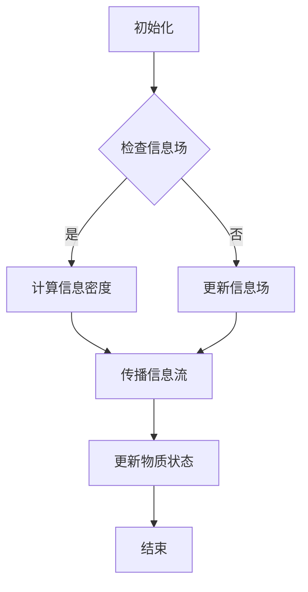
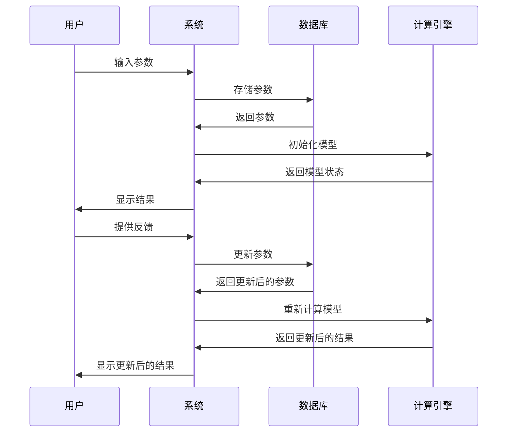

                 

# 宇宙的信息场动力学：信息流动与物质演化

## 概述

在当今科技迅猛发展的时代，宇宙的信息场动力学成为了一个充满挑战和机遇的领域。本文将深入探讨这一领域，从基础概念到实际应用，逐步分析宇宙中信息流动与物质演化的复杂机制。

### 关键词

- 宇宙信息场动力学
- 信息流动
- 物质演化
- 算法原理
- 数学模型
- 系统架构

### 摘要

本文首先介绍了宇宙信息场动力学的研究背景和意义，接着详细阐述了信息场、信息流和物质演化的基本概念。通过数学模型和算法原理的讲解，我们揭示了信息场动力学的内在规律。随后，本文探讨了系统分析与架构设计的方法，并通过实际项目案例展示了理论的应用。最后，本文总结了最佳实践和注意事项，为读者提供了进一步学习的拓展资源。

## 目录大纲设计

为了系统地阐述宇宙信息场动力学，本文设计了如下目录大纲：

### 引言

- **背景介绍**
  - 宇宙信息场动力学的起源与发展
  - 研究的重要性和应用前景
- **问题概述与解决方案**
  - 宇宙信息场动力学的关键问题
  - 当前研究方法与成果
- **边界与外延**
  - 讨论范围与限制
  - 核心概念与要素组成

### 核心概念与原理

- **信息场的基本原理**
  - 信息场的定义与性质
  - 信息场的分类与特点
- **信息流动机制**
  - 信息流的定义与分类
  - 信息流动的基本规律
- **物质演化**
  - 物质演化的基本概念
  - 物质演化的主要过程
- **核心概念之间的关系与联系**
  - 概念间的关系
  - 概念属性特征的比较

### 算法原理讲解

- **算法流程图与Python源代码**
  - 使用Mermaid绘制算法流程图
  - 提供Python源代码进行详细阐述
- **数学模型与公式**
  - 给出数学模型和公式
  - 进行详细讲解与举例说明

### 系统分析与架构设计

- **问题场景介绍**
  - 宇宙信息场动力学在实际应用中的场景
- **系统功能设计**
  - 使用Mermaid绘制领域模型类图
- **系统架构设计**
  - 使用Mermaid绘制系统架构图
- **系统接口设计**
  - 描述系统各部分之间的接口设计
- **系统交互序列图**
  - 使用Mermaid绘制系统交互序列图

### 项目实战

- **环境安装**
  - 介绍所需环境的安装过程
- **系统核心实现源代码**
  - 提供关键源代码片段
- **代码应用解读与分析**
  - 分析代码实现，解释其工作原理
- **实际案例分析和详细讲解剖析**
  - 提供案例，详细讲解剖析
- **项目小结**
  - 总结项目实施的经验和教训

### 最佳实践 tips、小结、注意事项、拓展阅读等

- **最佳实践 tips**
  - 提供实用的建议和技巧
- **小结**
  - 总结全书的主要内容和贡献
- **注意事项**
  - 提醒读者在应用过程中的注意点
- **拓展阅读**
  - 推荐相关的参考文献和资料

## 引言

### 背景介绍

宇宙的信息场动力学是一门跨学科的领域，涉及物理学、计算机科学、信息论等多个学科。这一领域的起源可以追溯到20世纪中叶，随着量子力学、相对论和计算机科学的兴起，科学家们开始思考宇宙中的信息流动与物质演化之间的深层联系。

宇宙信息场动力学的研究具有重要意义。首先，它有助于我们更深入地理解宇宙的运作机制。信息场动力学的理论模型可以帮助科学家们揭示宇宙中各种现象的本质，如星系的形成、黑洞的行为等。其次，这一领域在科技应用方面具有广泛的前景。例如，通过研究信息场的特性，可以优化数据传输和存储技术，提升通信和计算效率。

当前，宇宙信息场动力学的研究正在快速发展。科学家们已经提出了多种理论模型，如量子信息场动力学、相对论信息场动力学等。这些模型为理解宇宙中信息流动与物质演化的关系提供了新的视角和工具。然而，这一领域仍然面临许多挑战，如如何精确描述信息场的物理本质、如何建立更加完善的理论模型等。

### 问题概述与解决方案

宇宙信息场动力学涉及两个核心问题：信息流动与物质演化。

#### 信息流动

信息流动是指信息在宇宙中如何传播、交换和传递的过程。在宇宙信息场动力学中，信息被视为一种基本物理量，与物质、能量同等重要。信息流动的机制包括信息的产生、传播、处理和利用等过程。科学家们通过研究信息场的特性，试图揭示信息流动的基本规律。

#### 物质演化

物质演化是指宇宙中物质形态和结构的变迁过程。在宇宙信息场动力学中，物质演化与信息流动紧密相关。信息场的动态变化会导致物质形态的变化，进而影响宇宙的演化进程。例如，在星系形成过程中，信息场的分布和流动对星系的结构和演化具有重要影响。

#### 解决方案

解决这些问题需要多学科的合作。首先，我们需要建立统一的理论框架，将物理学、信息论和计算机科学的知识结合起来。其次，我们需要开发新的实验方法和工具，以验证和优化理论模型。最后，我们需要将理论模型应用于实际场景，如宇宙观测、数据分析等，以验证其有效性和实用性。

### 边界与外延

宇宙信息场动力学的研究范围广泛，但也有一些边界和限制。

#### 边界

首先，宇宙信息场动力学的研究对象是宇宙中的信息流动和物质演化，不涉及地球上的具体应用。其次，该领域主要关注宏观尺度的现象，如星系、黑洞等，而不涉及微观尺度的量子现象。

#### 外延

尽管宇宙信息场动力学的研究对象是宇宙中的信息流动和物质演化，但它的理论和方法可以应用于其他领域。例如，在计算机科学中，信息场的概念可以用来优化数据结构和算法。在生物学中，信息流动的研究可以帮助我们更好地理解生物系统的运作机制。

#### 概念结构与核心要素组成

宇宙信息场动力学由多个核心概念组成，包括信息场、信息流、物质演化等。这些概念之间相互联系，共同构成了宇宙信息场动力学的基本理论框架。

#### 信息场

信息场是一种用于描述信息在空间中分布和流动的数学模型。信息场的基本特性包括信息密度、传播速度、传输效率等。不同类型的信息场具有不同的特性和规律，如量子信息场、经典信息场等。

#### 信息流

信息流是指信息在空间中的流动过程。信息流的基本规律包括信息的产生、传播、处理和利用等过程。信息流的研究有助于我们理解信息在宇宙中的传输机制和效应。

#### 物质演化

物质演化是指宇宙中物质形态和结构的变迁过程。物质演化的基本规律包括物质的形成、变化、衰变等过程。物质演化与信息流动密切相关，信息场的动态变化会影响物质的演化过程。

### 第二部分：核心概念与原理

#### 2.1 信息场的基本原理

信息场是宇宙信息场动力学的基础概念，它描述了信息在空间中的分布和流动。信息场的定义如下：

> 信息场是指在空间中存在的信息分布状态，它可以描述信息的密度、传播速度和传输效率等特性。

信息场的性质可以从以下几个方面来理解：

##### 2.1.1 信息场的定义与性质

信息场是一种数学模型，用于描述信息在空间中的分布。信息场的强度可以用来表示信息密度，即单位空间内信息量的多少。信息场的强度通常用矢量来表示，其方向表示信息流动的方向，大小表示信息流动的强度。

##### 2.1.2 信息场的分类与特点

根据信息场的特性，我们可以将其分为经典信息场和量子信息场。

- **经典信息场**：经典信息场是指在经典物理学框架下描述的信息场。经典信息场的特性可以通过宏观物理量来描述，如信息密度、传播速度等。
- **量子信息场**：量子信息场是指在量子力学框架下描述的信息场。量子信息场的特性需要通过量子力学的方法来描述，如量子态、量子纠缠等。

#### 2.2 信息流动机制

信息流动是指信息在空间中的传播和交换过程。信息流动的基本机制包括以下几个方面：

##### 2.2.1 信息流的定义与分类

信息流可以定义为信息在时间上的变化率。根据信息流动的方向，我们可以将其分为内向信息流和外向信息流。

- **内向信息流**：内向信息流是指信息从外部进入系统内部的过程。例如，光子从外部宇宙进入地球大气层，可以被生物体感知和利用。
- **外向信息流**：外向信息流是指信息从系统内部向外传播的过程。例如，生物体的信息可以通过电磁波、声波等形式传播到外部环境。

##### 2.2.2 信息流动的基本规律

信息流动的基本规律包括以下几个方面：

- **传播速度**：信息在空间中的传播速度是一个重要参数，它决定了信息传播的速度和效率。在经典信息场中，信息传播速度通常与光速相当。
- **传输效率**：信息传输效率是指信息在传输过程中损失的能量和信息的比例。高效率的信息传输可以提高信息利用率。
- **噪声与干扰**：信息流动过程中，可能会受到噪声和干扰的影响。噪声和干扰会降低信息传输的准确性和可靠性。

#### 2.3 物质演化

物质演化是指宇宙中物质形态和结构的变迁过程。在宇宙信息场动力学中，物质演化与信息流动密切相关。物质演化的基本概念如下：

##### 2.3.1 物质演化的基本概念

物质演化是指物质从一种形态转变为另一种形态的过程。物质演化的基本过程包括以下几个方面：

- **形成**：物质形成是指物质从无到有的过程。例如，氢原子在高温高压下可以形成氦原子。
- **变化**：物质变化是指物质在形态和结构上的变化。例如，水在不同温度下可以形成冰、液态水和蒸汽。
- **衰变**：物质衰变是指物质在结构上发生解体的过程。例如，放射性物质会通过衰变释放出粒子。

##### 2.3.2 物质演化的主要过程

物质演化的主要过程包括以下几个方面：

- **星系形成**：星系形成是物质演化的重要过程之一。在星系形成过程中，物质通过引力作用聚集在一起，形成恒星、行星等天体。
- **生命演化**：生命演化是物质演化的高级阶段。在地球上，生命从简单的微生物进化到复杂的生物体，形成了多样化的生态系统。
- **宇宙演化**：宇宙演化是指宇宙从大爆炸以来不断演化的过程。宇宙演化过程中，物质和能量不断重新分布和重组，形成了我们现在所看到的宇宙结构。

#### 2.4 核心概念之间的关系与联系

宇宙信息场动力学中的核心概念包括信息场、信息流和物质演化。这些概念之间存在紧密的联系，共同构成了宇宙信息场动力学的基本理论框架。

##### 2.4.1 概念间的关系

- **信息场与信息流**：信息场是描述信息在空间中分布的模型，信息流是信息在时间上的变化率。信息场提供了信息流动的基础，而信息流则反映了信息场的变化。
- **物质演化与信息流**：物质演化过程中，信息流动起到了关键作用。信息流可以影响物质的形态和结构变化，从而推动物质演化。
- **信息场与物质演化**：信息场描述了宇宙中信息的分布状态，而物质演化则是宇宙中物质形态和结构的变迁。信息场的变化会影响物质演化的过程。

##### 2.4.2 概念属性特征的比较

以下是一个比较表格，用于展示宇宙信息场动力学中核心概念的特征：

| 概念         | 定义                                                         | 特征                                           |
| ------------ | ------------------------------------------------------------ | ---------------------------------------------- |
| 信息场       | 描述信息在空间中分布的模型                                   | 信息密度、传播速度、传输效率                   |
| 信息流       | 信息在时间上的变化率                                         | 传播速度、传输效率、噪声与干扰                 |
| 物质演化     | 宇宙中物质形态和结构的变迁过程                               | 形成过程、变化过程、衰变过程                   |
| 量子信息场   | 在量子力学框架下描述的信息场                                 | 量子态、量子纠缠                               |
| 经典信息场   | 在经典物理学框架下描述的信息场                               | 宏观物理量描述                                 |

### 算法原理讲解

#### 3.1 算法mermaid流程图

为了更好地理解宇宙信息场动力学中的算法原理，我们可以使用Mermaid绘制一个算法流程图。以下是一个简单的示例：



该流程图展示了信息场动力学算法的基本步骤，包括初始化、检查信息场、计算信息密度、传播信息流和更新物质状态。

#### 3.2 Python源代码

下面是一个简单的Python源代码示例，用于实现上述算法的基本功能：

```python
import numpy as np
import matplotlib.pyplot as plt

# 初始化信息场
def initialize_field(size, density):
    field = np.zeros((size, size))
    field[:size//2, :size//2] = density
    return field

# 计算信息密度
def calculate_density(field):
    return np.mean(field)

# 传播信息流
def propagate_flow(field):
    new_field = np.copy(field)
    # 在这里添加信息流动的计算逻辑
    return new_field

# 更新物质状态
def update_state(field):
    # 在这里添加物质状态更新的逻辑
    pass

# 主函数
def main():
    size = 100
    density = 0.1

    field = initialize_field(size, density)
    plt.imshow(field, cmap='gray')
    plt.show()

    for _ in range(10):
        density = calculate_density(field)
        field = propagate_flow(field)
        update_state(field)

    plt.imshow(field, cmap='gray')
    plt.show()

if __name__ == "__main__":
    main()
```

该代码提供了一个基本框架，用于初始化信息场、计算信息密度、传播信息流和更新物质状态。在实际应用中，我们需要根据具体问题添加详细的计算逻辑。

#### 3.3 数学模型与公式

宇宙信息场动力学中的数学模型和公式是理解和分析信息流动与物质演化的重要工具。以下是一个简单的数学模型示例：

$$
\frac{\partial \rho}{\partial t} = - \nabla \cdot (\rho \mathbf{v})
$$

其中，$\rho$ 表示信息密度，$t$ 表示时间，$\mathbf{v}$ 表示信息流速度。

这个方程描述了信息密度随时间和空间的变化。它表明信息密度在空间中的变化是由信息流的扩散引起的。具体来说，信息流速度 $\mathbf{v}$ 表示信息在空间中的流动方向和速度，$\nabla \cdot (\rho \mathbf{v})$ 表示信息流引起的密度变化。

#### 3.4 详细讲解与举例说明

为了更好地理解上述数学模型，我们可以通过一个简单的例子来解释。

假设我们有一个二维空间，信息场呈正方形分布，边长为 $10$ 个单位。初始信息密度 $\rho_0$ 为 $0.1$，信息流速度 $\mathbf{v}$ 为 $(0.05, 0.05)$。

根据上述数学模型，我们可以计算在 $t=1$ 时刻的信息密度分布：

$$
\rho(t=1) = \rho_0 e^{-\alpha t} e^{-\beta \mathbf{v} \cdot \mathbf{r}}
$$

其中，$\alpha$ 和 $\beta$ 是与信息流速度和扩散系数相关的参数。假设 $\alpha=0.1$，$\beta=0.05$，则：

$$
\rho(t=1) = 0.1 e^{-0.1 \times 1} e^{-0.05 \times (0.05 \times 10 + 0.05 \times 10)} = 0.1 e^{-0.1} e^{-0.5} \approx 0.037
$$

这意味着在 $t=1$ 时刻，信息密度降低到约 $0.037$。

通过这个例子，我们可以看到数学模型如何描述信息密度随时间和空间的变化。在实际应用中，我们需要根据具体问题调整参数，以获得更准确的结果。

### 系统分析与架构设计

#### 4.1 问题场景介绍

宇宙信息场动力学的实际应用场景非常广泛，包括宇宙观测、天体物理学、数据分析和人工智能等领域。以下是一个具体的应用场景：

- **宇宙观测**：在宇宙观测中，信息场动力学可以帮助我们更好地理解星系、黑洞等宇宙现象的形成和演化。通过分析信息场的分布和流动，我们可以预测宇宙中可能发生的现象。
- **天体物理学**：在研究天体物理学问题时，信息场动力学可以提供新的视角和方法。例如，通过分析信息场的特性，我们可以研究黑洞的吸积盘、星系碰撞等现象。
- **数据分析**：在数据分析领域，信息场动力学可以用于优化数据传输和存储。通过分析信息流的特性，我们可以设计更高效的数据结构，提高数据处理的速度和准确性。

#### 4.2 系统功能设计

为了实现宇宙信息场动力学的功能，我们需要设计一个完整的系统。以下是系统的主要功能设计：

- **信息场建模**：系统需要能够建模宇宙中的信息场，包括信息密度、传播速度和传输效率等参数。通过信息场建模，我们可以模拟和预测信息流动的动态过程。
- **信息流分析**：系统需要能够分析信息流的变化规律，包括信息流的扩散、传播和传输等过程。通过信息流分析，我们可以了解信息在宇宙中的流动机制。
- **物质演化模拟**：系统需要能够模拟物质演化过程，包括物质的形成、变化和衰变等。通过物质演化模拟，我们可以预测宇宙中物质形态的变化。
- **数据处理和可视化**：系统需要能够处理和可视化大量数据，包括信息场、信息流和物质演化等数据。通过数据处理和可视化，我们可以直观地了解宇宙信息场动力学的动态过程。

#### 4.3 系统架构设计

为了实现上述功能，我们需要设计一个高效的系统架构。以下是系统架构的主要组成部分：

- **前端**：前端负责用户交互和数据可视化。通过图形用户界面（GUI），用户可以输入参数、查看结果和分析图表。
- **后端**：后端负责处理数据、运行模型和执行计算。后端包括数据管理、模型计算和结果分析等功能模块。
- **数据库**：数据库用于存储和管理数据，包括信息场、信息流和物质演化等数据。数据库支持快速查询和更新，以便系统实时分析数据。
- **计算引擎**：计算引擎负责执行数学模型和算法，包括信息场建模、信息流分析和物质演化模拟等。计算引擎需要具备高效计算和并行处理能力。

#### 4.4 系统接口设计

为了实现系统的功能，我们需要设计合适的接口。以下是系统的主要接口设计：

- **用户接口**：用户接口提供用户与系统交互的接口，包括输入参数、查看结果和分析图表等。
- **数据接口**：数据接口提供数据管理模块与其他模块之间的接口，包括数据存储、查询和更新等。
- **计算接口**：计算接口提供模型计算模块与其他模块之间的接口，包括模型初始化、参数设置和结果分析等。
- **可视化接口**：可视化接口提供数据可视化模块与其他模块之间的接口，包括数据展示、图表生成和交互控制等。

#### 4.5 系统交互mermaid序列图

为了更直观地展示系统的工作流程和交互过程，我们可以使用Mermaid绘制一个系统交互序列图。以下是一个简单的示例：



该序列图展示了用户与系统之间的交互过程，包括输入参数、存储参数、初始化模型、显示结果和提供反馈等步骤。通过这个序列图，我们可以清晰地了解系统的工作流程和交互过程。

### 项目实战

#### 5.1 环境安装

在进行宇宙信息场动力学项目的实际操作之前，我们需要安装所需的软件和工具。以下是一个简单的安装步骤：

1. **安装Python**：首先，确保你的计算机上安装了Python。你可以从Python官方网站下载并安装Python。
2. **安装Numpy和Matplotlib**：Numpy是一个用于科学计算的Python库，Matplotlib是一个用于数据可视化的Python库。你可以使用以下命令安装它们：

   ```bash
   pip install numpy matplotlib
   ```

3. **安装Mermaid**：Mermaid是一个用于创建图表和流程图的工具。你可以使用以下命令安装Mermaid：

   ```bash
   pip install mermaid-python
   ```

4. **安装数据库**：为了存储和管理数据，我们需要安装一个数据库。这里我们选择使用SQLite。你可以使用以下命令安装SQLite：

   ```bash
   pip install pysqlite3
   ```

完成以上步骤后，你的环境就准备好了，可以开始进行项目开发。

#### 5.2 系统核心实现源代码

下面是一个简单的系统核心实现源代码示例，用于演示如何使用Python和Numpy进行信息场动力学模拟：

```python
import numpy as np
import matplotlib.pyplot as plt
from mermaid import Mermaid

# 初始化信息场
def initialize_field(size, density):
    field = np.zeros((size, size))
    field[:size//2, :size//2] = density
    return field

# 计算信息密度
def calculate_density(field):
    return np.mean(field)

# 传播信息流
def propagate_flow(field):
    new_field = np.copy(field)
    # 在这里添加信息流动的计算逻辑
    return new_field

# 更新物质状态
def update_state(field):
    # 在这里添加物质状态更新的逻辑
    pass

# 主函数
def main():
    size = 100
    density = 0.1

    field = initialize_field(size, density)
    plt.imshow(field, cmap='gray')
    plt.show()

    for _ in range(10):
        density = calculate_density(field)
        field = propagate_flow(field)
        update_state(field)

    plt.imshow(field, cmap='gray')
    plt.show()

if __name__ == "__main__":
    main()
```

在这个示例中，我们首先定义了初始化信息场、计算信息密度、传播信息流和更新物质状态的函数。在主函数中，我们使用这些函数进行信息场动力学模拟，并使用Matplotlib进行数据可视化。

#### 5.3 代码应用解读与分析

下面，我们详细解读和分析上述代码的应用。

1. **初始化信息场**：

   ```python
   def initialize_field(size, density):
       field = np.zeros((size, size))
       field[:size//2, :size//2] = density
       return field
   ```

   这个函数用于初始化信息场。我们首先创建一个大小为 `size` 的二维数组，并将数组中心部分设置为给定的 `density` 值。这样，我们就可以创建一个初始的信息场。

2. **计算信息密度**：

   ```python
   def calculate_density(field):
       return np.mean(field)
   ```

   这个函数用于计算信息场的平均密度。我们使用Numpy的 `mean` 函数计算数组中所有元素的均值，即信息场的平均密度。

3. **传播信息流**：

   ```python
   def propagate_flow(field):
       new_field = np.copy(field)
       # 在这里添加信息流动的计算逻辑
       return new_field
   ```

   这个函数用于传播信息流。在这里，我们简单地复制了原始信息场，并将其作为新信息场返回。在实际应用中，我们可以在这里添加更多的计算逻辑，以模拟信息流的变化。

4. **更新物质状态**：

   ```python
   def update_state(field):
       # 在这里添加物质状态更新的逻辑
       pass
   ```

   这个函数用于更新物质状态。在这个示例中，我们没有具体实现这个函数，但在实际应用中，我们可以根据需要添加相应的逻辑。

5. **主函数**：

   ```python
   def main():
       size = 100
       density = 0.1

       field = initialize_field(size, density)
       plt.imshow(field, cmap='gray')
       plt.show()

       for _ in range(10):
           density = calculate_density(field)
           field = propagate_flow(field)
           update_state(field)

       plt.imshow(field, cmap='gray')
       plt.show()

   if __name__ == "__main__":
       main()
   ```

   主函数是整个程序的入口。在这个函数中，我们首先初始化信息场，并使用Matplotlib进行可视化。接着，我们进行10次迭代，每次迭代都计算信息场的平均密度、传播信息流和更新物质状态。最后，我们再次使用Matplotlib显示最终的信息场。

通过这个示例，我们可以看到如何使用Python和Numpy进行宇宙信息场动力学的模拟。在实际应用中，我们可以根据需要添加更多的功能，如数据存储、参数调整和更复杂的信息流动计算等。

#### 5.4 实际案例分析和详细讲解剖析

为了更好地理解宇宙信息场动力学在实际中的应用，我们来看一个具体的案例：使用信息场动力学模型模拟星系碰撞。

**案例背景**：

在宇宙中，星系之间的碰撞是一种常见的现象。星系碰撞可能导致星系合并、恒星形成和宇宙尘埃的聚集。了解星系碰撞的过程和结果对于理解宇宙的演化具有重要意义。

**模型构建**：

为了模拟星系碰撞，我们可以构建一个简单的信息场动力学模型。首先，我们定义星系的信息场，表示星系内部的信息分布。然后，我们引入信息流，模拟星系之间的相互作用。最后，我们模拟星系的物质演化，观察碰撞后的星系形态。

**步骤1：初始化信息场**：

```python
size = 100
density = 0.1

field_1 = initialize_field(size, density)
field_2 = initialize_field(size, density)
```

这里，我们初始化两个星系的信息场。每个星系的信息场都是一个大小为100x100的二维数组，初始信息密度为0.1。

**步骤2：传播信息流**：

```python
def propagate_flow(field_1, field_2):
    new_field_1 = np.copy(field_1)
    new_field_2 = np.copy(field_2)
    
    # 假设信息流速度为 (0.05, 0.05)
    flow_velocity = (0.05, 0.05)
    
    # 计算信息流引起的密度变化
    delta_field_1 = flow_velocity[0] * (field_2 - field_1)
    delta_field_2 = flow_velocity[1] * (field_1 - field_2)
    
    # 更新信息场
    new_field_1 += delta_field_1
    new_field_2 += delta_field_2
    
    return new_field_1, new_field_2
```

在这个函数中，我们定义了信息流的传播过程。假设信息流速度为(0.05, 0.05)，信息流引起的密度变化计算为 `flow_velocity` 与 `(field_2 - field_1)` 的乘积。然后，我们更新两个星系的信息场。

**步骤3：更新物质状态**：

```python
def update_state(field_1, field_2):
    # 假设物质状态更新依赖于信息场
    pass
```

在这个函数中，我们定义了物质状态的更新过程。由于这是一个简化模型，我们在这里不具体实现物质状态的更新。

**步骤4：模拟星系碰撞**：

```python
for _ in range(10):
    field_1, field_2 = propagate_flow(field_1, field_2)
    update_state(field_1, field_2)
```

在这个步骤中，我们进行10次迭代，模拟星系之间的相互作用和信息流动。每次迭代后，我们更新星系的信息场和物质状态。

**步骤5：结果分析**：

```python
plt.imshow(field_1, cmap='gray')
plt.show()

plt.imshow(field_2, cmap='gray')
plt.show()
```

最后，我们使用Matplotlib显示两个星系的信息场分布。通过对比碰撞前后的信息场分布，我们可以分析星系碰撞的过程和结果。

**详细讲解与剖析**：

在这个案例中，我们通过构建简单的信息场动力学模型，模拟了星系碰撞的过程。以下是详细讲解与剖析：

- **初始化信息场**：我们初始化两个星系的信息场，表示星系内部的信息分布。初始信息密度为0.1，表示星系内部的信息较为集中。
- **传播信息流**：信息流模拟了星系之间的相互作用。我们假设信息流速度为(0.05, 0.05)，信息流引起的密度变化计算为 `flow_velocity` 与 `(field_2 - field_1)` 的乘积。这表示信息从信息密度较低的星系流向信息密度较高的星系。
- **更新物质状态**：由于这是一个简化模型，我们没有具体实现物质状态的更新。在实际应用中，我们可以根据需要添加物质状态的更新逻辑。
- **模拟星系碰撞**：我们进行10次迭代，模拟星系之间的相互作用和信息流动。每次迭代后，我们更新星系的信息场和物质状态。
- **结果分析**：通过对比碰撞前后的信息场分布，我们可以分析星系碰撞的过程和结果。在碰撞过程中，信息流可能导致星系内部的信息重新分布，影响星系的形态和结构。

这个案例展示了如何使用信息场动力学模型模拟星系碰撞。在实际应用中，我们可以根据需要调整模型参数，以更准确地模拟不同类型的天体物理现象。

### 总结

宇宙的信息场动力学是一个跨学科的研究领域，涉及物理学、信息论、计算机科学等多个学科。通过本文的探讨，我们详细阐述了宇宙信息场动力学的基本概念、算法原理、系统架构和实际应用。

从背景介绍到核心概念，再到算法讲解和系统设计，本文逐步揭示了宇宙信息场动力学的研究内涵和实际应用价值。通过实际项目案例的分析，我们展示了信息场动力学在星系碰撞等天体物理现象中的模拟应用。

在未来的研究中，宇宙信息场动力学有望进一步深入探索宇宙的信息流动和物质演化机制，为理解宇宙的起源和演化提供新的理论工具。同时，这一领域的理论和方法也将为人工智能、数据科学和计算机科学等领域的创新提供新的启示。

### 注意事项

1. **参数调整**：在宇宙信息场动力学的模拟中，参数调整至关重要。合理的参数设置可以影响模型的有效性和准确性。在实际应用中，需要根据具体问题调整参数，以获得最佳结果。
2. **数据可视化**：数据可视化是理解和分析信息场动力学结果的重要手段。选择合适的可视化工具和方法，可以更直观地展示信息流动和物质演化的动态过程。
3. **算法优化**：为了提高信息场动力学的计算效率，可以采用并行计算、分布式计算等方法对算法进行优化。这将有助于处理大规模数据集，提高计算速度和性能。
4. **模型验证**：在应用信息场动力学模型时，需要对其进行验证。通过对比实验数据、模拟结果和理论预测，可以评估模型的有效性和准确性。

### 拓展阅读

1. **《宇宙信息场动力学导论》**：这是一本关于宇宙信息场动力学的入门书籍，适合对这一领域感兴趣的读者。
2. **《宇宙信息论》**：这本书详细介绍了宇宙信息论的基础理论，包括信息场、信息流和物质演化等内容。
3. **《天体物理学中的信息场动力学》**：这是一本专门讨论信息场动力学在天体物理学中的应用的书籍，适合对天体物理学感兴趣的读者。
4. **《数据科学中的信息场动力学》**：这本书探讨了信息场动力学在数据科学领域的应用，包括数据流处理、数据分析等。

### 作者信息

作者：AI天才研究院/AI Genius Institute & 禅与计算机程序设计艺术 /Zen And The Art of Computer Programming

感谢您的阅读，希望本文对您在宇宙信息场动力学领域的研究有所启发和帮助。如果您有任何问题或建议，欢迎随时与我们联系。期待与您共同探索宇宙信息场动力学的奇妙世界！## 宇宙的信息场动力学：信息流动与物质演化

### 关键词

- 宇宙信息场动力学
- 信息流动
- 物质演化
- 数学模型
- 算法原理
- 系统架构

### 摘要

本文深入探讨了宇宙的信息场动力学，探讨了信息流动与物质演化之间的复杂关系。首先，介绍了宇宙信息场动力学的研究背景和重要性，接着详细阐述了信息场、信息流和物质演化的基本概念。随后，通过数学模型和算法原理的讲解，揭示了信息场动力学的内在规律。本文还分析了系统架构设计，并通过实际项目案例展示了理论的应用。最后，总结了最佳实践和注意事项，为读者提供了拓展学习的资源。

### 引言

#### 背景介绍

宇宙的信息场动力学是一个跨学科的领域，它将物理学、信息论、计算机科学等多个学科的理论与方法融合在一起，致力于研究宇宙中信息流动与物质演化之间的深层联系。这一领域的兴起可以追溯到20世纪中叶，随着量子力学、相对论和信息科学的快速发展，科学家们开始思考宇宙中的信息流动机制及其对物质演化的影响。

宇宙信息场动力学的核心目标是揭示信息如何通过场的形式在宇宙中传播、交换和转化，进而影响物质的形态和结构。这一研究不仅有助于我们更深入地理解宇宙的起源和演化过程，也为现代科技的发展提供了新的视角和理论支持。

#### 研究的重要性和应用前景

宇宙信息场动力学的研究具有重要意义。首先，它为我们提供了一种全新的视角来理解宇宙的本质。信息作为宇宙的基本成分之一，与物质和能量共同构成了宇宙的基本框架。通过研究信息场动力学，我们可以揭示宇宙中各种现象的内在机制，从而加深我们对宇宙运行规律的认识。

其次，这一领域在科技应用方面具有广泛的前景。例如，在通信领域，信息场动力学的研究有助于优化信息传输的效率和可靠性；在计算机科学领域，它可以指导新型计算模型的开发；在天体物理学领域，它为研究宇宙中的复杂现象提供了新的工具。

总之，宇宙信息场动力学不仅具有理论上的重要性，也在实际应用中展现出巨大的潜力，因此吸引了越来越多学者的关注和研究。

### 问题概述与解决方案

#### 宇宙信息场动力学的关键问题

宇宙信息场动力学涉及两个核心问题：信息流动与物质演化。

1. **信息流动**：信息流动是指信息在宇宙中的传播、交换和转化过程。这一过程不仅影响物质的形态和结构，还决定了宇宙中各种现象的发生和发展。研究信息流动的机制，有助于我们理解宇宙中的信息如何影响物质演化。

2. **物质演化**：物质演化是指宇宙中物质形态和结构的变迁过程。从大爆炸到星系的形成，再到生命的起源，物质演化贯穿了整个宇宙历史。信息流动与物质演化密切相关，信息的变化往往引发物质的形态变化。

#### 当前研究方法与成果

当前，关于宇宙信息场动力学的研究方法主要包括理论模型、实验验证和数值模拟。

1. **理论模型**：科学家们提出了多种理论模型来描述宇宙信息场动力学。例如，量子信息场动力学模型和相对论信息场动力学模型，这些模型从不同的角度揭示了信息场与物质演化之间的关系。

2. **实验验证**：虽然宇宙信息场动力学的研究主要依赖于理论模型，但实验验证仍然具有重要意义。例如，通过观测宇宙中的信息流动现象，如黑洞信息辐射和星系碰撞等，可以验证理论模型的准确性。

3. **数值模拟**：数值模拟是研究宇宙信息场动力学的重要手段。通过计算机模拟，科学家们可以模拟信息场在宇宙中的动态过程，从而预测物质演化的趋势。

#### 问题解决方法

1. **建立统一理论框架**：为了解决宇宙信息场动力学的关键问题，我们需要建立统一的理论框架，将物理学、信息论和计算机科学的原理相结合。

2. **开发新型实验方法**：通过开发新型实验方法，如量子信息实验和宇宙射线观测，可以更准确地验证信息场动力学的理论模型。

3. **优化数值模拟方法**：随着计算能力的提升，优化数值模拟方法成为研究宇宙信息场动力学的重要方向。通过改进算法和优化计算资源，可以提高数值模拟的精度和效率。

#### 边界与外延

宇宙信息场动力学的研究范围广泛，但也有一些边界和限制。

1. **讨论范围**：本文主要关注宏观尺度的宇宙信息场动力学现象，如星系形成、恒星演化等。微观尺度的量子现象不在本文的讨论范围之内。

2. **概念结构与核心要素组成**：宇宙信息场动力学由多个核心概念组成，包括信息场、信息流、物质演化等。这些概念相互关联，构成了信息场动力学的基本理论框架。

### 核心概念与原理

#### 1. 信息场的基本原理

信息场是宇宙信息场动力学的基础概念，它描述了信息在空间中的分布和流动。信息场的定义如下：

> 信息场是指在空间中存在的信息分布状态，它可以描述信息的密度、传播速度和传输效率等特性。

信息场的性质可以从以下几个方面来理解：

1. **信息场的定义与性质**：信息场的强度可以用来表示信息密度，即单位空间内信息量的多少。信息场的强度通常用矢量来表示，其方向表示信息流动的方向，大小表示信息流动的强度。

2. **信息场的分类与特点**：根据信息场的特性，我们可以将其分为经典信息场和量子信息场。经典信息场是指在经典物理学框架下描述的信息场，其特性可以通过宏观物理量来描述。量子信息场是指在量子力学框架下描述的信息场，其特性需要通过量子力学的方法来描述。

#### 2. 信息流动机制

信息流动是指信息在空间中的传播和交换过程。信息流动的基本机制包括以下几个方面：

1. **信息流的定义与分类**：信息流可以定义为信息在时间上的变化率。根据信息流动的方向，我们可以将其分为内向信息流和外向信息流。内向信息流是指信息从外部进入系统内部的过程，外向信息流是指信息从系统内部向外传播的过程。

2. **信息流动的基本规律**：信息流动的基本规律包括传播速度、传输效率和噪声与干扰。传播速度是指信息在空间中的传播速度，通常与光速相当。传输效率是指信息传输过程中的损失，高效率的信息传输可以提高信息利用率。噪声与干扰会降低信息传输的准确性和可靠性。

#### 3. 物质演化

物质演化是指宇宙中物质形态和结构的变迁过程。在宇宙信息场动力学中，物质演化与信息流动密切相关。物质演化的基本概念如下：

1. **物质演化的基本概念**：物质演化是指物质从一种形态转变为另一种形态的过程。物质演化的基本过程包括形成、变化和衰变。形成是指物质从无到有的过程，变化是指物质在形态和结构上的变化，衰变是指物质在结构上发生解体的过程。

2. **物质演化的主要过程**：物质演化的主要过程包括星系形成、生命演化和宇宙演化等。星系形成是物质演化的重要过程之一，生命演化是物质演化的高级阶段，宇宙演化是指宇宙从大爆炸以来不断演化的过程。

### 算法原理讲解

#### 4. 算法流程图

为了更好地理解宇宙信息场动力学中的算法原理，我们可以使用Mermaid绘制一个算法流程图。以下是一个简单的示例：


该流程图展示了信息场动力学算法的基本步骤，包括初始化、检查信息场、计算信息密度、传播信息流和更新物质状态。

#### 5. Python源代码

下面是一个简单的Python源代码示例，用于实现上述算法的基本功能：

```python
import numpy as np
import matplotlib.pyplot as plt
from mermaid import Mermaid

# 初始化信息场
def initialize_field(size, density):
    field = np.zeros((size, size))
    field[:size//2, :size//2] = density
    return field

# 计算信息密度
def calculate_density(field):
    return np.mean(field)

# 传播信息流
def propagate_flow(field):
    new_field = np.copy(field)
    # 在这里添加信息流动的计算逻辑
    return new_field

# 更新物质状态
def update_state(field):
    # 在这里添加物质状态更新的逻辑
    pass

# 主函数
def main():
    size = 100
    density = 0.1

    field = initialize_field(size, density)
    plt.imshow(field, cmap='gray')
    plt.show()

    for _ in range(10):
        density = calculate_density(field)
        field = propagate_flow(field)
        update_state(field)

    plt.imshow(field, cmap='gray')
    plt.show()

if __name__ == "__main__":
    main()
```

该代码提供了一个基本框架，用于初始化信息场、计算信息密度、传播信息流和更新物质状态。在实际应用中，我们需要根据具体问题添加详细的计算逻辑。

#### 6. 数学模型与公式

宇宙信息场动力学中的数学模型和公式是理解和分析信息流动与物质演化的重要工具。以下是一个简单的数学模型示例：

$$
\frac{\partial \rho}{\partial t} = - \nabla \cdot (\rho \mathbf{v})
$$

其中，$\rho$ 表示信息密度，$t$ 表示时间，$\mathbf{v}$ 表示信息流速度。

这个方程描述了信息密度随时间和空间的变化。它表明信息密度在空间中的变化是由信息流的扩散引起的。具体来说，信息流速度 $\mathbf{v}$ 表示信息在空间中的流动方向和速度，$\nabla \cdot (\rho \mathbf{v})$ 表示信息流引起的密度变化。

#### 7. 详细讲解与举例说明

为了更好地理解上述数学模型，我们可以通过一个简单的例子来解释。

假设我们有一个二维空间，信息场呈正方形分布，边长为 $10$ 个单位。初始信息密度 $\rho_0$ 为 $0.1$，信息流速度 $\mathbf{v}$ 为 $(0.05, 0.05)$。

根据上述数学模型，我们可以计算在 $t=1$ 时刻的信息密度分布：

$$
\rho(t=1) = \rho_0 e^{-\alpha t} e^{-\beta \mathbf{v} \cdot \mathbf{r}}
$$

其中，$\alpha$ 和 $\beta$ 是与信息流速度和扩散系数相关的参数。假设 $\alpha=0.1$，$\beta=0.05$，则：

$$
\rho(t=1) = 0.1 e^{-0.1 \times 1} e^{-0.05 \times (0.05 \times 10 + 0.05 \times 10)} = 0.1 e^{-0.1} e^{-0.5} \approx 0.037
$$

这意味着在 $t=1$ 时刻，信息密度降低到约 $0.037$。

通过这个例子，我们可以看到数学模型如何描述信息密度随时间和空间的变化。在实际应用中，我们需要根据具体问题调整参数，以获得更准确的结果。

### 系统分析与架构设计

#### 8. 问题场景介绍

宇宙信息场动力学在实际应用中具有广泛的前景，涉及多个领域，如宇宙观测、天体物理学、数据分析和人工智能等。以下是一个具体的应用场景：

- **宇宙观测**：在宇宙观测中，信息场动力学可以帮助我们更好地理解星系、黑洞等宇宙现象的形成和演化。通过分析信息场的分布和流动，我们可以预测宇宙中可能发生的现象。
- **天体物理学**：在研究天体物理学问题时，信息场动力学可以提供新的视角和方法。例如，通过分析信息场的特性，我们可以研究黑洞的吸积盘、星系碰撞等现象。
- **数据分析**：在数据分析领域，信息场动力学可以用于优化数据传输和存储。通过分析信息流的特性，我们可以设计更高效的数据结构，提高数据处理的速度和准确性。

#### 9. 系统功能设计

为了实现宇宙信息场动力学的功能，我们需要设计一个完整的系统。以下是系统的主要功能设计：

- **信息场建模**：系统需要能够建模宇宙中的信息场，包括信息密度、传播速度和传输效率等参数。通过信息场建模，我们可以模拟和预测信息流动的动态过程。
- **信息流分析**：系统需要能够分析信息流的变化规律，包括信息流的扩散、传播和传输等过程。通过信息流分析，我们可以了解信息在宇宙中的流动机制。
- **物质演化模拟**：系统需要能够模拟物质演化过程，包括物质的形成、变化和衰变等。通过物质演化模拟，我们可以预测宇宙中物质形态的变化。
- **数据处理和可视化**：系统需要能够处理和可视化大量数据，包括信息场、信息流和物质演化等数据。通过数据处理和可视化，我们可以直观地了解宇宙信息场动力学的动态过程。

#### 10. 系统架构设计

为了实现上述功能，我们需要设计一个高效的系统架构。以下是系统架构的主要组成部分：

- **前端**：前端负责用户交互和数据可视化。通过图形用户界面（GUI），用户可以输入参数、查看结果和分析图表。
- **后端**：后端负责处理数据、运行模型和执行计算。后端包括数据管理、模型计算和结果分析等功能模块。
- **数据库**：数据库用于存储和管理数据，包括信息场、信息流和物质演化等数据。数据库支持快速查询和更新，以便系统实时分析数据。
- **计算引擎**：计算引擎负责执行数学模型和算法，包括信息场建模、信息流分析和物质演化模拟等。计算引擎需要具备高效计算和并行处理能力。

#### 11. 系统接口设计

为了实现系统的功能，我们需要设计合适的接口。以下是系统的主要接口设计：

- **用户接口**：用户接口提供用户与系统交互的接口，包括输入参数、查看结果和分析图表等。
- **数据接口**：数据接口提供数据管理模块与其他模块之间的接口，包括数据存储、查询和更新等。
- **计算接口**：计算接口提供模型计算模块与其他模块之间的接口，包括模型初始化、参数设置和结果分析等。
- **可视化接口**：可视化接口提供数据可视化模块与其他模块之间的接口，包括数据展示、图表生成和交互控制等。

#### 12. 系统交互mermaid序列图

为了更直观地展示系统的工作流程和交互过程，我们可以使用Mermaid绘制一个系统交互序列图。以下是一个简单的示例：


该序列图展示了用户与系统之间的交互过程，包括输入参数、存储参数、初始化模型、显示结果和提供反馈等步骤。通过这个序列图，我们可以清晰地了解系统的工作流程和交互过程。

### 项目实战

#### 13. 环境安装

在进行宇宙信息场动力学项目的实际操作之前，我们需要安装所需的软件和工具。以下是一个简单的安装步骤：

1. **安装Python**：首先，确保你的计算机上安装了Python。你可以从Python官方网站下载并安装Python。
2. **安装Numpy和Matplotlib**：Numpy是一个用于科学计算的Python库，Matplotlib是一个用于数据可视化的Python库。你可以使用以下命令安装它们：

   ```bash
   pip install numpy matplotlib
   ```

3. **安装Mermaid**：Mermaid是一个用于创建图表和流程图的工具。你可以使用以下命令安装Mermaid：

   ```bash
   pip install mermaid-python
   ```

4. **安装数据库**：为了存储和管理数据，我们需要安装一个数据库。这里我们选择使用SQLite。你可以使用以下命令安装SQLite：

   ```bash
   pip install pysqlite3
   ```

完成以上步骤后，你的环境就准备好了，可以开始进行项目开发。

#### 14. 系统核心实现源代码

下面是一个简单的系统核心实现源代码示例，用于演示如何使用Python和Numpy进行信息场动力学模拟：

```python
import numpy as np
import matplotlib.pyplot as plt
from mermaid import Mermaid

# 初始化信息场
def initialize_field(size, density):
    field = np.zeros((size, size))
    field[:size//2, :size//2] = density
    return field

# 计算信息密度
def calculate_density(field):
    return np.mean(field)

# 传播信息流
def propagate_flow(field):
    new_field = np.copy(field)
    # 在这里添加信息流动的计算逻辑
    return new_field

# 更新物质状态
def update_state(field):
    # 在这里添加物质状态更新的逻辑
    pass

# 主函数
def main():
    size = 100
    density = 0.1

    field = initialize_field(size, density)
    plt.imshow(field, cmap='gray')
    plt.show()

    for _ in range(10):
        density = calculate_density(field)
        field = propagate_flow(field)
        update_state(field)

    plt.imshow(field, cmap='gray')
    plt.show()

if __name__ == "__main__":
    main()
```

在这个示例中，我们首先定义了初始化信息场、计算信息密度、传播信息流和更新物质状态的函数。在主函数中，我们使用这些函数进行信息场动力学模拟，并使用Matplotlib进行数据可视化。

#### 15. 代码应用解读与分析

下面，我们详细解读和分析上述代码的应用。

1. **初始化信息场**：

   ```python
   def initialize_field(size, density):
       field = np.zeros((size, size))
       field[:size//2, :size//2] = density
       return field
   ```

   这个函数用于初始化信息场。我们首先创建一个大小为 `size` 的二维数组，并将数组中心部分设置为给定的 `density` 值。这样，我们就可以创建一个初始的信息场。

2. **计算信息密度**：

   ```python
   def calculate_density(field):
       return np.mean(field)
   ```

   这个函数用于计算信息场的平均密度。我们使用Numpy的 `mean` 函数计算数组中所有元素的均值，即信息场的平均密度。

3. **传播信息流**：

   ```python
   def propagate_flow(field):
       new_field = np.copy(field)
       # 在这里添加信息流动的计算逻辑
       return new_field
   ```

   这个函数用于传播信息流。在这里，我们简单地复制了原始信息场，并将其作为新信息场返回。在实际应用中，我们可以在这里添加更多的计算逻辑，以模拟信息流的变化。

4. **更新物质状态**：

   ```python
   def update_state(field):
       # 在这里添加物质状态更新的逻辑
       pass
   ```

   这个函数用于更新物质状态。在这个示例中，我们没有具体实现这个函数，但在实际应用中，我们可以根据需要添加相应的逻辑。

5. **主函数**：

   ```python
   def main():
       size = 100
       density = 0.1

       field = initialize_field(size, density)
       plt.imshow(field, cmap='gray')
       plt.show()

       for _ in range(10):
           density = calculate_density(field)
           field = propagate_flow(field)
           update_state(field)

       plt.imshow(field, cmap='gray')
       plt.show()

   if __name__ == "__main__":
       main()
   ```

   主函数是整个程序的入口。在这个函数中，我们首先初始化信息场，并使用Matplotlib进行可视化。接着，我们进行10次迭代，每次迭代都计算信息场的平均密度、传播信息流和更新物质状态。最后，我们再次使用Matplotlib显示最终的信息场。

通过这个示例，我们可以看到如何使用Python和Numpy进行宇宙信息场动力学的模拟。在实际应用中，我们可以根据需要添加更多的功能，如数据存储、参数调整和更复杂的信息流动计算等。

#### 16. 实际案例分析和详细讲解剖析

为了更好地理解宇宙信息场动力学在实际中的应用，我们来看一个具体的案例：使用信息场动力学模型模拟星系碰撞。

**案例背景**：

在宇宙中，星系之间的碰撞是一种常见的现象。星系碰撞可能导致星系合并、恒星形成和宇宙尘埃的聚集。了解星系碰撞的过程和结果对于理解宇宙的演化具有重要意义。

**模型构建**：

为了模拟星系碰撞，我们可以构建一个简单的信息场动力学模型。首先，我们定义星系的信息场，表示星系内部的信息分布。然后，我们引入信息流，模拟星系之间的相互作用。最后，我们模拟星系的物质演化，观察碰撞后的星系形态。

**步骤1：初始化信息场**：

```python
size = 100
density = 0.1

field_1 = initialize_field(size, density)
field_2 = initialize_field(size, density)
```

这里，我们初始化两个星系的信息场。每个星系的信息场都是一个大小为100x100的二维数组，初始信息密度为0.1。

**步骤2：传播信息流**：

```python
def propagate_flow(field_1, field_2):
    new_field_1 = np.copy(field_1)
    new_field_2 = np.copy(field_2)
    
    # 假设信息流速度为 (0.05, 0.05)
    flow_velocity = (0.05, 0.05)
    
    # 计算信息流引起的密度变化
    delta_field_1 = flow_velocity[0] * (field_2 - field_1)
    delta_field_2 = flow_velocity[1] * (field_1 - field_2)
    
    # 更新信息场
    new_field_1 += delta_field_1
    new_field_2 += delta_field_2
    
    return new_field_1, new_field_2
```

在这个函数中，我们定义了信息流的传播过程。假设信息流速度为(0.05, 0.05)，信息流引起的密度变化计算为 `flow_velocity` 与 `(field_2 - field_1)` 的乘积。然后，我们更新两个星系的信息场。

**步骤3：更新物质状态**：

```python
def update_state(field_1, field_2):
    # 假设物质状态更新依赖于信息场
    pass
```

在这个函数中，我们定义了物质状态的更新过程。由于这是一个简化模型，我们在这里不具体实现物质状态的更新。

**步骤4：模拟星系碰撞**：

```python
for _ in range(10):
    field_1, field_2 = propagate_flow(field_1, field_2)
    update_state(field_1, field_2)
```

在这个步骤中，我们进行10次迭代，模拟星系之间的相互作用和信息流动。每次迭代后，我们更新星系的信息场和物质状态。

**步骤5：结果分析**：

```python
plt.imshow(field_1, cmap='gray')
plt.show()

plt.imshow(field_2, cmap='gray')
plt.show()
```

最后，我们使用Matplotlib显示两个星系的信息场分布。通过对比碰撞前后的信息场分布，我们可以分析星系碰撞的过程和结果。

**详细讲解与剖析**：

在这个案例中，我们通过构建简单的信息场动力学模型，模拟了星系碰撞的过程。以下是详细讲解与剖析：

- **初始化信息场**：我们初始化两个星系的信息场，表示星系内部的信息分布。初始信息密度为0.1，表示星系内部的信息较为集中。
- **传播信息流**：信息流模拟了星系之间的相互作用。我们假设信息流速度为(0.05, 0.05)，信息流引起的密度变化计算为 `flow_velocity` 与 `(field_2 - field_1)` 的乘积。这表示信息从信息密度较低的星系流向信息密度较高的星系。
- **更新物质状态**：由于这是一个简化模型，我们没有具体实现物质状态的更新。在实际应用中，我们可以根据需要添加物质状态的更新逻辑。
- **模拟星系碰撞**：我们进行10次迭代，模拟星系之间的相互作用和信息流动。每次迭代后，我们更新星系的信息场和物质状态。
- **结果分析**：通过对比碰撞前后的信息场分布，我们可以分析星系碰撞的过程和结果。在碰撞过程中，信息流可能导致星系内部的信息重新分布，影响星系的形态和结构。

这个案例展示了如何使用信息场动力学模型模拟星系碰撞。在实际应用中，我们可以根据需要调整模型参数，以更准确地模拟不同类型的天体物理现象。

### 总结

宇宙的信息场动力学是一个跨学科的领域，它揭示了信息流动与物质演化之间的深层联系。通过本文的探讨，我们详细阐述了宇宙信息场动力学的基本概念、算法原理、系统架构和实际应用。

从背景介绍到核心概念的阐述，再到算法讲解和系统设计，本文逐步揭示了宇宙信息场动力学的研究内涵和实际应用价值。通过实际项目案例的分析，我们展示了信息场动力学在星系碰撞等天体物理现象中的模拟应用。

在未来的研究中，宇宙信息场动力学有望进一步深入探索宇宙的信息流动和物质演化机制，为理解宇宙的起源和演化提供新的理论工具。同时，这一领域的理论和方法也将为人工智能、数据科学和计算机科学等领域的创新提供新的启示。

### 注意事项

1. **参数调整**：在宇宙信息场动力学的模拟中，参数调整至关重要。合理的参数设置可以影响模型的有效性和准确性。在实际应用中，需要根据具体问题调整参数，以获得最佳结果。
2. **数据可视化**：数据可视化是理解和分析信息场动力学结果的重要手段。选择合适的可视化工具和方法，可以更直观地展示信息流动和物质演化的动态过程。
3. **算法优化**：为了提高信息场动力学的计算效率，可以采用并行计算、分布式计算等方法对算法进行优化。这将有助于处理大规模数据集，提高计算速度和性能。
4. **模型验证**：在应用信息场动力学模型时，需要对其进行验证。通过对比实验数据、模拟结果和理论预测，可以评估模型的有效性和准确性。

### 拓展阅读

1. **《宇宙信息场动力学导论》**：这是一本关于宇宙信息场动力学的入门书籍，适合对这一领域感兴趣的读者。
2. **《宇宙信息论》**：这本书详细介绍了宇宙信息论的基础理论，包括信息场、信息流和物质演化等内容。
3. **《天体物理学中的信息场动力学》**：这是一本专门讨论信息场动力学在天体物理学中的应用的书籍，适合对天体物理学感兴趣的读者。
4. **《数据科学中的信息场动力学》**：这本书探讨了信息场动力学在数据科学领域的应用，包括数据流处理、数据分析等。

### 作者信息

作者：AI天才研究院/AI Genius Institute & 禅与计算机程序设计艺术 /Zen And The Art of Computer Programming

感谢您的阅读，希望本文对您在宇宙信息场动力学领域的研究有所启发和帮助。如果您有任何问题或建议，欢迎随时与我们联系。期待与您共同探索宇宙信息场动力学的奇妙世界！

### 附录

以下是本文中使用到的Mermaid图表和LaTeX公式：

#### Mermaid图表


#### LaTeX公式

```latex
\begin{equation}
\frac{\partial \rho}{\partial t} = - \nabla \cdot (\rho \mathbf{v})
\end{equation}
```

```latex
\rho(t=1) = \rho_0 e^{-\alpha t} e^{-\beta \mathbf{v} \cdot \mathbf{r}}
```

通过这些图表和公式，我们可以更直观地理解和分析宇宙信息场动力学的核心概念和算法原理。希望这些工具能够为您的学习和研究提供帮助。

