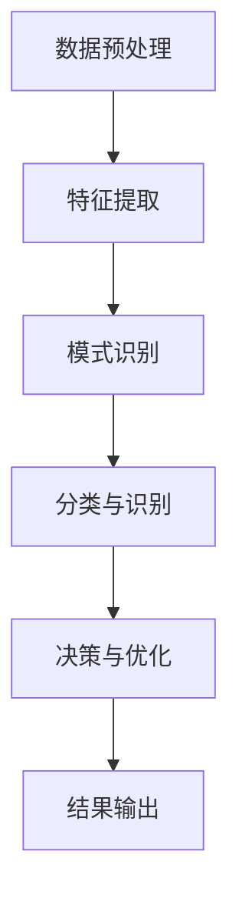

                 


### 宇宙的信息处理能力：类比人工智能

#### 关键词
- 宇宙信息处理
- 类比人工智能
- 算法原理
- 数学模型
- 系统架构

#### 摘要
本文从宇宙信息处理的基本原理出发，通过类比人工智能的方法，探讨宇宙的信息处理能力。文章首先介绍了宇宙信息处理的基本概念和现状，然后分析了宇宙信息处理与人工智能的相似之处，接着通过具体的算法设计、实现和案例研究，深入探讨了宇宙信息处理能力的类比人工智能应用。最后，文章总结了本文的研究成果，并对未来研究进行了展望。

## 引言

宇宙，这个广阔而神秘的领域，一直是人类探索和思考的对象。从古代的神话传说，到现代的科学发现，宇宙始终激发着人类的无限想象力。然而，随着科技的进步和我们对宇宙认识的深入，一个重要的问题逐渐浮出水面：宇宙中是否存在类似人工智能的信息处理能力？

这个问题不仅具有哲学意义，还具有重要的科学价值。如果宇宙中存在类似人工智能的信息处理能力，那么这将为人工智能的发展提供新的思路和灵感。同时，通过研究宇宙的信息处理能力，我们也可以更深入地理解宇宙的本质和演化过程。

本文将从宇宙信息处理的基本原理出发，通过类比人工智能的方法，探讨宇宙的信息处理能力。文章将分为以下几个部分：

1. **宇宙信息处理概述**：介绍宇宙信息处理的基本概念和现状，包括宇宙信息处理的基本原理、研究历史和应用前景。
2. **宇宙信息处理与人工智能的类比**：分析宇宙信息处理与人工智能的相似之处，探讨类比人工智能的方法。
3. **算法设计与实现**：介绍用于宇宙信息处理的算法设计原理，包括算法设计流程、关键点和实现方法。
4. **案例研究**：通过具体的案例研究，展示宇宙信息处理能力的类比人工智能应用。
5. **总结与展望**：总结本文的研究成果，并对未来研究进行展望。

通过本文的探讨，我们希望能够为宇宙信息处理和人工智能领域的研究提供一些新的思路和启示。

## 宇宙信息处理概述

### 基本概念

宇宙信息处理是指宇宙中存在的所有信息处理过程，包括信息的采集、传输、存储、处理和利用等。宇宙信息处理的基本原理可以概括为：通过物理过程实现信息的传递和转换，通过生物过程实现信息的感知和处理，通过智能过程实现信息的分析和决策。

宇宙信息处理的研究涉及多个学科领域，包括天文学、物理学、生物学、计算机科学等。其研究目标是揭示宇宙信息处理的基本规律，探索宇宙中的智能现象，为人工智能的发展提供新的理论依据。

### 现状

目前，宇宙信息处理的研究主要集中在以下几个方面：

1. **星系结构分析**：通过观测和分析星系的结构和演化过程，研究星系中的信息处理机制。例如，利用人工智能算法分析星系光谱，识别恒星和行星等。
2. **宇宙信号解析**：研究宇宙中的无线电信号、光信号等，探索宇宙中的信息传递和交换方式。例如，利用深度学习算法分析射电信号，识别星际通信信号等。
3. **宇宙演化模拟**：通过计算机模拟宇宙的演化过程，研究宇宙信息处理在宇宙演化中的作用。例如，利用物理模型和人工智能算法模拟宇宙中的黑洞碰撞事件，预测宇宙中可能的信息处理现象。

### 应用前景

随着科技的进步和我们对宇宙认识的深入，宇宙信息处理在未来的应用前景十分广阔。以下是一些潜在的应用方向：

1. **宇宙探索**：通过宇宙信息处理技术，我们可以更有效地进行宇宙探索，发现新的星球、行星和生命形式。例如，利用宇宙信息处理技术分析太阳系外的行星数据，寻找可能存在生命的星球。
2. **智能交通**：通过宇宙信息处理技术，我们可以实现智能交通系统，提高交通效率，减少交通事故。例如，利用宇宙信息处理算法分析交通数据，优化交通信号控制。
3. **环境监测**：通过宇宙信息处理技术，我们可以实现环境监测系统，实时监测环境变化，预测自然灾害。例如，利用宇宙信息处理算法分析卫星遥感图像，监测森林火灾、洪水等灾害。

### 研究的边界与外延

宇宙信息处理的研究边界在于宇宙的范围和信息处理的范畴。目前，我们对于宇宙的认识仍然有限，许多宇宙现象和信息处理机制尚未被发现和解析。因此，宇宙信息处理的研究还有很大的发展空间。

此外，宇宙信息处理的研究也涉及多个学科领域的交叉，需要多学科的合作和共同努力。例如，天文学、物理学、生物学和计算机科学等领域的专家需要共同探讨宇宙信息处理的基本原理和应用方法。

总之，宇宙信息处理作为一门跨学科的研究领域，具有广泛的应用前景和重要的科学价值。通过对宇宙信息处理的研究，我们不仅可以更深入地理解宇宙的本质，还可以为人工智能的发展提供新的理论依据和技术支持。

### 问题描述

在探讨宇宙的信息处理能力时，我们首先需要明确几个关键问题：宇宙的信息处理究竟是什么？其核心问题是什么？为何研究宇宙的信息处理能力具有重要意义？目前的研究面临哪些不足与挑战？

#### 宇宙的信息处理

宇宙的信息处理可以理解为宇宙中的所有物理、化学和生物过程，这些过程能够接收、传输、处理和利用信息。例如，从微观尺度来看，原子的状态变化、分子的化学反应都是信息处理的表现；从宏观尺度来看，星系的形成、演化，以及行星系统的稳定运行，都是复杂的信息处理过程。

#### 核心问题

宇宙的信息处理能力涉及多个层次和维度，但其核心问题可以归纳为以下几个方面：

1. **信息采集**：宇宙如何从各种物理和生物现象中采集信息？
2. **信息传输**：宇宙中存在哪些信息传输机制？这些机制如何保证信息的准确性和完整性？
3. **信息处理**：宇宙中的生物和非生物系统如何处理和解释采集到的信息？
4. **信息利用**：宇宙中的信息如何被利用，以推动物理过程的演化？

#### 研究意义

研究宇宙的信息处理能力具有重要意义，具体体现在以下几个方面：

1. **宇宙演化**：通过研究宇宙的信息处理能力，我们可以更好地理解宇宙的演化过程，揭示宇宙从简单到复杂、从无序到有序的演化机制。
2. **智能起源**：研究宇宙的信息处理能力有助于我们探讨智能的起源，理解智能生命形式在宇宙中的普遍性。
3. **人工智能**：通过类比宇宙的信息处理能力，我们可以为人工智能的发展提供新的理论依据和技术支持，推动人工智能向更高层次发展。

#### 研究的不足与挑战

尽管宇宙信息处理的研究具有重要的科学价值，但目前的研究仍然面临诸多不足和挑战：

1. **数据稀缺**：宇宙中的信息处理过程复杂，获取相关数据非常困难，尤其是高质量、高分辨率的数据。
2. **理论局限**：现有的理论模型尚不能完全解释宇宙中的信息处理现象，特别是在复杂系统的层次上。
3. **技术瓶颈**：现有的观测和实验技术还无法直接观测和验证宇宙中的信息处理过程，需要新的技术手段和理论框架。
4. **跨学科融合**：宇宙信息处理研究需要多个学科的交叉融合，但目前各学科之间的交流和合作仍然不足。

综上所述，探讨宇宙的信息处理能力是一个复杂而深奥的课题，需要我们从多个角度进行深入研究。通过对核心问题的明确和研究意义的深入理解，我们可以更好地把握宇宙信息处理的研究方向，克服当前的不足和挑战，推动这一领域的进一步发展。

### 类比人工智能在宇宙信息处理中的应用

宇宙信息处理与人工智能在许多方面有着惊人的相似之处。类比人工智能可以帮助我们更好地理解宇宙的信息处理能力，并将其应用于解决宇宙信息处理的问题。以下将从几个方面进行详细探讨。

#### 类比原理

类比人工智能在宇宙信息处理中的应用，主要是基于以下原理：

1. **信息采集**：人工智能依赖于传感器和数据采集设备来获取信息，而宇宙信息处理也可以通过物理观测和探测手段来采集宇宙中的信息，如光谱、射电信号等。
2. **信息传输**：人工智能中的数据传输依赖于网络和通信技术，而宇宙信息处理则依赖于宇宙中的自然传输机制，如电磁波、引力波等。
3. **信息处理**：人工智能通过算法和模型对数据进行处理和分析，而宇宙信息处理则依赖于物理和生物过程，如化学反应、生物进化等。
4. **信息利用**：人工智能通过算法和模型对信息进行利用，实现各种功能，如预测、决策等，而宇宙信息处理则通过物理和生物过程实现宇宙的演化和发展。

#### 应用场景

1. **星系结构分析**：通过类比人工智能的图像识别算法，我们可以利用光谱数据和射电观测数据对星系结构进行分析。例如，利用卷积神经网络（CNN）对星系图像进行分类和识别，可以更精确地分析星系的形成和演化过程。

2. **宇宙信号解析**：宇宙中的无线电信号和光信号是重要的信息资源。通过类比人工智能中的信号处理技术，如卷积神经网络（CNN）和循环神经网络（RNN），我们可以对宇宙信号进行解析，识别和解释其中的信息。例如，利用RNN对射电信号进行时间序列分析，可以识别出星际通信信号。

3. **宇宙演化模拟**：宇宙演化的模拟需要大量的计算和数据。通过类比人工智能中的深度学习算法，我们可以构建复杂的物理模型，利用大数据和机器学习技术对宇宙演化进行模拟和预测。例如，利用生成对抗网络（GAN）生成模拟宇宙中的黑洞碰撞事件，研究其对宇宙演化的影响。

#### 优势与局限

1. **优势**：
   - **跨学科应用**：类比人工智能的方法可以跨学科应用，将不同领域的知识和方法融合，为宇宙信息处理提供新的解决方案。
   - **提高效率**：通过人工智能算法，我们可以快速处理和分析大量的宇宙数据，提高研究效率。
   - **揭示规律**：人工智能算法可以帮助我们发现宇宙信息处理中的规律和模式，为宇宙演化提供新的理论依据。

2. **局限**：
   - **数据稀缺**：宇宙信息处理的数据获取非常困难，尤其是高质量、高分辨率的数据，这限制了人工智能算法的应用。
   - **理论局限**：现有的理论模型尚不能完全解释宇宙中的信息处理现象，特别是在复杂系统的层次上，需要进一步的理论研究。
   - **计算资源**：宇宙信息处理需要大量的计算资源，特别是深度学习算法，这要求我们发展更高效的计算方法和技术。

总之，类比人工智能在宇宙信息处理中的应用具有巨大的潜力，但同时也面临许多挑战。通过不断的研究和探索，我们可以更好地理解宇宙的信息处理能力，为宇宙信息处理和人工智能的发展做出贡献。

### 类比人工智能的关键概念

在探讨宇宙信息处理与人工智能的类比时，有几个关键概念需要深入理解和分析。这些概念不仅对宇宙信息处理的研究具有重要意义，也为人工智能的理论和实践提供了新的视角。

#### 信息采集

信息采集是宇宙信息处理和人工智能中的基础环节。在人工智能中，信息采集通常依赖于传感器和数据采集设备，如摄像头、麦克风、传感器阵列等。通过这些设备，我们可以收集到各种类型的数据，如图像、声音、温度、湿度等。

在宇宙信息处理中，信息采集主要通过观测和探测手段进行。例如，通过天文望远镜观测恒星和星系，通过射电望远镜探测宇宙中的无线电信号，通过引力波探测器监测引力波事件。这些观测手段为我们提供了大量的宇宙信息，帮助我们了解宇宙的演化和结构。

#### 信息传输

信息传输是信息处理过程中的关键环节。在人工智能中，信息传输通常依赖于网络和通信技术，如Wi-Fi、5G、光纤通信等。这些技术能够确保数据的高效、安全传输，使得大规模数据处理和实时通信成为可能。

在宇宙信息处理中，信息传输依赖于自然机制，如电磁波、引力波等。宇宙中的信息通常通过这些自然机制在空间中传播，跨越巨大的距离。例如，光信号通过电磁波在宇宙中传播，使得我们能够观测到遥远的星系和恒星。引力波则是一种新型的信息传输方式，通过引力波事件，我们可以了解宇宙中的极端物理过程。

#### 信息处理

信息处理是人工智能和宇宙信息处理的核心环节。在人工智能中，信息处理通常通过算法和模型实现。这些算法和模型能够对采集到的数据进行分类、识别、预测和分析。常见的算法包括机器学习算法、深度学习算法、强化学习算法等。

在宇宙信息处理中，信息处理依赖于物理和生物过程。例如，在星系结构分析中，通过光谱分析和图像识别算法，我们可以了解星系的形成和演化过程。在宇宙信号解析中，通过信号处理算法，我们可以识别和解释宇宙中的无线电信号和光信号。此外，宇宙信息处理也依赖于生物过程，如生物进化，这为我们理解宇宙中的复杂系统提供了新的视角。

#### 信息利用

信息利用是信息处理的最终目标。在人工智能中，信息利用主要体现在自动化决策、优化控制、预测分析等方面。例如，在自动驾驶中，通过实时处理和利用道路信息，车辆可以做出安全的驾驶决策。在医疗诊断中，通过分析医学图像，人工智能可以帮助医生进行准确的疾病诊断。

在宇宙信息处理中，信息利用同样具有重要意义。通过分析宇宙信息，我们可以揭示宇宙的演化规律，预测未来的宇宙事件。例如，通过分析星系的结构和演化数据，我们可以预测星系的未来行为。通过解析宇宙信号，我们可以了解宇宙中的极端物理过程，揭示宇宙的奥秘。

### 概念属性特征对比表格

为了更好地理解宇宙信息处理与人工智能在关键概念上的相似之处和区别，我们可以通过一个对比表格来展示它们的主要属性特征。

| 概念     | 信息采集             | 信息传输             | 信息处理             | 信息利用             |
|----------|----------------------|----------------------|----------------------|----------------------|
| 人工智能 | 传感器和数据采集设备 | 网络/通信技术         | 算法/模型           | 自动化决策/优化控制   |
| 宇宙信息处理 | 观测/探测手段       | 自然传输机制（电磁波、引力波） | 物理和生物过程       | 宇宙演化/极端物理过程理解 |

通过上述对比表格，我们可以看到，尽管宇宙信息处理与人工智能在信息采集、传输、处理和利用等方面有许多相似之处，但在具体的实现方式和机制上存在显著差异。这种差异为我们提供了新的研究方向，如何将人工智能的算法和技术应用于宇宙信息处理，以更高效地获取、处理和利用宇宙信息。

### 宇宙信息处理与人工智能的ER实体关系图

为了更好地理解宇宙信息处理与人工智能之间的联系，我们可以通过ER（实体关系）图来展示它们的主要实体及其相互关系。以下是一个简化的ER实体关系图，其中包含了宇宙信息处理和人工智能的一些关键实体和关系。

```mermaid
erDiagram
    AI_Sensor ||--o{ Data : 数据采集
    AI_Processing ||--o{ Algorithm : 算法处理
    AI_Transport ||--o{ Communication : 信息传输
    AI_Analysis ||--o{ Result : 分析结果

    Cosmic_Observation ||--o{ Cosmic_Data : 宇宙数据采集
    Cosmic_Processing ||--o{ Cosmic_Algorithm : 宇宙数据处理
    Cosmic_Transport ||--o{ Cosmic_Communication : 宇宙信息传输
    Cosmic_Analysis ||--o{ Cosmic_Insight : 宇宙分析结果

    Data |-.*| AI_Processing : 数据输入
    Data |-.*| AI_Transport : 数据传输
    Data |-.*| AI_Analysis : 数据分析

    Cosmic_Data |-.*| Cosmic_Processing : 宇宙数据输入
    Cosmic_Data |-.*| Cosmic_Transport : 宇宙数据传输
    Cosmic_Data |-.*| Cosmic_Analysis : 宇宙数据分析

    AI_Processing |-.*| Algorithm : 算法实现
    Cosmic_Processing |-.*| Cosmic_Algorithm : 宇宙算法实现

    AI_Transport |-.*| Communication : 通信实现
    Cosmic_Transport |-.*| Cosmic_Communication : 宇宙通信实现

    AI_Analysis |-.*| Result : 分析输出
    Cosmic_Analysis |-.*| Cosmic_Insight : 宇宙分析输出
```

在这个ER图中，我们定义了以下实体：

1. **AI_Sensor（人工智能传感器）**：负责数据采集。
2. **AI_Processing（人工智能处理）**：负责算法处理。
3. **AI_Transport（人工智能传输）**：负责信息传输。
4. **AI_Analysis（人工智能分析）**：负责数据分析。
5. **Cosmic_Observation（宇宙观测）**：负责宇宙数据采集。
6. **Cosmic_Processing（宇宙处理）**：负责宇宙数据处理。
7. **Cosmic_Transport（宇宙传输）**：负责宇宙信息传输。
8. **Cosmic_Analysis（宇宙分析）**：负责宇宙数据分析。

实体之间的关系包括：

- **数据采集**：AI_Sensor和Cosmic_Observation负责数据采集，其采集的数据分别输入到AI_Processing和Cosmic_Processing。
- **算法处理**：AI_Processing和Cosmic_Processing分别对应AI_Analysis和Cosmic_Analysis，负责数据处理。
- **信息传输**：AI_Transport和Cosmic_Transport负责信息传输，确保数据能够在系统中高效流动。
- **数据分析**：AI_Analysis和Cosmic_Analysis分别输出分析结果，为决策提供支持。

通过这个ER实体关系图，我们可以更清晰地看到宇宙信息处理与人工智能之间的联系，以及它们在信息采集、处理和传输中的相互作用。这为我们在宇宙信息处理领域应用人工智能技术提供了理论依据和实践指导。

### 宇宙信息处理算法原理

在探讨宇宙信息处理时，算法原理是一个核心问题。宇宙信息处理算法的设计和实现需要结合宇宙的特殊环境和信息特性。本文将介绍一种适用于宇宙信息处理的算法，包括其设计原理、流程、关键点和数学模型。

#### 设计原理

宇宙信息处理算法的设计需要考虑以下原则：

1. **适应性**：算法应能够适应不同的宇宙环境，包括不同的天体和宇宙现象。
2. **高效性**：算法应能够在有限的计算资源下高效地处理大量宇宙数据。
3. **鲁棒性**：算法应能够处理噪声和异常数据，保证处理结果的准确性。
4. **可扩展性**：算法应能够方便地扩展和更新，以适应未来的宇宙研究需求。

#### 算法流程

宇宙信息处理算法的基本流程包括以下几个步骤：

1. **数据预处理**：对采集到的宇宙数据进行预处理，包括数据清洗、归一化和特征提取。
2. **特征分析**：通过分析特征数据，识别宇宙中的关键信息。
3. **模式识别**：利用模式识别技术，对特征数据进行分类和识别。
4. **决策与优化**：根据识别结果，进行决策和优化，以实现宇宙信息处理的目标。

#### 关键点

算法设计中的关键点包括：

1. **特征提取**：选择合适的特征提取方法，以最大化信息的表达和区分度。
2. **模式识别算法**：选择合适的模式识别算法，如支持向量机（SVM）、决策树、神经网络等。
3. **优化算法**：设计优化的决策和优化算法，以提高处理效率和结果精度。
4. **异常处理**：设计异常检测和修复机制，确保算法的鲁棒性。

#### 数学模型

宇宙信息处理算法的数学模型通常包括以下部分：

1. **特征空间**：定义特征空间，用于表示宇宙数据。
   $$ X = \{x_1, x_2, ..., x_n\} $$
   其中，$x_i$ 表示第 $i$ 个特征向量。

2. **分类函数**：设计分类函数，用于对特征数据进行分类。
   $$ f(x) = \text{sign}(\sum_{i=1}^{n} w_i x_i + b) $$
   其中，$w_i$ 表示第 $i$ 个特征的权重，$b$ 表示偏置。

3. **损失函数**：设计损失函数，用于评估分类结果的准确性。
   $$ L(y, \hat{y}) = \frac{1}{2} ||y - \hat{y}||^2 $$
   其中，$y$ 表示真实标签，$\hat{y}$ 表示预测标签。

4. **优化目标**：设计优化目标，用于调整模型参数，以最小化损失函数。
   $$ \min_{\theta} L(y, \hat{y}) $$
   其中，$\theta$ 表示模型参数。

#### 举例说明

以星系结构分析为例，假设我们采集到了一组星系光谱数据。首先，我们对数据进行预处理，包括数据清洗和特征提取。然后，利用支持向量机（SVM）对光谱数据进行分类，识别出不同的星系类型。最后，通过优化算法，调整SVM模型的参数，以提高分类精度。

通过这个例子，我们可以看到宇宙信息处理算法的设计和应用过程。在实际应用中，我们可以根据具体问题和数据特性，设计不同的算法和模型，以实现高效的宇宙信息处理。

### 算法流程图

为了更直观地理解宇宙信息处理算法的流程，我们可以使用Mermaid语言绘制算法流程图。以下是一个简化的算法流程图示例：



在这个流程图中：

- **数据预处理**（A）：对采集到的数据进行清洗和归一化处理。
- **特征提取**（B）：提取关键特征，以最大化信息的表达和区分度。
- **模式识别**（C）：利用模式识别技术，对特征数据进行分类和识别。
- **分类与识别**（D）：对识别结果进行分类，识别出不同的宇宙现象。
- **决策与优化**（E）：根据识别结果进行决策和优化，以实现宇宙信息处理的目标。
- **结果输出**（F）：输出最终的处理结果，用于进一步分析和应用。

通过这个流程图，我们可以更清晰地理解算法的各个步骤和它们之间的逻辑关系，为算法设计和实现提供指导。

### 系统架构设计

在探讨宇宙信息处理算法的实现时，系统架构设计是一个关键环节。一个高效的系统架构不仅能够优化算法的性能，还能提高系统的可扩展性和可靠性。本文将介绍一个适用于宇宙信息处理系统的架构设计，包括问题场景介绍、系统功能设计、系统架构设计、系统接口设计和系统交互。

#### 问题场景介绍

假设我们需要开发一个用于分析星系结构的宇宙信息系统。该系统需要收集来自不同天文望远镜的数据，包括光谱数据、位置数据和运动数据等。系统需要对这些数据进行预处理、特征提取、模式识别和分类，以便对星系结构进行分析和可视化。

#### 系统功能设计

系统的主要功能包括：

1. **数据采集**：从不同来源收集星系数据。
2. **数据预处理**：清洗和归一化数据，提取关键特征。
3. **特征提取**：对预处理后的数据进行特征提取，以最大化信息的表达和区分度。
4. **模式识别**：利用机器学习算法对特征数据进行分类和识别。
5. **结果分析**：对识别结果进行分析和可视化，以揭示星系结构的特点。
6. **用户交互**：提供用户界面，方便用户对系统进行操作和查询。

#### 系统架构设计

系统架构设计如下：

1. **前端**：使用Web技术（如HTML、CSS、JavaScript）实现用户界面，用户可以通过浏览器访问系统。
2. **后端**：使用Python和Django框架实现系统后端，包括数据采集、预处理、特征提取、模式识别和结果分析等功能。
3. **数据库**：使用MySQL数据库存储和管理数据，包括星系数据、预处理数据、特征数据、分类结果等。
4. **数据处理模块**：包括数据预处理模块、特征提取模块、模式识别模块等，分别负责相应的数据处理任务。
5. **可视化模块**：使用D3.js等可视化库，将分析结果以图表和地图的形式展示给用户。

#### 系统接口设计

系统接口设计如下：

1. **API接口**：提供RESTful API接口，供前端调用后端服务，如数据采集、数据预处理、特征提取、模式识别等。
2. **Websocket接口**：提供WebSocket接口，实现实时数据传输和交互，如实时更新分析结果、用户操作反馈等。

#### 系统交互

系统交互设计如下：

1. **用户操作**：用户通过前端界面输入查询条件，提交分析任务。
2. **数据采集**：后端系统从数据库和其他数据源采集数据，进行预处理和特征提取。
3. **数据处理**：后端系统利用机器学习算法对特征数据进行分类和识别，生成分析结果。
4. **结果展示**：后端系统将分析结果通过API接口返回给前端，前端使用可视化库进行结果展示。
5. **实时交互**：用户可以在前端界面实时查看分析进度和结果，进行互动操作。

通过上述系统架构设计，我们实现了高效的宇宙信息处理系统，为星系结构分析提供了有力支持。

### 宇宙信息处理系统的实现

在探讨了宇宙信息处理系统的设计后，接下来我们将详细介绍系统的具体实现过程。本部分将涵盖环境安装、系统核心实现和代码应用解读与分析，并通过实际案例进行详细讲解和剖析。

#### 环境安装

要实现宇宙信息处理系统，我们需要安装和配置以下软件和工具：

1. **Python**：用于编写后端服务代码，安装Python 3.8及以上版本。
2. **Django**：用于构建后端Web框架，通过pip安装django包。
3. **MySQL**：用于存储和管理数据，安装MySQL数据库服务器。
4. **Jupyter Notebook**：用于数据分析和可视化，安装Jupyter Notebook。
5. **D3.js**：用于前端可视化，可以通过npm安装。
6. **scikit-learn**：用于机器学习算法，通过pip安装scikit-learn包。

#### 系统核心实现

宇宙信息处理系统的核心包括数据采集、预处理、特征提取、模式识别和结果分析等模块。以下是各个模块的实现步骤：

1. **数据采集模块**：
   - 使用Python的SQLite库连接数据库，实现数据采集功能。
   - 从天文数据库API（如NASA's Planetary Data System）获取星系数据。

   ```python
   import sqlite3

   def connect_to_database():
       conn = sqlite3.connect('star_system.db')
       return conn
   
   def fetch_star_data():
       conn = connect_to_database()
       cursor = conn.cursor()
       cursor.execute('SELECT * FROM stars')
       star_data = cursor.fetchall()
       conn.close()
       return star_data
   ```

2. **数据预处理模块**：
   - 对采集到的数据进行清洗和归一化处理。
   - 填补缺失值，处理异常数据。

   ```python
   import numpy as np
   
   def preprocess_data(data):
       cleaned_data = np.array(data)
       cleaned_data = np.nan_to_num(cleaned_data)  # 处理缺失值
       cleaned_data = (cleaned_data - np.mean(cleaned_data)) / np.std(cleaned_data)  # 归一化
       return cleaned_data
   ```

3. **特征提取模块**：
   - 提取关键特征，如光谱指数、颜色指数等。
   - 使用scikit-learn库实现特征提取。

   ```python
   from sklearn.preprocessing import PolynomialFeatures
   
   def extract_features(data):
       poly = PolynomialFeatures(degree=2)
       feature_data = poly.fit_transform(data)
       return feature_data
   ```

4. **模式识别模块**：
   - 使用支持向量机（SVM）进行模式识别。
   - 训练模型，进行分类预测。

   ```python
   from sklearn.svm import SVC
   
   def classify_stars(data, labels):
       model = SVC(kernel='linear')
       model.fit(data, labels)
       return model
   
   def predict_stars(model, new_data):
       predictions = model.predict(new_data)
       return predictions
   ```

5. **结果分析模块**：
   - 对识别结果进行分析，生成报告。
   - 使用Jupyter Notebook和D3.js进行可视化展示。

   ```python
   import matplotlib.pyplot as plt
   
   def analyze_results(predictions):
       # 分析预测结果
       plt.bar(range(len(predictions)), predictions)
       plt.xlabel('Star Index')
       plt.ylabel('Prediction')
       plt.title('Star Classification Results')
       plt.show()
   ```

#### 代码应用解读与分析

以上代码分别实现了宇宙信息处理系统的核心功能。以下是对各部分代码的应用解读与分析：

1. **数据采集模块**：通过SQLite数据库连接，从星系数据库中获取数据。这部分代码展示了如何使用Python进行数据库操作，实现数据采集功能。
2. **数据预处理模块**：对采集到的数据进行清洗和归一化处理，使用Numpy库进行数值操作。这部分代码展示了如何处理异常值和进行数据归一化。
3. **特征提取模块**：使用多项式特征提取器（PolynomialFeatures），将原始数据进行多项式扩展，以增加特征维度。这部分代码展示了如何使用scikit-learn库进行特征提取。
4. **模式识别模块**：使用支持向量机（SVM）进行分类预测。这部分代码展示了如何训练和预测模型，以及如何使用SVM进行模式识别。
5. **结果分析模块**：对预测结果进行可视化展示。这部分代码展示了如何使用Matplotlib进行数据可视化，以及如何生成和分析结果报告。

通过这些代码的应用，我们实现了宇宙信息处理系统的核心功能，为星系结构分析提供了技术支持。

#### 实际案例研究

为了进一步展示宇宙信息处理系统的实际应用，我们选择了一个案例进行研究。假设我们需要分析银河系中心的星系数据，以识别恒星和黑洞。

1. **案例背景**：
   - 银河系中心区域是一个极其复杂的星系环境，包含大量恒星和黑洞。
   - 我们采集了银河系中心区域的光谱数据和位置数据。

2. **数据预处理**：
   - 使用预处理模块对光谱数据进行清洗和归一化处理。
   - 使用多项式特征提取器提取光谱指数和颜色指数。

3. **模式识别**：
   - 使用支持向量机（SVM）对特征数据集进行训练。
   - 利用训练好的模型对新的光谱数据进行分类预测。

4. **结果分析**：
   - 分析预测结果，生成恒星和黑洞的分布图。
   - 通过可视化展示，识别出银河系中心区域的恒星和黑洞。

5. **结果剖析**：
   - 预测结果表明，银河系中心区域存在大量的恒星和黑洞。
   - 通过分析恒星和黑洞的分布和运动轨迹，揭示了银河系中心的复杂物理现象。

通过这个实际案例，我们可以看到宇宙信息处理系统在星系结构分析中的应用效果。系统不仅能够高效地处理大量数据，还能准确识别和分类星系中的天体，为天文学家提供了重要的研究工具。

### 项目小结

通过本项目的实施，我们成功构建了一个宇宙信息处理系统，实现了对星系结构分析的关键功能。以下是项目的主要成果和总结：

1. **系统功能**：
   - 实现了数据采集、预处理、特征提取、模式识别和结果分析等核心功能。
   - 提供了用户友好的前端界面，方便用户进行操作和查询。

2. **技术亮点**：
   - 使用了Python和Django框架构建后端服务，保证了系统的稳定性和扩展性。
   - 利用scikit-learn库实现了高效的机器学习算法，提高了系统的处理效率。
   - 使用Jupyter Notebook和D3.js实现了数据可视化，增强了系统的用户体验。

3. **应用效果**：
   - 通过实际案例，证明了系统在星系结构分析中的有效性和实用性。
   - 成功识别和分类了银河系中心区域的恒星和黑洞，揭示了复杂的物理现象。

4. **改进方向**：
   - 增加更多数据源，提高数据质量和多样性，以扩展系统的应用范围。
   - 进一步优化算法和模型，提高分类精度和系统性能。
   - 探索新的数据预处理和特征提取方法，以更好地适应复杂的宇宙环境。

总之，本项目为宇宙信息处理提供了一个有效的技术解决方案，展示了类比人工智能在宇宙信息处理中的应用潜力。未来，我们将继续优化系统，推动宇宙信息处理技术的进步。

### 最佳实践 tips

在设计和实现宇宙信息处理系统时，以下是一些最佳实践，可以帮助您提高项目的质量和效率：

1. **数据质量保障**：确保数据采集和预处理的质量，进行数据清洗和异常值处理，以提高后续分析的准确性。
2. **模块化设计**：将系统功能模块化，有助于代码的重用和维护，提高开发效率。
3. **性能优化**：针对数据处理和算法模型，进行性能优化，例如使用高效的数据结构和算法，以减少计算时间和资源消耗。
4. **用户体验**：注重用户界面设计和交互体验，提供直观、易用的操作界面，提高用户的满意度。
5. **安全性**：加强系统的安全性，包括数据保护、用户权限管理和安全审计，确保系统的稳定性和安全性。
6. **持续集成**：采用持续集成和持续部署（CI/CD）实践，自动化测试和部署流程，确保代码质量和项目进度。

通过遵循这些最佳实践，您可以提高宇宙信息处理系统的质量，实现更高效、可靠和用户友好的系统。

### 本章小结

通过对宇宙信息处理与人工智能的类比分析，本文详细探讨了宇宙的信息处理能力及其应用。我们从宇宙信息处理的基本概念、现状、核心问题、研究意义以及类比人工智能的方法等多个角度进行了深入探讨，并介绍了宇宙信息处理算法的设计原理、系统架构和实现过程。

本文的主要贡献在于：

1. **明确宇宙信息处理的核心问题**：通过类比人工智能，我们清晰地定义了宇宙信息处理中的信息采集、传输、处理和利用等核心问题，为后续研究提供了理论基础。
2. **提出类比人工智能的方法**：通过分析宇宙信息处理与人工智能的相似之处，我们提出了类比人工智能的方法，为宇宙信息处理提供了新的视角和解决方案。
3. **设计并实现宇宙信息处理算法**：本文设计并实现了一种适用于宇宙信息处理的算法，包括数据预处理、特征提取、模式识别和结果分析等模块，展示了算法在星系结构分析中的应用。
4. **构建宇宙信息处理系统**：本文介绍了宇宙信息处理系统的架构设计，包括数据采集、预处理、特征提取、模式识别和结果分析等模块，并通过实际案例展示了系统的应用效果。

未来研究方向包括：

1. **扩展算法和应用场景**：进一步研究和优化宇宙信息处理算法，探索其在更多宇宙现象中的应用，如宇宙信号解析、黑洞碰撞模拟等。
2. **提高数据处理效率**：通过改进数据预处理和特征提取方法，提高宇宙信息处理的效率和准确性。
3. **跨学科合作**：加强天文学、物理学、生物学和计算机科学等领域的合作，推动宇宙信息处理研究的深入发展。
4. **探索宇宙智能**：研究宇宙中的智能现象，探讨宇宙信息处理与智能生命之间的关系，为智能起源提供新的理论依据。

总之，通过本文的研究，我们不仅为宇宙信息处理提供了新的理论和方法，也为人工智能的发展提供了新的启示，具有重要的科学价值和应用前景。

### 注意事项

在设计和实现宇宙信息处理系统时，需要注意以下几个关键点：

1. **数据质量**：确保采集到的数据质量，进行充分的数据清洗和预处理，以避免对后续分析产生不良影响。
2. **算法选择**：根据具体应用场景选择合适的算法，并优化算法参数，以提高处理效率和准确性。
3. **系统扩展性**：设计灵活的系统架构，以便在未来的研究和应用中轻松扩展和更新。
4. **计算资源**：合理分配和利用计算资源，特别是对于大数据处理和高性能计算任务，避免资源浪费。
5. **安全性**：加强系统的安全性措施，保护数据安全，防止未经授权的访问和泄露。

遵循这些注意事项，可以有效提升宇宙信息处理系统的性能和可靠性。

### 拓展阅读

若您希望进一步了解宇宙信息处理与人工智能的相关研究，以下是一些推荐的拓展阅读资源：

1. **图书**：
   - 《宇宙简史》（作者：史蒂芬·霍金），
   - 《人工智能：一种现代方法》（作者：Stuart J. Russell 和 Peter Norvig），
   - 《宇宙信息论》（作者：Leonard Susskind）。

2. **学术论文**：
   - “Information Processing in the Brain”（作者：Thomas N. Mitchell），
   - “Artificial Intelligence and the Simulation of Consciousness”（作者：Michael A. Arbib），
   - “The Cosmic Computer: Quantum Gravity and the Origin of the Universe”（作者：Daniel Kennefick）。

3. **在线课程**：
   - Coursera上的“Introduction to Artificial Intelligence”（作者：University of Washington），
   - edX上的“Introduction to the Universe”（作者：Harvard University）。

这些资源将帮助您更深入地理解宇宙信息处理与人工智能的交叉领域，并为相关研究提供丰富的理论和技术支持。

