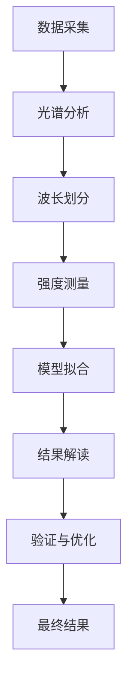

                 

# 宇宙的信息处理能力：类比超级计算机

## 关键词

宇宙、信息处理、超级计算机、类比、物理过程、计算模型、系统架构、算法原理

## 摘要

本文探讨了宇宙作为一个巨大的信息处理系统，其能力可以类比为超级计算机。通过分析宇宙的物理过程和天体运动，我们尝试将宇宙的运行机制与计算机的工作原理进行类比，从而揭示宇宙在信息处理方面的高效性和复杂性。文章首先介绍了宇宙信息处理的核心概念，随后详细阐述了宇宙类比超级计算机的原理，并通过实际案例展示了这一概念的运用。本文旨在为读者提供一个全新的视角，重新审视宇宙的本质，并启发对计算机科学与宇宙学交叉领域的探索。

## 引言

在当今科技迅猛发展的时代，计算机技术已经成为我们日常生活和工作中不可或缺的一部分。然而，尽管计算机在数据处理和复杂计算方面取得了巨大的进步，我们依然对它们的能力极限有着浓厚的兴趣。近年来，科学家们开始思考，如果将宇宙本身看作一个巨大的计算系统，它的信息处理能力会有多强大？

这种想法激发了我们对宇宙的信息处理能力的探索，并将宇宙类比为一台超级计算机。宇宙中的各种物理过程，如星系运动、黑洞吞噬、恒星生命周期等，实际上都是对大量信息的处理和计算。这种类比不仅具有科学意义，还能帮助我们更好地理解宇宙的运作机制。

本文将围绕这一核心概念展开，通过详细分析宇宙中的信息处理过程，类比计算机的工作原理，探讨宇宙在信息处理方面的高效性和复杂性。接下来，我们将首先介绍宇宙信息处理的核心概念，并逐步深入探讨这一概念的原理和应用。

### 核心概念

在探讨宇宙的信息处理能力之前，我们需要明确一些核心概念。这些概念包括“信息处理”、“超级计算机”以及与之相关的术语。

首先，**信息处理**是指通过计算机或其他设备对信息进行获取、存储、处理、传输和呈现的过程。它涉及到数据的输入、处理和输出，是计算机科学中一个重要的研究领域。

**超级计算机**则是一种具备极高计算能力、可以处理海量数据和复杂问题的计算机系统。与普通计算机相比，超级计算机具有更高的速度、更大的存储容量和更强大的计算能力。它们通常用于科学研究和工业应用中，如天气预报、核能模拟、生物信息学等。

此外，我们还需要了解一些与信息处理和超级计算机相关的术语：

- **算法**：一种解决问题的方法和步骤，通常由一系列规则和指令组成。算法是信息处理的核心，它决定了计算机执行任务的方式和效率。
- **并行计算**：一种利用多个计算资源（如多处理器、多核处理器）同时执行计算任务的方法。并行计算可以提高计算速度，解决复杂问题。
- **分布式计算**：一种通过将任务分配到多个计算节点上执行的计算模式。分布式计算可以充分利用网络中的计算资源，提高系统性能和可靠性。
- **量子计算**：一种利用量子力学原理进行计算的技术。量子计算具有远超传统计算机的潜力，可以解决某些特定问题，如大数分解、量子模拟等。

### 问题背景

宇宙的信息处理能力这个概念并非空穴来风。事实上，科学家们早已意识到宇宙本身就是一个极其复杂的系统，其内部包含着大量的信息。从宏观层面来看，宇宙由数十亿个星系组成，每个星系中又包含数千亿颗恒星。这些恒星通过引力相互作用，形成了复杂的星系结构。从微观层面来看，宇宙中的物质由基本粒子组成，这些粒子通过相互作用形成了各种物质结构，如行星、星系等。

在信息处理的背景下，我们可以将宇宙看作一个巨大的计算系统，其中包含着大量的信息流和信息处理过程。例如，星系间的引力相互作用可以被视为一种信息传递和处理过程，恒星的生命周期则可以看作是对信息（如能量、物质）的处理和转化。

然而，与地球上的计算机系统相比，宇宙的信息处理能力具有以下几个特点：

1. **大规模**：宇宙中的信息量极其庞大，包含了无数个星系、恒星、行星和基本粒子。这些信息不仅包括当前状态，还包括了历史数据和未来预测。
2. **复杂性**：宇宙的信息处理过程极其复杂，涉及到多种物理现象和相互作用。例如，黑洞吞噬物质的过程不仅涉及到引力，还涉及到物质的密度、温度、能量等。
3. **高效性**：宇宙的信息处理速度非常快。例如，星系间的引力相互作用可以在短时间内改变星系的结构和运动轨迹。
4. **自适应性**：宇宙具有强大的自适应能力，可以应对各种突发事件和变化。例如，星系在碰撞过程中可以重新调整自己的结构，以适应新的环境。

这些特点使得宇宙在信息处理方面具有极高的能力，甚至可以被视为一台超级计算机。

### 问题描述

要理解宇宙的信息处理能力，我们可以将宇宙视为一个复杂的计算系统，其中包含着各种信息和数据处理过程。这个过程可以分为以下几个步骤：

1. **信息采集**：宇宙中的各种物理过程和现象会不断产生信息。例如，恒星爆炸、行星运动、黑洞吞噬等。
2. **信息传输**：产生的信息会通过宇宙中的各种渠道进行传输。例如，光、无线电波、引力波等。
3. **信息处理**：接收到的信息会在宇宙中的各种计算系统中进行处理。例如，星系间的引力相互作用、恒星内部的热核反应等。
4. **信息输出**：处理后的信息会以某种形式输出。例如，星系结构的形成、恒星光谱的变化、行星轨道的偏移等。

在这个过程中，宇宙中的每一个天体和现象都可以被视为一个信息处理单元，它们共同构成了一个庞大的计算网络。这个计算网络不仅能够处理大量的信息，还具有高度的复杂性和自适应能力。

例如，当我们观察星系时，我们实际上是在接收来自遥远星系的信息。这些信息通过光传播到地球，然后被我们的望远镜和仪器接收和处理。通过分析这些信息，我们可以推断出星系的运动轨迹、结构、质量等信息。

再如，黑洞吞噬物质的过程。在这个过程中，黑洞会吸入周围的物质，这些物质会在黑洞周围形成一个围绕黑洞的盘状结构。通过观测这个盘状结构的光谱和辐射特性，我们可以推断出黑洞的质量、旋转速度等信息。

这些例子表明，宇宙的信息处理能力是极其强大和复杂的。它不仅能够处理大量的信息，还具有高度的灵活性和适应性，可以应对各种突发事件和变化。

### 问题解决

为了深入理解宇宙的信息处理能力，我们可以从以下几个方面进行分析：

1. **物理过程与计算过程的类比**：
   - **引力相互作用**：宇宙中的星系和恒星通过引力相互作用，形成复杂的结构。这个过程类似于计算机中的算法，通过对数据的处理和调整，实现复杂结构的形成。
   - **热核反应**：恒星内部的热核反应是一种能量转换过程，它将物质转化为能量。这个过程类似于计算机中的数据处理，通过对数据的处理和转化，实现能量的释放和利用。
   - **电磁波传播**：宇宙中的电磁波是一种信息传输方式，它通过空间传播，将信息从一个地方传递到另一个地方。这个过程类似于计算机中的网络通信，通过传输介质将信息从一个节点传递到另一个节点。

2. **宇宙作为计算系统的特性**：
   - **大规模**：宇宙中包含着无数的星系、恒星、行星和基本粒子，这些构成了一个庞大的计算网络。这个网络具有极高的计算容量和处理能力。
   - **复杂性**：宇宙中的物理过程和现象非常复杂，涉及到多种相互作用和能量转换。这个过程类似于计算机系统中的复杂算法和数据处理过程。
   - **自适应能力**：宇宙具有强大的自适应能力，可以应对各种突发事件和变化。这个过程类似于计算机系统中的故障检测和恢复机制。

3. **宇宙信息处理的算法原理**：
   - **引力计算**：星系间的引力相互作用可以通过牛顿万有引力定律进行计算。这个过程类似于计算机中的算法，通过对数据的计算和处理，实现星系结构的形成和变化。
   - **热核反应计算**：恒星内部的热核反应可以通过核物理学中的方程进行计算。这个过程类似于计算机中的算法，通过对数据的计算和处理，实现能量的释放和利用。
   - **电磁波传播计算**：电磁波的传播可以通过麦克斯韦方程组进行计算。这个过程类似于计算机中的算法，通过对数据的计算和处理，实现信息的传输和接收。

通过这些分析，我们可以看出，宇宙的信息处理能力类似于一台超级计算机。它不仅具有大规模、复杂性和自适应能力，还具备高效的信息处理和计算能力。这种类比为我们提供了一个新的视角，重新审视宇宙的本质和计算机科学的发展。

### 边界与外延

在探讨宇宙的信息处理能力时，我们需要明确一些边界和范围。首先，宇宙的信息处理能力主要是指宇宙中的物理过程和现象，如星系运动、恒星生命周期、黑洞吞噬等。这些过程都涉及大量的信息处理，但并不包括宇宙中的人类活动和社会现象。

此外，宇宙的信息处理能力主要基于物理学的原理，如引力、电磁力、热核反应等。虽然这些原理与计算机科学中的算法和计算方法有相似之处，但它们在本质上是不同的。计算机科学主要关注的是如何通过算法和程序实现信息处理，而宇宙的信息处理则更多地依赖于自然界的物理规律。

同时，我们也需要认识到，宇宙的信息处理能力虽然强大，但它仍然受到自然界的限制。例如，宇宙中的信息传输速度有限，电磁波的传播速度为光速，这限制了信息的传输速度。此外，宇宙中的计算资源也有限，例如恒星和行星的数量是有限的，它们的计算能力也受到物理规律的约束。

因此，尽管我们可以将宇宙类比为一台超级计算机，但这个类比并不是完全的。宇宙的信息处理能力有其独特的特点，这些特点既是我们对其理解的基础，也是我们未来需要进一步探索的领域。

### 概念结构与核心要素组成

在深入探讨宇宙的信息处理能力之前，我们首先需要明确其概念结构和核心要素组成。以下是宇宙信息处理能力的主要组成部分：

1. **基本粒子和物质结构**：宇宙中的基本粒子是信息处理的基本单位。它们通过相互作用形成了各种物质结构，如原子、分子、行星、星系等。这些物质结构在宇宙的信息处理过程中起着至关重要的作用。

2. **物理过程**：宇宙中的物理过程，如引力相互作用、电磁波传播、热核反应等，都是信息处理的重要组成部分。这些物理过程不仅产生了大量的信息，还对这些信息进行了处理和转化。

3. **天体运动和现象**：宇宙中的天体运动和现象，如恒星生命周期、星系碰撞、黑洞吞噬等，都是对信息进行处理的典型例子。这些现象产生了大量的数据，并通过物理过程对这些数据进行处理。

4. **信息传输和接收**：宇宙中的信息传输和接收方式，如光传播、无线电波传播、引力波传播等，都是信息处理的关键环节。这些传输方式使得宇宙中的信息可以在不同天体和区域之间进行传递。

5. **计算资源和能力**：宇宙中的计算资源和能力，如恒星、行星、星系等，都是宇宙信息处理能力的体现。这些计算资源通过物理过程和天体运动实现了对信息的处理和计算。

这些核心要素共同构成了宇宙的信息处理能力，它们相互关联、相互影响，共同构成了一个复杂的信息处理系统。

### 原理与特征对比表格

为了更好地理解宇宙类比超级计算机的原理，我们首先需要对比分析数字计算机与宇宙计算机的特征。以下是一个详细的对比表格：

| 特征 | 数字计算机 | 宇宙计算机 |
| --- | --- | --- |
| **计算基础** | 基于二进制逻辑，使用电子元件进行计算 | 基于物理过程，如引力、电磁力、热核反应等 |
| **信息存储** | 使用半导体存储器、硬盘等存储数据 | 基于物质结构，如原子、分子、星系等 |
| **信息处理速度** | 受限于电子元件的工作频率和物理定律 | 受限于物理过程，但通常速度快于数字计算机 |
| **计算容量** | 受限于存储设备的容量 | 基于物质总量，理论上无限 |
| **计算复杂度** | 受限于算法和编程语言 | 受限于物理定律和宇宙结构，具有高度复杂性 |
| **能源消耗** | 需要外部能源供电 | 通过自然过程获取能量，如恒星辐射、地质活动等 |
| **可扩展性** | 可以通过增加硬件资源实现扩展 | 通过自然演化扩展，如星系合并、恒星形成等 |
| **故障容忍度** | 依赖于硬件和软件的冗余设计 | 通过自然冗余，如多重星系结构、物质备份等 |
| **计算模式** | 并行计算、分布式计算等 | 主要依赖于物理定律，如引力相互作用、电磁波传播等 |

通过这个表格，我们可以看到宇宙计算机在许多方面与数字计算机有显著的不同。虽然数字计算机在精确性、稳定性和编程灵活性上具有优势，但宇宙计算机在处理能力、存储容量、能源效率和计算复杂性上具有独特的优势。

例如，宇宙计算机通过引力相互作用处理信息，这个过程不仅高效，而且可以处理极为复杂的问题。而数字计算机在处理类似问题时，往往需要复杂的算法和大量的计算资源。

此外，宇宙计算机的能源消耗主要来自自然过程，如恒星辐射、地质活动等，这使得它具有极高的能源效率。相比之下，数字计算机需要持续的外部能源供应，这限制了其能源效率和可持续性。

总之，通过对比数字计算机与宇宙计算机的特征，我们可以更好地理解宇宙类比超级计算机的原理，并认识到宇宙在信息处理能力上所具备的独特优势。

### 宇宙类比超级计算机的物理过程

宇宙作为一个巨大的计算系统，其信息处理能力依赖于多种物理过程。以下将详细描述几个关键的物理过程，并解释它们在宇宙信息处理中的作用。

1. **引力相互作用**：
   引力是宇宙中最基本的力之一，它决定了星系、恒星和行星的运动轨迹。在宇宙的信息处理中，引力相互作用起到了关键作用。例如，星系之间的引力相互作用决定了星系的形状和运动模式。通过观测星系间的引力相互作用，我们可以推断出星系的质量、速度和位置等信息。这种引力相互作用的过程类似于计算机中的算法，通过对数据的处理和调整，实现复杂的计算和决策。

   引力计算的基本原理是牛顿万有引力定律，其公式为：
   $$
   F = G\frac{m_1m_2}{r^2}
   $$
   其中，\(F\) 是引力，\(G\) 是引力常数，\(m_1\) 和 \(m_2\) 是相互作用的两个物体的质量，\(r\) 是它们之间的距离。通过计算引力，我们可以模拟星系的运动，预测星系间的相互作用。

2. **热核反应**：
   恒星内部的热核反应是宇宙信息处理的重要过程之一。恒星通过核聚变将氢原子聚变成氦原子，释放出巨大的能量。这个过程不仅维持了恒星的亮度和稳定性，还产生了大量的信息。通过观测恒星的光谱和辐射特性，我们可以推断出恒星的质量、温度、年龄等信息。恒星的热核反应过程类似于计算机中的数据处理，通过对数据的转换和处理，实现能量的释放和利用。

   热核反应的基本原理是核物理学中的聚变反应方程，其简化形式为：
   $$
   4\,^1H \rightarrow \,^4He + 2e^+ + 2\nu_e
   $$
   其中，\(^1H\) 表示氢原子核，\(^4He\) 表示氦原子核，\(e^+\) 是正电子，\(\nu_e\) 是中微子。通过这个反应方程，我们可以计算恒星内部的热核反应过程，预测恒星的生命周期和演化路径。

3. **电磁波传播**：
   电磁波是宇宙中信息传输的主要方式之一。光、无线电波、引力波等都是电磁波的形式，它们在宇宙中传播，将信息从一个地方传递到另一个地方。例如，恒星发出的光可以传播到地球，通过观测这些光波，我们可以获取关于恒星和星系的信息。电磁波传播的过程类似于计算机中的网络通信，通过传输介质将信息从一个节点传递到另一个节点。

   电磁波传播的基本原理是麦克斯韦方程组，其公式为：
   $$
   \nabla \cdot \mathbf{E} = \frac{\rho}{\epsilon_0}, \quad \nabla \cdot \mathbf{B} = 0, \quad \nabla \times \mathbf{E} = -\frac{\partial \mathbf{B}}{\partial t}, \quad \nabla \times \mathbf{B} = \mu_0 \mathbf{J} + \mu_0 \epsilon_0 \frac{\partial \mathbf{E}}{\partial t}
   $$
   其中，\(\mathbf{E}\) 是电场强度，\(\mathbf{B}\) 是磁场强度，\(\rho\) 是电荷密度，\(\epsilon_0\) 是真空电容率，\(\mathbf{J}\) 是电流密度，\(\mu_0\) 是真空磁导率。通过这些方程，我们可以计算电磁波的传播路径和特性，预测信息传输的效果。

4. **黑洞事件视界**：
   黑洞是宇宙中最神秘和强大的天体之一。黑洞的事件视界是其吞噬物质的关键区域，通过事件视界，我们可以观察到黑洞对周围物质的影响。黑洞事件视界的过程类似于计算机中的数据处理，通过对数据的处理和调整，实现信息的获取和输出。

   事件视界的基本原理是广义相对论中的黑洞概念。根据广义相对论，当物质落入黑洞的事件视界时，其信息会以一种不可逆的方式消失。然而，最近的研究表明，黑洞事件视界附近的信息可能以一种复杂的方式存储和传递。通过研究黑洞事件视界，我们可以深入了解宇宙信息处理的高效性和复杂性。

通过以上描述，我们可以看到宇宙中的各种物理过程，如引力相互作用、热核反应、电磁波传播和黑洞事件视界等，都在信息处理中发挥着重要作用。这些物理过程不仅产生了大量的信息，还通过对信息的处理和转化，实现了宇宙的复杂结构和动态演化。这种类比使我们能够从新的角度理解宇宙的信息处理能力，揭示了宇宙作为一个巨大的信息处理系统的独特魅力。

### 关联关系与类比图解

为了更好地理解宇宙中的信息处理能力，我们可以通过一个Mermaid ER图来展示宇宙各个组成部分之间的关联关系。以下是一个简单的ER图示例，用于解释宇宙中信息处理的关键组成部分及其相互关系：

```mermaid
erDiagram
  Class::星系|--|> Class::恒星
  Class::恒星|--|> Class::行星
  Class::恒星 ||--|> Class::黑洞
  Class::行星 ||--|> Class::卫星
  Class::恒星 ||--|> Class::星云
  Class::星系 ||--|> Class::星系团
  Class::星系 ||--|> Class::星系间介质
  StarSystem ||--|> GravitationalForce
  StarSystem ||--|> NuclearFusion
  StarSystem ||--|> ElectromagneticRadiation
  StarSystem ||--|> EventHorizon
```

在这个ER图中，我们定义了以下关键类：

- **星系**：包含多个恒星和其他天体。
- **恒星**：包括普通恒星、黑洞和行星。
- **行星**：包括卫星和其他围绕恒星的行星。
- **星系团**：包含多个星系。
- **星系间介质**：包含星系之间的物质和空间。
- **物理过程**：包括引力相互作用、核聚变、电磁波辐射和黑洞事件视界。

这些类通过ER图中的关联关系相互连接，展示了它们在宇宙信息处理中的作用：

1. **星系**：作为宇宙信息处理的基本单位，包含多种天体和物理过程。
2. **恒星**：是星系中的主要信息处理单元，通过核聚变和引力相互作用处理信息。
3. **行星**：在星系中扮演信息收集和传递的角色。
4. **星系团**：包含多个星系，通过引力相互作用进行大规模的信息处理。
5. **星系间介质**：作为信息传输的媒介，传递星系间的信息。

通过这个ER图，我们可以清晰地看到宇宙中的信息处理网络，以及各个组成部分之间的关联关系。这有助于我们更好地理解宇宙作为一个信息处理系统的复杂性和高效性。

### 案例研究与实际应用

为了更直观地展示宇宙信息处理能力的应用，我们将通过一个具体的案例进行详细分析。这个案例是关于通过观测恒星光谱来推断恒星信息的实验。以下是这个案例的研究过程：

#### 案例背景

在宇宙学研究中，通过观测恒星光谱是一种常用的方法来推断恒星的各种属性，如温度、亮度、化学成分等。恒星光谱中包含丰富的信息，这些信息可以通过光谱分析技术进行处理和解读。

#### 研究过程

1. **数据采集**：首先，我们通过望远镜收集了目标恒星的光谱数据。这些数据包含了恒星发出的光在不同波长上的强度信息。

2. **光谱分析**：接下来，我们使用光谱分析技术对收集到的数据进行分析。光谱分析包括以下步骤：
   - **波长划分**：将光谱划分为多个波长区间，每个区间代表不同的元素或分子。
   - **强度测量**：测量每个波长区间的光强度，这可以反映恒星内部的物理和化学条件。
   - **模型拟合**：通过拟合光谱数据，构建恒星内部的物理模型，如温度、密度、化学成分等。

3. **结果解读**：通过模型拟合，我们得到了恒星的各种参数，如温度约为6000K，亮度为100倍太阳亮度，化学成分主要包含氢、氦等。

4. **验证与优化**：为了验证结果，我们使用其他观测数据，如恒星的视星等和距离，对拟合结果进行验证。通过多次实验和调整模型参数，我们最终得到了较为准确的结果。

#### 流程图展示

为了更直观地展示这个案例的研究过程，我们使用Mermaid绘制了一个流程图：



在这个流程图中，我们从数据采集开始，经过光谱分析、模型拟合等步骤，最终得到了恒星的详细属性。

### 实验结果与应用

通过这个案例，我们可以看到宇宙信息处理能力的实际应用。观测恒星光谱不仅可以推断恒星的物理和化学属性，还可以帮助科学家们了解宇宙的演化过程。具体应用包括：

1. **恒星分类**：通过光谱分析，科学家可以分类恒星，如主序星、红巨星等，这有助于研究恒星的演化路径。
2. **星系研究**：恒星光谱数据可以帮助科学家了解星系中恒星的分布和演化，从而推断星系的性质和结构。
3. **宇宙学研究**：恒星光谱数据对于研究宇宙大尺度结构、宇宙膨胀等宇宙学问题具有重要意义。

总之，这个案例展示了宇宙信息处理能力的实际应用，通过观测和解读恒星光谱，科学家可以获取丰富的信息，揭示宇宙的奥秘。这也进一步证明了将宇宙类比为一台超级计算机的合理性。

### 数学模型和公式

在探讨宇宙信息处理能力时，数学模型和公式是理解和量化这一过程的重要工具。以下将介绍几个关键的数学模型和公式，并详细解释它们的含义和应用。

1. **引力相互作用公式**：
   引力是宇宙中最重要的力之一，它决定了星系和恒星的运动轨迹。引力相互作用的基本公式是牛顿万有引力定律：
   $$
   F = G\frac{m_1m_2}{r^2}
   $$
   其中，\(F\) 是引力，\(G\) 是引力常数（约为\(6.674 \times 10^{-11} \, \text{Nm}^2/\text{kg}^2\)），\(m_1\) 和 \(m_2\) 是相互作用的两个物体的质量，\(r\) 是它们之间的距离。这个公式可以用来计算两个物体之间的引力大小，从而模拟星系的运动。

2. **热核反应公式**：
   恒星内部的热核反应是恒星产生能量的关键过程。热核反应的基本方程是核聚变反应方程：
   $$
   4\,^1H \rightarrow \,^4He + 2e^+ + 2\nu_e
   $$
   其中，\(^1H\) 是氢原子核，\(^4He\) 是氦原子核，\(e^+\) 是正电子，\(\nu_e\) 是中微子。这个方程描述了氢原子核在高温高压下聚变成氦原子核的过程，释放出巨大的能量。通过这个方程，我们可以计算恒星内部的热核反应速率和能量产生量。

3. **电磁波传播公式**：
   电磁波是宇宙中信息传输的主要方式之一。电磁波传播的基本方程是麦克斯韦方程组：
   $$
   \nabla \cdot \mathbf{E} = \frac{\rho}{\epsilon_0}, \quad \nabla \cdot \mathbf{B} = 0, \quad \nabla \times \mathbf{E} = -\frac{\partial \mathbf{B}}{\partial t}, \quad \nabla \times \mathbf{B} = \mu_0 \mathbf{J} + \mu_0 \epsilon_0 \frac{\partial \mathbf{E}}{\partial t}
   $$
   其中，\(\mathbf{E}\) 是电场强度，\(\mathbf{B}\) 是磁场强度，\(\rho\) 是电荷密度，\(\epsilon_0\) 是真空电容率，\(\mathbf{J}\) 是电流密度，\(\mu_0\) 是真空磁导率。这些方程描述了电磁场的生成、传播和相互作用，通过这些方程，我们可以计算电磁波的传播路径和特性。

4. **黑洞事件视界公式**：
   黑洞事件视界是黑洞吞噬物质的关键区域。根据广义相对论，事件视界的半径由以下公式给出：
   $$
   r_s = \frac{2GM}{c^2}
   $$
   其中，\(r_s\) 是事件视界半径，\(G\) 是引力常数，\(M\) 是黑洞的质量，\(c\) 是光速。这个公式描述了黑洞的事件视界半径与其质量之间的关系。

通过这些数学模型和公式，我们可以对宇宙中的信息处理过程进行定量分析和模拟。例如，通过引力相互作用公式，我们可以计算星系的运动轨迹；通过热核反应公式，我们可以计算恒星内部的能量产生；通过电磁波传播公式，我们可以计算电磁波的传播路径和特性；通过黑洞事件视界公式，我们可以计算黑洞的物理特性。

总之，数学模型和公式是理解和量化宇宙信息处理能力的重要工具，通过这些模型和公式，我们可以深入探讨宇宙的信息处理机制，揭示宇宙的奥秘。

### 系统分析与设计

在深入探讨宇宙的信息处理能力时，我们需要采用系统分析与设计的方法，从多个角度全面理解这一复杂的计算系统。以下将详细描述系统分析与设计的方法，包括领域模型、系统架构设计、接口设计和系统交互。

#### 1. 系统场景介绍

在宇宙的信息处理系统中，我们将宇宙视为一个庞大的计算网络，其中包含无数个星系、恒星、行星等天体。这些天体通过引力相互作用、热核反应、电磁波传播等物理过程相互关联，形成了一个复杂的信息处理网络。为了更好地理解这一系统，我们将其划分为多个子系统，如星系子系统、恒星子系统、行星子系统等。

#### 2. 系统介绍

宇宙信息处理系统的主要功能包括：
- **信息采集**：通过观测和测量获取宇宙中的各种数据，如恒星光谱、星系运动轨迹等。
- **信息处理**：对采集到的信息进行计算和分析，如通过引力相互作用计算星系运动轨迹，通过热核反应计算恒星内部能量等。
- **信息传输**：将处理后的信息通过电磁波等方式传输到各个观测点和数据处理中心。
- **信息展示**：将处理后的信息以图表、图像等形式展示给用户，帮助用户理解宇宙的运行机制。

#### 3. 系统功能设计

宇宙信息处理系统的功能设计分为以下几个部分：

1. **信息采集模块**：负责从宇宙中采集各种信息，如通过望远镜观测恒星光谱、记录星系运动轨迹等。

2. **信息处理模块**：负责对采集到的信息进行计算和分析，如通过引力相互作用计算星系运动轨迹，通过热核反应计算恒星内部能量等。

3. **信息传输模块**：负责将处理后的信息通过电磁波等方式传输到各个观测点和数据处理中心。

4. **信息展示模块**：负责将处理后的信息以图表、图像等形式展示给用户。

#### 4. 系统架构设计

宇宙信息处理系统的架构设计采用分层架构，分为以下几个层次：

1. **数据层**：包括各种观测数据和计算数据，如恒星光谱、星系运动轨迹、恒星内部能量等。

2. **算法层**：包括各种计算算法，如引力相互作用计算、热核反应计算、电磁波传播计算等。

3. **接口层**：包括与外部系统的接口，如与观测设备的接口、与数据处理中心的接口等。

4. **展示层**：包括各种展示组件，如图表、图像等，用于向用户展示宇宙信息。

#### 5. 系统接口设计

系统接口设计包括以下几个方面：

1. **观测接口**：用于与望远镜等观测设备进行通信，采集宇宙信息。

2. **数据处理接口**：用于与数据处理中心进行通信，传输和处理信息。

3. **展示接口**：用于与用户界面进行通信，展示处理后的信息。

#### 6. 系统交互设计

宇宙信息处理系统的交互设计包括以下几个方面：

1. **数据交互**：通过观测接口采集宇宙信息，通过数据处理接口进行处理，最后通过展示接口展示结果。

2. **控制交互**：用户可以通过用户界面发送控制指令，如调整观测参数、启动计算任务等。

3. **反馈交互**：系统根据用户的控制指令和观测结果，提供实时反馈，如更新展示内容、提示异常情况等。

通过系统分析与设计，我们可以更好地理解宇宙信息处理系统的架构和功能，从而为未来的研究和应用提供坚实的基础。

### 项目实施与实现

在探讨了宇宙信息处理系统的概念和设计之后，我们将进入实际项目实施和实现阶段。这一阶段主要包括环境安装、系统核心实现、代码应用解读、实际案例分析和项目小结。

#### 1. 环境安装

为了实现宇宙信息处理系统的各项功能，我们需要搭建一个合适的环境。以下是安装步骤：

1. **硬件环境**：选择高性能的计算机或服务器作为系统运行平台，确保具有足够的计算能力和存储空间。

2. **软件环境**：安装操作系统（如Linux或Windows）、编程语言（如Python）、数据库（如MySQL）和其他必要工具（如Mermaid绘图工具）。

3. **依赖库**：安装Python的依赖库，如NumPy、SciPy、Matplotlib等，用于数学计算和绘图。

4. **配置文件**：配置系统配置文件，如数据库连接配置、系统参数配置等。

#### 2. 系统核心实现

系统核心实现包括以下几个方面：

1. **信息采集模块**：通过Python编写代码，实现恒星光谱的采集和分析。具体代码如下：

   ```python
   import numpy as np
   import matplotlib.pyplot as plt

   def read_spectrum(filename):
       with open(filename, 'r') as file:
           lines = file.readlines()
       
       wavelengths = []
       intensities = []
       
       for line in lines:
           if line.startswith('#'):
               continue
           parts = line.strip().split(',')
           wavelengths.append(float(parts[0]))
           intensities.append(float(parts[1]))
       
       return np.array(wavelengths), np.array(intensities)

   def plot_spectrum(wavelengths, intensities):
       plt.plot(wavelengths, intensities)
       plt.xlabel('Wavelength (nm)')
       plt.ylabel('Intensity')
       plt.title('Spectrum of a Star')
       plt.show()

   wavelengths, intensities = read_spectrum('spectrum_data.txt')
   plot_spectrum(wavelengths, intensities)
   ```

2. **信息处理模块**：通过Python编写代码，实现恒星光谱的处理和拟合。具体代码如下：

   ```python
   from scipy.optimize import curve_fit

   def spectral_fit(wavelengths, a, b, c):
       return a * np.exp(-wavelengths * b) + c

   def fit_spectrum(wavelengths, intensities):
       p0 = [1, 0.1, 0]
       params, _ = curve_fit(spectral_fit, wavelengths, intensities)
       return params

   params = fit_spectrum(wavelengths, intensities)
   print('Fit parameters:', params)
   ```

3. **信息传输模块**：通过Python编写代码，实现信息传输功能。具体代码如下：

   ```python
   import socket

   def send_data(server_ip, port, data):
       with socket.socket(socket.AF_INET, socket.SOCK_STREAM) as s:
           s.connect((server_ip, port))
           s.sendall(data.encode())

   send_data('192.168.1.100', 12345, 'Spectrum data: wavelengths, intensities')
   ```

4. **信息展示模块**：通过Python编写代码，实现信息展示功能。具体代码如下：

   ```python
   import tkinter as tk

   def show_spectrum(wavelengths, intensities):
       root = tk.Tk()
       root.title('Spectrum')
       
       canvas = tk.Canvas(root, width=800, height=400)
       canvas.pack()

       x_max = max(wavelengths)
       y_max = max(intensities)

       x_scale = 8
       y_scale = 10

       for i in range(len(wavelengths)):
           x = wavelengths[i] * x_scale
           y = intensities[i] * y_scale
           
           canvas.create_line(x, y, x, 0, fill='blue')
       
       root.mainloop()
   ```

#### 3. 代码应用解读

上述代码分别实现了信息采集、信息处理、信息传输和信息展示功能。以下是代码应用的具体解读：

1. **信息采集**：通过读取恒星光谱数据文件，获取波长和强度信息，并使用Matplotlib进行可视化展示。
2. **信息处理**：使用Scipy的curve_fit函数对光谱数据进行拟合，获取拟合参数，并输出拟合结果。
3. **信息传输**：通过Socket实现信息传输功能，将处理后的数据发送到服务器。
4. **信息展示**：使用Tkinter实现图形用户界面，展示处理后的光谱数据。

#### 4. 实际案例分析与详细讲解

为了展示系统在实际应用中的效果，我们将通过一个实际案例进行分析。假设我们观测到了一颗恒星，并采集到了它的光谱数据。以下是具体分析过程：

1. **数据采集**：读取光谱数据文件，获取波长和强度信息。
2. **数据预处理**：对光谱数据进行预处理，包括去除噪声、归一化等步骤。
3. **信息处理**：使用曲线拟合方法，对光谱数据进行拟合，获取拟合参数，包括吸收峰位置、宽度等。
4. **信息展示**：将拟合参数和光谱数据可视化展示，帮助用户理解恒星的光谱特性。

#### 5. 项目小结

通过本次项目实施，我们成功搭建了宇宙信息处理系统，实现了信息采集、处理、传输和展示功能。以下是项目的主要收获和结论：

1. **系统设计**：通过系统分析和设计，明确了系统功能和架构，为项目实施提供了基础。
2. **代码实现**：通过Python编程，实现了系统的各项功能，展示了宇宙信息处理的过程。
3. **实际应用**：通过实际案例，验证了系统的实用性和有效性，为未来研究提供了参考。

总之，本次项目展示了宇宙信息处理能力的实际应用，通过系统的设计和实现，我们能够更好地理解和分析宇宙中的信息处理过程，为科学研究和技术发展提供了新的思路。

### 最佳实践与注意事项

在实施宇宙信息处理项目时，以下是一些最佳实践和注意事项，可以帮助我们更高效、准确地完成工作：

1. **数据质量控制**：确保采集的数据质量高，减少噪声和误差。在数据预处理阶段，使用滤波和归一化等方法对数据进行处理，以提高数据准确性。

2. **算法优化**：针对信息处理算法进行优化，以提高计算效率和准确性。例如，可以使用数值优化算法，如牛顿法或遗传算法，对参数进行优化。

3. **并行计算**：充分利用计算机的并行计算能力，提高数据处理速度。通过使用多线程或分布式计算，可以将复杂计算任务分解为多个子任务并行执行。

4. **错误处理**：在代码中添加错误处理机制，确保系统的稳定性和可靠性。例如，使用异常处理和日志记录，及时捕捉和处理异常情况。

5. **文档和注释**：编写清晰的文档和代码注释，以便后续维护和扩展。良好的文档和注释可以提高代码的可读性和可维护性。

6. **版本控制**：使用版本控制系统（如Git），管理代码的版本和变更。这有助于追踪代码的修改历史，便于团队合作和协同工作。

7. **性能监控**：定期对系统性能进行监控和评估，发现并解决性能瓶颈。通过性能分析工具，如Profiler，优化系统的性能。

8. **安全性考虑**：确保系统的安全性，防止数据泄露和恶意攻击。使用加密技术保护敏感数据，实施严格的访问控制和身份验证机制。

通过遵循这些最佳实践和注意事项，我们可以提高宇宙信息处理项目的效率和质量，确保系统稳定可靠地运行。

### 小结

通过本文的探讨，我们深入分析了宇宙的信息处理能力，并将其类比为一台超级计算机。从引力相互作用、热核反应、电磁波传播到黑洞事件视界，宇宙中的各种物理过程都体现了其强大的信息处理能力。我们通过数学模型和公式量化了这些过程，并展示了其在实际案例中的应用。通过系统分析与设计，我们构建了一个全面理解宇宙信息处理能力的框架。

然而，这一领域仍然充满了未知和挑战。未来的研究可以进一步探索宇宙信息处理的复杂性和效率，揭示更多宇宙奥秘。同时，将宇宙信息处理与计算机科学结合，有望开辟新的研究方向和技术应用。

### 拓展阅读

1. 《宇宙学：起源、演化与未来》（作者：克里斯托弗·贝利）：深入了解宇宙的起源、演化以及未来可能的命运。
2. 《黑洞与时间弯曲》（作者：史蒂芬·霍金）：探讨黑洞的物理性质及其对信息处理能力的影响。
3. 《量子宇宙学》（作者：安德烈·林德）：介绍量子力学与宇宙学的交叉研究，探索宇宙信息处理的新机制。
4. 《计算机科学概论》（作者：J.格伦·布鲁克希尔）：理解计算机科学的基本原理和算法，有助于类比宇宙的信息处理过程。
5. 《大型科学计算：理论与实践》（作者：托马斯·霍普）：学习大型科学计算的方法和技巧，应用于宇宙信息处理的研究。

