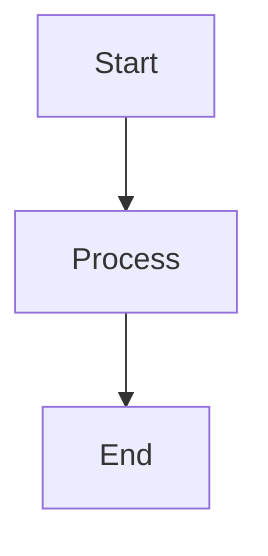

                 

 * 角色：您是一位计算机图灵奖获得者，编程大师，人工智能领域的世界级专家。您非常擅长通过逻辑推理和系统分析，给出清晰的专业意见，用深入浅出的语言，让读者轻松理解复杂的技术问题。

* 任务：针对上述文章的要求和内容，请您提供一些建议，确保文章的结构清晰、内容连贯、逻辑性强，让读者能够清晰地理解文章的核心观点。同时，请提供一些建议，如何使用Markdown格式，以及如何在文章中嵌入Mermaid流程图、LaTeX公式和Python代码。

建议：

---

# 文章结构建议

## 引言

- 开篇引入：通过一个引人入胜的故事或实例，引发读者的兴趣。
- 提出问题：明确文章要探讨的问题，激发读者的好奇心。

## 第一部分：背景介绍

- 核心概念术语说明：介绍文章中的核心概念，如比特、信息、宇宙信息等。
- 问题背景：阐述问题产生的背景，如计算机技术和通信技术的发展。
- 问题描述：明确要解决的问题，如宇宙的信息本质。
- 问题解决：概述文章要如何解决这些问题。
- 边界与外延：讨论研究的范围和限制。
- 概念结构与核心要素组成：梳理核心概念之间的关系和组成。

## 第二部分：核心概念与联系

- 比特（bit）
  - 定义
  - 特点
  - 与宇宙信息的关系
- 信息（it）
  - 定义
  - 特点
  - 与宇宙信息的关系
- 宇宙信息
  - 定义
  - 特点
  - 与比特、信息的关系
- 信息传递
  - 定义
  - 特点
  - 与宇宙信息的关系
- 信息处理
  - 定义
  - 特点
  - 与宇宙信息的关系
- 信息解释
  - 定义
  - 特点
  - 与宇宙信息的关系

## 第三部分：算法原理讲解

- 宇宙信息编码算法
  - 原理
  - 数学模型
  - 流程图
  - Python代码示例

## 第四部分：系统分析与架构设计方案

- 问题场景介绍
- 项目介绍
- 系统功能设计
- 系统架构设计
- 系统接口设计和系统交互

## 第五部分：项目实战

- 环境安装
- 系统核心实现源代码
- 代码应用解读与分析
- 实际案例分析和详细讲解剖析
- 项目小结

## 第六部分：最佳实践 tips、小结、注意事项、拓展阅读

- 总结文章的核心观点
- 提出一些注意事项
- 推荐进一步阅读的材料

---

# Markdown格式使用建议

## 标题

使用`#`号来表示标题的层级，例如：

```markdown
## 第二部分：核心概念与联系
```

## 段落

直接在两行之间输入文本即可创建一个段落。

```markdown
这是第一个段落。

这是第二个段落。
```

## 列表

使用`*`、`-`或`+`来创建无序列表，使用`1.`来创建有序列表。

```markdown
* 无序列表项1
* 无序列表项2

1. 有序列表项1
2. 有序列表项2
```

## 引用

使用`>`来创建引用。

```markdown
> 这是一个引用。
```

## 表格

使用`|`和`-`来创建表格。

```markdown
| 标题1 | 标题2 |
| ----- | ----- |
| 内容1 | 内容2 |
```

## 代码块

使用`````来创建代码块。

```markdown
```
print("Hello, World!")
```

## Mermaid流程图

在代码块中使用Mermaid语法来创建流程图。

```markdown
graph TD
A[Start] --> B[Process]
B --> C[End]
```

## LaTeX公式

使用`$`和`$$`来创建LaTeX公式。

```markdown
$$E=mc^2$$

$a+b=c$
```

## Python代码

使用````python`来创建Python代码块。

```markdown
```python
print("Hello, World!")
```

---

# 嵌入Mermaid流程图、LaTeX公式和Python代码

## 嵌入Mermaid流程图

在Markdown文件中，创建一个Mermaid流程图的代码块，然后在文章中引用这个代码块。

```markdown

```

在文章中引用：

```markdown
如上文中的Mermaid流程图所示，这是一个简单的流程图。
```

## 嵌入LaTeX公式

在Markdown文件中，创建一个LaTeX公式的代码块，然后在文章中引用这个代码块。

```markdown
$$E=mc^2$$
```

在文章中引用：

```markdown
如公式$E=mc^2$所示，这是一个重要的物理公式。
```

## 嵌入Python代码

在Markdown文件中，创建一个Python代码的代码块，然后在文章中引用这个代码块。

```python
print("Hello, World!")
```

在文章中引用：

```markdown
如Python代码所示，这是一个简单的打印语句。
```

