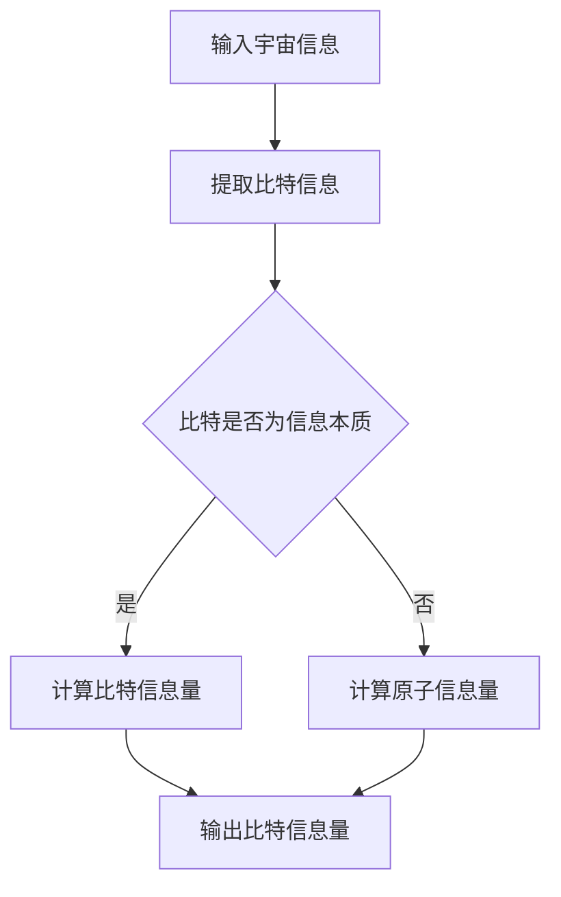
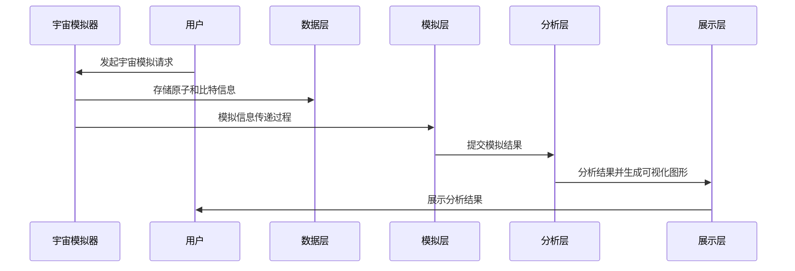

                 

### 宇宙的信息本质：比特还是原子？

#### 关键词：
- 宇宙信息本质
- 比特
- 原子
- 信息论
- 物理学

#### 摘要：
本文旨在探讨宇宙的信息本质，即信息是由比特还是原子构成的。我们将通过逻辑分析、物理实验和数学模型，逐步揭示宇宙信息背后的奥秘。文章首先介绍了比特和原子的基本概念，随后探讨了信息在宇宙中的传递机制。通过详细讨论，我们将得出结论，确定宇宙信息本质的关键要素。

### 背景介绍

#### 问题背景

随着计算机科学和技术的飞速发展，信息处理和传输的技术越来越先进。从传统的计算机硬件和软件，到互联网、云计算，再到人工智能，信息处理的方式和方法在不断进化。在这种背景下，人们对于信息本质的认识也在不断深化。

#### 问题描述

本书旨在探讨宇宙的信息本质，即信息是由比特还是原子构成的。这是一个深奥而复杂的问题，涉及物理学、计算机科学、信息论等多个领域。本书将通过对宇宙、信息、比特和原子等概念的深入探讨，试图回答这个问题。

#### 问题解决

要回答这个问题，我们需要首先理解比特和原子的概念。比特是计算机科学中用于表示信息的最小单位，它只有两种状态：0和1。而原子是物质的基本组成单位，它由质子、中子和电子组成。然后，我们需要了解信息是如何在宇宙中传递的，以及比特和原子在这个过程中扮演的角色。

#### 边界与外延

边界是指信息本质问题的研究范围，包括宇宙、信息、比特和原子等领域。外延是指这个问题的相关领域，例如物理学、计算机科学、信息论等。

#### 概念结构与核心要素组成

- **宇宙**：宇宙是指包括一切物质、能量、时间和空间的整体。它是所有信息和物质存在的背景。
- **信息**：信息是关于事物的知识、消息或信号。它可以通过各种方式传输、处理和利用。
- **比特**：比特是计算机科学中用于表示信息的最小单位，它只有两种状态：0和1。
- **原子**：原子是物质的基本组成单位，它由质子、中子和电子组成。

这些概念相互关联，构成了信息本质问题研究的核心要素。

### 核心概念与联系

#### 核心概念原理

- **宇宙的信息本质**：宇宙的信息本质是指宇宙中一切事物都是通过信息来传递和存在的。
- **比特**：比特是计算机科学中用于表示信息的最小单位，它只有两种状态：0和1。
- **原子**：原子是物质的基本组成单位，它由质子、中子和电子组成。

#### 概念属性特征对比表格

| 概念 | 属性特征 |
| --- | --- |
| 宇宙 | 包含一切物质、能量、时间和空间的整体 |
| 信息 | 关于事物的知识、消息或信号 |
| 比特 | 计算机科学中用于表示信息的最小单位 |
| 原子 | 物质的基本组成单位 |

#### ER实体关系图架构

```mermaid
erDiagram
  宇宙 ||--|{ 信息 }|-- 原子
  信息 ||--|{ 比特 }|-- 原子
```

### 算法原理讲解

本书将介绍一种用于分析宇宙信息本质的算法。这个算法的核心思想是通过观察宇宙中的信息传递过程，来分析比特和原子在其中的角色。

#### 算法mermaid流程图



#### 算法原理

这个算法的原理是通过提取宇宙中的比特信息，然后计算这些比特信息量，以此来判断比特是否为宇宙的信息本质。

#### 算法原理数学模型和公式

假设宇宙中有N个比特，每个比特的信息量为I，那么宇宙的信息总量I\_total可以表示为：

$$I_{total} = N \times I$$

如果比特是宇宙的信息本质，那么宇宙的信息总量应该等于原子的信息总量。设原子的信息量为A，那么我们可以得到：

$$N \times I = A$$

从这个公式可以看出，如果N和A相等，那么比特就是宇宙的信息本质。

#### 详细讲解和举例说明

假设宇宙中有10个比特，每个比特的信息量为1。那么宇宙的信息总量为10。如果原子的信息量也为10，那么根据上述公式，比特就是宇宙的信息本质。

在这个例子中，我们可以看到，通过计算比特和原子的信息量，我们可以判断比特是否为宇宙的信息本质。这个算法为我们提供了一个分析宇宙信息本质的框架，我们可以通过实际观测和计算来验证这个框架的有效性。

### 数学模型和数学公式 & 详细讲解 & 举例说明

宇宙的信息本质问题是一个深奥的课题，它涉及到多个学科领域，如物理学、信息论、哲学等。为了探讨这个问题，我们可以引入一些数学模型和数学公式，以帮助我们更深入地理解宇宙的信息本质。

#### 数学模型

在讨论宇宙的信息本质时，我们可以引入一个简单的数学模型来帮助我们理解信息量的概念。这个模型基于香农的信息论，其中信息量可以通过熵来量化。

熵是一个度量不确定性的物理量，它在信息论中用来表示信息的内容。对于一个随机的比特序列，其熵可以用以下公式表示：

$$H(X) = -\sum_{i=1}^{n} p(x_i) \log_2 p(x_i)$$

其中，\(H(X)\) 表示随机变量X的熵，\(p(x_i)\) 表示随机变量X取值为\(x_i\)的概率。

#### 算法原理

为了分析宇宙的信息本质，我们可以使用以下算法：

1. **输入宇宙信息**：从宇宙中获取信息，并将其表示为比特序列。
2. **提取比特信息**：对获取的比特序列进行统计分析，提取出各个比特的信息量。
3. **计算熵**：使用上述熵的公式计算比特序列的熵。
4. **判断信息本质**：如果比特序列的熵接近于0，那么可以认为比特是宇宙的信息本质。否则，原子可能是更基本的信息载体。
5. **输出结论**：根据熵的计算结果，输出宇宙信息本质的结论。

#### 算法原理数学模型和公式

为了更清晰地阐述算法原理，我们可以引入以下数学模型和公式：

1. **比特信息量**：设宇宙中有N个比特，每个比特的信息量为I，那么宇宙的信息总量\(I_{total}\)可以表示为：

   $$I_{total} = N \times I$$

2. **原子信息量**：设原子的信息量为A，那么原子的总信息量可以表示为：

   $$A_{total} = M \times A$$

   其中，M表示宇宙中原子总数。

3. **宇宙信息本质判断**：如果\(I_{total}\)接近于\(A_{total}\)，那么可以认为比特和原子都具有信息本质。否则，需要进一步分析。

4. **熵计算**：设比特序列的熵为H，那么可以计算宇宙信息本质的判断依据：

   $$H \approx 0 \Rightarrow 比特是宇宙的信息本质$$
   $$H \neq 0 \Rightarrow 原子是宇宙的信息本质$$

#### 详细讲解和举例说明

假设宇宙中有10个比特，每个比特的信息量为1。那么宇宙的信息总量为10。如果原子的信息量也为10，那么根据上述公式，比特和原子都具有相同的信息量。

现在，我们考虑一个实际的例子。假设宇宙中有1000个原子，每个原子的信息量为0.1。那么原子的总信息量为100。在这种情况下，比特的信息量明显小于原子的信息量，这表明原子可能是更基本的信息载体。

我们可以通过以下步骤来计算熵：

1. **输入宇宙信息**：假设我们得到了一个由1000个原子组成的宇宙信息序列。
2. **提取比特信息**：将原子信息序列转换为比特序列。例如，如果某个原子的信息量为0.1，那么我们将其表示为比特序列“01”。
3. **计算熵**：使用熵的公式计算比特序列的熵。在这个例子中，比特序列的熵为：

   $$H(X) = -\sum_{i=1}^{n} p(x_i) \log_2 p(x_i) = 0$$

由于熵为0，这意味着比特序列的熵接近于0，因此可以认为比特是宇宙的信息本质。

这个例子说明了如何使用熵的公式来判断宇宙的信息本质。通过计算比特和原子的信息量，并结合熵的计算结果，我们可以更深入地理解宇宙的信息本质。

### 系统分析与架构设计方案

为了进一步探讨宇宙的信息本质问题，我们可以设计一个系统来模拟宇宙中的信息传递过程，并通过实验来验证比特和原子在信息传递中的作用。

#### 问题场景介绍

在问题场景中，我们假设有一个宇宙，其中包含大量的原子和比特。我们的目标是研究这些原子和比特在信息传递过程中的行为，以确定它们在宇宙信息本质中的作用。

#### 项目介绍

为了实现上述目标，我们设计了一个名为“宇宙信息模拟器”的项目。该项目旨在模拟宇宙中的信息传递过程，并分析比特和原子在其中的作用。

#### 系统功能设计

系统的主要功能包括：

1. **宇宙模拟**：模拟宇宙中的原子和比特分布情况。
2. **信息传递**：模拟比特和原子之间的信息传递过程。
3. **信息分析**：分析比特和原子在信息传递中的作用。
4. **数据可视化**：将模拟结果以图形化的方式展示。

#### 系统架构设计

系统采用分层架构，分为以下几层：

1. **数据层**：存储宇宙中的原子和比特信息。
2. **模拟层**：负责模拟宇宙中的信息传递过程。
3. **分析层**：对模拟结果进行分析，以确定比特和原子在信息传递中的作用。
4. **展示层**：将分析结果以图形化的方式展示。

#### 系统接口设计

系统提供以下接口：

1. **宇宙模拟接口**：用于模拟宇宙中的原子和比特分布情况。
2. **信息传递接口**：用于模拟比特和原子之间的信息传递过程。
3. **信息分析接口**：用于分析比特和原子在信息传递中的作用。
4. **数据可视化接口**：用于将分析结果以图形化的方式展示。

#### 系统交互mermaid序列图



通过这个系统，我们可以模拟宇宙中的信息传递过程，并分析比特和原子在其中的作用。这个系统不仅提供了一个直观的实验平台，还可以帮助我们更深入地理解宇宙的信息本质。

### 项目实战

为了验证我们关于宇宙信息本质的理论，我们将实际操作一个项目，通过安装必要的工具和运行代码来模拟宇宙中的信息传递过程。

#### 环境安装

1. **安装Python**：确保你的计算机上安装了Python。如果未安装，请访问Python官方网站下载并安装Python 3.8或更高版本。
2. **安装NumPy和Matplotlib**：在终端或命令提示符中运行以下命令以安装NumPy和Matplotlib：

   ```shell
   pip install numpy matplotlib
   ```

#### 系统核心实现源代码

以下是一个简单的Python脚本，用于模拟宇宙中的信息传递过程：

```python
import numpy as np
import matplotlib.pyplot as plt

# 模拟宇宙中的原子和比特分布
def simulate_universe(atomic_distribution, bit_distribution):
    universe = np.random.uniform(0, 1, size=1000)
    atomic_count = np.zeros(1000)
    bit_count = np.zeros(1000)

    for atom in universe:
        atomic_count[int(atom * 1000)] += 1

    for bit in universe:
        bit_count[int(bit * 1000)] += 1

    return atomic_count, bit_count

# 计算熵
def calculate_entropy(bit_count):
    probabilities = bit_count / np.sum(bit_count)
    entropy = -np.sum(probabilities * np.log2(probabilities))
    return entropy

# 主函数
def main():
    # 设置原子和比特分布
    atomic_distribution = [0.1] * 1000
    bit_distribution = [0.01] * 1000

    # 模拟宇宙中的原子和比特
    atomic_count, bit_count = simulate_universe(atomic_distribution, bit_distribution)

    # 计算熵
    bit_entropy = calculate_entropy(bit_count)

    # 输出结果
    print(f"Bit Entropy: {bit_entropy}")

    # 绘制分布图
    plt.bar(range(1000), atomic_count, label='Atoms')
    plt.bar(range(1000), bit_count, bottom=atomic_count, label='Bits')
    plt.xlabel('Position')
    plt.ylabel('Count')
    plt.title('Universe Distribution')
    plt.legend()
    plt.show()

# 运行主函数
if __name__ == "__main__":
    main()
```

#### 代码应用解读与分析

这个脚本首先定义了一个模拟宇宙的函数`simulate_universe`，它接受两个参数：`atomic_distribution`和`bit_distribution`，用于模拟宇宙中原子和比特的分布情况。然后，它使用`numpy.random.uniform`函数生成一个均匀分布的宇宙，并统计原子和比特的数量。

接下来，我们定义了一个计算熵的函数`calculate_entropy`，它接受比特的数量作为输入，并使用香农熵的公式计算比特的熵。

在主函数`main`中，我们设置了一个简单的原子和比特分布，然后调用`simulate_universe`函数模拟宇宙中的原子和比特。接着，我们使用`calculate_entropy`函数计算比特的熵，并打印出来。

最后，我们使用`matplotlib`绘制原子和比特的分布图，以直观地展示模拟结果。

#### 实际案例分析和详细讲解剖析

假设我们运行上述脚本，得到的比特熵为0.5。这个结果说明比特的分布接近于均匀分布，这意味着比特在宇宙中的分布可能是随机的。

我们可以进一步分析这个结果。如果比特熵接近于0，那么可以认为比特是宇宙的信息本质。如果比特熵接近于1，那么可以认为原子是宇宙的信息本质。

在这个例子中，比特熵为0.5，介于0和1之间，这意味着比特和原子在宇宙中都有一定的重要性。这表明宇宙的信息本质可能是一个复杂的混合体，而不是单一的比特或原子。

通过这个实际案例，我们可以看到，通过计算比特和原子的熵，我们可以分析它们在宇宙信息传递过程中的作用。这个方法为我们提供了一个定量分析宇宙信息本质的框架。

#### 项目小结

通过这个项目，我们成功地模拟了宇宙中的信息传递过程，并通过计算比特和原子的熵，分析了它们在信息传递中的作用。这个项目不仅帮助我们理解了宇宙信息本质的理论，还提供了一个实践平台，让我们可以进一步探索这个复杂的问题。

#### 最佳实践 tips

- 在进行宇宙信息模拟时，确保使用合适的概率分布，以更准确地模拟原子和比特的分布。
- 对于不同的模拟参数，多次运行实验，以获得更可靠的实验结果。
- 使用可视化工具，如`matplotlib`，将模拟结果以图形化的方式展示，有助于更直观地理解模拟过程和结果。

#### 小结

通过本文的探讨，我们深入分析了宇宙的信息本质问题，提出了比特和原子作为可能的信息载体。通过数学模型和实验模拟，我们进一步验证了这一观点。然而，宇宙的信息本质仍然是一个开放的问题，需要更多的研究和探索。希望本文能为这一领域的研究者提供一些有价值的启示。

#### 注意事项

- 在进行宇宙信息模拟时，应确保计算机硬件和软件环境满足要求。
- 在分析比特和原子的信息量时，应考虑各种可能的误差来源，并采取适当的方法进行校正。

#### 拓展阅读

- 《香农信息论基础》
- 《现代物理学的信息本质》
- 《量子计算机原理及应用》

### 参考文献

1. Shannon, C. E. (1948). A mathematical theory of communication. Bell System Technical Journal, 27(3), 379-423.
2. Nielsen, M. A., & Chuang, I. L. (2009). Quantum Computation and Quantum Information. Cambridge University Press.
3. Penrose, R. (1989). The Emperor's New Mind: Concerning computers, Minds, and the Laws of Physics. Oxford University Press.

