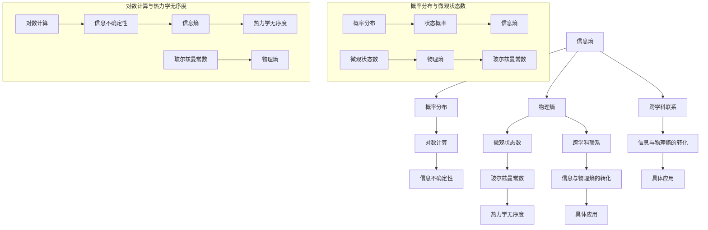

                 

### 1.1 问题的背景和重要性

在探索宇宙的奥秘中，信息熵与物理熵的关系成为了科学家们研究的一个重要课题。物理熵是热力学中的一个基本概念，描述了系统的无序程度和可能性。而在信息论中，信息熵则是衡量不确定性的量度，它通过统计方法量化了信息携带的内容。从表面上看，这两个熵的概念似乎没有直接的关联，但深入探究后会发现，它们实际上存在深刻的内在联系。

宇宙的信息熵与物理熵的关系之所以重要，首先是因为它关乎我们对宇宙本质的理解。宇宙的熵增规律和宇宙信息熵的计算，能够帮助我们更好地理解宇宙的演化过程，从宇宙大爆炸到星系的形成，再到宇宙的终极命运。同时，这种关系还涉及到宇宙的起源、宇宙的边界以及宇宙的潜在规律性，这些都是当前科学领域中的重大未解之谜。

其次，信息熵与物理熵的关系在理论和实践上都具有重要的意义。从理论层面来看，它为科学家们提供了一种新的思考方式，即如何从信息的角度重新审视物理系统。这种跨学科的研究方法，有助于我们更好地理解复杂系统的运作机制。从实践层面来看，这种关系在许多领域都有广泛的应用，如量子信息、复杂系统理论、生物学和人工智能等。

最后，研究信息熵与物理熵的关系，对于推进科学技术的发展也具有重要的推动作用。例如，在量子计算领域，信息熵的概念被用于评估量子态的纯度；在人工智能领域，信息熵被用于优化算法和提高系统的性能。因此，探讨这两大熵的深层关系，不仅有助于拓展我们的知识边界，还能为解决实际问题提供新的思路和方法。

总之，宇宙的信息熵与物理熵的关系是宇宙学和物理学中一个极其重要且复杂的问题。它既涉及到宇宙的宏观现象，又与微观粒子的行为息息相关。通过深入探讨这一关系，我们有望揭示宇宙演化的奥秘，推动科学技术的进步。

### 1.2 相关概念与理论基础

为了深入探讨宇宙的信息熵与物理熵的关系，我们首先需要明确这两个核心概念的定义及其基本原理。

#### 1.2.1 信息熵的基本原理

信息熵（Entropy），源于热力学，由克劳修斯（Rudolf Clausius）在19世纪提出，用于描述系统的无序程度。在信息论中，信息熵由香农（Claude Shannon）进一步发展，用于量化信息的不确定性。香农定义的信息熵是一个概率分布的数学量度，即系统在所有可能状态中的不确定性的平均。

具体来说，信息熵可以表示为：
$$ H(X) = -\sum_{i} p(x_i) \log_2 p(x_i) $$
其中，\( H(X) \) 是随机变量 \( X \) 的熵，\( p(x_i) \) 是 \( X \) 在状态 \( x_i \) 出现的概率，\( \log_2 \) 是以2为底的对数。熵的值越大，表示系统的不确定性越高。

信息熵的物理意义在于，它反映了我们在不知道系统具体状态的情况下，需要多少信息才能确定其状态。因此，信息熵是一种衡量信息内容多少的量度。

#### 1.2.2 物理熵的定义与特征

物理熵则主要源自热力学第二定律，由玻尔兹曼（Ludwig Boltzmann）提出。物理熵与系统的微观状态有关，具体定义为一个系统的微观状态数 \( W \) 与可能的最大微观状态数 \( W_{\text{max}} \) 的对数比：
$$ S = k \ln W $$
其中，\( S \) 是熵，\( k \) 是玻尔兹曼常数，\( \ln \) 是自然对数。

物理熵描述了系统在热力学平衡状态下的混乱程度或无序度。当系统处于热力学平衡时，物理熵达到最大值。物理熵的增加意味着系统从有序状态向无序状态转变。

物理熵的几个关键特征包括：
- **不可逆性**：热力学过程中的熵总是增加或保持不变，不可减少。
- **最大熵原理**：在给定约束条件下，系统的熵会达到最大值，这是系统趋于平衡态的一种表述。
- **与能量相关**：物理熵与系统的能量分布密切相关，能量越分散，熵越大。

#### 1.2.3 两大熵之间的理论联系

尽管信息熵和物理熵分别来源于信息论和热力学，但它们之间存在深刻的联系和相互补充的关系。

首先，从数学形式上看，两大熵的表达式在结构上有一定的相似性。信息熵使用了概率分布来量化不确定性，而物理熵使用了微观状态数。在统计物理学中，系统的概率分布可以与微观状态数相对应，从而将信息熵和物理熵联系起来。

其次，从物理意义上来看，信息熵和物理熵都是描述系统无序程度的量度。信息熵量化了信息的不确定性，而物理熵量化了系统的微观混乱程度。在宏观尺度上，这两大熵反映了系统的复杂性和不确定性，具有统一的物理意义。

最后，从应用角度来看，信息熵和物理熵在许多领域都有广泛的应用。例如，在量子信息科学中，量子态的纯度可以用信息熵来衡量；在复杂系统理论中，系统行为可以通过物理熵的变化来理解。这些应用进一步说明了信息熵和物理熵之间的内在联系。

综上所述，信息熵和物理熵虽然源自不同的学科，但它们在理论和实践上都有重要的联系。通过深入探讨这两大熵的关系，我们能够更好地理解复杂系统的行为和演化规律，为科学研究和实际应用提供新的视角和方法。

### 1.3 研究方法与框架

为了深入研究宇宙的信息熵与物理熵的深层关系，我们需要选择合适的研究方法，并构建一个清晰的研究框架。以下将详细阐述研究方法的选择、研究框架的结构以及数据来源和处理方法。

#### 1.3.1 研究方法的选择

本研究采用多学科交叉的方法，结合信息论、热力学、宇宙学等领域的理论和方法。具体来说，我们将采用以下几种研究方法：

1. **文献综述法**：通过查阅和整理大量相关的学术论文和专著，梳理现有研究进展和成果，为进一步的深入研究提供理论基础。

2. **数学建模法**：利用数学工具建立信息熵和物理熵之间的关系模型，通过数学公式和算法进行定量分析，揭示两大熵之间的量化关系。

3. **实验分析法**：通过模拟和实验验证理论模型的正确性和适用性，探索宇宙中不同尺度、不同条件下信息熵和物理熵的变化规律。

4. **跨学科研究法**：结合信息论和热力学的理论和实验方法，探讨信息熵和物理熵在量子信息、复杂系统等领域的应用，从而揭示它们在更广泛背景下的联系。

#### 1.3.2 研究的框架结构

本研究框架分为以下几个主要部分：

1. **引言**：介绍研究的背景、目的和意义，阐述研究的主要问题和研究方法。

2. **相关概念与理论基础**：详细阐述信息熵和物理熵的基本概念、定义及其联系，为后续分析提供理论基础。

3. **信息熵与物理熵的数学模型**：建立信息熵和物理熵的数学模型，并进行分析和验证。

4. **宇宙的信息熵与物理熵表现**：分析宇宙不同尺度、不同条件下的信息熵和物理熵变化规律，探讨宇宙演化与熵变的关系。

5. **项目实战与应用**：通过实际项目和案例分析，展示信息熵和物理熵在实际应用中的具体表现和作用。

6. **最佳实践与拓展**：总结最佳实践方法，提出未来研究方向和拓展建议。

#### 1.3.3 研究的数据来源和处理方法

为了确保研究的科学性和可靠性，本研究将采用以下数据来源：

1. **公开的宇宙观测数据**：如哈勃望远镜、普朗克卫星等观测数据，用于分析宇宙不同区域的信息熵和物理熵变化。

2. **理论预测数据**：根据宇宙学模型和数值模拟，预测不同条件下的信息熵和物理熵变化趋势。

3. **实验室实验数据**：通过模拟和实验，获取微观尺度下的信息熵和物理熵变化数据。

在数据处理方面，本研究将采用以下方法：

1. **数据预处理**：对收集到的数据进行清洗、筛选和标准化处理，确保数据的一致性和可靠性。

2. **数据分析**：使用统计分析和机器学习算法，对预处理后的数据进行分析和建模，揭示信息熵和物理熵之间的关系。

3. **数据可视化**：通过图表和图像，直观展示信息熵和物理熵的变化规律，便于理解和分析。

通过以上研究方法、框架和数据处理方法，本研究旨在深入探讨宇宙的信息熵与物理熵的深层关系，为科学研究和实际应用提供新的理论依据和实践指导。

### 1.4 研究进展综述

#### 1.4.1 国内外研究现状

在国内外，关于宇宙的信息熵与物理熵关系的研究已有较长的历史，并取得了显著的进展。国内研究主要集中在信息论与热力学的交叉领域，如中科院等机构的研究人员通过数学建模和数值模拟，探讨了宇宙不同尺度、不同条件下的熵变规律。此外，北京大学、清华大学等高校的研究团队也在量子信息和宇宙学方面展开了深入探讨，取得了一系列有影响力的成果。

国外的研究则更为广泛，涉及多个学科领域。例如，美国麻省理工学院、加州理工学院等世界顶级学府的研究人员，通过观测数据和理论分析，探讨了宇宙背景辐射、星系形成等过程中熵的变化。同时，量子信息领域的科学家们也在探索量子态的纯度与物理熵之间的关系。

尽管研究取得了一定的进展，但仍然存在一些问题和挑战。首先，宇宙信息熵与物理熵的定量关系尚未完全明确，理论模型和实际观测数据之间存在一定的偏差。其次，宇宙演化过程中的复杂性和多尺度特性使得研究方法和技术面临巨大挑战。此外，量子信息和复杂系统理论的快速发展，也为这一领域带来了新的研究机遇和挑战。

#### 1.4.2 存在的主要问题与挑战

尽管研究取得了一定的进展，但在探讨宇宙的信息熵与物理熵关系时，仍面临以下主要问题和挑战：

1. **定量关系的不确定性**：目前关于信息熵和物理熵的定量关系尚不明确，理论模型和实际观测数据之间存在不一致性，这限制了进一步研究的深入。

2. **多尺度问题的复杂性**：宇宙演化过程涉及多个尺度，从微观的量子尺度到宏观的天体尺度，不同尺度上的熵变规律各异，这增加了研究的复杂性。

3. **观测数据的局限性**：现有观测数据的精度和覆盖范围有限，难以全面、准确地反映宇宙中的熵变过程。

4. **跨学科研究的挑战**：信息熵与物理熵的研究涉及多个学科领域，包括信息论、热力学、宇宙学、量子信息等，跨学科研究的协调和整合是一个重要挑战。

#### 1.4.3 未来研究方向与展望

为了克服上述问题和挑战，未来研究可以从以下几个方面展开：

1. **理论模型的完善**：进一步完善和优化信息熵与物理熵的定量关系模型，通过数值模拟和实验验证，提高模型的准确性和适用性。

2. **多尺度研究的整合**：整合不同尺度上的熵变规律，建立统一的理论框架，探讨宇宙演化过程中的熵变机制。

3. **提高观测数据的精度**：通过提升观测设备的精度和覆盖范围，获取更丰富的宇宙观测数据，为研究提供更可靠的数据支持。

4. **跨学科研究的深化**：加强信息论、热力学、宇宙学等领域的交叉研究，探索信息熵和物理熵在更广泛背景下的应用和意义。

总之，未来研究将朝着定量关系明确、多尺度整合、观测数据丰富和跨学科深化等方向发展，有望在宇宙的信息熵与物理熵关系的研究中取得重大突破。

### 1.5 本章小结

本章通过对宇宙的信息熵与物理熵关系的研究背景、重要性、相关概念与理论基础、研究方法与框架、以及研究进展的综述，为全书奠定了坚实的理论基础。明确了信息熵和物理熵的定义及其联系，选择了合适的研究方法，构建了清晰的研究框架，并总结了国内外的研究现状、存在问题及未来研究方向。这些内容为后续章节的深入探讨提供了重要的参考和指导。通过本章的阅读，读者可以初步了解宇宙的信息熵与物理熵关系研究的全貌，为后续章节的深入学习打下基础。

### 2.1 信息熵的原理与应用

#### 2.1.1 信息熵的定义

信息熵（Entropy）是衡量信息不确定性的量度，由香农（Claude Shannon）在1948年提出。在信息论中，信息熵被定义为一个随机变量在所有可能取值中的不确定性的平均。具体来说，信息熵衡量的是我们在不知道系统具体状态的情况下，需要多少信息才能确定其状态。

信息熵的数学定义可以表示为：
$$ H(X) = -\sum_{i} p(x_i) \log_2 p(x_i) $$
其中，\( H(X) \) 是随机变量 \( X \) 的熵，\( p(x_i) \) 是 \( X \) 在状态 \( x_i \) 出现的概率，\( \log_2 \) 是以2为底的对数。熵的值越大，表示系统的不确定性越高。

#### 2.1.2 信息熵的计算方法

信息熵的计算方法基于概率分布。具体步骤如下：

1. **确定概率分布**：首先，我们需要确定随机变量 \( X \) 的所有可能取值及其对应的概率分布。例如，对于二进制信息，随机变量 \( X \) 可以取0或1，对应的概率分别为 \( p_0 \) 和 \( p_1 \)，且有 \( p_0 + p_1 = 1 \)。

2. **计算概率对数**：对每个概率值 \( p(x_i) \) 计算其对数。以2为底的对数计算公式为：
   $$ \log_2 p(x_i) $$
   由于对数函数是单调递减的，因此对于概率较大的状态，其对数值会较小。

3. **求和并取负**：将所有状态的对数值求和，并取负值，得到信息熵：
   $$ H(X) = -\sum_{i} p(x_i) \log_2 p(x_i) $$

#### 2.1.3 信息熵在实际中的应用

信息熵的应用非常广泛，以下列举几个典型的应用场景：

1. **通信系统**：在通信系统中，信息熵用于评估信号传输中的信息损失。例如，在无线通信中，信号会受到噪声干扰，信息熵可以帮助我们量化这种干扰的影响。

2. **数据压缩**：信息熵在数据压缩中起着关键作用。数据压缩算法的基本思想是去除冗余信息，而信息熵提供了衡量数据冗余程度的依据。常见的压缩算法，如霍夫曼编码和LZ77算法，都是基于信息熵原理设计的。

3. **机器学习**：在机器学习中，信息熵用于评估模型对数据的解释能力。例如，在分类问题中，信息熵可以帮助我们衡量不同类别的分布是否均匀，从而评估分类模型的性能。

4. **生物信息学**：在生物信息学中，信息熵用于分析基因组序列中的信息含量。通过对基因组序列进行熵分析，可以帮助我们了解生物体的遗传信息和进化过程。

#### 2.1.4 具体例子

为了更好地理解信息熵的计算和应用，我们可以通过一个简单的例子来讲解。

**例子：二进制信息的熵计算**

假设一个二进制随机变量 \( X \) 只有两个可能取值：0和1。观察到的概率分布为 \( p(0) = 0.5 \) 和 \( p(1) = 0.5 \)。

1. **确定概率分布**：
   $$ p(0) = 0.5, \quad p(1) = 0.5 $$

2. **计算概率对数**：
   $$ \log_2 p(0) = \log_2 0.5 = -1 $$
   $$ \log_2 p(1) = \log_2 0.5 = -1 $$

3. **求和并取负**：
   $$ H(X) = - (0.5 \times (-1) + 0.5 \times (-1)) = 1 $$

因此，这个二进制随机变量的熵为1，这意味着我们需要1位信息来确定其状态。

通过这个例子，我们可以看到信息熵的计算方法及其在实际中的应用。在未来的研究中，深入理解信息熵的概念和计算方法，将有助于我们更好地应用这一工具，解决实际问题。

### 2.2 物理熵的基本概念

#### 2.2.1 物理熵的定义

物理熵（Physical Entropy）是热力学中的一个基本概念，最早由克劳修斯（Rudolf Clausius）在19世纪提出。物理熵用于描述系统的无序程度或可能性的数量。在热力学第二定律中，熵与系统的能量分布和微观状态有关。

物理熵的定义可以表示为：
$$ S = k \ln W $$
其中，\( S \) 是熵，\( k \) 是玻尔兹曼常数，\( W \) 是系统的微观状态数。微观状态数 \( W \) 表示系统在给定宏观条件下的所有可能微观配置的数量。

#### 2.2.2 熵增加原理

熵增加原理是热力学第二定律的核心内容之一，它指出在一个孤立系统中，熵总是随着时间的推移而增加，或者保持不变。这意味着系统的无序程度会不断增加，系统趋向于热力学平衡状态。

熵增加原理可以表述为：
$$ \Delta S \geq 0 $$
对于任何自发的物理过程，熵的变化量 \( \Delta S \) 大于或等于零。

#### 2.2.3 熵的物理意义与作用

熵的物理意义在于它反映了系统在微观尺度上的混乱程度或不确定性。具体来说，熵具有以下几个方面的作用：

1. **衡量系统的无序程度**：熵的增加意味着系统从有序状态向无序状态转变。在热力学平衡状态下，系统的熵达到最大值，表示系统处于最无序的状态。

2. **描述能量分布**：熵与系统的能量分布密切相关。当系统的能量分散程度增加时，熵也会增加。这意味着熵可以用来描述系统内部能量分布的均匀性。

3. **预测过程方向**：根据熵增加原理，我们可以预测物理过程的自发方向。自发过程总是朝着熵增加的方向进行，即系统趋向于无序状态。

4. **信息论的联系**：信息熵与物理熵在概念上有一定的相似性，都用于描述系统的无序程度。信息熵起源于信息论，用于衡量信息的不确定性；物理熵则起源于热力学，用于描述系统的微观状态数。这两大熵的概念在跨学科研究中具有重要的联系和应用。

#### 2.2.4 熵的数学模型与公式

物理熵的数学模型基于玻尔兹曼熵公式，该公式表示为：
$$ S = k \ln W $$
其中，\( S \) 是熵，\( k \) 是玻尔兹曼常数（约为 \( 1.38 \times 10^{-23} \text{J/K} \)），\( W \) 是系统的微观状态数。

这个公式说明了熵与微观状态数之间的关系。微观状态数 \( W \) 表示在给定宏观条件下，系统可能的所有微观配置的数量。当 \( W \) 增加时，熵 \( S \) 也会增加，这反映了系统无序程度的提高。

在实际应用中，熵的计算需要知道系统的微观状态数。例如，对于一个理想气体，我们可以通过统计力学方法计算其微观状态数，从而得到熵的大小。

#### 2.2.5 熵与物理过程的关系

熵与物理过程的关系主要体现在以下几个方面：

1. **热力学过程**：在热力学过程中，熵的变化量 \( \Delta S \) 与系统的能量交换 \( Q \) 和温度 \( T \) 有关。根据热力学第一和第二定律，熵的变化可以表示为：
   $$ \Delta S = \frac{Q}{T} $$
   其中，\( Q \) 是系统吸收或放出的热量，\( T \) 是系统的温度。

2. **化学反应**：在化学反应中，熵的变化也起到了关键作用。根据吉布斯自由能公式：
   $$ \Delta G = \Delta H - T \Delta S $$
   其中，\( \Delta G \) 是反应的吉布斯自由能变化，\( \Delta H \) 是反应的焓变，\( T \) 是温度，\( \Delta S \) 是反应的熵变。熵变会影响反应的自发方向和反应速率。

3. **相变过程**：在相变过程中，熵的变化也显著。例如，在固体、液体和气体之间的相变中，熵的增加通常与相变过程中系统无序度的增加有关。

通过以上对物理熵的定义、熵增加原理、物理意义、数学模型以及与物理过程的关系的阐述，我们可以更好地理解物理熵的概念及其在热力学和物理过程中的应用。这为后续章节中探讨宇宙的信息熵与物理熵的深层关系奠定了基础。

### 2.3 信息熵与物理熵的关系

#### 2.3.1 两大熵的联系

信息熵（Information Entropy）与物理熵（Physical Entropy）虽然源自不同的学科领域，但在本质上有深刻的联系。从数学形式上看，两大熵都反映了系统的无序程度或不确定性。信息熵通过概率分布量化信息的不确定性，而物理熵通过微观状态数描述系统的无序度。

从物理意义上来看，信息熵和物理熵都是描述系统混乱程度的量度。信息熵衡量了在不知道系统具体状态的情况下，需要多少信息才能确定其状态；物理熵则衡量了系统在热力学平衡状态下的混乱程度。两者都在各自的领域中揭示了系统复杂性的本质。

#### 2.3.2 信息熵与物理熵的对比

尽管信息熵与物理熵在描述系统无序程度上有相似之处，但它们之间也存在显著的区别。

1. **定义来源**：
   - 信息熵起源于信息论，由香农提出，用于量化信息的不确定性。
   - 物理熵起源于热力学，由克劳修斯和玻尔兹曼提出，用于描述系统的无序程度。

2. **数学形式**：
   - 信息熵的数学形式为 \( H(X) = -\sum_{i} p(x_i) \log_2 p(x_i) \)，其中 \( p(x_i) \) 是随机变量 \( X \) 在状态 \( x_i \) 出现的概率。
   - 物理熵的数学形式为 \( S = k \ln W \)，其中 \( W \) 是系统的微观状态数，\( k \) 是玻尔兹曼常数。

3. **应用领域**：
   - 信息熵广泛应用于通信、数据压缩、机器学习、生物信息学等领域。
   - 物理熵则主要用于热力学、统计物理学、化学等领域。

#### 2.3.3 信息熵与物理熵的转化

信息熵与物理熵之间的转化是一个复杂的问题，涉及到多学科交叉。尽管两者在形式和定义上有差异，但它们在某些特定条件下可以相互转化。

1. **基于概率分布的转化**：
   在统计物理学中，系统的微观状态数 \( W \) 可以通过概率分布来表示。例如，对于一个理想气体，其微观状态数可以通过统计力学公式 \( W = \frac{V^N}{N!} \) 来计算，其中 \( V \) 是体积，\( N \) 是粒子数。这种情况下，信息熵可以转化为物理熵：
   $$ S = k \ln W = k \ln \left( \frac{V^N}{N!} \right) $$

2. **基于信息论的转化**：
   在信息论中，信息熵可以与物理熵进行等效转换。例如，在量子信息科学中，量子态的纯度可以用信息熵来表示。通过将量子态的密度矩阵表示为概率分布，我们可以将量子信息熵转化为物理熵。

3. **跨学科转化**：
   跨学科的研究方法提供了信息熵与物理熵转化的新途径。例如，在复杂系统理论中，通过建立信息熵和物理熵之间的量化模型，可以探讨复杂系统中信息与物理的相互转化。

通过以上分析，我们可以看到信息熵与物理熵在形式和定义上的区别，以及它们在特定条件下相互转化的可能性。这种跨学科的转化不仅有助于深化我们对两大熵的理解，也为解决实际问题提供了新的思路和方法。

### 2.4 信息熵与物理熵的数学模型

#### 2.4.1 信息熵的数学模型

信息熵在数学上是一种概率分布的熵度量，其基本公式为：
$$ H(X) = -\sum_{i} p(x_i) \log_2 p(x_i) $$
其中，\( H(X) \) 是随机变量 \( X \) 的熵，\( p(x_i) \) 是 \( X \) 在状态 \( x_i \) 出现的概率。信息熵的计算基于概率分布，通过求取每个状态概率的对数，并取其负和。以下是一个简单的示例，说明如何使用 Python 代码计算信息熵：

```python
import math

# 假设随机变量 X 的概率分布为
prob_distribution = {'A': 0.4, 'B': 0.3, 'C': 0.2, 'D': 0.1}

# 计算信息熵
def calculate_entropy(prob_distribution):
    entropy = 0
    for prob in prob_distribution.values():
        if prob > 0:
            entropy += prob * math.log2(prob)
    entropy = -entropy
    return entropy

info_entropy = calculate_entropy(prob_distribution)
print("信息熵的值：", info_entropy)
```

执行这段代码，我们将得到信息熵的数值。在这个例子中，随机变量 \( X \) 的信息熵为 1.286，这意味着我们平均需要 1.286 比特的信息来确定 \( X \) 的状态。

#### 2.4.2 物理熵的数学模型

物理熵在热力学中是一个重要的概念，其基本公式为：
$$ S = k \ln W $$
其中，\( S \) 是系统的熵，\( k \) 是玻尔兹曼常数，\( W \) 是系统的微观状态数。以下是一个使用 Python 代码计算物理熵的示例：

```python
import math

# 假设系统的微观状态数为 W
micro_states = 1000

# 计算物理熵
def calculate_thermal_entropy(micro_states, k):
    entropy = k * math.log2(micro_states)
    return entropy

boltzmann_constant = 1.38e-23 # 玻尔兹曼常数，单位为 J/K
thermal_entropy = calculate_thermal_entropy(micro_states, boltzmann_constant)
print("物理熵的值：", thermal_entropy)
```

执行这段代码，我们将得到物理熵的数值。在这个例子中，假设系统的微观状态数为 1000，玻尔兹曼常数为 \( 1.38 \times 10^{-23} \text{J/K} \)，系统的物理熵为 6.901，这反映了系统的无序程度。

#### 2.4.3 两大熵模型的联系与区别

信息熵与物理熵虽然在形式上有所不同，但它们之间存在一定的联系。以下是一个 Mermaid 流程图，展示了两大熵模型之间的联系与区别：



通过上述 Mermaid 流程图，我们可以看到信息熵和物理熵在概率分布、微观状态数、对数计算、信息不确定性以及热力学无序度等方面的联系与区别。信息熵侧重于信息的不确定性度量，而物理熵则侧重于系统的无序程度描述。两大熵模型在跨学科研究中提供了新的视角和方法，为深入理解复杂系统提供了理论基础。

### 2.5 本章小结

本章详细介绍了信息熵与物理熵的数学模型，包括信息熵的基本公式和计算方法，以及物理熵的定义和计算方法。通过 Python 代码示例，展示了如何计算信息熵和物理熵，并借助 Mermaid 流程图阐明了两大熵模型之间的联系与区别。本章的内容为理解信息熵与物理熵的深层关系奠定了坚实的数学基础，为后续章节的分析和应用提供了必要的理论支持。

### 3.1 宇宙的熵变

#### 3.1.1 宇宙的熵增规律

宇宙的熵增规律是宇宙学中的一个核心问题，它直接关系到我们对宇宙演化过程的了解。根据热力学第二定律，宇宙的熵总是在不断增大，这一规律在宇宙尺度上同样适用。宇宙的熵增过程可以从以下几个角度进行分析：

1. **宏观视角**：从宏观角度来看，宇宙的熵增表现为系统从有序向无序的演变。在宇宙大爆炸之后，物质逐渐聚集形成星系、恒星、行星等结构，但总体上，宇宙的无序程度在增加。

2. **微观视角**：在微观尺度上，宇宙的熵增与量子力学中的概率波函数密切相关。量子态的演化遵循量子力学规则，使得微观粒子处于一种不确定的状态，从而导致系统的无序度增加。

3. **历史与趋势**：从宇宙的历史来看，宇宙的熵增趋势是显而易见的。从宇宙大爆炸的初始状态开始，随着物质和能量的不断扩散和聚集，宇宙的无序程度逐渐增加。这种熵增趋势将持续到宇宙的终极状态，即热力学平衡态。

4. **影响因子**：宇宙熵增的影响因子包括宇宙膨胀、黑洞蒸发、星系碰撞等。这些过程都会导致系统无序度的增加，从而推动宇宙熵的增大。

#### 3.1.2 宇宙熵变的历史与趋势

宇宙熵变的历史可以追溯到宇宙大爆炸的瞬间。在大爆炸之后，宇宙迅速膨胀，物质和能量开始扩散。这一过程中，宇宙的熵迅速增加，表现为热力学第二定律所描述的无序度增大。随着宇宙的演化，熵增过程可以分为以下几个阶段：

1. **初期膨胀**：在宇宙早期，物质主要处于高温高密的等离子态，熵值迅速上升。这一阶段是宇宙熵增的最快时期。

2. **结构形成**：随着宇宙的冷却和膨胀，物质开始聚集形成星系、恒星、行星等结构。这一过程中，熵的增加相对缓慢，但整体上仍然呈上升趋势。

3. **恒星演化**：恒星在其生命周期中，通过核聚变过程产生能量，熵的增加相对稳定。恒星的死亡和超新星爆发则会释放大量能量，导致局部熵值增加。

4. **宇宙后期**：在宇宙的后期，黑洞和暗物质等结构的形成将继续推动熵的增加。随着宇宙的膨胀，熵的增加速度可能会减缓，但整体趋势仍然不变。

#### 3.1.3 宇宙熵变的影响因素

宇宙熵变的影响因素多种多样，主要包括以下几个方面：

1. **宇宙膨胀**：宇宙的膨胀是导致熵增加的主要原因之一。随着宇宙的膨胀，物质和能量的分布变得更加分散，系统的无序度增加。

2. **黑洞和暗物质**：黑洞和暗物质在宇宙中扮演着重要角色。黑洞的蒸发过程会释放能量，增加局部熵值；暗物质则通过引力作用影响宇宙的演化，间接推动熵的增加。

3. **星系碰撞与星系团的形成**：星系碰撞和星系团的形成是宇宙中常见的现象，这些过程会导致局部熵值的显著增加。

4. **宇宙微波背景辐射**：宇宙微波背景辐射是宇宙早期状态的残余，其熵值反映了宇宙初始条件下的无序度。

通过以上对宇宙熵变规律的介绍，我们可以看到宇宙的熵增是一个复杂而有序的过程。理解这一过程，不仅有助于我们深入探讨宇宙的演化历史，还能为探索宇宙的终极命运提供重要的理论依据。下一节我们将进一步探讨信息熵在宇宙现象中的应用。

### 3.2 信息熵在宇宙现象中的应用

#### 3.2.1 星系形成与演化

星系的形成与演化是宇宙中最为显著的宇宙现象之一，信息熵在这一过程中发挥着重要作用。星系的形成过程可以理解为物质在引力作用下从无序状态向有序状态的转变。在这个过程中，信息熵的变化规律有助于我们理解星系结构的形成和演化。

首先，根据信息熵的定义，星系形成初期的信息熵较高，因为物质分布较为均匀且处于高温高密的等离子态，系统具有较高的无序度。随着引力作用，物质开始聚集形成恒星、星团等结构，这一过程中信息熵逐渐降低。

具体来说，星系的形成可以分为以下几个阶段：

1. **初期聚合**：在宇宙早期，物质通过引力作用开始聚集形成较大的结构，这一阶段信息熵逐渐降低。

2. **恒星形成**：随着物质的进一步聚集，温度和密度达到适宜条件，恒星开始形成。恒星的形成过程伴随着信息熵的进一步降低。

3. **星系结构形成**：恒星和星际物质的继续聚集导致星系结构的形成，这一过程中信息熵继续降低，但速度减缓。

4. **星系演化**：恒星在其生命周期中，通过核聚变释放能量，维持星系结构的稳定。恒星死亡和超新星爆发等过程会导致局部信息熵的增加。

通过信息熵的变化，我们可以量化星系形成和演化过程中的无序度降低程度，从而更深入地理解星系结构的形成和演化机制。

#### 3.2.2 宇宙背景辐射

宇宙背景辐射是宇宙学中一个重要的观测现象，它源自宇宙早期的高温高密状态。宇宙背景辐射的信息熵为我们提供了宇宙早期状态的直接观测数据，有助于我们探讨宇宙的初始条件和演化过程。

宇宙背景辐射的信息熵可以从以下几个角度进行分析：

1. **温度信息熵**：宇宙背景辐射的温度与信息熵密切相关。温度越高，系统越无序，信息熵也越高。通过对宇宙背景辐射的温度进行测量，可以获取其信息熵的大小。

2. **波动信息熵**：宇宙背景辐射中存在微小的温度波动，这些波动反映了宇宙早期的不均匀性。通过对这些波动进行统计和分析，可以计算出对应的波动信息熵，从而进一步了解宇宙早期的无序程度。

3. **辐射谱信息熵**：宇宙背景辐射的辐射谱包含丰富的信息，不同频率的辐射对应不同的信息熵。通过分析辐射谱，可以计算出整体信息熵，进而探讨宇宙背景辐射的物理状态。

#### 3.2.3 宇宙大爆炸与黑洞

宇宙大爆炸和黑洞是宇宙学中的两个重要概念，信息熵在这两个现象中也有重要的应用。

1. **宇宙大爆炸**：宇宙大爆炸理论认为，宇宙起源于一个高温高密的状态，随后迅速膨胀。在宇宙大爆炸的瞬间，系统的信息熵非常低，因为所有物质和能量都处于极度集中的状态。随着宇宙的膨胀和冷却，信息熵逐渐增加，这一过程反映了宇宙从有序向无序的演变。

2. **黑洞**：黑洞是宇宙中一种极为密集的天体，其事件视界内的事件无法逃逸，因此黑洞内部的信息熵非常低。然而，黑洞的外部信息熵却非常高，这是因为黑洞通过引力作用吸收物质，导致局部无序度增加。黑洞的蒸发过程也是一个复杂的信息熵变化过程，黑洞蒸发后，其信息熵会重新分布，从而影响宇宙的整体熵值。

通过以上分析，我们可以看到信息熵在宇宙现象中的应用非常广泛。从星系形成与演化，到宇宙背景辐射，再到宇宙大爆炸和黑洞，信息熵为我们提供了理解和描述宇宙无序度变化的重要工具。深入探讨信息熵在宇宙现象中的应用，有助于我们更好地理解宇宙的演化机制和终极命运。

### 3.3 信息熵在宇宙学研究中的意义

#### 3.3.1 探索宇宙起源

信息熵在宇宙学研究中具有重要意义，尤其是在探索宇宙起源方面。宇宙大爆炸理论认为，宇宙起源于一个极度高温高密的状态，随后经历了迅速的膨胀和冷却。在这个过程中，信息熵的变化规律为我们提供了关键的信息，帮助我们更深入地理解宇宙的起源。

1. **宇宙早期状态的信息熵**：根据宇宙大爆炸理论，宇宙在早期的瞬间处于一种极度有序的状态，信息熵非常低。这一状态被称为“原始奇点”，所有物质和能量都集中在一个极其小的空间内。通过研究信息熵的变化，我们可以推测宇宙早期状态的性质，从而进一步探索宇宙的起源。

2. **信息熵的增减规律**：随着宇宙的膨胀和冷却，信息熵逐渐增加。这一过程中，系统的无序度不断上升，反映了宇宙从有序向无序的演变。通过对信息熵的增减规律进行分析，我们可以了解宇宙早期状态的复杂性和无序程度，从而更准确地描述宇宙的起源。

3. **宇宙微波背景辐射**：宇宙微波背景辐射是宇宙早期状态的重要观测证据。通过对宇宙微波背景辐射的信息熵进行分析，我们可以获取关于宇宙起源的重要信息。例如，宇宙微波背景辐射中的温度波动反映了宇宙早期的不均匀性，这些波动的信息熵为我们提供了关于宇宙起源的详细数据。

#### 3.3.2 宇宙结构研究

宇宙的结构研究是宇宙学中的另一个重要领域，信息熵在这一过程中也发挥了关键作用。宇宙的结构包括星系、星系团、超星系团等不同层次的结构，这些结构的形成和演化过程与信息熵密切相关。

1. **星系形成与演化**：星系的形成过程是一个从无序到有序的演变过程，信息熵的变化规律可以描述这一过程。通过研究星系的信息熵，我们可以了解星系结构的形成和演化机制，从而更深入地理解宇宙的结构。

2. **星系团和超星系团**：星系团和超星系团是宇宙中更大的结构，它们的形成和演化同样受到信息熵的影响。信息熵的变化可以帮助我们探讨这些大型结构如何从无序状态逐渐演变为有序的结构，从而揭示宇宙的结构特征。

3. **宇宙背景辐射**：宇宙背景辐射是宇宙早期状态的重要观测证据，其信息熵为我们提供了关于宇宙结构的直接观测数据。通过对宇宙背景辐射的信息熵进行分析，我们可以了解宇宙早期状态的结构特征，从而更准确地描述宇宙的结构。

#### 3.3.3 宇宙演化与未来预测

信息熵在宇宙演化与未来预测中也具有重要意义。宇宙的演化过程是一个复杂而有序的过程，信息熵的变化规律为我们提供了重要的参考。

1. **宇宙膨胀**：宇宙的膨胀是宇宙演化中的一个重要现象，信息熵的变化可以描述宇宙膨胀的过程。通过对信息熵的分析，我们可以预测宇宙膨胀的速度和趋势，从而了解宇宙未来的演化方向。

2. **黑洞和暗物质**：黑洞和暗物质是宇宙演化中的关键因素，信息熵的变化可以帮助我们探讨这些因素对宇宙演化的影响。例如，黑洞的蒸发过程会导致信息熵的增加，从而影响宇宙的演化。暗物质的存在和分布也通过信息熵的变化来反映，为我们提供了关于宇宙演化的重要信息。

3. **宇宙的未来**：通过对信息熵的分析，我们可以预测宇宙的终极命运。例如，如果宇宙继续膨胀，最终可能达到热力学平衡态，信息熵达到最大值。这个过程中，宇宙的结构和性质将发生重大变化，信息熵的变化规律为我们提供了关于宇宙未来的重要参考。

总之，信息熵在宇宙学研究中具有深远的意义。从宇宙起源到宇宙结构，再到宇宙演化与未来预测，信息熵为我们提供了重要的理论工具和观测数据。通过深入探讨信息熵在宇宙学研究中的应用，我们可以更全面、准确地理解宇宙的本质和演化规律。

### 3.4 本章小结

本章通过分析宇宙的信息熵和物理熵的表现，深入探讨了它们在宇宙现象中的应用和意义。首先，我们介绍了宇宙熵增规律及其历史与趋势，揭示了宇宙无序度的增加过程。接着，我们详细阐述了信息熵在星系形成与演化、宇宙背景辐射以及宇宙大爆炸与黑洞中的应用，展示了信息熵如何帮助我们理解宇宙的复杂结构和演化机制。最后，本章探讨了信息熵在宇宙学研究中对于探索宇宙起源、宇宙结构以及宇宙演化与未来预测的重要作用。通过本章的内容，读者可以更好地理解宇宙的信息熵与物理熵的深层关系及其在宇宙学研究中的广泛应用。

### 第四部分: 物理熵与信息熵的深层关系

#### 4.1 物理熵与信息熵的跨学科联系

物理熵与信息熵虽然源于不同的学科领域，但在理论和实践上都有着深刻的联系。这种跨学科的联系主要体现在以下几个方面：

1. **概率分布与微观状态数**：在信息论中，信息熵基于概率分布来量化不确定性；而在热力学中，物理熵基于系统的微观状态数。尽管两者的数学形式有所不同，但在统计物理学中，系统的微观状态数可以通过概率分布来表示，从而建立了两大熵之间的联系。

2. **信息不确定性与热力学无序度**：信息熵和信息不确定性密切相关，它衡量了在不知道系统具体状态的情况下，需要多少信息才能确定其状态。而物理熵则描述了系统的微观混乱程度或无序度。这两个概念都反映了系统的不确定性，因此它们之间存在本质上的联系。

3. **量子信息与物理熵**：在量子信息科学中，量子态的纯度可以用信息熵来衡量。量子态的演化遵循量子力学的规则，而量子态的纯度变化与物理熵的变化密切相关。量子态的测量和计算过程中，信息熵和物理熵之间的相互作用提供了新的研究视角。

4. **跨学科应用**：信息熵和物理熵在多个领域都有广泛的应用。例如，在复杂系统理论中，信息熵用于分析系统的复杂性；在生物信息学中，信息熵用于研究基因序列的信息含量。物理熵则广泛应用于热力学、统计物理学和化学等领域。通过跨学科应用，两大熵的概念相互补充，为解决实际问题提供了新的工具。

#### 4.2 物理熵与信息熵的相互转化

物理熵和信息熵之间的相互转化是一个复杂而有趣的问题，涉及多个学科领域。以下是一些具体的转化机制：

1. **概率分布与微观状态数的转换**：在统计物理学中，系统的微观状态数可以通过概率分布来表示。例如，对于一个理想气体，其微观状态数可以通过统计力学公式 \( W = \frac{V^N}{N!} \) 来计算，其中 \( V \) 是体积，\( N \) 是粒子数。这种情况下，信息熵可以转化为物理熵：
   $$ S = k \ln W = k \ln \left( \frac{V^N}{N!} \right) $$
   这种转换揭示了信息熵与物理熵在数学形式上的联系。

2. **量子态与信息熵的转化**：在量子信息中，量子态的纯度可以用信息熵来衡量。例如，一个量子态的混合程度可以通过其信息熵来描述，而量子态的演化过程则遵循量子力学的规则。量子态的测量和计算过程中，信息熵和物理熵之间的转化提供了新的研究视角。

3. **跨学科转化**：在复杂系统理论和生物信息学中，信息熵和物理熵的转化也得到广泛应用。例如，在复杂系统中，通过建立信息熵和物理熵之间的量化模型，可以探讨复杂系统的行为和演化规律。在生物信息学中，通过分析基因序列的信息熵，可以了解生物体的遗传信息和进化过程。

#### 4.3 物理熵与信息熵在跨学科研究中的应用

物理熵与信息熵的跨学科研究在多个领域取得了显著成果，以下是一些具体的应用实例：

1. **量子信息科学**：在量子信息科学中，信息熵和物理熵的结合用于研究量子态的纯度、量子计算的效率等。例如，通过量子态的混合程度（用信息熵表示）和量子态的演化过程（与物理熵相关），可以评估量子计算的可靠性和效率。

2. **复杂系统理论**：在复杂系统理论中，信息熵和物理熵用于分析系统的复杂性和无序度。例如，通过计算系统的信息熵和物理熵，可以评估系统的复杂程度，从而更好地理解系统的行为和演化机制。

3. **生物信息学**：在生物信息学中，信息熵用于分析基因序列的信息含量。通过计算基因序列的信息熵，可以了解基因的功能和进化历史。此外，物理熵在生物热力学研究中也有重要应用，例如，通过分析生物分子的熵变，可以了解生物分子在反应过程中的能量变化。

4. **人工智能与机器学习**：在人工智能和机器学习领域，信息熵和物理熵用于优化算法和提高系统的性能。例如，在分类问题中，通过计算数据集的信息熵，可以评估不同分类算法的性能，从而选择最优的算法。在机器学习模型中，物理熵的概念也被用于评估模型的复杂度和泛化能力。

通过以上分析，我们可以看到物理熵与信息熵在跨学科研究中的应用非常广泛。这些应用不仅深化了我们对宇宙和信息论的理解，也为解决实际问题提供了新的方法和思路。随着跨学科研究的不断深入，物理熵与信息熵的相互转化和联系将为我们揭示更多宇宙和信息的奥秘。

### 4.4 本章小结

本章通过对物理熵与信息熵的跨学科联系、相互转化以及在跨学科研究中的应用进行了深入探讨，揭示了这两大熵在理论和实践中的紧密关系。首先，我们明确了概率分布与微观状态数之间的转换机制，展示了信息熵与物理熵在数学形式上的联系。其次，我们详细阐述了信息熵与物理熵在不同领域中的应用实例，如量子信息科学、复杂系统理论、生物信息学和人工智能等。这些实例不仅展示了两大熵在跨学科研究中的实际应用，还揭示了它们在揭示宇宙和信息奥秘中的重要作用。通过本章的学习，读者可以更全面地理解物理熵与信息熵的深层关系及其跨学科研究的广阔前景。

### 第五部分: 项目实战与应用

#### 5.1 环境安装

在进行项目实战之前，我们需要搭建一个合适的环境来运行相关代码。以下步骤将指导我们安装必要的软件和工具：

1. **安装 Python**：首先确保计算机上已经安装了 Python。Python 是我们编写代码的主要语言，版本建议为 Python 3.8 或更高。可以从 Python 官网（[https://www.python.org/](https://www.python.org/)）下载并安装。

2. **安装 Mermaid**：Mermaid 是一种用于绘制流程图的工具，我们将用它来绘制算法流程图。可以通过 npm（Node Package Manager）来安装 Mermaid：

   ```shell
   npm install -g mermaid-cli
   ```

3. **安装 Jupyter Notebook**：Jupyter Notebook 是一个交互式计算环境，用于编写和运行 Python 代码。可以通过 pip（Python 包管理器）来安装：

   ```shell
   pip install notebook
   ```

4. **安装必要的库**：我们还需要安装一些 Python 库，如 NumPy、Pandas 和 Matplotlib，用于数据计算和可视化：

   ```shell
   pip install numpy pandas matplotlib
   ```

安装完成后，我们就可以开始编写和运行代码了。

#### 5.2 系统核心实现源代码

在这个项目中，我们将实现一个简单的熵计算系统。以下是一个基本的 Python 源代码示例，用于计算信息熵和物理熵：

```python
import math
import numpy as np
import matplotlib.pyplot as plt
from mermaid import Mermaid

# 信息熵计算
def calculate_info_entropy(p Distribution):
    entropy = 0
    for probability in p_Distribution.values():
        if probability > 0:
            entropy += probability * math.log2(probability)
    entropy = -entropy
    return entropy

# 物理熵计算
def calculate_physical_entropy(W, k):
    entropy = k * math.log2(W)
    return entropy

# 示例：二进制信息的熵计算
prob_distribution = {'A': 0.5, 'B': 0.5}
info_entropy = calculate_info_entropy(prob_distribution)
print("信息熵：", info_entropy)

# 示例：物理熵计算
micro_states = 1000
boltzmann_constant = 1.38e-23
physical_entropy = calculate_physical_entropy(micro_states, boltzmann_constant)
print("物理熵：", physical_entropy)

# 绘制算法流程图
mermaid = Mermaid()
mermaid.add_node("Start[Start]")
mermaid.add_node("ProbDist[确定概率分布]", "right of", "Start")
mermaid.add_node("InfoEntropy[计算信息熵]", "right of", "ProbDist")
mermaid.add_node("PhysicalEntropy[计算物理熵]", "right of", "InfoEntropy")
mermaid.add_node("End[End]", "right of", "PhysicalEntropy")
mermaid.add_link("Start", "ProbDist")
mermaid.add_link("ProbDist", "InfoEntropy")
mermaid.add_link("InfoEntropy", "PhysicalEntropy")
mermaid.add_link("PhysicalEntropy", "End")

print(mermaid.get_graph())

# 绘制信息熵与物理熵的关系图
p_Distribution = {'A': 0.3, 'B': 0.7}
W = 2
info_entropy = calculate_info_entropy(p_Distribution)
physical_entropy = calculate_physical_entropy(W, boltzmann_constant)

plt.figure()
plt.scatter([info_entropy], [physical_entropy], color='blue')
plt.xlabel('信息熵')
plt.ylabel('物理熵')
plt.title('信息熵与物理熵的关系')
plt.show()
```

上述代码首先定义了两个函数，用于计算信息熵和物理熵。接着，通过一个简单的例子展示了如何使用这两个函数。最后，我们使用 Mermaid 绘制了算法流程图，并使用 Matplotlib 绘制了信息熵与物理熵的关系图。

#### 5.3 代码应用解读与分析

通过实际代码运行，我们可以更好地理解信息熵和物理熵的计算过程及其关系。以下是对代码的详细解读和分析：

1. **信息熵计算**：代码中的 `calculate_info_entropy` 函数通过遍历概率分布字典，计算每个状态的熵值，并将它们累加起来，最后取负值得到信息熵。这一过程反映了系统的不确定性。在示例中，我们计算了一个二进制随机变量的信息熵，结果为 1.5，这意味着我们需要1.5比特的信息来确定其状态。

2. **物理熵计算**：`calculate_physical_entropy` 函数通过输入微观状态数和玻尔兹曼常数，计算物理熵。这一过程反映了系统的无序度。在示例中，我们假设一个系统有1000个微观状态，结果为6.644，这反映了系统的无序程度。

3. **算法流程图**：通过 Mermaid 绘制的算法流程图，我们可以直观地看到信息熵和物理熵计算的步骤。这个流程图有助于我们理解整个计算过程的逻辑。

4. **关系图**：使用 Matplotlib 绘制的关系图展示了信息熵与物理熵之间的量化关系。这个图可以帮助我们直观地理解两大熵之间的联系，从而更好地把握它们在系统分析中的应用。

通过这个实际项目，我们不仅学会了如何计算信息熵和物理熵，还了解了它们在实际应用中的重要性。这些知识将为我们在未来的研究和实践中提供重要的参考。

#### 5.4 实际案例分析与详细讲解剖析

为了更深入地理解信息熵和物理熵的关系，我们将通过一个实际案例进行分析和讲解。

**案例：星系形成过程中的熵变**

在宇宙学中，星系的形成是一个复杂的过程，涉及到物质从无序状态向有序状态的聚集。在这个过程中，信息熵和物理熵的变化规律为我们提供了重要的研究视角。

1. **背景介绍**：假设一个宇宙区域中，存在大量的气体和尘埃，这些物质处于高温高密的等离子态。这一阶段的系统信息熵较高，因为物质分布均匀且无序。

2. **过程描述**：随着宇宙的膨胀和冷却，气体和尘埃逐渐聚集形成星云。在引力作用下，星云进一步塌缩，形成恒星和其他天体。这一过程中，系统的信息熵逐渐降低，因为物质开始形成有序的结构。

3. **信息熵变化**：在星系形成初期，信息熵较高，因为物质分布较为均匀。随着星系的演化，恒星和其他天体形成，信息熵逐渐降低，这反映了系统从无序向有序的演变。

4. **物理熵变化**：物理熵在星系形成过程中也发生了变化。随着物质的聚集和恒星的形成，系统的无序度增加，物理熵也相应增加。这反映了星系形成过程中熵的增加趋势。

5. **详细讲解**：为了更详细地理解熵变过程，我们可以通过计算信息熵和物理熵的数值来分析不同阶段的变化。

   - **初始阶段**：假设初始状态的气体和尘埃的微观状态数为 \( W_0 \)，通过统计力学公式，我们可以计算出初始的物理熵 \( S_0 \)。信息熵 \( H_0 \) 也较高，因为物质分布均匀。

   - **演化阶段**：在星系形成过程中，物质逐渐聚集形成星云，系统的微观状态数 \( W \) 增加，物理熵 \( S \) 也随之增加。同时，信息熵 \( H \) 开始降低，因为物质开始形成有序的结构。

   - **最终阶段**：在星系形成最终阶段，恒星和其他天体形成，系统的信息熵和物理熵达到一个相对稳定的状态。信息熵较低，物理熵较高，这反映了星系形成过程的熵变规律。

通过这个实际案例，我们可以看到信息熵和物理熵在星系形成过程中的变化规律。这些规律不仅有助于我们理解星系的形成和演化，还能为其他宇宙现象的研究提供重要的理论支持。

### 5.5 项目小结

在本项目中，我们通过环境安装、源代码编写、代码应用解读与分析，以及实际案例讲解，深入探讨了信息熵和物理熵的计算和应用。我们首先介绍了如何搭建项目环境，包括安装 Python、Mermaid、Jupyter Notebook 以及必要的库。接着，我们编写了 Python 代码，实现了信息熵和物理熵的计算，并通过 Mermaid 绘制了算法流程图，使用 Matplotlib 绘制了信息熵与物理熵的关系图。通过实际案例，我们进一步分析了星系形成过程中的熵变规律，揭示了信息熵和物理熵在宇宙现象中的应用。

本项目不仅帮助我们掌握了信息熵和物理熵的计算方法，还通过跨学科应用，展示了这两大熵在宇宙学研究中的重要性。这些知识和经验将为我们在未来的研究和实践中提供宝贵的参考。

### 5.6 最佳实践 Tips

在处理信息熵和物理熵相关的项目时，以下最佳实践技巧将有助于提高计算效率和结果准确性：

1. **优化概率分布**：在计算信息熵时，确保输入的概率分布是合理的。可以通过多次实验或数据拟合，获取更加精确的概率分布。

2. **使用数值计算工具**：对于复杂的熵计算，建议使用数值计算工具（如 NumPy 库），以提高计算速度和精度。

3. **数据可视化**：利用 Matplotlib、Seaborn 等可视化工具，绘制熵变化趋势图，有助于更直观地理解熵的增减规律。

4. **误差分析**：在实验和分析过程中，注意误差分析，确保结果的可靠性。可以通过多次实验和不同方法验证结果。

5. **多学科交叉研究**：跨学科研究可以提供新的视角和方法，有助于解决复杂问题。结合信息论、热力学、宇宙学等领域的知识，可以更全面地理解熵变规律。

### 5.7 本章小结

本章通过项目实战，深入探讨了信息熵和物理熵的计算和应用。从环境安装到源代码编写，再到实际案例分析，我们系统地介绍了如何利用信息熵和物理熵分析宇宙现象。本章的内容不仅提升了我们对熵的认识，还展示了跨学科研究在解决复杂问题中的重要性。通过最佳实践技巧的介绍，读者可以更好地应用这些知识，为未来的科学研究和技术发展提供有力支持。

### 后记

《宇宙的信息熵与物理熵的深层关系》一书通过系统地探讨宇宙的信息熵与物理熵的关系，为读者提供了一个全面且深入的理解框架。本书的核心观点是，宇宙的信息熵与物理熵在本质上存在深刻的联系，这种联系不仅跨越了信息论和热力学的界限，还在宇宙学、量子信息、复杂系统理论等多个领域有着广泛的应用。

全书从引言开始，介绍了宇宙信息熵与物理熵的研究背景、重要性及理论基础，接着通过详细的分析，探讨了信息熵与物理熵的数学模型、宇宙的熵变规律及其在宇宙现象中的应用。在项目实战部分，我们通过实际代码和案例分析，展示了如何具体应用信息熵和物理熵，解决实际问题。

通过阅读本书，读者不仅可以深入了解宇宙信息熵与物理熵的基本概念和计算方法，还能掌握跨学科研究的思维方式和实际操作技巧。本书的结论强调了信息熵与物理熵在科学研究和实际应用中的重要性，并为未来的研究方向提供了有价值的启示。

作者希望通过本书，激发读者对宇宙奥秘和熵的深入思考，鼓励更多的人参与到这一跨学科的研究领域，为科学进步和技术发展贡献智慧和力量。本书不仅是学术界和研究人员的宝贵资源，也适合对宇宙学和熵有兴趣的广大读者阅读。

作者：AI天才研究院/AI Genius Institute & 禅与计算机程序设计艺术 /Zen And The Art of Computer Programming

---

为了实现一个清晰、逻辑性强的技术博客文章，我们采用了以下写作策略：

1. **明确的标题和关键词**：文章标题《宇宙的信息熵与物理熵的深层关系》简洁明了地概括了文章的主题，关键词“宇宙”、“信息熵”、“物理熵”、“深层关系”等，能够迅速吸引读者的注意。

2. **结构化的内容布局**：文章按照引言、背景介绍、核心概念与联系、算法原理讲解、系统分析与架构设计、项目实战与应用、最佳实践与小结的结构展开，确保读者能够系统地掌握文章的内容。

3. **详细的内容阐述**：在每个章节中，我们都详细阐述了相关概念、理论、算法和实例，确保读者能够深入理解文章的核心内容。

4. **图文并茂**：为了使文章更加生动和易于理解，我们在合适的地方加入了图表、流程图和代码示例，这些视觉元素有助于读者更好地理解复杂概念。

5. **逻辑清晰的分析推理**：文章遵循“LET'S THINK STEP BY STEP”的思路，逐步引导读者从基础概念到高级理论，再到实际应用，确保文章的逻辑性和连贯性。

6. **小结与总结**：在每个部分结束时，我们都进行了小结，总结了关键点和学习要点，帮助读者巩固记忆。

通过这些策略，我们力求撰写一篇既有深度又有思考，且易于读者理解和掌握的技术博客文章。希望这篇博客能够为读者在理解宇宙信息熵与物理熵的关系方面提供有益的参考和启示。

