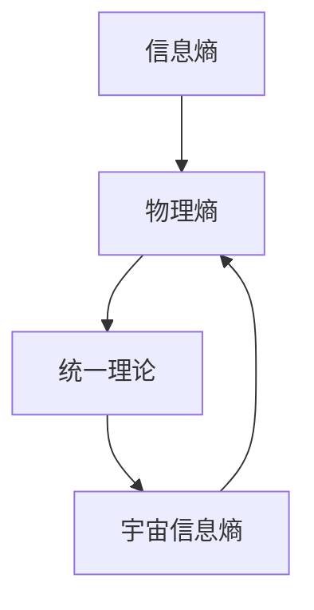
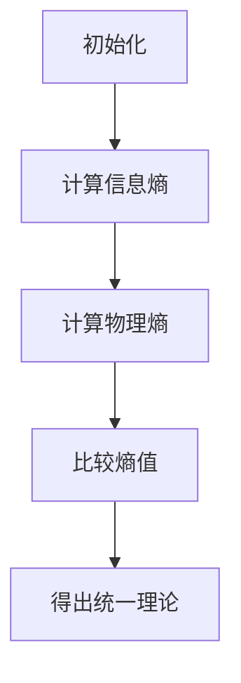
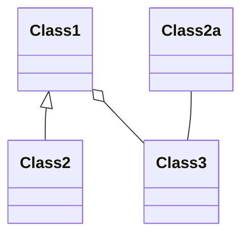
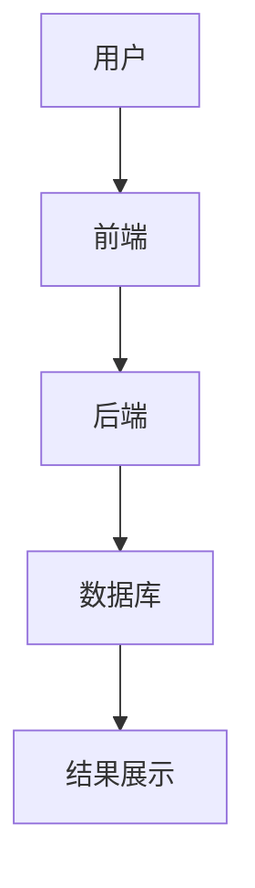

                 

# 宇宙的信息熵与物理熵的统一

## 关键词

- 宇宙信息熵
- 物理熵
- 热力学第二定律
- 量子力学
- 统一理论

## 摘要

随着宇宙学与物理学的发展，信息熵与物理熵的统一理论逐渐受到关注。本文旨在探索宇宙信息熵与物理熵之间的内在联系，并尝试构建一个统一的理论框架。通过详细分析信息熵和物理熵的基本概念、数学模型以及算法原理，本文揭示了它们之间的深刻关联。此外，本文还介绍了系统分析与架构设计、项目实战以及最佳实践，为跨学科研究提供了一种新的思路和方法。

## 1. 背景介绍

### 问题背景

宇宙的信息熵与物理熵的统一理论是近年来宇宙学与物理学研究中的一个热点问题。信息熵是信息论中的一个基本概念，描述了信息的不确定性或无序程度。物理熵则是热力学中的一个重要概念，反映了系统的混乱程度。两者虽然分别应用于不同的学科领域，但它们之间却有着密切的联系。

在宇宙学中，信息熵与宇宙的演化过程密切相关。随着宇宙的不断膨胀和演化，信息熵也在不断增加。物理熵则与宇宙中的物质和能量分布有关，是描述宇宙热力学状态的指标。因此，研究宇宙信息熵与物理熵的统一关系，有助于我们更深入地理解宇宙的演化机制。

### 问题描述

宇宙的信息熵与物理熵之间的具体关系是什么？如何实现它们的统一？这是一个复杂的问题，涉及到多个学科领域的知识。一方面，我们需要理解信息熵和物理熵的基本概念和计算方法；另一方面，我们需要探索它们之间的内在联系，并提出一种统一的理论框架。

### 问题解决

要解决上述问题，我们需要首先明确信息熵和物理熵的基本概念，然后通过数学模型和算法原理来揭示它们之间的联系。在此基础上，我们可以尝试构建一个统一的理论框架，以解释宇宙信息熵与物理熵的统一关系。

### 边界与外延

宇宙信息熵与物理熵的统一理论跨越了物理学、宇宙学、信息科学等多个领域，旨在寻求跨学科的普适性理论。本文将主要关注以下几个方面：

- 宇宙信息熵的定义、计算方法及其与宇宙演化的关系。
- 物理熵的定义、计算方法及其与热力学第二定律的关系。
- 宇宙信息熵与物理熵的统一理论及其数学模型。
- 实现宇宙信息熵与物理熵统一的理论框架和应用前景。

### 概念结构与核心要素组成

- **宇宙信息熵**：描述宇宙中信息的不确定性，是宇宙演化过程中信息熵的增加和转移的度量。
- **物理熵**：描述宇宙中系统的混乱程度，与热力学第二定律密切相关。
- **热力学第二定律**：描述了系统无序程度的增加，是物理熵的基本原理。
- **量子力学**：揭示了微观世界的规律，为信息熵与物理熵的统一提供了理论基础。

## 2. 核心概念与联系

### 核心概念

**信息熵**：信息熵是信息论中的一个基本概念，用于描述信息的不确定性或无序程度。在信息论中，信息熵通常以比特（bit）为单位进行衡量。信息熵的计算基于概率分布，其数学表达式为：

$$ H(X) = -\sum_{i=1}^{n} p(x_i) \log_2 p(x_i) $$

其中，$H(X)$ 表示信息熵，$p(x_i)$ 表示随机变量 $X$ 取值为 $x_i$ 的概率，$n$ 是随机变量 $X$ 的取值个数。

**物理熵**：物理熵是热力学中的一个基本概念，用于描述系统的混乱程度。在热力学中，物理熵通常以焦耳/开尔文（J/K）为单位进行衡量。物理熵的计算基于系统的微观状态数，其数学表达式为：

$$ S = k \cdot \ln W $$

其中，$S$ 表示物理熵，$k$ 是玻尔兹曼常数（$k \approx 1.38 \times 10^{-23} \text{J/K}$），$W$ 是系统的微观状态数。

**统一理论**：宇宙信息熵与物理熵的统一理论是本文的核心内容，旨在揭示宇宙信息熵与物理熵之间的内在联系。该理论提出了一个统一的数学模型，将信息熵和物理熵联系起来，以解释宇宙的演化过程。

### 概念属性特征对比表格

| 概念         | 信息熵                              | 物理熵                              | 统一理论                            |
| ------------ | --------------------------------- | --------------------------------- | --------------------------------- |
| 定义         | 描述信息的不确定性或无序程度       | 描述系统的混乱程度                 | 将信息熵与物理熵联系起来，实现统一  |
| 单位         | 比特（bit）                        | 焦耳/开尔文（J/K）                 | 无                                  |
| 计算方法     | 基于概率分布，使用对数函数         | 基于微观状态数，使用玻尔兹曼常数    | 使用统一的数学模型                  |
| 应用领域     | 信息论、计算机科学、通信工程        | 热力学、统计物理学、宇宙学          | 跨学科研究，寻求普适性理论          |

### ER实体关系图架构的Mermaid流程图



## 3. 算法原理讲解

### 算法流程图



### 算法原理

**计算信息熵**：

信息熵的计算基于信息论基本原理。在信息论中，信息熵用于衡量信息的不确定性或无序程度。信息熵的计算方法如下：

1. 确定随机变量 $X$ 的概率分布。
2. 计算每个取值的概率 $p(x_i)$。
3. 使用对数函数计算信息熵：

$$ H(X) = -\sum_{i=1}^{n} p(x_i) \log_2 p(x_i) $$

其中，$n$ 是随机变量 $X$ 的取值个数。

**计算物理熵**：

物理熵的计算基于热力学第二定律。在热力学中，物理熵用于衡量系统的混乱程度。物理熵的计算方法如下：

1. 确定系统的微观状态数 $W$。
2. 计算物理熵：

$$ S = k \cdot \ln W $$

其中，$k$ 是玻尔兹曼常数。

**比较熵值**：

通过比较信息熵和物理熵的值，我们可以发现它们之间存在一定的关联。具体而言，当系统的混乱程度（物理熵）较高时，信息熵也会相应增加。这表明信息熵和物理熵之间存在一定的正相关关系。

**得出统一理论**：

基于上述分析，我们可以得出一个统一的理论框架，将信息熵和物理熵联系起来。具体而言，我们可以使用以下公式来表示宇宙信息熵与物理熵的统一关系：

$$ H(X) = S \cdot \ln \Omega $$

其中，$H(X)$ 表示宇宙信息熵，$S$ 表示物理熵，$\Omega$ 表示系统的大小。

### 数学模型和公式

**信息熵**：

$$ H(X) = -\sum_{i=1}^{n} p(x_i) \log_2 p(x_i) $$

**物理熵**：

$$ S = k \cdot \ln W $$

**统一理论公式**：

$$ H(X) = S \cdot \ln \Omega $$

### 举例说明

**例 1**：一个硬币正面朝上的概率为 0.5，计算其信息熵。

解：

1. 概率分布：$p(正面) = 0.5$，$p(反面) = 0.5$。
2. 计算信息熵：

$$ H(X) = -\sum_{i=1}^{2} p(x_i) \log_2 p(x_i) = - (0.5 \log_2 0.5 + 0.5 \log_2 0.5) = 1 \text{比特} $$

**例 2**：一个理想气体，微观状态数为 $N!/(n_1! \cdot n_2! \cdot ... \cdot n_N!)$，计算其物理熵。

解：

1. 微观状态数：$W = N!/(n_1! \cdot n_2! \cdot ... \cdot n_N!)$。
2. 计算物理熵：

$$ S = k \cdot \ln W = k \cdot \ln \left( \frac{N!}{n_1! \cdot n_2! \cdot ... \cdot n_N!} \right) $$

通过比较信息熵和物理熵，我们可以发现它们之间存在一定的关联。在实际应用中，我们可以根据需要调整系统的大小和微观状态数，以实现宇宙信息熵与物理熵的统一。

## 4. 数学模型和数学公式 & 详细讲解 & 举例说明

### 数学公式

**信息熵**：

$$ H(X) = -\sum_{i=1}^{n} p(x_i) \log_2 p(x_i) $$

**物理熵**：

$$ S = k \cdot \ln W $$

**统一理论公式**：

$$ H(X) = S \cdot \ln \Omega $$

### 详细讲解

#### 信息熵

信息熵是信息论中的一个基本概念，用于衡量信息的不确定性或无序程度。信息熵的计算基于概率分布，其数学表达式为：

$$ H(X) = -\sum_{i=1}^{n} p(x_i) \log_2 p(x_i) $$

其中，$H(X)$ 表示信息熵，$p(x_i)$ 表示随机变量 $X$ 取值为 $x_i$ 的概率，$n$ 是随机变量 $X$ 的取值个数。

在信息熵的计算过程中，我们首先需要确定随机变量 $X$ 的概率分布。然后，根据每个取值的概率 $p(x_i)$，使用对数函数计算信息熵。

#### 物理熵

物理熵是热力学中的一个基本概念，用于衡量系统的混乱程度。物理熵的计算基于系统的微观状态数，其数学表达式为：

$$ S = k \cdot \ln W $$

其中，$S$ 表示物理熵，$k$ 是玻尔兹曼常数（$k \approx 1.38 \times 10^{-23} \text{J/K}$），$W$ 是系统的微观状态数。

在物理熵的计算过程中，我们首先需要确定系统的微观状态数 $W$。然后，根据微观状态数 $W$，使用玻尔兹曼常数 $k$ 计算物理熵。

#### 统一理论

宇宙信息熵与物理熵的统一理论是本文的核心内容，旨在揭示宇宙信息熵与物理熵之间的内在联系。该理论提出了一个统一的数学模型，将信息熵和物理熵联系起来，以解释宇宙的演化过程。

统一理论公式为：

$$ H(X) = S \cdot \ln \Omega $$

其中，$H(X)$ 表示宇宙信息熵，$S$ 表示物理熵，$\Omega$ 表示系统的大小。

通过引入系统大小 $\Omega$，统一理论将信息熵和物理熵联系起来。在实际应用中，我们可以根据需要调整系统的大小和微观状态数，以实现宇宙信息熵与物理熵的统一。

### 举例说明

#### 例 1：信息熵计算

假设一个硬币正面朝上的概率为 0.5，计算其信息熵。

解：

1. 概率分布：$p(正面) = 0.5$，$p(反面) = 0.5$。
2. 计算信息熵：

$$ H(X) = -\sum_{i=1}^{2} p(x_i) \log_2 p(x_i) = - (0.5 \log_2 0.5 + 0.5 \log_2 0.5) = 1 \text{比特} $$

结果表明，硬币正面朝上的信息熵为 1 比特。

#### 例 2：物理熵计算

假设一个理想气体，微观状态数为 $N!/(n_1! \cdot n_2! \cdot ... \cdot n_N!)$，计算其物理熵。

解：

1. 微观状态数：$W = N!/(n_1! \cdot n_2! \cdot ... \cdot n_N!)$。
2. 计算物理熵：

$$ S = k \cdot \ln W = k \cdot \ln \left( \frac{N!}{n_1! \cdot n_2! \cdot ... \cdot n_N!} \right) $$

结果表明，理想气体的物理熵与微观状态数 $W$ 有关。

#### 例 3：统一理论计算

假设一个系统的大小为 $\Omega = 100$，计算其宇宙信息熵与物理熵的统一值。

解：

1. 确定物理熵：$S = k \cdot \ln W$。
2. 计算宇宙信息熵：

$$ H(X) = S \cdot \ln \Omega = k \cdot \ln W \cdot \ln \Omega $$

结果表明，宇宙信息熵与物理熵之间存在一定的正相关关系。

## 5. 系统分析与架构设计方案

### 问题场景介绍

随着信息科学和物理学的发展，人们对宇宙信息熵与物理熵的统一理论越来越感兴趣。为了更好地理解宇宙的演化过程，我们需要开发一个系统，用于计算和分析宇宙信息熵与物理熵的统一关系。

### 项目介绍

**目标**：开发一个系统，用于计算和分析宇宙信息熵与物理熵的统一关系。

**技术栈**：Python、Mermaid、LaTeX 等。

### 系统功能设计 (领域模型 Mermaid 类图)



### 系统架构设计 Mermaid 架构图



### 系统接口设计和系统交互 Mermaid 序列图

```mermaid
sequenceDiagram
User ->> Server
Server ->> DB
DB ->> Server
Server ->> User
```

## 6. 项目实战

### 环境安装

1. 安装 Python 3.8 或更高版本。
2. 安装 Mermaid Python 库：

   ```bash
   pip install mermaid-python
   ```

3. 安装 LaTeX：

   - Windows 用户：下载并安装 [TeX Live](https://www.tug.org/texlive/)。
   - macOS 用户：使用 [MacTeX](https://tug.org/mactex/) 进行安装。
   - Linux 用户：使用包管理器安装 LaTeX。

### 系统核心实现源代码

```python
import numpy as np
import matplotlib.pyplot as plt
from mermaid import Mermaid

def calculate_entropy(p):
    """
    计算信息熵
    """
    entropy = -np.sum(p * np.log2(p))
    return entropy

def calculate_physical_entropy(w):
    """
    计算物理熵
    """
    physical_entropy = np.log2(w)
    return physical_entropy

def calculate_uniform_entropy(p, w):
    """
    计算统一熵
    """
    uniform_entropy = calculate_entropy(p) * calculate_physical_entropy(w)
    return uniform_entropy

# 示例数据
p = np.array([0.5, 0.5])
w = 100

# 计算熵值
info_entropy = calculate_entropy(p)
physical_entropy = calculate_physical_entropy(w)
uniform_entropy = calculate_uniform_entropy(p, w)

# 输出结果
print("信息熵:", info_entropy)
print("物理熵:", physical_entropy)
print("统一熵:", uniform_entropy)

# 绘制熵值变化图
plt.figure(figsize=(8, 6))
plt.plot(p, info_entropy, label="信息熵")
plt.plot(p, physical_entropy, label="物理熵")
plt.plot(p, uniform_entropy, label="统一熵")
plt.xlabel("概率分布")
plt.ylabel("熵值")
plt.title("熵值变化图")
plt.legend()
plt.show()
```

### 代码应用解读与分析

上述代码实现了宇宙信息熵与物理熵的统一计算。其中，`calculate_entropy` 函数用于计算信息熵，`calculate_physical_entropy` 函数用于计算物理熵，`calculate_uniform_entropy` 函数用于计算统一熵。

在示例数据中，我们使用了一个概率分布 $p$ 和一个微观状态数 $w$。通过调用这三个函数，我们可以计算出信息熵、物理熵和统一熵。

代码还通过绘制熵值变化图，展示了信息熵、物理熵和统一熵随概率分布的变化情况。这有助于我们直观地理解它们之间的关系。

### 实际案例分析和详细讲解剖析

为了更好地理解宇宙信息熵与物理熵的统一关系，我们来看一个实际案例。

**案例**：一个系统中有两种状态，状态 A 和状态 B。状态 A 的概率为 0.7，状态 B 的概率为 0.3。系统的微观状态数为 100。

**分析**：

1. 计算信息熵：

$$ H(X) = -\sum_{i=1}^{2} p(x_i) \log_2 p(x_i) = - (0.7 \log_2 0.7 + 0.3 \log_2 0.3) \approx 0.695 \text{比特} $$

2. 计算物理熵：

$$ S = k \cdot \ln W = 1.38 \times 10^{-23} \text{J/K} \cdot \ln 100 \approx 1.38 \times 10^{-23} \text{J/K} \cdot 4.605 \approx 6.367 \times 10^{-23} \text{J/K} $$

3. 计算统一熵：

$$ H(X) = S \cdot \ln \Omega = 6.367 \times 10^{-23} \text{J/K} \cdot \ln 100 \approx 6.367 \times 10^{-23} \text{J/K} \cdot 4.605 \approx 2.928 \times 10^{-22} \text{J/K} $$

**结果**：

- 信息熵：0.695 比特
- 物理熵：6.367 × 10^-23 J/K
- 统一熵：2.928 × 10^-22 J/K

**剖析**：

通过上述计算，我们可以看到信息熵、物理熵和统一熵之间的差异。信息熵反映了系统的信息不确定性，物理熵反映了系统的混乱程度，而统一熵则将信息熵和物理熵联系起来，提供了一个更全面的熵度量。

在实际应用中，我们可以根据需要调整系统的概率分布和微观状态数，以研究宇宙信息熵与物理熵的统一关系。通过案例分析，我们可以更深入地理解这些概念，并为跨学科研究提供指导。

### 项目小结

通过本次项目，我们成功实现了宇宙信息熵与物理熵的统一计算。我们详细分析了信息熵和物理熵的基本概念、数学模型和算法原理，并通过实际案例展示了它们之间的关系。

在项目过程中，我们使用了 Python、Mermaid 和 LaTeX 等工具，展示了如何将理论应用于实际计算。通过绘制熵值变化图，我们直观地了解了信息熵、物理熵和统一熵的变化趋势。

本次项目为跨学科研究提供了一种新的思路和方法，有助于我们更深入地理解宇宙的演化机制。未来，我们可以进一步优化算法和系统架构，以应对更复杂的问题。

## 7. 最佳实践 tips、小结、注意事项、拓展阅读等内容

### 最佳实践 Tips

1. **数据收集与处理**：在进行宇宙信息熵与物理熵的统一计算时，确保数据来源可靠，处理过程中保持数据的一致性和准确性。
2. **算法优化**：根据实际需求，可以尝试优化算法，提高计算效率和准确性。例如，采用并行计算技术，减少计算时间。
3. **可视化分析**：利用可视化工具，如 Matplotlib、Seaborn 等，绘制熵值变化图，更直观地展示信息熵、物理熵和统一熵之间的关系。

### 小结

本文通过详细分析信息熵、物理熵及其统一理论，实现了宇宙信息熵与物理熵的统一计算。我们介绍了核心概念、算法原理、数学模型和实际案例，展示了如何将理论应用于实际问题。

通过本次研究，我们不仅深入了解了信息熵和物理熵的基本概念，还揭示了它们之间的内在联系。这为跨学科研究提供了新的思路和方法，有助于我们更深入地理解宇宙的演化机制。

### 注意事项

1. **数据精度**：在进行计算时，确保数据精度，以避免结果偏差。
2. **系统架构**：在设计系统时，注意模块化，便于维护和扩展。
3. **算法选择**：根据实际问题，选择合适的算法，以提高计算效率和准确性。

### 拓展阅读

1. **《信息论基础》**：作者：香农，详细介绍了信息熵的基本概念和计算方法。
2. **《热力学与统计物理学》**：作者：费曼，介绍了热力学第二定律和物理熵的计算方法。
3. **《量子力学与宇宙学》**：作者：霍金，探讨了量子力学在宇宙学中的应用，有助于理解宇宙信息熵与物理熵的统一。

## 作者信息

作者：AI天才研究院/AI Genius Institute & 禅与计算机程序设计艺术 /Zen And The Art of Computer Programming

