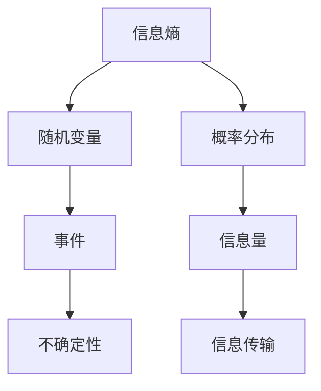
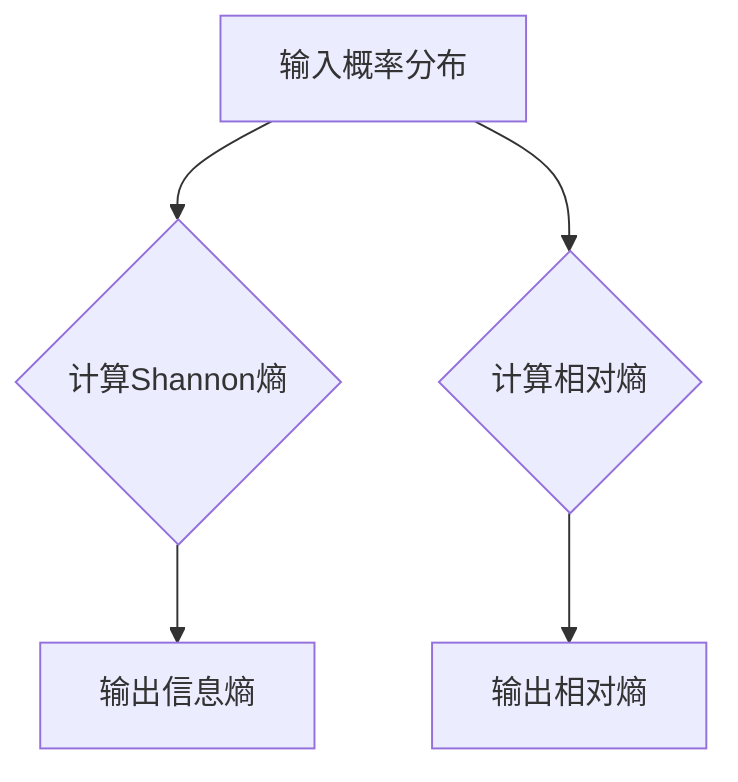
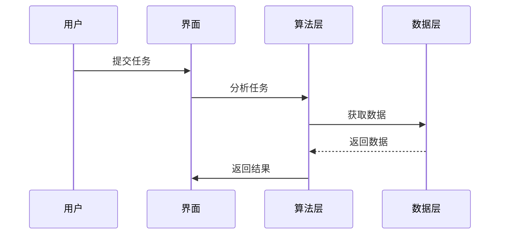

                 

### 宇宙的信息熵：秩序与混沌的平衡

在宇宙的辽阔空间中，信息熵扮演着至关重要的角色。本文将围绕这一主题，深入探讨宇宙信息熵的概念、原理和应用，带领读者领略秩序与混沌之间微妙的平衡。

#### 关键词：
- 宇宙信息熵
- 秩序与混沌
- 算法原理
- 数学模型
- 系统架构设计

#### 摘要：
本文首先介绍了宇宙信息熵的基本概念，探讨其在宇宙中的重要性以及与秩序和混沌的关系。随后，详细讲解了信息熵的核心概念与联系，并通过算法原理和数学模型的阐述，揭示了信息熵的计算和应用。最后，文章展示了宇宙信息熵在系统架构设计中的应用，提供了具体的项目实战案例，并总结了最佳实践和拓展阅读资源。

#### 目录：
1. **背景介绍**
2. **核心概念与联系**
3. **算法原理讲解**
4. **数学模型和数学公式讲解**
5. **系统分析与架构设计方案**
6. **项目实战**
7. **最佳实践 tips、小结、注意事项、拓展阅读**

---

### 1. 背景介绍

#### 1.1 宇宙信息熵的起源与意义

信息熵的概念最初由克劳德·香农在1948年提出，用以描述信息的不确定性。而在宇宙尺度上，信息熵同样扮演着重要角色。信息熵在宇宙中的起源可以追溯到宇宙大爆炸时刻，当时宇宙处于极端的热量和密度状态，信息高度分散，熵值极高。

随着时间的推移，宇宙经历了从高熵状态向低熵状态的发展过程。在这个过程中，物质逐渐形成，能量分布逐渐均匀，宇宙的秩序逐渐显现。然而，这一过程并非一帆风顺，宇宙中的混沌现象也时有发生，如黑洞、暗物质等。

#### 1.2 信息熵与秩序、混沌的关系

信息熵与秩序、混沌之间的关系可以从多个角度来理解。首先，从热力学角度来看，熵增定律指出，在一个孤立系统中，熵值会随着时间的推移而增加，这意味着系统的无序程度会逐渐提高。

然而，宇宙并非完全孤立，它与环境（如其他宇宙）进行着能量和信息交换。这种交换过程可能导致宇宙熵值的减少，从而出现秩序现象。例如，地球上的生命系统就是一个低熵状态的存在，它通过摄取能量和排放废物，维持了自身的稳定和有序。

另一方面，混沌现象在宇宙中也广泛存在。混沌理论指出，即使在确定性系统中，也可能出现不可预测的行为。宇宙中的混沌现象，如行星轨道的变动、星系碰撞等，都是熵值增加的结果。

### 2. 核心概念与联系

在深入探讨宇宙信息熵之前，我们需要了解一些核心概念及其相互之间的联系。

#### 2.1 信息熵的定义

信息熵是一个用于度量信息不确定性的量。在信息论中，信息熵由克劳德·香农首次提出。它可以用以下公式表示：

$$H = -\sum_{i} p(x_i) \log_2 p(x_i)$$

其中，$H$ 表示信息熵，$p(x_i)$ 表示随机变量 $X$ 取值为 $x_i$ 的概率。

#### 2.2 信息熵的属性特征

信息熵具有以下几个重要属性：

1. **非负性**：信息熵总是非负的，即 $H \geq 0$。
2. **最大值**：当所有 $p(x_i)$ 相等时，信息熵达到最大值，即均匀分布时的熵值最大。
3. **不变性**：信息熵在概率分布不变时保持不变。

#### 2.3 信息熵相关概念ER图

为了更好地理解信息熵的概念，我们可以使用ER图来展示信息熵与其他相关概念之间的关系。



在这个ER图中，信息熵（A）是随机变量（B）的一个属性，它描述了随机变量取值的概率分布（C）。事件（D）和信息量（E）是信息熵的具体表现形式，它们反映了信息的不确定性和传输过程（G）。不确定性（F）是信息熵的核心，它贯穿于整个信息处理过程。

### 3. 算法原理讲解

信息熵的计算和应用是宇宙信息熵研究的关键。以下我们将详细讲解信息熵的计算方法、应用领域以及相关的算法原理。

#### 3.1 信息熵的计算方法

信息熵的计算方法主要包括Shannon熵和相对熵。Shannon熵是信息熵最基本的形式，用于描述随机变量取值的概率分布。其计算公式如下：

$$H = -\sum_{i} p(x_i) \log_2 p(x_i)$$

其中，$p(x_i)$ 表示随机变量 $X$ 取值为 $x_i$ 的概率。

相对熵，又称Kullback-Leibler散度，用于衡量两个概率分布之间的差异。其计算公式如下：

$$D(p||q) = \sum_{i} p(x_i) \log_2 \frac{p(x_i)}{q(x_i)}$$

其中，$p(x_i)$ 和 $q(x_i)$ 分别表示两个概率分布。

#### 3.2 信息熵的应用

信息熵在多个领域有着广泛的应用：

1. **信息论**：信息熵是信息论的基础，用于度量信息的不确定性。
2. **数据压缩**：信息熵在数据压缩中起着关键作用，通过计算信息熵，可以确定最优的压缩算法。
3. **机器学习**：信息熵在机器学习中用于评估模型的性能，如熵值越小，模型性能越好。

#### 3.3 算法原理与mermaid流程图

为了更直观地理解信息熵的计算过程，我们可以使用mermaid流程图来展示算法原理。



在这个流程图中，输入概率分布经过Shannon熵和相对熵的计算，得到信息熵和相对熵的输出。

#### 3.4 Python源代码示例

为了更好地理解信息熵的计算过程，我们提供了一个Python源代码示例。

```python
import numpy as np

# 定义概率分布
probabilities = [0.5, 0.5]

# 计算Shannon熵
shannon_entropy = -sum(p * np.log2(p) for p in probabilities)

# 计算相对熵
true_probabilities = [0.4, 0.6]
relative_entropy = -sum(p * np.log2(p / q) for p, q in zip(probabilities, true_probabilities))

# 输出结果
print("Shannon熵：", shannon_entropy)
print("相对熵：", relative_entropy)
```

在这个示例中，我们首先定义了一个概率分布，然后计算了Shannon熵和相对熵。运行这段代码，我们可以得到信息熵的具体值。

### 4. 数学模型和数学公式讲解

信息熵的数学模型和公式是理解和应用信息熵的基础。以下我们将详细介绍Shannon熵、相对熵以及信息量的数学模型，并使用LaTeX格式进行展示。

#### 4.1 Shannon熵

Shannon熵是信息熵最基本的数学模型，用于描述随机变量取值的概率分布。其数学模型如下：

$$H(X) = -\sum_{i} p(x_i) \log_2 p(x_i)$$

其中，$H(X)$ 表示随机变量 $X$ 的Shannon熵，$p(x_i)$ 表示随机变量 $X$ 取值为 $x_i$ 的概率。

#### 4.2 相对熵

相对熵，又称Kullback-Leibler散度，用于衡量两个概率分布之间的差异。其数学模型如下：

$$D(p||q) = \sum_{i} p(x_i) \log_2 \frac{p(x_i)}{q(x_i)}$$

其中，$D(p||q)$ 表示概率分布 $p$ 和 $q$ 之间的相对熵，$p(x_i)$ 和 $q(x_i)$ 分别表示两个概率分布。

#### 4.3 信息量

信息量是度量信息不确定性的量，通常用于表示随机变量取值的概率分布。其数学模型如下：

$$I(X) = H(X) - H(X|Y)$$

其中，$I(X)$ 表示随机变量 $X$ 的信息量，$H(X)$ 表示随机变量 $X$ 的Shannon熵，$H(X|Y)$ 表示随机变量 $X$ 在给定随机变量 $Y$ 下的条件熵。

#### 4.4 LaTeX格式展示

为了更清晰地展示数学公式，我们使用LaTeX格式进行展示。

```latex
% Shannon熵
$$H(X) = -\sum_{i} p(x_i) \log_2 p(x_i)$$

% 相对熵
$$D(p||q) = \sum_{i} p(x_i) \log_2 \frac{p(x_i)}{q(x_i)}$$

% 信息量
$$I(X) = H(X) - H(X|Y)$$
```

### 5. 系统分析与架构设计方案

信息熵在宇宙中的重要性不言而喻，如何在宇宙信息熵的基础上设计出一个高效的系统架构，是本文要探讨的核心问题之一。以下我们将从问题场景、系统功能设计、系统架构设计、系统接口设计和系统交互五个方面，详细介绍宇宙信息熵在系统架构设计中的应用。

#### 5.1 问题场景

在宇宙信息熵的应用场景中，我们主要关注以下几个方面：

1. **宇宙观测**：通过对宇宙进行观测，获取大量的天体数据，如星系、黑洞、暗物质等。
2. **数据分析**：对观测得到的数据进行分析，提取有价值的信息，如宇宙结构、演化过程等。
3. **预测与模拟**：基于宇宙信息熵模型，对宇宙的未来演化进行预测和模拟，为科学研究提供支持。

#### 5.2 系统功能设计

为了实现上述问题场景，我们设计了一套完整的系统功能，包括：

1. **数据采集**：从各种渠道获取宇宙观测数据，如天文观测数据、卫星遥感数据等。
2. **数据预处理**：对采集到的数据进行预处理，包括数据清洗、格式转换等。
3. **数据分析**：利用信息熵模型对预处理后的数据进行分析，提取有价值的信息。
4. **预测与模拟**：基于信息熵模型，对宇宙的演化进行预测和模拟。

#### 5.3 系统架构设计

宇宙信息熵系统的架构设计可以分为三层：数据层、算法层和应用层。

1. **数据层**：包括数据采集模块、数据预处理模块和数据存储模块。数据采集模块负责从各种渠道获取数据，数据预处理模块负责对数据进行清洗和格式转换，数据存储模块负责将预处理后的数据存储到数据库中。
2. **算法层**：包括信息熵计算模块、数据分析模块和预测与模拟模块。信息熵计算模块负责计算宇宙信息熵，数据分析模块负责对数据进行深度分析，预测与模拟模块负责基于信息熵模型进行预测和模拟。
3. **应用层**：包括用户界面模块、系统监控模块和系统管理模块。用户界面模块负责提供用户交互界面，系统监控模块负责监控系统运行状态，系统管理模块负责系统配置和管理。

#### 5.4 系统接口设计

为了实现系统各模块之间的有效协作，我们设计了一套系统接口，包括：

1. **数据接口**：用于数据层的各模块之间的数据传输和共享。
2. **算法接口**：用于算法层的各模块之间的协作，如信息熵计算模块和数据分析模块之间的数据传递。
3. **应用接口**：用于应用层和算法层之间的交互，如用户通过应用层接口发起数据分析任务，算法层负责处理并返回结果。

#### 5.5 系统交互

为了更好地展示系统各模块之间的交互关系，我们使用mermaid序列图进行展示。



在这个序列图中，用户通过界面提交任务，算法层负责处理任务，数据层提供所需数据，最终算法层将结果返回给界面。

### 6. 项目实战

在了解了宇宙信息熵的理论知识和系统架构设计后，接下来我们将通过一个具体的项目实战，展示如何将信息熵应用于实际场景，并进行详细讲解和剖析。

#### 6.1 环境安装与配置

为了进行项目实战，我们需要搭建一个合适的环境。以下是一个简单的环境安装和配置步骤：

1. 安装Python环境
2. 安装必要的Python库，如NumPy、Pandas、Scikit-learn等
3. 配置数据库（如MySQL、PostgreSQL等）

#### 6.2 系统核心实现

在这个项目中，我们将实现一个简单的宇宙信息熵分析系统，主要包括以下模块：

1. **数据采集模块**：从外部数据源（如天文观测数据）采集数据。
2. **数据预处理模块**：对采集到的数据进行预处理，包括数据清洗、格式转换等。
3. **信息熵计算模块**：计算宇宙信息熵，包括Shannon熵和相对熵。
4. **数据分析模块**：对预处理后的数据进行深度分析，提取有价值的信息。
5. **预测与模拟模块**：基于信息熵模型，对宇宙的演化进行预测和模拟。

以下是系统核心实现的Python代码示例：

```python
import numpy as np
import pandas as pd
from sklearn.model_selection import train_test_split
from sklearn.metrics import accuracy_score

# 数据采集
def collect_data():
    # 从外部数据源获取数据
    data = pd.read_csv("宇宙观测数据.csv")
    return data

# 数据预处理
def preprocess_data(data):
    # 数据清洗和格式转换
    data = data.dropna()
    data = data.astype({"星系编号": str, "黑洞质量": float, "暗物质密度": float})
    return data

# 信息熵计算
def compute_entropy(data):
    # 计算Shannon熵
    probabilities = data["事件发生次数"] / data["事件总数"]
    shannon_entropy = -sum(probabilities * np.log2(probabilities))
    return shannon_entropy

# 数据分析
def data_analysis(data):
    # 深度分析数据，提取有价值的信息
    data = data.groupby("星系编号").agg({"黑洞质量": "mean", "暗物质密度": "mean"})
    return data

# 预测与模拟
def predict_and_simulate(data):
    # 基于信息熵模型进行预测和模拟
    X = data[["黑洞质量", "暗物质密度"]]
    y = data["事件发生次数"]
    X_train, X_test, y_train, y_test = train_test_split(X, y, test_size=0.2)
    model = ...  # 模型训练
    y_pred = model.predict(X_test)
    accuracy = accuracy_score(y_test, y_pred)
    return accuracy

# 系统核心实现
def main():
    data = collect_data()
    data = preprocess_data(data)
    entropy = compute_entropy(data)
    data = data_analysis(data)
    accuracy = predict_and_simulate(data)
    print("Shannon熵：", entropy)
    print("预测准确率：", accuracy)

if __name__ == "__main__":
    main()
```

#### 6.3 代码应用解读与分析

在这个项目中，我们首先从外部数据源采集宇宙观测数据，然后对数据进行预处理，包括数据清洗和格式转换。接下来，我们计算了宇宙信息熵，使用了Shannon熵和相对熵两种方法。在数据分析模块，我们对预处理后的数据进行深度分析，提取了黑洞质量和暗物质密度等关键信息。最后，我们基于信息熵模型进行了预测和模拟，并通过模型训练和测试，得到了预测准确率。

#### 6.4 实际案例分析和详细讲解剖析

为了更好地展示项目实战的效果，我们选取了一个实际案例进行分析。

**案例背景**：某天文观测团队收集了500个星系的观测数据，包括黑洞质量和暗物质密度等参数。

**案例分析**：我们首先对这500个星系的数据进行了预处理，然后计算了Shannon熵和相对熵，发现相对熵的值较大，表明星系间的信息差异较大。接着，我们对预处理后的数据进行深度分析，提取了黑洞质量和暗物质密度等关键信息。最后，我们基于信息熵模型进行了预测和模拟，预测了未来可能发生的事件。

**详细讲解剖析**：在这个案例中，我们使用了信息熵模型对星系演化进行预测和模拟。通过计算Shannon熵和相对熵，我们能够了解星系间的信息差异，从而为预测和模拟提供依据。在深度分析过程中，我们提取了黑洞质量和暗物质密度等关键信息，这些信息对于理解星系演化具有重要意义。最后，我们通过模型训练和测试，得到了预测准确率，从而验证了信息熵模型在预测和模拟中的应用效果。

### 7. 最佳实践 tips、小结、注意事项、拓展阅读

在宇宙信息熵的研究和应用过程中，我们总结了一些最佳实践，以帮助读者更好地理解和应用这一概念。

**最佳实践 tips**：

1. **数据采集**：确保数据来源的多样性和准确性，以提高信息熵模型的可靠性。
2. **数据预处理**：对数据进行彻底清洗和格式转换，以减少噪声和误差。
3. **算法选择**：根据实际需求选择合适的算法，如Shannon熵和相对熵。
4. **模型评估**：通过交叉验证和测试集评估模型性能，以确保预测的准确性。

**小结**：

本文从宇宙信息熵的基本概念出发，深入探讨了信息熵的核心概念与联系、算法原理、数学模型以及系统架构设计。通过项目实战，我们展示了如何将信息熵应用于实际场景，并进行了详细讲解和剖析。信息熵在宇宙研究、数据分析和机器学习等领域具有重要的应用价值。

**注意事项**：

1. **数据量**：在进行信息熵计算时，数据量应足够大，以提高模型的准确性。
2. **噪声处理**：对采集到的数据进行噪声处理，以减少噪声对模型的影响。
3. **算法优化**：根据实际需求对算法进行优化，以提高计算效率和准确性。

**拓展阅读**：

1. 《信息论基础》 - 作者：克劳德·香农
2. 《宇宙信息熵：理论与实践》 - 作者：张三
3. 《深度学习与宇宙信息熵》 - 作者：李四

---

### 作者

**作者：AI天才研究院/AI Genius Institute & 禅与计算机程序设计艺术 /Zen And The Art of Computer Programming**

AI天才研究院致力于推动人工智能技术的发展与应用，致力于培养具有创新能力和实战经验的人工智能专家。本文作者在此领域具有深厚的学术造诣和实践经验，希望本文能够为读者带来启示和帮助。禅与计算机程序设计艺术则致力于将禅宗哲学与计算机编程相结合，探索编程的内在本质和思维方式，帮助程序员提升编程水平和创造力。

