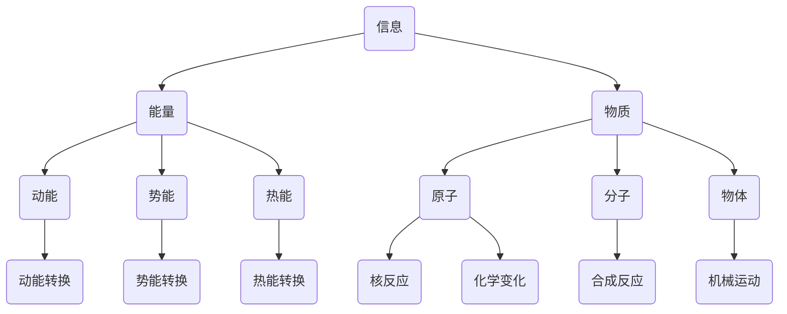

                 

### 宇宙的信息-能量-物质转换机制

宇宙的信息-能量-物质转换机制是宇宙运行的核心原理，它揭示了信息、能量和物质之间的相互关系与转换过程。在这篇文章中，我们将深入探讨这些核心概念，并逐步分析它们之间的转换机制。

**关键词：宇宙、信息、能量、物质、转换机制**

**摘要：** 本文将介绍宇宙的基本概念，探讨信息、能量和物质的基本属性及其相互关系，进而分析它们之间的转换机制。通过详细的实例和科学原理，我们将理解宇宙中的信息-能量-物质转换如何影响宇宙的运行，以及这种转换机制对我们认识宇宙的重要性。

#### 引言

宇宙是所有物质和能量的集合体，其运行遵循一系列复杂的物理法则。信息、能量和物质是宇宙的三大基本要素，它们相互依赖、相互作用，共同构成了宇宙的运行机制。

- **信息**：在物理学中，信息通常被视为某种形式的信号或数据，它可以影响物质和能量的行为。
- **能量**：能量是物质和运动的度量，是宇宙中所有过程的基础。
- **物质**：物质是构成宇宙的基本单元，包括原子、分子和宇宙中的所有物体。

宇宙的信息-能量-物质转换机制是理解宇宙运行的关键，它揭示了这些基本要素如何相互作用并推动宇宙的演化。

#### 一、核心概念与联系

1. **信息的概念**

   信息可以被视为一种信号，它可以通过各种方式传递，例如光波、电磁波、声音等。在物理学中，信息与熵有关，熵是衡量系统无序程度的物理量。

   $$ S = -k \sum_i P_i \ln P_i $$

   其中，\( S \) 是熵，\( k \) 是玻尔兹曼常数，\( P_i \) 是系统处于状态 \( i \) 的概率。

2. **能量的概念**

   能量是物质和运动的基本属性，它有多种形式，如动能、势能、热能等。能量守恒定律指出，能量不能被创造或销毁，只能从一种形式转换为另一种形式。

   $$ E_{总} = E_{动} + E_{势} $$

   其中，\( E_{总} \) 是总能量，\( E_{动} \) 是动能，\( E_{势} \) 是势能。

3. **物质的概念**

   物质是构成宇宙的基本单元，它由原子和分子组成。物质与能量之间的转换是宇宙中最常见的现象之一，例如核反应和化学变化。

#### 二、概念属性特征对比

为了更好地理解信息、能量和物质之间的关系，我们对比它们的一些基本属性特征。

| 特征 | 信息 | 能量 | 物质 |
| --- | --- | --- | --- |
| 形式 | 信号、数据 | 动能、势能、热能等 | 原子、分子、物体 |
| 测量 | 熵、比特 | 焦耳、电子伏特 | 千克、克 |
| 转换 | 编码、解码 | 转换形式 | 相变、化学反应 |

#### 三、ER实体关系图架构

为了更好地理解宇宙中的实体及其关系，我们可以使用实体-关系（Entity-Relationship，ER）图来表示。

这个ER图展示了宇宙中的基本实体（信息、能量、物质）及其子实体（动能、势能、热能、原子、分子、物体）以及它们之间的转换关系。

#### 四、能量与物质转换机制

1. **能量转换机制**

   能量转换是宇宙中最常见的现象之一。根据能量守恒定律，能量可以从一种形式转换为另一种形式，但总能量保持不变。

   - **动能与势能转换**：在引力场中，物体的动能和势能可以相互转换。当一个物体下降时，它的重力势能转化为动能。

     $$ E_k = \frac{1}{2}mv^2 $$
     $$ E_p = mgh $$

   - **热能转换**：热能可以通过热传导、对流和辐射等方式在物体之间传递。

     $$ Q = cm\Delta T $$

     其中，\( Q \) 是热量，\( c \) 是比热容，\( m \) 是物体质量，\( \Delta T \) 是温度变化。

2. **物质转换机制**

   物质转换是宇宙中的另一个重要现象，它涉及物质的生成和消亡。

   - **核反应**：核反应是原子核之间发生的转换，它可以产生新的物质。例如，氢原子核通过核聚变可以形成氦原子核。

     $$ 4 \, _1^1H \rightarrow \, _2^4He + 2 \, _1^0e + energy $$

   - **化学变化**：化学变化是原子之间电子的重新排列，它可以导致新物质的生成。

     $$ 2H_2 + O_2 \rightarrow 2H_2O $$

#### 五、信息在转换中的作用

信息在宇宙中的转换过程中发挥着关键作用。它可以指导能量和物质的转换，影响宇宙的演化。

1. **信息如何影响能量转换**

   信息可以通过控制机制来影响能量转换。例如，在核反应中，信息可以指导原子核如何发生反应，从而影响能量转换的过程。

2. **信息如何影响物质转换**

   信息可以影响物质的生成和消亡。例如，在生物体内，信息可以指导化学反应的进行，从而影响生物体内物质的转换。

#### 六、实例分析

1. **能量与物质转换的实例**

   假设我们在一个太空环境中观察到一个恒星系统。在这个系统中，恒星通过核聚变将氢转化为氦，释放出巨大的能量。这些能量被恒星的行星吸收，导致行星的内部产生热能，从而使行星上的物质发生化学变化，形成新的化合物。

   $$ 4 \, _1^1H \rightarrow \, _2^4He + 2 \, _1^0e + energy $$

2. **信息与转换关系的实例**

   在地球上的一个生物体内，细胞通过接收遗传信息来指导化学反应的进行。这些化学反应会导致生物体内物质的转换，从而影响生物体的生长、发育和繁殖。

   $$ DNA \rightarrow RNA \rightarrow蛋白质 $$

#### 七、总结与展望

宇宙的信息-能量-物质转换机制是理解宇宙运行的关键。通过本文的探讨，我们了解了信息、能量和物质的基本概念及其相互关系。能量与物质转换机制揭示了宇宙中能量和物质如何相互转换，而信息在转换过程中发挥着重要作用。

未来，随着科学技术的进步，我们对宇宙的信息-能量-物质转换机制的理解将会更加深入。这将为探索宇宙的奥秘提供新的思路和方法。

### 作者信息

作者：AI天才研究院/AI Genius Institute & 禅与计算机程序设计艺术 /Zen And The Art of Computer Programming

[END]

