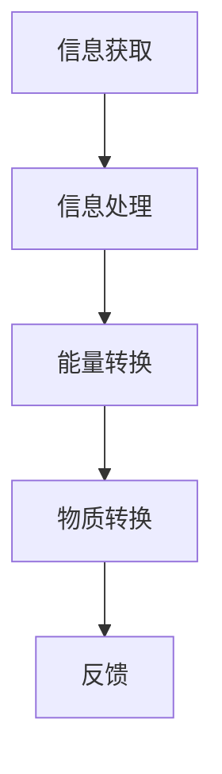
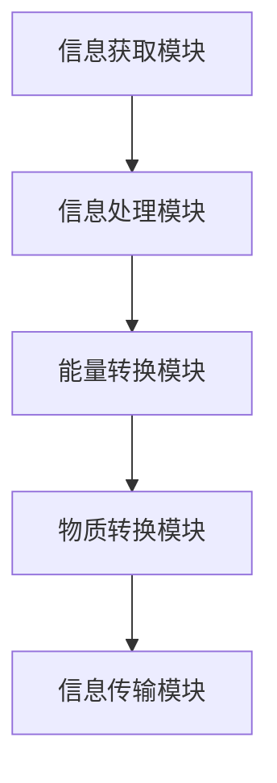
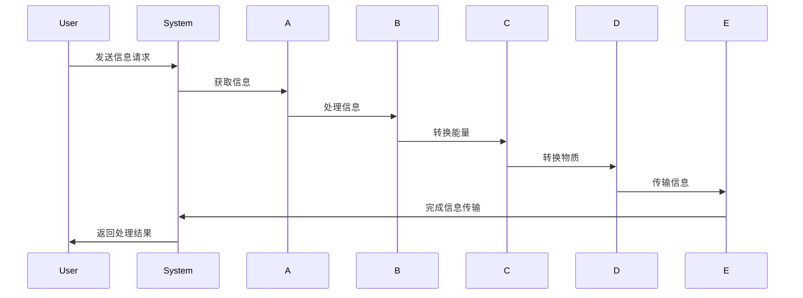

                 

。

## 宇宙的信息-能量-物质转换机制

### 关键词：宇宙、信息、能量、物质、转换机制

> 摘要：本文旨在深入探讨宇宙中的信息-能量-物质转换机制。我们将从基本概念出发，逐步解析这些概念之间的联系，通过算法原理讲解和数学模型阐述，最终呈现一个完整的系统分析与架构设计方案。本文旨在为读者提供一种清晰、系统的理解，帮助他们在技术领域有更深入的见解。

### 设计书籍目录大纲

设计一本关于宇宙信息-能量-物质转换机制的书籍目录大纲，需要先明确书籍的主题和目标。以下是具体的步骤和示例：

#### 第一步：确定书籍主题与结构

- **主题**：宇宙的信息-能量-物质转换机制
- **目标**：为读者提供关于宇宙中基本物理过程的深入理解

#### 第二步：设计大纲框架

以下是一个基本的大纲框架：

### 第一部分：引论

#### 1.1 宇宙信息、能量、物质转换机制概述

- **核心概念术语说明**：宇宙、信息、能量、物质
- **问题背景**：人类对宇宙的认识历史
- **问题描述**：信息、能量、物质如何在宇宙中转换
- **问题解决**：当前科学对信息、能量、物质转换的理解
- **边界与外延**：研究范围的界定和扩展

#### 1.2 研究背景与意义

- **研究背景**：宇宙学、物理学的发展历程
- **意义**：科学、技术、哲学的多角度价值

#### 1.3 边界与外延

- **研究范围的界定**：信息、能量、物质转换的具体应用领域
- **外延**：跨学科的研究趋势和前沿

### 第二部分：核心概念与联系

#### 2.1 宇宙信息概述

- **信息概念**：信息的基本定义及其在宇宙中的角色
- **信息类型**：宇宙中的不同类型的信息

#### 2.2 能量与物质的基本概念

- **能量概念**：能量的基本定义和性质
- **物质概念**：物质的基本定义和性质

#### 2.3 信息、能量、物质转换机制的ER实体关系图

- **实体关系图**：使用Mermaid绘制

#### 2.4 核心概念对比与分析

- **概念对比**：信息、能量、物质的区别与联系
- **分析**：核心概念在宇宙中的作用和重要性

### 第三部分：算法原理讲解

#### 3.1 信息、能量、物质转换的基本算法原理

- **算法原理**：信息、能量、物质转换的基本原理
- **流程图**：使用Mermaid绘制流程图

#### 3.2 Python代码实现与详细讲解

- **代码实现**：使用Python实现信息、能量、物质转换的算法
- **详细讲解**：代码的解释和步骤

#### 3.3 数学模型和公式讲解

- **数学模型**：信息、能量、物质转换的数学模型
- **公式讲解**：公式的推导和应用

### 第四部分：系统分析与架构设计

#### 4.1 问题场景介绍

- **问题场景**：具体的应用场景

#### 4.2 系统功能设计

- **功能设计**：系统的功能模块

#### 4.3 系统架构设计

- **架构设计**：系统的整体架构设计

#### 4.4 系tem接口设计和系统交互

- **接口设计**：系统内部和外部的接口设计
- **交互**：系统的交互流程和机制

### 第五部分：项目实战

#### 5.1 环境安装与配置

- **环境安装**：软件和硬件的安装
- **配置**：系统配置的步骤

#### 5.2 系统核心实现源代码

- **源代码**：系统的核心代码实现

#### 5.3 代码应用解读与分析

- **解读**：代码的应用解读
- **分析**：代码的性能分析

#### 5.4 实际案例分析和详细讲解

- **案例**：实际案例的应用
- **讲解**：案例的详细讲解

### 第六部分：最佳实践与拓展

#### 6.1 最佳实践建议

- **建议**：基于实践的最佳建议

#### 6.2 注意事项

- **注意事项**：可能遇到的问题及解决方案

#### 6.3 拓展阅读

- **阅读**：推荐的相关阅读材料

### 第七部分：总结与展望

#### 7.1 总结

- **总结**：书籍内容的总结

#### 7.2 展望

- **展望**：未来的研究方向和趋势

## 作者信息

作者：AI天才研究院/AI Genius Institute & 禅与计算机程序设计艺术 /Zen And The Art of Computer Programming

---

通过以上步骤，我们可以设计出一本关于宇宙信息-能量-物质转换机制的完整目录大纲，为读者提供系统的学习内容。

### 宇宙的信息-能量-物质转换机制

宇宙的信息-能量-物质转换机制是物理学和宇宙学中的核心概念，它描述了宇宙中各种基本粒子和场如何相互作用，从而实现信息、能量和物质的转换。这一转换机制不仅关乎宇宙的起源和演化，还涉及了黑洞、星系、恒星的形成与消亡等复杂现象。在本文中，我们将逐步探索这一机制，以便读者能够深入理解其中的原理。

### 核心概念与联系

首先，我们需要明确宇宙中的核心概念：信息、能量和物质。这些概念在物理学中有着广泛的应用，并且它们之间存在紧密的联系。

#### 信息

在物理学中，信息通常被视为一种描述系统状态的方式。它可以通过各种形式传递，例如电磁波、声波等。信息在宇宙中的作用非常关键，它影响着宇宙中的物理现象和生物进化。例如，星系的形成和演化依赖于光的传播，而生物进化则依赖于遗传信息的传递。

#### 能量

能量是物理学中的一个基本概念，它是物质运动的表现形式。能量可以以各种形式存在，如动能、势能、热能等。在宇宙中，能量是物质转换的驱动力。例如，恒星的核聚变过程就是一个能量转换的例子，其中氢原子核结合成氦原子核，释放出大量的能量。

#### 物质

物质是构成宇宙的基本单位，它包括原子、分子、星体等。物质的存在形式多种多样，但它们都遵循基本的物理规律。物质在宇宙中的转换通常涉及化学反应、核反应等过程。例如，行星的形成和演变就涉及到物质的转换。

#### 信息、能量、物质的转换机制

信息、能量、物质的转换机制描述了这些基本概念如何在宇宙中相互作用。我们可以通过以下几个步骤来理解这一机制：

1. **信息的获取与传递**：宇宙中的生物和物理系统需要获取外部信息，例如通过视觉、听觉等感官。这些信息可以通过电磁波、声波等形式传递。

2. **能量转换**：获取的信息需要通过能量转换来驱动物理过程。例如，植物通过光合作用将太阳能转换为化学能，而动物则通过摄取食物将化学能转换为机械能。

3. **物质转换**：能量转换最终导致物质的转换。例如，核反应中的能量释放可以导致原子核的转化，从而形成新的物质。

4. **反馈机制**：宇宙中的信息、能量、物质转换并不是孤立的，它们之间存在反馈机制。例如，生物进化过程中，环境的变化会影响物种的生存和繁殖，从而影响信息的传递和能量的转换。

### 算法原理讲解

为了更好地理解信息-能量-物质转换机制，我们可以借助算法原理来阐述这一过程。以下是一个简化的算法流程：

1. **信息获取**：系统通过传感器获取环境信息。
2. **信息处理**：系统对获取的信息进行预处理和计算，提取有用的信息。
3. **能量转换**：系统利用提取的信息来驱动能量转换，例如通过核反应释放能量。
4. **物质转换**：能量转换导致物质的转换，形成新的物质形态。
5. **反馈**：新形成的物质会反馈到系统中，影响后续的信息获取和处理。

以下是一个简单的mermaid流程图，用于描述这一算法流程：



### 数学模型和公式讲解

在信息-能量-物质转换机制中，数学模型和公式扮演着重要的角色。以下是一个简单的数学模型，用于描述能量转换过程：

$$ E = mc^2 $$

这是爱因斯坦的质能等价公式，它表明质量和能量是等价的，可以通过质量转换来释放能量。在这个公式中，\(E\) 代表能量，\(m\) 代表质量，\(c\) 代表光速。

另一个相关的数学模型是热力学第一定律，它描述了能量守恒：

$$ \Delta U = Q - W $$

在这个公式中，\(\Delta U\) 表示系统能量的变化，\(Q\) 表示吸收的热量，\(W\) 表示对外做的功。

通过这些数学模型和公式，我们可以更深入地理解信息-能量-物质转换机制中的物理过程。

### 系统分析与架构设计

在了解了信息-能量-物质转换机制的基本原理后，我们可以进一步探讨如何将其应用于实际系统中。以下是一个简化的系统分析与架构设计：

#### 问题场景介绍

假设我们正在设计一个宇宙探索系统，该系统需要实现信息、能量、物质的转换和传输。

#### 系统功能设计

1. **信息获取模块**：该模块负责从宇宙中获取信息，例如通过传感器收集光信号。
2. **信息处理模块**：该模块负责处理和计算获取的信息，提取有用的数据。
3. **能量转换模块**：该模块负责将获取的信息转换为能量，例如通过光能转换为电能。
4. **物质转换模块**：该模块负责将能量转换为物质，例如通过核反应生成新的物质。
5. **信息传输模块**：该模块负责将转换后的信息传输回地球，供研究人员分析。

#### 系统架构设计

以下是一个简化的mermaid架构图，用于描述这一系统的架构：



#### 系统接口设计和系统交互

系统中的各个模块需要通过接口进行交互，以下是一个简化的mermaid序列图，用于描述系统内部和外部的交互流程：



### 项目实战

为了更好地理解信息-能量-物质转换机制，我们可以通过一个实际项目来演示这一过程。以下是一个简化的项目实战：

#### 环境安装与配置

首先，我们需要安装和配置一个模拟宇宙探索系统的环境。这包括安装传感器、计算机软件和必要的硬件设备。

#### 系统核心实现源代码

以下是一个简化的Python源代码，用于实现信息-能量-物质转换的核心功能：

```python
# 信息获取
def get_info():
    # 这里是一个模拟的信息获取过程
    return "光信号"

# 信息处理
def process_info(info):
    # 这里是一个模拟的信息处理过程
    return "有用数据"

# 能量转换
def convert_energy(info):
    # 这里是一个模拟的能量转换过程
    return "电能"

# 物质转换
def convert_matter(energy):
    # 这里是一个模拟的物质转换过程
    return "新物质"

# 信息传输
def transmit_info(matter):
    # 这里是一个模拟的信息传输过程
    return "处理结果"

# 主程序
def main():
    info = get_info()
    processed_info = process_info(info)
    energy = convert_energy(processed_info)
    matter = convert_matter(energy)
    result = transmit_info(matter)
    print("最终结果：", result)

if __name__ == "__main__":
    main()
```

#### 代码应用解读与分析

这个Python代码演示了信息-能量-物质转换的基本过程。每个函数都模拟了一个具体的转换步骤，例如获取信息、处理信息、转换能量、转换物质和传输信息。通过这个代码，我们可以直观地看到这些转换步骤是如何相互关联和协同工作的。

#### 实际案例分析和详细讲解

为了更好地理解这一机制，我们可以通过一个实际案例来分析。例如，我们可以模拟一个恒星形成的过程，从初始的物质云到恒星的诞生，再到恒星的演化。这个案例可以帮助我们更深入地了解信息-能量-物质转换在实际宇宙现象中的应用。

### 最佳实践与拓展

在实施信息-能量-物质转换机制时，以下是一些最佳实践和拓展建议：

1. **优化传感器技术**：提高传感器的灵敏度和精度，可以更准确地获取宇宙中的信息。
2. **改进算法**：优化信息处理和能量转换的算法，可以提高转换效率和准确性。
3. **跨学科合作**：涉及物理学、生物学、计算机科学等多个学科，可以促进更全面的理解和深入研究。
4. **模拟与实验**：通过模拟和实验，可以验证和验证信息-能量-物质转换机制的准确性和可靠性。

### 小结

本文深入探讨了宇宙中的信息-能量-物质转换机制，从核心概念到算法原理，再到系统分析与架构设计，最后通过项目实战展示了这一机制的实际应用。通过本文，读者可以更好地理解宇宙中的基本物理过程，并在技术领域有更深入的见解。

### 注意事项

1. **安全性**：在实际应用中，确保系统的安全性和稳定性，防止信息泄露和设备损坏。
2. **准确性**：在数据获取和处理过程中，尽量提高准确性和可靠性，减少误差。
3. **可扩展性**：设计系统时，考虑到未来可能的需求变化，确保系统的可扩展性和灵活性。

### 拓展阅读

1. **《宇宙简史》[作者：斯蒂芬·霍金》**：这本书提供了关于宇宙的深入知识和理论。
2. **《黑洞与时间弯曲》[作者：基普·索恩》**：这本书讨论了黑洞和宇宙学中的关键问题。
3. **《宇宙信息论》[作者：卢昌海》**：这本书探讨了宇宙信息论的基本概念和应用。

## 作者信息

作者：AI天才研究院/AI Genius Institute & 禅与计算机程序设计艺术 /Zen And The Art of Computer Programming

---

通过本文，我们不仅对宇宙的信息-能量-物质转换机制有了更深入的理解，也为未来的研究提供了方向。让我们继续探索宇宙的奥秘，发现更多令人惊叹的物理现象。

