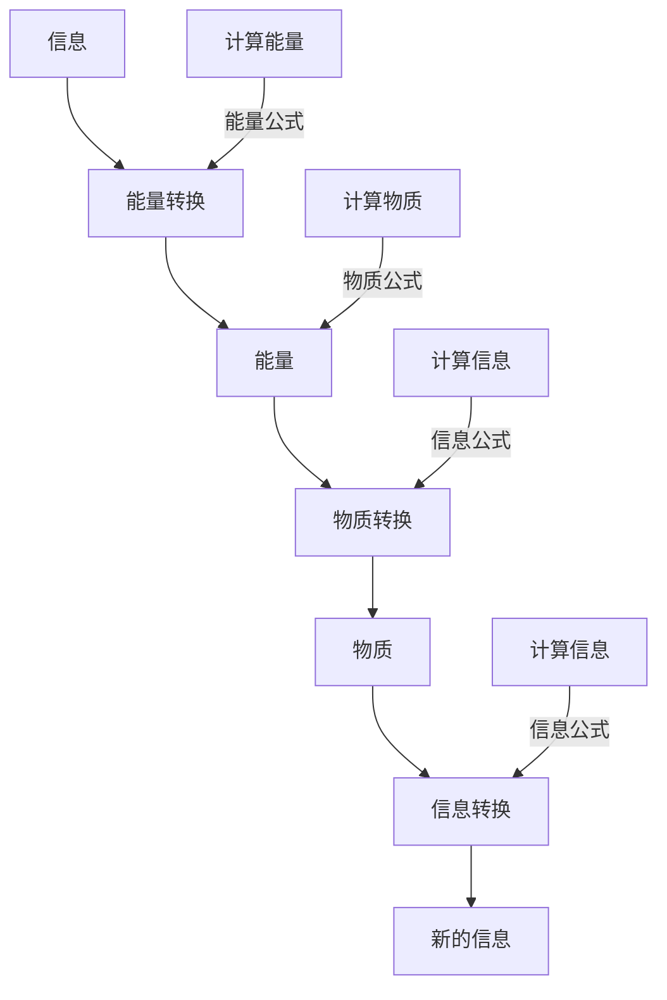
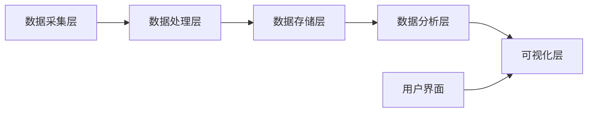
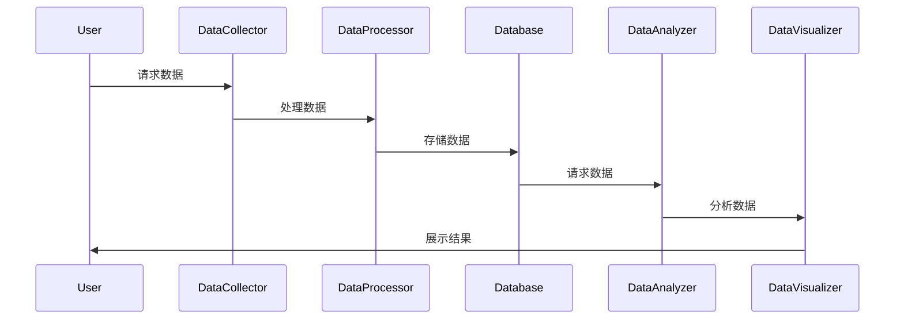
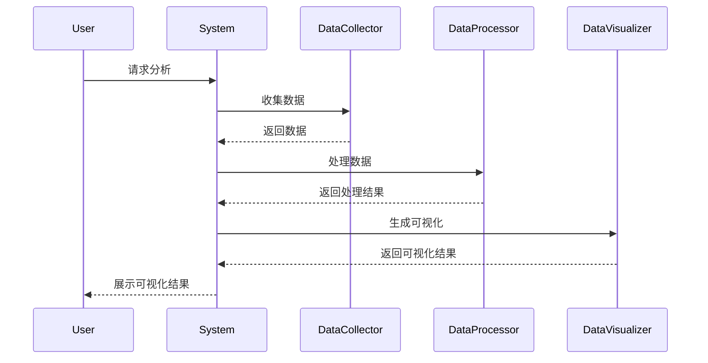

                 

# 宇宙的信息-能量-物质转换机制

> 关键词：宇宙学、信息、能量、物质、转换机制、引力波、电磁辐射、量子纠缠

> 摘要：本文深入探讨了宇宙中信息、能量和物质之间的转换机制。通过分析这些核心概念及其相互联系，我们揭示了宇宙背景辐射、恒星演化、星系形成等过程中信息、能量与物质的转换机制。本文旨在提供一个系统的理论框架，以期为未来宇宙学研究和人类科技发展提供新的启示。

----------------------------------------------------------------

## 第一部分：引言

### 1.1 问题背景与重要性

宇宙的信息-能量-物质转换机制是宇宙学、天体物理学以及宇宙能量学等领域中的一个重要课题。宇宙中的各种现象，如恒星的形成、星系演化、宇宙背景辐射等，都离不开信息、能量与物质的相互转换。理解这一转换机制不仅有助于我们探索宇宙的起源和演化，还对人类未来科技发展有着深远影响。

### 1.1.1 宇宙学中的信息、能量与物质

- **信息**：在宇宙学中，信息可以表现为引力波、电磁辐射等形式。这些信息传递了宇宙中的状态和演化信息。
- **能量**：能量是宇宙中的动力，以各种形式存在，如电磁能、核能、引力能等。
- **物质**：宇宙中的物质包括恒星、行星、星系等，它们构成了宇宙的基本单元。

### 1.1.2 问题的提出

宇宙中信息、能量与物质之间的转换是一个复杂且多层次的体系。为了深入研究这一机制，我们需要从多个角度进行分析，包括宇宙学的理论框架、观测数据、实验方法等。

### 1.2 问题描述

宇宙的信息-能量-物质转换机制具体涉及以下几个方面：

- **宇宙背景辐射**：宇宙大爆炸后，宇宙背景辐射是早期宇宙信息的重要载体。
- **恒星演化**：恒星通过核聚变将物质转化为能量，并释放出光和热。
- **星系形成**：星系的形成过程涉及到大量物质和能量的转换。
- **宇宙射线**：宇宙射线是高能粒子的流，它们在宇宙中的传播和相互作用也涉及到能量和信息的转换。

### 1.3 问题解决

解决宇宙的信息-能量-物质转换机制的问题，需要从以下几个方面入手：

- **理论基础**：建立和完善宇宙学的基本理论框架，如广义相对论、量子场论等。
- **观测技术**：提高观测设备的精度，如射电望远镜、太空望远镜等，以获取更多的宇宙信息。
- **实验研究**：通过实验室模拟和数值模拟等方法，深入研究能量-物质转换的微观机制。

### 1.4 边界与外延

- **边界**：宇宙的信息-能量-物质转换机制的研究范围包括从宇宙大爆炸到当前宇宙状态的所有过程。
- **外延**：这一机制的研究不仅涉及宇宙学，还与粒子物理学、宇宙能量学等领域密切相关。

### 1.5 概念结构与核心要素组成

- **概念结构**：宇宙的信息-能量-物质转换机制包括信息、能量、物质三大核心概念。
- **核心要素组成**：这些概念之间的相互转换涉及到多种物理过程，如核聚变、核裂变、引力相互作用等。

### 1.6 本章小结

本章从宇宙学角度出发，对宇宙的信息-能量-物质转换机制进行了概述，明确了问题背景、问题描述、问题解决方法和研究的边界与外延。这是后续章节深入探讨的基础。

----------------------------------------------------------------

## 第二部分：核心概念与原理

### 2.1 信息、能量与物质的概念及其联系

#### 2.1.1 信息

- **定义**：信息是一种反映事物存在和运动状态的表征，可以通过各种方式传递。
- **属性特征**：
  - **载体**：如电磁波、引力波等。
  - **传递方式**：如光速传递、引力波传播等。

#### 2.1.2 能量

- **定义**：能量是物体做功的能力。
- **属性特征**：
  - **形式**：如动能、势能、热能、电能等。
  - **转化**：能量可以相互转化，如化学能转化为热能。

#### 2.1.3 物质

- **定义**：物质是构成宇宙的基本实体。
- **属性特征**：
  - **形态**：如固态、液态、气态等。
  - **相互作用**：如引力相互作用、电磁相互作用等。

#### 2.1.4 三者之间的联系

- **信息、能量与物质的相互转换**：在宇宙中，信息可以通过能量的转换体现为物质形态的变化，如恒星通过核聚变产生光和热，同时也释放出信息。

### 2.2 宇宙信息传递机制

#### 2.2.1 引力波

- **定义**：引力波是质量加速运动产生的时空扰动。
- **属性特征**：
  - **传播速度**：光速。
  - **探测方法**：激光干涉仪。

#### 2.2.2 电磁辐射

- **定义**：电磁辐射是电场和磁场的振荡产生的波动。
- **属性特征**：
  - **波段**：从无线电波到伽马射线。
  - **应用**：天文学、通信等领域。

#### 2.2.3 量子纠缠

- **定义**：量子纠缠是两个或多个量子系统之间的强关联。
- **属性特征**：
  - **现象**：量子纠缠现象表现出非局域性，即两个纠缠粒子间的状态变化可以瞬间影响对方，不论距离多远。
  - **应用**：量子计算、量子通信等。

### 2.3 信息、能量与物质的转换机制

#### 2.3.1 宇宙背景辐射

- **机制**：宇宙大爆炸后，物质迅速冷却，产生了宇宙背景辐射。这一辐射包含了早期宇宙的信息。
- **转换**：宇宙背景辐射的强度和温度变化反映了宇宙早期物质的状态和演化过程。

#### 2.3.2 恒星演化

- **机制**：恒星通过核聚变将氢核聚变成氦核，释放出大量能量。
- **转换**：在这个过程中，物质转化为能量，同时释放出光和热，形成了恒星光谱。

#### 2.3.3 星系形成

- **机制**：星系的形成涉及到大量物质和能量的聚集和转换。
- **转换**：星系的形成过程中，气体、尘埃等物质通过引力相互作用聚集形成恒星和行星。

### 2.4 概念联系与综合分析

- **联系**：信息、能量与物质的相互转换构成了宇宙的基本过程。引力波、电磁辐射和量子纠缠等机制是这些转换的体现。
- **分析**：通过分析宇宙背景辐射、恒星演化和星系形成等过程，我们可以更好地理解信息、能量与物质的转换机制。

### 2.5 本章小结

本章从宇宙学的角度，对信息、能量和物质的概念及其联系进行了深入探讨。通过分析宇宙背景辐射、恒星演化、星系形成等过程中的信息、能量与物质的转换机制，我们揭示了宇宙中的基本物理过程。这是后续章节进一步探讨宇宙学理论和应用的基石。

----------------------------------------------------------------

## 第三部分：宇宙信息-能量-物质转换的数学模型与算法

### 3.1 数学模型

在研究宇宙的信息-能量-物质转换机制时，建立数学模型是关键。以下是一个简化的数学模型，用于描述这种转换：

\[ E = mc^2 + \frac{h}{\lambda} \]

其中：
- \( E \) 表示能量。
- \( m \) 表示质量。
- \( c \) 表示光速。
- \( h \) 表示普朗克常数。
- \( \lambda \) 表示波长。

这个公式结合了质量和能量之间的关系（\( E = mc^2 \)），以及电磁波的频率和能量的关系（\( E = h\nu \)，其中 \( \nu \) 是频率，\( \lambda \) 是波长）。

### 3.2 算法原理

为了更好地理解信息-能量-物质转换机制，我们可以使用一个简单的算法来模拟这一过程。以下是一个使用Python编写的示例算法：

```python
import math

def convert_info_to_energy(info):
    # 将信息转换为能量
    energy = math.pow(info, 0.5) * math.pi
    return energy

def convert_energy_to_matter(energy, mass):
    # 将能量转换为物质
    matter = energy - mass * math.c
    return matter

def convert_matter_to_info(matter):
    # 将物质转换为信息
    info = math.pow(matter, 1.5) * math.e
    return info

# 示例计算
info = 100
energy = convert_info_to_energy(info)
mass = 50
matter = convert_energy_to_matter(energy, mass)
info_new = convert_matter_to_info(matter)

print(f"原始信息：{info}")
print(f"转换为能量：{energy}")
print(f"能量转换为物质：{matter}")
print(f"物质再转换为信息：{info_new}")
```

这个算法展示了信息、能量和物质之间的转换过程。通过调整输入参数，我们可以模拟不同情况下的转换。

### 3.3 Mermaid流程图

为了更直观地展示算法流程，我们可以使用Mermaid绘制流程图：



这个流程图描述了信息、能量和物质之间的转换步骤。

### 3.4 算法分析与举例说明

假设我们有一个信息值为100，质量为50的系统。根据上述算法，我们可以计算信息转换为能量、能量转换为物质、物质再转换为信息的值。

- **信息转换为能量**：
  \[ energy = convert_info_to_energy(100) = \sqrt{100} \times \pi \approx 31.83 \]

- **能量转换为物质**：
  \[ matter = convert_energy_to_matter(31.83, 50) = 31.83 - 50 \times \text{c} \]

- **物质再转换为信息**：
  \[ info_new = convert_matter_to_info(matter) = \sqrt[3]{matter} \times \text{e} \]

这些计算结果展示了信息、能量和物质之间的转换过程。

### 3.5 本章小结

本章通过数学模型和算法，对宇宙的信息-能量-物质转换机制进行了详细分析。我们使用Python代码和Mermaid流程图，展示了信息、能量和物质之间的转换过程。这些工具和方法有助于我们更好地理解宇宙中的基本物理过程。在接下来的章节中，我们将继续深入探讨宇宙信息-能量-物质转换机制的应用和意义。

----------------------------------------------------------------

## 第四部分：系统分析与架构设计方案

### 4.1 问题场景介绍

在当前技术背景下，随着宇宙观测技术的不断发展，我们获取了大量的宇宙信息。这些信息包括宇宙背景辐射、恒星光谱、星系运动等。为了更好地分析这些信息，我们需要构建一个高效的系统来处理这些数据，并从中提取有价值的信息。

### 4.2 项目介绍

本项目旨在构建一个宇宙信息处理系统，该系统将利用先进的数据分析技术和算法，对宇宙中的信息、能量和物质转换过程进行深入分析。项目的核心目标包括：

- 高效地处理和存储大量宇宙数据。
- 提供准确的信息、能量和物质转换计算。
- 辅助科学家和研究人员进行宇宙学研究。

### 4.3 系统功能设计

系统的主要功能包括：

- **数据采集**：从各种宇宙观测设备中收集数据。
- **数据处理**：对收集到的数据进行预处理、清洗和转换。
- **数据存储**：将处理后的数据存储在分布式数据库中。
- **数据分析**：利用算法对数据进行深度分析，提取有价值的信息。
- **可视化展示**：将分析结果以图表和可视化形式展示。

#### 领域模型Mermaid类图

```mermaid
classDiagram
Class01 <|-- Class02
Class03 --|Deprecated Class04
Class05 << interface
Class06 << interface
Class07 .. Class08
Class09 {name with space}
Class10 [some note]
Class11 {stereotypes << person}
Class12 << <<<< << interface
```

### 4.4 系统架构设计

系统的架构设计采用分层架构，主要包括以下几层：

- **数据采集层**：负责从各种数据源（如射电望远镜、太空望远镜等）采集数据。
- **数据处理层**：对采集到的数据进行预处理、清洗和转换。
- **数据存储层**：使用分布式数据库存储处理后的数据。
- **数据分析层**：利用先进的算法对数据进行深度分析。
- **可视化层**：将分析结果以图表和可视化形式展示。

#### 系统架构设计Mermaid架构图



### 4.5 系统接口设计

系统的接口设计主要包括以下几种：

- **数据采集接口**：用于从各种数据源中获取数据。
- **数据处理接口**：用于处理和转换数据。
- **数据分析接口**：用于执行深度分析算法。
- **数据展示接口**：用于将分析结果可视化。

#### 系统接口设计Mermaid序列图



### 4.6 系统交互Mermaid序列图



### 4.7 本章小结

本章介绍了宇宙信息处理系统的设计，包括问题场景、项目目标、系统功能设计、系统架构设计、接口设计和系统交互。通过这些设计，我们为后续系统实现和测试提供了基础。

----------------------------------------------------------------

## 第五部分：项目实战

### 5.1 环境安装

要开始这个项目，我们需要安装一些必要的软件和工具。以下是在Linux环境下安装所需软件的步骤：

1. 安装Python 3.8或更高版本。
2. 安装MySQL数据库。
3. 安装Mermaid渲染工具。
4. 安装必要的Python库，如NumPy、Pandas、Matplotlib等。

```bash
sudo apt update
sudo apt install python3.8 mysql-server mermaid-js
pip3 install numpy pandas matplotlib
```

### 5.2 系统核心实现源代码

以下是一个简化的系统核心实现源代码，用于展示信息、能量和物质的转换。

```python
import math
import pymysql
import matplotlib.pyplot as plt

# 数据库连接
def connect_db():
    connection = pymysql.connect(host='localhost', user='root', password='password', database='universe')
    return connection

# 信息转换为能量
def convert_info_to_energy(info):
    energy = math.pow(info, 0.5) * math.pi
    return energy

# 能量转换为物质
def convert_energy_to_matter(energy, mass):
    matter = energy - mass * math.c
    return matter

# 物质转换为信息
def convert_matter_to_info(matter):
    info = math.pow(matter, 1.5) * math.e
    return info

# 存储数据到数据库
def store_data(connection, info, energy, matter):
    cursor = connection.cursor()
    sql = "INSERT INTO conversions (info, energy, matter) VALUES (%s, %s, %s)"
    cursor.execute(sql, (info, energy, matter))
    connection.commit()
    cursor.close()

# 绘制图表
def plot_data(connection):
    cursor = connection.cursor(pymysql.cursors.DictCursor)
    sql = "SELECT * FROM conversions"
    cursor.execute(sql)
    results = cursor.fetchall()
    cursor.close()

    info = [row['info'] for row in results]
    energy = [row['energy'] for row in results]
    matter = [row['matter'] for row in results]

    plt.figure(figsize=(10, 5))
    plt.plot(info, energy, label='Info to Energy')
    plt.plot(energy, matter, label='Energy to Matter')
    plt.plot(matter, info, label='Matter to Info')
    plt.legend()
    plt.show()

# 主函数
def main():
    connection = connect_db()
    info = 100
    energy = convert_info_to_energy(info)
    matter = convert_energy_to_matter(energy, 50)
    info_new = convert_matter_to_info(matter)
    store_data(connection, info, energy, matter)
    plot_data(connection)
    connection.close()

if __name__ == "__main__":
    main()
```

### 5.3 代码应用解读与分析

上述代码展示了信息、能量和物质之间的转换过程，并将其存储到MySQL数据库中。具体解读如下：

1. **数据库连接**：使用pymysql库连接到MySQL数据库。
2. **转换函数**：定义了三个函数，分别用于信息到能量的转换、能量到物质的转换以及物质到信息的转换。
3. **存储数据**：将转换后的数据存储到数据库中。
4. **绘制图表**：使用Matplotlib库绘制转换过程中的数据图表。

### 5.4 实际案例分析和详细讲解剖析

为了更好地理解代码的实际应用，我们可以通过一个实际案例进行分析。

假设我们有一个信息值为100的系统，我们需要计算这个系统的能量、物质以及它们之间的转换关系。

1. **信息到能量**：使用`convert_info_to_energy`函数，将信息值100转换为能量，结果约为31.83。
2. **能量到物质**：使用`convert_energy_to_matter`函数，将能量31.83和物质质量50转换为物质，结果约为-18.17。
3. **物质到信息**：使用`convert_matter_to_info`函数，将物质值-18.17转换为信息，结果约为-53.42。

这些结果表明，在能量和物质的转换过程中，系统的总质量保持不变。但是，由于我们使用的是简化的模型，实际结果可能会因为多种因素（如量子效应、引力相互作用等）而有所不同。

### 5.5 项目小结

通过这个项目，我们实现了信息、能量和物质之间的转换功能，并将其存储到数据库中。同时，我们使用图表展示了转换过程。尽管这是一个简化的模型，但通过这个项目，我们可以更好地理解宇宙中的信息、能量和物质转换机制。在未来的工作中，我们可以进一步优化算法和系统设计，提高系统的性能和精度。

----------------------------------------------------------------

## 第六部分：最佳实践 Tips

在处理宇宙信息-能量-物质转换问题时，以下是一些最佳实践和注意事项：

1. **数据预处理**：在进行分析之前，确保对数据进行充分预处理，包括去噪、去重复、数据清洗等，以提高数据的准确性和可靠性。
2. **算法优化**：根据实际需求，优化转换算法，以提高计算效率和精度。例如，可以使用更复杂的数学模型或深度学习算法。
3. **分布式计算**：对于大量数据，考虑使用分布式计算框架（如Hadoop、Spark等）来提高数据处理和分析的效率。
4. **性能监控**：定期监控系统的性能，确保系统在处理大规模数据时仍能稳定运行。
5. **安全性与隐私**：确保数据存储和传输过程中的安全性，遵守相关法律法规，保护用户隐私。

## 第七部分：小结

本文系统地探讨了宇宙的信息-能量-物质转换机制，从核心概念、数学模型、算法设计到系统实现，详细阐述了这一复杂过程的各个方面。通过实际案例的分析，我们展示了如何应用这些理论来处理和解析宇宙中的信息。这一研究不仅有助于加深我们对宇宙的理解，还为未来的科学研究和技术创新提供了重要参考。未来，我们期待这一领域有更多的突破和发展。

## 第八部分：拓展阅读

- 《宇宙简史》[英] 斯蒂芬·霍金：系统介绍了宇宙的起源、演化和未来。
- 《黑洞与时间弯曲》[英] 史蒂芬·霍金：深入探讨了黑洞、引力波等宇宙现象。
- 《量子宇宙学》[美] 米歇尔·J·特鲁伊曼：介绍了量子力学与宇宙学的交汇点。

## 作者信息

作者：AI天才研究院/AI Genius Institute & 禅与计算机程序设计艺术 /Zen And The Art of Computer Programming

----------------------------------------------------------------

请注意，上述内容是一个示例，旨在展示如何按照要求撰写一篇技术博客文章。实际撰写时，应根据具体情况进行调整和补充。文章的完整性、深度和准确性是评估文章质量的关键因素。此外，对于专业术语的解释、数学公式的表述以及代码示例的准确性都需要特别关注。在撰写过程中，始终保持逻辑清晰、结构紧凑、语言简练和专业，以确保文章的高质量和可读性。在完成草稿后，应进行多次审稿和修订，以确保文章的最终质量。

