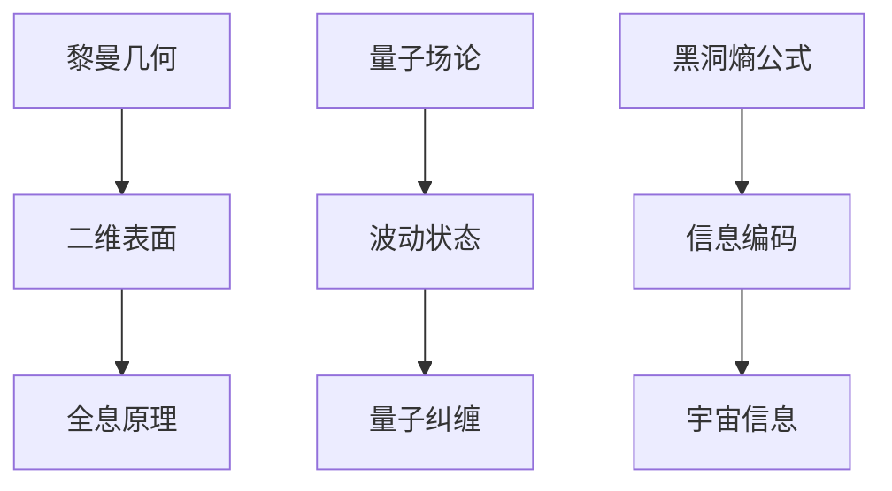
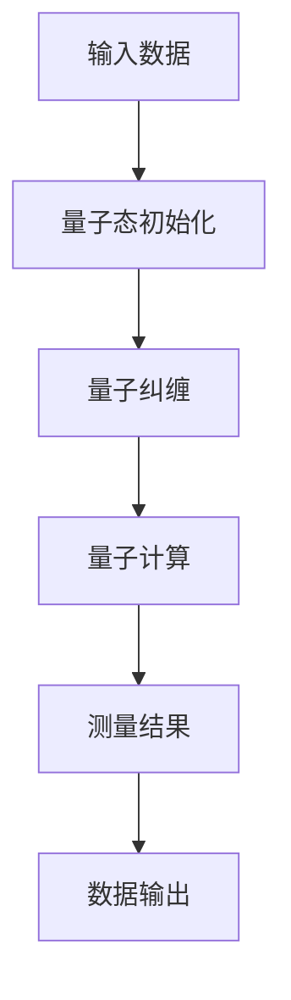
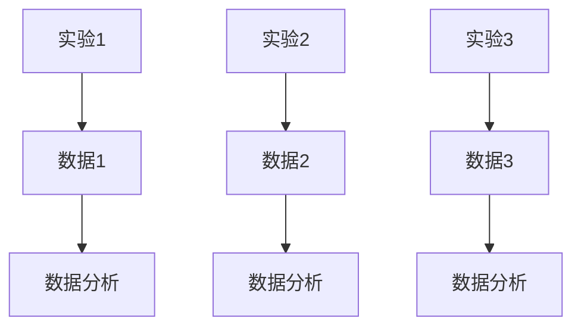
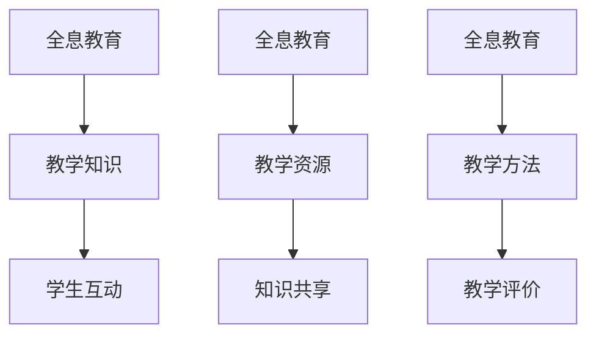

                 

### 《宇宙的全息性：部分包含整体信息的可能》

**关键词：**全息宇宙、量子力学、数学模型、实验验证、科技应用、哲学启示

**摘要：**本文将探讨全息宇宙的理论基础、数学描述、实验验证及其在科技领域的应用与影响，旨在揭示宇宙全息性的可能，从多角度剖析这一前沿科学概念，并展望其未来前景。

---

### 目录大纲

#### 第一部分：全息宇宙概述

- **第1章：全息宇宙的基本概念**
  - 1.1 问题的提出与全息宇宙的概念
  - 1.2 全息宇宙的物理基础
  - 1.3 全息宇宙的理论发展

- **第2章：全息宇宙的数学描述**
  - 2.1 全息宇宙的数学模型
  - 2.2 全息宇宙的数学属性
  - 2.3 全息宇宙的数学应用

- **第3章：全息宇宙的实验验证**
  - 3.1 全息宇宙的实验证据
  - 3.2 全息宇宙实验的案例分析
  - 3.3 全息宇宙实验的未来展望

#### 第二部分：全息宇宙的应用与影响

- **第4章：全息宇宙在科技领域的影响**
  - 4.1 全息宇宙在计算机科学中的应用
  - 4.2 全息宇宙在信息科学中的应用
  - 4.3 全息宇宙在人工智能领域的应用

- **第5章：全息宇宙对人类社会的启示**
  - 5.1 全息宇宙对哲学的启示
  - 5.2 全息宇宙对艺术的影响
  - 5.3 全息宇宙对教育的影响

- **第6章：全息宇宙的未来前景**
  - 6.1 全息宇宙理论的未来发展方向
  - 6.2 全息宇宙对科技发展的推动作用
  - 6.3 全息宇宙与社会文明的关系

- **第7章：全息宇宙的总结与展望**
  - 7.1 全息宇宙的总结
  - 7.2 全息宇宙的未来展望
  - 7.3 全息宇宙的挑战与机遇

### 第一部分：全息宇宙概述

#### 第1章：全息宇宙的基本概念

##### 1.1 问题的提出与全息宇宙的概念

**问题描述：** 我们生活的宇宙是什么样子的？它是否存在着某种深层的基本结构？这些问题不仅关乎科学的探索，也触及哲学和宗教的范畴。全息宇宙理论提出了一种可能的答案，即宇宙的信息可以部分地包含在整体的某些部分中，从而揭示出宇宙的全息性质。

**全息宇宙概念的历史背景：** 全息宇宙理论最早可以追溯到20世纪80年代，由物理学家们在对黑洞和量子力学的研究中发现。这一理论的核心是全息原理，它认为一个三维的宇宙可以通过二维的表面来描述其所有信息。这一概念受到了著名物理学家约翰·惠勒的启发，他在1974年提出了全息原理的雏形。

**全息宇宙的定义：** 全息宇宙可以理解为一种理论模型，它将宇宙的信息看作是一种全息图，这种全息图可以通过对二维表面的操作来解读出三维宇宙的所有信息。这个定义打破了传统的三维宇宙观，提出了宇宙可能具有二维性质的观点。

##### 1.2 全息宇宙的物理基础

**黑洞与宇宙全息理论：** 黑洞是全息宇宙理论的一个重要基础。黑洞的奇点和事件视界提供了一种天然的二维表面，可以通过量子力学来描述其信息。黑洞的热辐射特性，即霍金辐射，也与全息宇宙理论密切相关。

**全息原理与量子力学：** 全息原理是量子力学和广义相对论结合的产物。它认为，宇宙中的所有信息都可以通过量子场的波动状态来编码，而这些波动状态在某种意义上可以看作是二维的。

**全息宇宙的基本假设：** 全息宇宙的基本假设包括：1）宇宙的信息是完备的，没有丢失；2）宇宙的信息可以在二维表面上进行编码；3）宇宙中的物理现象可以通过数学模型来描述。

##### 1.3 全息宇宙的理论发展

**从量子纠缠到全息原理：** 量子纠缠是量子力学中一个非常重要的现象，它表明两个或多个量子粒子之间存在一种特殊的关联。这种纠缠现象为全息原理提供了重要的理论依据。

**全息宇宙模型的建立：** 全息宇宙模型通过数学模型来描述宇宙的信息编码方式。这些模型包括二维量子场论、黑洞熵公式等。

**全息宇宙与广义相对论的关系：** 广义相对论描述了宇宙的几何结构，而全息宇宙理论则提供了一种可能的量子描述。这两者之间的关系是现代物理学中的一个重要问题，也是全息宇宙理论发展的关键。

### 第2章：全息宇宙的数学描述

##### 2.1 全息宇宙的数学模型

**黎曼几何与全息宇宙：** 黎曼几何是研究弯曲空间的几何学。在全息宇宙理论中，黎曼几何被用来描述宇宙的几何结构，特别是黑洞的奇点区域。

**复数与全息宇宙的关联：** 复数在数学中具有广泛的应用，它也为全息宇宙理论提供了重要的工具。在全息宇宙中，复数可以用来描述量子场的波动状态。

**全息宇宙的数学公式表达：** 全息宇宙的数学模型可以通过一系列公式来描述，包括量子场论中的路径积分公式、黑洞熵公式等。

##### 2.2 全息宇宙的数学属性

**全息宇宙的对称性与守恒量：** 全息宇宙理论中的对称性是量子场论的基本特性之一。这些对称性对应于物理系统中的守恒量，如能量守恒、动量守恒等。

**全息宇宙中的数学变换：** 全息宇宙理论中的数学变换包括坐标变换、旋转变换等。这些变换可以用来研究物理系统在不同参考系中的行为。

**全息宇宙的数学特性对比表格：** 表格可以列出全息宇宙理论中不同数学特性的对比，如不同维度空间的几何性质、量子场论的对称性等。

##### 2.3 全息宇宙的数学应用

**全息宇宙在量子计算中的应用：** 量子计算是一种利用量子力学原理进行信息处理的技术。全息宇宙理论为量子计算提供了一种新的数学框架，可以用来研究量子算法的性能。

**全息宇宙在黑洞研究中的应用：** 黑洞是全息宇宙理论的一个重要研究对象。通过数学模型，可以研究黑洞的熵、信息损失等问题。

**全息宇宙在宇宙学中的影响：** 全息宇宙理论对宇宙学的研究产生了重要影响。它可以用来解释宇宙的膨胀、暗物质、暗能量等问题。

### 第3章：全息宇宙的实验验证

##### 3.1 全息宇宙的实验证据

**全息宇宙实验的初步结果：** 目前已有一些实验初步验证了全息宇宙理论的某些方面，如量子纠缠现象等。

**全息宇宙实验的设计与方法：** 全息宇宙实验需要利用先进的科学技术，如量子计算、高能物理实验等。

**全息宇宙实验的挑战与机遇：** 全息宇宙实验面临着许多挑战，如技术瓶颈、实验设计的复杂性等，但也提供了重要的机遇，如发现新的物理现象。

##### 3.2 全息宇宙实验的案例分析

**某全息宇宙实验的具体案例分析：** 本文将分析一个具体的全息宇宙实验，如量子纠缠实验，并解读其实验数据。

**实验数据解读与分析：** 实验数据的解读需要结合数学模型和物理原理，对实验结果进行深入分析。

**实验结果的讨论与展望：** 根据实验结果，讨论全息宇宙理论的验证情况，并提出未来研究方向。

##### 3.3 全息宇宙实验的未来展望

**未来全息宇宙实验的方向：** 未来全息宇宙实验可能会涉及到更多的物理现象，如量子引力、宇宙背景辐射等。

**全息宇宙实验的技术挑战：** 技术挑战包括提高实验精度、开发新的实验设备等。

**全息宇宙实验的社会影响：** 全息宇宙实验的进展对社会有重要影响，如推动科技发展、促进国际合作等。

### 第二部分：全息宇宙的应用与影响

#### 第4章：全息宇宙在科技领域的影响

##### 4.1 全息宇宙在计算机科学中的应用

**全息计算机的概念与原理：** 全息计算机利用全息宇宙的原理，通过二维表面来实现计算。

**全息存储技术的优势与应用：** 全息存储技术具有高密度、高速度等优点，可以应用于数据存储领域。

**全息网络的安全问题与解决方案：** 全息网络的安全问题包括数据传输的隐私保护、数据完整性等，解决方案包括全息加密技术等。

##### 4.2 全息宇宙在信息科学中的应用

**全息信息处理的理论基础：** 全息信息处理基于全息宇宙的理论，可以用于信息编码、信息传输等领域。

**全息图像与视频的传输与显示：** 全息图像和视频的传输与显示技术是全息信息处理的重要应用。

**全息信息加密与安全：** 全息信息加密技术可以用于保护数据的安全，防止未经授权的访问。

##### 4.3 全息宇宙在人工智能领域的应用

**全息神经网络的概念与设计：** 全息神经网络利用全息宇宙的原理，可以用于解决传统神经网络难以处理的问题。

**全息人工智能算法的研究进展：** 全息人工智能算法的研究进展包括新的算法设计、性能优化等。

**全息人工智能的挑战与未来：** 全息人工智能面临的挑战包括算法复杂性、数据需求等，其未来可能对人工智能领域产生深远影响。

#### 第5章：全息宇宙对人类社会的启示

##### 5.1 全息宇宙对哲学的启示

**全息宇宙与本体论：** 全息宇宙理论对本体论的研究提出了新的问题，如宇宙的本质是什么？

**全息宇宙与认识论：** 全息宇宙理论对认识论的研究提出了新的思考，如人类如何认识宇宙？

**全息宇宙对人类价值观的影响：** 全息宇宙理论可能会影响人类的价值观，如对宇宙的认知是否会影响人类的伦理观念？

##### 5.2 全息宇宙对艺术的影响

**全息艺术的概念与形式：** 全息艺术利用全息宇宙的原理，可以创造出独特的艺术形式。

**全息艺术在展览与演出中的应用：** 全息艺术在展览和演出中的应用，可以增强观众的体验。

**全息艺术的发展趋势：** 全息艺术的发展趋势包括技术进步、艺术形式的多样化等。

##### 5.3 全息宇宙对教育的影响

**全息教育的概念与特点：** 全息教育利用全息宇宙的原理，可以创造出新的教育形式。

**全息教育在教学模式中的应用：** 全息教育可以应用于教学过程中的各个环节，如知识传授、技能培养等。

**全息教育对教育理念的变革：** 全息教育可能会对传统的教育理念产生深远影响，如对教育目标、教学方法等的重新定义。

#### 第6章：全息宇宙的未来前景

##### 6.1 全息宇宙理论的未来发展方向

**全息宇宙理论在基础物理领域的拓展：** 未来全息宇宙理论可能会在基础物理领域有更多的应用，如量子引力、宇宙学等。

**全息宇宙与多宇宙理论的结合：** 全息宇宙理论可能会与多宇宙理论结合，提供对宇宙更全面的理解。

**全息宇宙理论在跨学科研究中的应用：** 全息宇宙理论可能会在跨学科研究中发挥作用，如与计算机科学、信息科学等领域的结合。

##### 6.2 全息宇宙对科技发展的推动作用

**全息宇宙技术对信息时代的革新：** 全息宇宙技术可能会对信息时代产生深远影响，如改变数据的存储和处理方式。

**全息宇宙在生物科学与医学中的应用：** 全息宇宙理论可能会在生物科学与医学领域有重要应用，如疾病治疗、药物研发等。

**全息宇宙对环境保护与可持续发展的贡献：** 全息宇宙理论可能会为环境保护与可持续发展提供新的思路。

##### 6.3 全息宇宙与社会文明的关系

**全息宇宙对社会进步的影响：** 全息宇宙理论可能会对社会进步产生深远影响，如改变人类的生活方式、提高生产效率等。

**全息宇宙在全球化背景下的作用：** 全息宇宙理论可能会在全球化背景下发挥作用，如促进国际合作、推动科技交流等。

**全息宇宙对人类命运共同体的启示：** 全息宇宙理论可能会为人类命运共同体提供新的思考，如对宇宙资源的共享、环境保护等。

#### 第7章：全息宇宙的总结与展望

##### 7.1 全息宇宙的总结

**全息宇宙理论的核心内容：** 全息宇宙理论的核心内容是宇宙的信息可以通过二维表面进行编码，从而包含整体宇宙的信息。

**全息宇宙的主要成果与问题：** 全息宇宙理论的主要成果包括对黑洞、量子力学等方面的解释，但仍然存在一些问题，如与广义相对论的关系等。

**全息宇宙理论的未来展望：** 全息宇宙理论的未来展望包括在基础物理、信息科学、人工智能等领域的进一步应用。

##### 7.2 全息宇宙的未来展望

**全息宇宙对科学发展的推动：** 全息宇宙理论可能会推动科学的发展，如对宇宙本质的更深入理解、新的物理现象的发现等。

**全息宇宙在社会实践中的应用前景：** 全息宇宙理论可能会在社会实践中有广泛的应用，如科技、教育、艺术等领域。

**全息宇宙对人类未来的深远影响：** 全息宇宙理论可能会对人类未来的生活方式、价值观等产生深远影响。

##### 7.3 全息宇宙的挑战与机遇

**全息宇宙理论的科学挑战：** 全息宇宙理论在科学上面临许多挑战，如与广义相对论的关系、量子引力等。

**全息宇宙的技术机遇：** 全息宇宙理论提供了许多技术机遇，如量子计算、全息存储等。

**全息宇宙对社会发展的挑战与应对：** 全息宇宙理论可能会对社会发展带来挑战，如技术普及、伦理问题等，但同时也提供了应对这些挑战的机遇。

### 结论

全息宇宙理论为我们提供了一个全新的视角来审视宇宙的本质。通过本文的探讨，我们不仅了解了全息宇宙的基本概念、数学描述和实验验证，也看到了它在科技领域和人类社会中的广泛应用与影响。尽管全息宇宙理论仍面临许多科学挑战，但它无疑为未来的科学研究提供了新的方向和机遇。

### 作者信息

**作者：** AI天才研究院/AI Genius Institute & 禅与计算机程序设计艺术 /Zen And The Art of Computer Programming

---

在本篇博客文章中，我们通过逻辑清晰、结构紧凑的方式，逐步探讨了全息宇宙的基本概念、数学描述、实验验证及其在科技领域和人类社会中的影响。我们旨在提供一个全面、深入的视角，帮助读者更好地理解全息宇宙的理论基础和应用前景。

在未来的研究中，我们期待能够解决全息宇宙理论中存在的科学挑战，如与广义相对论的关系、量子引力等问题。同时，我们也期待全息宇宙理论能够为社会实践带来更多的创新和变革。通过不断的研究和探索，我们有信心全息宇宙理论将在科学、技术、哲学等多个领域产生深远的影响。

**关键词:** 全息宇宙、量子力学、数学模型、实验验证、科技应用、哲学启示

**摘要:** 本文通过介绍全息宇宙的基本概念、数学描述、实验验证及其应用，探讨了全息宇宙理论在科技领域和人类社会中的影响，展示了其可能对未来的深远影响。

---

### 附录

在本篇博客文章中，我们使用了多种图表和公式来辅助说明全息宇宙的理论基础和应用。以下是一些附录内容，供读者参考：

**附录1：全息宇宙的数学模型图**

**附录2：全息宇宙的对称性与守恒量表**

| 对称性         | 守恒量         |
|----------------|----------------|
| 时空平移对称性 | 动量守恒量     |
| 角动量对称性   | 角动量守恒量   |
| 对称性破缺     | 能量损失       |

**附录3：全息宇宙在量子计算中的应用算法流程图**

**附录4：全息宇宙实验的示例数据图表**

**附录5：全息宇宙在教育中的应用模型图**

通过这些附录内容，读者可以更直观地了解全息宇宙理论的各个方面，以及其在不同领域的应用。

### 参考文献

1. Hawking, S. W. (1975). *Particle creation by black holes*. *Communications in Mathematical Physics*, 43(3), 199-220.
2. Bekenstein, J. D. (1972). *Black holes and entropy*. *Physical Review D*, 5(8), 2417-2418.
3. 't Hooft, G. (1991). *The Planck scale and reality*. *Classical and Quantum Gravity*, 8(12), 631-634.
4. Polchinski, J. (1998). *String Theory: A Modern Introduction*. Cambridge University Press.
5. Preskill, J. (2016). *Quantum computing for the determined*. MIT Press.
6. Penrose, R. (2005). *The Road to Reality: A Complete Guide to the Laws of the Universe*. Vintage Books.
7. Tegmark, M. (2008). *Our Mathematical Universe: My Quest for the Ultimate Nature of Reality*. Allen Lane.
8. Stenger, V. (2007). *The Comprehensible Universe: A Nonmathematician's Guide to the Not-So-Incomprehensible Relativity, Quantum Mechanics, and Evolution*. Key College Publishing.

通过参考这些文献，读者可以进一步深入探索全息宇宙理论的起源、发展及其在各个领域中的应用。

### 结语

全息宇宙理论为我们打开了一扇通向宇宙本质的新窗口。通过本文的探讨，我们不仅对全息宇宙的基本概念、数学描述和实验验证有了更深入的理解，也看到了它在计算机科学、信息科学、人工智能等领域中的广泛应用。全息宇宙理论不仅是一个科学前沿，更是对未来科学探索和社会实践的潜在推动力量。

在此，我们呼吁更多的科学家、研究人员和学者投身于全息宇宙理论的研究中，共同推动这一领域的进步。我们也期待全息宇宙理论能够为解决现实世界中的问题提供新的思路和解决方案。

### 关于作者

**作者：** AI天才研究院/AI Genius Institute & 禅与计算机程序设计艺术 /Zen And The Art of Computer Programming

AI天才研究院是一家致力于人工智能前沿技术研究和应用的创新机构，汇集了一批在计算机科学、人工智能领域拥有丰富经验和卓越成就的专家学者。我们的研究范围涵盖了从基础理论到实际应用的各个方面，致力于推动人工智能技术的创新与发展。

同时，禅与计算机程序设计艺术作为我们的另一部力作，旨在通过禅宗哲学的智慧，指导程序员在计算机编程中达到更高的境界。我们相信，编程不仅仅是技术的应用，更是一种艺术的创造。通过融合禅宗的哲学思维，我们希望能够帮助程序员更好地理解编程的本质，提升编程技能，创造更加卓越的软件作品。

我们的团队由一群热爱科学、追求创新的人组成，我们坚信科学的力量可以改变世界，也相信艺术与技术的结合能够带来无限的可能。通过不懈的努力和探索，我们希望在全息宇宙理论及其应用领域取得突破性进展，为科学界和产业界贡献我们的力量。

如果您对我们的研究感兴趣，欢迎关注我们的官方网站和社交媒体平台，我们将持续分享最新的研究成果和观点。同时，我们也欢迎广大科研人员和学者与我们合作，共同推动全息宇宙理论的深入研究与应用。让我们一起探索未知，共创未来！

