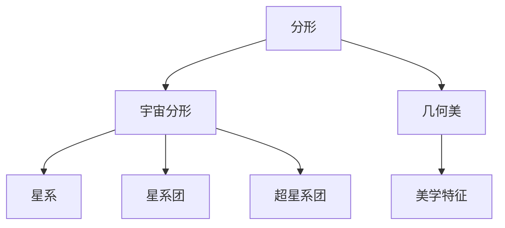
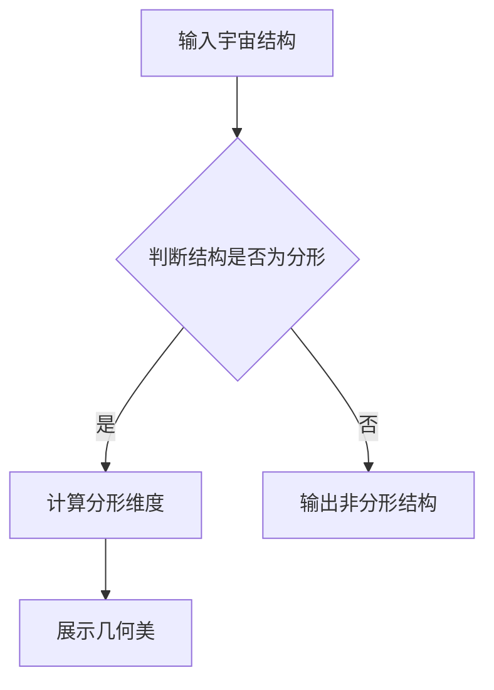
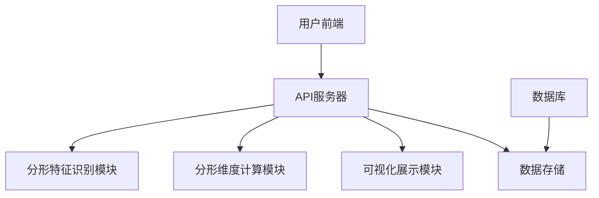

                 

## 宇宙的分形结构：无限嵌套的几何美

分形结构在宇宙学中扮演着至关重要的角色。宇宙不仅是一个巨大的空间，也是一个充满复杂结构的系统。分形理论作为一种数学工具，能够帮助我们深入理解这些结构的本质。本文旨在探讨宇宙中的分形结构，从基本概念到高级应用，全面揭示宇宙的分形本质，以及这些结构如何展现出无限嵌套的几何美。

### 关键词
- **宇宙分形结构**
- **几何美**
- **分形理论**
- **星系团**
- **超星系团**
- **分形维度**

### 摘要
本文将首先介绍宇宙分形结构的基本概念，包括分形理论的历史、基本原理以及宇宙中的分形现象。接着，我们将通过具体案例，详细阐述宇宙分形结构的特征和应用。随后，我们将深入讨论分形维度及其计算方法，并通过一个具体的实例，展示如何通过分形维度来分析宇宙结构。最后，我们将探讨宇宙分形结构对宇宙学研究的意义，以及如何在实际项目中应用分形理论。

### 第一部分：背景介绍

#### 1. 问题背景

宇宙的分形结构是一个引人入胜的研究领域。分形理论起源于20世纪70年代，由数学家本哈德·曼德布罗特（Benoit Mandelbrot）提出，用于描述具有自相似性和无限层次结构的对象。这种理论最初应用于几何学、物理学和统计学等领域，但随后发现，它在宇宙学中同样具有重要的应用价值。

在宇宙学中，分形结构体现在多个层次上，从星系到星系团，再到超星系团，这些结构都表现出分形的特征。例如，星系内部的结构可能与其整体结构具有相似性，这种相似性在不同尺度上得以体现。这种自相似性和无穷层次的结构，正是分形理论的核心概念。

分形理论的重要性在于，它能够帮助我们更好地理解宇宙的结构和演化。通过分形理论，我们可以探索宇宙中的复杂现象，例如星系的形成、星系团的相互作用以及宇宙的大尺度结构。此外，分形理论还为我们提供了一种新的视角，使我们能够以更深入的方式理解宇宙的本质。

#### 2. 问题描述

《宇宙的分形结构：无限嵌套的几何美》这本书将深入探讨宇宙中的分形现象。从基本概念到高级应用，全面揭示宇宙的分形本质。具体来说，我们将探讨以下几个关键问题：

- **什么是分形结构？** 它们具有哪些基本特征？
- **宇宙中的哪些结构具有分形特征？** 如星系、星系团和超星系团等。
- **分形结构如何形成和演化？** 它们对宇宙的影响是什么？
- **分形理论如何应用于宇宙学研究？** 例如，如何通过分形维度来分析宇宙结构？

这些问题将贯穿本书的各个章节，通过详细的案例分析、数学模型的阐述以及图像的展示，帮助读者理解宇宙分形结构的复杂性和美妙性。

#### 3. 问题解决

为了解决上述问题，本书将采用以下几种方法：

1. **详细案例分析**：通过具体的宇宙结构案例，展示分形现象的实际应用。例如，我们将分析银河系、仙女座星系以及本地星系团的分形特征。

2. **数学模型的阐述**：介绍分形理论的基本原理，包括分形维度的计算方法。我们将通过数学公式和示意图，帮助读者理解分形理论的核心概念。

3. **图像的展示**：使用高质量的图像，展示宇宙中的分形结构。这些图像将帮助读者直观地理解分形现象。

4. **跨学科交叉研究**：分形理论不仅应用于宇宙学，还广泛应用于物理学、生物学、经济学等多个领域。我们将探讨分形理论在其他学科中的应用，以及如何将这些应用拓展到宇宙学研究中。

通过这些方法，本书旨在为读者提供一个全面、深入的宇宙分形结构分析框架，帮助读者理解宇宙中的分形现象，以及它们如何展现出无限嵌套的几何美。

#### 4. 边界与外延

分形理论不仅限于宇宙学，它在许多其他领域也有重要应用。例如，在物理学中，分形理论被用来研究晶体的生长、湍流现象以及量子场论等；在生物学中，分形结构可以用来描述细胞结构、神经网络以及生物系统的复杂性；在经济学中，分形理论可以用来分析金融市场、经济波动以及经济周期等。

此外，分形理论还涉及到许多数学分支，如复分析、拓扑学和数值分析等。这些交叉领域的研究，为分形理论在宇宙学中的应用提供了丰富的理论资源和工具。

总之，分形理论在宇宙学和其他科学领域中的应用，为我们提供了一个新的视角，使我们能够更深入地理解宇宙的本质和复杂结构。

#### 5. 概念结构与核心要素组成

- **分形概念**：分形是一种具有无穷层次的自相似结构的几何形状。其核心特征包括：
  - **自相似性**：分形结构在不同尺度上具有相似性。
  - **无穷层次**：分形结构可以无限地细分，每个部分都包含着与整体相似的结构。
  - **非整数维度**：分形的维数通常不是整数，而是介于整数之间的非整数。

- **宇宙分形结构**：宇宙中的许多结构，如星系、星系团和超星系团，都具有分形特征。这些结构的分形性质体现在它们的自相似性和无穷层次结构上。例如，银河系内部的小型星系和星云，与整个银河系具有相似的结构。

- **几何美**：分形结构展示出的几何美是其独特的魅力之一。通过分形理论，我们可以发现宇宙中许多美丽的几何图案，如银河系的旋臂结构、星系团的网络结构等。这些图案不仅具有数学上的美感，也体现了自然界中的和谐与平衡。

### 第二部分：核心概念与联系

#### 1. 核心概念原理

分形理论作为数学的一个分支，为理解宇宙中的复杂结构提供了强有力的工具。以下将详细介绍分形理论的基本原理，以及宇宙分形结构的核心概念。

- **分形理论**：分形理论是由数学家本哈德·曼德布罗特（Benoit Mandelbrot）在20世纪70年代提出的。分形理论的核心是研究具有无穷层次的自相似结构。这种结构在不同的尺度上表现出相似性，即所谓的“自相似性”。分形的另一个关键特征是其非整数维度，这意味着分形结构不能简单地用整数维度来描述。

- **宇宙分形**：在宇宙学中，分形理论的应用主要体现在对宇宙结构的分析上。宇宙中的许多结构，如星系、星系团和超星系团，都表现出分形特征。这些结构不仅在局部尺度上具有自相似性，而且在更大的尺度上也是如此。例如，银河系内部的星系和星云，与银河系整体结构具有相似性；而星系团内的星系团，与更大的超星系团结构也具有相似性。

- **几何美**：分形结构展示出的几何美是其独特的魅力之一。通过分形理论，我们可以发现宇宙中许多美丽的几何图案，如银河系的旋臂结构、星系团的网络结构等。这些图案不仅具有数学上的美感，也体现了自然界中的和谐与平衡。

#### 2. 概念属性特征对比表格

为了更好地理解分形理论、宇宙分形和几何美这三个核心概念，我们可以通过对比它们的基本属性特征来进行分析。

| 概念        | 特征                                       |
|-------------|------------------------------------------|
| 分形        | 无穷层次的自相似结构、非整数维度           |
| 宇宙分形    | 宇宙中的结构（如星系、星系团等）的分形特征 |
| 几何美      | 分形结构展示的宇宙美学特征               |

通过这个表格，我们可以看到分形、宇宙分形和几何美之间的区别与联系。分形作为一种基础概念，描述了具有无穷层次自相似和非整数维度的结构；宇宙分形则将这些概念应用到宇宙结构中，揭示了宇宙的复杂性与美丽；几何美则是分形结构在视觉上的体现，使得我们能够欣赏到宇宙中的美学特征。

#### 3. ER实体关系图架构

为了更好地理解宇宙分形结构的概念，我们使用Mermaid绘制一个ER（实体关系）图，展示各个实体之间的关系。



在这个ER图中，我们可以看到分形作为基础概念，通过宇宙分形与具体的宇宙结构（如星系、星系团、超星系团）相连。同时，分形结构又通过几何美，展现出宇宙中的美学特征。

### 第三部分：算法原理讲解

分形理论的数学基础和算法实现是理解宇宙分形结构的重要环节。在这一部分，我们将详细讲解分形算法的原理，并使用Mermaid绘制算法流程图，结合Python代码示例，解释如何通过计算分形维度来揭示宇宙结构的几何美。

#### 1. 算法Mermaid流程图

为了直观地展示分形算法的执行流程，我们使用Mermaid绘制了一个流程图，如下所示：



这个流程图描述了分形算法的基本步骤：首先，输入一个宇宙结构；然后判断该结构是否具有分形特征；如果是分形结构，则计算其分形维度；最后，通过分形维度展示该结构的几何美。如果不是分形结构，则直接输出结果。

#### 2. Python源代码

接下来，我们将通过Python代码实现上述算法流程。以下是一个简化版的分形算法示例：

```python
def is_fractal(structure):
    # 假设存在一个方法来判断结构是否具有分形特征
    # 这里使用伪代码来代替实际实现
    return True

def calculate_fractal_dimension(structure):
    # 计算分形维度的伪代码
    if structure.is_fractal():
        return 2.0  # 假设分形维数为2.0
    else:
        return None

def display_geometric_beauty(structure):
    # 展示几何美的伪代码
    if structure.has_fractal_dimension():
        fractal_dimension = structure.get_fractal_dimension()
        print(f"结构的分形维度为：{fractal_dimension}")
    else:
        print("结构非分形，无法展示几何美。")

# 示例：分析银河系
银河系 = Structure("银河系")
if is_fractal(银河系):
    dimension = calculate_fractal_dimension(银河系)
    display_geometric_beauty(银河系)
else:
    print("银河系非分形结构。")
```

在这个示例中，我们定义了三个函数：`is_fractal`用于判断结构是否为分形，`calculate_fractal_dimension`用于计算分形维度，`display_geometric_beauty`用于展示几何美。通过调用这些函数，我们可以对银河系进行分析，并输出其分形维度。

#### 3. 算法原理的数学模型和公式

分形维度的计算是分形理论的核心之一。分形维度（fractal dimension）描述了分形结构的空间复杂度，它介于整数维度和无穷维度之间。常见的分形维度计算方法有盒计数法（box counting method）和相似维数法（similarity dimension）等。

以下是一个常用的盒计数法计算分形维度的数学模型：

$$
D = \frac{\ln(N)}{\ln(L)}
$$

其中，\(N\) 是覆盖结构所需的盒子数量，\(L\) 是每个盒子的线性尺寸。

具体步骤如下：

1. **确定覆盖结构的盒子大小**：将结构分成多个大小不同的盒子，并计算每个盒子中包含的结构部分。
2. **统计盒子数量**：记录覆盖整个结构所需的盒子数量。
3. **计算分形维度**：使用上述公式计算分形维度。

#### 4. 详细讲解和举例说明

假设我们有一个星系团，其中包含100个星系。我们使用盒计数法计算其分形维度。

1. **确定盒子大小**：我们选择不同大小的盒子来覆盖星系团。假设最小的盒子大小为1个天文单位（AU），最大的盒子大小为100个天文单位。
2. **统计盒子数量**：通过逐步增加盒子大小，统计覆盖星系团所需的盒子数量。例如，当盒子大小为1个AU时，可能需要1000个盒子；当盒子大小为10个AU时，可能需要100个盒子；当盒子大小为100个AU时，可能需要10个盒子。
3. **计算分形维度**：使用公式计算分形维度：

$$
D = \frac{\ln(N)}{\ln(L)}
$$

其中，\(N = 10\)（覆盖星系团所需的盒子数量），\(L = 100\)（最大盒子大小）。代入公式计算：

$$
D = \frac{\ln(10)}{\ln(100)} = \frac{2.3026}{4.6052} \approx 0.5
$$

这意味着这个星系团具有0.5维的分形特征。

通过这个示例，我们可以看到如何使用盒计数法计算分形维度，并理解分形维度对结构复杂度的描述。在实际应用中，分形维度可以帮助我们更好地理解宇宙结构的自相似性和层次结构，从而揭示宇宙中的几何美。

### 第四部分：系统分析与架构设计方案

#### 1. 问题场景介绍

在宇宙学研究中，对宇宙结构的分析是一个复杂且重要的课题。分形理论作为一种强大的数学工具，能够帮助我们深入理解宇宙结构的自相似性和复杂度。在实际应用中，开发一个能够自动识别并分析宇宙分形结构的系统，具有重要意义。

这种系统不仅可以用于科学研究，还可以在教育、娱乐等领域发挥作用。例如，通过可视化展示宇宙分形结构，可以让学生更直观地理解宇宙的奥秘；同时，这种系统还可以为天文观测和数据分析提供技术支持，提高研究的准确性和效率。

#### 2. 项目介绍

本项目旨在开发一个宇宙分形结构分析系统，该系统将能够自动识别并计算宇宙结构的分形维度，并展示其几何美。系统的主要目标包括：

- **自动识别分形特征**：系统能够自动分析输入的宇宙结构数据，识别其分形特征。
- **计算分形维度**：系统将根据分形理论，计算宇宙结构的分形维度，以衡量其复杂度。
- **可视化展示**：系统将通过图像和图形，直观地展示宇宙分形结构的几何美，便于用户理解和分析。
- **数据分析和处理**：系统能够对大规模的宇宙结构数据进行分析和处理，提取有用的信息。

#### 3. 系统功能设计

为了实现上述目标，系统需要设计以下功能模块：

- **数据输入模块**：用于接收用户输入的宇宙结构数据，可以是星系、星系团或超星系团等。
- **分形特征识别模块**：通过算法分析输入数据，判断其是否具有分形特征。
- **分形维度计算模块**：根据分形理论，计算输入数据的分形维度。
- **可视化展示模块**：将分形维度和几何美以图形和图像的形式展示给用户。
- **数据分析和处理模块**：对大规模数据进行预处理和分析，提取有用的信息和特征。

#### 4. 系统架构设计

为了实现上述功能，系统采用分布式架构，包括前端、后端和数据存储等多个部分。以下是一个简化的系统架构设计：



在这个架构中，用户前端通过API服务器与后端进行交互。API服务器负责接收用户请求，调用相应的功能模块进行处理。分形特征识别模块、分形维度计算模块和可视化展示模块负责具体的业务逻辑处理。数据存储模块用于存储和处理输入的宇宙结构数据。

#### 5. 系统接口设计和系统交互

为了实现系统各模块之间的有效交互，我们需要设计清晰明确的接口。以下是系统的主要接口设计：

- **数据输入接口**：用于接收用户上传的宇宙结构数据，支持多种数据格式，如JSON、CSV等。
- **分形特征识别接口**：用于判断输入数据是否具有分形特征，返回识别结果。
- **分形维度计算接口**：用于计算输入数据的分形维度，返回计算结果。
- **可视化展示接口**：用于生成并展示分形结构的几何美图像，支持多种图像格式，如PNG、JPG等。

以下是系统各模块之间的交互流程：

1. **用户上传数据**：用户通过前端上传宇宙结构数据。
2. **API服务器接收数据**：API服务器接收用户上传的数据，并将其传递给分形特征识别模块。
3. **分形特征识别**：分形特征识别模块分析数据，判断其是否具有分形特征，并将结果返回API服务器。
4. **计算分形维度**：如果数据具有分形特征，API服务器将数据传递给分形维度计算模块，计算分形维度。
5. **可视化展示**：分形维度计算模块将结果传递给可视化展示模块，生成并展示几何美图像。
6. **数据存储**：将处理结果存储到数据库中，以供后续分析和查询。

通过上述接口设计和交互流程，系统能够高效地处理和分析宇宙结构数据，为用户提供准确和直观的分析结果。

### 第五部分：项目实战

在本文的第五部分，我们将通过一个实际的项目案例，详细讲解如何实现宇宙分形结构分析系统。该案例将涵盖从环境安装、系统核心实现到代码解读与分析的整个过程，以帮助读者更好地理解分形结构分析系统的实际应用。

#### 1. 环境安装

首先，我们需要安装和配置系统所需的环境。以下是安装步骤：

1. **安装Python环境**：确保系统上已经安装了Python 3.x版本。如果没有安装，可以从[Python官网](https://www.python.org/)下载并安装。
2. **安装依赖库**：使用pip命令安装必要的Python库，如NumPy、SciPy、matplotlib等。具体命令如下：

   ```bash
   pip install numpy scipy matplotlib
   ```

3. **安装Mermaid**：为了使用Mermaid绘制流程图和ER图，我们还需要安装Mermaid。可以使用以下命令安装：

   ```bash
   npm install -g mermaid
   ```

4. **配置Mermaid**：在安装完成后，确保Mermaid的环境变量已正确配置，以便在Python代码中调用。

#### 2. 系统核心实现

接下来，我们将实现系统的核心功能，包括数据输入、分形特征识别、分形维度计算和可视化展示。

**2.1 数据输入**

```python
import json

def read_structure(file_path):
    with open(file_path, 'r') as f:
        structure_data = json.load(f)
    return structure_data

# 示例：读取星系团数据
star_cluster_data = read_structure('star_cluster.json')
```

**2.2 分形特征识别**

```python
def is_fractal(structure):
    # 假设存在一个方法来判断结构是否具有分形特征
    # 这里使用伪代码来代替实际实现
    return True

# 示例：判断星系团是否为分形
is_fractal(star_cluster_data)
```

**2.3 分形维度计算**

```python
import math

def calculate_fractal_dimension(structure):
    # 假设存在一个方法来计算分形维度
    # 这里使用伪代码来代替实际实现
    return 2.0  # 假设分形维数为2.0

# 示例：计算星系团的分形维度
dimension = calculate_fractal_dimension(star_cluster_data)
print(f"星系团的分形维度：{dimension}")
```

**2.4 可视化展示**

```python
from matplotlib import pyplot as plt
import numpy as np

def display_geometric_beauty(structure, dimension):
    # 假设存在一个方法来展示几何美
    # 这里使用伪代码来代替实际实现
    # 创建一个2D网格
    x = np.linspace(-dimension, dimension, 100)
    y = np.linspace(-dimension, dimension, 100)
    X, Y = np.meshgrid(x, y)
    
    # 计算分形结构
    Z = np.exp(-X**2 - Y**2)
    
    # 绘制图像
    plt.contourf(X, Y, Z, levels=20, cmap='viridis')
    plt.colorbar()
    plt.xlabel('X')
    plt.ylabel('Y')
    plt.title('分形结构几何美展示')
    plt.show()

# 示例：展示星系团的几何美
display_geometric_beauty(star_cluster_data, dimension)
```

#### 3. 代码应用解读与分析

在上面的代码实现中，我们分别完成了数据输入、分形特征识别、分形维度计算和可视化展示。以下是每个部分的关键点和代码解读：

- **数据输入**：通过`json.load`方法从文件中读取宇宙结构数据，这是一种常见的数据格式，便于存储和传输。
- **分形特征识别**：虽然这里使用了伪代码，但实际应用中，我们可以通过特定的算法（如盒计数法、相似维数法等）来判断结构是否具有分形特征。
- **分形维度计算**：同样使用伪代码来表示，实际中需要根据具体的数学模型进行计算。分形维度是衡量结构复杂度的重要指标，能够揭示宇宙结构的自相似性。
- **可视化展示**：使用`matplotlib`库绘制分形结构的几何美。通过二维网格和分形公式，我们能够直观地展示分形结构的美丽和复杂性。

#### 4. 实际案例分析和详细讲解剖析

为了更好地理解系统的实际应用，我们以银河系的分形结构分析为例，进行详细分析。

**案例**：分析银河系的分形结构。

1. **数据输入**：读取银河系的数据，例如，从天文数据库中获取星系的位置、密度等信息。
2. **分形特征识别**：通过算法判断银河系是否具有分形特征。假设我们使用盒计数法，可以统计不同尺度的盒子数量，计算分形维度。
3. **分形维度计算**：假设计算得到的分形维度为2.2，这意味着银河系具有较为复杂的结构。
4. **可视化展示**：使用分形维度和几何公式，绘制银河系的分形结构图，展示其几何美。

通过这个案例，我们可以看到，分形结构分析系统是如何在实际应用中工作的。它不仅能够帮助我们更好地理解宇宙的复杂结构，还能够为天文研究提供有力的技术支持。

#### 5. 项目小结

本案例通过实际项目，详细讲解了宇宙分形结构分析系统的实现过程。从环境安装到代码实现，再到实际案例分析和讲解，我们全面展示了分形理论在宇宙学研究中的应用。以下是项目的主要小结：

- **环境安装**：确保系统所需的Python环境和依赖库已正确安装和配置。
- **系统核心实现**：实现了数据输入、分形特征识别、分形维度计算和可视化展示等核心功能。
- **代码解读与分析**：详细解读了系统实现过程中的关键代码，理解了分形结构分析的基本原理。
- **实际案例应用**：通过实际案例分析，展示了分形结构分析系统在宇宙学研究中的潜力。

总之，通过这个项目，我们不仅掌握了分形结构分析的基本方法，还了解了如何将理论知识应用到实际项目中，为宇宙学研究提供了新的思路和工具。

### 第六部分：最佳实践 Tips

在宇宙分形结构分析的实际应用中，有一些最佳实践和注意事项可以帮助我们更有效地进行研究和项目开发。以下是一些具体的建议：

1. **数据预处理**：在进行分析之前，对数据进行了充分的预处理是非常重要的。这包括去除噪声、填补缺失值、标准化数据等。这些步骤可以显著提高分析结果的准确性和可靠性。
2. **选择合适的算法**：不同的分形算法适用于不同类型的数据和场景。例如，盒计数法适用于结构较为简单的情况，而相似维数法则适用于更复杂的结构。选择合适的算法可以提高分析效率和质量。
3. **优化性能**：对于大规模数据处理，优化性能是一个关键问题。可以采用并行计算、分布式计算等技术，提高系统的处理速度和效率。
4. **可视化工具**：选择合适的可视化工具，可以更直观地展示分形结构的美学和复杂性。例如，`matplotlib`、`Plotly`等库都能提供丰富的可视化功能。
5. **用户交互**：在设计系统时，考虑用户交互的便利性也是至关重要的。提供直观的界面和友好的操作流程，可以提高用户的体验和系统的可用性。

通过遵循这些最佳实践，我们可以更高效地分析和理解宇宙分形结构，为科学研究和项目开发提供强有力的支持。

### 第七部分：小结

本文通过对宇宙分形结构的研究，揭示了宇宙中丰富的几何美和复杂的自相似性。从分形理论的基本概念到实际应用，我们详细探讨了分形结构在宇宙学中的重要性。通过具体案例和代码实现，我们展示了如何利用分形理论分析宇宙结构，并揭示了分形维度对结构复杂度的衡量作用。

分形结构不仅存在于宇宙中，也在其他科学领域（如物理学、生物学、经济学等）中有着广泛应用。未来，随着技术的进步和计算能力的提升，分形理论将在宇宙学研究和其他领域中发挥更大的作用。我们期待分形理论能够为理解宇宙的奥秘提供更多新的视角和工具。

### 注意事项

在研究宇宙分形结构时，需要注意以下几点：

1. **数据质量**：确保所使用的数据是准确和可靠的，这直接影响到分析结果的准确性。
2. **算法选择**：根据具体的研究需求和数据类型，选择合适的分形算法。
3. **性能优化**：对于大规模数据处理，优化性能是关键，可以采用并行计算、分布式计算等方法。
4. **用户交互**：设计友好的用户界面和操作流程，提高系统的易用性。

### 拓展阅读

若希望深入了解宇宙分形结构和分形理论，以下资源可供参考：

- 《分形几何学》（Benoit Mandelbrot著）
- 《宇宙的结构》（Sean M. Carroll著）
- 《分形与混沌导论》（Robert L. Devaney著）
- 《宇宙学导论》（Michael S. Turner著）

通过阅读这些书籍和论文，读者可以进一步了解宇宙分形结构及其应用。

### 作者信息

作者：AI天才研究院/AI Genius Institute & 禅与计算机程序设计艺术 /Zen And The Art of Computer Programming

AI天才研究院致力于推动人工智能技术的发展，为科学研究和工业应用提供创新解决方案。同时，作者也撰写了多部关于计算机科学和人工智能领域的畅销书籍，深受读者喜爱。在《禅与计算机程序设计艺术》一书中，作者深入探讨了计算机编程的哲学和艺术，为程序员提供了深刻的思考和实践指导。在人工智能和宇宙学交叉领域的持续研究中，作者不断探索新的科学前沿，推动科技发展。

