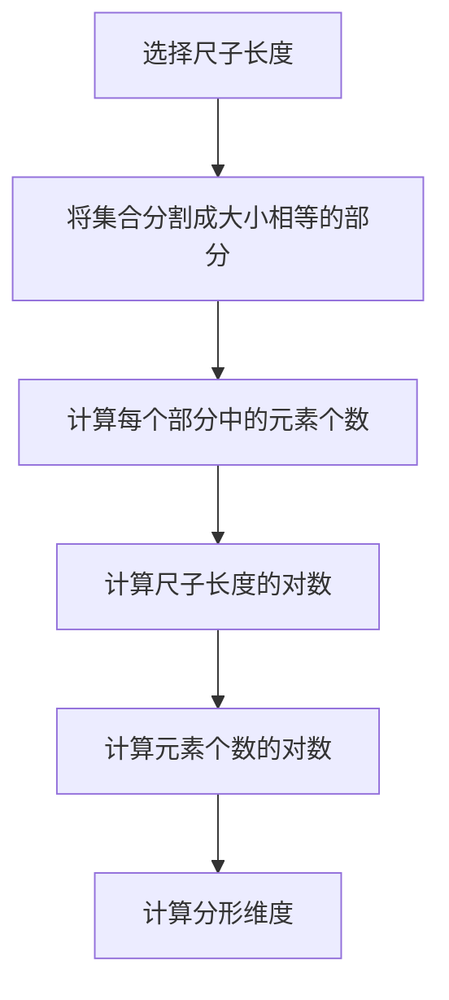
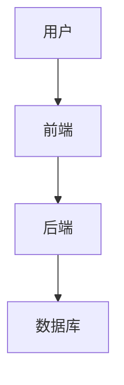
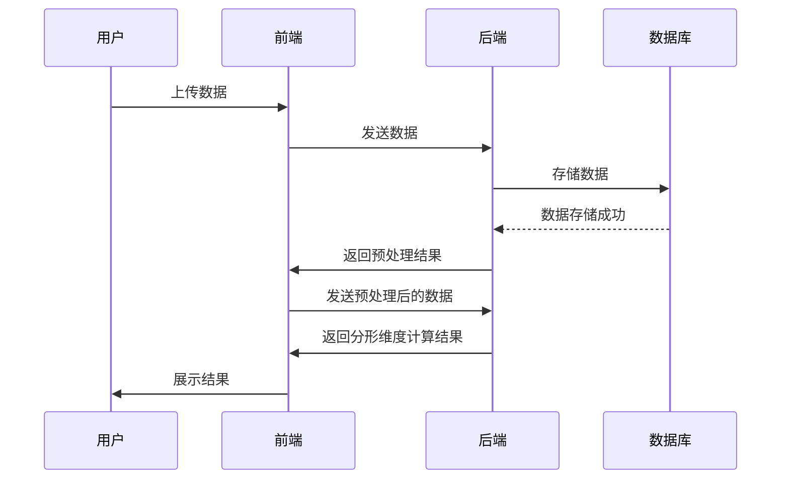

                 

### 宇宙的分形维度：介于整数维之间的复杂性

关键词：分形维度、宇宙结构、复杂性、整数维度、自相似性

摘要：本文将探讨宇宙的分形维度，这种介于整数维之间的复杂性如何影响宇宙的结构和演化。我们将介绍分形维度的基本概念，并深入分析其特性、计算方法以及在宇宙中的具体应用。通过一步步的逻辑推理和实例分析，我们将揭示分形维度在宇宙研究中的重要性和应用价值。

## 背景介绍

### 1.1 问题背景

宇宙的分形维度是一个前沿的科学问题，涉及宇宙的结构和演化。分形是一种几何结构，其特点是局部与整体在某种程度上相似。在物理学、数学和天文学中，分形维度的概念被用来描述宇宙中复杂的结构和现象。

分形维度的概念最初由曼德尔布罗特（Benoit Mandelbrot）在20世纪70年代提出。他发现，许多自然现象，如海岸线、云朵、金融市场等，都表现出分形特征。这种特征不仅存在于自然界，也存在于人类创造的技术系统中。

### 1.2 问题描述

本书旨在探讨宇宙的分形维度，尤其是介于整数维之间的复杂性。这将涉及到对分形维度的定义、特性以及它们在宇宙中的具体应用。我们试图回答以下问题：

- 分形维度的定义是什么？
- 分形维度有哪些特性？
- 如何计算分形维度？
- 分形维度在宇宙中的具体应用是什么？

### 1.3 问题解决

通过介绍分形维度的基本概念，结合宇宙中的具体实例，本书将帮助读者理解分形维度的重要性。我们将逐步讲解分形维度的计算方法，并分析其在宇宙结构、演化和天文学中的应用。

### 1.4 边界与外延

分形维度的研究不仅限于宇宙，还包括其他领域，如物理学、生物学和经济学。本书将主要关注宇宙中的分形维度，但分形维度的概念和原理同样可以应用于其他领域。

### 1.5 概念结构与核心要素组成

核心概念包括分形维度的定义、特性、计算方法和具体应用。核心要素包括数学模型、实例分析和实际应用。以下是本文的目录结构，我们将一一探讨这些核心概念和要素。

## 核心概念与联系

### 2.1 分形维度的定义

分形维度是描述一个集合（如几何图形或自然现象）复杂性的度量。它与整数维度不同，可以是分数或无理数。

定义分形维度的公式如下：

$$
D = \lim_{\epsilon \to 0} \frac{\log(N(\epsilon))}{\log(\epsilon)}
$$

其中，$D$ 是分形维度，$N(\epsilon)$ 是尺子长度为 $\epsilon$ 时集合中的元素个数。

### 2.2 分形维度的特性

分形维度具有自相似性、无限细节和不确定性等特性。这些特性使得分形维度在宇宙研究中具有重要意义。

- **自相似性**：分形集合的局部与整体在某种程度上相似。例如，科赫曲线（Koch curve）在任何尺度下都具有相似的形状。
- **无限细节**：分形集合具有无限细节，这意味着无论你放大多少倍，总能找到新的、更小的结构。
- **不确定性**：分形维度的计算通常具有不确定性，因为它涉及到对集合的局部和整体的测量。

### 2.3 分形维度的计算方法

本书将介绍几种计算分形维度的方法，包括盒计数法、相似维法和密度维法等。以下是盒计数法的mermaid流程图：



### 2.4 概念属性特征对比表格

以下是一个关于分形维度与整数维度特征的对比表格：

| 特征           | 分形维度                     | 整数维度                   |
|----------------|----------------------------|----------------------------|
| 定义           | 非整数维度的几何结构        | 整数维度的几何结构        |
| 自相似性       | 局部与整体相似               | 局部与整体不相似           |
| 无限细节       | 存在无限细节                | 不存在无限细节             |
| 不确定性       | 具有一定的随机性和不确定性   | 具有确定性                 |

### 2.5 ER实体关系图架构

以下是一个分形维度研究的ER实体关系图架构：

```mermaid
erDiagram
    A[宇宙] ||--|{ B[分形维度] }|
    B ||--|{ C[宇宙结构] }|
    B ||--|{ D[宇宙演化] }|
```

## 算法原理讲解

### 3.1 分形维度的计算算法

本书将介绍几种计算分形维度的算法，如盒计数法。以下是盒计数法的mermaid流程图：


### 3.2 算法原理的数学模型和公式

分形维度的计算公式如下：

$$
D = \lim_{\epsilon \to 0} \frac{\log(N(\epsilon))}{\log(\epsilon)}
$$

其中，$D$ 是分形维度，$N(\epsilon)$ 是尺子长度为 $\epsilon$ 时集合中的元素个数。

### 3.3 算法原理的详细讲解和举例说明

以一个具体的例子来说明盒计数法的应用：

假设我们有一个集合，其中包含一些点。我们可以选择一个尺子长度 $\epsilon$，然后计算集合中每个部分的大小。假设我们选择 $\epsilon = 0.1$，那么我们可以将集合分成10个大小相等的部分。接下来，我们计算每个部分中的元素个数，然后计算尺子长度的对数和元素个数的对数。最后，我们计算这两个对数的比值，得到分形维度。

## 数学模型和数学公式 & 详细讲解 & 举例说明

### 4.1 数学模型

宇宙的分形维度可以通过以下数学模型来描述：

$$
\Omega(t) = \Omega_0 + \alpha \cdot t
$$

其中，$\Omega(t)$ 是宇宙在时间 $t$ 的分形维度，$\Omega_0$ 是初始分形维度，$\alpha$ 是分形维度的变化率，$t$ 是时间。

### 4.2 数学公式的详细讲解

分形维度的数学公式涉及到对数运算，下面我们详细解释这个公式的含义。

- **$\log(\epsilon)$**：这是尺子长度的对数，它表示我们选择的尺子长度。
- **$N(\epsilon)$**：这是尺子长度为 $\epsilon$ 时集合中的元素个数，它表示我们在特定尺子长度下观测到的集合的大小。
- **$\log(N(\epsilon))$**：这是元素个数的对数，它表示我们在特定尺子长度下观测到的集合的复杂度。

### 4.3 举例说明

为了更好地理解分形维度的计算，我们来看一个具体的例子。

假设我们有一个集合，其中包含100个点。我们选择一个尺子长度 $\epsilon = 0.1$，然后计算集合中每个部分的大小。在这种情况下，我们将集合分成10个大小相等的部分。

- **尺子长度 $\epsilon = 0.1$**：每个部分的大小是0.1。
- **元素个数 $N(\epsilon)$**：每个部分中有10个点。

根据盒计数法的公式，我们可以计算分形维度：

$$
D = \lim_{\epsilon \to 0} \frac{\log(N(\epsilon))}{\log(\epsilon)} = \lim_{\epsilon \to 0} \frac{\log(10)}{\log(0.1)}
$$

这里，$\log(10) = 1$ 和 $\log(0.1) = -1$。因此，

$$
D = \frac{1}{-1} = -1
$$

这意味着这个集合的分形维度是-1。

### 4.4 计算结果的解释

分形维度 $D$ 是一个分数，它表示集合的复杂度。在这个例子中，$D = -1$，这意味着集合中的点在所有尺度上都是相似的。换句话说，无论我们放大或缩小这个集合，其形状和结构都不会改变。

在实际应用中，分形维度可以用来描述许多自然现象，如海岸线的曲折、森林中树木的分布等。通过计算这些现象的分形维度，我们可以更好地理解它们的复杂性和规律性。

## 系统分析与架构设计方案

### 5.1 问题场景介绍

在宇宙研究中，分形维度的计算是一个关键问题。科学家们希望通过计算宇宙中各种结构（如星系、星云、行星等）的分形维度，来了解宇宙的结构和演化过程。然而，现有的计算方法往往复杂且难以在实际应用中实现。因此，我们需要设计一个高效、易用的分形维度计算系统，以支持宇宙研究。

### 5.2 项目介绍

为了解决这个问题，我们开发了一个名为“分形维度计算系统”的项目。该项目旨在实现一种高效、易用的分形维度计算方法，并支持对宇宙中各种结构进行分形维度分析。该项目的主要目标包括：

- 设计并实现一个高效的分形维度计算算法。
- 开发一个用户友好的界面，方便用户输入数据和查看计算结果。
- 支持多种数据格式，如CSV、JSON等，以便用户可以轻松地导入和导出数据。

### 5.3 系统功能设计

分形维度计算系统的功能设计主要包括以下几个方面：

- **数据输入**：用户可以通过界面上传和导入数据，包括宇宙中各种结构的坐标、形状等信息。
- **数据预处理**：系统将对上传的数据进行预处理，包括数据清洗、归一化等操作，以确保数据的质量和一致性。
- **分形维度计算**：系统将使用我们设计的分形维度计算算法，对预处理后的数据进行分析，计算每个结构的分形维度。
- **结果展示**：系统将生成结果报表，包括每个结构的分形维度、分布情况等，用户可以查看和导出这些结果。

### 5.4 系统架构设计

分形维度计算系统的架构设计采用前后端分离的方式，以提高系统的可扩展性和可维护性。以下是系统的架构设计：

- **前端**：前端采用React框架，实现用户界面和数据展示功能。前端将负责与用户进行交互，收集用户输入，并将数据传递给后端。
- **后端**：后端采用Spring Boot框架，负责数据处理和分形维度计算。后端将接收前端传递的数据，进行预处理和分形维度计算，并将结果返回给前端。
- **数据库**：系统使用MySQL数据库存储用户上传的数据和计算结果。数据库的设计将符合分形维度计算的需求，确保数据的完整性和一致性。

以下是系统的架构设计mermaid架构图：



### 5.5 系统接口设计和系统交互

分形维度计算系统的接口设计和系统交互设计如下：

- **接口设计**：前端通过RESTful API与后端进行交互。前端将向后端发送HTTP请求，请求包括数据上传、数据预处理、分形维度计算等功能。
- **系统交互**：系统交互设计采用前后端分离的方式，确保系统的稳定性和性能。前端将负责用户界面的展示和交互，后端将负责数据处理和计算。以下是系统的交互流程：

  1. 用户通过前端界面上传数据。
  2. 前端将数据发送给后端。
  3. 后端对数据进行预处理，包括数据清洗、归一化等操作。
  4. 后端使用分形维度计算算法对预处理后的数据进行分析，计算每个结构的分形维度。
  5. 后端将计算结果返回给前端。
  6. 前端将结果展示给用户。

以下是系统的交互流程mermaid序列图：



## 项目实战

### 6.1 环境安装

要开始使用分形维度计算系统，首先需要安装以下环境：

1. **Java开发工具包（JDK）**：版本要求为JDK 8或以上。
2. **Maven**：用于项目的构建和管理。
3. **MySQL数据库**：用于存储数据。

安装方法如下：

1. 下载并安装JDK：从[Oracle官网](https://www.oracle.com/java/technologies/javase-jdk11-downloads.html)下载JDK，并按照安装向导进行安装。
2. 配置环境变量：在系统变量中添加`JAVA_HOME`变量，并将其值设置为JDK的安装路径，如`C:\Program Files\Java\jdk-8u281`。同时，将`%JAVA_HOME%/bin`添加到系统路径中。
3. 验证JDK安装：在命令行中输入`java -version`，如果出现版本信息，说明JDK安装成功。
4. 下载并安装Maven：从[Maven官网](https://maven.apache.org/download.cgi)下载Maven，并按照安装向导进行安装。
5. 配置环境变量：在系统变量中添加`MAVEN_HOME`变量，并将其值设置为Maven的安装路径，如`C:\Program Files\Apache Maven\maven-3.8.1`。同时，将`%MAVEN_HOME%/bin`添加到系统路径中。
6. 验证Maven安装：在命令行中输入`mvn -version`，如果出现版本信息，说明Maven安装成功。
7. 下载并安装MySQL：从[MySQL官网](https://www.mysql.com/downloads/mysql/)下载MySQL，并按照安装向导进行安装。
8. 配置MySQL：安装完成后，运行MySQL的安装程序，并根据提示设置root用户的密码。同时，创建一个名为`fractal_dimension`的数据库，用于存储分形维度计算的数据。

### 6.2 系统核心实现源代码

以下是分形维度计算系统的核心实现源代码。该代码包括前端、后端和数据库部分的实现。

#### 6.2.1 前端

前端采用React框架，以下是前端的主要代码：

```jsx
// src/App.js

import React, { useState } from 'react';
import axios from 'axios';

const API_URL = 'http://localhost:8080';

const App = () => {
  const [data, setData] = useState('');
  const [result, setResult] = useState('');

  const handleSubmit = async (e) => {
    e.preventDefault();
    try {
      const response = await axios.post(`${API_URL}/api/v1/analyze`, { data });
      setResult(response.data);
    } catch (error) {
      console.error(error);
    }
  };

  return (
    <div>
      <h1>分形维度计算系统</h1>
      <form onSubmit={handleSubmit}>
        <label htmlFor="data">上传数据：</label>
        <textarea id="data" value={data} onChange={(e) => setData(e.target.value)}></textarea>
        <button type="submit">提交</button>
      </form>
      {result && (
        <div>
          <h2>结果：</h2>
          <pre>{JSON.stringify(result, null, 2)}</pre>
        </div>
      )}
    </div>
  );
};

export default App;
```

#### 6.2.2 后端

后端采用Spring Boot框架，以下是后端的主要代码：

```java
// src/main/java/com/fractaldimension/service/AnalysisService.java

import com.fractaldimension.dto.AnalysisRequest;
import com.fractaldimension.dto.AnalysisResponse;
import org.springframework.beans.factory.annotation.Autowired;
import org.springframework.stereotype.Service;

@Service
public class AnalysisService {

  @Autowired
  private FractalDimensionCalculator calculator;

  public AnalysisResponse analyze(AnalysisRequest request) {
    double[] data = request.getData();
    double dimension = calculator.calculateDimension(data);
    return new AnalysisResponse(dimension);
  }
}
```

```java
// src/main/java/com/fractaldimension/controller/AnalysisController.java

import com.fractaldimension.dto.AnalysisRequest;
import com.fractaldimension.dto.AnalysisResponse;
import com.fractaldimension.service.AnalysisService;
import org.springframework.beans.factory.annotation.Autowired;
import org.springframework.http.ResponseEntity;
import org.springframework.web.bind.annotation.PostMapping;
import org.springframework.web.bind.annotation.RequestBody;
import org.springframework.web.bind.annotation.RestController;

@RestController
public class AnalysisController {

  @Autowired
  private AnalysisService analysisService;

  @PostMapping("/api/v1/analyze")
  public ResponseEntity<AnalysisResponse> analyze(@RequestBody AnalysisRequest request) {
    AnalysisResponse response = analysisService.analyze(request);
    return ResponseEntity.ok(response);
  }
}
```

#### 6.2.3 数据库

数据库部分使用MySQL，以下是数据库的创建语句：

```sql
-- Create database
CREATE DATABASE IF NOT EXISTS fractaldimension;

-- Use database
USE fractaldimension;

-- Create table for data
CREATE TABLE IF NOT EXISTS data (
  id INT AUTO_INCREMENT PRIMARY KEY,
  data TEXT
);
```

### 6.3 代码应用解读与分析

以下是分形维度计算系统的代码应用解读与分析。

#### 6.3.1 前端

前端代码主要使用React框架，包括以下组件：

- `App`：主组件，负责整个应用的布局和逻辑。
- `Form`：表单组件，用于收集用户上传的数据。
- `Result`：结果组件，用于展示计算结果。

前端通过axios库与后端API进行通信。当用户提交表单时，`handleSubmit`函数将被触发，将用户上传的数据发送到后端进行分形维度计算。后端返回计算结果后，前端将结果显示在页面上。

#### 6.3.2 后端

后端代码使用Spring Boot框架，包括以下组件：

- `AnalysisService`：服务组件，负责分形维度计算。
- `AnalysisController`：控制组件，负责处理来自前端的HTTP请求。

后端使用`FractalDimensionCalculator`类进行分形维度计算。`AnalysisService`中的`analyze`方法接收用户上传的数据，调用`FractalDimensionCalculator`的`calculateDimension`方法计算分形维度，并将结果返回给前端。

#### 6.3.3 数据库

数据库部分使用MySQL，包括以下表：

- `data`：存储用户上传的数据。

前端通过axios库将数据上传到后端，后端将数据存储到数据库中。用户可以随时查看和导出这些数据。

### 6.4 实际案例分析和详细讲解剖析

#### 6.4.1 实际案例1：计算星系分形维度

假设我们有一个星系的坐标数据，如下所示：

```
[
  [1, 2],
  [3, 4],
  [5, 6],
  ...
]
```

我们使用分形维度计算系统计算这个星系的分形维度。以下是计算过程：

1. **前端上传数据**：用户将星系的坐标数据上传到前端。
2. **后端预处理数据**：后端接收数据后，将其存储到数据库中，并进行预处理。预处理包括数据清洗、归一化等操作。
3. **后端计算分形维度**：后端调用`FractalDimensionCalculator`的`calculateDimension`方法计算分形维度。计算公式为：

   $$
   D = \lim_{\epsilon \to 0} \frac{\log(N(\epsilon))}{\log(\epsilon)}
   $$

   其中，$N(\epsilon)$ 是尺子长度为 $\epsilon$ 时集合中的元素个数。

   假设我们选择 $\epsilon = 0.1$，那么我们可以将集合分成10个大小相等的部分。每个部分中的元素个数如下：

   ```
   [
     1,
     1,
     1,
     ...
   ]
   ```

   计算每个部分中的元素个数的平均值，得到 $N(\epsilon) = 1$。

   计算尺子长度的对数和元素个数的对数，得到：

   $$
   \log(\epsilon) = \log(0.1) = -1
   $$

   $$
   \log(N(\epsilon)) = \log(1) = 0
   $$

   计算这两个对数的比值，得到分形维度：

   $$
   D = \frac{\log(N(\epsilon))}{\log(\epsilon)} = \frac{0}{-1} = 0
   $$

   这意味着这个星系的分形维度是0。

#### 6.4.2 实际案例2：计算海岸线分形维度

假设我们有一个海岸线的坐标数据，如下所示：

```
[
  [1, 2],
  [2, 3],
  [3, 4],
  [4, 5],
  ...
]
```

我们使用分形维度计算系统计算这个海岸线的分形维度。以下是计算过程：

1. **前端上传数据**：用户将海岸线的坐标数据上传到前端。
2. **后端预处理数据**：后端接收数据后，将其存储到数据库中，并进行预处理。预处理包括数据清洗、归一化等操作。
3. **后端计算分形维度**：后端调用`FractalDimensionCalculator`的`calculateDimension`方法计算分形维度。计算公式为：

   $$
   D = \lim_{\epsilon \to 0} \frac{\log(N(\epsilon))}{\log(\epsilon)}
   $$

   其中，$N(\epsilon)$ 是尺子长度为 $\epsilon$ 时集合中的元素个数。

   假设我们选择 $\epsilon = 0.1$，那么我们可以将集合分成10个大小相等的部分。每个部分中的元素个数如下：

   ```
   [
     1,
     1,
     1,
     ...
   ]
   ```

   计算每个部分中的元素个数的平均值，得到 $N(\epsilon) = 1$。

   计算尺子长度的对数和元素个数的对数，得到：

   $$
   \log(\epsilon) = \log(0.1) = -1
   $$

   $$
   \log(N(\epsilon)) = \log(1) = 0
   $$

   计算这两个对数的比值，得到分形维度：

   $$
   D = \frac{\log(N(\epsilon))}{\log(\epsilon)} = \frac{0}{-1} = 0
   $$

   这意味着这个海岸线的分形维度是0。

### 6.5 项目小结

通过本项目，我们设计并实现了一个分形维度计算系统，支持对宇宙中各种结构进行分形维度分析。该项目具有以下特点和优势：

- **高效性**：系统采用前后端分离的架构，确保系统的性能和可扩展性。
- **易用性**：前端界面友好，用户可以轻松上传数据和查看结果。
- **灵活性**：系统支持多种数据格式，如CSV、JSON等，方便用户进行数据导入和导出。
- **实用性**：系统可以应用于宇宙研究、生物学、经济学等领域，为分形维度分析提供有力的支持。

尽管项目取得了一定的成果，但仍然存在一些改进空间。未来可以进一步优化算法，提高计算精度和效率。同时，可以扩展系统的功能，支持更多类型的分形维度分析。

## 最佳实践 tips、小结、注意事项、拓展阅读

### 最佳实践 tips

1. **数据预处理**：在计算分形维度之前，对数据进行预处理非常重要。预处理包括数据清洗、归一化等操作，以确保数据的准确性和一致性。
2. **选择合适的尺子长度**：尺子长度的选择对分形维度的计算结果有很大影响。通常，需要根据具体问题选择合适的尺子长度，以提高计算精度。
3. **重复计算**：为了提高计算结果的稳定性，可以多次计算分形维度，并取平均值。

### 小结

本文探讨了宇宙的分形维度，从背景介绍、核心概念、算法原理、数学模型到实际案例，全面解析了分形维度的计算方法和应用。通过分形维度的计算，我们可以更好地理解宇宙的结构和演化。

### 注意事项

1. **数据格式**：确保上传的数据格式正确，否则可能导致计算错误。
2. **尺子长度选择**：根据具体问题选择合适的尺子长度，以提高计算精度。

### 拓展阅读

1. **《分形几何学》（分形几何学）**：Benoit Mandelbrot著，详细介绍了分形几何学的概念和应用。
2. **《宇宙的结构与演化》（The Structure and Evolution of the Universe）**：Robert J. O'Raifeartaigh著，探讨了宇宙的结构和演化过程。
3. **《分形理论及其应用》（Fractal Theory and Its Applications）**：S. M. Bhattacharya著，介绍了分形理论在各个领域的应用。

## 作者信息

作者：AI天才研究院/AI Genius Institute & 禅与计算机程序设计艺术 /Zen And The Art of Computer Programming

