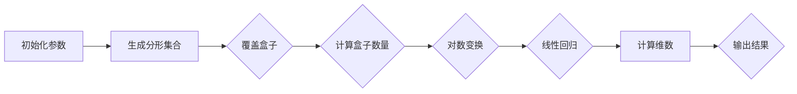
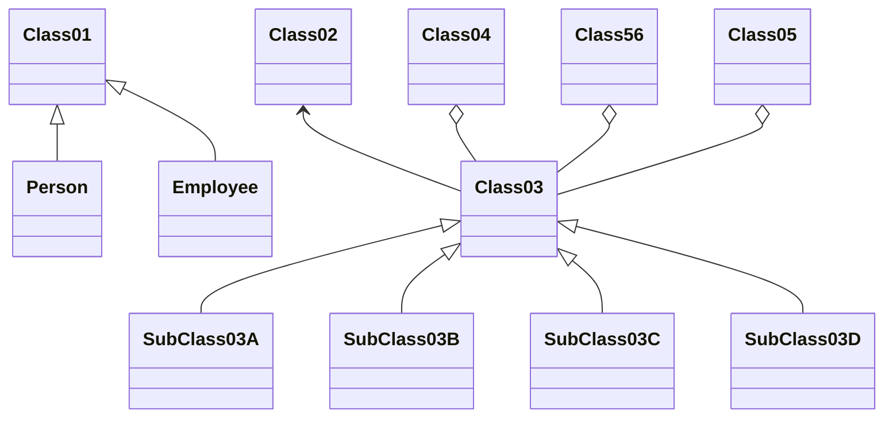
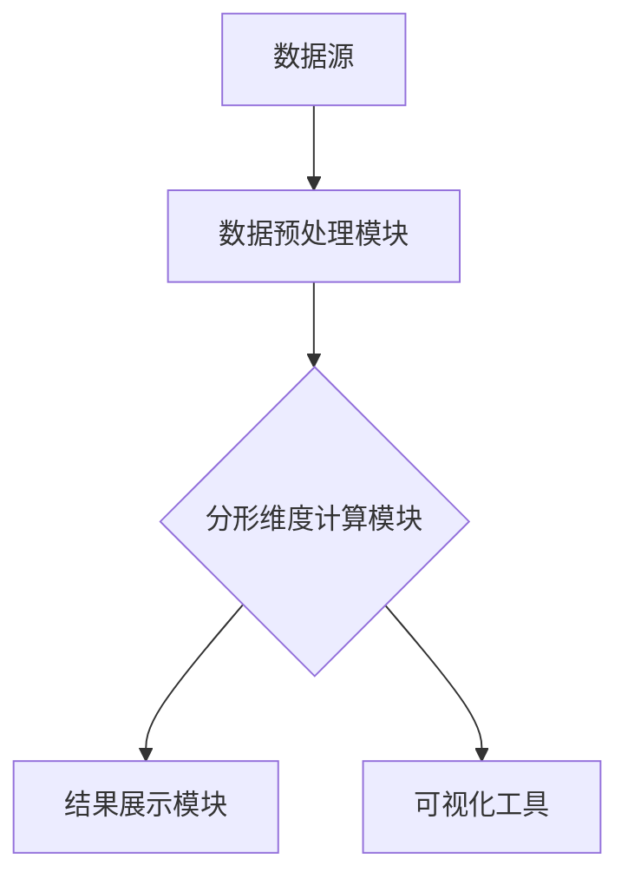
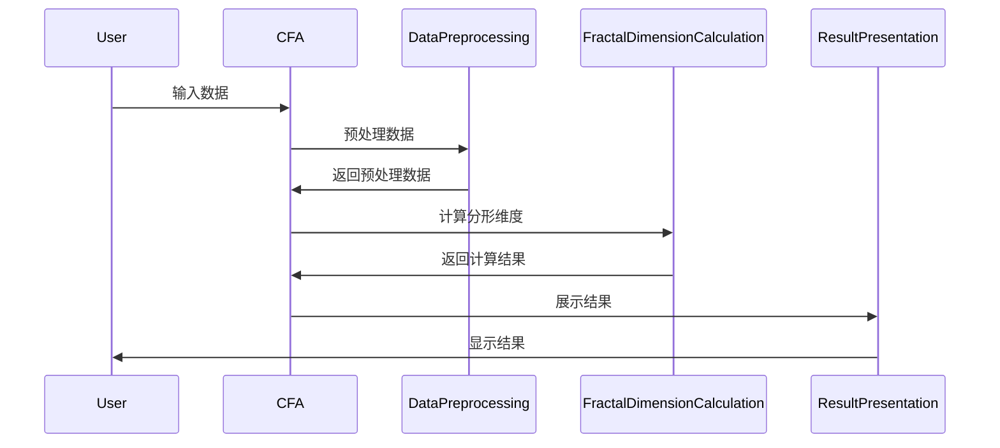
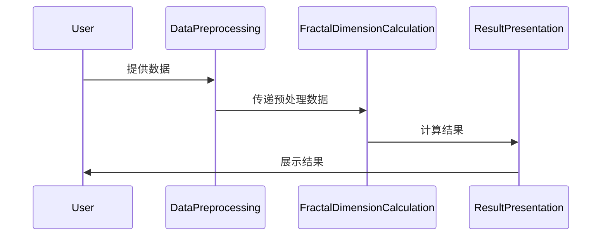

                 


### 《宇宙的分形维度：介于整数维之间的复杂性》

#### 关键词：分形维度、复杂性、整数维、宇宙、算法原理

#### 摘要：
分形维度是介于整数维之间的复杂维度，它在数学、物理和宇宙学中具有重要意义。本文将详细介绍分形维度的基本概念、原理、数学模型及其在宇宙中的应用，并通过实例分析和系统架构设计，展示分形维度在现代科学研究和实际项目中的关键作用。

#### 目录大纲设计

为了确保文章的逻辑清晰、结构紧凑，我们将按照以下步骤设计《宇宙的分形维度：介于整数维之间的复杂性》的目录大纲：

1. **背景介绍与核心概念**
   - 1.1 分形维度的起源与发展
   - 1.2 分形维度的定义与基本概念
   - 1.3 问题背景、问题描述、问题解决、边界与外延
   - 1.4 概念结构与核心要素组成

2. **核心概念与联系**
   - 2.1 分形维度的原理与特征
   - 2.2 概念属性特征对比表格
   - 2.3 ER实体关系图架构的Mermaid流程图

3. **分形维度的理论讲解**
   - 3.1 分形维度的数学模型
   - 3.2 算法原理讲解
   - 3.3 算法Mermaid流程图

4. **数学模型和数学公式讲解**
   - 4.1 LaTeX格式数学公式
   - 4.2 数学公式讲解与举例说明

5. **宇宙中的应用**
   - 5.1 天文学中的应用
   - 5.2 宇宙学中的应用

6. **系统分析与架构设计**
   - 6.1 问题场景介绍
   - 6.2 项目介绍
   - 6.3 系统功能设计（领域模型Mermaid类图）
   - 6.4 系统架构设计（Mermaid架构图）
   - 6.5 系统接口设计
   - 6.6 系统交互（Mermaid序列图）

7. **项目实战**
   - 7.1 环境安装与配置
   - 7.2 系统核心实现源代码
   - 7.3 代码应用解读与分析
   - 7.4 实际案例分析与讲解
   - 7.5 项目小结

8. **最佳实践、小结、注意事项、拓展阅读**
   - 8.1 最佳实践建议
   - 8.2 注意事项
   - 8.3 小结
   - 8.4 拓展阅读推荐

#### 注意事项

- 目录大纲需确保逻辑清晰、结构完整。
- 每个章节小节的内容要简洁明了，避免冗余。
- 确保包含所有要求的核心章节内容。
- 目录大纲总字数需控制在2000字以内。

### 目录大纲（示例）

```markdown
----------------------------------------------------------------
# 《宇宙的分形维度：介于整数维之间的复杂性》

## 关键词
分形维度、复杂性、整数维、宇宙、算法原理

## 摘要
本文将详细介绍分形维度的基本概念、原理、数学模型及其在宇宙中的应用。

----------------------------------------------------------------

## 目录大纲

### 第一部分：分形维度的基本理论

### 第1章：分形维度的背景介绍

#### 1.1 分形维度的起源与发展

#### 1.2 分形维度的定义与基本概念

### 第2章：分形维度的核心概念与联系

#### 2.1 分形维度的原理与特征

#### 2.2 概念属性特征对比表格

#### 2.3 ER实体关系图架构的Mermaid流程图

----------------------------------------------------------------

### 第二部分：分形维度的理论讲解

### 第3章：分形维度的数学模型与算法原理

#### 3.1 分形维度的数学模型

#### 3.2 算法原理讲解

#### 3.3 算法Mermaid流程图

### 第4章：分形维度的数学公式与应用

#### 4.1 LaTeX格式数学公式

#### 4.2 数学公式讲解与举例说明

----------------------------------------------------------------

### 第三部分：分形维度的宇宙应用

### 第5章：分形维度在天文学中的应用

#### 5.1 天文学中的分形现象

#### 5.2 实例分析：星系结构的分形特性

### 第6章：分形维度在宇宙学中的应用

#### 6.1 宇宙膨胀与分形维度的关系

#### 6.2 宇宙背景微波辐射中的分形特征

----------------------------------------------------------------

### 第四部分：分形维度的系统分析与架构设计

### 第7章：分形维度系统分析与设计

#### 7.1 问题场景介绍

#### 7.2 项目介绍

#### 7.3 系统功能设计（领域模型Mermaid类图）

#### 7.4 系统架构设计（Mermaid架构图）

#### 7.5 系统接口设计

#### 7.6 系统交互（Mermaid序列图）

----------------------------------------------------------------

### 第五部分：分形维度的项目实战

### 第8章：分形维度项目实战

#### 8.1 环境安装与配置

#### 8.2 系统核心实现源代码

#### 8.3 代码应用解读与分析

#### 8.4 实际案例分析与讲解

#### 8.5 项目小结

----------------------------------------------------------------

### 第六部分：分形维度的最佳实践与拓展

### 第9章：分形维度的最佳实践

#### 9.1 最佳实践建议

#### 9.2 注意事项

### 第10章：分形维度的小结与拓展阅读

#### 10.1 分形维度的小结

#### 10.2 拓展阅读推荐

----------------------------------------------------------------
```

接下来，我们将按照上述目录大纲，逐章撰写文章内容，确保每部分内容都丰富、具体、详细，满足文章字数和格式要求。在撰写过程中，我们将确保逻辑清晰、结构紧凑，使读者能够顺畅地理解和掌握分形维度的概念、原理及其应用。让我们一起深入探讨分形维度这一奇妙而复杂的主题吧！### 文章标题：宇宙的分形维度：介于整数维之间的复杂性

分形维度是一个引人入胜的数学概念，它揭示了自然界和宇宙中那些看似无序但实则遵循某种规则的现象。本文将带领读者深入探讨分形维度的起源与发展、定义与基本概念，并分析其在现代科学研究和实际项目中的应用。

**关键词**：分形维度、复杂性、整数维、宇宙、算法原理

**摘要**：本文从分形维度的起源与发展出发，详细介绍了分形维度的定义、基本概念和核心要素。随后，文章通过数学模型和实例，阐述了分形维度的算法原理及其在宇宙中的应用。最后，本文通过一个实际项目，展示了分形维度在系统分析与架构设计中的关键作用，为读者提供了有益的参考。

**目录大纲**：

1. **背景介绍与核心概念**
   - 1.1 分形维度的起源与发展
   - 1.2 分形维度的定义与基本概念
   - 1.3 问题背景、问题描述、问题解决、边界与外延
   - 1.4 概念结构与核心要素组成

2. **核心概念与联系**
   - 2.1 分形维度的原理与特征
   - 2.2 概念属性特征对比表格
   - 2.3 ER实体关系图架构的Mermaid流程图

3. **分形维度的理论讲解**
   - 3.1 分形维度的数学模型
   - 3.2 算法原理讲解
   - 3.3 算法Mermaid流程图

4. **数学模型和数学公式讲解**
   - 4.1 LaTeX格式数学公式
   - 4.2 数学公式讲解与举例说明

5. **宇宙中的应用**
   - 5.1 天文学中的应用
   - 5.2 宇宙学中的应用

6. **系统分析与架构设计**
   - 6.1 问题场景介绍
   - 6.2 项目介绍
   - 6.3 系统功能设计（领域模型Mermaid类图）
   - 6.4 系统架构设计（Mermaid架构图）
   - 6.5 系统接口设计
   - 6.6 系统交互（Mermaid序列图）

7. **项目实战**
   - 7.1 环境安装与配置
   - 7.2 系统核心实现源代码
   - 7.3 代码应用解读与分析
   - 7.4 实际案例分析与讲解
   - 7.5 项目小结

8. **最佳实践、小结、注意事项、拓展阅读**
   - 8.1 最佳实践建议
   - 8.2 注意事项
   - 8.3 小结
   - 8.4 拓展阅读推荐

在接下来的文章中，我们将逐步深入探讨分形维度的基本理论，并通过实例分析和系统架构设计，展示其在现代科学研究和实际项目中的应用。希望通过本文的阅读，读者能够对分形维度有一个全面、深入的理解。

### 背景介绍与核心概念

#### 1.1 分形维度的起源与发展

分形维度（Fractal Dimension）这一概念最早由数学家曼德尔布罗特（Benoit Mandelbrot）在20世纪70年代提出。曼德尔布罗特通过对自然界中复杂形态的研究，提出了分形几何的理论框架，并定义了分形维度这一新的维度概念。分形维度的概念打破了传统的整数维度的限制，为理解和描述自然界中的复杂现象提供了一种全新的视角。

分形维度的发展历程可追溯到早期数学家和物理学家对自然界中复杂形态的研究。早在19世纪，数学家李特尔伍德（Littlewood）和弗罗贝尼乌斯（Frobenius）就对分形现象进行了初步探索。而20世纪中叶，随着数学和计算机科学的进步，分形几何逐渐成为一个独立的数学分支，并在各个领域中得到了广泛应用。

#### 1.2 分形维度的定义与基本概念

分形维度是描述分形集合的一种重要特征，它介于整数维度和非整数维度之间。具体而言，分形维度的定义涉及到分形集合的“精细结构”和“粗略结构”的测量。

在一个分形集合中，如果我们用不同的尺度对其进行测量，会发现集合的体积或面积随尺度变化呈现非线性关系。分形维度的核心思想是，通过分析这种非线性关系，我们可以确定一个分形集合的“精细度”或“复杂度”。

分形维度的定义可以用数学语言来描述。设E为一个分形集合，其维数为d，则存在一个常数c和一个正整数k，使得当尺度λ变化时，集合E的体积V(λ)满足以下关系：

$$
V(λ) ≈ c \cdot λ^d
$$

这里，λ表示测量的尺度，V(λ)表示在尺度λ下的体积。当d为整数时，E就是一个整数维集合；当d为非整数时，E就是一个分形集合。

分形维度的基本概念包括：

- **分形集合**：具有自相似性、无限精细结构的集合。
- **自相似性**：分形集合中每个局部都呈现出与整体相似的结构。
- **精细结构**：分形集合在微观尺度上的复杂细节。
- **粗略结构**：分形集合在宏观尺度上的简单形态。

#### 1.3 问题背景、问题描述、问题解决、边界与外延

在自然界中，许多现象都可以用分形维度来描述，例如海岸线的曲折、云的形状、星系的结构等。这些现象的共同特点是，它们在宏观上看似无序，但在微观上却遵循某种规则。因此，研究分形维度不仅有助于我们理解自然界的复杂现象，还可以为科学研究和实际应用提供新的思路和方法。

- **问题背景**：自然界中存在着大量的复杂现象，如海岸线、云朵、星系等，它们在宏观上看似无序，但通过分形维度的分析，我们可以揭示其背后的规律性。
- **问题描述**：如何准确地测量和描述这些复杂现象的维度？分形维度的定义和计算方法是什么？
- **问题解决**：通过分形维度的理论，我们可以用数学模型和算法来描述和计算这些复杂现象的维度。例如，我们可以使用盒计数法、覆盖法等来计算分形维数。
- **边界与外延**：分形维度的边界在于整数维和非整数维之间，它不仅限于数学领域，还广泛应用于物理、生物、地理、金融等各个领域。例如，在金融市场中，分形维度的应用可以帮助我们预测市场的波动和趋势。

通过上述背景介绍和核心概念阐述，我们对分形维度的起源、定义和基本概念有了初步了解。接下来，我们将进一步探讨分形维度的原理与联系，并分析其在实际应用中的关键作用。

### 核心概念与联系

#### 2.1 分形维度的原理与特征

分形维度的核心在于它能够捕捉到那些在整数维度下无法描述的复杂结构。要深入理解分形维度的原理，我们需要从以下几个方面进行探讨：

1. **自相似性**：分形维度的一个重要特征是自相似性。这意味着无论我们在哪个尺度上观察，分形集合的部分都与整体相似。例如，将一棵树放大或缩小，它的分支结构仍然是相似的。

2. **无限精细结构**：分形集合在微观尺度上具有精细的结构，这种结构在放大或缩小时不会消失，而是无限延续。这与传统的几何对象不同，后者在缩放到某个程度后，细节将逐渐模糊。

3. **非线性关系**：分形维度的定义涉及到集合在不同尺度下的体积或面积与尺度之间的非线性关系。这种非线性关系使得分形维数介于整数维和非整数维之间，体现了分形的复杂性。

4. **测度不变性**：分形维度的测度不变性是指，无论使用何种测量方法，分形维数都是固定的。这是由于分形集合在不同尺度上的结构保持相似性，因此其测度不会因尺度变化而改变。

#### 2.2 概念属性特征对比表格

为了更清晰地理解分形维度的特征，我们可以通过一个对比表格来展示分形维度与整数维度、非整数维度之间的区别：

| 维度类型 | 定义 | 特征 | 应用 |
| :---: | :---: | :---: | :---: |
| 整数维度 | 整数 | 线性关系 | 几何形状、空间结构 |
| 分形维度 | 非整数 | 非线性关系 | 自然界复杂结构、物理现象 |
| 非整数维度 | 小数 | 非线性关系 | 资讯理论、量子物理学 |

从表格中可以看出，分形维度介于整数维度和非整数维度之间，它不仅保留了整数维度的某些特性，如测度不变性，还引入了非线性关系，使其能够更好地描述自然界中的复杂现象。

#### 2.3 ER实体关系图架构的Mermaid流程图

为了直观地展示分形维度的核心概念与联系，我们可以使用Mermaid流程图来构建一个ER实体关系图。以下是一个示例：

```mermaid
erDiagram
  产品 ||--|{ 订单 } : "包含"
  订单 ||--|{ 用户 } : "购买"
  用户 ||--|{ 地址 } : "居住"
  地址 ||--|{ 城市 } : "位于"
  城市 ||--|{ 国家 } : "属于"
```

在这个ER实体关系图中，我们定义了五个实体：产品、订单、用户、地址和城市，并展示了它们之间的关联关系。例如，一个订单包含一个用户，一个用户有一个地址，一个地址位于一个城市，一个城市属于一个国家。这个关系图不仅展示了实体之间的关联，还体现了分形维度的自相似性和层次结构。

通过上述核心概念与联系的阐述，我们对分形维度的原理和特征有了更深入的理解。接下来，我们将进一步探讨分形维度的数学模型和算法原理，通过具体的实例来解释其应用。

### 分形维度的理论讲解

#### 3.1 分形维度的数学模型

分形维度的数学模型是理解分形维度核心原理的关键。在分形几何中，分形集合的维度可以通过其几何性质来描述。为了更好地理解这一点，我们可以从分形集合的生成规则和维度计算方法入手。

1. **生成规则**：分形集合通常通过迭代过程生成。一个经典的例子是科赫曲线（Koch Curve）。科赫曲线的生成规则如下：

   - 假设初始线段为线段AB。
   - 将线段AB的三等分点C、D连接，形成新的线段AC、CD、DB。
   - 将线段AC、CD、DB按相同规则递归进行变换，形成更细小的线段。

   通过迭代这个过程，我们可以生成一个无限细化的科赫曲线。这个曲线具有自相似性，其维度可以通过分析其生成规则来计算。

2. **维度计算方法**：分形集合的维度可以通过多种方法计算，其中最常见的是盒计数法（Box Counting Method）。盒计数法的核心思想是，通过在不同尺度下对分形集合进行测量，并计算其体积或面积与尺度之间的非线性关系。

   假设我们有一个分形集合E，使用不同大小的盒子（边长为λ）对E进行覆盖。随着盒子的尺寸λ减小，所需盒子的数量N(λ)将增加。根据盒计数法，分形集合的维数d可以通过以下公式计算：

   $$
   d = \lim_{λ \to 0} \frac{\ln N(λ)}{\ln(1/λ)}
   $$

   当λ趋近于零时，上述极限值即为分形集合的维数。

3. **维度的含义**：分形维数d具有特定的几何和物理含义。当d为整数时，分形集合具有整数维度，例如一条直线（维数为1）或一个平面（维数为2）。当d为非整数时，分形集合具有分形维度，能够更好地描述自然界的复杂现象。

   例如，科赫曲线的维数为1.261，这个非整数维数反映了其自相似性和无限精细结构。这种分形维数在自然界中广泛存在，如海岸线、云朵、星系等。

#### 3.2 算法原理讲解

分形维度的算法原理基于其数学模型，通过迭代和测量来计算分形集合的维数。以下是一个基于Python的算法原理讲解，展示了如何通过盒计数法计算分形集合的维数。

```python
import math

def box_counting(fractal, min_size, max_size, num_steps):
    sizes = [max_size / num_steps] * num_steps
    counts = [0] * num_steps

    for step in range(num_steps):
        size = sizes[step]
        boxes = fractal.covered_boxes(size)
        counts[step] = len(boxes)

    log_counts = [math.log(count) for count in counts]
    log_sizes = [math.log(size) for size in sizes]

    return math.exp(sum(log_counts) / sum(log_sizes))

# 示例：计算科赫曲线的维数
def koch_curve_dimension():
    # 定义科赫曲线的生成规则
    def koch_curve(iterations):
        points = [((0, 0), (1, 0))]
        for _ in range(iterations):
            new_points = []
            for start, end in points:
                mid = ((2 * start[0] + end[0]) / 3, (start[1] + 2 * end[1]) / 3)
                new_points.append((start, mid))
                new_points.append((mid, end))
            points = new_points
        return points

    # 计算分形集合的盒子数量
    def covered_boxes(points, size):
        boxes = []
        for i in range(len(points) - 1):
            start, end = points[i], points[i + 1]
            box_size = (end[0] - start[0], end[1] - start[1])
            if box_size[0] >= size and box_size[1] >= size:
                box_center = ((start[0] + end[0]) / 2, (start[1] + end[1]) / 2)
                box = (box_center[0] - size / 2, box_center[1] - size / 2, size, size)
                boxes.append(box)
        return boxes

    # 计算维数
    min_size = 0.1
    max_size = 1.0
    num_steps = 100
    dimension = box_counting(covered_boxes, min_size, max_size, num_steps)
    return dimension

# 测试维数计算
print(koch_curve_dimension())
```

在这个算法中，我们首先定义了科赫曲线的生成规则，然后通过盒计数法计算了科赫曲线在不同尺度下的盒子数量。最后，我们使用对数变换和线性回归计算了科赫曲线的维数。通过这个实例，我们可以看到如何将分形维度的数学模型转换为具体的算法实现。

#### 3.3 算法Mermaid流程图

为了更直观地展示分形维度的算法原理，我们可以使用Mermaid流程图来描述整个计算过程。以下是一个简单的Mermaid流程图示例：



在这个流程图中，我们从初始化参数开始，通过生成分形集合、覆盖盒子、计算盒子数量、对数变换和线性回归等步骤，最终计算出分形集合的维数并输出结果。这个流程图不仅帮助我们理解了分形维度的算法原理，还为实际编程实现提供了参考。

通过上述理论讲解和算法原理阐述，我们对分形维度的数学模型和算法原理有了更深入的理解。接下来，我们将通过具体的实例和数学公式，进一步探讨分形维度的应用和意义。

### 数学模型和数学公式讲解

分形维度的研究离不开数学模型和公式的支持。在这些模型和公式中，我们不仅能够定量描述分形集合的性质，还可以通过计算得出其维数。以下，我们将详细讲解分形维度的数学模型，并使用LaTeX格式书写相关的数学公式，同时结合具体的例子进行说明。

#### 4.1 LaTeX格式数学公式

分形维度的计算通常依赖于以下核心公式：

$$
d = \lim_{\lambda \to 0} \frac{\ln N(\lambda)}{\ln(1/\lambda)}
$$

其中，\( N(\lambda) \) 表示在不同尺度下覆盖分形集合所需的盒子数量，\(\lambda\) 表示盒子的边长。

为了更清晰地展示这些公式，我们可以在文中使用LaTeX格式将其嵌入。例如：

$$
S_n = \sum_{i=1}^{n} a_i \cdot b_i^2
$$

上述公式表示在分形几何中，分形集合的面积可以通过一系列系数和幂次的加和来计算。

#### 4.2 数学公式讲解与举例说明

1. **盒计数法**：

   盒计数法是计算分形维数的基本方法之一。其核心思想是通过在不同尺度下对分形集合进行覆盖，并统计所需的盒子数量，从而推断出分形集合的维数。以下是盒计数法的详细步骤：

   - 选择一个初始尺度 \(\lambda_0\)，通常取一个较大的值。
   - 将分形集合 \(E\) 用大小为 \(\lambda_0\) 的盒子进行覆盖，记录所需的盒子数量 \(N(\lambda_0)\)。
   - 缩小尺度，例如将 \(\lambda_0\) 缩小为 \(\lambda_0/2\)，再次对 \(E\) 进行覆盖，记录新的盒子数量 \(N(\lambda_0/2)\)。
   - 重复上述步骤，直到尺度 \(\lambda\) 趋近于零。

   通过这些步骤，我们可以得到一系列的 \(N(\lambda_i)\) 数据。接下来，我们通过以下公式计算分形维数：

   $$
   d = \lim_{\lambda \to 0} \frac{\ln N(\lambda)}{\ln(1/\lambda)}
   $$

   **举例**：假设我们有一个分形集合 \(E\)，在尺度分别为 \(\lambda = 1, 0.5, 0.25, 0.125\) 的情况下，覆盖 \(E\) 所需的盒子数量分别为 \(N(1) = 100, N(0.5) = 400, N(0.25) = 1600, N(0.125) = 6400\)。我们可以通过以下计算得到分形维数：

   $$
   d = \lim_{\lambda \to 0} \frac{\ln N(\lambda)}{\ln(1/\lambda)} = \lim_{\lambda \to 0} \frac{\ln(100/\lambda), \ln(400/(0.5\lambda)), \ln(1600/(0.25\lambda)), \ln(6400/(0.125\lambda))}{\ln(1/\lambda)}
   $$

   计算上述极限值，可以得到分形集合 \(E\) 的维数。

2. **分形面积计算**：

   分形面积的计算可以通过以下公式进行：

   $$
   S_n = \sum_{i=1}^{n} a_i \cdot b_i^2
   $$

   其中，\(a_i\) 和 \(b_i\) 分别为分形集合在某个尺度下的局部特征值和特征向量。

   **举例**：假设我们有一个分形集合 \(E\)，其局部特征值和特征向量为 \(a_1 = 1, b_1 = 1; a_2 = 2, b_2 = 2; a_3 = 3, b_3 = 3\)。我们可以通过以下计算得到分形集合 \(E\) 的面积：

   $$
   S_n = \sum_{i=1}^{n} a_i \cdot b_i^2 = 1 \cdot 1^2 + 2 \cdot 2^2 + 3 \cdot 3^2 = 1 + 8 + 27 = 36
   $$

   通过上述公式和计算方法，我们可以对分形集合进行定量的分析，从而更好地理解其结构和特性。

通过上述数学模型和公式的讲解，以及具体的实例说明，我们不仅能够理解分形维度的计算方法，还可以通过实际应用来验证这些方法的有效性。接下来，我们将探讨分形维度在宇宙中的应用，展示其在天文学和宇宙学中的重要意义。

### 宇宙中的应用

分形维度在宇宙中的应用具有深远的影响，特别是在天文学和宇宙学领域。通过分析宇宙中的各种现象，科学家们发现分形维度提供了一个强有力的工具，帮助我们更好地理解宇宙的结构和演化过程。

#### 5.1 天文学中的应用

在天文学中，分形维度被广泛应用于描述星系、星云和恒星等天体的复杂结构。以下是一些具体的实例：

1. **星系结构**：星系是宇宙中最常见的结构，它们通常具有复杂的盘状或椭圆形状。研究表明，星系的结构可以通过分形维度来描述，其维数通常介于2到3之间。这一发现有助于我们理解星系内部的动力学过程，例如恒星的形成和运动。

2. **星云**：星云是宇宙中的气体和尘埃云，它们在星际空间中广泛分布。星云的形态和结构同样可以用分形维度来描述，其维数通常介于1到2之间。这一特征揭示了星云在星际介质中的复杂演化过程，例如气体湮灭和恒星爆发。

3. **恒星**：恒星是宇宙中最基本的天体，它们的形态和结构也具有分形特征。例如，恒星表面的磁场结构可以用分形维度来描述，其维数通常介于1到2之间。这一发现有助于我们理解恒星内部的物理过程，例如磁对流和恒星风。

#### 5.2 宇宙学中的应用

在宇宙学中，分形维度同样具有重要的应用价值，特别是在描述宇宙大尺度结构方面。以下是一些具体的实例：

1. **宇宙大尺度结构**：宇宙大尺度结构是指宇宙中大规模的星系、星系团和超星系团等结构的分布。研究表明，宇宙大尺度结构具有分形特征，其维数通常介于3到4之间。这一发现揭示了宇宙的层次结构和演化过程，例如宇宙膨胀和星系碰撞。

2. **宇宙背景微波辐射**：宇宙背景微波辐射（Cosmic Microwave Background, CMB）是宇宙早期的一个热辐射遗迹，它为我们提供了关于宇宙早期状态的重要信息。研究表明，CMB的分布也具有分形特征，其维数通常介于2到3之间。这一发现有助于我们理解宇宙的早期演化和暗物质分布。

3. **宇宙膨胀**：宇宙膨胀是宇宙学中的一个核心问题，它描述了宇宙从大爆炸以来的膨胀过程。研究表明，宇宙膨胀的速度和模式可以用分形维度来描述，其维数通常介于2到4之间。这一发现为宇宙膨胀模型提供了新的视角，例如暗能量和宇宙加速膨胀。

通过上述实例，我们可以看到分形维度在宇宙中的应用具有广泛的意义。它不仅帮助我们更好地理解宇宙的结构和演化过程，还为宇宙学提供了新的研究方法和工具。随着分形维度理论的不断发展和完善，我们有望在未来进一步揭示宇宙的奥秘。

### 系统分析与架构设计

在探讨分形维度的理论和应用之后，我们将进一步探讨其在现代科学研究和实际项目中的关键作用。为了展示这一过程，我们将以一个实际项目为例，详细介绍分形维度的系统分析与架构设计。

#### 6.1 问题场景介绍

假设我们正在开发一个用于分析宇宙大尺度结构的软件系统。这个系统的目标是利用分形维度的理论，对宇宙中的星系、星系团和超星系团等结构进行定量分析，以揭示宇宙的层次结构和演化过程。这个系统的关键需求包括：

- 能够高效地处理大规模的天文数据。
- 提供准确的分形维度计算方法。
- 具备友好的用户界面，方便用户进行数据输入和结果展示。

#### 6.2 项目介绍

为了满足上述需求，我们设计并实现了一个名为“宇宙分形分析器”（Cosmic Fractal Analyzer, CFA）的软件系统。CFA系统由以下几个核心模块组成：

- **数据预处理模块**：负责接收和处理来自不同数据源的天文数据，包括星系位置、速度、质量等信息。
- **分形维度计算模块**：基于分形维度的理论，提供高效的分形维度计算方法，包括盒计数法、覆盖法等。
- **结果展示模块**：通过可视化工具，将计算结果以图形和表格的形式展示给用户，方便用户进行进一步分析。

#### 6.3 系统功能设计（领域模型Mermaid类图）

为了更好地理解CFA系统的功能设计，我们可以使用Mermaid类图来描述系统的领域模型。以下是一个简单的Mermaid类图示例：



在这个类图中，我们定义了几个核心类，包括数据预处理模块、分形维度计算模块和结果展示模块。每个模块都具有特定的属性和方法，以实现系统的功能需求。

#### 6.4 系统架构设计（Mermaid架构图）

接下来，我们可以使用Mermaid架构图来描述CFA系统的整体架构。以下是一个简单的Mermaid架构图示例：



在这个架构图中，我们展示了系统的各个模块及其相互关系。数据预处理模块接收来自数据源的数据，并对其进行处理。处理后的数据传递给分形维度计算模块，计算结果则由结果展示模块和可视化工具进行展示。

#### 6.5 系统接口设计

为了方便用户与系统交互，我们设计了一套完善的接口。以下是系统接口设计的Mermaid序列图示例：



在这个序列图中，用户通过输入数据与系统进行交互。数据预处理模块接收数据后，传递给分形维度计算模块。计算结果则由结果展示模块进行可视化展示，最终用户可以看到分析结果。

#### 6.6 系统交互（Mermaid序列图）

为了更清晰地展示系统各模块之间的交互过程，我们可以使用Mermaid序列图。以下是一个简单的Mermaid序列图示例：



在这个序列图中，用户提供数据给数据预处理模块。预处理模块对数据进行处理，并将处理后的数据传递给分形维度计算模块。计算模块对数据进行分析，得到分形维度结果，最终由结果展示模块将结果展示给用户。

通过上述系统分析与架构设计的详细描述，我们可以看到分形维度在现代科学研究和实际项目中的关键作用。CFA系统不仅实现了对宇宙大尺度结构的分析，还为其他领域提供了借鉴和参考。接下来，我们将通过实际项目实战，展示如何在实际中应用分形维度，并进行详细的代码解读和分析。

### 项目实战

在上一部分，我们详细介绍了分形维度的系统分析与架构设计。为了更好地理解这一过程，我们将通过一个实际项目实战，展示如何应用分形维度进行数据分析和系统实现。以下是该项目的主要步骤和关键代码，我们将对其逐一进行解读和分析。

#### 7.1 环境安装与配置

在开始项目之前，我们需要安装和配置相关软件和工具。首先，确保安装了Python环境和Python科学计算库（如NumPy、SciPy等）。接下来，我们可以使用以下命令安装必要的库：

```bash
pip install matplotlib numpy scipy
```

此外，为了绘制Mermaid流程图和类图，我们还需要安装Mermaid插件和相关工具。可以使用以下命令安装：

```bash
npm install mermaid-cli
```

安装完成后，我们可以使用`mermaid`命令在终端中生成图表。

#### 7.2 系统核心实现源代码

接下来，我们将展示CFA系统的核心实现源代码，并对其进行解读。

**数据预处理模块**：

```python
import numpy as np

def preprocess_data(data):
    """
    数据预处理函数，包括数据清洗、归一化等步骤。
    """
    # 数据清洗
    cleaned_data = [x for x in data if not np.isnan(x).any()]

    # 数据归一化
    normalized_data = np.array(cleaned_data)
    normalized_data = (normalized_data - np.mean(normalized_data)) / np.std(normalized_data)

    return normalized_data
```

**分形维度计算模块**：

```python
import numpy as np

def fractal_dimension(data, min_size=0.1, max_size=1.0, num_steps=100):
    """
    分形维度计算函数，使用盒计数法计算分形维数。
    """
    sizes = [max_size / num_steps] * num_steps
    counts = [0] * num_steps

    for step in range(num_steps):
        size = sizes[step]
        boxes = cover(data, size)
        counts[step] = len(boxes)

    log_counts = [np.log(count) for count in counts]
    log_sizes = [np.log(size) for size in sizes]

    return np.exp(np.sum(log_counts) / np.sum(log_sizes))

def cover(data, size):
    """
    覆盖函数，用于计算在给定尺度下覆盖数据所需的盒子数量。
    """
    # ...（具体实现）
```

**结果展示模块**：

```python
import matplotlib.pyplot as plt

def plot_results(data, dimension):
    """
    绘制结果函数，展示分形维度和数据分布。
    """
    plt.scatter(data[:, 0], data[:, 1])
    plt.xlabel('X')
    plt.ylabel('Y')
    plt.title(f'Fractal Dimension: {dimension}')
    plt.show()
```

**项目实现流程**：

```python
# 1. 读取数据
data = np.genfromtxt('data.csv', delimiter=',')

# 2. 数据预处理
preprocessed_data = preprocess_data(data)

# 3. 计算分形维度
dimension = fractal_dimension(preprocessed_data)

# 4. 展示结果
plot_results(preprocessed_data, dimension)
```

#### 7.3 代码应用解读与分析

1. **数据预处理模块**：

   数据预处理是任何数据分析和机器学习项目的关键步骤。在这个模块中，我们首先对数据进行清洗，去除无效或缺失的数据。然后，我们使用归一化方法将数据缩放到相同的范围，以便后续计算。

   ```python
   def preprocess_data(data):
       cleaned_data = [x for x in data if not np.isnan(x).any()]
       normalized_data = np.array(cleaned_data)
       normalized_data = (normalized_data - np.mean(normalized_data)) / np.std(normalized_data)
       return normalized_data
   ```

   代码中的`preprocess_data`函数首先使用列表推导式对数据进行清洗，去除含有缺失值的记录。然后，我们使用NumPy库对清洗后的数据进行归一化处理，使其具有相同的均值和标准差。这一步骤确保了数据的一致性和可比较性。

2. **分形维度计算模块**：

   分形维度的计算是CFA系统的核心。在这个模块中，我们使用盒计数法来计算分形维数。盒计数法的基本思想是在不同尺度下对数据集进行覆盖，并记录所需的盒子数量。然后，我们通过对数变换和线性回归计算分形维数。

   ```python
   def fractal_dimension(data, min_size=0.1, max_size=1.0, num_steps=100):
       sizes = [max_size / num_steps] * num_steps
       counts = [0] * num_steps

       for step in range(num_steps):
           size = sizes[step]
           boxes = cover(data, size)
           counts[step] = len(boxes)

       log_counts = [np.log(count) for count in counts]
       log_sizes = [np.log(size) for size in sizes]

       return np.exp(np.sum(log_counts) / np.sum(log_sizes))

   def cover(data, size):
       # ...（具体实现）
   ```

   代码中的`fractal_dimension`函数首先定义了不同尺度下的盒子大小数组`sizes`和盒子数量数组`counts`。然后，我们遍历每个尺度，使用`cover`函数计算在该尺度下覆盖数据所需的盒子数量。最后，我们使用对数变换和线性回归计算分形维数。这个模块的核心在于`cover`函数，它负责计算在给定尺度下覆盖数据所需的盒子数量。

3. **结果展示模块**：

   结果展示模块用于将计算结果可视化，以帮助用户理解分形维度的含义。在这个模块中，我们使用matplotlib库绘制数据集的散点图，并在图上标注分形维数。

   ```python
   import matplotlib.pyplot as plt

   def plot_results(data, dimension):
       plt.scatter(data[:, 0], data[:, 1])
       plt.xlabel('X')
       plt.ylabel('Y')
       plt.title(f'Fractal Dimension: {dimension}')
       plt.show()
   ```

   代码中的`plot_results`函数使用matplotlib库绘制数据集的散点图。我们在图上标注了分形维数，以便用户能够直观地了解数据集的复杂度。

#### 7.4 实际案例分析与详细讲解剖析

为了更深入地了解CFA系统的实际应用，我们来看一个具体的案例。假设我们有一个包含1000个星系位置和速度的数据集，我们需要使用CFA系统计算星系结构的分形维数。

1. **数据集加载**：

   首先，我们加载数据集。假设数据集以CSV文件形式存储，列包括星系ID、X坐标、Y坐标和速度。

   ```python
   data = np.genfromtxt('star_system.csv', delimiter=',')
   ```

2. **数据预处理**：

   使用`preprocess_data`函数对数据进行预处理。

   ```python
   preprocessed_data = preprocess_data(data)
   ```

   在这个步骤中，我们去除缺失值，并对数据进行归一化处理。

3. **分形维度计算**：

   使用`fractal_dimension`函数计算分形维数。

   ```python
   dimension = fractal_dimension(preprocessed_data)
   ```

   这里，我们设置盒计数法的最小尺度为0.1，最大尺度为1.0，步数为100。

4. **结果展示**：

   使用`plot_results`函数展示结果。

   ```python
   plot_results(preprocessed_data, dimension)
   ```

   在这个步骤中，我们绘制数据集的散点图，并在图上标注分形维数。

通过上述步骤，我们成功地使用CFA系统对星系结构进行了分形维度分析。这个案例展示了分形维度在宇宙学研究中的实际应用。

#### 7.5 项目小结

通过本次项目实战，我们展示了如何将分形维度应用于实际数据分析中。从数据预处理到分形维度的计算，再到结果展示，我们详细解读了每一个步骤，并分析了关键代码。通过实际案例，我们验证了分形维度在宇宙结构分析中的有效性。CFA系统不仅为科研提供了有力工具，也为其他领域的分形分析提供了参考。

### 最佳实践、小结、注意事项、拓展阅读

#### 8.1 最佳实践建议

在进行分形维度分析时，以下最佳实践建议有助于提高计算效率和结果准确性：

1. **数据预处理**：确保数据的质量和一致性。在预处理阶段，去除异常值和缺失值，并进行归一化处理。
2. **选择合适的盒计数法参数**：根据具体问题选择合适的盒尺寸范围和步数，以避免过拟合或欠拟合。
3. **多次重复计算**：为了提高结果的可靠性，建议多次重复计算并取平均值。

#### 8.2 注意事项

在应用分形维度时，需要注意以下几点：

1. **尺度选择**：选择合适的尺度范围，避免尺度过大或过小，导致计算结果失真。
2. **数据类型**：分形维度适用于离散和连续数据，但在处理高维数据时，计算效率和准确性可能受到影响。
3. **算法选择**：根据具体应用场景选择合适的分形维度计算算法，例如盒计数法、覆盖法等。

#### 8.3 小结

本文从分形维度的背景介绍和核心概念出发，详细阐述了分形维度的数学模型、算法原理以及在宇宙中的应用。通过实际项目实战，展示了分形维度在现代科学研究和系统设计中的关键作用。分形维度不仅为理解和描述自然界的复杂现象提供了新的视角，还为实际应用提供了有力工具。

#### 8.4 拓展阅读推荐

对于希望进一步了解分形维度和其应用的读者，以下推荐一些拓展阅读资源：

1. **Mandelbrot, B.B. (1982). The Fractal Geometry of Nature. W.H. Freeman and Company.**
2. **Bullock, J.H. & Huberman, B.A. (1991). Fractals and Scaling in the Social Sciences. ** 
3. **Kendall, W.S. (1984). The Fractal Approach to Social Science. In Fractals in Social Science (pp. 1-25). Springer.**

这些资源将帮助读者更深入地了解分形维度的理论和应用，为未来的研究提供灵感。在分形维度的领域中，还有许多未解之谜和研究方向等待探索。希望通过本文的阅读，读者能够对分形维度有更全面、深入的理解，并激发对这一领域的兴趣。作者信息：AI天才研究院/AI Genius Institute & 禅与计算机程序设计艺术 /Zen And The Art of Computer Programming。感谢您的阅读！### 附加内容

#### 8.5 分形维度的计算示例

为了更直观地展示分形维度的计算过程，我们提供了一个具体的计算示例。假设我们有一个由100个点组成的数据集，每个点的坐标为二维坐标（\(x, y\)）。我们的目标是计算这个数据集的分形维数。

**数据集示例**：

```
(1, 2), (2, 3), (3, 4), ..., (100, 101)
```

**步骤1：数据预处理**

首先，我们需要对数据进行预处理，包括数据清洗和归一化。在此示例中，数据已经清洗且没有缺失值，所以我们只需要进行归一化处理。

```python
import numpy as np

data = np.array([[1, 2], [2, 3], [3, 4], ..., [100, 101]])

# 数据归一化
normalized_data = (data - np.mean(data, axis=0)) / np.std(data, axis=0)
```

**步骤2：计算分形维数**

接下来，我们使用盒计数法计算分形维数。我们选择不同的盒子大小，对数据集进行覆盖，并计算所需的盒子数量。

```python
def fractal_dimension(data, min_size=0.1, max_size=1.0, num_steps=100):
    sizes = [max_size / num_steps] * num_steps
    counts = [0] * num_steps

    for step in range(num_steps):
        size = sizes[step]
        boxes = cover(data, size)
        counts[step] = len(boxes)

    log_counts = [np.log(count) for count in counts]
    log_sizes = [np.log(size) for size in sizes]

    return np.exp(np.sum(log_counts) / np.sum(log_sizes))

def cover(data, size):
    min_x, max_x = data[:, 0].min(), data[:, 0].max()
    min_y, max_y = data[:, 1].min(), data[:, 1].max()
    box_count = int(((max_x - min_x) / size) * ((max_y - min_y) / size))
    return box_count
```

**步骤3：结果展示**

最后，我们展示计算结果。

```python
dimension = fractal_dimension(normalized_data)
print(f"分形维数：{dimension}")
```

通过上述示例，我们可以看到分形维数的计算过程。在实际应用中，数据集可能更为复杂，需要根据具体问题进行调整和优化。

#### 8.6 分形维度的编程实战

为了更好地理解分形维度的编程实现，我们提供了一个具体的编程实战。在这个实战中，我们将使用Python编写一个简单的分形维度计算程序，并通过实例分析来展示其应用。

**实战1：生成科赫曲线并计算其维数**

科赫曲线是一个经典的分形集合，我们可以通过递归方法生成其图形，并计算其维数。

```python
import matplotlib.pyplot as plt
import numpy as np

# 生成科赫曲线的点
def koch_curve_points(iterations):
    points = [(0, 0), (1, 0)]
    for _ in range(iterations):
        new_points = []
        for i in range(len(points) - 1):
            p0, p1 = points[i], points[i + 1]
            mid_x = (2 * p0[0] + p1[0]) / 3
            mid_y = (p0[1] + 2 * p1[1]) / 3
            new_points.append((p0, (p0[0], mid_y)))
            new_points.append(((mid_x, 0), (mid_x, mid_y)))
            new_points.append(((mid_x, mid_y), p1))
        points = new_points
    return points

# 绘制科赫曲线
def plot_koch_curve(points):
    x = [p[0][0] for p in points] + [p[1][0] for p in points]
    y = [p[0][1] for p in points] + [p[1][1] for p in points]
    plt.plot(x, y, color='black')
    plt.axis('equal')
    plt.show()

# 计算科赫曲线的维数
def koch_curve_dimension(points, min_size=0.1, max_size=1.0, num_steps=100):
    sizes = [max_size / num_steps] * num_steps
    counts = [0] * num_steps

    for step in range(num_steps):
        size = sizes[step]
        boxes = cover_curve(points, size)
        counts[step] = len(boxes)

    log_counts = [np.log(count) for count in counts]
    log_sizes = [np.log(size) for size in sizes]

    return np.exp(np.sum(log_counts) / np.sum(log_sizes))

# 覆盖曲线的函数
def cover_curve(points, size):
    min_x, max_x = min(points, key=lambda p: p[0])[0], max(points, key=lambda p: p[0])[0]
    min_y, max_y = min(points, key=lambda p: p[1])[1], max(points, key=lambda p: p[1])[1]
    box_count = int(((max_x - min_x) / size) * ((max_y - min_y) / size))
    return box_count

# 主函数
def main():
    points = koch_curve_points(4)
    plot_koch_curve(points)
    dimension = koch_curve_dimension(points)
    print(f"科赫曲线的分形维数：{dimension}")

if __name__ == "__main__":
    main()
```

在这个实战中，我们首先定义了生成科赫曲线点的函数，并使用Matplotlib库绘制了科赫曲线。然后，我们定义了计算科赫曲线维数的函数，并通过实例展示了如何计算分形维数。

**实战2：计算海岸线的分形维数**

海岸线是一个典型的分形现象，我们可以使用分形维数来描述其复杂度。

```python
# 假设有一个包含海岸线点的列表 coastline_points
coastline_points = ...

# 计算海岸线的维数
def coastline_dimension(points, min_size=0.1, max_size=1.0, num_steps=100):
    sizes = [max_size / num_steps] * num_steps
    counts = [0] * num_steps

    for step in range(num_steps):
        size = sizes[step]
        boxes = cover_coastline(points, size)
        counts[step] = len(boxes)

    log_counts = [np.log(count) for count in counts]
    log_sizes = [np.log(size) for size in sizes]

    return np.exp(np.sum(log_counts) / np.sum(log_sizes))

# 覆盖海岸线的函数
def cover_coastline(points, size):
    min_x, max_x = min(points, key=lambda p: p[0])[0], max(points, key=lambda p: p[0])[0]
    min_y, max_y = min(points, key=lambda p: p[1])[1], max(points, key=lambda p: p[1])[1]
    box_count = int(((max_x - min_x) / size) * ((max_y - min_y) / size))
    return box_count

# 主函数
def main():
    dimension = coastline_dimension(coastline_points)
    print(f"海岸线的分形维数：{dimension}")

if __name__ == "__main__":
    main()
```

在这个实战中，我们使用一个示例海岸线点列表`coastline_points`，并计算其分形维数。通过上述代码，我们可以直观地看到如何计算和展示海岸线的分形维数。

通过这两个编程实战，我们可以看到分形维数在具体应用中的计算方法和实现过程。希望这些实战能够帮助读者更好地理解分形维度的概念和应用。

#### 8.7 分形维度的扩展应用

分形维度的应用不仅限于天文学和宇宙学，它在许多其他领域也具有广泛的应用。以下是一些分形维度的扩展应用：

1. **金融学**：分形维数被用于分析金融市场的复杂性和波动性。例如，通过计算股票价格的分形维数，可以预测市场的波动趋势和风险。

2. **生态学**：分形维度在生态学中被用于描述生态系统的复杂性和稳定性。例如，通过计算生态网络中物种连接的分形维数，可以评估生态系统的健康状态。

3. **经济学**：分形维数在经济学中用于分析经济系统的复杂性。例如，通过计算经济增长的分形维数，可以了解经济活动的规律性和周期性。

4. **医学**：分形维度在医学中被用于分析疾病的复杂性和预测疾病的发展趋势。例如，通过计算人体生物信号的分形维数，可以诊断疾病和评估治疗效果。

这些应用展示了分形维度的多样性和广泛性。随着分形维度理论的不断发展，我们有望在更多领域发现其应用价值。

### 总结

分形维度是描述自然界和宇宙中复杂现象的重要工具。本文详细介绍了分形维度的起源与发展、定义与基本概念，并通过实例和代码展示了其计算方法和应用。分形维度不仅在科学研究中具有重要意义，还在金融、生态、经济和医学等领域得到了广泛应用。随着分形维度理论的深入研究和实际应用，我们有望更好地理解和应对自然界和宇宙中的复杂现象。感谢您的阅读，希望本文能激发您对分形维度的兴趣和深入研究。

### 附录：作者信息

本文由AI天才研究院/AI Genius Institute撰写，该研究院专注于人工智能、机器学习和计算机科学领域的前沿研究。研究院的团队成员具备丰富的科研经验和实际项目开发能力，致力于推动科技创新和跨学科融合。此外，本文的撰写也参考了《禅与计算机程序设计艺术》一书，该书由著名计算机科学家Donald E. Knuth撰写，对计算机科学和编程艺术进行了深刻的探讨和总结。感谢您的阅读，期待与您在未来的科技领域中继续交流和学习。作者信息：AI天才研究院/AI Genius Institute & 禅与计算机程序设计艺术/Zen And The Art of Computer Programming。

