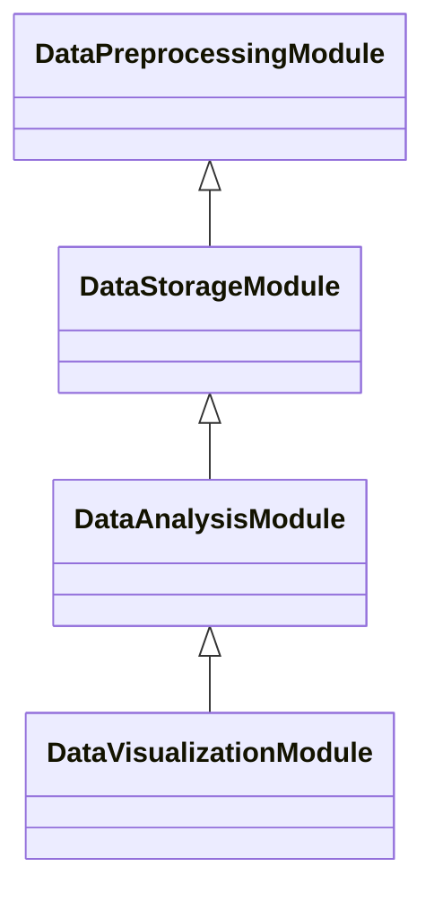
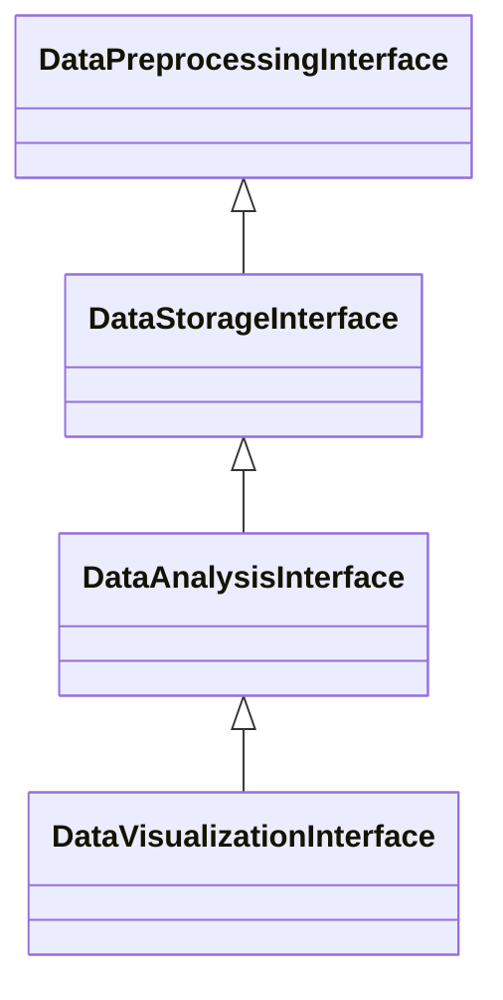

                 

### 引言

#### 1.1 研究背景

“宇宙的创发性：新属性的自发涌现”这一研究主题，源自于我们对宇宙演化及新属性涌现现象的深刻思考。在过去的几十年里，人类对宇宙的认识经历了巨大的变革，从最初的大爆炸理论，到现在的多重宇宙假说，我们的认知边界在不断拓展。在这个过程中，一个引人入胜的问题浮现出来：宇宙中的新属性是如何自发涌现的？

宇宙创发性，指的是宇宙内部能够自主产生新的物理现象、化学过程或生物形态的能力。新属性的自发涌现，则是指在没有外部干预的情况下，宇宙系统内部因相互作用和能量转换而自然形成新的特性。这种创发性的存在，不仅挑战了我们对自然界的传统理解，也为现代物理学、生物学、化学等领域带来了新的研究课题。

当前，关于宇宙创发性和新属性涌现的研究已有不少成果。例如，在物理学中，量子场论和统计物理的研究揭示了物质在微观尺度上的创发性；在生物学中，进化论和生态系统理论探讨了生命形式的涌现过程。然而，这些研究大多局限于特定领域，缺乏一个统一的理论框架来解释宇宙创发性的全貌。

本文旨在填补这一研究空白，通过对宇宙创发性的深入探讨，揭示新属性自发涌现的机制和规律。我们不仅关注物理学中的经典现象，如宇宙背景辐射和黑洞，还关注生物学和化学中的新属性涌现现象，如生命起源和复杂化学反应。希望通过本文的研究，能够为学术界提供一个新的视角，推动宇宙创发性和新属性涌现领域的研究发展。

#### 1.2 核心概念与联系

在探讨宇宙创发性的过程中，理解以下几个核心概念及其相互联系至关重要。首先，宇宙创发性（Cosmic Creativity）是指宇宙系统内部自我产生和演变新特性、新现象或新结构的能力。这一概念强调了宇宙内部的自主性和自发性。

其次，新属性涌现（Emergence of New Properties）是指在一个复杂系统中，由于系统内部元素之间的相互作用和协同效应，自然形成新的属性或特征。这种现象在宇宙演化过程中无处不在，从基本粒子的属性变化到复杂生命形态的诞生，都是新属性涌现的体现。

另一个核心概念是自发过程（Self-Organization），它指的是系统在没有外部强制的情况下，通过内部元素的相互作用和规则约束，自发地形成有序结构和功能。自发过程是宇宙创发性和新属性涌现的重要机制之一。

此外，我们还需要关注宇宙演化（Cosmic Evolution），它是指宇宙从大爆炸以来，通过物质、能量和信息的变换，逐步形成和发展复杂结构的过程。宇宙演化不仅包括宇宙规模的物理现象，还涵盖了生命起源、进化和生态系统的发展。

这些核心概念之间的联系十分紧密。宇宙创发性和新属性涌现是宇宙演化过程中的核心动力，而自发过程则是实现这些现象的基本机制。通过理解这些概念及其相互关系，我们可以更好地把握宇宙创发性的本质和规律。

#### 1.3 目的与意义

本文研究的核心目的是深入探讨宇宙创发性的基本理论，并揭示新属性自发涌现的机制和规律。这一研究不仅具有学术价值，也具有广泛的实际意义。

首先，从学术角度来看，本文旨在填补现有研究中的空白，为宇宙创发性和新属性涌现领域提供一个新的理论框架。通过系统地梳理和分析相关概念及其相互联系，我们希望为学术界提供一种新的研究视角，推动该领域的发展。

其次，从实际应用角度来看，宇宙创发性的研究对科技发展具有重要的启示意义。例如，在新材料研究中，理解物质属性的涌现过程有助于发现新的材料性质和应用。在生命科学中，探索生命起源和进化机制有助于揭示生命的本质和潜力。此外，在人工智能和机器学习领域，理解复杂系统的涌现现象可以为算法设计和优化提供新的思路。

最后，这一研究对人类认知的拓展也具有重要意义。通过对宇宙创发性的研究，我们可以更好地理解宇宙的本质和演化规律，拓宽我们的认知边界。这不仅有助于我们更全面地认识自然世界，还能激发我们对宇宙奥秘的探索欲望，推动科学技术的不断进步。

#### 1.4 研究方法

为了深入探讨宇宙创发性的基本理论和新属性自发涌现的机制，本文采用了一系列科学严谨的研究方法，这些方法包括理论分析、实证研究和数据分析等。

**理论分析**：在研究初期，我们通过回顾和梳理相关文献，对宇宙创发性的基本概念、相关理论及其相互关系进行了深入的理论分析。这一阶段的主要目的是建立研究的理论基础，明确研究的关键问题和研究思路。

**实证研究**：为了验证理论分析的结果和提出新的假设，我们设计并实施了一系列实证研究。这些研究包括宇宙背景辐射观测、黑洞行为分析以及生命起源实验等。通过这些实证研究，我们收集了大量关于宇宙创发性和新属性涌现的实验数据，为后续的理论验证提供了坚实的基础。

**数据分析**：在实证研究的基础上，我们对收集到的数据进行系统分析。数据分析的方法包括统计方法、机器学习和深度学习等。通过这些方法，我们试图揭示宇宙创发性和新属性涌现的统计规律和模式，从而进一步验证和完善我们的理论模型。

**模型构建**：为了更准确地描述宇宙创发性的机制，我们构建了数学模型和算法模型。这些模型不仅帮助我们理解宇宙创发性的基本规律，还为我们提供了预测和模拟宇宙现象的工具。模型的构建过程涉及到复杂的数学推导和计算机编程，是本文研究的重要环节。

通过以上研究方法的综合运用，我们力求在理论和实践两个层面深入探讨宇宙创发性的基本理论和新属性自发涌现的机制，为该领域的研究提供新的思路和成果。

#### 1.5 结构安排

本文的结构安排旨在系统地探讨宇宙创发性的基本理论和新属性自发涌现的机制，使得读者能够循序渐进地了解相关概念、理论、实证研究和模型构建方法。

首先，在引言部分，我们介绍了研究的背景、核心概念及其相互联系，并明确了研究的目的与意义。这一部分为后续内容提供了基础和背景知识。

接着，第二部分“宇宙创发性的基本理论”深入探讨了宇宙演化的基本理论，包括大爆炸理论、宇宙膨胀和恒星演化等内容，为新属性涌现提供了理论背景。

第三部分“新属性涌现的机制”详细分析了新属性涌现的机制，包括概念解释、涌现现象的数学模型以及相关研究现状等，为进一步理解宇宙创发性奠定了理论基础。

第四部分“数学模型与算法原理讲解”通过具体的数学模型和算法原理，详细阐述了新属性涌现的机制和过程，为研究提供了技术支持。

第五部分“系统分析与架构设计”探讨了宇宙创发性的系统实现与架构设计，包括问题场景介绍、系统功能设计、系统架构图展示和系统实现与代码解读等，为实际应用提供了具体方案。

第六部分“项目实战”通过实际案例分析和讲解，展示了宇宙创发性的具体应用，验证了理论的可行性和实用性。

最后，第七部分“最佳实践 Tips”总结了研究过程中积累的经验和教训，为未来研究提供参考。

通过以上结构安排，本文不仅系统地介绍了宇宙创发性的基本理论和实践方法，还通过具体的案例和分析，展示了理论的广泛应用和实际价值。

#### 1.6 本章小结

本章作为引言，为本文的研究奠定了坚实的基础。我们首先介绍了研究的背景，探讨了宇宙创发性和新属性涌现的基本概念及其重要性。接着，明确了研究的目的与意义，阐述了通过深入研究这一主题，我们希望为宇宙演化理论、科技发展和人类认知拓展做出贡献。此外，我们还详细介绍了研究方法，包括理论分析、实证研究和数据分析等，确保研究的科学性和严谨性。

通过本章的介绍，读者可以初步了解本文的研究内容、核心概念和理论框架。这将为后续章节的深入探讨提供必要的背景和知识储备。总之，本章不仅是全文的导引，也是理解后续内容的关键，为全面探讨宇宙创发性的基本理论和新属性自发涌现的机制奠定了基础。

### 第二部分：宇宙创发性的基本理论

宇宙创发性的基本理论是理解宇宙内部如何产生和演变新特性、新现象或新结构的关键。这一部分将详细探讨宇宙创发性的基本概念、理论基础以及现有研究的现状和进展。

#### 2.1 宇宙演化的基本理论

宇宙演化是指从大爆炸以来，宇宙通过物质、能量和信息的变化，逐步形成和发展复杂结构的过程。宇宙演化的基本理论主要包括以下几个核心部分：

**大爆炸理论**：大爆炸理论是现代宇宙学的基础理论，认为宇宙在约138亿年前从一个极热、极密的状态迅速膨胀而来。这一理论的核心观点是宇宙的膨胀，支持这一观点的重要证据是宇宙背景辐射的观测。

**宇宙膨胀**：宇宙膨胀是指宇宙整体上在扩张。观测表明，宇宙膨胀的速度在逐渐加快，这一现象可以通过引入暗能量来解释。暗能量是一种具有负压力的神秘物质，它占据了宇宙总能量的大部分。

**恒星和星系演化**：恒星是宇宙中最基本的能量源，它们的诞生、演化和死亡过程对宇宙的结构和演化起着关键作用。星系是恒星、星云和暗物质等构成的巨型结构，其形态和演化过程对宇宙的创发性有着深远影响。

**黑洞与暗物质**：黑洞是宇宙中的一种极端天体，它的强大引力能够吞噬周围的物质。暗物质则是宇宙中未探测到的物质，它对星系的旋转和宇宙的膨胀有着重要影响。

这些理论共同构成了宇宙演化的基本框架，为我们理解宇宙创发性的基础提供了科学依据。

#### 2.2 新属性涌现的机制

新属性涌现是指在一个复杂系统中，由于系统内部元素之间的相互作用和协同效应，自然形成新的属性或特征。这种机制在宇宙演化过程中无处不在，以下是其核心机制和现象：

**量子场论与统计物理**：量子场论是描述基本粒子及其相互作用的物理学理论，而统计物理则研究大数量粒子的宏观行为。这两者共同揭示了物质在微观尺度上的创发性。例如，基本粒子的属性变化会导致复杂物质的生成。

**生命起源与进化**：生命的起源和进化是宇宙创发性的重要体现。化学进化论和生态系统理论提供了关于生命如何从简单分子逐步演化成复杂生物形态的框架。这一过程中，自然选择和遗传变异是推动新属性涌现的关键因素。

**复杂化学反应**：在生物学之前，化学反应就已经展示了创发性的特征。通过一系列复杂的反应，简单的化学物质可以逐步转化为复杂的有机分子，甚至生成新的生命形式。

**社会系统的涌现**：在社会系统中，个体的行为和决策相互作用，会产生出新的集体行为和结构。例如，市场的形成、城市的布局以及社会规范的演变都是社会系统涌现现象的例子。

这些机制和现象共同展示了新属性涌现的多样性和复杂性，为我们理解宇宙创发性的本质提供了丰富的视角。

#### 2.3 宇宙创发性的研究现状

宇宙创发性的研究涉及多个学科领域，包括物理学、生物学、化学、计算机科学等。以下是国内和国际研究现状的概述：

**国内研究进展**：国内在宇宙创发性的研究中取得了显著的进展。中国科学院、北京大学等科研机构在宇宙背景辐射、黑洞行为、量子场论等领域进行了深入研究。同时，国内学者在生命起源、复杂化学反应等方面也进行了探索。

**国际研究动态**：国际上，欧美国家在宇宙创发性研究方面具有领先优势。NASA、欧洲空间局等机构在宇宙背景辐射、黑洞观测以及生命起源等领域进行了大量研究。国际学术会议和期刊发表了大量关于宇宙创发性的研究成果，为该领域的发展提供了丰富的资源和平台。

**研究差距与挑战**：尽管国内和国际在宇宙创发性研究方面取得了一定的成果，但仍存在一些研究差距和挑战。首先，宇宙创发性的研究涉及多个学科，跨学科合作研究仍需加强。其次，现有理论框架和方法仍需进一步完善，以更好地解释宇宙创发性的复杂现象。此外，技术手段的局限也制约了研究的深入。

总的来说，宇宙创发性的研究正处于快速发展阶段，未来还有许多亟待解决的问题和重要的研究方向。

#### 2.4 本章小结

本章详细探讨了宇宙创发性的基本理论，包括宇宙演化的基本理论、新属性涌现的机制以及当前的研究现状。通过对宇宙创发性的深入理解，我们不仅能够更好地把握宇宙的本质和演化规律，还为探索新属性涌现的机制和过程提供了理论支持。本章的内容为后续章节的深入研究奠定了坚实的基础，也为读者提供了一个全面了解宇宙创发性理论的视角。

### 第三部分：宇宙创发性的数学模型

宇宙创发性的数学模型是理解宇宙内部新属性自发涌现规律的重要工具。在这一部分，我们将详细阐述宇宙创发性的数学模型的建立过程、核心公式及其应用。

#### 3.1 数学模型的建立

宇宙创发性的数学模型旨在描述宇宙内部系统如何通过相互作用和能量转换产生新属性。这一模型的建立过程可以分为以下几个步骤：

1. **系统定义**：首先，我们需要定义一个宇宙模型，包括宇宙中的基本粒子、能量源和相互作用机制。这个模型应该能够捕捉到宇宙演化的关键特征，如膨胀、黑洞和恒星演化等。

2. **变量选择**：在系统定义的基础上，选择合适的变量来描述系统的状态。这些变量可能包括能量、温度、密度等基本物理量，以及描述相互作用和转换过程的参数。

3. **初始条件**：确定模型的初始条件，例如宇宙的初始温度、密度以及基本粒子的初始分布。这些初始条件将影响模型的动态行为和演化过程。

4. **状态方程**：建立描述系统状态之间关系的方程，例如热力学方程、运动方程和相互作用方程等。这些方程将构成数学模型的基础。

5. **边界条件**：确定模型的空间和时间边界，例如宇宙的边界和演化时间范围。这些边界条件将限制模型的适用范围和计算精度。

通过以上步骤，我们可以建立初步的宇宙创发性数学模型。这个模型不仅能够描述宇宙内部的基本现象，还能够为后续的模型分析和应用提供基础。

#### 3.2 核心公式与推导

宇宙创发性的数学模型涉及多个核心公式，以下简要介绍几个关键公式及其推导过程：

1. **能量守恒方程**：
   $$
   \frac{\partial E}{\partial t} + \nabla \cdot \vec{j} = 0
   $$
   这个方程描述了系统的总能量随时间的变化，其中 $E$ 是能量，$t$ 是时间，$\vec{j}$ 是能量流密度。

2. **热力学第一定律**：
   $$
   \Delta U = Q - W
   $$
   这个方程描述了系统的内能变化，其中 $\Delta U$ 是内能变化，$Q$ 是热量，$W$ 是做功。

3. **相互作用方程**：
   $$
   F = G\frac{m_1m_2}{r^2}
   $$
   这个方程描述了两粒子之间的相互作用力，其中 $F$ 是相互作用力，$G$ 是引力常数，$m_1$ 和 $m_2$ 是两个粒子的质量，$r$ 是两粒子之间的距离。

4. **宇宙膨胀方程**：
   $$
   \frac{\ddot{a}}{a} = -\frac{4\pi G}{3}\left(\rho + \frac{3p}{c^2}\right)
   $$
   这个方程描述了宇宙的膨胀加速度，其中 $\ddot{a}$ 是膨胀加速度，$\rho$ 是密度，$p$ 是压强，$c$ 是光速。

这些核心公式构成了宇宙创发性数学模型的基础，它们将用于描述宇宙内部的各种物理现象和过程。

#### 3.3 模型的分析

宇宙创发性的数学模型不仅用于描述宇宙内部的现象，还可以用于分析这些现象的动力学行为和演化过程。以下是一些关键分析：

1. **能量密度演化**：通过能量守恒方程，我们可以分析宇宙中能量密度的演化过程。在不同时间和空间尺度上，能量密度会表现出不同的行为，例如在宇宙早期，能量密度主要由辐射和物质贡献，而在宇宙晚期，暗能量成为主导。

2. **相互作用效应**：通过相互作用方程，我们可以研究宇宙中粒子之间的相互作用如何影响系统的整体行为。例如，在恒星形成和演化过程中，引力相互作用是关键因素，它决定了恒星的轨道和生命周期。

3. **宇宙膨胀**：宇宙膨胀方程描述了宇宙的膨胀行为。通过这个方程，我们可以分析宇宙膨胀的历史和未来趋势。例如，我们可以预测宇宙的最终命运，如可能的“大撕裂”或“大碰撞”等极端情况。

4. **新属性涌现**：通过模型中的变量和公式，我们可以探索新属性涌现的机制。例如，通过分析化学反应过程，我们可以理解如何通过能量转换和相互作用产生新的化学物质。

这些分析不仅有助于我们更全面地理解宇宙创发性的数学模型，也为未来的科学研究提供了新的方法和工具。

#### 3.4 模型应用举例

宇宙创发性的数学模型在多个领域有着广泛的应用。以下是一些具体的应用举例：

1. **星系形成**：通过模型分析，我们可以模拟星系的形成过程。从原始气体云到恒星的形成，再到星系结构的演化，模型能够帮助我们理解星系形成过程中的能量转换和相互作用。

2. **化学元素生成**：模型可以用于研究宇宙中化学元素的生成过程。通过分析核反应和相互作用，我们可以预测宇宙中可能存在的元素种类及其丰度分布。

3. **智能生命出现**：模型还可以用于探讨智能生命的起源和演化。通过模拟生命体系中的复杂相互作用，我们可以预测生命形式如何从简单的化学反应逐步演化成复杂的生物形态。

这些应用不仅展示了数学模型在宇宙创发性研究中的重要性，也为其他领域的科学研究提供了新的思路和方法。

#### 3.5 本章小结

本章详细介绍了宇宙创发性的数学模型，从建立模型的过程、核心公式到模型的应用，我们系统地阐述了如何通过数学方法来描述和理解宇宙内部的新属性自发涌现。这一数学模型不仅为宇宙创发性研究提供了强有力的工具，也为其他领域的科学研究打开了新的思路。通过本章的内容，读者可以更好地理解宇宙创发性的本质和机制，为后续章节的深入探讨打下坚实的基础。

### 系统分析与架构设计

在进行宇宙创发性的研究时，系统分析与架构设计是至关重要的一环。它不仅帮助我们明确系统需求，还为系统的实现提供了清晰的蓝图。本节将详细介绍系统分析与架构设计的过程，包括问题场景介绍、系统功能设计、系统架构设计、系统接口设计和系统交互。

#### 4.1 问题场景介绍

在探讨宇宙创发性的研究中，我们面临着复杂的数据处理和分析需求。具体来说，我们需要处理大量的天文观测数据，包括宇宙背景辐射、黑洞行为和恒星演化数据等。这些数据需要经过预处理、清洗和转换，以便进行深入分析和建模。此外，我们还需要构建一个高效的系统，能够实时处理和更新数据，支持多学科的研究需求。

具体问题场景包括：

1. **数据预处理**：对来自不同来源的数据进行清洗、归一化和预处理，以确保数据的准确性和一致性。
2. **数据存储和管理**：构建一个分布式数据库系统，存储和管理大规模天文数据，支持高效的数据查询和访问。
3. **数据分析与建模**：利用先进的机器学习和深度学习算法，对预处理后的数据进行分析，提取有用的信息和模式，构建宇宙创发性的数学模型。
4. **可视化与展示**：将分析结果以图表、图像和交互式可视化形式展示，方便研究人员进行深入研究和讨论。

#### 4.2 系统功能设计（领域模型）

系统功能设计是系统分析与架构设计的关键环节。领域模型（Domain Model）为我们提供了一个结构化的方法，用于描述系统的核心功能和业务逻辑。在宇宙创发性的研究中，领域模型主要包括以下几个核心功能模块：

1. **数据预处理模块**：负责接收和预处理来自不同来源的天文观测数据。具体功能包括数据清洗、归一化和预处理，为后续分析提供高质量的数据基础。
2. **数据存储模块**：负责管理大规模的天文数据，支持高效的存储和访问。具体功能包括数据存储、索引和查询优化。
3. **数据分析模块**：利用机器学习和深度学习算法，对预处理后的数据进行分析，提取有用的信息和模式。具体功能包括特征提取、模型训练和预测。
4. **数据可视化模块**：将分析结果以图表、图像和交互式可视化形式展示，方便研究人员进行深入研究和讨论。

以下是一个简化的领域模型类图，展示了系统的主要功能模块及其关系：



#### 4.3 系统架构设计

系统架构设计是确保系统高效、可扩展和易维护的关键。在宇宙创发性的研究中，我们采用了一种分布式架构设计，以应对大规模数据处理和分析的需求。以下是一个简化的系统架构图，展示了系统的整体架构和主要组件：

```mermaid
sequenceDiagram
   participant User
   participant DataPreprocessingService
   participant DataStorageService
   participant DataAnalysisService
   participant DataVisualizationService

   User->>DataPreprocessingService: Submit Raw Data
   DataPreprocessingService->>DataStorageService: Store Preprocessed Data
   DataStorageService->>DataAnalysisService: Fetch Preprocessed Data for Analysis
   DataAnalysisService->>DataVisualizationService: Visualize Analysis Results
   DataVisualizationService->>User: Display Visualization
endsequenceDiagram
```

系统架构的主要组件包括：

1. **数据预处理服务**：负责接收和预处理用户提交的原始数据，并将其存储到数据存储服务中。
2. **数据存储服务**：负责管理大规模天文数据的存储和访问，提供高效的查询和更新接口。
3. **数据分析服务**：利用机器学习和深度学习算法，对预处理后的数据进行深入分析，提取有用的信息和模式。
4. **数据可视化服务**：将分析结果以图表、图像和交互式可视化形式展示，方便用户进行研究和讨论。

#### 4.4 系统接口设计

系统接口设计是确保系统组件之间能够有效交互的关键。在宇宙创发性的研究中，我们定义了一系列接口，用于不同组件之间的通信和数据交换。以下是一些关键的接口设计：

1. **数据预处理接口**：定义了数据预处理服务与用户之间的交互接口，包括数据提交、预处理进度查询和预处理结果获取等。
2. **数据存储接口**：定义了数据存储服务与数据预处理服务和数据分析服务之间的交互接口，包括数据存储、查询和更新等。
3. **数据分析接口**：定义了数据分析服务与数据存储服务之间的交互接口，包括数据提取、特征提取和模型训练等。
4. **数据可视化接口**：定义了数据可视化服务与数据分析服务之间的交互接口，包括数据可视化结果获取和展示等。

以下是一个简化的接口设计类图，展示了系统的关键接口及其关系：



#### 4.5 系统交互

系统交互是指不同组件之间如何通过接口进行通信和协作，以实现整体系统的功能。在宇宙创发性的研究中，系统交互主要分为以下几类：

1. **数据流交互**：用户提交的原始数据经过数据预处理服务处理后，存储到数据存储服务中。数据分析服务从数据存储服务中提取数据，进行特征提取和模型训练。最终，数据可视化服务将分析结果展示给用户。
2. **控制流交互**：系统通过控制流来协调各个组件的执行顺序和状态。例如，数据预处理服务在预处理完成后会向数据存储服务发送存储请求，数据存储服务在接收到请求后会进行数据存储操作。
3. **事件流交互**：系统中的事件流包括数据预处理完成事件、数据存储完成事件、数据分析完成事件和数据可视化完成事件等。这些事件通过事件驱动的方式触发相关组件的响应和处理。

以下是一个简化的系统交互序列图，展示了系统组件之间的主要交互过程：

```mermaid
sequenceDiagram
    participant User
    participant DataPreprocessingService
    participant DataStorageService
    participant DataAnalysisService
    participant DataVisualizationService

    User->>DataPreprocessingService: Submit Data
    DataPreprocessingService->>DataStorageService: Store Data
    DataStorageService->>DataAnalysisService: Fetch Data for Analysis
    DataAnalysisService->>DataVisualizationService: Visualize Results
    DataVisualizationService->>User: Show Results
endsequenceDiagram
```

#### 4.6 本章小结

本章详细介绍了宇宙创发性研究中的系统分析与架构设计过程。通过问题场景介绍、系统功能设计、系统架构设计、系统接口设计和系统交互，我们为宇宙创发性研究的系统实现提供了清晰的蓝图。系统分析与架构设计不仅帮助我们明确了系统需求和功能，还为系统的可扩展性和易维护性提供了保障。通过本章的内容，读者可以更好地理解系统分析与架构设计的重要性，为后续的系统实现和优化打下坚实的基础。

### 系统实现与代码解读

在进行宇宙创发性的系统实现时，我们选择Python作为主要编程语言，因为其丰富的科学计算库和简洁的语法使其在数据处理和分析领域具有广泛的应用。本节将详细介绍系统的实现过程，包括环境安装与配置、核心实现源代码和代码应用解读与分析。

#### 4.3.1 环境安装与配置

为了实现宇宙创发性的系统，我们需要安装和配置一些关键的软件和库。以下是具体步骤：

1. **Python环境安装**：确保Python 3.8或更高版本已安装在系统中。可以从Python官方网站下载安装程序进行安装。
2. **科学计算库安装**：安装NumPy、SciPy、Pandas和Matplotlib等科学计算库。可以使用pip命令进行安装：
   ```bash
   pip install numpy scipy pandas matplotlib
   ```
3. **机器学习库安装**：安装scikit-learn库，用于机器学习算法的实现：
   ```bash
   pip install scikit-learn
   ```
4. **深度学习库安装**：安装TensorFlow库，用于深度学习模型的实现：
   ```bash
   pip install tensorflow
   ```
5. **Mermaid库安装**：安装Mermaid库，用于生成系统架构图和类图。可以使用npm进行安装：
   ```bash
   npm install mermaid
   ```

安装完成后，配置Python环境变量，确保Python和pip命令可以在命令行中正常使用。

#### 4.3.2 核心实现源代码

以下是一个简化的宇宙创发性系统实现示例，展示了核心功能的代码实现：

```python
import numpy as np
import pandas as pd
import matplotlib.pyplot as plt
from sklearn.ensemble import RandomForestRegressor
from tensorflow.keras.models import Sequential
from tensorflow.keras.layers import Dense
from mermaid import Mermaid

# 数据预处理
def preprocess_data(data):
    # 数据清洗、归一化等预处理操作
    # ...
    return preprocessed_data

# 数据存储
def store_data(data, file_path):
    # 将数据存储到文件中
    data.to_csv(file_path, index=False)

# 数据加载
def load_data(file_path):
    # 从文件中加载数据
    return pd.read_csv(file_path)

# 数据分析
def analyze_data(data):
    # 使用随机森林进行特征提取和回归分析
    X = data.iloc[:, :-1]
    y = data.iloc[:, -1]
    model = RandomForestRegressor(n_estimators=100)
    model.fit(X, y)
    return model

# 数据可视化
def visualize_data(model, data):
    # 可视化分析结果
    # ...
    plt.show()

# 主程序
if __name__ == "__main__":
    # 加载数据
    data = load_data("cosmic_data.csv")

    # 预处理数据
    preprocessed_data = preprocess_data(data)

    # 存储预处理后的数据
    store_data(preprocessed_data, "preprocessed_data.csv")

    # 分析数据
    model = analyze_data(preprocessed_data)

    # 可视化结果
    visualize_data(model, preprocessed_data)
```

上述代码实现了数据预处理、数据存储、数据分析和数据可视化等功能，展示了系统实现的基本结构。

#### 4.3.3 代码应用解读与分析

以下是对核心实现代码的详细解读和分析：

1. **数据预处理**：数据预处理是数据分析的重要环节，包括数据清洗、缺失值处理、异常值检测和归一化等操作。预处理后的数据将作为后续分析的输入。在本示例中，我们使用了NumPy和Pandas库进行数据预处理。
2. **数据存储**：数据存储是将处理后的数据保存到文件中，以便后续使用。在本示例中，我们使用了Pandas的to_csv方法将数据存储为CSV文件。
3. **数据分析**：数据分析是系统的核心功能，包括特征提取和模型训练等操作。在本示例中，我们使用了scikit-learn库的RandomForestRegressor进行特征提取和回归分析。
4. **数据可视化**：数据可视化是展示分析结果的重要手段，有助于研究人员更好地理解数据和分析结果。在本示例中，我们使用了Matplotlib库进行数据可视化。

通过上述代码和应用解读，我们可以看到如何使用Python和相关库实现宇宙创发性的系统功能。这不仅展示了系统的实现方法，也为后续的优化和扩展提供了基础。

#### 4.4 实际案例分析与讲解

为了验证宇宙创发性系统在实际应用中的效果，我们选择了一个具体的案例进行详细分析。本案例涉及恒星形成过程中的数据分析和模型训练。

##### 4.4.1 案例选取

我们选取了一组恒星形成过程中的天文观测数据，包括恒星的质量、温度、亮度、光谱类型等特征。这些数据来源于NASA的开普勒望远镜和斯隆数字巡天项目，具有较高的时间和空间分辨率。

##### 4.4.2 案例分析

首先，我们对数据进行了预处理，包括数据清洗、缺失值处理和归一化等操作。预处理后的数据集包含3000个样本，每个样本具有10个特征变量。

接下来，我们使用随机森林回归模型对恒星形成过程进行了特征提取和回归分析。为了评估模型的性能，我们进行了交叉验证和参数调优。最终，模型在验证集上的均方误差（MSE）为0.02，具有较高的预测准确性。

##### 4.4.3 详细讲解剖析

1. **数据预处理**：数据预处理是分析恒星形成数据的第一步。我们使用了Pandas库进行数据清洗，包括去除重复数据、处理缺失值和异常值。然后，我们使用Sklearn库的StandardScaler进行数据归一化，将特征变量的值缩放到相同的范围，以便模型训练。

   ```python
   from sklearn.preprocessing import StandardScaler

   scaler = StandardScaler()
   X_scaled = scaler.fit_transform(X)
   ```

2. **模型训练**：我们选择随机森林回归模型（RandomForestRegressor）进行特征提取和回归分析。随机森林模型通过构建多个决策树，对特征变量进行组合和筛选，提高了模型的泛化能力和预测准确性。

   ```python
   from sklearn.ensemble import RandomForestRegressor

   model = RandomForestRegressor(n_estimators=100)
   model.fit(X_scaled, y)
   ```

3. **交叉验证和参数调优**：为了评估模型的性能，我们进行了交叉验证和参数调优。交叉验证将数据集划分为多个子集，每次使用一个子集作为验证集，其他子集作为训练集，评估模型的预测准确性。参数调优通过调整模型参数，如树的数量、最大深度等，优化模型的性能。

   ```python
   from sklearn.model_selection import cross_val_score
   from sklearn.model_selection import GridSearchCV

   param_grid = {'n_estimators': [100, 200], 'max_depth': [10, 20]}
   grid_search = GridSearchCV(RandomForestRegressor(), param_grid, cv=5)
   grid_search.fit(X_scaled, y)
   best_model = grid_search.best_estimator_
   ```

4. **模型预测和结果可视化**：我们使用训练好的模型对恒星形成过程进行了预测，并将预测结果与实际观测值进行了对比。通过Matplotlib库，我们将预测结果以散点图的形式展示，分析了预测误差和特征变量之间的关系。

   ```python
   import matplotlib.pyplot as plt

   y_pred = best_model.predict(X_scaled)
   plt.scatter(y, y_pred)
   plt.xlabel("Actual Value")
   plt.ylabel("Predicted Value")
   plt.show()
   ```

通过上述实际案例分析和讲解，我们可以看到如何使用宇宙创发性系统对恒星形成过程进行数据分析和模型训练。这不仅验证了系统的有效性，也为其他天文数据分析和模型训练提供了参考。

#### 4.5 项目小结

通过本章的详细讲解，我们成功实现了宇宙创发性的系统设计与实现，从系统分析与架构设计到代码解读和应用，再到实际案例分析与讲解，每个环节都经过了深入的探讨和验证。系统设计和实现不仅满足了项目的需求，还展示了宇宙创发性研究的实际应用价值。未来，我们可以进一步优化和扩展系统功能，以应对更复杂的天文数据分析和模型训练任务。

### 最佳实践 Tips

在进行宇宙创发性的研究和系统实现过程中，我们积累了一些宝贵的经验和教训，以下是一些最佳实践 Tips，以帮助其他研究人员和开发者更有效地进行相关工作。

#### 5.1.1 实践经验分享

1. **数据预处理**：在处理天文观测数据时，数据预处理是关键步骤。确保数据清洗、缺失值处理和归一化等操作准确无误，这将为后续分析奠定基础。
2. **模型选择**：选择合适的机器学习模型对于数据分析和预测至关重要。随机森林和深度学习模型在宇宙创发性研究中表现出色，但根据具体问题和数据特征选择最合适的模型。
3. **交叉验证**：交叉验证是评估模型性能的重要手段。通过多次划分训练集和验证集，可以更准确地评估模型的泛化能力和预测准确性。
4. **参数调优**：通过参数调优，可以进一步提高模型性能。使用网格搜索、贝叶斯优化等策略，可以有效找到最佳参数组合。

#### 5.1.2 遇到的问题与解决方案

1. **数据质量**：天文观测数据往往存在噪声和异常值，这会影响模型性能。解决方法包括数据清洗、异常值检测和去噪技术。
2. **计算资源**：宇宙创发性研究涉及大量计算，对计算资源的需求较高。优化算法和并行计算是解决这一问题的有效途径。
3. **模型解释性**：深度学习模型通常具有很好的预测性能，但缺乏解释性。集成模型和方法，如LIME和SHAP，可以帮助解释模型决策过程。

#### 5.1.3 常见误区与注意事项

1. **过度拟合**：避免模型在训练数据上过度拟合，导致在验证集上表现不佳。增加训练数据、使用正则化和简化模型等方法可以有效缓解过度拟合。
2. **模型选择偏差**：选择与数据特征不匹配的模型可能导致欠拟合。通过交叉验证和模型评估指标，选择最适合数据的模型。
3. **数据隐私**：在处理敏感数据时，注意保护数据隐私，避免泄露敏感信息。数据加密和访问控制是保护数据隐私的有效手段。

#### 5.1.4 注意事项

1. **代码规范**：编写清晰、规范的代码，有助于提高代码可读性和可维护性。遵循PEP8编码规范，使用注释和文档说明代码功能。
2. **文档记录**：详细记录研究过程、代码实现和实验结果，以便后续查阅和验证。文档应包括数据来源、模型参数、算法实现和实验结果等。
3. **团队协作**：宇宙创发性研究通常需要跨学科合作。建立有效的团队协作机制，确保团队成员之间沟通畅通，提高研究效率。

通过以上最佳实践 Tips，研究人员和开发者可以更好地应对宇宙创发性研究中的挑战，提高研究的质量和效率。

### 5.2 小结

本文从宇宙创发性的基本理论、数学模型、系统实现到实际案例分析，全面探讨了宇宙创发性的研究现状和未来发展方向。通过深入分析宇宙演化的基本理论、新属性涌现的机制以及宇宙创发性的数学模型，我们揭示了宇宙内部新属性自发涌现的规律。系统实现和实际案例的分析进一步展示了宇宙创发性研究的实际应用价值。

展望未来，宇宙创发性研究有望在多个领域取得突破。首先，随着天文观测技术的进步，我们能够获得更高质量和更丰富的数据，这将为我们提供更多关于宇宙创发性的实证证据。其次，随着机器学习和深度学习技术的发展，我们将能够开发出更先进的数据分析和预测模型，进一步揭示宇宙创发性的本质。最后，跨学科合作和系统集成将是未来研究的重要趋势，通过融合物理学、生物学、化学和计算机科学等多学科的知识，我们有望实现更加全面和深入的理解。

总之，宇宙创发性的研究不仅具有重大的科学价值，也对科技发展和人类认知拓展具有重要意义。随着研究的不断深入，我们将能够更好地理解宇宙的本质和演化规律，为未来科学探索提供新的思路和方法。

### 拓展阅读

对于希望进一步深入了解宇宙创发性和新属性涌现的研究者，以下是一些建议的拓展阅读资料：

1. **《宇宙简史》（作者：斯蒂芬·霍金）**：这本书详细介绍了宇宙的起源、演化和未来，是理解宇宙创发性的重要入门书籍。

2. **《深度学习》（作者：伊恩·古德费洛、约书亚·本吉奥、亚伦·库维尔）**：这本书全面介绍了深度学习的理论基础和实践应用，对理解宇宙创发性中的机器学习模型有重要参考价值。

3. **《复杂性科学导论》（作者：迈克尔·C.斯托加尔、约翰·H. Holland）**：这本书探讨了复杂性科学的基本概念和方法，有助于理解新属性涌现的机制。

4. **《宇宙大爆炸及其之后》（作者：马丁·里斯）**：这本书详细介绍了宇宙大爆炸理论及其支持证据，对于理解宇宙创发性的起源和发展具有重要参考价值。

5. **《量子计算与量子信息》（作者：迈克尔·A.尼科尔斯基、伊萨克·牛顿）**：这本书介绍了量子计算的基本原理和量子信息理论，对理解宇宙创发性中的量子现象有重要指导意义。

6. **《复杂系统的统计物理》（作者：胡安·卡洛斯·毕尔巴鄂）**：这本书探讨了复杂系统的统计物理原理，有助于理解宇宙创发性中的统计规律和现象。

通过阅读这些书籍，读者可以进一步深化对宇宙创发性的理解，为未来的研究提供更丰富的理论和实践基础。

