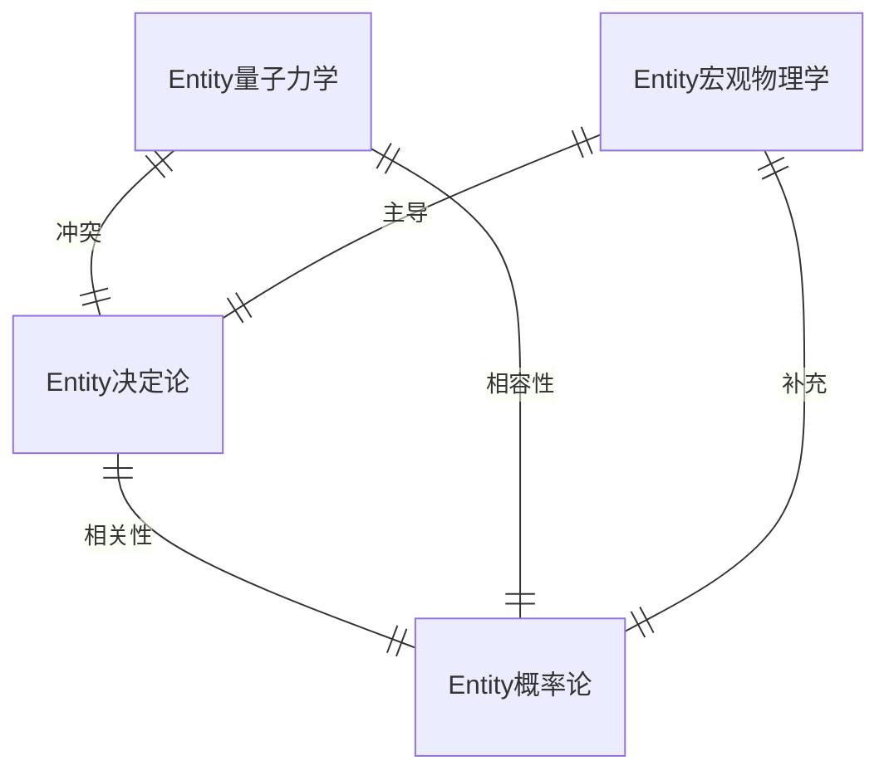
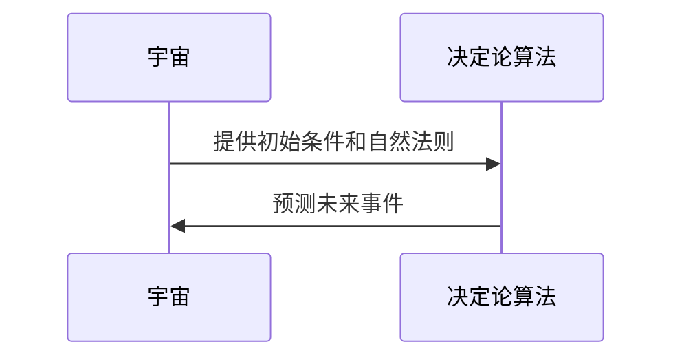
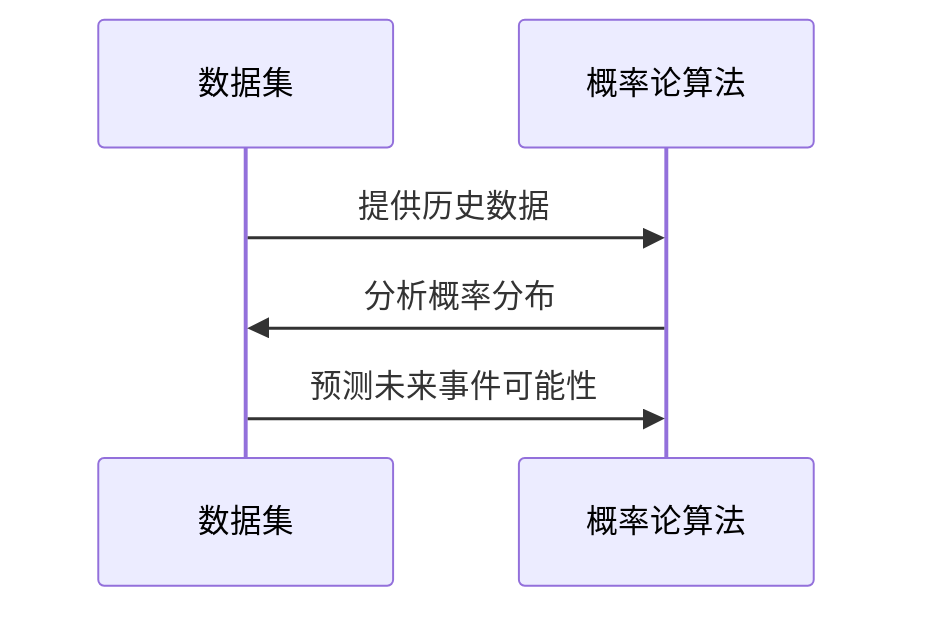

                 

### 背景介绍

# 宇宙的可预测性：决定论与概率论的争辩

## 1.1 问题背景

宇宙的可预测性问题一直是科学界关注的焦点之一。随着科学的发展，人类对宇宙的理解不断深入，关于宇宙是否具有可预测性的争论也从未停止。决定论认为宇宙是高度可预测的，即过去的状态可以决定未来的发展。而概率论则认为宇宙是具有一定随机性的，未来事件的发生具有不确定性。

### 1.2 问题描述

宇宙的可预测性问题涉及多个领域，包括物理学、哲学和数学等。主要问题可以概括为：

- 宇宙的初始状态是否能够完全决定未来的发展？
- 是否存在一种普遍的定律，可以描述宇宙中所有事件的发生？
- 宇宙的随机性是否会对可预测性造成影响？

### 1.3 问题解决

在物理学领域，决定论与概率论的争论主要体现在量子力学和宏观物理学之间的矛盾。量子力学揭示了微观世界的随机性，而宏观物理学则倾向于决定论。目前，科学家们正在尝试通过理论研究和实验来寻找宇宙可预测性的答案。

### 1.4 边界与外延

宇宙的可预测性问题不仅仅局限于物理学，还涉及哲学和数学等学科。在哲学领域，关于宇宙可预测性的争论与自由意志、决定论和宿命论等概念密切相关。在数学领域，概率论和统计学的发展为探讨宇宙的可预测性提供了有力工具。

### 1.5 概念结构与核心要素组成

宇宙的可预测性涉及以下核心概念和要素：

- 决定论：认为宇宙是高度可预测的，即过去的状态可以决定未来的发展。
- 概率论：认为宇宙具有一定随机性，未来事件的发生具有不确定性。
- 量子力学：揭示了微观世界的随机性，挑战了决定论的观点。
- 宏观物理学：倾向于决定论，但在某些方面与量子力学存在矛盾。
- 哲学：探讨自由意志、决定论和宿命论等概念。
- 数学：概率论和统计学为探讨宇宙的可预测性提供了有力工具。

---

### 核心概念与联系

## 2.1 决定论与概率论的基本概念

决定论认为宇宙中的所有事件都是由先前条件和自然法则决定的，即宇宙是高度可预测的。概率论则认为宇宙中存在随机性，未来事件的发生具有一定的不确定性。

### 2.2 决定论与概率论的属性特征对比

| 特征           | 决定论                     | 概率论                       |
| -------------- | ------------------------- | --------------------------- |
| 基本观点       | 宇宙是高度可预测的           | 宇宙具有一定随机性，不确定性存在 |
| 实例           | 天体运动、化学反应           | 随机事件、概率分布            |
| 实践应用       | 预测、控制、优化             | 预测、决策、风险评估           |
| 理论支持       | 自然科学、哲学              | 数学、统计学                  |

### 2.3 决定论与概率论的关联

决定论与概率论并非完全对立，它们在某些方面存在关联和互补。例如，在物理学中，决定论提供了对宏观现象的解释，而概率论则用于描述微观现象的随机性。此外，概率论在某些情况下可以作为决定论的一种近似。

### 2.4 决定论与概率论的关系图（ER实体关系图）

---

### 算法原理讲解

## 3.1 决定论算法原理

决定论算法主要基于确定性原理，即通过已知初始条件和自然法则，可以预测未来事件的发展。以下是一个简单的决定论算法示例：

### 3.2 概率论算法原理

概率论算法主要基于随机性原理，即通过分析历史数据和概率分布，预测未来事件的可能性。以下是一个简单的概率论算法示例：

## 3.3 数学模型与公式

### 决定论

在决定论中，可以使用以下数学模型来描述宇宙的演化：

$$
x(t) = f(x(t-1), t)
$$

其中，$x(t)$ 表示在时刻 $t$ 的状态，$f$ 表示自然法则，$x(t-1)$ 表示在时刻 $t-1$ 的状态。

### 概率论

在概率论中，可以使用概率分布来描述宇宙的演化：

$$
P(x(t) | x(t-1)) = \frac{f(x(t), x(t-1))}{f(x(t-1))}
$$

其中，$P(x(t) | x(t-1))$ 表示在时刻 $t$ 给定时刻 $t-1$ 的状态 $x(t-1)$ 下，状态 $x(t)$ 的概率分布，$f$ 表示自然法则。

## 3.4 举例说明

### 决定论

假设一个简单的例子：一个摆动的摆钟。给定摆钟的初始位置和速度，我们可以使用牛顿运动定律来预测摆钟在未来的位置。这个例子展示了决定论在描述宏观物理现象中的有效性。

### 概率论

假设一个更复杂的例子：股市的波动。通过分析历史数据和股票市场的概率分布，我们可以预测未来股票价格的可能范围。这个例子展示了概率论在描述经济现象中的有效性。

---

在本文中，我们详细探讨了宇宙的可预测性问题，从决定论与概率论的角度出发，分析了它们的本质、属性特征以及关联。同时，我们通过简单的算法示例和数学模型，讲解了决定论和概率论的基本原理。尽管宇宙的可预测性问题目前仍然存在争议，但随着科学的发展，我们有理由相信，人类终将找到解答这一谜题的钥匙。

---

# 作者：AI天才研究院/AI Genius Institute & 禅与计算机程序设计艺术 /Zen And The Art of Computer Programming

