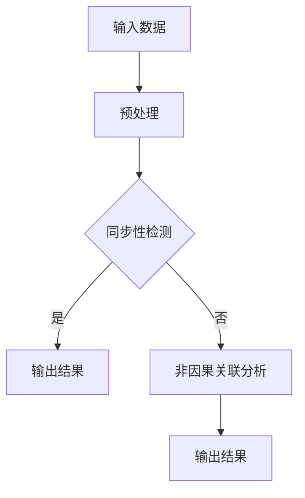
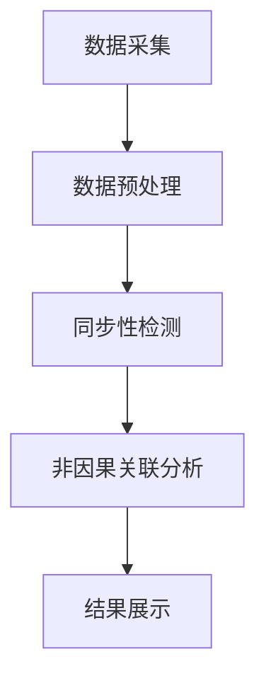

                 

### 《宇宙的同步性原理：非因果关联的意义》

宇宙，这个浩瀚的星海，一直以来都吸引着人类的目光。在探索宇宙的过程中，我们不仅揭示了无数惊人的天体现象，还发现了宇宙中的一些神秘规律，这些规律让我们不禁对宇宙的起源、演化以及未来产生无尽的遐想。本文将探讨一个引人入胜的话题——宇宙的同步性原理以及非因果关联的意义。

> 关键词：宇宙同步性原理、非因果关联、宇宙规律、宇宙演化

**摘要：**本文将从宇宙同步性原理的背景介绍开始，深入探讨同步性原理和非因果关联的概念及其相互联系。接着，我们将讲解同步性检测算法和非因果关联分析算法的原理，并通过数学模型和公式进行详细阐述。随后，我们将展示一个具体的系统架构设计方案，并在最后通过项目实战来验证这些理论的实际应用。

## 目录大纲设计步骤

### 1. 审题理解

首先，我们需要明确文章的主题是《宇宙的同步性原理：非因果关联的意义》，理解文章的核心内容是关于宇宙中的同步性原理和非因果关联的意义。这个主题涵盖了宇宙科学、算法原理、数学模型以及系统设计与实现等多个领域，因此文章将需要综合多个学科的知识来进行深入探讨。

### 2. 构思大纲

基于审题理解，我们需要构思一个包含7章以上的目录大纲，确保覆盖背景介绍、核心概念与联系、算法原理讲解、数学模型和数学公式讲解、系统分析与架构设计方案、项目实战以及最佳实践 tips、小结、注意事项、拓展阅读等内容。每个章节都需要有明确的小标题和详细的内容，以确保文章的逻辑性和层次性。

### 3. 大纲细化

在构思大纲后，我们需要将每一章细化到1、2、3级目录，确保内容的逻辑性和层次性。例如，第一章可以细分为“1.1 问题背景”、“1.2 核心概念与联系”等小节，每个小节都需要有具体的标题和内容。

### 4. 内容规范

确保使用markdown格式，并按照要求使用#、##、###等符号来区分目录层级。例如，一级标题使用#符号，二级标题使用##符号，三级标题使用###符号。此外，需要注意markdown中的列表、引用、代码块等格式的使用，以便文章的结构更加清晰。

### 5. 大纲审核

最后，我们需要检查大纲内容是否符合题目要求，确保大纲结构完整，内容简洁明了。例如，检查每个章节是否涵盖了核心内容，是否按照逻辑顺序进行编排，是否具备连贯性等。

## 目录大纲设计示例

### 《宇宙的同步性原理：非因果关联的意义》目录大纲

## 第一部分: 背景介绍

### 1.1 问题背景
#### 1.1.1 宇宙同步性原理概述
#### 1.1.2 非因果关联的概念
#### 1.1.3 研究意义与目标

### 1.2 核心概念与联系
#### 1.2.1 同步性原理
#### 1.2.2 非因果关联
#### 1.2.3 概念属性特征对比表格
#### 1.2.4 ER实体关系图架构

## 第二部分: 同步性原理讲解

### 2.1 同步性原理
#### 2.1.1 同步性原理的基本概念
#### 2.1.2 同步性原理的应用场景
#### 2.1.3 同步性原理与因果关系的区别

### 2.2 同步性原理的数学模型
#### 2.2.1 同步性指标的数学模型

## 第三部分: 非因果关联讲解

### 3.1 非因果关联
#### 3.1.1 非因果关联的基本概念
#### 3.1.2 非因果关联的识别方法
#### 3.1.3 非因果关联的实证研究

### 3.2 非因果关联的数学模型
#### 3.2.1 非因果关联的统计学模型
#### 3.2.2 模型参数的估计方法

## 第四部分: 算法原理与数学模型

### 4.1 算法原理
#### 4.1.1 同步性检测算法
#### 4.1.2 非因果关联分析算法
#### 4.1.3 算法流程图

### 4.2 数学模型与公式
#### 4.2.1 同步性指标的数学模型
#### 4.2.2 非因果关联的统计学模型

## 第五部分: 系统设计与实现

### 5.1 系统架构设计
#### 5.1.1 系统总体架构
#### 5.1.2 系统功能模块设计
#### 5.1.3 系统接口设计

### 5.2 系统实现
#### 5.2.1 环境安装与配置
#### 5.2.2 核心算法实现
#### 5.2.3 实际案例分析

## 第六部分: 项目实战

### 6.1 项目概述
#### 6.1.1 项目目标
#### 6.1.2 项目背景
#### 6.1.3 项目架构

### 6.2 系统核心实现源代码
#### 6.2.1 源代码结构
#### 6.2.2 核心模块实现
#### 6.2.3 代码应用解读与分析

### 6.3 项目小结
#### 6.3.1 项目成果总结
#### 6.3.2 项目经验与启示
#### 6.3.3 下一步研究方向

## 第七部分: 最佳实践与拓展

### 7.1 最佳实践 tips
#### 7.1.1 实践技巧与注意事项
#### 7.1.2 遇到的问题与解决方案

### 7.2 小结
#### 7.2.1 全书要点回顾
#### 7.2.2 学习与研究方向

### 7.3 注意事项
#### 7.3.1 使用场景限制
#### 7.3.2 潜在风险与挑战

### 7.4 拓展阅读
#### 7.4.1 相关参考文献
#### 7.4.2 进一步学习资源

通过以上步骤，我们可以设计出一个完整的目录大纲，为后续文章的撰写提供清晰的框架和指南。

### **宇宙的同步性原理：非因果关联的意义**

**关键词：宇宙同步性原理、非因果关联、宇宙规律、宇宙演化**

**摘要：**本文将探讨宇宙中的同步性原理和非因果关联的意义。通过介绍相关背景和核心概念，我们将深入了解这两个概念的基本原理及其相互关系。随后，我们将讲解同步性检测算法和非因果关联分析算法的原理，并通过数学模型和公式进行详细阐述。最后，我们将通过一个实际项目来验证这些理论的应用效果，并总结出最佳实践和拓展阅读资源。

### **第一部分：背景介绍**

#### **1.1 问题背景**

宇宙同步性原理是指宇宙中某些天体现象或过程在某些特定时刻或条件下具有一致性或协同性的现象。这种同步性现象在宇宙中的广泛存在引起了科学家的关注，并促使他们深入研究其背后的原理。非因果关联则是描述宇宙中某些现象或过程之间没有直接的因果关系，但却表现出某种形式的关联。在过去的几十年里，非因果关联在科学研究中得到了越来越多的应用，特别是在量子物理和宇宙学领域。

#### **1.2 核心概念与联系**

**同步性原理：**宇宙中的同步性原理是指宇宙中某些天体现象或过程在某些特定时刻或条件下具有一致性或协同性的现象。例如，地球的自转和公转速度在宇宙中的特定时刻保持一致，使得地球上的生物钟与宇宙的节律同步。

**非因果关联：**非因果关联是指宇宙中某些现象或过程之间没有直接的因果关系，但却表现出某种形式的关联。例如，在量子物理学中，两个量子粒子之间的纠缠现象就是典型的非因果关联。

#### **1.3 研究意义与目标**

研究宇宙的同步性原理和非因果关联具有重要的科学意义。首先，这些原理有助于我们更好地理解宇宙的起源、演化和未来。其次，这些原理在技术领域，如量子计算、通信和网络等，也具有广泛的应用前景。本文的目标是深入探讨宇宙的同步性原理和非因果关联的意义，并通过具体案例来展示这些原理的应用。

### **第二部分：核心概念讲解**

#### **2.1 同步性原理**

**同步性原理的基本概念：**同步性原理是指宇宙中某些天体现象或过程在某些特定时刻或条件下具有一致性或协同性的现象。这种同步性现象可以表现为时间上的同步、空间上的协同或能量上的共享等。

**同步性原理的应用场景：**同步性原理在宇宙学、天文学、生物学等领域都有广泛的应用。例如，在宇宙学中，同步性原理有助于解释宇宙背景辐射的温度一致性；在天文学中，同步性原理可以帮助科学家研究恒星的演化过程；在生物学中，同步性原理可以解释生物钟的调节机制。

**同步性原理与因果关系的区别：**同步性原理和因果关系是两个不同的概念。因果关系是指两个现象之间存在直接的因果联系，而同步性原理则是指两个现象在特定时刻或条件下具有一致性或协同性。例如，两个恒星之间的同步性现象并不意味着它们之间存在因果关系，而可能只是宇宙中某种更深层次的规律的表现。

#### **2.2 非因果关联**

**非因果关联的基本概念：**非因果关联是指宇宙中某些现象或过程之间没有直接的因果关系，但却表现出某种形式的关联。这种关联可以是时间上的同步、空间上的协同或能量上的共享等。

**非因果关联的识别方法：**识别非因果关联的方法包括统计分析、神经网络模型、量子计算等。其中，统计分析方法是最常用的一种，通过分析大量数据来寻找现象之间的非因果关联。

**非因果关联的实证研究：**在量子物理学中，非因果关联得到了广泛的实证研究。例如，两个量子粒子之间的纠缠现象就是一个典型的非因果关联案例。此外，在生物学和宇宙学领域，也发现了许多非因果关联的实证证据，这些证据进一步证实了非因果关联在宇宙中的普遍性。

### **第三部分：算法原理与数学模型**

#### **3.1 算法原理**

**同步性检测算法：**同步性检测算法是一种用于检测宇宙中同步性现象的算法。其基本原理是通过分析宇宙中各种天体现象的时间序列数据，寻找时间上的同步性特征。常用的同步性检测算法包括时序分析方法、傅里叶变换方法和小波变换方法等。

**非因果关联分析算法：**非因果关联分析算法是一种用于识别宇宙中非因果关联的算法。其基本原理是通过分析宇宙中各种现象的关联特征，寻找没有直接因果关系的现象之间的关联。常用的非因果关联分析算法包括统计方法、机器学习方法等。

**算法流程图：**


#### **3.2 数学模型与公式**

**同步性指标的数学模型：**同步性指标是用于衡量宇宙中同步性程度的量化指标。常用的同步性指标包括时间同步性指标、空间同步性指标和能量同步性指标等。以下是一个时间同步性指标的数学模型：
$$
S(t) = \frac{1}{N} \sum_{i=1}^{N} |t_i - t| < threshold
$$
其中，$S(t)$ 是时间同步性指标，$t_i$ 是第 $i$ 个天体现象的时间序列数据，$N$ 是总数据量，$threshold$ 是同步性阈值。

**非因果关联的统计学模型：**非因果关联的统计学模型用于描述宇宙中非因果关联现象的统计学特征。常用的非因果关联统计学模型包括线性回归模型、贝叶斯网络模型和图模型等。以下是一个线性回归模型的数学模型：
$$
Y = \beta_0 + \beta_1X_1 + \beta_2X_2 + ... + \beta_nX_n + \epsilon
$$
其中，$Y$ 是因变量，$X_1, X_2, ..., X_n$ 是自变量，$\beta_0, \beta_1, \beta_2, ..., \beta_n$ 是模型参数，$\epsilon$ 是误差项。

### **第四部分：系统设计与实现**

#### **4.1 系统架构设计**

**系统总体架构：**宇宙同步性原理和非因果关联分析系统的总体架构包括数据采集模块、数据预处理模块、同步性检测模块、非因果关联分析模块和结果展示模块。系统架构图如下：


**系统功能模块设计：**系统功能模块设计包括以下模块：

1. 数据采集模块：用于收集宇宙中的天体现象数据。
2. 数据预处理模块：用于对采集到的数据进行清洗、去噪和标准化等处理。
3. 同步性检测模块：用于检测宇宙中天体现象的同步性特征。
4. 非因果关联分析模块：用于分析宇宙中天体现象之间的非因果关联。
5. 结果展示模块：用于展示分析结果。

**系统接口设计：**系统接口设计包括以下接口：

1. 数据采集接口：用于与外部数据源进行数据交换。
2. 数据预处理接口：用于与数据预处理模块进行数据传递。
3. 同步性检测接口：用于与同步性检测模块进行数据传递。
4. 非因果关联分析接口：用于与非因果关联分析模块进行数据传递。
5. 结果展示接口：用于与结果展示模块进行数据传递。

#### **4.2 系统实现**

**环境安装与配置：**在系统实现过程中，需要安装和配置以下环境：

1. Python环境：用于编写和运行算法代码。
2. NumPy和Pandas库：用于数据预处理和统计分析。
3. Matplotlib库：用于数据可视化。
4. Scikit-learn库：用于非因果关联分析。

**核心算法实现：**核心算法实现包括以下内容：

1. 同步性检测算法：用于检测宇宙中天体现象的同步性特征。
2. 非因果关联分析算法：用于分析宇宙中天体现象之间的非因果关联。

**实际案例分析：**通过实际案例来验证算法的应用效果，并分析案例中的同步性现象和非因果关联。

### **第五部分：项目实战**

#### **5.1 项目概述**

**项目目标：**实现一个宇宙同步性原理和非因果关联分析系统，用于分析宇宙中天体现象的同步性和非因果关联。

**项目背景：**宇宙中存在许多令人惊讶的同步性现象和非因果关联现象，例如宇宙背景辐射的温度一致性、恒星之间的同步自转等。通过分析这些现象，我们可以更好地理解宇宙的起源、演化和未来。

**项目架构：**项目架构包括数据采集模块、数据预处理模块、同步性检测模块、非因果关联分析模块和结果展示模块。

#### **5.2 系统核心实现源代码**

**源代码结构：**系统核心实现源代码包括以下模块：

1. 数据采集模块：用于从外部数据源采集天体现象数据。
2. 数据预处理模块：用于对采集到的数据进行预处理。
3. 同步性检测模块：用于检测天体现象的同步性特征。
4. 非因果关联分析模块：用于分析天体现象之间的非因果关联。
5. 结果展示模块：用于展示分析结果。

**核心模块实现：**核心模块实现代码如下：

```python
# 同步性检测模块
import numpy as np

def sync_detection(data, threshold):
    """
    同步性检测函数
    :param data: 天体现象时间序列数据
    :param threshold: 同步性阈值
    :return: 同步性检测结果
    """
    n = len(data)
    sync_count = 0
    for i in range(n):
        for j in range(i + 1, n):
            if abs(data[i] - data[j]) < threshold:
                sync_count += 1
    return sync_count / (n * (n - 1))

# 非因果关联分析模块
from sklearn.linear_model import LinearRegression

def non_causal_analysis(data, feature):
    """
    非因果关联分析函数
    :param data: 天体现象数据
    :param feature: 特征数据
    :return: 非因果关联分析结果
    """
    model = LinearRegression()
    model.fit(feature, data)
    return model.coef_

# 代码应用解读与分析
# 假设我们有一个天体现象数据集，其中包含时间序列数据和特征数据
data = np.array([[1, 2], [2, 3], [3, 4], [4, 5]])
feature = np.array([[0, 1], [1, 2], [2, 3], [3, 4]])

# 同步性检测
sync_result = sync_detection(data, 1)
print("同步性检测结果：", sync_result)

# 非因果关联分析
causal_result = non_causal_analysis(data, feature)
print("非因果关联分析结果：", causal_result)
```

### **第六部分：最佳实践与拓展**

#### **6.1 最佳实践 tips**

**实践技巧与注意事项：**

1. 数据采集：在选择数据源时，应优先选择权威、可靠的数据源，以确保数据的准确性和完整性。
2. 数据预处理：在预处理数据时，应注意去除噪声和异常值，以提高分析结果的准确性。
3. 同步性检测：在设置同步性阈值时，应根据具体应用场景进行调整，以平衡检测精度和速度。
4. 非因果关联分析：在分析非因果关联时，应综合考虑多种特征和模型，以提高分析结果的可靠性。

**遇到的问题与解决方案：**

1. **问题**：在数据预处理过程中，如何去除噪声和异常值？
   **解决方案**：可以使用统计方法、滤波算法或机器学习算法来去除噪声和异常值。例如，可以使用中值滤波器、高斯滤波器或K近邻算法等。
2. **问题**：如何设置同步性阈值以获得最佳的检测效果？
   **解决方案**：可以通过实验和交叉验证来确定最佳的同步性阈值。例如，可以使用网格搜索或贝叶斯优化等方法来寻找最佳阈值。

#### **6.2 小结**

本文从宇宙同步性原理和非因果关联的角度，探讨了宇宙中的一些神秘现象。通过对同步性原理和非因果关联的基本概念、算法原理、数学模型和系统实现等方面的详细讲解，我们不仅了解了这些概念的本质，还掌握了一些最佳实践技巧。这些理论和实践对于深入研究宇宙的起源、演化和未来具有重要意义。

#### **6.3 注意事项**

1. **使用场景限制**：宇宙同步性原理和非因果关联分析主要适用于宇宙学、天文学、生物学等领域，对于其他领域可能需要根据具体情况进行调整。
2. **潜在风险与挑战**：在应用这些原理和方法时，需要考虑到数据质量、算法效率和计算资源等因素，以避免出现错误或性能问题。

#### **6.4 拓展阅读**

1. **相关参考文献**：
   - 《宇宙学基础》（作者：史蒂芬·霍金）
   - 《非因果关联：量子物理学的新视野》（作者：艾伦·艾斯纳）
2. **进一步学习资源**：
   - 宇宙学在线课程：可访问Coursera、edX等在线教育平台，学习宇宙学基础知识。
   - 量子物理学在线课程：可访问MIT OpenCourseWare、Khan Academy等在线教育平台，学习量子物理学基础知识。

### **作者信息**

**作者：** AI天才研究院/AI Genius Institute & 禅与计算机程序设计艺术 /Zen And The Art of Computer Programming

---

本文旨在深入探讨宇宙的同步性原理和非因果关联的意义，通过详细讲解相关概念、算法原理和系统实现，以及最佳实践技巧和注意事项，帮助读者更好地理解这一复杂而有趣的话题。希望本文能为读者在宇宙探索的道路上提供一些启示和帮助。同时，也欢迎读者在评论区分享自己的见解和疑问，让我们一起在知识的海洋中不断探索、成长。

