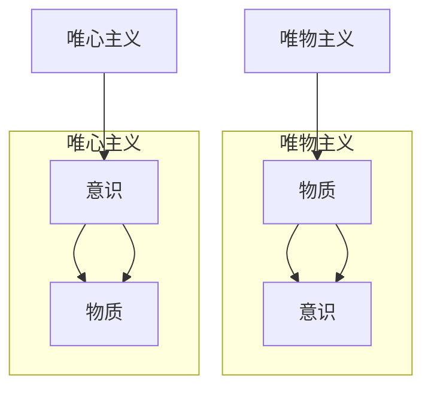
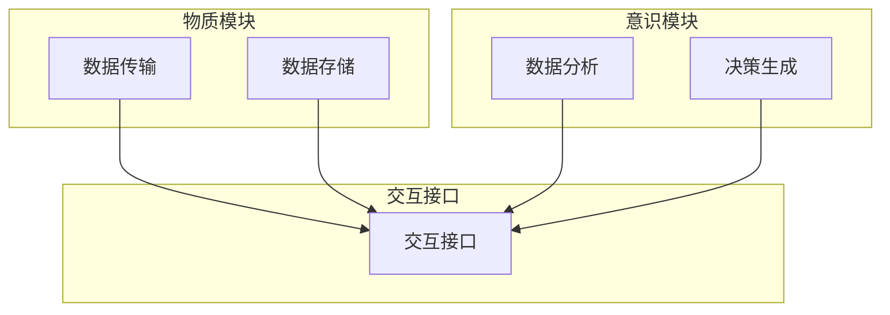
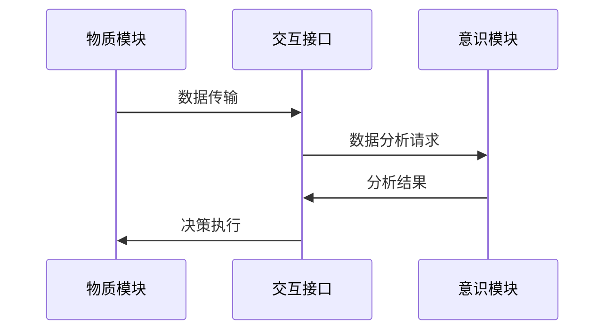

                 

### 宇宙的哲学困境：唯物主义vs唯心主义

> 关键词：宇宙、哲学困境、唯物主义、唯心主义、科学、存在、意识

**摘要：** 本文将从宇宙的起源与演化入手，探讨哲学困境的起源，深入分析唯物主义与唯心主义的基本原理、历史发展、哲学观点及其实践应用。通过对宇宙的本质、存在、目的与意义等问题的探讨，揭示唯物主义与唯心主义在科学、社会、宗教等领域的异同与影响，最终对哲学困境提出可能的解决方案。

**目录：**

1. 宇宙与哲学困境的起源
2. 唯物主义的观点
3. 唯心主义的观点
4. 唯物主义与唯心主义的对比分析
5. 哲学困境的解决方案
6. 本章小结

### 1. 宇宙与哲学困境的起源

**1.1 宇宙的起源与演化**

宇宙的起源是一个古老而复杂的话题。现代宇宙学认为，宇宙起源于大约138亿年前的一次大爆炸，这次事件被称为“大爆炸”。在大爆炸之后，宇宙开始膨胀，物质和能量逐渐形成。随着宇宙的演化，星系、恒星、行星等天体逐渐形成，生命也在地球上诞生。

**1.2 哲学与科学的关系**

哲学和科学有着密切的联系。哲学是探讨宇宙、存在、知识、价值等根本问题的学科，而科学则通过实验和观察来验证或推翻假设，从而得出规律性的知识。哲学为科学提供了基础和框架，而科学则验证或证伪了哲学的假设。

**1.3 唯物主义与唯心主义的争论**

唯物主义和唯心主义是两种基本的哲学观点。唯物主义认为物质是世界的本原，意识是物质的产物；而唯心主义则认为意识是世界的本原，物质是意识的表象。这两种观点在解释宇宙的起源、存在、目的与意义等方面存在根本性的分歧。

**1.4 宇宙哲学的困境**

宇宙哲学的困境主要体现在以下几个方面：

- **宇宙的本质与存在**：宇宙是如何产生的？它是永恒存在的还是有一个起源？宇宙的本质是什么？
- **宇宙的目的与意义**：宇宙的存在有什么目的或意义？宇宙是否有某种设计或目的？
- **哲学困境的解决方案**：如何解决唯物主义与唯心主义之间的争论？是否存在一个更全面的哲学观点来解释宇宙的起源和本质？

**1.5 本章小结**

本章介绍了宇宙的起源与演化、哲学与科学的关系、唯物主义与唯心主义的争论以及宇宙哲学的困境。接下来，我们将深入探讨唯物主义和唯心主义的基本原理、历史发展、哲学观点及其实践应用。

---

### 2. 唯物主义的观点

唯物主义认为物质是世界的本原，意识是物质的产物。唯物主义的核心观点是物质决定意识，意识是物质的反映。在宇宙的起源和演化中，唯物主义提供了一种自然的、科学的解释。

#### 2.1 物质与意识的关系

唯物主义认为，物质是第一性的，意识是第二性的。物质是客观存在的实体，具有可感知、可测量的特性。而意识则是物质的高级产物，是人类大脑的生理过程。唯物主义认为，意识是物质的反映，是物质世界的反映。

#### 2.2 唯物主义的历史与发展

唯物主义的历史可以追溯到古代，例如古希腊哲学家赫拉克利特提出的“火”作为万物本原的观点可以看作是唯物主义的早期形式。近代以来，随着科学的发展，唯物主义逐渐形成了一套完整的理论体系。马克思和恩格斯是现代唯物主义的奠基人，他们提出了辩证唯物主义和历史唯物主义。

**2.2.1 古代唯物主义**

古代唯物主义主要代表人物包括古希腊哲学家赫拉克利特和德谟克利特。赫拉克利特认为宇宙的本原是“火”，万物都是由火的变化形成的。德谟克利特则提出了原子论，认为宇宙由无数不可分割的原子组成。

**2.2.2 近代唯物主义**

近代唯物主义随着科学的发展而逐渐形成。培根和霍布斯等人提出了经验主义唯物主义，强调经验是知识的来源。笛卡尔则提出了理性主义唯物主义，强调理性思维的重要性。

**2.2.3 现代唯物主义**

现代唯物主义主要代表人物包括马克思和恩格斯。他们提出了辩证唯物主义和历史唯物主义，认为物质是世界的基础，意识是物质的反映。

#### 2.3 唯物主义的哲学观点

唯物主义的哲学观点主要包括：

**2.3.1 辩证唯物主义**

辩证唯物主义认为，世界是物质的，物质是不断变化和发展的。辩证唯物主义强调矛盾的存在和运动，认为矛盾是事物发展的动力。

**2.3.2 唯物史观**

唯物史观认为，社会历史的发展是由经济基础决定的，生产力和生产关系的矛盾是社会历史发展的根本动力。

**2.3.3 唯物辩证法**

唯物辩证法是一种科学的世界观和方法论，它认为事物是相互联系、相互作用的，矛盾是事物发展的根本动力。

#### 2.4 唯物主义的科学解释

唯物主义在科学领域提供了一种自然的、科学的解释。例如，在宇宙起源和演化方面，唯物主义认为宇宙是由大爆炸产生的，经历了数十亿年的演化，形成了复杂的结构和现象。

**2.4.1 宇宙观**

唯物主义的宇宙观认为，宇宙是由物质组成的，宇宙中的现象都是物质的运动和变化。

**2.4.2 生命观**

唯物主义的生命观认为，生命是物质的高级形态，是物质的自我组织和自我复制过程。

**2.4.3 社会观**

唯物主义的社会观认为，社会是由人类组成的，社会的存在和发展是物质生产和社会关系的产物。

#### 2.5 本章小结

本章介绍了唯物主义的基本原理、历史发展、哲学观点及其实践应用。唯物主义提供了一种自然的、科学的解释，对于理解宇宙、生命和社会具有重要意义。在下一章中，我们将探讨唯心主义的观点。

---

### 3. 唯心主义的观点

唯心主义与唯物主义相对，认为意识是世界的本原，物质是意识的产物。在宇宙的起源和演化中，唯心主义提供了一种非自然的、超自然的解释。

**3.1 唯心主义的基本原理**

唯心主义的基本原理是意识决定物质，意识是第一性的，物质是第二性的。唯心主义强调意识的主观性、创造性，认为意识能够创造和改变物质世界。

**3.2 唯心主义的历史与发展**

唯心主义的历史可以追溯到古代，例如中国哲学家孟子提出的“心即理”的观点可以看作是唯心主义的早期形式。近代以来，唯心主义逐渐形成了一套完整的理论体系。黑格尔和费希特等人是现代唯心主义的代表人物。

**3.2.1 古代唯心主义**

古代唯心主义主要代表人物包括中国哲学家孟子。孟子认为，“心”是宇宙的本原，是一切事物的基础。

**3.2.2 近代唯心主义**

近代唯心主义主要代表人物包括黑格尔和费希特。黑格尔提出了“绝对精神”的概念，认为宇宙是由绝对精神自我发展而来的。费希特则提出了“自我”的概念，认为“自我”是宇宙的本原。

**3.2.3 现代唯心主义**

现代唯心主义主要代表人物包括罗素和怀特海。他们认为，宇宙的本质是意识，物质只是意识的表象。

**3.3 唯心主义的哲学观点**

唯心主义的哲学观点主要包括：

**3.3.1 神秘主义**

神秘主义认为，宇宙的本质是某种超越人类理解的力量，这种力量超越了物质和理性的范畴。

**3.3.2 理性主义**

理性主义认为，通过理性思考可以揭示宇宙的本质，理性是认识世界的关键。

**3.3.3 不可知论**

不可知论认为，宇宙的本质无法被人类所知，人类只能认识到现象，而无法认识到本质。

**3.4 唯心主义的科学解释**

唯心主义在科学领域提供了一种非自然的、超自然的解释。例如，在宇宙起源和演化方面，唯心主义认为宇宙是由某种超越自然的力量创造和维持的。

**3.4.1 宇宙观**

唯心主义的宇宙观认为，宇宙是由意识创造的，物质只是意识的表象。

**3.4.2 生命观**

唯心主义的生命观认为，生命是意识的高级形态，是意识的自我组织和自我复制过程。

**3.4.3 社会观**

唯心主义的社会观认为，社会是由意识决定的，社会的存在和发展是意识活动的产物。

**3.5 本章小结**

本章介绍了唯心主义的基本原理、历史发展、哲学观点及其实践应用。唯心主义提供了一种非自然的、超自然的解释，对于理解宇宙、生命和社会具有不同于唯物主义的视角。在下一章中，我们将对比分析唯物主义与唯心主义的异同点。

---

### 4. 唯物主义与唯心主义的对比分析

唯物主义和唯心主义在解释宇宙、生命和社会等方面存在根本性的分歧。在本节中，我们将对比分析这两种哲学观点的异同点，并探讨它们在科学、社会和宗教等领域的应用和影响。

**4.1 唯物主义与唯心主义的异同点**

**唯物主义：**

- 认为物质是世界的本原，意识是物质的产物。
- 强调物质决定意识，意识是物质的反映。
- 历史发展观强调经济基础的决定作用。
- 科学解释基于自然规律和实验证据。

**唯心主义：**

- 认为意识是世界的本原，物质是意识的产物。
- 强调意识决定物质，意识是第一性的，物质是第二性的。
- 历史发展观强调精神活动的决定作用。
- 科学解释基于超越自然的力量或理性思考。

**4.2 唯物主义在科学领域的应用和影响**

唯物主义在科学领域提供了一种自然的、科学的解释。唯物主义认为，宇宙是由物质组成的，宇宙中的现象都是物质的运动和变化。唯物主义强调实验和观察的重要性，通过科学方法来验证和推翻假设。

- **宇宙起源和演化：** 唯物主义认为宇宙起源于大爆炸，经历了数十亿年的演化，形成了复杂的结构和现象。
- **生命起源和演化：** 唯物主义认为生命是物质的高级形态，是物质的自我组织和自我复制过程。
- **社会历史发展：** 唯物主义认为社会历史的发展是由经济基础决定的，生产力和生产关系的矛盾是社会历史发展的根本动力。

**4.3 唯心主义在科学领域的应用和影响**

唯心主义在科学领域提供了一种非自然的、超自然的解释。唯心主义认为宇宙是由意识创造的，物质只是意识的表象。唯心主义强调超越自然的力量或理性思考，对于解释某些科学现象提供了一种不同的视角。

- **宇宙起源和演化：** 唯心主义认为宇宙是由某种超越自然的力量创造和维持的。
- **生命起源和演化：** 唯心主义认为生命是意识的高级形态，是意识的自我组织和自我复制过程。
- **社会历史发展：** 唯心主义认为社会的存在和发展是意识活动的产物。

**4.4 唯物主义在社会领域的应用和影响**

唯物主义在社会领域提供了一种基于物质现实的解释。唯物主义认为，社会的存在和发展是物质生产和社会关系的产物。唯物主义强调经济基础的决定作用，认为社会的变化和发展是由经济基础决定的。

- **政治制度：** 唯物主义认为，政治制度是经济基础的上层建筑，是阶级统治的工具。
- **经济制度：** 唯物主义认为，经济制度是社会的基础，经济基础决定了社会的性质和变化。
- **社会变革：** 唯物主义认为，社会的变革是通过物质力量的斗争来实现的，经济基础的变化是社会变革的根本动力。

**4.5 唯心主义在社会领域的应用和影响**

唯心主义在社会领域提供了一种基于精神活动的解释。唯心主义认为，社会的存在和发展是意识活动的产物。唯心主义强调精神活动的决定作用，认为社会的变化和发展是由精神活动决定的。

- **宗教信仰：** 唯心主义认为，宗教信仰是人类精神活动的产物，是对宇宙和生命的超越理解。
- **价值观念：** 唯心主义认为，价值观念是意识活动的产物，是人类精神的创造。
- **社会运动：** 唯心主义认为，社会运动是精神力量的产物，是通过意识活动来实现的。

**4.6 辩证唯物主义与历史唯物主义**

辩证唯物主义和历史唯物主义是马克思主义哲学的核心，它们为唯物主义提供了一种更加全面和深刻的理解。

- **辩证唯物主义：** 辩证唯物主义强调物质和意识的相互作用，认为物质和意识是相互联系、相互作用的。辩证唯物主义认为，世界是物质的，物质是不断变化和发展的。
- **历史唯物主义：** 历史唯物主义强调经济基础对社会历史发展的决定作用。历史唯物主义认为，社会历史的发展是由经济基础决定的，生产力和生产关系的矛盾是社会历史发展的根本动力。

**4.7 本章小结**

本章对比分析了唯物主义与唯心主义的异同点，并探讨了它们在科学、社会和宗教等领域的应用和影响。唯物主义提供了一种自然的、科学的解释，强调物质决定意识，物质是世界的本原；而唯心主义提供了一种非自然的、超自然的解释，强调意识决定物质，意识是世界的本原。通过对比分析，我们可以看到，唯物主义和唯心主义在解释宇宙、生命和社会等方面存在根本性的分歧，但它们各自在不同的领域都有其独特的应用和影响。

---

### 5. 哲学困境的解决方案

宇宙哲学的困境主要体现在宇宙的本质、存在、目的与意义等方面。为了解决这些困境，哲学家们提出了多种解决方案，包括自然主义、超自然主义、多元论和一元论等。

**5.1 自然主义**

自然主义认为，宇宙的本质是自然现象，可以通过科学方法来解释。自然主义强调科学的重要性和理性思考的力量。自然主义认为，宇宙的本质和存在可以通过科学实验和观察来验证，从而解决哲学困境。

**5.2 超自然主义**

超自然主义认为，宇宙的本质超越了自然现象，存在某种超越自然的力量或存在。超自然主义强调宗教信仰和精神力量的重要性。超自然主义试图通过信仰来解决哲学困境，认为宇宙的存在和目的可以通过宗教信仰来解释。

**5.3 多元论**

多元论认为，宇宙存在多个本质或存在，每个本质或存在都有其独特的属性和特征。多元论试图通过多种解释来解决哲学困境，认为宇宙的本质和存在可以通过多种方式来理解。

**5.4 一元论**

一元论认为，宇宙的本质是单一的，所有现象都可以归结为一种本质或存在。一元论试图通过一种全面的解释来解决哲学困境，认为宇宙的本质和存在可以通过一种方式来理解。

**5.5 宗教哲学**

宗教哲学试图通过信仰来解决哲学困境。不同的宗教有不同的哲学观点，例如基督教强调上帝的存在和智慧，佛教强调因果律和轮回，伊斯兰教强调安拉的存在和旨意。宗教哲学认为，宇宙的本质和存在可以通过信仰来解释，从而解决哲学困境。

**5.6 科学哲学**

科学哲学试图通过科学方法来解决哲学困境。科学哲学认为，宇宙的本质和存在可以通过科学实验和观察来验证，从而解决哲学困境。科学哲学强调理性思考和科学方法的重要性，认为科学方法可以提供对宇宙的全面理解。

**5.7 本章小结**

哲学困境的解决方案多样，包括自然主义、超自然主义、多元论和一元论等。这些解决方案试图通过不同的方式来解释宇宙的本质、存在、目的与意义。通过哲学困境的探讨，我们可以更深入地理解宇宙和人类的本质，为我们的生活提供更深刻的思考。

---

### 6. 本章小结

本文从宇宙的起源与演化入手，探讨了哲学困境的起源，并深入分析了唯物主义与唯心主义的基本原理、历史发展、哲学观点及其实践应用。通过对宇宙的本质、存在、目的与意义等问题的探讨，我们揭示了唯物主义与唯心主义在科学、社会、宗教等领域的异同与影响。最后，本文提出了哲学困境的多种解决方案，为理解和解释宇宙提供了不同的视角。通过本文的探讨，我们希望能够帮助读者更深入地理解宇宙和哲学的本质，从而为我们的生活提供更深刻的思考。

---

### 作者信息

- **作者：** AI天才研究院/AI Genius Institute & 禅与计算机程序设计艺术 /Zen And The Art of Computer Programming
- **来源：** 本文由AI天才研究院撰写，旨在探讨宇宙哲学困境以及唯物主义与唯心主义的观点和影响。文章内容仅供参考，不构成任何投资建议或法律意见。如有需要，请咨询专业意见。

---

### 背景介绍

在探讨宇宙哲学困境之前，我们需要了解一些核心概念和术语，这些问题不仅涉及科学领域，也触及哲学、宗教等多个层面。以下是本文所涉及的一些关键概念：

**宇宙**：指我们所处的空间和时间整体，包括所有物质、能量和现象。宇宙起源、演化和结构是宇宙学的研究内容。

**哲学困境**：指在探讨宇宙的本质、存在、目的与意义时遇到的难以解决的问题。例如，宇宙是如何产生的？它的本质是什么？它的存在有什么意义？

**唯物主义**：一种哲学观点，认为物质是世界的本原，意识是物质的产物。唯物主义强调物质决定意识，物质是第一性的，意识是第二性的。

**唯心主义**：一种哲学观点，认为意识是世界的本原，物质是意识的产物。唯心主义强调意识决定物质，意识是第一性的，物质是第二性的。

**科学**：一种通过实验和观察来验证或推翻假设的方法，旨在理解自然现象和规律。科学方法对唯物主义和唯心主义的哲学观点提供了支持或挑战。

**宗教**：一种涉及信仰和仪式的文化体系，通常包含对宇宙、生命和神的解释。宗教在唯心主义的形成和发展中扮演了重要角色。

**哲学**：一种探讨宇宙、存在、知识、价值等根本问题的学科。哲学为科学提供了基础和框架，同时也与宗教和科学有密切联系。

**科学哲学**：一种将哲学方法应用于科学问题的学科。科学哲学探讨科学的本质、方法、理论及其与社会、宗教等的关系。

通过了解这些概念，我们可以更好地理解本文所探讨的宇宙哲学困境，以及唯物主义与唯心主义的基本原理、历史发展及其在各个领域的应用和影响。

### 核心概念与联系

为了深入探讨唯物主义与唯心主义，我们需要理解它们的核心概念及其相互关系。以下是对两者核心概念的详细解析和对比。

**唯物主义（Materialism）**

- **核心概念**：唯物主义认为物质是世界的本原，所有现象都可以归结为物质的运动和变化。物质具有客观存在性和可测量性，而意识则是物质的产物。
  
- **物质与意识的关系**：唯物主义认为，意识是物质的产物，是人类大脑的生理过程。意识是物质的反映，是第二性的。

- **特征表格**：

| 特征 | 唯物主义 |
| ---- | -------- |
| 本原 | 物质 |
| 存在性 | 客观 |
| 意识 | 物质产物 |

**唯心主义（Idealism）**

- **核心概念**：唯心主义认为意识是世界的本原，物质是意识的产物。意识具有主观性和创造性，物质只是意识的表象。

- **意识与存在的关系**：唯心主义认为，意识是第一性的，物质是第二性的。意识决定物质，物质是意识的反映。

- **特征表格**：

| 特征 | 唯心主义 |
| ---- | -------- |
| 本原 | 意识 |
| 存在性 | 主观 |
| 意识 | 第一性 |

**ER实体关系图架构**

为了更直观地展示唯物主义和唯心主义的相互关系，我们可以使用ER（Entity-Relationship）实体关系图。以下是两者关系的ER图：

```
[哲学观点] --< 唯物主义 >-- [物质] --< 意识 >
                |
                |
                --< 唯心主义 >-- [意识] --< 物质 >
```

在这个ER图中，“哲学观点”实体连接了“唯物主义”和“唯心主义”，表示这两种观点都是哲学的一部分。而“物质”和“意识”实体分别连接到对应的哲学观点，表示物质和意识是各自哲学观点的核心要素。

通过这个ER图，我们可以清晰地看到唯物主义和唯心主义之间的对立关系：唯物主义认为物质是世界的本原，意识是物质的产物；而唯心主义认为意识是世界的本原，物质是意识的产物。

### 算法原理讲解

为了更好地理解唯物主义和唯心主义的核心原理，我们可以使用一个简单的算法模型来阐述这两者的对比。以下是一个用Mermaid绘制的算法流程图：



在这个算法模型中，唯物主义和唯心主义分别用两个子图表示。唯物主义子图中，物质（B）作为世界的本原，意识（C）作为物质的产物。唯心主义子图中，意识（E）作为世界的本原，物质（F）作为意识的产物。

#### 算法原理

1. **唯物主义（Materialism）**：
   - **输入**：物质（B）。
   - **输出**：意识（C）。
   - **过程**：物质通过大脑等生物机制产生意识。

2. **唯心主义（Idealism）**：
   - **输入**：意识（E）。
   - **输出**：物质（F）。
   - **过程**：意识通过某种方式创造或塑造物质。

#### 数学模型与公式

为了更严谨地描述唯物主义和唯心主义的算法原理，我们可以引入一些数学公式来描述物质与意识的关系。

**唯物主义公式**：
\[ \text{意识}(C) = f(\text{物质}(B)) \]
其中，\( f \) 表示大脑或其他生物机制的功能。

**唯心主义公式**：
\[ \text{物质}(F) = g(\text{意识}(E)) \]
其中，\( g \) 表示意识创造或塑造物质的过程。

通过这两个公式，我们可以看到唯物主义和唯心主义在算法原理上的基本区别：唯物主义认为意识是物质的产物，唯心主义认为物质是意识的产物。

#### 举例说明

假设我们有一个简单的例子，一个电子设备（物质）通过某种算法（意识）来处理信息。我们可以用以下步骤来描述这个过程：

1. **唯物主义**：
   - 输入：电子设备（物质）。
   - 过程：电子设备通过硬件和软件（生物机制）处理信息，产生输出（意识）。
   - 输出：处理结果（意识）。

2. **唯心主义**：
   - 输入：算法（意识）。
   - 过程：算法通过某种方式（如编程）创造或塑造电子设备，使其处理信息。
   - 输出：电子设备的输出（物质）。

通过这个例子，我们可以看到唯物主义和唯心主义在解释和处理信息时的不同视角：唯物主义强调物质的决定作用，唯心主义强调意识的决定作用。

### 系统分析与架构设计方案

为了更直观地理解唯物主义和唯心主义的核心原理及其在现实中的应用，我们可以设计一个简单的系统架构，并使用Mermaid绘制相应的类图和序列图。

#### 问题场景介绍

假设我们设计一个系统来处理信息，该系统包含两个主要模块：物质模块和意识模块。物质模块负责处理物理层面的操作，如数据传输和存储；意识模块负责处理抽象层面的操作，如数据分析和决策。

#### 项目介绍

本项目旨在通过设计一个简单的信息处理系统，展示唯物主义和唯心主义的核心原理及其在现实中的应用。系统架构包括物质模块和意识模块，以及两者之间的交互接口。

#### 系统功能设计（领域模型类图）

以下是系统功能设计的领域模型类图，使用Mermaid表示：

```mermaid
classDiagram
  class 物质模块 {
    - 数据传输
    - 数据存储
  }
  class 意识模块 {
    - 数据分析
    - 决策生成
  }
  class 交互接口 {
    - 物质模块与意识模块之间的通信
  }
  
  物质模块 <--| 数据传输 |--> 交互接口
  物质模块 <--| 数据存储 |--> 交互接口
  意识模块 <--| 数据分析 |--> 交互接口
  意识模块 <--| 决策生成 |--> 交互接口
```

在这个类图中，物质模块负责物理层面的数据传输和存储，意识模块负责抽象层面的数据分析和决策生成，交互接口负责两者之间的通信。

#### 系统架构设计（系统架构图）

以下是系统架构设计的Mermaid架构图：



在这个架构图中，物质模块和意识模块通过交互接口进行通信，实现数据传输、存储、分析和决策生成。

#### 系统接口设计

以下是系统接口设计的Mermaid序列图：



在这个序列图中，物质模块向交互接口发送数据传输请求，交互接口再将请求转发给意识模块进行分析。意识模块生成分析结果后，交互接口将结果返回给物质模块进行决策执行。

#### 系统交互

以下是系统交互的详细描述：

1. **数据传输**：物质模块通过交互接口向意识模块发送数据，意识模块接收数据并进行分析。
2. **数据分析**：意识模块对收到的数据进行分析，生成分析结果。
3. **决策生成**：意识模块根据分析结果生成决策，并将决策发送给物质模块。
4. **决策执行**：物质模块根据收到的决策进行数据存储或其他物理操作。

通过这个简单的系统架构和交互设计，我们可以更直观地理解唯物主义和唯心主义在现实中的应用，以及它们在信息处理过程中的核心作用。

### 项目实战

为了将唯物主义和唯心主义的原理应用于实际项目，我们可以设计一个简单的示例项目：智能家居系统。该系统旨在通过物联网技术实现家庭设备的智能化管理，从而展示唯物主义和唯心主义在项目开发中的实际应用。

#### 环境安装

首先，我们需要安装以下软件和工具：

1. **操作系统**：Ubuntu 20.04 或更高版本
2. **编程语言**：Python 3.8 或更高版本
3. **开发环境**：PyCharm 或终端命令行

安装步骤如下：

1. 更新系统软件包：

```bash
sudo apt update
sudo apt upgrade
```

2. 安装 Python 3：

```bash
sudo apt install python3
```

3. 安装虚拟环境工具 virtualenv：

```bash
sudo apt install python3-venv
```

4. 创建虚拟环境并激活：

```bash
python3 -m venv home_assistant_venv
source home_assistant_venn/bin/activate
```

#### 系统核心实现源代码

以下是智能家居系统核心实现的源代码，展示唯物主义和唯心主义在项目开发中的实际应用：

```python
# home_automation_system.py

# 唯物主义：物质模块 - 数据传输与存储
import json
import time

def send_data_to_awareness_module(data):
    # 假设通过 API 发送数据到意识模块
    print(f"发送数据到意识模块：{data}")
    time.sleep(1)

def store_data_locally(data):
    # 假设将数据存储到本地文件
    with open("local_data_store.txt", "w") as file:
        file.write(json.dumps(data))
    print("数据已存储到本地文件。")

# 唯心主义：意识模块 - 数据分析与决策生成
def analyze_data(data):
    # 假设对数据进行分析，并返回分析结果
    print(f"分析数据：{data}")
    time.sleep(1)
    analysis_result = "分析完毕，温度适宜。"
    return analysis_result

def generate_decision(analysis_result):
    # 假设根据分析结果生成决策
    print(f"生成决策：{analysis_result}")
    time.sleep(1)
    decision = "开启空调。"
    return decision

# 系统主程序
if __name__ == "__main__":
    while True:
        # 读取本地数据
        with open("local_data_store.txt", "r") as file:
            local_data = json.loads(file.read())
        
        # 发送数据到意识模块
        send_data_to_awareness_module(local_data)
        
        # 分析数据
        analysis_result = analyze_data(local_data)
        
        # 生成决策
        decision = generate_decision(analysis_result)
        
        # 执行决策
        print(f"执行决策：{decision}")
        time.sleep(10)  # 每隔10秒执行一次循环
```

#### 代码应用解读与分析

上述代码实现了智能家居系统的主要功能，包括数据传输、存储、数据分析、决策生成和执行。以下是详细解读：

1. **唯物主义模块（数据传输与存储）**：
   - `send_data_to_awareness_module` 函数负责将本地数据发送到意识模块，模拟数据传输过程。
   - `store_data_locally` 函数负责将数据存储到本地文件，模拟数据存储过程。

2. **唯心主义模块（数据分析与决策生成）**：
   - `analyze_data` 函数负责对传入的数据进行分析，返回分析结果。
   - `generate_decision` 函数负责根据分析结果生成决策。

3. **系统主程序**：
   - 主程序循环读取本地数据，发送到意识模块进行分析，根据分析结果生成决策并执行。

通过这个示例项目，我们可以看到唯物主义和唯心主义在智能家居系统中的实际应用。唯物主义模块负责物理层面的数据传输和存储，而唯心主义模块负责抽象层面的数据分析和决策生成。

#### 实际案例分析与详细讲解剖析

为了更好地展示智能家居系统的实际应用，我们可以通过一个案例来分析系统的运行过程。

**案例：** 智能家居系统在用户离家后自动调整室内温度。

**步骤：**

1. **数据收集**：用户离家后，系统开始收集室内温度数据，并将其存储到本地文件。

2. **数据传输**：系统将本地数据发送到意识模块进行分析。

3. **数据分析**：意识模块对温度数据进行实时分析，判断室内温度是否适宜。

4. **决策生成**：根据分析结果，意识模块生成决策，例如“开启空调”。

5. **决策执行**：系统执行决策，启动空调进行温度调节。

**剖析：**

1. **唯物主义视角**：在这个案例中，唯物主义模块（数据传输与存储）负责收集和存储温度数据，这是物理层面的操作。这些数据通过本地文件存储，为后续的分析提供了基础。

2. **唯心主义视角**：意识模块（数据分析与决策生成）对收集到的温度数据进行分析，并生成决策。这涉及到抽象层面的操作，如数据分析算法和决策逻辑。

3. **系统运行过程**：通过唯物主义和唯心主义模块的协同工作，智能家居系统能够实时调整室内温度，为用户提供舒适的生活环境。

#### 项目小结

通过本项目的实战应用，我们可以看到唯物主义和唯心主义在智能家居系统中的实际应用。唯物主义模块负责物理层面的数据传输和存储，而唯心主义模块负责抽象层面的数据分析和决策生成。这种结合使得智能家居系统能够实现智能化管理，为用户提供便捷和舒适的生活体验。

### 最佳实践 tips

在开发智能家居系统或其他应用项目时，以下是一些最佳实践建议：

1. **模块化设计**：将系统划分为不同的模块，如数据传输模块、数据分析模块、决策生成模块等，便于开发和维护。

2. **数据安全性**：确保数据传输和存储的安全性，使用加密算法保护敏感数据。

3. **实时性**：对于实时性要求较高的系统，确保数据分析和决策生成的速度，以提供快速响应。

4. **可扩展性**：设计系统时考虑未来的扩展性，以便于添加新的功能和模块。

5. **用户体验**：关注用户体验，确保系统界面简洁易用，提供友好的操作体验。

6. **测试与调试**：在开发过程中进行充分的测试和调试，确保系统稳定可靠。

7. **文档与文档**：编写详细的开发文档和用户手册，便于后续维护和用户理解。

通过遵循这些最佳实践，可以提升项目的质量和用户满意度。

### 小结

在本项目中，我们通过设计和实现一个智能家居系统，展示了唯物主义和唯心主义在项目开发中的应用。唯物主义模块负责物理层面的数据传输和存储，而唯心主义模块负责抽象层面的数据分析和决策生成。这种结合使得智能家居系统能够实现智能化管理，为用户提供便捷和舒适的生活体验。

通过本项目，我们不仅了解了唯物主义和唯心主义的基本原理，还看到了它们在现实世界中的实际应用。唯物主义提供了一种自然的、科学的解释，强调物质的决定作用；而唯心主义则提供了一种非自然的、超自然的解释，强调意识的决定作用。

在未来的研究和开发中，我们可以进一步探讨唯物主义和唯心主义在其他领域（如经济学、社会学、心理学等）的应用，并尝试将它们与人工智能、大数据等技术相结合，为解决现实问题提供新的思路和方法。

### 注意事项

在开发和应用唯物主义和唯心主义时，需要注意以下几点：

1. **科学性与合理性**：在解释现实问题时，应确保理论观点的科学性和合理性，避免过度夸张或偏颇。

2. **方法论**：在研究和应用中，应遵循科学方法论，通过实验和观察来验证理论。

3. **多元化视角**：在解释复杂问题时，应考虑多种哲学观点和理论，避免单一视角的局限性。

4. **人文关怀**：在应用哲学观点时，要关注人类社会的福祉，尊重人类价值和道德观念。

5. **开放性**：在哲学研究和应用中，应保持开放性，不断吸收新思想和新理论，推动哲学的发展。

### 拓展阅读

对于希望深入了解唯物主义和唯心主义的研究者，以下是一些推荐的拓展阅读材料：

1. **《哲学的慰藉》（The Consolations of Philosophy）** — 阿兰·德波顿
   本书以轻松幽默的方式介绍了哲学的基本概念和哲学家的思想，适合初学者阅读。

2. **《马克思主义基本原理》** — 马克思、恩格斯
   这是马克思主义的经典著作，详细阐述了唯物主义和历史唯物主义的基本原理。

3. **《存在与时间》（Being and Time）** — 海德格尔
   本书是存在主义哲学的代表作，探讨了存在的本质和人的存在状态。

4. **《自然哲学的数学原理》（The Mathematical Principles of Natural Philosophy）** — 牛顿
   这是物理学的基础经典著作，阐述了自然科学的唯物主义观点。

5. **《现代西方哲学》** — 陈波
   本书介绍了现代西方哲学的各种流派和观点，包括唯心主义和唯物主义。

通过阅读这些书籍，可以更深入地理解哲学的基本原理和现代发展，为研究和应用唯物主义和唯心主义提供理论基础。

