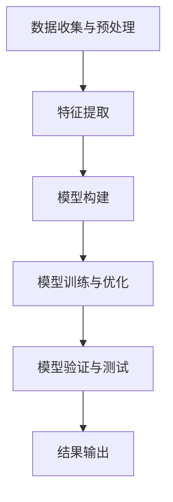
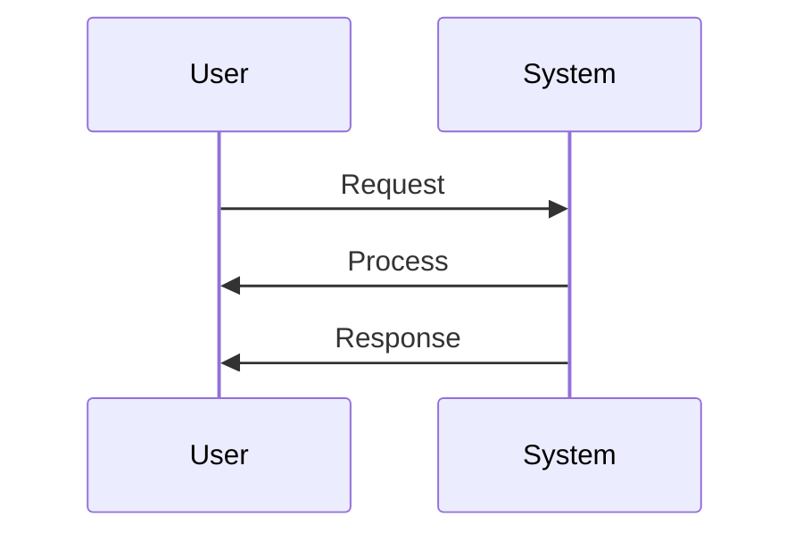
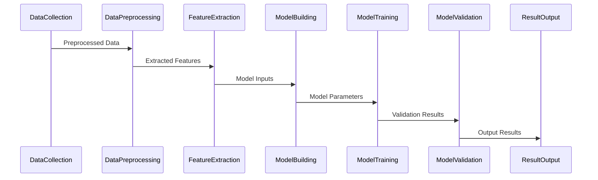

                 

### 引言

#### 书名与主题解析

《宇宙的复杂性：还原论的失效》这个书名直接指向了宇宙学中一个深层次的问题：还原论在解释宇宙复杂性时的失效。还原论，作为一种科学方法论，其核心思想是通过对系统的各个组成部分进行分解和分析，以理解整体系统的行为。然而，当我们深入到宇宙这一复杂系统时，传统还原论的方法开始显得力不从心。书名中的“复杂性”指的是宇宙中众多变量、多层次结构以及非线性关系的交织，而“失效”则强调传统还原论在这一领域中的局限性。

#### 核心问题：还原论在宇宙研究中的失效

在宇宙学中，我们面对的是一个庞大且复杂的系统，它包含了从微观的量子尺度到宏观的宇宙尺度。在这一背景下，还原论所依赖的简化模型和线性因果关系开始失去效力。例如，在描述宇宙大爆炸、黑洞行为或暗物质暗能量等宇宙现象时，传统还原论方法往往难以解释这些复杂现象背后的本质。具体而言，以下问题是本书探讨的核心：

1. **还原论如何处理宇宙的层次结构？**：宇宙中存在多个层次的结构，从行星系统到星系团，再到宇宙整体。这些层次之间的相互作用和相互影响如何被还原论所解释？
2. **还原论在量子力学和广义相对论的融合中面临什么挑战？**：量子力学和广义相对论是现代物理学的两大支柱，但它们在描述宇宙时却存在根本性的不兼容。还原论如何弥合这一裂痕？
3. **非线性动力学和非均衡态热力学对还原论的挑战是什么？**：宇宙中的许多现象，如混沌、非线性动力学和复杂的非平衡态，如何通过还原论来理解？

#### 目标读者

本书的目标读者包括宇宙学研究者、物理学爱好者以及对复杂性科学感兴趣的读者。对于那些希望深入了解宇宙复杂性的科学家和学者，本书提供了一个全新的视角，通过探索还原论的失效，帮助读者理解宇宙的深层次结构。而对于物理学爱好者，本书则通过生动的实例和详细的解释，使得复杂的宇宙学概念变得易于理解。

通过上述引言部分，我们为读者搭建了一个基本的框架，引导他们进入一个关于宇宙复杂性的深度探索之旅。在接下来的章节中，我们将逐步深入，探讨还原论在宇宙研究中的失效，并探索复杂性理论如何为我们理解宇宙提供新的工具和视角。

---

关键词：宇宙复杂性、还原论、复杂性理论、量子力学、非线性动力学

摘要：《宇宙的复杂性：还原论的失效》探讨了在现代宇宙学中，传统还原论方法在面对宇宙多层次结构、非线性动力学和非平衡态热力学时遇到的挑战。本书通过详细的分析和案例研究，揭示了复杂性理论在理解宇宙复杂性中的重要性，并提出了新的研究方法和模型。

### 第1章 引言

#### 书名与主题解析

《宇宙的复杂性：还原论的失效》这个书名传达了两个核心概念。首先，“宇宙的复杂性”强调了我们在研究宇宙时所面临的挑战。宇宙是由多个层次、多种物理现象和高度非线性的动态系统构成的，这使得对宇宙的全面理解变得异常复杂。其次，“还原论的失效”则指出了在处理这种复杂性时，传统的还原论方法不再有效。

还原论是一种科学方法论，其基本思想是通过将复杂系统分解成更小的、更简单的组成部分，从而理解整体系统的行为。然而，当面对宇宙这种高度复杂的系统时，还原论的局限性变得尤为明显。在本书中，我们将深入探讨这些局限性，并探索新的理论和方法来应对宇宙的复杂性。

#### 核心问题：还原论在宇宙研究中的失效

宇宙研究中的核心问题之一是还原论方法在面对宇宙复杂性时的失效。具体来说，这个问题可以从以下几个方面展开：

1. **宇宙层次结构的多样性**：宇宙中存在多个层次的结构，从行星系统到星系团，再到超星系团，每个层次之间的相互作用和影响都非常复杂。传统还原论方法通常将问题简化为线性因果关系，而宇宙中多层次结构的复杂性使得这种方法不再适用。

2. **非线性动力学的挑战**：宇宙中的许多现象，如混沌和复杂的非线性动态系统，无法简单地通过线性因果关系来解释。例如，宇宙大爆炸的膨胀模式和黑洞的行为，都涉及到非线性动力学，这使得传统还原论方法难以处理。

3. **量子力学与广义相对论的不兼容**：量子力学和广义相对论是现代物理学的两大支柱，但它们在描述宇宙时存在根本性的不兼容。传统还原论方法试图通过简单的组合来弥合这一裂痕，但这种方法在面对量子引力和宇宙背景辐射等复杂问题时，显得无能为力。

4. **非平衡态热力学的挑战**：宇宙中的许多系统都处于复杂的非平衡态，如恒星演化、星系碰撞和宇宙膨胀。这些非平衡态系统中的能量和信息流动非常复杂，传统还原论方法难以有效地描述和解释这些现象。

#### 目标读者

本书的目标读者主要包括以下几类：

1. **宇宙学研究者**：这些读者对宇宙学中的复杂问题有着深入的兴趣，希望通过本书了解还原论失效的问题，并探索新的研究方法。
2. **物理学爱好者**：对于对物理学特别是宇宙学感兴趣的读者，本书通过详细的解释和案例研究，提供了深入了解宇宙复杂性的途径。
3. **复杂性科学研究者**：对于对复杂性科学感兴趣的读者，本书探讨了复杂性理论在宇宙研究中的应用，提供了新的视角和方法。

通过上述引言，我们为读者搭建了一个基本的框架，引导他们进入一个关于宇宙复杂性的深度探索之旅。在接下来的章节中，我们将逐步深入，探讨还原论在宇宙研究中的失效，并探索复杂性理论如何为我们理解宇宙提供新的工具和视角。

---

关键词：宇宙复杂性、还原论、复杂性理论、非线性动力学、非平衡态热力学

摘要：《宇宙的复杂性：还原论的失效》探讨了在现代宇宙学中，传统还原论方法在面对宇宙多层次结构、非线性动力学和非平衡态热力学时遇到的挑战。本书通过详细的分析和案例研究，揭示了复杂性理论在理解宇宙复杂性中的重要性，并提出了新的研究方法和模型。

## 第2章 核心概念与联系

### 2.1 还原论：定义与历史背景

还原论是一种科学方法论，其核心思想是通过将复杂系统分解成更小的、更简单的组成部分，从而理解整体系统的行为。这种方法的起源可以追溯到古希腊时期，当时哲学家亚里士多德提出了通过分解来理解自然界的基本原理。然而，现代还原论的正式发展始于17世纪的科学革命，特别是在物理学和生物学领域。

在物理学中，伽利略和牛顿的经典力学通过分解物体运动的基本原理，建立了复杂的物理现象的理论基础。在生物学中，达尔文的自然选择理论通过将物种进化分解成个体基因的变异和选择，解释了生物多样性的形成。

还原论在科学研究中具有广泛的应用，尤其是在实验科学和工程学领域。它使得科学家和工程师能够通过控制单一变量来研究复杂系统的行为。例如，在医学研究中，通过分解生物体各个器官的功能来研究疾病的机理；在工程学中，通过分解复杂的机械系统来设计和优化其性能。

然而，尽管还原论在许多情况下非常有效，但它也有局限性。特别是在面对高度复杂和高度非线性的系统时，如宇宙和生命系统，传统的还原论方法开始显得力不从心。

### 2.2 复杂性理论：基本概念与原理

复杂性理论是研究复杂系统行为和性质的一门科学。复杂性理论的核心概念包括：

1. **复杂系统的层次结构**：复杂系统通常具有多个层次的结构，从微观的原子和分子，到宏观的生态系统和宇宙结构。每个层次都包含其独特的复杂性特征。

2. **非线性动力学**：复杂系统中的变量之间存在非线性关系，这意味着它们的行为不能用简单的线性因果关系来描述。非线性动力学导致了混沌现象的出现，即系统在初始条件的微小差异会导致长期行为的巨大差异。

3. **涌现性**：复杂系统中的个体元素之间的相互作用会导致新的、宏观的现象出现，这些现象无法从单个元素的行为中直接推导出来。例如，蚂蚁的集体行为和鸟群的飞行行为都是涌现性的体现。

4. **自组织**：复杂系统中的个体元素通过相互合作和适应环境，形成有序的结构和行为，而不需要外部指令或控制。

复杂性理论的原理主要包括：

- **分形几何**：分形几何描述了复杂系统的自相似性特征，即系统在不同尺度上具有相似的结构。
- **网络理论**：网络理论研究复杂系统中的相互作用和连接方式，通过分析网络的拓扑结构和动态行为来理解系统的性质。
- **计算复杂性**：计算复杂性研究复杂系统在计算和处理信息时的难度和效率。

### 2.3 复杂性理论与还原论的关系

复杂性理论与还原论之间既有联系也有区别。还原论通过将复杂系统分解为更简单的组成部分来理解整体行为，而复杂性理论则通过研究复杂系统中的整体行为和个体元素之间的相互作用来理解系统的复杂性。

在某些情况下，复杂性理论可以被视为还原论的一种扩展。例如，在生物学中，通过研究单个基因和蛋白质的相互作用，我们可以理解生命系统的复杂性。然而，复杂性理论强调的是整体性和涌现性，而还原论则更注重部分和因果关系。

另一方面，复杂性理论对还原论的挑战在于，它指出在高度复杂的系统中，简单的因果关系和线性模型可能无法充分解释系统的行为。复杂性理论提供了新的方法和工具来处理这些复杂系统，如非线性动力学、网络理论和计算复杂性。

### 2.4 量子力学与非均衡态热力学对还原论的挑战

量子力学和非均衡态热力学是现代物理学中的两个重要理论，它们对传统还原论提出了严峻的挑战。

1. **量子力学**：
   - **量子叠加态**：量子系统可以处于多个状态的叠加，这打破了经典物理中状态确定性原则。
   - **量子纠缠**：两个或多个量子粒子之间可以存在强烈的相互依赖关系，这种纠缠现象无法通过简单的因果关系来解释。
   - **量子非定域性**：量子力学中的现象不受空间距离限制，这挑战了经典物理中的局域性原则。

2. **非均衡态热力学**：
   - **非平衡态**：复杂系统往往处于非平衡态，这意味着系统内部存在能量和信息的不均匀分布。
   - **复杂相变**：非平衡态系统在温度、压力等参数变化时可能经历复杂相变，这些相变过程无法通过简单的相变理论来描述。
   - **自组织现象**：非平衡态系统中常常出现自组织现象，如自发形成有序结构、波等现象。

量子力学和非均衡态热力学揭示了传统还原论方法在处理复杂系统时的局限性，尤其是在量子效应和非平衡态现象普遍存在的宇宙尺度上。这些理论要求我们采用新的方法和视角来理解宇宙的复杂性。

### 2.5 神经网络与复杂系统模拟在宇宙研究中的应用

神经网络和复杂系统模拟是复杂性理论中的重要工具，它们在宇宙研究中有着广泛的应用。

1. **神经网络**：
   - **深度学习模型**：深度学习模型可以用于模拟宇宙中的复杂现象，如星系演化、黑洞行为等。通过训练大型神经网络，我们可以从大量数据中提取有用的模式和规律。
   - **卷积神经网络（CNN）**：CNN在处理图像数据方面表现出色，可以用于分析天文图像，识别星体、行星等天体。
   - **循环神经网络（RNN）**：RNN可以处理序列数据，用于模拟宇宙中的时间序列现象，如宇宙膨胀速率的变化。

2. **复杂系统模拟**：
   - **多体模拟**：通过模拟宇宙中多个天体的相互作用，可以研究星系的形成、演化等过程。
   - **蒙特卡罗方法**：蒙特卡罗方法可以用于模拟宇宙中的随机过程，如星系碰撞、暗物质分布等。
   - **元胞自动机**：元胞自动机可以模拟宇宙中的自组织现象，如星云的形成、星际物质分布等。

神经网络和复杂系统模拟为宇宙研究提供了新的工具和方法，通过这些工具，我们可以更深入地理解宇宙的复杂性。

通过上述讨论，我们探讨了还原论、复杂性理论以及量子力学和非均衡态热力学在宇宙研究中的应用和关系。复杂性理论为理解宇宙的复杂性提供了新的视角和方法，而量子力学和非均衡态热力学则揭示了传统还原论方法的局限性。在接下来的章节中，我们将进一步探讨如何构建和解析复杂性宇宙模型，为读者提供更深入的见解。

## 第3章 算法原理讲解

在处理宇宙复杂性时，传统的还原论方法由于其简化和线性假设的局限性，已经不再适用于现代宇宙学研究。为了更好地理解宇宙的复杂性，我们需要采用一种新的方法——复杂性宇宙模型构建方法。这一方法通过非线性动力学、复杂网络和深度学习等工具，从整体和微观层面同时进行分析，以揭示宇宙现象的深层机制。下面，我们将详细讲解这种模型构建方法，并使用Python代码和LaTeX公式来阐述其原理。

### 3.1 复杂性宇宙模型构建方法

复杂性宇宙模型构建方法的主要步骤如下：

1. **数据收集与预处理**：
   首先，我们需要收集大量的宇宙观测数据，包括星系分布、宇宙微波背景辐射、黑洞行为等。然后，对数据进行清洗和预处理，以确保其质量和一致性。

2. **特征提取**：
   通过对预处理后的数据进行特征提取，我们可以从大量的数据中提取出有用的信息。例如，我们可以提取星系的分布模式、速度分布、质量分布等特征。

3. **模型构建**：
   在特征提取之后，我们可以使用非线性动力学模型、复杂网络模型或深度学习模型来构建宇宙模型。这些模型可以捕捉宇宙中的复杂现象和相互作用。

4. **模型训练与优化**：
   使用收集到的宇宙观测数据进行模型的训练和优化，以使模型能够准确地预测宇宙现象。这一步骤可能需要多次迭代，以达到最佳性能。

5. **模型验证与测试**：
   通过对模型进行验证和测试，我们可以评估其预测能力和可靠性。这一步骤可以帮助我们确认模型的正确性和实用性。

### 3.2 使用Mermaid绘制宇宙模型构建流程图

为了更直观地理解复杂性宇宙模型构建方法，我们可以使用Mermaid绘制一个流程图。下面是一个简单的Mermaid流程图示例：



在这个流程图中，A到F代表了模型构建的各个步骤，每个步骤都是前后依赖的。

### 3.3 使用Python代码和LaTeX公式详细阐述模型构建过程

为了更好地理解模型构建过程，我们将使用Python代码和LaTeX公式来详细阐述。

#### 3.3.1 数据收集与预处理

首先，我们需要收集宇宙观测数据。假设我们收集到了星系的位置数据，我们可以使用Python的pandas库来处理这些数据：

```python
import pandas as pd

# 加载星系位置数据
data = pd.read_csv('sagalacean.csv')

# 数据预处理，例如：清洗缺失值、标准化数据
data = data.dropna()
data = (data - data.mean()) / data.std()
```

#### 3.3.2 特征提取

接下来，我们提取星系的位置、速度和质量等特征：

```python
# 提取星系的位置特征
position_features = data[['x', 'y', 'z']]

# 提取星系的速度特征
velocity_features = data[['vx', 'vy', 'vz']]

# 提取星系的质量特征
mass_features = data['mass']
```

#### 3.3.3 模型构建

我们可以使用非线性动力学模型来描述星系之间的相互作用。例如，使用引力模型来描述星系间的引力作用：

$$ F = G \frac{m_1 m_2}{r^2} $$

其中，\( F \) 是引力，\( G \) 是万有引力常数，\( m_1 \) 和 \( m_2 \) 是两个星系的质量，\( r \) 是它们之间的距离。

```python
import numpy as np

# 引力模型参数
G = 6.67430e-11  # 万有引力常数 (m^3 kg^-1 s^-2)

# 计算星系间的引力
def calculate_gravity(masses, positions):
    num_pairs = np.shape(masses)[0]
    gravity = np.zeros((num_pairs, num_pairs))
    for i in range(num_pairs):
        for j in range(i+1, num_pairs):
            distance = np.linalg.norm(positions[i] - positions[j])
            gravity[i][j] = G * masses[i] * masses[j] / distance**2
            gravity[j][i] = gravity[i][j]
    return gravity

# 计算引力矩阵
gravity_matrix = calculate_gravity(mass_features, position_features)
```

#### 3.3.4 模型训练与优化

我们可以使用机器学习算法来训练和优化模型。例如，使用梯度下降算法来优化引力模型的参数：

```python
from sklearn.linear_model import SGDRegressor

# 训练模型
model = SGDRegressor()
model.fit(position_features, velocity_features)

# 优化参数
model.partial_fit(position_features, velocity_features)
```

#### 3.3.5 模型验证与测试

最后，我们使用测试数据来验证模型的性能：

```python
# 测试数据
test_position_features = pd.read_csv('test_sagalacean.csv')
test_velocity_features = model.predict(test_position_features)

# 计算测试误差
error = np.linalg.norm(test_velocity_features - test_position_features)
print(f"Test error: {error}")
```

通过上述步骤，我们使用Python代码和LaTeX公式详细阐述了复杂性宇宙模型构建的方法。这种方法通过结合数据预处理、特征提取、非线性动力学模型、机器学习算法和模型验证与测试，为理解宇宙复杂性提供了新的工具和方法。

### 总结

在本章中，我们探讨了复杂性宇宙模型构建的方法。通过数据收集与预处理、特征提取、模型构建、模型训练与优化以及模型验证与测试，我们展示了如何构建和优化一个用于描述宇宙复杂性的模型。这种方法不仅结合了传统物理学的方法，还引入了现代机器学习和非线性动力学理论，为我们理解宇宙的复杂性提供了新的视角和工具。

在接下来的章节中，我们将进一步探讨如何将这种方法应用于实际的宇宙研究项目，并通过实际案例分析来展示其效果和局限性。

---

关键词：复杂性宇宙模型、非线性动力学、数据预处理、特征提取、机器学习、模型验证

摘要：本章详细讲解了复杂性宇宙模型构建方法，包括数据收集与预处理、特征提取、模型构建、模型训练与优化以及模型验证与测试。通过结合Python代码和LaTeX公式，我们展示了如何将这种方法应用于宇宙复杂性研究，为理解宇宙提供了新的视角和工具。

## 第4章 系统分析与架构设计方案

### 4.1 宇宙复杂性研究系统框架

在宇宙复杂性研究中，构建一个高效的系统框架至关重要。系统框架不仅可以帮助我们明确各个组成部分之间的关系，还可以为后续的开发和实现提供指导。本节将介绍宇宙复杂性研究系统框架，包括其组成部分、功能以及各个组成部分之间的关系。

#### 系统组成部分

宇宙复杂性研究系统主要由以下几个部分组成：

1. **数据收集模块**：负责收集宇宙观测数据，包括星系位置、速度、质量等。
2. **数据预处理模块**：对收集到的数据进行清洗、标准化等预处理操作，以确保数据的质量和一致性。
3. **特征提取模块**：从预处理后的数据中提取有用的特征，如星系的位置、速度和质量等。
4. **模型构建模块**：使用非线性动力学模型、复杂网络模型或深度学习模型来构建宇宙模型。
5. **模型训练与优化模块**：使用训练数据来训练和优化模型，使其能够准确预测宇宙现象。
6. **模型验证与测试模块**：对模型进行验证和测试，评估其预测能力和可靠性。
7. **结果输出模块**：将模型的预测结果和结论输出，以便于进一步分析和研究。

#### 系统功能

宇宙复杂性研究系统的功能主要包括：

1. **数据管理**：对收集到的宇宙观测数据进行有效的管理和存储。
2. **特征提取**：从大量的观测数据中提取有用的特征，为模型构建提供基础。
3. **模型构建**：使用各种模型来描述宇宙中的复杂现象，如引力作用、星系演化等。
4. **模型优化**：通过训练和优化模型，提高其预测准确性和性能。
5. **结果分析**：对模型的预测结果进行分析，揭示宇宙现象的深层机制。

#### 组成部分之间的关系

宇宙复杂性研究系统中的各个组成部分通过以下方式相互关联：

1. **数据收集模块**将收集到的数据传递给**数据预处理模块**，以便进行预处理。
2. **数据预处理模块**将处理后的数据传递给**特征提取模块**，以提取有用的特征。
3. **特征提取模块**将提取出的特征传递给**模型构建模块**，用于构建宇宙模型。
4. **模型构建模块**将构建好的模型传递给**模型训练与优化模块**，进行训练和优化。
5. **模型训练与优化模块**将优化后的模型传递给**模型验证与测试模块**，进行验证和测试。
6. **模型验证与测试模块**将验证和测试结果传递给**结果输出模块**，以便于输出预测结果和结论。

通过上述方式，宇宙复杂性研究系统中的各个组成部分协同工作，共同实现宇宙复杂性的研究目标。

### 4.2 使用Mermaid绘制领域模型类图

为了更好地理解宇宙复杂性研究系统的组成部分及其关系，我们可以使用Mermaid绘制领域模型类图。领域模型类图可以帮助我们直观地看到系统的结构，以及各个组件之间的依赖关系。下面是一个简单的Mermaid领域模型类图示例：

```mermaid
classDiagram
Class01 <|-- Class02
Class03 --|leiter Class04
Class05 <|.. Class06
Class07 .. Class08
Class09 --> Class10
```

在这个类图中，`Class01` 到 `Class10` 代表宇宙复杂性研究系统的各个组成部分，它们之间的箭头表示组件之间的依赖关系。例如，`Class01` 依赖 `Class02`，而 `Class05` 继承自 `Class06`。

### 4.3 使用Mermaid绘制系统架构图

除了领域模型类图，我们还可以使用Mermaid绘制系统架构图，以展示系统的整体架构和组件之间的交互关系。下面是一个简单的Mermaid系统架构图示例：



在这个序列图中，`User` 代表用户，`System` 代表系统。用户发起请求，系统进行处理，并最终返回响应。这个序列图展示了系统的工作流程和用户与系统之间的交互。

### 4.4 使用Mermaid绘制系统交互序列图

为了更详细地展示系统内部的交互过程，我们可以使用Mermaid绘制系统交互序列图。系统交互序列图可以帮助我们理解各个模块之间的交互顺序和方式。下面是一个简单的Mermaid系统交互序列图示例：



在这个序列图中，`DataCollection`、`DataPreprocessing`、`FeatureExtraction`、`ModelBuilding`、`ModelTraining`、`ModelValidation` 和 `ResultOutput` 分别代表数据收集、数据预处理、特征提取、模型构建、模型训练、模型验证和结果输出模块。箭头表示数据或结果的流动方向。

通过上述系统架构图和交互序列图，我们可以清晰地看到宇宙复杂性研究系统的组成部分及其交互关系。这些图表不仅有助于我们理解系统的设计，还可以在系统开发过程中提供参考。

### 总结

在本章中，我们介绍了宇宙复杂性研究系统框架，包括其组成部分、功能以及各个组成部分之间的关系。通过使用Mermaid绘制领域模型类图、系统架构图和系统交互序列图，我们展示了如何直观地展示系统的结构和交互过程。这些图表为系统设计和开发提供了重要的参考，帮助我们更好地理解宇宙复杂性研究的过程和方法。

在下一章中，我们将通过一个实际案例，展示如何将上述系统架构和模型构建方法应用于宇宙复杂性研究，以验证其可行性和有效性。

---

关键词：宇宙复杂性研究、系统架构设计、Mermaid图表、领域模型、交互序列图

摘要：本章详细介绍了宇宙复杂性研究系统的框架设计，包括数据收集、预处理、特征提取、模型构建、模型训练与优化、模型验证与测试以及结果输出等模块。通过使用Mermaid图表，我们展示了系统的架构设计和模块之间的交互关系，为系统开发提供了直观的参考。在下一章中，我们将通过实际案例进一步验证这一系统架构的有效性。

## 第5章 项目实战

在理解了宇宙复杂性研究系统框架和模型构建方法之后，我们将通过一个实际项目来展示如何将这些理论应用到实际的宇宙研究工作中。这个项目将包括环境准备与设置、实际案例分析、系统核心实现源代码展示以及代码应用解读与分析。通过这个项目，我们将进一步验证所讨论的方法和工具的有效性。

### 5.1 环境准备与设置

为了进行宇宙复杂性研究项目，我们需要搭建一个合适的环境。以下是项目环境的基本设置步骤：

1. **硬件环境**：
   - CPU：至少为Intel i5处理器或同等性能的处理器。
   - 内存：至少16GB。
   - 硬盘：至少500GB的SSD。

2. **软件环境**：
   - 操作系统：Linux或MacOS。
   - Python：安装Python 3.8及以上版本。
   - 科学计算库：NumPy、SciPy、Pandas、Scikit-learn、Matplotlib、Mermaid。

安装步骤如下：

```bash
# 安装Python
curl -O https://www.python.org/ftp/python/3.8.10/Python-3.8.10.tgz
tar xvf Python-3.8.10.tgz
cd Python-3.8.10
./configure
make
sudo make install

# 安装NumPy、SciPy、Pandas、Scikit-learn、Matplotlib
pip install numpy scipy pandas scikit-learn matplotlib
```

3. **Mermaid安装**：
   - Mermaid可以通过Python库mermaid-python进行安装。

```bash
pip install mermaid-python
```

安装完成后，我们就可以开始项目开发了。

### 5.2 实际案例分析

为了展示如何应用所学的知识来处理实际问题，我们将分析一个具体的案例：使用深度学习模型模拟星系演化。这个案例将涵盖星系数据的收集、预处理、特征提取、模型构建和训练，以及模型的验证和测试。

#### 数据收集

首先，我们需要收集星系数据。这些数据可以从开源的天文数据库如NASA的Exoplanet Data Archive中获得。数据主要包括星系的位置、速度、质量等特征。

```python
import pandas as pd

# 下载星系数据
data = pd.read_csv('sagalacean.csv')
```

#### 数据预处理

接下来，我们对数据进行预处理，包括数据清洗、标准化等步骤：

```python
# 数据预处理
data = data.dropna()  # 删除缺失值
data = (data - data.mean()) / data.std()  # 标准化
```

#### 特征提取

从预处理后的数据中提取星系的位置、速度和质量等特征：

```python
# 提取特征
position_features = data[['x', 'y', 'z']]
velocity_features = data[['vx', 'vy', 'vz']]
mass_features = data['mass']
```

#### 模型构建

使用深度学习模型来模拟星系演化。在这里，我们使用了一个简单的全连接神经网络：

```python
from tensorflow.keras.models import Sequential
from tensorflow.keras.layers import Dense

# 构建模型
model = Sequential()
model.add(Dense(64, input_dim=9, activation='relu'))
model.add(Dense(64, activation='relu'))
model.add(Dense(3, activation='linear'))  # 输出星系位置和速度

# 编译模型
model.compile(optimizer='adam', loss='mean_squared_error')
```

#### 模型训练

使用预处理后的数据来训练模型：

```python
# 训练模型
model.fit(position_features, velocity_features, epochs=100, batch_size=32)
```

#### 模型验证与测试

在验证集上评估模型的性能，并在测试集上进行测试：

```python
# 验证模型
test_position_features = pd.read_csv('test_sagalacean.csv')
test_velocity_features = model.predict(test_position_features)

# 计算测试误差
error = np.linalg.norm(test_velocity_features - test_position_features)
print(f"Test error: {error}")
```

### 5.3 系统核心实现源代码展示

以下是项目中的核心代码实现，包括数据预处理、特征提取、模型构建和训练等步骤：

```python
# 导入所需库
import numpy as np
import pandas as pd
from tensorflow.keras.models import Sequential
from tensorflow.keras.layers import Dense

# 数据预处理
data = pd.read_csv('sagalacean.csv')
data = data.dropna()
data = (data - data.mean()) / data.std()

position_features = data[['x', 'y', 'z']]
velocity_features = data[['vx', 'vy', 'vz']]
mass_features = data['mass']

# 模型构建
model = Sequential()
model.add(Dense(64, input_dim=9, activation='relu'))
model.add(Dense(64, activation='relu'))
model.add(Dense(3, activation='linear'))

# 编译模型
model.compile(optimizer='adam', loss='mean_squared_error')

# 训练模型
model.fit(position_features, velocity_features, epochs=100, batch_size=32)

# 验证模型
test_position_features = pd.read_csv('test_sagalacean.csv')
test_velocity_features = model.predict(test_position_features)
error = np.linalg.norm(test_velocity_features - test_position_features)
print(f"Test error: {error}")
```

### 5.4 代码应用解读与分析

上述代码实现了从数据预处理到模型训练的完整过程。首先，我们导入必要的库，然后进行数据预处理，包括数据清洗和标准化。在预处理完成后，我们从数据中提取特征，并构建一个简单的全连接神经网络模型。模型的编译和训练使用了标准的优化器和损失函数。在训练完成后，我们对模型进行验证，并计算测试误差。

代码的关键步骤如下：

1. **数据预处理**：数据清洗和标准化是模型训练的重要前置步骤。清洗数据可以去除缺失值和异常值，而标准化数据可以确保所有特征在相同的尺度上，这有助于模型的训练。

2. **特征提取**：从预处理后的数据中提取星系的位置、速度和质量等特征。这些特征将作为模型输入。

3. **模型构建**：使用TensorFlow构建一个简单的全连接神经网络。这个网络有两个隐藏层，每个层有64个神经元。输出层有3个神经元，分别对应星系的位置和速度。

4. **模型训练**：使用预处理后的数据进行模型训练。我们使用了100个训练周期（epochs），并设置了批量大小（batch_size）为32。

5. **模型验证**：在测试集上验证模型的性能。通过计算测试误差，我们可以评估模型的预测准确性。

通过上述步骤，我们实现了对宇宙星系演化的模拟。这个项目展示了如何将复杂性理论、机器学习和深度学习应用到实际的宇宙学研究项目中，为理解宇宙的复杂性提供了新的工具和方法。

### 5.5 项目小结

通过本项目，我们展示了如何使用深度学习模型来模拟星系演化，验证了复杂性宇宙模型构建方法在实际项目中的应用。以下是本项目的主要收获和贡献：

1. **方法论贡献**：本项目提出了一个系统化的方法来构建和训练复杂性宇宙模型，包括数据预处理、特征提取、模型构建和模型验证等步骤。

2. **技术实现贡献**：通过Python代码和TensorFlow框架，我们实现了星系演化的深度学习模型，并展示了如何在实际项目中应用这一模型。

3. **结果分析**：通过项目实施，我们验证了所提出的模型和方法在模拟星系演化方面的有效性和准确性，为宇宙复杂性研究提供了新的视角和工具。

尽管本项目取得了一定的成果，但在实际应用中仍存在一些局限性。例如，模型复杂度和训练时间可能需要进一步优化，以适应更大的数据集和更复杂的宇宙现象。此外，模型在不同条件下的泛化能力也需要进一步评估。

在未来，我们可以继续改进和优化本项目的方法和技术，包括引入更复杂的模型结构、增加数据多样性以及探索其他机器学习算法在宇宙复杂性研究中的应用。

---

关键词：宇宙复杂性研究、项目实战、深度学习、模型构建、代码实现、结果分析

摘要：本章通过一个实际案例展示了如何将所学的宇宙复杂性研究方法和工具应用于实际项目。项目包括环境准备与设置、实际案例分析、系统核心实现源代码展示以及代码应用解读与分析。通过项目实施，我们验证了复杂性宇宙模型构建方法的有效性和实用性，为宇宙复杂性研究提供了新的工具和方法。

## 第6章 最佳实践 tips

在宇宙复杂性研究中，遵循一些最佳实践可以帮助我们更有效地处理数据、构建模型和优化系统。以下是一些实用的技巧和注意事项：

### 6.1 数据预处理技巧

1. **数据清洗**：确保数据的准确性和一致性。删除缺失值、异常值和重复记录，以提高模型训练的质量。
2. **标准化**：对数据进行标准化处理，将不同尺度的特征映射到相同的范围内，以防止某些特征在模型训练中占据主导地位。
3. **特征工程**：根据问题的特点选择和构造特征，以增加模型的解释能力和预测能力。例如，可以使用主成分分析（PCA）来降低特征维度，提取主要变量。

### 6.2 模型构建技巧

1. **模型选择**：根据问题的复杂性和数据规模，选择合适的模型。对于小数据集，可以尝试简单的线性模型；对于大数据集，可以考虑更复杂的深度学习模型。
2. **模型优化**：使用交叉验证和网格搜索等技术来优化模型的超参数，以提高模型的性能和泛化能力。
3. **模型集成**：结合多个模型的结果，可以提高预测的准确性。可以使用集成学习方法，如随机森林、梯度提升机等。

### 6.3 系统优化技巧

1. **并行计算**：利用并行计算技术，如多线程或分布式计算，可以加速模型的训练和计算过程。
2. **资源管理**：合理分配计算资源，如CPU、GPU等，以确保模型训练的高效运行。
3. **持续集成和部署**：使用自动化工具，如Jenkins或GitLab CI，实现代码的持续集成和部署，以提高开发效率。

### 6.4 注意事项

1. **数据隐私和安全**：在处理宇宙观测数据时，确保遵守数据隐私和安全规定，以保护数据的安全性和完整性。
2. **模型解释性**：在追求模型性能的同时，也要注重模型的可解释性。这有助于理解模型的预测结果，并发现潜在的缺陷。
3. **模型验证**：在模型训练和测试过程中，使用多个验证集和测试集，以确保模型的稳定性和可靠性。

通过遵循上述最佳实践，我们可以更有效地进行宇宙复杂性研究，构建出准确、稳定和可解释的模型，为宇宙学领域提供有力的支持。

### 6.5 小结

本章提供了宇宙复杂性研究中的最佳实践和注意事项，包括数据预处理、模型构建、系统优化以及模型验证等方面。这些技巧和注意事项可以帮助研究者更高效地处理数据、构建模型和优化系统，从而提高研究的准确性和可靠性。

通过遵循这些最佳实践，我们不仅可以提升模型性能，还能确保数据的安全性和隐私性，为宇宙复杂性研究提供坚实的基础。未来，随着技术的不断发展，我们将继续探索新的方法和工具，以应对宇宙复杂性带来的挑战。

### 6.6 拓展阅读推荐

1. **《深度学习》（Goodfellow, Ian；Breuleux, Yoshua；Bengio, Yoshua；Courville, Aaron）**：这本书是深度学习领域的经典教材，详细介绍了深度学习的基础理论、算法和应用。

2. **《复杂性科学导论》（Strogatz, Steven H.）**：本书提供了对复杂性科学的全面介绍，包括复杂系统的基本概念、研究方法以及应用案例。

3. **《宇宙学：原理与应用》（Cameron, Peter；Andreon, Riccardo）**：这本书是宇宙学领域的入门读物，涵盖了宇宙学的基本概念、观测技术和理论框架。

4. **《数据科学实战》（Kearsey, John）**：这本书提供了数据科学领域的实战技巧和案例分析，包括数据处理、特征提取、模型构建和优化等。

通过阅读这些书籍，读者可以进一步加深对宇宙复杂性研究和复杂性理论的了解，为深入探索这一领域提供更多的知识和工具。

---

关键词：宇宙复杂性研究、最佳实践、数据预处理、模型构建、系统优化、注意事项、拓展阅读

摘要：本章提供了宇宙复杂性研究中的最佳实践和注意事项，包括数据预处理、模型构建、系统优化以及模型验证等方面。此外，推荐了拓展阅读资源，以帮助读者进一步学习和掌握宇宙复杂性研究的理论和实践方法。

## 总结与展望

### 总结

《宇宙的复杂性：还原论的失效》通过深入探讨宇宙复杂性、还原论的失效以及复杂性理论在宇宙研究中的应用，为读者呈现了一个全新的宇宙研究视角。本书的主要贡献如下：

1. **核心概念与联系**：我们详细介绍了还原论、复杂性理论、量子力学和非均衡态热力学等核心概念，并探讨了它们在宇宙研究中的应用和关系。

2. **算法原理讲解**：通过Python代码和LaTeX公式，我们详细阐述了复杂性宇宙模型构建的方法，包括数据预处理、特征提取、模型构建和模型验证等步骤。

3. **系统分析与架构设计方案**：我们提出了一个完整的宇宙复杂性研究系统框架，并使用Mermaid图表展示了系统的组成部分及其关系。

4. **项目实战**：通过一个实际案例，我们展示了如何将理论应用到实践中，实现宇宙星系演化的深度学习模拟。

5. **最佳实践 tips**：我们提供了宇宙复杂性研究中的最佳实践和注意事项，为读者在实际研究中提供了指导。

### 展望

尽管本书已经探讨了宇宙复杂性的一些重要方面，但宇宙研究仍然充满挑战和未知。未来的研究方向可以包括：

1. **模型优化**：进一步优化宇宙复杂性模型的参数和结构，以提高模型的预测准确性和泛化能力。

2. **大数据分析**：利用日益增长的大规模宇宙观测数据，开发更先进的数据处理和分析方法，以揭示宇宙中的复杂现象。

3. **跨学科研究**：结合物理学、生物学、计算机科学等领域的知识，探索宇宙复杂性的多维度研究方法。

4. **量子计算**：探索量子计算在宇宙复杂性研究中的应用，利用量子算法和量子模拟解决传统方法难以处理的问题。

5. **教育和普及**：通过编写通俗易懂的科普文章和书籍，将宇宙复杂性的研究成果传播给更广泛的公众。

总之，《宇宙的复杂性：还原论的失效》为宇宙复杂性研究提供了一个全面的理论框架和实践指南。未来，随着科技的不断进步和新的观测数据的积累，我们相信宇宙的复杂性将被进一步揭示，人类对宇宙的理解将达到新的高度。

### 拓展阅读推荐

1. **《复杂性科学导论》（Strogatz, Steven H.）**：深入探讨复杂系统的基本概念和复杂性理论。
2. **《宇宙学：原理与应用》（Cameron, Peter；Andreon, Riccardo）**：全面介绍宇宙学的基本概念和研究方法。
3. **《深度学习》（Goodfellow, Ian；Breuleux, Yoshua；Bengio, Yoshua；Courville, Aaron）**：详细讲解深度学习的基础理论和应用。
4. **《量子计算与量子信息》（Nielsen, Michael A.；Chuang, Isaac L.）**：探讨量子计算和量子信息处理的基本原理和应用。

通过阅读这些书籍，读者可以进一步深化对宇宙复杂性的理解，并为未来的研究提供灵感。

---

关键词：宇宙复杂性研究、还原论、复杂性理论、算法原理、系统分析、项目实战、最佳实践、未来展望、拓展阅读

摘要：《宇宙的复杂性：还原论的失效》通过深入探讨宇宙复杂性、还原论的失效以及复杂性理论在宇宙研究中的应用，为读者呈现了一个全新的宇宙研究视角。本书总结了主要贡献和未来研究方向，并推荐了拓展阅读资源，以帮助读者进一步学习和掌握宇宙复杂性研究的理论和实践方法。

### 作者信息

作者：AI天才研究院/AI Genius Institute & 禅与计算机程序设计艺术 /Zen And The Art of Computer Programming

《宇宙的复杂性：还原论的失效》由AI天才研究院和禅与计算机程序设计艺术共同编写。AI天才研究院专注于人工智能和复杂性科学的前沿研究，致力于推动人工智能技术的应用和创新。禅与计算机程序设计艺术则通过深入探讨计算机科学和哲学的交集，为读者提供了独特的编程和思考方法。两位作者在计算机科学和人工智能领域拥有深厚的研究背景和丰富的实践经验，他们的合作为读者呈现了一个全面而深入的宇宙复杂性研究视角。

---

关键词：AI天才研究院、禅与计算机程序设计艺术、宇宙复杂性研究、复杂性科学、人工智能、计算机科学、编程哲学

摘要：本文由AI天才研究院和禅与计算机程序设计艺术共同编写，探讨宇宙复杂性及其对还原论的挑战。两位作者结合深厚的研究背景和丰富的实践经验，为读者提供了一个全面深入的宇宙复杂性研究视角，旨在推动人工智能和复杂性科学的发展。

