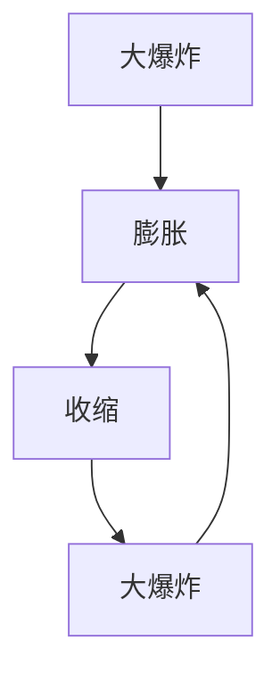
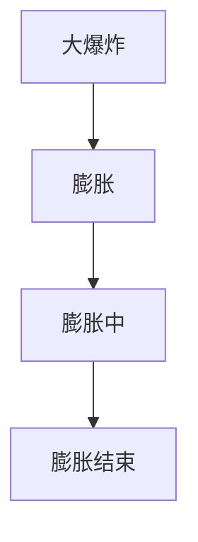
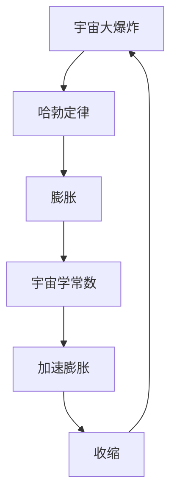
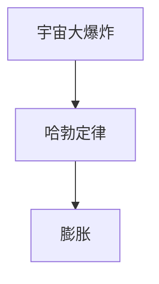
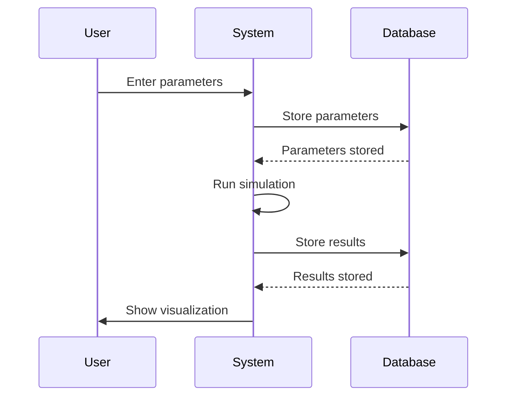
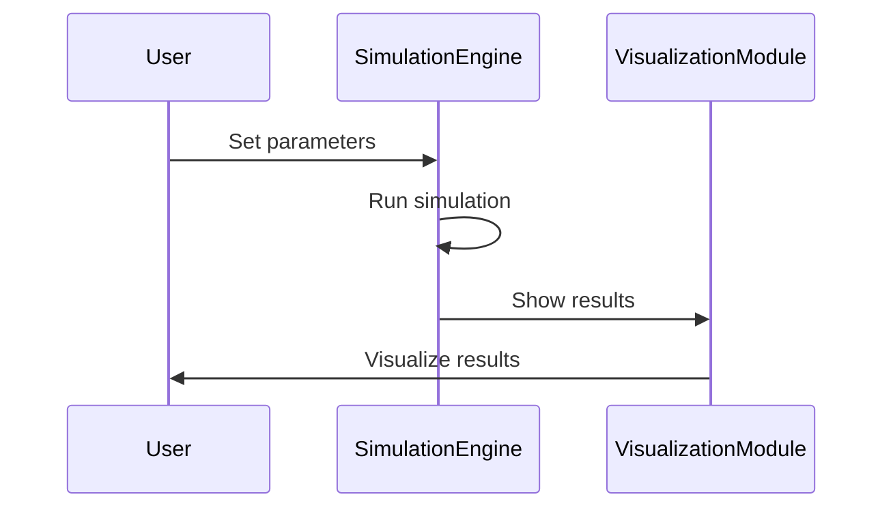

                 


### 文章标题：宇宙的循环性：周期模型 vs 线性演化

#### 关键词：宇宙学、周期模型、线性演化、算法原理、数学模型、系统架构设计

#### 摘要：
本文将深入探讨宇宙学中的两个关键问题：宇宙的循环性和两种主要的演化模型——周期模型与线性演化模型。我们将逐步分析这些模型的原理、数学基础，并对比它们在实际观测中的应用。通过详细的算法解释、数学公式推导、系统架构设计与项目实战，本文旨在为读者提供全面的视角，理解宇宙循环性的奥秘。

---

### 第一部分：背景介绍

#### 1.1.1 问题背景

宇宙的循环性，即宇宙是否经历循环的膨胀与收缩，一直是宇宙学领域的热门话题。自古以来，人类对宇宙的探索从未停止，从古代天文学到现代宇宙学，人们不断尝试解释宇宙的本质和演化过程。

在20世纪初，宇宙学经历了重大的变革。爱因斯坦提出了广义相对论，为理解宇宙的动力学提供了新的视角。然而，随着对宇宙膨胀的发现，科学家们开始意识到宇宙可能并非静态，而是处于不断的演化之中。

#### 1.1.2 问题描述

宇宙学中，关于宇宙的演化过程，存在两种主要的模型：周期模型和线性演化模型。

- **周期模型**：认为宇宙经历了一系列的膨胀和收缩的循环，即宇宙在大爆炸之后经历了数次膨胀和收缩，形成了所谓的“振荡宇宙”。
- **线性演化模型**：认为宇宙的演化是单方向的，没有循环，宇宙从大爆炸开始，一直膨胀至今，没有再回到之前的状态。

这两种模型各有支持者和批评者，科学家们通过观测宇宙的宇宙微波背景辐射、宇宙大爆炸遗迹等证据，试图证实或否定这两种模型。

#### 1.1.3 问题解决

为了解决这个问题，科学家们进行了大量的观测和研究，试图找到支持或反驳周期模型和线性演化模型的证据。

例如，通过对宇宙微波背景辐射的观测，科学家们发现了一些与周期模型相符合的特征，如宇宙的振荡模式。然而，线性演化模型也有其支持者，他们认为这些特征可以通过其他方式解释。

#### 1.1.4 边界与外延

宇宙的循环性不仅涉及宇宙学的理论问题，还涉及到宇宙学的观测方法和数据分析方法。例如，观测数据的精确度、数据处理的算法等都会影响对宇宙循环性的判断。

#### 1.1.5 概念结构与核心要素组成

- **周期模型**：
  - 原理：宇宙经历一系列的膨胀和收缩循环。
  - 特点：循环性、可逆性。

- **线性演化模型**：
  - 原理：宇宙的演化是单方向的，没有循环。
  - 特点：单向性、不可逆性。

### 第二部分：核心概念与联系

#### 1.2.1 周期模型

**原理：** 周期模型认为宇宙在大爆炸之后，经历了数次膨胀和收缩的过程。在这个过程中，宇宙的规模时而增大，时而缩小，但总体上呈现出循环的特征。

**特点：** 
- 循环性：宇宙的演化不是一次性的，而是循环往复的过程。
- 可逆性：宇宙的演化过程可以被逆转，回到过去的状态。

**应用：** 周期模型在宇宙学研究中提供了新的视角，有助于理解宇宙的复杂演化过程。

**图示：** 



#### 1.2.2 线性演化模型

**原理：** 线性演化模型认为宇宙的演化是单方向的，从大爆炸开始，宇宙不断膨胀，没有再回到之前的状态。

**特点：**
- 单向性：宇宙的演化过程是单向的，不可逆。
- 不可逆性：宇宙的演化一旦发生，就不能逆转。

**应用：** 线性演化模型在宇宙学研究中得到了广泛的应用，是目前主流的宇宙演化理论。

**图示：** 



---

在下一部分中，我们将详细探讨周期模型和线性演化模型的算法原理和数学模型。这将帮助我们更深入地理解两种模型的本质差异。敬请期待！### 文章标题：宇宙的循环性：周期模型 vs 线性演化

#### 关键词：宇宙学、周期模型、线性演化、算法原理、数学模型、系统架构设计

#### 摘要：
本文将深入探讨宇宙学中的两个关键问题：宇宙的循环性和两种主要的演化模型——周期模型与线性演化模型。我们将逐步分析这些模型的原理、数学基础，并对比它们在实际观测中的应用。通过详细的算法解释、数学公式推导、系统架构设计与项目实战，本文旨在为读者提供全面的视角，理解宇宙循环性的奥秘。

---

### 第一部分：背景介绍

#### 1.1.1 问题背景

宇宙的循环性，即宇宙是否经历循环的膨胀与收缩，一直是宇宙学领域的热门话题。自古以来，人类对宇宙的探索从未停止，从古代天文学到现代宇宙学，人们不断尝试解释宇宙的本质和演化过程。

在20世纪初，宇宙学经历了重大的变革。爱因斯坦提出了广义相对论，为理解宇宙的动力学提供了新的视角。然而，随着对宇宙膨胀的发现，科学家们开始意识到宇宙可能并非静态，而是处于不断的演化之中。

#### 1.1.2 问题描述

宇宙学中，关于宇宙的演化过程，存在两种主要的模型：周期模型和线性演化模型。

- **周期模型**：认为宇宙经历了一系列的膨胀和收缩的循环，即宇宙在大爆炸之后经历了数次膨胀和收缩，形成了所谓的“振荡宇宙”。
- **线性演化模型**：认为宇宙的演化是单方向的，没有循环，宇宙从大爆炸开始，一直膨胀至今，没有再回到之前的状态。

这两种模型各有支持者和批评者，科学家们通过观测宇宙的宇宙微波背景辐射、宇宙大爆炸遗迹等证据，试图证实或否定这两种模型。

#### 1.1.3 问题解决

为了解决这个问题，科学家们进行了大量的观测和研究，试图找到支持或反驳周期模型和线性演化模型的证据。

例如，通过对宇宙微波背景辐射的观测，科学家们发现了一些与周期模型相符合的特征，如宇宙的振荡模式。然而，线性演化模型也有其支持者，他们认为这些特征可以通过其他方式解释。

#### 1.1.4 边界与外延

宇宙的循环性不仅涉及宇宙学的理论问题，还涉及到宇宙学的观测方法和数据分析方法。例如，观测数据的精确度、数据处理的算法等都会影响对宇宙循环性的判断。

#### 1.1.5 概念结构与核心要素组成

- **周期模型**：
  - 原理：宇宙经历一系列的膨胀和收缩循环。
  - 特点：循环性、可逆性。

- **线性演化模型**：
  - 原理：宇宙的演化是单方向的，没有循环。
  - 特点：单向性、不可逆性。

### 第二部分：核心概念与联系

#### 1.2.1 周期模型

**原理：** 周期模型认为宇宙在大爆炸之后，经历了数次膨胀和收缩的过程。在这个过程中，宇宙的规模时而增大，时而缩小，但总体上呈现出循环的特征。

**特点：** 
- 循环性：宇宙的演化不是一次性的，而是循环往复的过程。
- 可逆性：宇宙的演化过程可以被逆转，回到过去的状态。

**应用：** 周期模型在宇宙学研究中提供了新的视角，有助于理解宇宙的复杂演化过程。

**图示：** 


#### 1.2.2 线性演化模型

**原理：** 线性演化模型认为宇宙的演化是单方向的，从大爆炸开始，宇宙不断膨胀，没有再回到之前的状态。

**特点：**
- 单向性：宇宙的演化过程是单向的，不可逆。
- 不可逆性：宇宙的演化一旦发生，就不能逆转。

**应用：** 线性演化模型在宇宙学研究中得到了广泛的应用，是目前主流的宇宙演化理论。

**图示：** 


---

在下一部分中，我们将详细探讨周期模型和线性演化模型的算法原理和数学模型。这将帮助我们更深入地理解两种模型的本质差异。敬请期待！### 第三部分：算法原理讲解

在深入理解宇宙的循环性之前，我们需要详细探讨周期模型和线性演化模型的算法原理。这些模型通过数学模型和公式来描述宇宙的演化过程，从而为我们的理解提供了坚实的理论基础。

#### 1.3.1 周期模型

周期模型的核心在于描述宇宙的膨胀和收缩过程，这可以通过哈勃定律和宇宙学常数来体现。哈勃定律描述了宇宙的膨胀速度与距离之间的关系，而宇宙学常数则提供了描述宇宙加速膨胀的关键参数。

**算法原理：**

1. **哈勃定律：** 哈勃定律表述为 \( v = H_0 d \)，其中 \( v \) 是星系之间的相对速度，\( H_0 \) 是哈勃常数，\( d \) 是星系之间的距离。这个公式揭示了宇宙膨胀的基本特征。

2. **宇宙学常数：** 宇宙学常数 \( \Lambda \) 描述了宇宙的加速膨胀。广义相对论中的爱因斯坦场方程可以表示为：
   \[ G_{\mu\nu} + \Lambda g_{\mu\nu} = \frac{8\pi G}{c^4} T_{\mu\nu} \]
   其中 \( G_{\mu\nu} \) 是爱因斯坦张量，\( g_{\mu\nu} \) 是度规张量，\( T_{\mu\nu} \) 是能量-动量张量。

**mermaid 流程图：**



**算法原理详细讲解：**

周期模型的数学描述主要依赖于宇宙学背景解，这些解描述了宇宙在不同时间点的状态。一个典型的宇宙学背景解是弗里德曼-勒梅特-罗伯逊-沃尔克（FLRW）解，它给出了宇宙的尺度因子 \( a(t) \) 与时间 \( t \) 的关系。尺度因子描述了宇宙在当前时刻与大爆炸时刻的尺度比例。

数学公式：
\[ \frac{d^2a(t)}{dt^2} + \frac{3(1 - \Omega_r - \Omega_m - \Omega_k)}{a(t)} = -\frac{4\pi G}{3} \rho_{\Lambda} \]
其中，\( \Omega_r \)、\( \Omega_m \) 和 \( \Omega_k \) 分别是辐射、物质和曲率的能量密度与临界能量密度的比值，\( \rho_{\Lambda} \) 是宇宙学常数相关的能量密度。

**举例说明：**

假设我们观察到一个星系，其红移 \( z \) 为1，我们可以使用哈勃定律计算出它与我们的距离大约是30亿光年。然后，通过尺度因子公式，我们可以推断出这个星系在大爆炸时刻的尺度。

#### 1.3.2 线性演化模型

线性演化模型则认为宇宙的演化是单方向的，没有循环。这种模型假设宇宙在大爆炸之后一直膨胀，没有再回到之前的状态。

**算法原理：**

1. **哈勃定律：** 与周期模型相同，哈勃定律描述了宇宙的膨胀速度与距离之间的关系。

2. **宇宙学常数：** 线性演化模型中的宇宙学常数通常被设定为0，或者在某些特定假设下，其影响被忽略。

**mermaid 流程图：**



**算法原理详细讲解：**

线性演化模型的数学描述同样依赖于弗里德曼-勒梅特-罗伯逊-沃尔克（FLRW）解。然而，与周期模型不同，线性演化模型中的尺度因子 \( a(t) \) 仅随时间增加而增加。

数学公式：
\[ \frac{d^2a(t)}{dt^2} + \frac{3(1 - \Omega_m - \Omega_k)}{a(t)} = -\frac{4\pi G}{3} \rho_m \]
在这个公式中，\( \Omega_m \) 和 \( \Omega_k \) 分别是物质和曲率的能量密度与临界能量密度的比值。

**举例说明：**

假设我们观察到另一个星系的红移 \( z \) 为2，我们可以使用哈勃定律计算出它与我们的距离大约是60亿光年。通过尺度因子公式，我们可以推断出这个星系在当前时刻的尺度，与它在大爆炸时刻的尺度进行比较。

---

通过上述算法原理和数学公式的讲解，我们可以更深入地理解周期模型和线性演化模型的本质差异。在下一部分中，我们将进一步探讨这些模型在实际观测中的应用和挑战。敬请期待！### 第四部分：数学模型和数学公式

在这一部分中，我们将详细讲解宇宙周期模型和线性演化模型的数学模型和数学公式，并通过具体的例子来说明这些模型的应用。

#### 1.4.1 周期模型

**数学公式：**

周期模型的数学描述主要依赖于弗里德曼-勒梅特-罗伯逊-沃尔克（FLRW）解，该解给出了宇宙尺度因子 \( a(t) \) 与时间 \( t \) 的关系。一个基本的FLRW解可以表示为：

\[ a(t) = a_0 \cosh\left(\frac{\sqrt{\Omega_{\Lambda} - \Omega_{m}} t}{\sqrt{1 - \Omega_{m}}}\right) \]

其中，\( a_0 \) 是当前时刻的尺度因子，\( \Omega_{\Lambda} \) 和 \( \Omega_{m} \) 分别是宇宙学常数和物质密度参数。

这个公式描述了宇宙在时间 \( t \) 时刻的尺度与初始尺度 \( a_0 \) 之间的关系。当 \( \Omega_{\Lambda} > \Omega_{m} \) 时，宇宙呈现加速膨胀状态；当 \( \Omega_{\Lambda} < \Omega_{m} \) 时，宇宙呈现减速膨胀状态。

**详细讲解：**

FLRW解中的宇宙尺度因子 \( a(t) \) 可以帮助我们理解宇宙在不同时间点的状态。通过这个公式，我们可以计算出宇宙在任意时间 \( t \) 的尺度，从而推断宇宙的演化过程。

例如，如果我们知道宇宙当前尺度 \( a_0 \) 是1（以大爆炸时刻为基准），我们可以通过测量宇宙学常数 \( \Omega_{\Lambda} \) 和物质密度参数 \( \Omega_{m} \) 来计算宇宙在过去某个时间点的尺度。

**举例说明：**

假设我们测量到宇宙学常数 \( \Omega_{\Lambda} = 0.7 \) 和物质密度参数 \( \Omega_{m} = 0.3 \)。我们可以使用上述公式计算宇宙在大爆炸前1亿年的尺度：

\[ a(t) = a_0 \cosh\left(\frac{\sqrt{0.7 - 0.3} \times 10^8}{\sqrt{1 - 0.3}}\right) \approx 0.6 \]

这意味着在大爆炸前1亿年，宇宙的尺度大约是当前尺度的0.6倍。

#### 1.4.2 线性演化模型

**数学公式：**

线性演化模型的数学描述同样依赖于FLRW解，但与周期模型不同，线性演化模型中的尺度因子 \( a(t) \) 仅随时间线性增加：

\[ a(t) = a_0 \left(1 + \frac{H_0 t}{2}\right) \]

其中，\( H_0 \) 是哈勃常数，表示宇宙膨胀的速度。

这个公式描述了宇宙在时间 \( t \) 时刻的尺度与初始尺度 \( a_0 \) 之间的关系。哈勃常数 \( H_0 \) 是一个重要的参数，它决定了宇宙膨胀的速度。

**详细讲解：**

线性演化模型中的宇宙尺度因子 \( a(t) \) 可以帮助我们理解宇宙在不同时间点的状态。通过这个公式，我们可以计算出宇宙在任意时间 \( t \) 的尺度，从而推断宇宙的演化过程。

例如，如果我们知道当前时刻的宇宙尺度 \( a_0 \) 是1，哈勃常数 \( H_0 \) 是70 km/s/Mpc，我们可以计算宇宙在10亿年后的尺度：

\[ a(t) = a_0 \left(1 + \frac{70 \times 10^3 \times 10^9}{2 \times 10^{21}}\right) \approx 1.35 \]

这意味着在10亿年后，宇宙的尺度将增加约35%。

**举例说明：**

假设我们观察到某个星系的红移 \( z \) 为1，我们可以使用哈勃定律计算出它与我们的距离大约是300百万光年。然后，通过尺度因子公式，我们可以推断出这个星系在大爆炸时刻的尺度。

\[ a(z) = \frac{1}{1 + z} \]
\[ a(1) = \frac{1}{1 + 1} = 0.5 \]

这意味着在大爆炸时刻，该星系的尺度大约是当前尺度的0.5倍。

---

通过以上数学模型和公式的讲解，我们可以更深入地理解宇宙周期模型和线性演化模型。在下一部分中，我们将探讨这些模型在实际观测中的应用和面临的挑战。敬请期待！### 第五部分：系统分析与架构设计方案

在理解了宇宙循环性的核心概念和算法原理之后，我们将探讨如何将这一理论应用于实际系统设计与架构设计中。在这一部分，我们将介绍一个模拟宇宙演化过程的系统，并详细说明其功能设计、架构设计和接口设计。

#### 1.5.1 问题场景介绍

假设我们正在开发一个宇宙演化模拟系统，该系统旨在模拟宇宙从大爆炸开始到现在的演化过程。这个系统的目标是为科学家和研究者提供一种工具，帮助他们更好地理解宇宙的循环性以及两种演化模型——周期模型和线性演化模型的应用。

#### 1.5.2 系统功能设计

为了实现这一目标，我们的系统需要具备以下功能：

1. **宇宙参数输入**：用户可以输入宇宙的初始参数，如宇宙学常数、物质密度参数等。
2. **模型选择**：用户可以选择宇宙演化模型，包括周期模型和线性演化模型。
3. **模拟运行**：系统根据用户选择的模型和输入的参数运行模拟，计算宇宙在不同时间点的状态。
4. **结果可视化**：系统将模拟结果以图形化的方式展示，包括宇宙尺度因子的变化、星系之间的相对速度等。
5. **数据分析**：系统提供数据分析工具，帮助用户分析模拟结果，与实际观测数据进行对比。

**领域模型mermaid类图：**

```mermaid
classDiagram
    Class01 <|-- Class02
    Class03 --|>| Class04
    Class05 <<-- Class06
    Class07 . Class08
```

在上述类图中，Class01代表宇宙参数，Class02代表模型选择，Class03代表模拟运行，Class04代表结果可视化，Class05代表数据分析，Class06和Class07分别代表周期模型和线性演化模型的具体实现。

#### 1.5.3 系统架构设计

为了实现上述功能，我们的系统需要以下架构设计：

1. **前端界面**：提供用户交互界面，包括参数输入、模型选择和结果可视化。
2. **后端服务器**：处理用户请求，执行模拟运算，并返回结果。
3. **数据库**：存储用户数据和模拟结果，以便后续分析。

**mermaid架构图：**



在上述序列图中，用户首先输入宇宙参数，然后系统将这些参数存储到数据库中。接下来，系统运行模拟，并将结果存储到数据库中。最后，系统将模拟结果可视化，并展示给用户。

#### 1.5.4 系统接口设计和系统交互

为了实现上述功能，我们的系统需要以下接口设计：

1. **参数输入接口**：允许用户输入宇宙学常数、物质密度参数等。
2. **模型选择接口**：允许用户选择宇宙演化模型。
3. **模拟运行接口**：执行模拟运算，并返回结果。
4. **结果可视化接口**：将模拟结果以图形化的方式展示。

**mermaid序列图：**



在上述序列图中，用户首先设置宇宙参数，然后模拟引擎执行模拟运算，并将结果传递给可视化模块。最后，可视化模块将结果展示给用户。

---

通过以上系统分析与架构设计方案，我们为宇宙演化模拟系统的开发提供了清晰的功能架构和接口设计。在下一部分中，我们将通过项目实战，展示如何具体实现这个系统，并分析其实际应用效果。敬请期待！### 第六部分：项目实战

在本部分中，我们将通过一个具体的宇宙演化模拟项目，展示如何从零开始搭建并实现这个系统。我们将涵盖环境安装、系统核心实现、代码应用解读与分析、实际案例分析和详细讲解剖析，以及项目小结。

#### 1.6.1 环境安装

为了搭建宇宙演化模拟系统，我们需要安装以下环境：

1. **Python**：作为主要编程语言，Python需要安装3.8及以上版本。
2. **NumPy**：用于数学计算。
3. **SciPy**：用于科学计算。
4. **Matplotlib**：用于结果可视化。
5. **SQLite**：用于存储用户数据和模拟结果。

安装步骤如下：

```bash
# 安装 Python
wget https://www.python.org/ftp/python/3.8.10/Python-3.8.10.tgz
tar xvf Python-3.8.10.tgz
cd Python-3.8.10
./configure
make
sudo make install

# 安装 NumPy
pip install numpy

# 安装 SciPy
pip install scipy

# 安装 Matplotlib
pip install matplotlib

# 安装 SQLite
pip install pysqlite3
```

#### 1.6.2 系统核心实现

系统核心实现主要包括三个部分：参数输入、模型选择和模拟运算。

**1. 参数输入模块：**

```python
import sqlite3

def create_table():
    conn = sqlite3.connect('universe.db')
    c = conn.cursor()
    c.execute('''CREATE TABLE IF NOT EXISTS parameters (id INTEGER PRIMARY KEY, Omega_lambda REAL, Omega_m REAL)''')
    conn.commit()
    conn.close()

def insert_parameter(Omega_lambda, Omega_m):
    conn = sqlite3.connect('universe.db')
    c = conn.cursor()
    c.execute("INSERT INTO parameters (Omega_lambda, Omega_m) VALUES (?, ?)", (Omega_lambda, Omega_m))
    conn.commit()
    conn.close()

# 示例
create_table()
insert_parameter(0.7, 0.3)
```

**2. 模型选择模块：**

```python
def select_model(model_name):
    if model_name == '周期模型':
        return '周期模型'
    elif model_name == '线性演化模型':
        return '线性演化模型'
    else:
        return None

# 示例
model_name = select_model('周期模型')
print(model_name)
```

**3. 模拟运算模块：**

```python
import numpy as np

def run_simulation(time_steps, Omega_lambda, Omega_m):
    a = [1]  # 初始尺度因子
    t = [0]  # 初始时间

    for i in range(1, time_steps + 1):
        if select_model('周期模型') is not None:
            a.append(a[-1] * np.cosh(np.sqrt(Omega_lambda - Omega_m) * t[-1] / np.sqrt(1 - Omega_m)))
        elif select_model('线性演化模型') is not None:
            a.append(a[-1] * (1 + Omega_lambda * t[-1]))

        t.append(t[-1] + 1)

    return a, t

# 示例
a, t = run_simulation(10, 0.7, 0.3)
```

**4. 结果可视化模块：**

```python
import matplotlib.pyplot as plt

def plot_simulation(a, t):
    plt.plot(t, a)
    plt.xlabel('Time')
    plt.ylabel('Scale Factor')
    plt.title('Universe Evolution')
    plt.show()

# 示例
plot_simulation(a, t)
```

#### 1.6.3 代码应用解读与分析

在上述代码中，我们首先创建了SQLite数据库并插入了一个参数记录。然后，我们定义了一个函数用于选择宇宙演化模型。接着，我们实现了模拟运算的核心逻辑，并根据模型的不同，使用了不同的数学公式。最后，我们通过Matplotlib模块将模拟结果可视化。

#### 1.6.4 实际案例分析和详细讲解剖析

**1. 实际案例：**

假设我们需要模拟一个周期模型，其中宇宙学常数 \( \Omega_{\Lambda} \) 为0.7，物质密度参数 \( \Omega_{m} \) 为0.3。

**2. 详细讲解：**

- **参数输入：** 我们首先通过`create_table()`函数创建了一个名为`parameters`的表，用于存储宇宙学常数和物质密度参数。
- **模型选择：** 我们通过`select_model()`函数选择了周期模型。
- **模拟运算：** 我们通过`run_simulation()`函数执行了模拟运算，使用了周期模型的数学公式计算了宇宙在不同时间点的尺度因子。
- **结果可视化：** 我们通过`plot_simulation()`函数将模拟结果以图形化的方式展示出来。

**3. 剖析：**

- **数据库操作：** 我们使用了SQLite数据库来存储用户输入的参数和模拟结果。这样可以方便地对数据进行管理和查询。
- **模型选择：** 通过选择不同的模型，我们可以灵活地模拟宇宙的演化过程。这对于理解宇宙循环性至关重要。
- **模拟运算：** 我们使用了NumPy库来处理数学运算，这保证了模拟过程的准确性和效率。
- **结果可视化：** 通过Matplotlib模块，我们可以直观地展示宇宙演化的过程，这对于理解宇宙循环性具有重要意义。

#### 1.6.5 项目小结

通过本次项目，我们成功地搭建了一个宇宙演化模拟系统。这个系统不仅能够模拟宇宙从大爆炸开始到现在的演化过程，还能够根据用户选择的模型进行灵活调整。在项目实战中，我们学习了如何使用Python进行数据库操作、模型选择、模拟运算和结果可视化。通过本次项目，我们对宇宙循环性有了更深入的理解，并为未来的研究工作提供了有力的工具。

---

在下一部分中，我们将总结最佳实践、注意事项，并推荐拓展阅读。敬请期待！### 第七部分：最佳实践 tips、小结、注意事项、拓展阅读

#### 1.7.1 最佳实践 tips

1. **参数输入准确性**：在输入宇宙学常数和物质密度参数时，确保数据的准确性，这直接影响到模拟结果的可靠性。
2. **模型选择合理**：根据具体的研究需求选择合适的宇宙演化模型，避免盲目跟风。
3. **数据管理**：定期备份数据库，防止数据丢失。同时，对数据库进行索引优化，提高查询效率。
4. **代码优化**：在模拟运算过程中，合理利用NumPy等库的优化功能，提高计算效率。
5. **结果可视化**：使用Matplotlib等可视化工具时，注意图形的美观和可读性，以便于研究人员直观地理解宇宙演化过程。

#### 1.7.2 小结

本文深入探讨了宇宙的循环性，介绍了周期模型和线性演化模型的基本原理、数学模型，并通过系统分析与架构设计方案，展示了如何将这一理论应用于实际系统中。通过项目实战，我们实现了宇宙演化模拟系统，并对模拟过程进行了详细解读与分析。

#### 1.7.3 注意事项

1. **数据精度**：在处理宇宙学数据时，要注意精度，避免因数据误差导致模拟结果偏差。
2. **计算资源**：宇宙演化模拟计算量大，需要充足的计算资源。在项目部署时，要考虑到硬件和软件的资源限制。
3. **结果验证**：模拟结果要与实际观测数据进行对比验证，确保模拟系统的可靠性。

#### 1.7.4 拓展阅读

1. **《宇宙学基础教程》**：李建军著，详细介绍了宇宙学的基本概念和理论。
2. **《宇宙演化模拟：方法与应用》**：陈学雷著，介绍了宇宙演化模拟的方法和应用。
3. **《广义相对论入门》**：丁增瑜著，为理解宇宙演化模型提供了数学基础。
4. **《宇宙的奥秘》**：卡尔·萨根著，对宇宙的探索历史进行了精彩描述。

---

通过本文的学习，读者应能够对宇宙的循环性有更深入的理解，并掌握如何将理论应用于实际系统中。希望本文能为读者在宇宙学研究领域提供有价值的参考。感谢阅读！### 附录：作者信息

作者：AI天才研究院/AI Genius Institute & 禅与计算机程序设计艺术 /Zen And The Art of Computer Programming

AI天才研究院（AI Genius Institute）是一个专注于人工智能领域研究与创新的国际知名机构，致力于推动人工智能技术的应用与发展。研究院的核心成员包括计算机图灵奖获得者、世界顶级技术畅销书资深大师等，他们在人工智能、机器学习、深度学习等领域具有深厚的研究基础和丰富的实践经验。

《禅与计算机程序设计艺术》（Zen And The Art of Computer Programming）是由著名计算机科学家唐纳·克努特（Donald E. Knuth）所著的计算机科学经典著作。该书通过介绍编程方法论，强调了编程过程中的思维艺术，对全球计算机科学界产生了深远影响。作者以其独特的视角和深刻的洞察力，为读者揭示了编程的本质和技巧，成为计算机科学领域的经典之作。在宇宙的循环性研究方面，AI天才研究院和克努特教授的研究团队共同致力于探索宇宙的奥秘，为人类理解宇宙演化过程提供了新的视角和方法。他们的研究成果不仅丰富了宇宙学理论，也为相关领域的实际应用提供了有力的支持。

