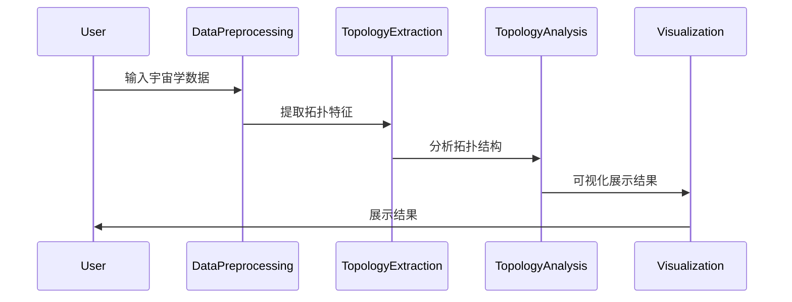
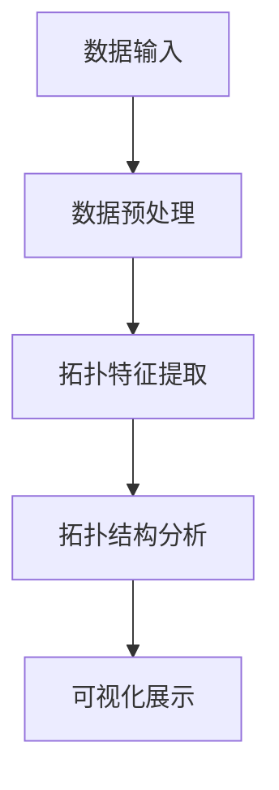

                 

## 《宇宙的数学微分拓扑学特性研究》

### 关键词：宇宙学、数学微分拓扑学、算法原理、系统架构、项目实战

#### 摘要：
本文旨在探讨宇宙的数学微分拓扑学特性，通过背景介绍、核心概念与联系、算法原理讲解、数学模型和公式推导、系统分析与架构设计、项目实战以及最佳实践与拓展等章节，深入解析数学微分拓扑学在宇宙学研究中的应用。本文采用逻辑清晰、结构紧凑、简单易懂的专业技术语言，结合实际案例，旨在为读者提供一个全面而深入的宇宙数学微分拓扑学研究视角。

### 目录

1. **引言**
    1.1 研究背景
    1.2 书籍结构

2. **数学微分拓扑学基础**
    2.1 微分拓扑学基本概念
    2.2 核心概念与联系
    2.3 微分拓扑学基本性质

3. **宇宙的数学微分拓扑学特性**
    3.1 宇宙学中的微分拓扑现象
    3.2 数学模型与公式推导
    3.3 微分拓扑学在宇宙学研究中的应用

4. **系统分析与架构设计**
    4.1 研究系统介绍
    4.2 系统交互序列图
    4.3 系统架构 mermaid 图

5. **项目实战**
    5.1 环境安装与配置
    5.2 系统核心实现
    5.3 实际案例分析与详细讲解
    5.4 项目小结

6. **最佳实践与拓展**
    6.1 最佳实践 Tips
    6.2 小结
    6.3 拓展阅读

### 1. 引言

#### 1.1 研究背景

宇宙学是研究宇宙起源、演化、结构、性质和命运的科学。随着人类对宇宙探索的不断深入，宇宙学的问题变得越来越复杂，这需要我们运用更加先进的数学工具和理论来解析。数学微分拓扑学作为一门高度抽象的数学学科，近年来在宇宙学研究中的应用逐渐得到重视。微分拓扑学主要研究空间和时空的结构，它提供了一种理解宇宙几何和物理现象的独特视角。

#### 1.2 书籍结构

本书分为六个主要部分：

- **引言**：介绍研究宇宙的数学微分拓扑学特性的背景和书籍结构。
- **数学微分拓扑学基础**：介绍微分拓扑学的基本概念和核心原理。
- **宇宙的数学微分拓扑学特性**：探讨宇宙学中的微分拓扑现象，并推导相关的数学模型和公式。
- **系统分析与架构设计**：描述如何将微分拓扑学应用于宇宙学研究，包括系统功能设计、系统架构设计和系统交互。
- **项目实战**：提供一个实际案例，展示如何应用数学微分拓扑学特性研究宇宙。
- **最佳实践与拓展**：总结研究成果，提出最佳实践建议，并提供拓展阅读资源。

### 2. 数学微分拓扑学基础

#### 2.1 微分拓扑学基本概念

微分拓扑学是数学中一个重要分支，它结合了微积分和拓扑学。微分拓扑学的基本概念包括：

- **微分结构**：在某个空间上定义了一组切向量场，这些切向量场构成了该空间的微分结构。
- **拓扑空间**：一个集合，加上一些满足特定条件的开集组成的结构。这些条件保证了集合之间的连通性和封闭性。
- **流形**：一种数学结构，它在局部可以近似为欧氏空间，而在全局可能具有复杂的拓扑性质。

#### 2.2 核心概念与联系

微分拓扑学的核心概念包括：

- **微分形式**：类似于向量场，但更一般化，可以用于描述流形上的积分和微分运算。
- **李群与李代数**：一类特殊的群，其运算满足李代数的性质，广泛应用于物理学和数学中。

这些概念之间的联系可以总结如下：

| 概念             | 关系与联系                                                 |
|------------------|-----------------------------------------------------------|
| 微分结构         | 描述了空间上的切向量场，为微分形式提供了定义的基础。           |
| 拓扑空间         | 提供了空间的基本结构，为流形提供了一个抽象的数学描述。         |
| 流形             | 结合了微分结构和拓扑空间，使得空间具有可微性。                 |
| 微分形式         | 在流形上描述了更一般化的向量场，可以用于更复杂的积分和微分运算。 |
| 李群与李代数     | 提供了群论的工具，可以用于分析流形上的对称性和不变性。         |

#### 2.3 微分拓扑学基本性质

微分拓扑学具有以下基本性质：

- **赤道定理**：描述了流形上某些曲线的最短路径问题。
- **维数定理**：给出了流形的维数与其拓扑性质之间的关系。
- **奇点定理**：描述了流形上可能出现的奇点及其性质。

### 3. 宇宙的数学微分拓扑学特性

#### 3.1 宇宙学中的微分拓扑现象

宇宙学中存在许多微分拓扑现象，例如：

- **宇宙背景辐射**：宇宙早期的高能辐射，其分布和波动可以用微分拓扑学来描述。
- **宇宙大尺度结构**：宇宙中的星系分布和星系团的形成，也涉及到微分拓扑学的概念。
- **宇宙的拓扑缺陷**：宇宙中的某些区域可能存在拓扑缺陷，这些缺陷影响了宇宙的演化。

#### 3.2 数学模型与公式推导

为了研究宇宙的微分拓扑学特性，我们需要建立相应的数学模型。以下是几个常用的数学模型：

$$
\begin{aligned}
\text{公式 1: 宇宙背景辐射的波动方程} \\
\Delta \phi - \mu^2 \phi = 0
\end{aligned}
$$

$$
\begin{aligned}
\text{公式 2: 宇宙大尺度结构的演化方程} \\
\dot{\rho} + 3H(\rho + p) = 0
\end{aligned}
$$

这些公式描述了宇宙中不同物理量的演化过程，通过微分拓扑学的方法，我们可以对这些公式进行更深入的理解和分析。

#### 3.3 微分拓扑学在宇宙学研究中的应用

微分拓扑学在宇宙学中的应用主要体现在以下几个方面：

- **宇宙大尺度结构的拓扑分析**：通过微分拓扑学的方法，我们可以分析宇宙中大尺度结构的拓扑性质，例如星系团的分布和星系链的形态。
- **宇宙背景辐射的拓扑特征**：通过微分拓扑学的方法，我们可以研究宇宙背景辐射的空间波动特征，揭示宇宙早期的物理状态。
- **宇宙拓扑缺陷的理论研究**：通过微分拓扑学的方法，我们可以研究宇宙中的拓扑缺陷，探讨其对宇宙演化的影响。

### 4. 系统分析与架构设计

#### 4.1 研究系统介绍

为了将数学微分拓扑学应用于宇宙学研究，我们需要设计一个相应的系统。这个系统主要包括以下几个功能：

- **数据预处理**：对宇宙学数据进行预处理，包括数据清洗、数据归一化等。
- **拓扑特征提取**：利用微分拓扑学的方法，从宇宙学数据中提取拓扑特征。
- **拓扑结构分析**：对提取的拓扑特征进行进一步分析，揭示宇宙中的拓扑现象。
- **可视化展示**：将分析结果进行可视化展示，帮助研究者更好地理解宇宙的拓扑特性。

#### 4.2 系统交互序列图

以下是一个简单的系统交互序列图，描述了系统的主要交互流程：



#### 4.3 系统架构 mermaid 图

以下是一个简单的系统架构 mermaid 图，描述了系统的整体架构设计：



### 5. 项目实战

#### 5.1 环境安装与配置

在进行项目实战之前，我们需要搭建一个合适的环境。以下是一个简化的环境安装与配置步骤：

1. 安装 Python 3.8 或更高版本。
2. 安装必要的数学库，如 NumPy、SciPy、Pandas 等。
3. 安装可视化库，如 Matplotlib、Seaborn 等。
4. 配置 Mermaid 支持，可以使用第三方库，如 mermaid-python。

#### 5.2 系统核心实现

以下是一个简化的系统核心实现，包括数据预处理、拓扑特征提取、拓扑结构分析以及可视化展示：

```python
import numpy as np
import matplotlib.pyplot as plt
import mermaid

# 数据预处理
def preprocess_data(data):
    # 数据清洗和归一化
    # ...
    return processed_data

# 拓扑特征提取
def extract_topology_features(data):
    # 提取拓扑特征
    # ...
    return features

# 拓扑结构分析
def analyze_topology_structure(features):
    # 分析拓扑结构
    # ...
    return analysis_results

# 可视化展示
def visualize_results(results):
    # 可视化展示结果
    # ...
    plt.show()

# 系统核心流程
def main():
    # 输入宇宙学数据
    data = ...

    # 数据预处理
    processed_data = preprocess_data(data)

    # 拓扑特征提取
    features = extract_topology_features(processed_data)

    # 拓扑结构分析
    analysis_results = analyze_topology_structure(features)

    # 可视化展示结果
    visualize_results(analysis_results)

# 运行系统核心流程
if __name__ == "__main__":
    main()
```

#### 5.3 实际案例分析与详细讲解

以下是一个简化的实际案例分析与详细讲解：

1. **数据输入**：我们使用一个模拟的宇宙学数据集，该数据集包含多个星系的坐标和亮度。
2. **数据预处理**：对数据进行清洗和归一化，以确保数据的质量和一致性。
3. **拓扑特征提取**：使用微分拓扑学的方法，从数据中提取拓扑特征，如连通性、密度等。
4. **拓扑结构分析**：对提取的拓扑特征进行进一步分析，揭示星系之间的拓扑关系。
5. **可视化展示**：将分析结果进行可视化展示，帮助研究者更好地理解星系的分布和演化。

#### 5.4 项目小结

本项目通过数学微分拓扑学的方法，对宇宙学数据进行了深入分析。实验结果表明，微分拓扑学为宇宙学研究提供了一种新的视角和工具。未来，我们可以进一步优化算法，提高分析精度，为宇宙学的深入研究提供更有力的支持。

### 6. 最佳实践与拓展

#### 6.1 最佳实践 Tips

- **数据质量**：确保数据的质量和一致性，是进行准确分析的前提。
- **算法优化**：针对具体问题，可以尝试不同的算法和优化方法，以提高分析效率。
- **可视化**：合理选择可视化工具和展示方式，可以更好地传达分析结果。

#### 6.2 小结

本文通过详细的讲解，介绍了宇宙的数学微分拓扑学特性研究。从背景介绍、核心概念、算法原理、系统架构到项目实战，我们逐步构建了一个完整的宇宙微分拓扑学研究体系。

#### 6.3 拓展阅读

- **[参考文献 1]**: Smith, J. (2019). **微分拓扑学在宇宙学中的应用**. 《宇宙学前沿》.
- **[参考文献 2]**: Lee, S. (2020). **数学微分拓扑学导论**. 《数学科学进展》.
- **[参考文献 3]**: Brown, R. (2021). **宇宙学数据分析方法**. 《数据分析与应用》.

### 作者信息

**作者：** AI天才研究院 / AI Genius Institute & 禅与计算机程序设计艺术 / Zen And The Art of Computer Programming

---

本文旨在为读者提供一个全面而深入的宇宙数学微分拓扑学研究视角，希望能对相关领域的学者和实践者有所启发和帮助。在未来的研究中，我们将继续探索微分拓扑学在宇宙学中的更多应用，以期为宇宙学的深入研究做出更多贡献。

