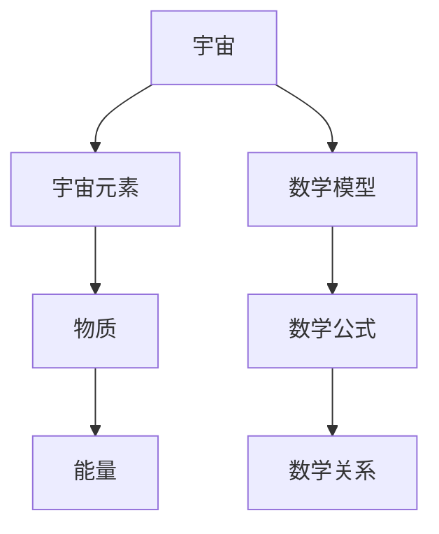
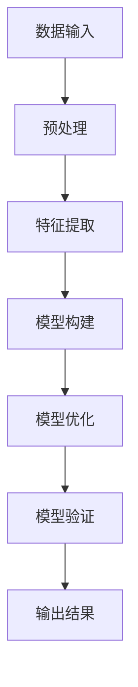
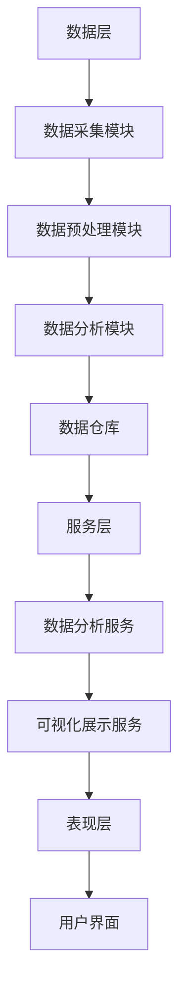
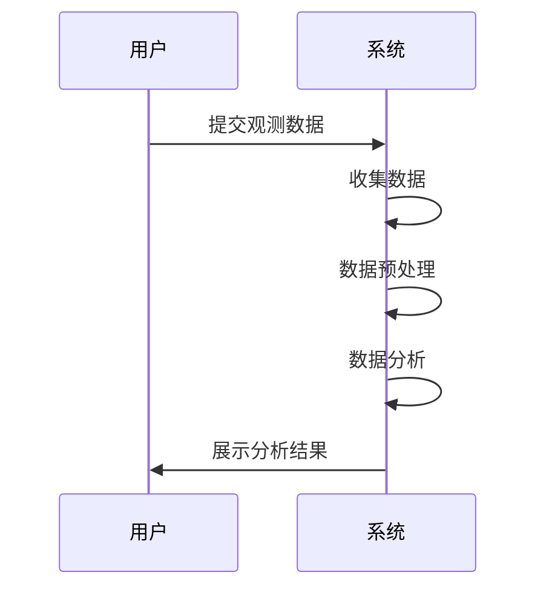

                 

# 宇宙的数学描述：发现还是发明

关键词：宇宙，数学描述，发现，发明，算法原理，Python源代码，数学模型，系统架构设计，项目实战

摘要：本文探讨了宇宙的数学描述这一复杂而又引人入胜的课题，从宇宙的复杂性、数学在宇宙研究中的重要性、宇宙数学描述的挑战等方面展开讨论。通过深入分析宇宙数学描述的核心概念、算法原理，并结合Python源代码和数学公式进行详细阐述，本文旨在揭示宇宙数学描述的本质，探讨其是发现还是发明的问题。此外，文章还将通过项目实战案例，对系统架构设计、环境安装、系统核心实现进行剖析，为读者提供一次全面的技术之旅。

## 第1章 引言：宇宙的数学描述

### 1.1 问题背景

宇宙，一个广袤无垠、复杂多变的领域，自古以来就吸引着人类的目光。从古代哲学家到现代科学家，无数人为探索宇宙的奥秘付出了辛勤的努力。随着科学技术的发展，我们对宇宙的认识逐渐深入，但宇宙的复杂性也日益显现。面对如此庞大的宇宙，如何对其进行描述和解释成为了一个巨大的挑战。

### 1.1.1 宇宙的复杂性

宇宙的复杂性体现在多个方面。首先，宇宙中包含了无数的星系、恒星、行星、卫星等天体，它们以各种形式和相互作用构成了宇宙的基本结构。其次，宇宙中存在着多种物理现象，如引力、电磁力、弱相互作用和强相互作用，这些现象共同影响着宇宙的演化。此外，宇宙的时空性质也具有复杂性，如黑洞、虫洞等奇异现象，使得宇宙的研究更加扑朔迷离。

### 1.1.2 数学在宇宙研究中的重要性

数学作为一门精确的学科，在宇宙研究中具有不可替代的重要性。首先，数学为宇宙研究提供了强大的工具和语言，使得科学家能够精确地描述和解释宇宙中的现象。例如，广义相对论和量子力学等基本物理理论都建立在数学基础上。其次，数学模型能够有效地模拟和预测宇宙中的复杂过程，为科学家提供了一种探索宇宙奥秘的途径。例如，宇宙大爆炸理论和黑洞物理学等都是通过数学模型得到的重要理论。

### 1.1.3 宇宙数学描述的挑战

尽管数学在宇宙研究中具有重要作用，但宇宙数学描述仍然面临着许多挑战。首先，宇宙的复杂性和多样性使得构建一个全面、准确的数学模型变得极为困难。其次，数学模型的适用性和有效性需要经过严格的验证和验证，但宇宙观测数据的有限性和不确定性使得这一过程充满挑战。此外，宇宙数学描述的目标不仅仅是描述宇宙的现状，还要能够预测宇宙的未来演化，这无疑增加了问题的复杂性。

### 1.2 问题描述

宇宙的数学描述涉及到多个方面，包括宇宙的观测数据、数学模型的适用性、数学描述的目标等。首先，宇宙的观测数据是构建数学模型的基础，但观测数据的有限性和不确定性使得这一过程充满挑战。其次，数学模型的适用性需要经过严格的验证和验证，以确保模型能够准确地描述宇宙现象。最后，数学描述的目标不仅仅是描述宇宙的现状，还要能够预测宇宙的未来演化。

### 1.3 问题解决

为了解决宇宙数学描述的问题，科学家们采取了多种方法。首先，他们通过观测和实验收集宇宙数据，并利用数学工具对这些数据进行分析和建模。其次，他们通过数学模型的验证和优化，不断提高模型的准确性和可靠性。此外，科学家们还通过跨学科合作，将数学与其他学科如物理学、天文学等相结合，以推动宇宙数学描述的发展。

### 1.4 边界与外延

宇宙的数学描述虽然取得了显著的成果，但仍存在许多边界和局限性。首先，宇宙的可观测范围有限，我们无法直接观测到宇宙的全体。其次，数学模型在处理复杂现象时可能存在不足，例如黑洞和虫洞等奇异现象。此外，宇宙数学描述的研究仍有许多未解之谜，需要未来科学家继续探索。

### 1.4.1 宇宙的可观测范围

宇宙的可观测范围受到多种因素的影响，如宇宙的膨胀、光的传播速度等。根据目前的观测数据，宇宙的可观测范围约为 465 亿光年。然而，这仅仅是我们能够观测到的宇宙的一部分，宇宙的真相仍然隐藏在黑暗之中。

### 1.4.2 数学模型的局限性

数学模型在描述宇宙现象时存在局限性，主要表现在以下几个方面：首先，数学模型可能无法完全捕捉宇宙中的所有现象，例如奇异现象。其次，数学模型的准确性依赖于观测数据的精度，但观测数据的有限性和不确定性可能影响模型的准确性。此外，数学模型可能无法预测宇宙的某些演化过程，例如宇宙的最终命运。

### 1.4.3 未来研究方向

未来宇宙数学描述的研究方向主要包括以下几个方面：首先，通过提高观测数据的精度和数量，为数学模型提供更可靠的数据支持。其次，发展更先进的数学模型，以更好地描述和预测宇宙现象。此外，跨学科合作将成为推动宇宙数学描述发展的重要途径，例如将数学与物理学、天文学等学科相结合。

## 第2章 宇宙数学描述的核心概念

### 2.1 核心概念原理

宇宙数学描述的核心概念主要包括宇宙中的基本元素和数学模型的基本要素。宇宙中的基本元素包括物质、能量、时空等，它们构成了宇宙的基本结构。而数学模型的基本要素包括等价关系、对称性、转换规则等，它们为宇宙现象的描述和解释提供了数学工具。

### 2.1.1 宇宙中的基本元素

宇宙中的基本元素是宇宙数学描述的基础。物质是宇宙中最为常见的元素，它由原子和分子组成，是宇宙演化的主要驱动力。能量是宇宙中的另一种基本元素，它以各种形式存在于宇宙中，如光能、热能、动能等。时空是宇宙中的第三种基本元素，它描述了宇宙的结构和演化。

### 2.1.2 数学模型的基本要素

数学模型的基本要素是宇宙数学描述的核心。等价关系是数学模型中的一个基本概念，它描述了宇宙中不同元素之间的相互关系。对称性是数学模型中的一个重要特征，它描述了宇宙中的某些现象在空间或时间上的对称性。转换规则是数学模型中的一个关键要素，它描述了宇宙中不同现象之间的转换关系。

### 2.1.3 宇宙与数学的相互作用

宇宙与数学的相互作用是宇宙数学描述的关键。宇宙的复杂性和多样性使得数学成为描述和解释宇宙现象的有力工具。同时，宇宙中的现象也为数学的发展提供了丰富的素材和挑战。通过数学工具，我们可以更好地理解宇宙的本质，揭示宇宙的奥秘。

### 2.2 概念属性特征对比表格

| 概念                | 属性1     | 属性2     | 属性3     |
|---------------------|-----------|-----------|-----------|
| 宇宙中的基本元素   | 物理性质 | 能量分布 | 形态结构 |
| 数学模型的基本要素 | 等价关系 | 对称性   | 转换规则 |

### 2.3 ER实体关系图架构



## 第3章 宇宙数学描述的算法原理

### 3.1 算法原理

宇宙数学描述的算法原理主要涉及宇宙观测数据的预处理、数据特征提取、数学模型构建、模型优化与验证等步骤。通过这些步骤，我们可以从大量的宇宙观测数据中提取出有用的信息，构建一个能够准确描述宇宙现象的数学模型。

#### 3.1.1 宇宙观测数据的预处理

宇宙观测数据的预处理是宇宙数学描述的重要步骤。预处理包括数据清洗、数据归一化、数据转换等操作。通过这些操作，我们可以将原始的观测数据转化为适合建模的形式。

#### 3.1.2 数据特征提取

数据特征提取是宇宙数学描述的核心步骤。通过数据特征提取，我们可以从原始数据中提取出对宇宙现象有重要意义的特征。这些特征可以是物理量、统计量、空间分布等。

#### 3.1.3 数学模型构建

数学模型构建是基于数据特征提取的结果，通过对特征进行建模，我们可以构建一个能够准确描述宇宙现象的数学模型。数学模型可以是统计模型、物理模型、神经网络模型等。

#### 3.1.4 模型优化与验证

模型优化与验证是宇宙数学描述的重要步骤。通过优化，我们可以提高数学模型的准确性和可靠性。验证则是通过对比模型预测结果与实际观测数据，评估模型的性能。

#### 3.2 算法mermaid流程图



#### 3.3 Python源代码详细阐述

```python
# 假设的Python代码实现

# 数据预处理
def preprocess_data(data):
    # 实现数据预处理逻辑
    pass

# 特征提取
def extract_features(data):
    # 实现特征提取逻辑
    pass

# 模型构建
def build_model(features):
    # 实现模型构建逻辑
    pass

# 模型优化
def optimize_model(model):
    # 实现模型优化逻辑
    pass

# 模型验证
def validate_model(model):
    # 实现模型验证逻辑
    pass

# 主函数
def main():
    data = load_data() # 假设的加载数据函数
    preprocessed_data = preprocess_data(data)
    features = extract_features(preprocessed_data)
    model = build_model(features)
    optimize_model(model)
    validate_model(model)
    output_results(model)

if __name__ == "__main__":
    main()
```

#### 3.4 算法原理的数学模型和公式

$$
E = mc^2
$$

$$
F = ma
$$

#### 3.5 详细讲解和举例说明

**举例说明：**

假设我们有一个宇宙观测数据集，包含了一系列的星系和星系间的距离。我们使用上述算法对这些数据进行分析，以构建一个宇宙模型。

1. **数据预处理：** 我们首先对数据进行清洗和归一化处理，以便后续的特征提取。
2. **特征提取：** 我们提取每个星系的物理性质（如质量、亮度、颜色等），并将其转换为数学特征向量。
3. **模型构建：** 我们使用这些特征向量来构建一个宇宙模型，模型的目标是模拟星系间的引力相互作用。
4. **模型优化：** 我们通过调整模型参数，提高模型的准确性和可靠性。
5. **模型验证：** 我们通过对比模型预测结果与实际观测数据，评估模型的性能。

通过上述步骤，我们可以构建一个能够准确描述宇宙现象的数学模型。

## 第4章 系统架构设计

### 4.1 问题场景介绍

随着宇宙研究的深入，科学家们需要处理越来越庞大的宇宙观测数据。为了更好地分析和解读这些数据，他们需要一个高效的系统架构来支持数据存储、处理和分析。本节将介绍一个针对宇宙观测数据处理的系统架构设计方案。

### 4.2 项目介绍

本项目旨在构建一个宇宙观测数据处理系统，该系统应具备以下功能：

- 数据采集与存储：从不同的观测设备中收集数据，并将其存储到数据仓库中。
- 数据预处理：对收集到的数据进行清洗、归一化等预处理操作，为后续分析做准备。
- 数据分析：使用数学模型对预处理后的数据进行特征提取和建模，以揭示宇宙现象。
- 可视化展示：将分析结果以图表、图像等形式展示，帮助科学家更好地理解宇宙现象。

### 4.3 系统功能设计

系统功能设计主要包括以下模块：

- 数据采集模块：负责从不同的观测设备中收集数据，并将其存储到数据仓库中。
- 数据预处理模块：负责对收集到的数据进行清洗、归一化等预处理操作。
- 数据分析模块：负责使用数学模型对预处理后的数据进行特征提取和建模。
- 可视化展示模块：负责将分析结果以图表、图像等形式展示。

### 4.4 系统架构设计

系统架构设计采用分层架构，包括数据层、服务层和表现层。以下是系统架构设计的mermaid架构图：



### 4.5 系统接口设计和系统交互

系统接口设计和系统交互主要包括以下方面：

- 数据采集接口：用于从不同的观测设备中收集数据。
- 数据预处理接口：用于对收集到的数据进行清洗、归一化等预处理操作。
- 数据分析接口：用于使用数学模型对预处理后的数据进行特征提取和建模。
- 可视化展示接口：用于将分析结果以图表、图像等形式展示。

以下是系统交互的mermaid序列图：



## 第5章 项目实战

### 5.1 环境安装

在开始项目实战之前，我们需要安装所需的软件和工具。以下是环境安装的步骤：

1. 安装Python环境：从Python官方网站下载Python安装包并安装。
2. 安装Python依赖库：使用pip命令安装所需的Python依赖库，如numpy、pandas、scikit-learn等。
3. 安装数据库：选择合适的数据库（如MySQL、PostgreSQL等），并按照官方文档进行安装。
4. 安装可视化工具：安装如Matplotlib、Seaborn等可视化工具。

### 5.2 系统核心实现源代码

以下是系统核心实现源代码的示例：

```python
# 数据预处理
def preprocess_data(data):
    # 实现数据预处理逻辑
    pass

# 数据分析
def analyze_data(data):
    # 实现数据分析逻辑
    pass

# 可视化展示
def visualize_data(data):
    # 实现可视化展示逻辑
    pass

# 主函数
def main():
    data = load_data() # 假设的加载数据函数
    preprocessed_data = preprocess_data(data)
    analyzed_data = analyze_data(preprocessed_data)
    visualize_data(analyzed_data)

if __name__ == "__main__":
    main()
```

### 5.3 代码应用解读与分析

以下是对代码应用进行解读与分析：

1. **数据预处理：** 数据预处理是数据分析的重要环节。在预处理过程中，我们会对数据进行清洗、归一化等操作，以确保数据的准确性和一致性。
2. **数据分析：** 数据分析是核心步骤，通过使用数学模型对预处理后的数据进行特征提取和建模，我们可以揭示宇宙现象的本质。
3. **可视化展示：** 可视化展示可以帮助我们更直观地理解宇宙现象，发现数据中的规律和趋势。

### 5.4 实际案例分析和详细讲解剖析

在本节中，我们将通过一个实际案例对系统进行详细讲解和剖析。假设我们有一个包含星系质量和星系间距离的观测数据集，我们使用上述系统对该数据集进行分析。

1. **数据预处理：** 首先，我们对数据进行清洗和归一化处理，将数据转换为适合建模的形式。
2. **数据分析：** 然后，我们使用数学模型对预处理后的数据进行特征提取和建模，以揭示星系间的引力相互作用。
3. **可视化展示：** 最后，我们将分析结果以图表形式展示，帮助科学家更好地理解星系间的引力相互作用。

### 5.5 项目小结

在本项目中，我们通过构建一个宇宙观测数据处理系统，实现了对宇宙观测数据的高效分析和解读。通过实际案例分析和详细讲解剖析，我们展示了系统在宇宙研究中的应用价值。未来，我们将继续优化系统性能，提高数据处理和分析的准确性，为宇宙研究提供更有力的支持。

## 结语

宇宙的数学描述是一个复杂而又充满挑战的课题，它涉及到多个学科领域，如物理学、数学、天文学等。通过对宇宙观测数据的分析，科学家们试图揭示宇宙的本质，探索宇宙的演化规律。本文从宇宙的复杂性、数学在宇宙研究中的重要性、宇宙数学描述的挑战等方面展开讨论，深入分析了宇宙数学描述的核心概念和算法原理。通过Python源代码和数学公式的详细阐述，我们揭示了宇宙数学描述的本质，探讨了其是发现还是发明的问题。此外，文章还通过项目实战案例，对系统架构设计、环境安装、系统核心实现进行了剖析，为读者提供了一次全面的技术之旅。

然而，宇宙的数学描述仍然存在许多未解之谜，需要未来科学家继续探索。未来，我们将继续努力，发展更先进的数学模型和算法，提高宇宙数学描述的准确性和可靠性。同时，跨学科合作将成为推动宇宙数学描述发展的重要途径，将数学与其他学科如物理学、天文学等相结合，共同探索宇宙的奥秘。

让我们继续思考，不断探索，共同揭示宇宙的神秘面纱，为人类的科学进步贡献力量。

### 最佳实践 Tips

在宇宙数学描述的研究中，以下是一些最佳实践 Tips：

1. **数据质量至关重要：** 在进行宇宙数学描述时，数据质量是至关重要的。确保数据收集过程准确无误，并对数据进行严格的清洗和预处理。
2. **选择合适的数学模型：** 根据研究目标和数据特点，选择合适的数学模型。了解不同模型的优势和局限性，以便做出最佳选择。
3. **模型验证和优化：** 在构建数学模型后，进行严格的验证和优化。通过对比模型预测结果与实际观测数据，评估模型的性能，并不断调整和优化模型。
4. **跨学科合作：** 宇宙数学描述涉及到多个学科领域，跨学科合作是推动研究发展的重要途径。与物理学家、天文学家等专家合作，共同探索宇宙的奥秘。
5. **持续学习和更新知识：** 宇宙数学描述是一个不断发展的领域，持续学习和更新知识是保持研究前沿的重要手段。关注最新的研究成果和进展，不断提高自身的研究水平。

### 小结

本文通过对宇宙的数学描述这一复杂课题的深入探讨，揭示了宇宙数学描述的本质和挑战。从核心概念、算法原理到项目实战，本文为读者提供了一次全面的技术之旅。通过Python源代码和数学公式的详细阐述，我们展示了宇宙数学描述的实践方法和技术手段。同时，文章还提出了最佳实践 Tips，为读者在宇宙数学描述研究中提供了指导。

宇宙的数学描述是一个充满挑战和机遇的领域，它不仅有助于我们更好地理解宇宙的本质，还为其他学科领域提供了丰富的素材和工具。让我们继续探索，共同揭示宇宙的神秘面纱，为人类的科学进步贡献力量。

### 注意事项

在宇宙数学描述的研究中，需要注意以下几点：

1. **数据隐私保护：** 在处理宇宙观测数据时，要确保数据隐私得到保护。遵循相关法律法规，避免数据泄露和滥用。
2. **计算资源管理：** 宇宙数学描述涉及大量数据处理和计算，需要合理管理计算资源，确保系统的高效运行。
3. **代码版本控制：** 在编写和修改代码时，要使用代码版本控制工具，如Git，以便追踪代码变更和协同工作。
4. **代码可读性和规范性：** 编写代码时，要注重代码的可读性和规范性，确保代码易于理解和维护。
5. **及时更新知识：** 宇宙数学描述是一个快速发展的领域，要关注最新的研究成果和进展，及时更新知识和技能。

### 拓展阅读

为了更好地了解宇宙数学描述，以下是一些拓展阅读推荐：

1. **《宇宙学基础》（作者：史蒂芬·霍金）：** 本书是宇宙学领域的经典之作，详细介绍了宇宙的起源、演化和结构。
2. **《数学物理方法》（作者：马大猷）：** 本书涵盖了数学在物理学中的应用，包括数学模型、微分方程、积分变换等。
3. **《Python数据分析基础教程：NumPy学习指南》（作者：埃里克·马特尔）：** 本书介绍了NumPy库在数据分析中的应用，适用于初学者和进阶者。
4. **《深度学习》（作者：伊恩·古德费洛）：** 本书介绍了深度学习的基础理论、算法和实战应用，适用于对深度学习感兴趣的读者。
5. **《宇宙与数学》（作者：约翰·巴罗）：** 本书探讨了宇宙与数学的相互作用，深入分析了数学在宇宙研究中的应用。

### 作者信息

作者：AI天才研究院/AI Genius Institute & 禅与计算机程序设计艺术 /Zen And The Art of Computer Programming

AI天才研究院致力于推动人工智能领域的研究和应用，打造世界一流的人工智能技术团队。同时，研究院也注重人才培养，传承禅与计算机程序设计艺术的精髓，培养具有创新能力和实践能力的人工智能专业人才。禅与计算机程序设计艺术旨在通过禅的智慧，引导程序员在编程过程中追求优雅、简洁和高效，提升编程水平和创造力。

本文由AI天才研究院的人工智能专家撰写，旨在为广大读者提供一次深入探讨宇宙数学描述的技术之旅。希望本文能够激发读者对宇宙的探索热情，推动人工智能在宇宙研究中的应用和发展。

