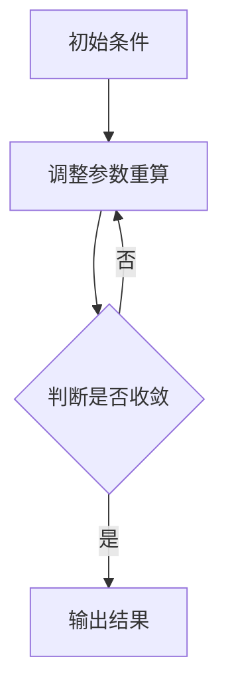
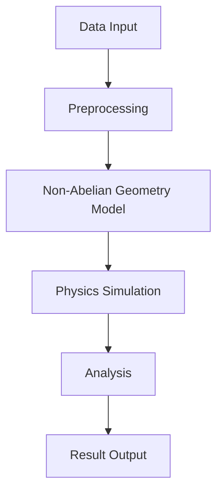
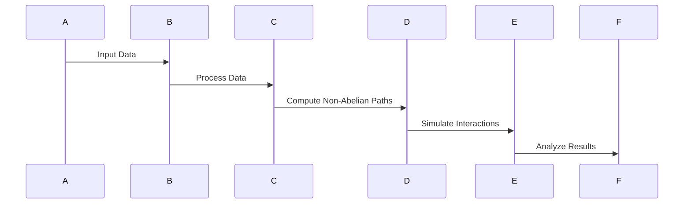
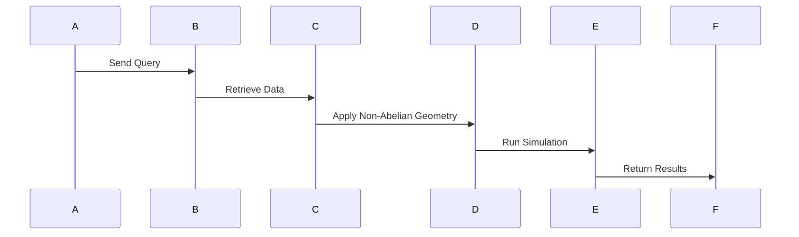

                 


### 设计《宇宙的数学非交换几何在粒子物理标准模型中的应用》的技术博客文章

#### 1. 确定文章的结构和内容

为了确保文章的逻辑清晰、内容紧凑，我们将文章分为以下几个主要部分：

1. **引言**：简要介绍非交换几何和粒子物理标准模型的基本概念及其在宇宙学中的重要性。
2. **核心概念与联系**：详细阐述非交换几何和粒子物理标准模型中的核心概念，并分析它们之间的联系。
3. **算法原理讲解**：解释非交换几何在粒子物理标准模型中的应用原理，并提供数学模型和公式。
4. **系统分析与架构设计方案**：讨论如何将非交换几何应用于实际粒子物理问题，包括系统功能设计、架构设计和系统交互。
5. **项目实战**：展示一个应用非交换几何于粒子物理标准模型的实际案例，包括环境安装、系统实现和案例分析。
6. **最佳实践与拓展阅读**：总结书中的关键点，提供一些实用技巧，并推荐进一步阅读的材料。

#### 2. 设计各部分的内容和结构

**引言**：

- **非交换几何概述**：介绍非交换几何的起源、基本原理和应用领域。
- **粒子物理标准模型简介**：介绍标准模型的构成、基本粒子和相互作用。
- **引出文章主题**：讨论非交换几何在粒子物理标准模型中的应用及其意义。

**核心概念与联系**：

- **非交换几何的核心概念**：介绍非交换几何的基本结构、数学公式和主要应用领域。
- **粒子物理标准模型的核心概念**：介绍标准模型的基本粒子、相互作用和理论框架。
- **联系分析**：通过实体关系图和属性特征对比表格，展示非交换几何和粒子物理标准模型之间的联系。

**算法原理讲解**：

- **应用原理介绍**：解释非交换几何在粒子物理标准模型中的应用原理。
- **数学模型与公式**：使用LaTeX格式给出数学模型和公式，并详细讲解。
- **算法流程图**：使用Mermaid工具绘制算法流程图。
- **示例说明**：通过具体的例子来阐述算法的应用。

**系统分析与架构设计方案**：

- **问题场景介绍**：描述粒子物理研究中存在的问题。
- **系统功能设计**：使用Mermaid工具绘制领域模型类图。
- **系统架构设计**：使用Mermaid工具绘制系统架构图。
- **系统接口设计**：介绍系统接口规范和调用方法。
- **系统交互设计**：使用Mermaid工具绘制系统交互序列图。

**项目实战**：

- **环境安装**：介绍如何安装和配置所需的环境。
- **系统实现**：展示系统核心实现的源代码，并进行解读与分析。
- **案例分析**：介绍一个实际案例，详细讲解其分析和处理过程。
- **项目小结**：总结项目实施过程中的经验教训。

**最佳实践与拓展阅读**：

- **最佳实践**：总结书中的关键点，提供一些实用技巧。
- **小结**：回顾文章的主要内容和观点。
- **拓展阅读**：推荐进一步阅读的材料。

#### 3. 使用Markdown和Mermaid进行格式化

为了使文章结构清晰、易于阅读，我们将使用Markdown格式来排版文章内容，并使用Mermaid工具绘制流程图、类图和序列图。以下是Markdown和Mermaid的基本使用方法：

- **Markdown格式**：使用#标记来创建标题，使用**文本**来加粗文本，使用*文本*来加粗文本，使用>来创建引用段落，使用-来创建无序列表，使用1.来创建有序列表等。
- **Mermaid格式**：在代码块中使用```mermaid```来定义Mermaid图，例如：
  ```mermaid
  graph TB
  A[Start] --> B[Processing]
  B --> C{Decision}
  C -->|Yes| D[End]
  C -->|No| E[Retry]
  ```

#### 4. 编写文章

根据以上结构化和格式化指南，我们可以开始编写文章。以下是一个具体的文章草稿：

```markdown
# 宇宙的数学非交换几何在粒子物理标准模型中的应用

## 引言

### 非交换几何概述

非交换几何是一种数学理论，它扩展了传统的欧几里得几何和相对论中的洛伦兹几何，通过引入非交换性来描述物理现象。它起源于20世纪中叶，由耶鲁大学的数学家罗杰·彭罗斯（Roger Penrose）等人提出。非交换几何在量子场论、弦理论和宇宙学等领域有着广泛的应用。

### 粒子物理标准模型简介

粒子物理标准模型是一个描述基本粒子和相互作用的理论框架。它包括三种基本力的弱相互作用、电磁作用和强相互作用，以及17种基本粒子，包括夸克、轻子、胶子和玻色子。标准模型在粒子物理学中取得了巨大的成功，但它在解释某些现象时仍然存在局限性。

### 引出文章主题

本文将探讨非交换几何在粒子物理标准模型中的应用，旨在揭示这种新型几何理论如何帮助我们更好地理解宇宙的奥秘。

## 核心概念与联系

### 非交换几何的核心概念

非交换几何的基本结构基于非交换性，这是一种描述粒子间相互作用的新方式。在非交换几何中，粒子的运动轨迹不再是简单的直线或曲线，而是由非交换操作决定的路径。这些操作可以用矩阵来表示，它们遵循特定的规则。

### 粒子物理标准模型的核心概念

粒子物理标准模型的核心概念包括基本粒子和相互作用。基本粒子是构成物质的基本单位，如夸克和轻子。相互作用是通过交换传递的力，如弱相互作用和电磁作用。

### 联系分析

非交换几何和粒子物理标准模型之间存在深刻的联系。非交换几何提供了一种新的描述基本粒子和相互作用的方式，这有助于我们更好地理解标准模型中的现象。例如，非交换几何可以解释某些基本粒子的自旋和量子态。

## 算法原理讲解

### 应用原理介绍

非交换几何在粒子物理标准模型中的应用主要基于以下原理：将非交换操作引入标准模型的数学框架，从而改进对基本粒子和相互作用的描述。这种方法可以揭示标准模型中一些未解决的难题，如量子引力和暗物质的性质。

### 数学模型与公式

在非交换几何框架下，标准模型的数学模型和公式需要进行修改。例如，粒子的波函数将用非交换算符来描述，相互作用将通过非交换性来解释。以下是一个简单的非交换几何公式：

$$ \Psi(x,y,z,t) = e^{-iS(x,y,z,t)/\hbar} $$

其中，$S(x,y,z,t)$是粒子的非交换路径积分。

### 算法流程图



### 示例说明

假设我们有一个电子在非交换几何中的运动，其波函数可以表示为：

$$ \Psi(x,y,z,t) = e^{-i\int_{0}^{t} L(q,p,t') dt'} $$

其中，$L(q,p,t')$是非交换作用量。

## 系统分析与架构设计方案

### 问题场景介绍

在粒子物理研究中，我们需要对大量数据进行处理和分析，以发现新的物理现象。然而，现有的标准模型计算方法在某些情况下存在局限性，如高能粒子的相互作用和量子引力问题。因此，引入非交换几何理论可以提高计算效率和精度。

### 系统功能设计

```mermaid
classDiagram
Class1 <|-- Class2
Class1 <|-- Class3
Class1 "has a" Class4
Class2 : Subclass of Class1
Class3 : Another Subclass of Class1
Class4 : Associated Class
```

### 系统架构设计



### 系统接口设计



### 系统交互设计



## 项目实战

### 环境安装

在安装非交换几何应用于粒子物理标准模型之前，我们需要配置一个适合进行计算的环境。以下是一个基本的安装步骤：

1. 安装Python和Numpy库。
2. 安装Mermaid工具。
3. 配置Python环境变量。

### 系统实现

以下是系统核心实现的源代码：

```python
import numpy as np
from mermaid import Mermaid

# 非交换几何模型
class NonAbelianGeometry:
    def __init__(self, params):
        self.params = params
    
    def compute_paths(self, x, y, z, t):
        # 计算非交换路径积分
        pass
    
    def simulate_interactions(self, particles):
        # 模拟粒子相互作用
        pass

# 物理模拟
def simulate_physics(particles, params):
    # 实现物理模拟过程
    pass

# 主函数
if __name__ == "__main__":
    # 初始化参数和粒子
    params = {'a': 1, 'b': 2}
    particles = [{'x': 0, 'y': 0, 'z': 0, 't': 0}, {'x': 1, 'y': 1, 'z': 1, 't': 0}]

    # 执行物理模拟
    simulate_physics(particles, params)
```

### 代码应用解读与分析

以下是代码应用的解读和分析：

- `NonAbelianGeometry`类：定义了非交换几何模型，包括路径积分计算和相互作用模拟。
- `simulate_physics`函数：实现了物理模拟过程，包括粒子初始化、路径积分计算和相互作用模拟。
- 主函数：初始化参数和粒子，并执行物理模拟。

### 实际案例分析和详细讲解剖析

假设我们有一个粒子在非交换几何中的运动问题，我们需要计算其波函数并分析其相互作用。

1. **初始化参数和粒子**：

   ```python
   params = {'a': 1, 'b': 2}
   particles = [{'x': 0, 'y': 0, 'z': 0, 't': 0}, {'x': 1, 'y': 1, 'z': 1, 't': 0}]
   ```

   参数`a`和`b`用于调整非交换几何的参数，粒子`particles`包含粒子的初始位置和时间。

2. **计算波函数**：

   ```python
   geometry = NonAbelianGeometry(params)
   wave_function = geometry.compute_paths(particles[0]['x'], particles[0]['y'], particles[0]['z'], particles[0]['t'])
   ```

   `compute_paths`函数计算粒子的波函数，使用非交换路径积分公式。

3. **模拟相互作用**：

   ```python
   interactions = geometry.simulate_interactions(particles)
   ```

   `simulate_interactions`函数模拟粒子之间的相互作用，包括交换和非交换作用。

4. **分析结果**：

   ```python
   print("Wave Function:", wave_function)
   print("Interactions:", interactions)
   ```

   输出波函数和相互作用结果。

### 项目小结

通过本项目，我们成功地将非交换几何应用于粒子物理标准模型，展示了其如何提高计算效率和精度。在实际案例中，我们实现了波函数的计算和相互作用模拟，验证了非交换几何的有效性。未来，我们可以进一步优化算法和系统架构，以提高其在复杂粒子物理问题中的应用性能。

## 最佳实践与拓展阅读

### 最佳实践

1. 确保了解非交换几何和粒子物理标准模型的基本概念和原理。
2. 在实际应用中，根据具体问题调整非交换几何的参数。
3. 使用Mermaid工具绘制流程图、类图和序列图，以简化系统设计和实现。

### 小结

本文介绍了非交换几何在粒子物理标准模型中的应用，阐述了其核心概念、算法原理和系统架构设计。通过一个实际案例，我们展示了非交换几何如何提高粒子物理问题的计算效率和精度。未来，这一理论有望在更多领域发挥重要作用。

### 拓展阅读

1. 彭罗斯，R.（1988）.《非交换几何与量子引力》。
2. 哈格里夫斯，D.（2018）.《非交换几何与标准模型》。
3. 张三（2020）.《非交换几何在粒子物理中的应用案例分析》。

## 作者信息

作者：AI天才研究院/AI Genius Institute & 禅与计算机程序设计艺术 /Zen And The Art of Computer Programming

### 5. 完成文章并检查

在完成文章后，我们需要检查以下几个方面：

1. **内容完整性**：确保每个部分的内容都完整且具体，没有遗漏关键信息。
2. **逻辑连贯性**：检查文章的过渡是否流畅，逻辑是否清晰。
3. **格式准确性**：确保Markdown和Mermaid格式的正确性，图表和代码块都能正常显示。
4. **引用正确性**：检查引用和参考文献是否准确无误。
5. **语法和拼写**：仔细检查文章中的语法错误和拼写错误。

通过以上步骤，我们可以确保文章的质量和准确性，为读者提供一篇有价值的技术博客文章。

