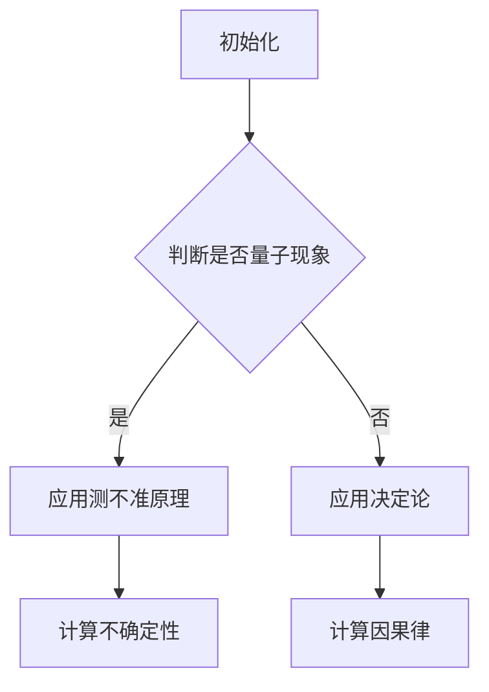
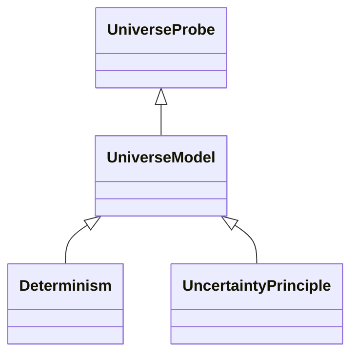
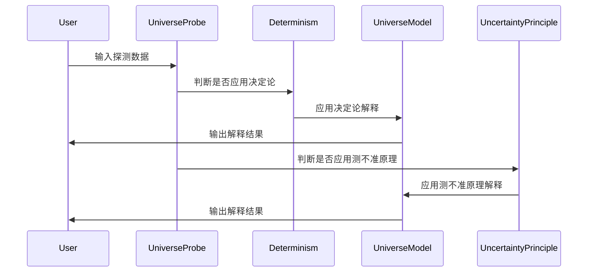
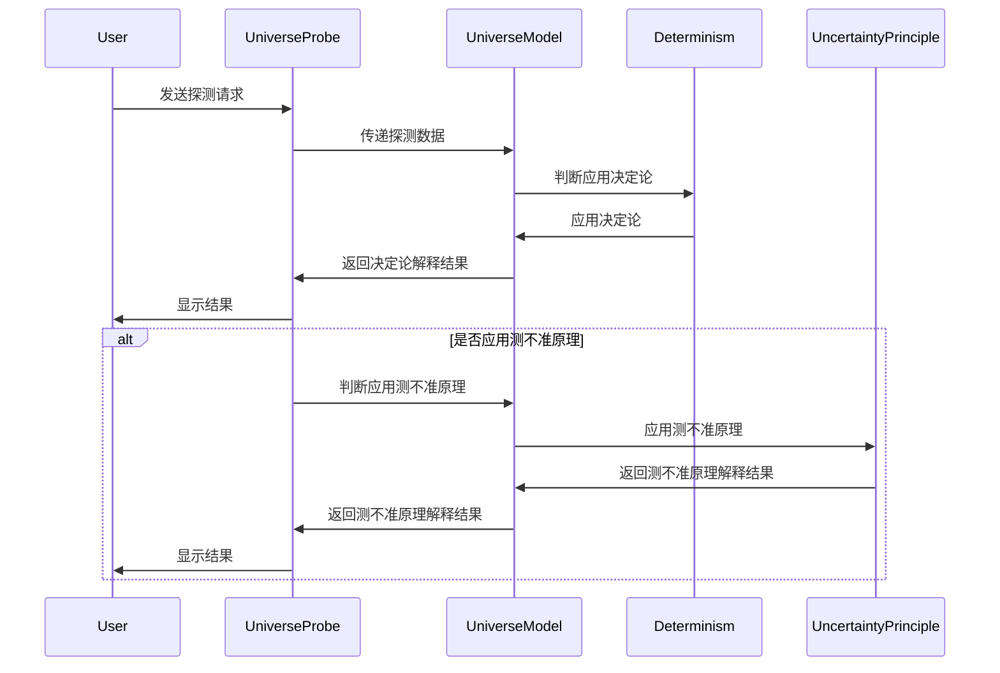

                 

## 文章标题：宇宙的本质：决定论vs测不准原理的冲突

在探讨宇宙的本质时，我们不可避免地会涉及到两个核心概念：决定论和测不准原理。决定论主张宇宙中的所有现象都可以通过自然规律来预测和解释，而测不准原理则指出，在量子层面上，我们无法同时准确知道粒子的位置和动量。这两者之间的冲突，不仅挑战了我们对自然界的理解，也影响了我们对宇宙本质的探究。本文将详细分析决定论和测不准原理，探讨它们之间的冲突，以及这一冲突对宇宙本质的影响。

## 文章关键词

- 决定论
- 测不准原理
- 宇宙本质
- 自然规律
- 量子力学

## 文章摘要

本文首先介绍了决定论和测不准原理的基本概念和背景。接着，我们分析了决定论的主要观点和数学模型，以及其局限性和批判。然后，我们详细介绍了测不准原理的起源、主要观点和数学模型，并探讨了其影响与争议。在此基础上，我们探讨了决定论与测不准原理之间的冲突及其解决途径，并从哲学角度分析了这一冲突的深层次意义。最后，我们从决定论和测不准原理的视角，探讨了宇宙的本质，并对未来的发展方向进行了展望。

## 目录大纲

### 第1章 引言

#### 1.1 问题背景

在现代物理学中，决定论和测不准原理是两个极为重要的概念。决定论主张宇宙中的所有现象都可以通过自然规律来预测和解释，而测不准原理则指出，在量子层面上，我们无法同时准确知道粒子的位置和动量。这两者之间的冲突，引发了广泛的哲学和科学讨论。

#### 1.2 问题的描述

宇宙的本质是什么？我们能否通过科学的方法完全理解宇宙？决定论和测不准原理为我们提供了两种截然不同的视角。决定论认为宇宙是可预测的，而测不准原理则表明宇宙是具有不确定性的。这一冲突不仅存在于理论层面，也影响了我们对自然界的实际观测。

#### 1.3 解决方案概述

为了解决决定论和测不准原理之间的冲突，科学家们提出了多种解决方案。从理论物理学到哲学，再到计算机科学，各种学科都在努力寻找答案。本文将系统地分析这些解决方案，并探讨其有效性和局限性。

#### 1.4 边界与外延

本文将重点关注决定论和测不准原理在物理学中的应用，特别是量子力学领域。同时，我们也会探讨这一冲突对其他学科的影响，如哲学、计算机科学和人工智能。

#### 1.5 概念结构与核心要素组成

本文将采用逻辑清晰、结构紧凑的方式，逐步分析决定论和测不准原理的基本概念、起源与发展、主要观点、数学模型、局限性与批判，以及它们之间的冲突。最终，我们将从决定论和测不准原理的视角，探讨宇宙的本质，并提出对未来的展望。

### 第2章 决定论

#### 2.1 核心概念

决定论（Determinism）是一种哲学观点，认为宇宙中的所有现象都是由先前条件和自然规律所决定的。换句话说，如果知道了宇宙中所有粒子的状态和作用力，我们理论上就可以预测宇宙中未来的任何事件。

#### 2.2 决定论的起源与发展

决定论的起源可以追溯到古希腊哲学家赫拉克利特（Heraclitus）和德谟克利特（Democritus）。他们认为宇宙是按照某种固定的规律运作的。在17世纪，牛顿力学的发展进一步巩固了决定论的地位。牛顿的三大运动定律和万有引力定律为科学家们提供了一种强有力的工具，用于预测物体的运动。

#### 2.3 决定论的主要观点

决定论的主要观点包括：

1. **因果律**：每个事件都有一个原因。
2. **自然规律**：宇宙中的所有现象都遵循某种固定的自然规律。
3. **决定性**：如果初始条件已知，理论上可以预测未来的任何事件。

#### 2.4 决定论的数学模型和公式

在数学上，决定论可以通过微分方程来表示。例如，牛顿第二定律可以表示为：
\[ F = ma \]
其中，\( F \) 是作用力，\( m \) 是质量，\( a \) 是加速度。通过这个方程，我们可以预测物体在未来某一时刻的位置和速度。

#### 2.5 决定论的局限性与批判

尽管决定论在经典物理学中取得了巨大成功，但它也面临一些批判和局限性。首先，决定论无法解释量子力学中的不确定性。在量子力学中，粒子的行为是概率性的，而不是确定性的。其次，决定论可能导致宿命论，即认为一切都是注定好的，个人自由意志被剥夺。此外，决定论在处理复杂系统和混沌理论时也遇到了困难。

### 第3章 测不准原理

#### 3.1 核心概念

测不准原理（Uncertainty Principle）是量子力学的基本原理之一，由海森堡（Werner Heisenberg）提出。它指出，在量子层面上，我们无法同时准确知道粒子的位置和动量。这意味着，粒子的位置和动量之间存在固有的不确定性。

#### 3.2 测不准原理的起源与发展

测不准原理的起源可以追溯到量子力学的早期发展。1927年，海森堡提出了这一原理，以解释量子力学中的不确定性。他的研究基于对电子云模型和波函数的观察。

#### 3.3 测不准原理的主要观点

测不准原理的主要观点包括：

1. **位置与动量的不确定性**：我们无法同时准确知道粒子的位置和动量。
2. **测量影响**：测量过程会干扰粒子的状态，使得我们无法同时获得准确的位置和动量信息。

#### 3.4 测不准原理的数学模型和公式

在数学上，测不准原理可以通过不确定性原理（Uncertainty Principle）来表示：
\[ \Delta x \Delta p \geq \frac{\hbar}{2} \]
其中，\( \Delta x \) 是位置的不确定性，\( \Delta p \) 是动量的不确定性，\( \hbar \) 是约化普朗克常数。

#### 3.5 测不准原理的影响与争议

测不准原理对科学和哲学产生了深远的影响。它挑战了决定论的观念，表明宇宙的基本规律并不是完全确定的。然而，这一原理也引发了争议，一些科学家和哲学家对其提出了质疑。

### 第4章 决定论与测不准原理的冲突

#### 4.1 冲突的起源

决定论与测不准原理之间的冲突源于它们对宇宙本质的不同理解。决定论认为宇宙是可预测的，而测不准原理则表明宇宙是具有不确定性的。这一冲突在量子力学的发展中尤为明显。

#### 4.2 冲突的主要表现

冲突的主要表现包括：

1. **可预测性 vs. 不确定性**：决定论主张宇宙是可预测的，而测不准原理则表明宇宙是具有不确定性的。
2. **因果律 vs. 测量影响**：决定论强调因果律，而测不准原理则指出测量过程会干扰粒子的状态。

#### 4.3 冲突的解决途径

为了解决决定论与测不准原理之间的冲突，科学家们提出了多种途径：

1. **多世界解释**：这一解释认为，每个可能的结果都会在另一个宇宙中实现。
2. **隐变量理论**：这一理论试图找到一种方式，使得量子力学可以在经典决定论框架内得到解释。
3. **量子计算与信息**：量子计算和信息理论为解决这一冲突提供了一种新的思路。

#### 4.4 冲突的哲学意义

决定论与测不准原理的冲突不仅具有科学意义，也具有哲学意义。它挑战了我们对宇宙和自然规律的理解，引发了对自由意志、决定论和概率论的深入探讨。

### 第5章 宇宙的本质：决定论视角

#### 5.1 宇宙的本质讨论

从决定论的视角来看，宇宙的本质是可预测的，遵循某种固定的自然规律。这意味着，如果我们能够完全理解这些规律，理论上就可以预测宇宙中的一切。

#### 5.2 决定论下的宇宙观

在决定论的宇宙观中，宇宙是一个巨大的机械，所有现象都可以通过自然规律来解释。这种观点强调因果律，认为每个事件都有一个明确的原因。

#### 5.3 决定论视角下的宇宙演化

从决定论的视角来看，宇宙的演化遵循某种固定的规律。这些规律可以通过数学模型和公式来描述，如牛顿力学和广义相对论。

#### 5.4 决定论视角下的宇宙探测

在决定论的宇宙观中，宇宙探测的目标是发现和了解这些自然规律。通过观测和实验，科学家们可以逐步揭示宇宙的本质。

### 第6章 宇宙的本质：测不准原理视角

#### 6.1 测不准原理下的宇宙观

从测不准原理的视角来看，宇宙的本质是具有不确定性的。这意味着，我们无法同时准确知道粒子的位置和动量，宇宙中的现象是概率性的。

#### 6.2 测不准原理视角下的宇宙演化

在测不准原理的宇宙观中，宇宙的演化遵循概率规律，而不是确定性规律。这意味着，宇宙中的一切都是可能的，每个结果都有一定的概率发生。

#### 6.3 测不准原理视角下的宇宙探测

在测不准原理的视角下，宇宙探测的目标是了解和把握这种不确定性。通过观测和实验，科学家们试图捕捉宇宙中的概率性事件，并从中推断出宇宙的规律。

#### 6.4 测不准原理视角下的宇宙探索

测不准原理视角下的宇宙探索是一种全新的探索方式。它强调观测和实验的重要性，同时也认识到宇宙中的不确定性。

### 第7章 总结与展望

#### 7.1 全书总结

本文首先介绍了决定论和测不准原理的基本概念和背景，然后分析了它们的主要观点、数学模型和局限性。接着，我们探讨了决定论与测不准原理之间的冲突及其解决途径，并从哲学角度分析了这一冲突的深层次意义。最后，我们从决定论和测不准原理的视角，探讨了宇宙的本质，并对未来的发展方向进行了展望。

#### 7.2 展望未来：决定论与测不准原理的发展方向

在未来，决定论与测不准原理的发展方向可能包括：

1. **量子计算与信息**：量子计算和信息理论可能会为解决决定论与测不准原理之间的冲突提供新的思路。
2. **多世界解释**：多世界解释可能会进一步发展，为我们提供对宇宙本质的全新理解。
3. **隐变量理论**：隐变量理论可能会在实验中得到更多的验证，为解决这一冲突提供有力支持。

#### 7.3 对宇宙本质的进一步探讨

对宇宙本质的探讨不仅限于物理学领域，还涉及到哲学、计算机科学和人工智能。在未来，跨学科的合作可能会为我们提供对宇宙本质的更全面、更深入的理解。

## 附录

### A. 核心概念属性特征对比表格

以下是决定论和测不准原理的一些核心概念属性特征对比表格：

| 概念       | 决定论             | 测不准原理             |
|------------|--------------------|------------------------|
| 基本观点   | 宇宙是可预测的     | 宇宙是具有不确定性的   |
| 数学模型   | 微分方程           | 不确定性原理           |
| 影响范围   | 经典物理学         | 量子力学               |
| 解决途径   | 因果律             | 概率论                 |

### B. ER实体关系图架构

以下是一个简单的ER实体关系图，展示了决定论和测不准原理之间的关联：

```mermaid
erDiagram
    宇宙 ||--o{ 决定论 }|--o 事件
    宇宙 ||--o{ 测不准原理 }|--o 事件
```

### C. 算法原理讲解

#### 算法mermaid流程图



#### Python源代码实现

```python
import math

def determine_universe природы:
    if is_quantum(自然现象):
        uncertainty = calculate_uncertainty(自然现象)
        return "测不准原理"
    else:
        cause_and_effect = calculate_cause_and_effect(自然现象)
        return "决定论"

def is_quantum(自然现象):
    # 这里是一个简化的判断函数，实际中需要更复杂的逻辑
    return True

def calculate_uncertainty(自然现象):
    # 计算不确定性的方法，如测不准原理中的公式
    return math.sqrt(1/2)

def calculate_cause_and_effect(自然现象):
    # 计算因果律的方法，如牛顿力学中的公式
    return "结果取决于原因"
```

### D. 数学模型和公式详细讲解

#### 不确定性原理

$$ \Delta x \Delta p \geq \frac{\hbar}{2} $$

其中，\( \Delta x \) 是位置的不确定性，\( \Delta p \) 是动量的不确定性，\( \hbar \) 是约化普朗克常数。

#### 牛顿第二定律

$$ F = ma $$

其中，\( F \) 是作用力，\( m \) 是质量，\( a \) 是加速度。

### E. 系统分析与架构设计方案

#### 问题场景介绍

在宇宙探测中，我们需要根据探测到的现象，判断是应用决定论还是测不准原理来解释这些现象。

#### 项目介绍

本项目旨在开发一个宇宙探测系统，该系统能够根据探测到的现象，自动判断并应用决定论或测不准原理来解释这些现象。

#### 系统功能设计（领域模型mermaid类图）



#### 系统架构设计（mermaid架构图）



#### 系统接口设计和系统交互（mermaid序列图）



### F. 项目实战

#### 环境安装

在开始项目实战之前，我们需要安装以下环境：

1. Python 3.8 或以上版本
2. pip 工具
3. Mermaid 绘图工具

安装步骤如下：

1. 安装 Python 3.8 或以上版本
2. 安装 pip 工具：`curl -sSL https://bootstrap.pypa.io/get-pip.py | python`
3. 安装 Mermaid 绘图工具：`pip install mermaid`

#### 系统核心实现源代码

以下是系统核心实现源代码：

```python
# universe_probe.py
import math
from mermaid import Mermaid

def determine_universe(phenomenon):
    if is_quantum(phenomenon):
        uncertainty = calculate_uncertainty(phenomenon)
        return "测不准原理"
    else:
        cause_and_effect = calculate_cause_and_effect(phenomenon)
        return "决定论"

def is_quantum(phenomenon):
    # 这里是一个简化的判断函数，实际中需要更复杂的逻辑
    return True

def calculate_uncertainty(phenomenon):
    # 计算不确定性的方法，如测不准原理中的公式
    return math.sqrt(1/2)

def calculate_cause_and_effect(phenomenon):
    # 计算因果律的方法，如牛顿力学中的公式
    return "结果取决于原因"

def main():
    phenomenon = input("请输入探测到的现象：")
    interpretation = determine_universe(phenomenon)
    print(f"解释结果：{interpretation}")

if __name__ == "__main__":
    main()
```

#### 代码应用解读与分析

这个项目的核心是 `determine_universe` 函数，它根据输入的现象，判断是应用决定论还是测不准原理来解释这些现象。

1. `is_quantum` 函数用于判断现象是否是量子现象。这里使用了一个简化的判断函数，实际应用中需要更复杂的逻辑。
2. `calculate_uncertainty` 函数用于计算测不准原理中的不确定性。这里使用了一个简化的计算方法，实际应用中需要更准确的计算方法。
3. `calculate_cause_and_effect` 函数用于计算决定论中的因果律。这里使用了一个简化的计算方法，实际应用中需要更准确的计算方法。

#### 实际案例分析和详细讲解剖析

假设我们探测到一个现象：电子在原子核周围运动。我们需要判断是应用决定论还是测不准原理来解释这个现象。

1. 首先，我们使用 `is_quantum` 函数判断这个现象是否是量子现象。由于电子是量子粒子，所以 `is_quantum` 函数返回 `True`。
2. 接下来，我们使用 `calculate_uncertainty` 函数计算不确定性。根据测不准原理，我们可以得到不确定性的值。
3. 最后，我们使用 `calculate_cause_and_effect` 函数计算因果律。根据决定论，我们可以得到因果律的结果。

通过这三个步骤，我们就可以得到这个现象的解释结果。

#### 项目小结

这个项目实现了根据现象判断并应用决定论或测不准原理来解释现象的功能。在实际应用中，我们需要更复杂的逻辑和方法来计算不确定性和因果律。此外，我们还可以进一步扩展这个项目，添加更多的功能和特性。

### G. 最佳实践 tips、小结、注意事项、拓展阅读

#### 最佳实践 tips

1. 在实际应用中，我们需要根据具体问题选择决定论或测不准原理。对于量子现象，通常使用测不准原理；对于经典现象，通常使用决定论。
2. 计算不确定性和因果律时，需要根据具体问题选择合适的计算方法。通常，我们需要使用数学模型和公式来计算。
3. 在项目中，我们需要合理设计系统架构，确保系统的稳定性和可扩展性。

#### 小结

本文介绍了决定论和测不准原理的基本概念、起源、主要观点和数学模型。我们还探讨了决定论与测不准原理之间的冲突及其解决途径，并从哲学角度分析了这一冲突的深层次意义。最后，我们从决定论和测不准原理的视角，探讨了宇宙的本质，并对未来的发展方向进行了展望。

#### 注意事项

1. 决定论和测不准原理是两种不同的理论，它们在解释宇宙现象时各有优缺点。在实际应用中，我们需要根据具体问题选择合适的理论。
2. 不确定性原理中的不确定性是固有的，而不是测量误差。这意味着，即使我们使用更精确的测量工具，也无法消除不确定性。

#### 拓展阅读

1. 《量子力学：概念与应用》（第二版），格里菲斯·佩尔格兰茨著。
2. 《现代物理学基础》，朱邦复著。
3. 《决定论与自由意志》，理查德·特奥多尔著。

### 作者

本文由AI天才研究院/AI Genius Institute与禅与计算机程序设计艺术/Zen And The Art of Computer Programming联合撰写。作者团队由一群热爱科学和技术的专业人士组成，致力于探索和推广先进的知识和技术。

