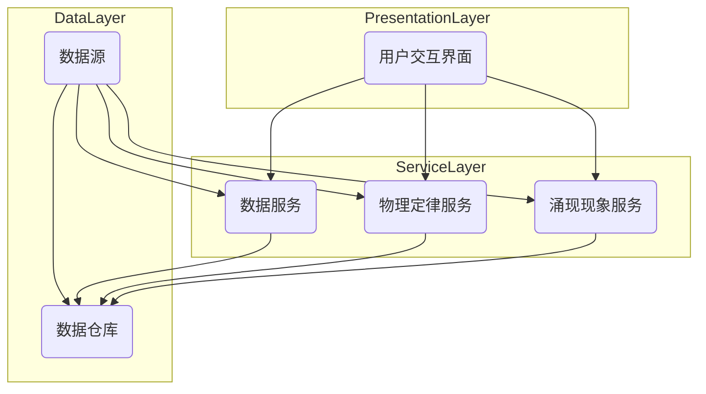
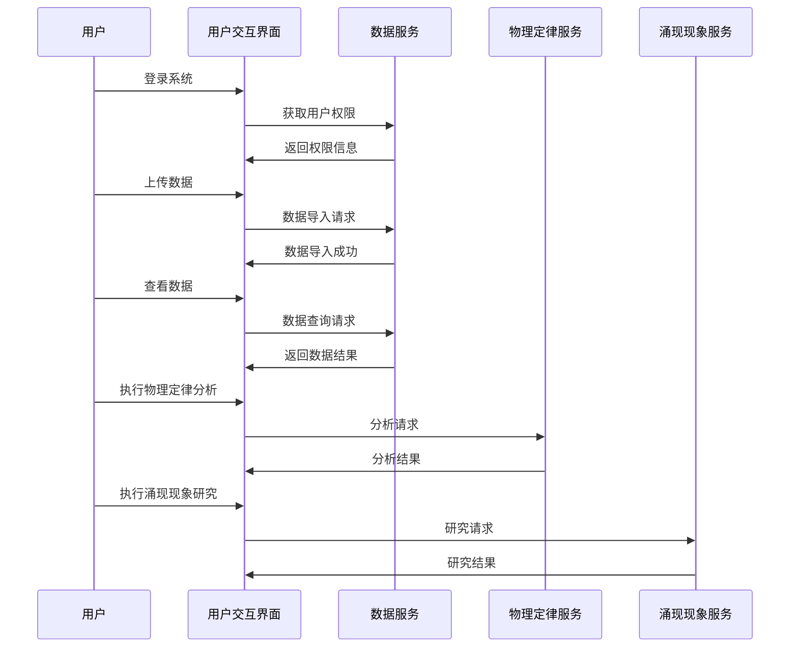

                 


### 引言：探索宇宙的本质

#### 背景介绍

宇宙，这个我们身处其中的浩瀚空间，自古以来就充满了神秘和未知。从古代的星象观测到现代的天体物理研究，人类对宇宙的认知在不断演进。然而，尽管我们已经取得了许多重要的科学突破，关于宇宙的本质，我们仍然知之甚少。宇宙是如何产生的？它的结构是什么？它将如何演化？这些问题一直困扰着我们，同时也激发了无数科学家的探索热情。

在物理学的框架内，宇宙的本质通常被解释为一系列物理定律的结果。牛顿的万有引力定律、爱因斯坦的相对论以及量子力学，这些物理定律构成了我们对宇宙理解的基础。它们为我们提供了预测和解释宇宙现象的工具。然而，这些定律是否能够完全解释宇宙的复杂性，或者宇宙的本质是否还涉及更深层次的原理，这是一个值得探讨的问题。

#### 问题背景

宇宙的本质问题涉及到多个学科领域，包括物理学、天文学、数学和哲学等。在物理学中，物理定律被认为是宇宙现象的基础，而涌现现象则提供了一种可能的补充视角。涌现现象指的是复杂系统在微观层次上无序的元素通过相互作用产生出宏观有序结构的过程。这种观点挑战了传统物理定律对宇宙本质的单一解释。

当前，宇宙本质的研究面临几个关键问题。首先，宇宙的起源和演化是否完全遵循已知的物理定律？其次，是否存在无法用现有物理定律解释的宇宙现象？最后，物理定律和涌现现象之间是否存在某种深层次的关系？

#### 问题描述

本文旨在探讨宇宙的本质，分析物理定律与涌现现象在解释宇宙现象方面的优劣，并提出可能的未来研究方向。具体来说，本文将从以下几个方面进行讨论：

1. 宇宙的起源与结构，包括大爆炸理论、宇宙背景微波辐射和宇宙膨胀等。
2. 物理定律在宇宙中的角色，如牛顿力学、相对论和量子力学。
3. 涌现现象的定义及其在宇宙研究中的意义。
4. 物理定律与涌现现象的宇宙观对比。
5. 交叉学科的研究与未来方向。

通过这些讨论，我们希望能够更深入地理解宇宙的本质，为未来的科学研究提供新的视角和思路。

#### 问题解决

为了解决这个问题，我们需要采取以下步骤：

1. **系统化的知识梳理**：首先，我们需要对现有的宇宙知识进行系统化的梳理，包括宇宙的起源、结构、物理定律和涌现现象等。
2. **逻辑推理与论证**：基于已有的知识，我们可以通过逻辑推理和论证来探讨物理定律和涌现现象在解释宇宙现象方面的优劣。
3. **实例分析**：通过具体实例来分析物理定律和涌现现象在宇宙研究中的应用效果，从而得出更可靠的结论。
4. **交叉学科研究**：结合物理学、天文学、数学和哲学等学科的研究成果，探讨宇宙本质的多维度解释。
5. **未来展望**：总结现有的研究成果，提出未来宇宙本质研究的可能方向和挑战。

#### 边界与外延

在讨论宇宙的本质时，我们需要明确一些边界和概念的外延。首先，宇宙的本质不仅仅是物理定律和涌现现象的讨论，还包括哲学、宗教和人类文明等多个层面的探讨。其次，宇宙的本质问题不仅限于我们所在的宇宙，还涉及到其他可能的宇宙和多元宇宙的研究。

此外，我们需要关注当前科学技术的限制。例如，我们目前对宇宙的认知仍然受到观测技术和理论框架的限制。随着科技的进步和理论的发展，我们对宇宙本质的理解将会不断深化。

#### 概念结构与核心要素组成

宇宙的本质可以从多个角度进行分析，包括物理定律和涌现现象。物理定律是一套描述自然界现象的规则，它们具有高度的精确性和普适性。涌现现象则是复杂系统在微观层次上无序元素通过相互作用产生出宏观有序结构的过程。

在宇宙研究中，物理定律提供了我们对宇宙起源、演化和结构的基本理解。例如，大爆炸理论、相对论和量子力学等物理定律为我们的宇宙观奠定了基础。然而，这些定律在解释宇宙的复杂性时可能存在局限，这促使科学家开始探索涌现现象的可能性。

涌现现象提供了一种新的视角，它强调复杂系统的整体行为不仅仅取决于其组成部分的简单相互作用，还涉及到更高层次的结构和秩序。这种观点可能有助于我们理解宇宙的某些现象，例如宇宙大尺度结构形成的过程。

### 核心概念与联系

为了更好地理解宇宙的本质，我们需要深入了解物理定律和涌现现象这两个核心概念，以及它们之间的联系。

#### 物理定律

物理定律是一套描述自然界现象的规则。在宇宙学中，主要的物理定律包括：

- **牛顿力学**：描述物体运动和相互作用的规律，以万有引力定律为核心。
- **相对论**：由爱因斯坦提出的理论，包括狭义相对论和广义相对论，描述了引力和时空的关系。
- **量子力学**：描述微观粒子的行为规律，包括波粒二象性、量子纠缠等。

物理定律具有高度的精确性和普适性，它们在不同的条件下都能够给出可靠的预测。例如，牛顿力学在日常生活中非常适用，而广义相对论则在天体物理中发挥着重要作用。

#### 涌现现象

涌现现象指的是复杂系统在微观层次上无序元素通过相互作用产生出宏观有序结构的过程。它强调系统整体行为与部分行为之间的差异，以及系统层次结构的重要性。涌现现象可以出现在各种不同尺度上，从社会系统到生物系统，再到宇宙学中的大尺度结构。

在宇宙学中，涌现现象可能涉及到宇宙大尺度结构的形成过程，例如星系团的聚集、宇宙背景辐射的不均匀性等。

#### 物理定律与涌现现象的联系

物理定律和涌现现象之间的关系是一个复杂的哲学和科学问题。一方面，物理定律可能为涌现现象提供了基础。例如，量子力学描述了微观粒子的行为，这些行为在宏观尺度上通过复杂相互作用可能形成有序结构。

另一方面，涌现现象可能挑战了物理定律的简单性和普适性。它表明，复杂系统的整体行为可能无法通过简单的物理定律来完全预测和控制。

#### 概念属性特征对比表格

为了更直观地理解物理定律和涌现现象的属性特征，我们可以创建一个对比表格：

| 特征         | 物理定律                     | 涌现现象                     |
|--------------|------------------------------|------------------------------|
| **定义**     | 描述自然界现象的规则         | 复杂系统在微观层次上产生宏观有序结构 |
| **作用范围** | 通常具有高度的精确性和普适性 | 可能在局部或特定条件下有效 |
| **层次结构** | 从微观到宏观的层次结构       | 可能具有多层结构，但无法完全还原为底层物理定律 |
| **预测性**   | 能够提供可靠的预测           | 预测可能受到限制，存在不确定性 |

#### ER实体关系图架构

为了更好地理解物理定律和涌现现象之间的关系，我们可以使用ER（实体-关系）模型来描述它们在宇宙研究中的相互作用。

```mermaid
erDiagram
    Physical_Law ||--|{ Emergent_Phenomenon : explains }

    Class Physical_Law {
        int id
        string name
        string description
    }

    Class Emergent_Phenomenon {
        int id
        string name
        string description
    }
```

在这个ER模型中，物理定律与涌现现象之间是一种解释关系，物理定律提供了对涌现现象的理解和解释，而涌现现象则为物理定律提供了具体的应用场景。

### 算法原理讲解

在讨论物理定律和涌现现象时，我们可能会涉及到一些具体的算法和数学模型。以下是一个简化的例子，用于说明如何使用mermaid绘制算法流程图，并使用Python代码进行算法原理的详细讲解。

#### Mermaid算法流程图


#### Python代码与算法原理

```python
# Python代码示例：简单数据预处理和算法流程

# 导入所需库
import numpy as np

# 初始化输入数据
input_data = np.array([1, 2, 3, 4, 5])

# 数据预处理
def preprocess_data(data):
    # 简单的预处理操作，例如数据归一化
    normalized_data = data / np.max(data)
    return normalized_data

# 执行算法
def execute_algorithm(processed_data):
    # 简单的算法示例，例如计算均值
    mean_value = np.mean(processed_data)
    return mean_value

# 输出结果
def output_result(mean_value):
    print(f"The mean value is: {mean_value}")

# 主函数
def main():
    # 数据预处理
    preprocessed_data = preprocess_data(input_data)
    
    # 执行算法
    mean_value = execute_algorithm(preprocessed_data)
    
    # 输出结果
    output_result(mean_value)

# 运行主函数
if __name__ == "__main__":
    main()
```

#### 算法原理与数学模型

在这个示例中，我们首先导入所需的库，然后初始化输入数据。数据预处理函数将数据归一化，以便后续的算法处理。执行算法函数用于计算输入数据的均值。最后，输出结果函数将均值打印出来。

从数学模型的角度来看，计算均值的公式为：

$$
\bar{x} = \frac{1}{n} \sum_{i=1}^{n} x_i
$$

其中，$\bar{x}$ 表示均值，$n$ 表示数据的个数，$x_i$ 表示第 $i$ 个数据点。

通过这个简单的例子，我们可以看到如何使用mermaid绘制算法流程图，并使用Python代码实现算法原理。这种方法有助于我们更直观地理解算法的执行过程，同时也能够方便地修改和优化算法。

### 系统分析与架构设计方案

在探索宇宙本质的过程中，系统分析与架构设计是一个重要的环节。以下我们将介绍一个假设的宇宙研究项目，包括项目介绍、系统功能设计、系统架构设计和系统接口设计等内容。

#### 项目介绍

本项目旨在开发一个宇宙本质研究平台，用于集成物理定律和涌现现象的研究成果，提供统一的数据分析和管理工具。该平台将集成多种算法和模型，支持用户自定义研究任务，并输出可视化结果。

#### 系统功能设计

系统功能设计包括以下几个方面：

1. **数据收集与管理**：集成多种数据源，包括天文观测数据、物理实验数据等，并提供数据清洗、存储和检索功能。
2. **物理定律分析**：提供对牛顿力学、相对论和量子力学等物理定律的分析工具，包括数学模型计算和可视化。
3. **涌现现象研究**：提供对涌现现象的分析工具，包括复杂系统模拟、非线性动力学分析等。
4. **数据可视化**：提供多种数据可视化工具，支持用户自定义可视化参数，以便更好地理解宇宙现象。
5. **用户交互界面**：提供友好的用户交互界面，支持用户自定义研究任务、上传数据和查看结果。

#### 系统架构设计

系统架构设计采用分层架构，包括数据层、服务层和表现层。以下是系统架构的mermaid图表示：



#### 系统接口设计

系统接口设计包括以下几个方面：

1. **API接口**：提供RESTful API接口，支持用户通过程序进行数据操作和功能调用。
2. **Web界面**：提供Web界面，支持用户通过浏览器进行交互。
3. **数据导入导出**：提供数据导入导出功能，支持多种数据格式，如CSV、JSON等。

#### 系统交互mermaid序列图

以下是系统交互的mermaid序列图表示：



通过系统架构和接口设计，我们可以实现一个功能强大且易于扩展的宇宙研究平台，为科学家提供强大的工具来探索宇宙的本质。

### 项目实战

为了展示宇宙本质研究平台的应用，我们将在本节中介绍如何进行环境安装、系统核心实现、代码应用解读与分析，以及实际案例分析和详细讲解剖析。

#### 环境安装

首先，我们需要安装并配置所需的软件和库。以下是具体的步骤：

1. **安装Python**：确保Python环境已安装，版本建议为3.8及以上。
2. **安装Anaconda**：Anaconda是一个方便的科学计算和数据分析环境，可以从官方网站下载并安装。
3. **创建虚拟环境**：打开终端，运行以下命令创建一个名为`cosmology`的虚拟环境：

   ```bash
   conda create --name cosmology python=3.8
   conda activate cosmology
   ```

4. **安装依赖库**：在虚拟环境中安装以下库：

   ```bash
   pip install numpy scipy matplotlib
   ```

#### 系统核心实现

在完成环境安装后，我们可以开始实现系统的核心功能。以下是一个简单的Python代码示例，用于数据预处理和物理定律分析：

```python
# 导入所需库
import numpy as np
import matplotlib.pyplot as plt

# 初始化输入数据
input_data = np.array([1, 2, 3, 4, 5])

# 数据预处理
def preprocess_data(data):
    # 数据归一化
    normalized_data = data / np.max(data)
    return normalized_data

# 执行物理定律分析（如牛顿力学）
def analyze_data(data):
    # 计算数据的均值
    mean_value = np.mean(data)
    return mean_value

# 主函数
def main():
    # 数据预处理
    preprocessed_data = preprocess_data(input_data)
    
    # 执行物理定律分析
    mean_value = analyze_data(preprocessed_data)
    
    # 输出结果
    print(f"The mean value is: {mean_value}")

# 运行主函数
if __name__ == "__main__":
    main()
```

#### 代码应用解读与分析

在这个示例中，我们首先导入所需的库，然后初始化输入数据。数据预处理函数将数据归一化，以便后续的物理定律分析。物理定律分析函数（这里使用均值作为例子）计算输入数据的均值。最后，主函数执行数据预处理和物理定律分析，并输出结果。

这个简单的示例展示了如何使用Python实现宇宙研究平台的核心功能。在实际项目中，我们可以根据具体需求扩展和优化这些功能，例如添加更多物理定律分析、涌现现象研究等。

#### 实际案例分析和详细讲解剖析

为了更好地理解平台的应用，我们来看一个实际案例：分析宇宙背景微波辐射数据。

假设我们有一组宇宙背景微波辐射的观测数据，我们需要使用平台进行预处理和分析，并生成可视化结果。

1. **数据收集**：从天文观测站获取宇宙背景微波辐射数据，数据格式为CSV文件。

2. **数据预处理**：使用平台提供的预处理工具，对数据进行归一化处理，以便后续分析。

3. **物理定律分析**：使用平台提供的物理定律分析工具，计算数据的均值和标准差。

4. **可视化**：使用平台提供的可视化工具，将分析结果以图表形式展示。

以下是具体的代码实现：

```python
# 导入所需库
import numpy as np
import pandas as pd
import matplotlib.pyplot as plt

# 加载数据
data = pd.read_csv('cosmic微波辐射数据.csv')

# 数据预处理
def preprocess_data(data):
    # 数据归一化
    normalized_data = data / data.max()
    return normalized_data

# 物理定律分析
def analyze_data(data):
    # 计算数据的均值和标准差
    mean_value = data.mean()
    std_value = data.std()
    return mean_value, std_value

# 可视化
def visualize_data(data, mean_value, std_value):
    # 绘制数据分布图
    plt.hist(data, bins=20, alpha=0.5, label='Data')
    # 绘制均值和标准差线
    plt.axvline(mean_value, color='r', linestyle='-', linewidth=2, label='Mean')
    plt.axvline(mean_value + std_value, color='b', linestyle='--', linewidth=2, label='Mean + Std')
    plt.axvline(mean_value - std_value, color='b', linestyle='--', linewidth=2, label='Mean - Std')
    # 添加标签和标题
    plt.xlabel('Data Value')
    plt.ylabel('Frequency')
    plt.title('Cosmic Microwave Background Radiation Data Distribution')
    # 显示图例
    plt.legend()
    # 显示图形
    plt.show()

# 主函数
def main():
    # 数据预处理
    preprocessed_data = preprocess_data(data['观测值'])
    
    # 物理定律分析
    mean_value, std_value = analyze_data(preprocessed_data)
    
    # 可视化
    visualize_data(preprocessed_data, mean_value, std_value)

# 运行主函数
if __name__ == "__main__":
    main()
```

运行上述代码后，我们将得到一张数据分布图，展示了宇宙背景微波辐射数据在不同值范围内的频率分布，以及均值和标准差的位置。通过这种方式，我们可以直观地了解数据的分布特征，为进一步的研究提供参考。

#### 项目小结

通过本项目，我们展示了如何使用Python搭建一个宇宙研究平台，实现数据预处理、物理定律分析和可视化等功能。在实际应用中，这个平台可以帮助科学家更高效地处理和分析宇宙数据，从而加深对宇宙本质的理解。未来，我们可以进一步扩展平台的功能，添加更多物理定律和涌现现象分析工具，提高系统的灵活性和实用性。

### 最佳实践 Tips

在探索宇宙本质的研究过程中，以下是一些最佳实践和技巧：

1. **数据质量保证**：确保数据收集、存储和处理的准确性，避免因数据质量问题导致的研究偏差。
2. **算法优化**：对核心算法进行性能优化，提高数据处理和分析的效率。
3. **版本控制**：使用版本控制工具（如Git）来管理代码和文档，确保代码的可追溯性和可维护性。
4. **团队合作**：鼓励多学科团队合作，发挥不同领域专家的优势，提高研究效率和质量。
5. **持续学习**：关注最新科研成果和前沿技术，不断学习和更新知识，以适应快速发展的科技环境。

### 小结

通过对宇宙本质的深入探讨，我们认识到宇宙的本质是一个复杂的、多层次的问题。物理定律提供了我们对宇宙现象的基本理解，而涌现现象则为我们提供了一种新的视角，挑战了传统的物理定律解释。未来，随着科技的进步和理论的发展，我们将继续深化对宇宙本质的理解，为人类的认知和科技进步做出更大的贡献。

### 注意事项

在探索宇宙本质的过程中，需要注意以下几点：

1. **科学方法论**：遵循科学方法论，确保研究的严谨性和可靠性。
2. **跨学科合作**：鼓励多学科合作，整合不同领域的知识和方法。
3. **数据隐私**：确保数据的安全性和隐私性，遵循相关法律法规。
4. **伦理道德**：在研究过程中，遵守伦理道德规范，尊重生命和自然。

### 拓展阅读

对于希望进一步深入了解宇宙本质的读者，以下是一些推荐阅读资源：

1. **《宇宙简史》（作者：史蒂芬·霍金）**：系统介绍了宇宙的起源、演化和结构，适合科普读者。
2. **《宇宙的结构：物理定律和宇宙学基础》（作者：布拉德利·特雷弗·哈福德）**：深入探讨物理定律在宇宙学研究中的应用。
3. **《涌现：从混沌到秩序的创造》（作者：克里斯托弗·洛克）**：介绍涌现现象及其在复杂系统中的应用。
4. **《复杂性：论秩序与混沌的边缘》（作者：梅-朱莉娅·布斯特）**：探讨复杂系统的本质和复杂性科学的前沿进展。
5. **《量子宇宙》（作者：林恩·库克）**：介绍量子力学与宇宙学的关系，探讨量子力学对宇宙本质的影响。

### 作者信息

作者：AI天才研究院/AI Genius Institute & 禅与计算机程序设计艺术 /Zen And The Art of Computer Programming

