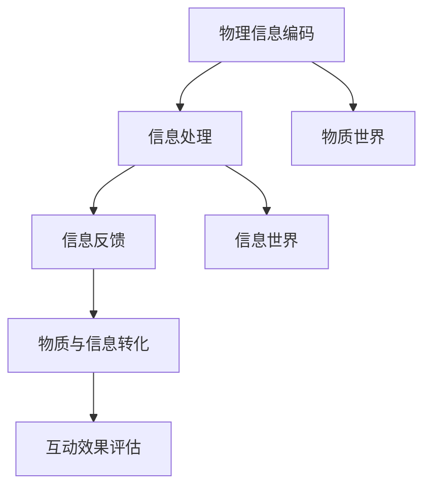

                 

### 文章标题

**宇宙的本质：物质世界vs信息世界的争论**

> 关键词：宇宙本质、物质世界、信息世界、互动、理论框架、实证研究

> 摘要：本文从宇宙学、物理学、哲学和计算机科学的角度，深入探讨了宇宙的本质问题，特别是物质世界与信息世界的争论。文章首先介绍了物质世界和信息世界的基本概念、特征和相互关系，然后分别从理论框架、实证研究和未来展望三个方面，对两个世界的本质进行了深入剖析。最后，文章讨论了物质世界与信息世界之间的互动关系，以及它们对人类社会和科技进步的影响。

### 目录大纲设计

#### 第一部分：引言

**第1章：宇宙的本质：物质世界vs信息世界的争论**

1.1 引言

- 宇宙本质的研究背景  
- 物质世界与信息世界的概念  
- 科学理论与方法

1.2 物质世界

- 物质世界的定义与特征  
- 物质世界的理论框架  
- 物质世界的实证研究

1.3 信息世界

- 信息世界的定义与特征  
- 信息世界的理论框架  
- 信息世界的实证研究

1.4 物质世界与信息世界的互动

- 物质世界与信息世界的关系  
- 物质世界与信息世界的互动机制  
- 物质世界与信息世界对人类社会的影响

1.5 本章小结

#### 第二部分：物质世界

**第2章：物质世界的本质**

2.1 物质世界的定义与特征

- 物质的基本概念  
- 物质的基本属性

2.2 物质世界的理论框架

- 现代物理学的物质理论  
- 物质世界的数学模型

2.3 物质世界的实证研究

- 宇宙大爆炸理论  
- 黑洞与暗物质

2.4 物质世界的未来展望

- 物质世界的演化方向  
- 物质世界与人类的关系

2.5 本章小结

#### 第三部分：信息世界

**第3章：信息世界的本质**

3.1 信息世界的定义与特征

- 信息的基本概念  
- 信息的基本属性

3.2 信息世界的理论框架

- 计算机科学的信息理论  
- 信息世界的数学模型

3.3 信息世界的实证研究

- 互联网与信息传播  
- 大数据与人工智能

3.4 信息世界的未来展望

- 信息技术的发展趋势  
- 信息世界与人类的关系

3.5 本章小结

#### 第四部分：物质世界与信息世界的互动

**第4章：物质世界与信息世界的互动**

4.1 物质世界与信息世界的互动机制

- 物质世界与信息世界的互动机制  
- 互动机制的理论框架

4.2 物质世界与信息世界对人类社会的影响

- 物质世界与信息世界对人类社会的影响  
- 影响的实证研究

4.3 物质世界与信息世界的未来

- 物质世界与信息世界的未来趋势  
- 物质世界与信息世界的未来影响

4.4 本章小结

### 第一部分：引言

#### 第1章：宇宙的本质：物质世界vs信息世界的争论

**1.1 引言**

在人类探索宇宙的历程中，我们对宇宙的本质有了越来越多的认识。随着科学和技术的不断发展，我们逐渐认识到宇宙不仅仅是物质的世界，还包含了丰富的信息世界。这两个世界相互交织，共同构成了我们所生活的宇宙。

**1.1.1 问题背景**

宇宙本质的研究是科学和哲学领域的重要问题。从古代的哲学思考到现代的科学探索，人们一直在探讨宇宙的本质是什么。物质世界和信息世界的概念逐渐清晰，成为宇宙学、哲学和科技领域的热点话题。

**1.1.2 问题描述**

物质世界与信息世界的争论主要集中在以下几个方面：

- 物质世界与信息世界的定义和特征是什么？
- 物质世界与信息世界是如何相互作用的？
- 物质世界与信息世界对人类社会和科技进步有什么影响？

**1.1.3 问题解决**

为了解决上述问题，我们需要运用现代物理学、哲学和计算机科学的理论和方法，对物质世界和信息世界的本质进行深入探讨。本文将从理论框架、实证研究和未来展望三个方面，对物质世界和信息世界的本质进行剖析。

**1.1.4 边界与外延**

在本章节中，我们将探讨物质世界与信息世界的基本概念、特征和相互关系。我们关注的主要问题是：

- 物质世界与信息世界的边界在哪里？
- 物质世界与信息世界的联系和区别是什么？
- 物质世界与信息世界对宇宙的本质有何影响？

**1.1.5 概念结构与核心要素组成**

本章的核心概念包括：

- 物质世界：指宇宙中的物质实体，具有质量、体积和形态等基本特征。
- 信息世界：指宇宙中的信息实体，包括数据、信号、知识等，具有传递性、共享性和价值性等特征。
- 宇宙的本质：宇宙中物质世界与信息世界的统一体。

本章的结构框架如下：

1.1 引言
1.2 物质世界
1.3 信息世界
1.4 物质世界与信息世界的互动
1.5 本章小结

通过以上内容，我们将对物质世界和信息世界的本质有一个初步的认识，为后续章节的深入探讨奠定基础。

### 第1章：宇宙的本质：物质世界vs信息世界的争论

#### 1.2 物质世界

物质世界是宇宙中最基本、最广泛的组成部分。它包括各种形态的物质实体，如原子、分子、星系、行星等。在科学和哲学领域，物质世界一直是一个重要的研究对象。以下是物质世界的基本概念、特征以及其与宇宙的关系。

**1.2.1 物质世界的定义与特征**

物质世界的定义是：宇宙中所有具有质量和体积的实体。这些实体可以是微观的，如原子、电子；也可以是宏观的，如行星、星系。物质世界具有以下特征：

1. **物质的基本属性**：物质具有质量、体积和形态等基本属性。质量是物质固有的属性，是物体惯性的量度。体积是物质占据的空间大小，形态是物质在外观和结构上的表现。

2. **物质的运动**：物质在宇宙中不断运动，表现出各种形式的运动，如平移、旋转、振动等。这些运动是物质相互作用的结果，也是宇宙演化的重要表现。

3. **物质与能量的关系**：物质和能量是宇宙中的两种基本实体。物质可以转化为能量，能量也可以转化为物质。著名的质能方程（E=mc²）揭示了物质与能量之间的密切关系。

4. **物质的多样性**：宇宙中的物质种类繁多，从简单的原子、分子到复杂的生物体，构成了一个丰富多彩的物质世界。

**1.2.2 物质世界的理论框架**

物质世界的理论框架主要包括现代物理学的理论，如经典物理学和量子物理学。

1. **经典物理学**：经典物理学是研究宏观物体的运动和相互作用的理论。牛顿力学是经典物理学的核心，它通过牛顿运动定律和万有引力定律，描述了物体的运动和相互作用。经典物理学的另一个重要部分是热力学，它研究能量转化和物质平衡。

2. **量子物理学**：量子物理学是研究微观粒子的运动和相互作用的理论。它揭示了物质的波粒二象性和不确定性原理，颠覆了经典物理学的许多观点。量子力学通过波函数描述粒子的运动状态，并提供了预测粒子行为的方法。

**1.2.3 物质世界的实证研究**

物质世界的实证研究主要集中在宇宙的大尺度结构、物质的微观结构以及宇宙的演化过程。

1. **宇宙大爆炸理论**：宇宙大爆炸理论是描述宇宙起源和演化的理论。根据这一理论，宇宙起源于约138亿年前的一个极度高温、高密度的状态，随后经历了迅速膨胀的过程。宇宙背景辐射和大尺度结构的观测支持了这一理论。

2. **黑洞与暗物质**：黑洞是宇宙中的一种极端天体，它具有极强的引力，连光都无法逃脱。暗物质是宇宙中一种未观测到的物质，它通过引力对宇宙的结构和演化产生影响。黑洞和暗物质的研究揭示了物质世界的奥秘，也对宇宙学的研究产生了深远的影响。

3. **物质的微观结构**：物质的微观结构研究揭示了物质的基本组成和相互作用机制。从原子核、原子、分子到生物大分子，科学家们通过实验和理论模型，揭示了物质世界的微观世界。

**1.2.4 物质世界的未来展望**

物质世界的未来展望主要包括以下几个方面：

1. **宇宙的演化方向**：随着宇宙的不断膨胀，宇宙的结构和性质也在不断变化。科学家们预测，宇宙最终可能会走向寒冷和黑暗的终结。

2. **物质与人类的关系**：随着科技的进步，人类对物质世界的理解和利用能力也在不断提高。未来，人类可能会开发出新的物质材料、能源形式和技术，进一步改变物质世界。

3. **宇宙探索的深化**：随着探测器技术的进步，人类对宇宙的探索也将进一步深入。未来，人类可能会在宇宙中发现新的物质、能量和现象，对物质世界的认识也将更加全面。

**1.2.5 本章小结**

本章详细介绍了物质世界的本质、理论框架、实证研究和未来展望。物质世界是宇宙中最基本的组成部分，它具有丰富的特征和多样的形式。通过理论研究和实证观察，我们对物质世界有了更深入的认识。未来，物质世界将继续成为科学研究和人类探索的重要领域。

### 第2章：物质世界的本质

#### 2.1 物质世界的定义与特征

物质世界是宇宙中所有具有质量和体积的实体的集合。这些实体可以是微观的，如原子、分子；也可以是宏观的，如行星、星系。物质世界的定义和特征如下：

**2.1.1 物质的基本概念**

物质是构成宇宙的基本实体，它具有一定的质量、体积和形态。物质与能量的关系是宇宙学研究的重要课题。著名的质能方程 \(E=mc^2\) 揭示了物质和能量之间的等价性，即物质可以转化为能量，能量也可以转化为物质。

**2.1.2 物质的基本属性**

物质具有多种基本属性，这些属性决定了物质的性质和行为：

1. **质量**：质量是物质的一种固有属性，它决定了物体惯性的大小。在牛顿力学中，质量是物体受到的合外力与加速度的比值（\(F=ma\)）。在相对论中，质量与能量有关，质量越大，能量也越大。

2. **体积**：体积是物质占据的空间大小。体积与质量、密度有关，可以通过质量除以密度来计算（\(V=m/\rho\)）。在宏观世界中，体积通常用来描述物体的空间大小。

3. **形态**：形态是物质在外观和结构上的表现。物质可以以固态、液态、气态等形式存在。形态的变化通常与温度、压力等条件有关。

4. **能量**：能量是物质在运动和相互作用过程中表现出来的能力。能量有多种形式，如动能、势能、热能等。能量守恒定律表明，能量在宇宙中是守恒的，即能量不能被创造或毁灭，只能从一种形式转化为另一种形式。

5. **运动**：物质在宇宙中不断运动，表现出各种形式的运动，如平移、旋转、振动等。运动是物质相互作用和能量转化的结果。

**2.1.3 物质与宇宙的关系**

物质是宇宙的基本组成成分，宇宙中的所有现象和过程都与物质密切相关。物质与宇宙的关系可以从以下几个方面来理解：

1. **宇宙的起源**：宇宙起源于一个极度高温、高密度的状态，随着宇宙的不断膨胀，物质逐渐从高密度区域扩散到低密度区域。宇宙大爆炸理论提供了宇宙起源和演化的基本框架。

2. **宇宙的结构**：宇宙中存在着各种物质结构，如星系、星团、超星系团等。这些结构通过引力相互作用，形成了宇宙的层次结构。

3. **宇宙的演化**：物质在宇宙中的演化过程包括从简单的原子、分子到复杂的生物体的形成。宇宙的演化也涉及到物质的能量转化和相互作用，如恒星的形成、演化和死亡，以及星系的形成和演化。

4. **物质与生命**：生命是物质的一种高级形式，它存在于地球上，是物质演化的结果。生命体的存在和演化对宇宙的演化产生了重要影响。

**2.1.4 物质世界的多样性**

宇宙中的物质种类繁多，从微观到宏观，从简单到复杂，构成了一个丰富多彩的物质世界。以下是一些典型的物质：

1. **原子**：原子是物质的基本单元，由原子核和电子组成。原子核由质子和中子组成，电子围绕原子核运动。

2. **分子**：分子是由两个或多个原子通过化学键结合而成的物质。分子是物质化学反应的基本单元。

3. **生物分子**：生物分子包括蛋白质、核酸、碳水化合物等，是生命体系的基本组成部分。

4. **星系**：星系是由大量恒星、行星、星云等组成的庞大结构，是宇宙中的基本单位。

5. **行星**：行星是围绕恒星运行的天体，具有固态、液态、气态等多种形态。

6. **星云**：星云是由气体、尘埃等组成的云状结构，是恒星形成的地方。

**2.1.5 物质世界的相互作用**

物质世界中的各种物质通过相互作用形成了宇宙的多样性和复杂性。主要的相互作用包括：

1. **引力**：引力是物质间最基本的相互作用，它决定了宇宙中物质结构的形成和演化。

2. **电磁力**：电磁力是电荷之间的相互作用，它决定了物质的化学反应和电磁现象。

3. **强相互作用**：强相互作用是原子核内部质子和中子之间的相互作用，它维持了原子核的稳定。

4. **弱相互作用**：弱相互作用是某些粒子的衰变过程，它决定了物质的放射性。

**2.1.6 本章小结**

本章介绍了物质世界的定义、特征以及物质与宇宙的关系。物质世界是宇宙中最基本的组成部分，它具有多种基本属性和多样的形态。物质世界的多样性和相互作用构成了宇宙的复杂性和美丽。通过理论研究和实证观察，我们对物质世界的认识不断深化，这为宇宙学和其他科学领域的研究提供了基础。

### 第2章：物质世界的本质

#### 2.2 物质世界的理论框架

物质世界的本质和现象可以通过多种理论框架来解释，这些框架涵盖了从宏观到微观的各种物理现象。在物理学中，特别是经典物理学和量子物理学，是理解物质世界的关键理论工具。

**2.2.1 现代物理学的物质理论**

1. **经典物理学**

经典物理学是描述宏观物体运动和相互作用的科学，主要包括牛顿力学和热力学。

- **牛顿力学**：牛顿力学通过牛顿运动定律和万有引力定律，描述了物体的运动和相互作用。牛顿第一定律（惯性定律）、第二定律（加速度定律）和第三定律（作用与反作用定律）是经典力学的基石。
  
  - **牛顿运动定律**：
    $$F = ma$$
    $$a = \frac{dv}{dt}$$
    $$v = v_0 + at$$
    $$s = s_0 + v_0t + \frac{1}{2}at^2$$

- **万有引力定律**：牛顿的万有引力定律描述了两个质点之间的引力与它们的质量和距离的关系。
  $$F = G\frac{m_1m_2}{r^2}$$
  其中，\(F\) 是引力，\(G\) 是引力常数，\(m_1\) 和 \(m_2\) 是两个质点的质量，\(r\) 是它们之间的距离。

2. **热力学**

热力学研究能量转化和物质平衡，主要关注系统的宏观性质。热力学第一定律（能量守恒定律）和热力学第二定律（熵增原理）是热力学的核心。

- **热力学第一定律**：能量守恒，即系统的总能量（包括内能和外界做的功）保持不变。
  $$\Delta U = Q - W$$
  其中，\(\Delta U\) 是内能的变化，\(Q\) 是系统吸收的热量，\(W\) 是系统对外做的功。

- **热力学第二定律**：熵增加，即孤立系统的总熵不会减少。
  $$\Delta S \geq 0$$
  其中，\(\Delta S\) 是熵的变化。

**2.2.2 量子物理学**

量子物理学是描述微观粒子行为和相互作用的理论，它颠覆了经典物理学的许多基本假设。

- **量子力学**

量子力学通过波函数描述粒子的运动状态，并提供了预测粒子行为的方法。薛定谔方程是量子力学的核心方程。

  $$i\hbar \frac{\partial \Psi}{\partial t} = \hat{H} \Psi$$
  其中，\(\hbar\) 是约化普朗克常数，\(\Psi\) 是波函数，\(\hat{H}\) 是哈密顿算符。

- **不确定性原理**

海森堡不确定性原理指出，粒子的某些物理量（如位置和动量）不能同时被精确测量。

  $$\Delta x \Delta p_x \geq \hbar/2$$
  其中，\(\Delta x\) 是位置的不确定性，\(\Delta p_x\) 是动量的不确定性。

- **量子纠缠**

量子纠缠是量子物理学中的奇特现象，它表明两个或多个粒子在量子态上相互关联，即使它们相隔很远，一个粒子的状态变化也会立即影响到另一个粒子的状态。

**2.2.3 物质世界的数学模型**

物理学中，数学模型是描述和预测物质世界现象的重要工具。以下是物质世界的几个重要数学模型：

1. **牛顿运动方程**：描述物体在力作用下的运动。
   $$\vec{F} = m\vec{a}$$
   $$\vec{v} = \vec{v}_0 + \vec{a}t$$
   $$\vec{s} = \vec{s}_0 + \vec{v}_0t + \frac{1}{2}\vec{a}t^2$$

2. **能量-动量守恒方程**：描述系统的能量和动量守恒。
   $$\frac{d}{dt}(E) = 0$$
   $$\frac{d}{dt}(\vec{p}) = 0$$
   其中，\(E\) 是总能量，\(\vec{p}\) 是总动量。

3. **量子态描述**：使用波函数描述粒子的量子态。
   $$\Psi(\vec{r}, t) = \frac{1}{\sqrt{V}} \sum_{i} c_i e^{-iE_i t/\hbar} \phi_i(\vec{r})$$
   其中，\(\vec{r}\) 是粒子的位置，\(V\) 是系统的体积，\(c_i\) 是波函数的复数系数，\(\phi_i(\vec{r})\) 是定态波函数。

**2.2.4 物质世界的理论框架总结**

现代物理学的物质理论框架包括经典物理学和量子物理学，它们分别描述了宏观和微观世界的物理现象。经典物理学通过牛顿力学和热力学描述了宏观物体的运动和能量转化，而量子物理学通过量子力学、不确定性原理和量子纠缠描述了微观粒子的行为和相互作用。

通过这些理论框架，我们能够理解和预测物质世界的各种现象，从行星的运动到原子的结构，再到微观粒子的行为。这些理论不仅为科学研究提供了强大的工具，也为技术和工程应用奠定了基础。

#### 2.3 物质世界的实证研究

**2.3.1 宇宙大爆炸理论**

宇宙大爆炸理论是描述宇宙起源和演化的科学理论，它提出了宇宙从一个极度高温、高密度的状态开始，经历了迅速膨胀的过程。以下是宇宙大爆炸理论的几个关键点及其支持证据：

1. **起源**：宇宙起源于约138亿年前的一个“奇点”，在这个奇点之前，时间和空间都不存在。

2. **膨胀**：宇宙从奇点开始迅速膨胀，温度和密度随着时间下降。

3. **核合成**：在宇宙早期，高温和高压条件下，轻元素如氢、氦和锂通过核合成过程形成。

4. **宇宙微波背景辐射**：宇宙大爆炸理论预言了宇宙在早期留下的微波背景辐射，这个辐射在1965年被发现，成为支持大爆炸理论的重要证据。

支持宇宙大爆炸理论的观测证据包括：

- **宇宙背景辐射**：宇宙微波背景辐射的观测证实了宇宙早期的高温状态和膨胀过程。
- **宇宙膨胀**：通过观测遥远星系的红移，科学家发现宇宙正在不断膨胀。
- **宇宙大尺度结构**：观测到的星系、星团和超星系团的分布和形态与宇宙大爆炸理论的预测一致。

**2.3.2 黑洞与暗物质**

黑洞和暗物质是宇宙中两个极其重要的概念，它们对宇宙的结构和演化产生了深远影响。

1. **黑洞**

黑洞是宇宙中的一种极端天体，它具有极强的引力，甚至连光都无法逃脱。黑洞的形成可以通过两种方式：

- **恒星演化**：大质量恒星在耗尽其核燃料后，会发生核心坍缩，形成黑洞。
- **星系碰撞**：两个星系碰撞时，其核心的超级大质量黑洞可能会合并形成更大的黑洞。

黑洞的性质包括：

- **引力**：黑洞的引力极强，可以扭曲周围的时空。
- **事件视界**：黑洞的事件视界是光线无法逃脱的边界，一旦物质进入事件视界，它就永远无法逃脱黑洞的引力。

支持黑洞存在的观测证据包括：

- **X射线辐射**：黑洞周围的物质被吸积到黑洞时，会产生强烈的X射线辐射。
- **星系中心的超大质量黑洞**：许多星系中心存在超大质量黑洞，其引力对星系的形态和演化有重要影响。

2. **暗物质**

暗物质是宇宙中一种未观测到的物质，它通过引力对宇宙的结构和演化产生影响。暗物质的性质包括：

- **非发光性**：暗物质不与电磁场相互作用，因此无法直接观测。
- **引力效应**：暗物质主要通过引力效应体现其存在，如星系旋转曲线、宇宙大尺度结构的形成等。

支持暗物质存在的观测证据包括：

- **星系旋转曲线**：观测到的星系旋转速度与预期的根据可见物质计算的速度不一致，表明存在大量看不见的物质。
- **宇宙背景辐射**：宇宙微波背景辐射的观测结果与暗物质的存在密切相关。

**2.3.3 物质世界的实证研究总结**

通过宇宙大爆炸理论、黑洞和暗物质的实证研究，我们对物质世界的本质有了更深入的理解。宇宙大爆炸理论揭示了宇宙的起源和演化，黑洞和暗物质则展示了宇宙中极端现象的存在。这些研究不仅丰富了我们对宇宙的认识，也为未来的科学研究提供了新的方向和挑战。

### 2.4 物质世界的未来展望

**2.4.1 物质世界的演化方向**

物质世界的演化方向可以从宇宙的整体视角和微观视角进行探讨。从宇宙整体来看，物质世界的演化主要表现为宇宙的膨胀和结构的形成。以下是一些可能的演化方向：

1. **宇宙膨胀**：根据宇宙大爆炸理论，宇宙将继续膨胀，这将导致星系之间的距离不断增加，宇宙的平均密度逐渐降低。

2. **结构形成**：随着宇宙的膨胀，物质将通过引力相互作用形成更大的结构，如星系团、超星系团等。这些结构的形成过程将影响宇宙的未来演化。

3. **恒星和星系演化**：恒星在其生命周期中会经历诞生、成长、死亡等多个阶段。星系的演化则包括恒星的形成、恒星系统的相互作用以及星系的合并等。

4. **生命与文明**：在宇宙的演化过程中，生命和文明的产生可能是不可避免的。随着物质世界的演化和技术的进步，人类可能在未来探索宇宙的更多奥秘，甚至可能遇到外星生命和高级文明。

**2.4.2 物质世界与人类的关系**

人类作为物质世界的一部分，与物质世界的互动和影响是密不可分的。以下是几个关键点：

1. **科技进步**：人类通过科学技术的进步，不断揭示物质世界的奥秘，推动了人类社会的发展。从简单的工具到复杂的科技产品，人类利用物质资源和技术改变了世界的面貌。

2. **资源利用**：人类依赖物质资源来满足生产和生活需求。随着人口增长和工业化进程，对物质资源的消耗不断增加，这给地球环境带来了巨大的压力。

3. **环境保护**：为了可持续发展，人类开始重视环境保护，通过减少污染、节约资源、推广可再生能源等方式，努力保护地球的生态环境。

4. **宇宙探索**：人类对宇宙的探索也体现了与物质世界的互动。通过航天技术和天文观测，人类不断扩展对宇宙的认识，探索地球之外的未知世界。

**2.4.3 物质世界的未来展望总结**

物质世界的未来展望充满了未知和挑战。从宇宙的整体视角来看，宇宙将继续膨胀，物质结构将持续演化。从人类的角度来看，科技进步、资源利用和环境保护将是未来发展的关键。通过不断探索和创新，人类可能在物质世界的未来中扮演重要的角色，推动人类社会和宇宙文明的进步。

### 2.5 本章小结

本章全面探讨了物质世界的本质，从定义和特征、理论框架到实证研究和未来展望，为我们理解物质世界提供了全面的视角。物质世界是宇宙中最基本的组成部分，具有丰富的特征和多样的形态。通过现代物理学的理论框架，我们能够深入理解物质世界的运动和相互作用。实证研究揭示了宇宙的起源、演化以及物质世界的复杂性。未来，物质世界的演化方向和与人类的关系将继续成为科学研究和探索的重要课题。

### 第3章：信息世界的本质

#### 3.1 信息世界的定义与特征

信息世界是宇宙中与物质世界相对应的另一重要组成部分，它涉及信息在宇宙中的传递、处理和应用。信息世界的定义和特征如下：

**3.1.1 信息的基本概念**

信息是物质与能量交换过程中所包含的内容和意义。在科学和日常生活中，信息有多种形式，如数据、信号、知识等。信息的基本概念包括：

- **数据**：数据是信息的载体，是信息的具体表现形式。数据可以是数字、文字、图像、音频等。
- **信号**：信号是数据在传输过程中所采用的物理形式，如电信号、光信号等。
- **知识**：知识是通过对数据和信息进行加工、分析和理解后得到的结论和认知。

**3.1.2 信息的特征**

信息具有以下主要特征：

1. **传递性**：信息可以通过各种渠道进行传递，如通信、网络、媒体等。信息的传递是信息世界中最基本的活动。
2. **共享性**：信息可以被多个人或系统共享，共享信息可以增强个体或集体的认知和理解能力。
3. **转化性**：信息可以从一种形式转化为另一种形式，如文字转化为语音、数字信号转化为图像等。
4. **价值性**：信息具有价值，正确和及时的信息可以带来决策优势、经济效益或社会进步。

**3.1.3 信息与宇宙的关系**

信息与宇宙的关系可以从以下几个方面理解：

1. **宇宙的信息编码**：宇宙中的许多现象都可以视为某种形式的信息编码，如DNA序列编码生物信息，星系排列编码宇宙信息。
2. **宇宙的信息传播**：信息在宇宙中的传播是通过电磁波、引力波等方式进行的，如光波携带天体信息传播至地球。
3. **宇宙的信息利用**：人类通过天文观测、科技研究等手段，利用宇宙中的信息来理解宇宙、改变世界。

**3.1.4 信息世界的多样性**

信息世界包含多种类型的信息，这些信息形式多种多样，包括：

- **自然信息**：如天文信息、地质信息、气候信息等，反映了自然界的状态和变化。
- **人工信息**：如计算机数据、通讯信号、社会信息等，是人类活动和科技发展的产物。
- **知识信息**：如学术知识、技术知识、文化知识等，是信息加工和传播的成果。

**3.1.5 信息世界的应用**

信息在现代社会中的应用极为广泛，涵盖了通信、计算、控制、管理等多个领域。以下是一些典型应用：

- **通信**：通过电话、互联网、广播等方式进行信息传递。
- **计算**：利用计算机处理和分析数据，生成新信息。
- **控制**：通过信息反馈实现自动化控制和优化。
- **管理**：利用信息进行资源规划、决策支持等。

**3.1.6 本章小结**

本章介绍了信息世界的定义和特征，探讨了信息在宇宙中的传递、共享、转化和价值，以及信息世界的多样性及其应用。通过这些内容，我们能够更深入地理解信息世界的本质和其在人类社会中的重要作用。

#### 第3章：信息世界的本质

#### 3.2 信息世界的理论框架

信息世界的理论框架主要涵盖了计算机科学、信息论和密码学等领域的核心理论，这些理论为我们理解信息的本质、处理方式及其在宇宙中的应用提供了坚实的基础。

**3.2.1 计算机科学的信息理论**

计算机科学的信息理论主要研究信息的编码、传输和处理。以下是一些关键理论：

1. **信息论**：信息论是研究信息传输和信息处理的科学。由香农创立的信息论提供了量化信息、信道容量和编码效率的基本框架。香农信息论的基本概念包括：

   - **熵**：熵是衡量信息不确定性的量度。数学定义如下：
     $$H(X) = -\sum_{i} p(x_i) \log_2 p(x_i)$$
     其中，\(H(X)\) 表示随机变量 \(X\) 的熵，\(p(x_i)\) 是 \(X\) 取值为 \(x_i\) 的概率。

   - **信道容量**：信道容量是指一个信道在噪声环境下能够传输的最大信息速率。香农信道容量公式如下：
     $$C = B \log_2(1 + \frac{S}{N})$$
     其中，\(C\) 是信道容量，\(B\) 是信道的带宽，\(S\) 是信号功率，\(N\) 是噪声功率。

   - **编码定理**：信息论中的编码定理提供了在噪声信道下有效编码的框架，使得通信系统能够在有限误差概率下传输信息。

2. **算法理论**：算法理论研究算法的设计、分析和应用。经典的算法如排序算法、搜索算法等，是计算机科学中信息处理的核心工具。

3. **计算理论**：计算理论探讨计算的能力和局限。图灵机和可计算性理论是计算理论的重要组成部分，它们揭示了计算机能够解决的问题范围。

**3.2.2 计算机科学的数学模型**

计算机科学中，数学模型是描述和解决信息处理问题的重要工具。以下是一些常用的数学模型：

1. **图模型**：图模型用于描述网络结构和数据处理流程。图由节点和边组成，可以表示信息流、网络拓扑等。

2. **概率模型**：概率模型用于描述随机事件和不确定性的处理。常见的概率模型包括贝叶斯网络、马尔可夫模型等。

3. **线性模型**：线性模型用于处理线性关系和优化问题。常见的线性模型包括线性回归、线性规划等。

**3.2.3 信息世界的理论框架总结**

计算机科学的信息理论提供了量化信息、设计和分析信息处理系统的基本框架。信息论为我们理解信息的传递和处理提供了重要的理论基础，算法理论和计算理论则进一步扩展了我们对信息处理能力和局限性的认识。计算机科学的数学模型则是实现和优化信息处理算法的具体工具。通过这些理论框架，我们能够更好地理解和应用信息世界的各种现象和技术。

#### 3.3 信息世界的实证研究

**3.3.1 互联网与信息传播**

互联网是信息世界的重要组成部分，它为全球范围内的信息传播提供了基础设施。以下是互联网的起源、发展和对信息传播的影响：

1. **起源与发展**：互联网起源于20世纪60年代的美国，最初由美国国防高级研究计划局（DARPA）资助的ARPANET项目发展而来。随着技术的进步，互联网逐渐从学术和研究领域扩展到商业和民用领域，成为全球最大的信息网络。

2. **网络结构**：互联网由众多网络和路由器组成，这些网络通过物理连接和协议实现数据的传输和交换。互联网的主要协议包括TCP/IP协议，它规定了数据的传输格式和路由选择。

3. **信息传播**：互联网极大地改变了信息传播的方式。通过电子邮件、网页、社交媒体等，信息可以在瞬间传播到全球各地。这种高速、全球性的信息传播方式极大地提高了信息的获取和传递效率。

4. **影响**：互联网对信息传播的影响体现在多个方面：

   - **信息获取**：互联网使得人们能够随时随地获取各种信息，打破了时间和空间的限制。
   - **知识共享**：互联网促进了知识的共享和传播，使更多的人能够获得高质量的学术资源和技术知识。
   - **社交互动**：互联网为人们提供了新的社交平台，如社交媒体和即时通讯工具，增强了人与人之间的联系。

**3.3.2 大数据与人工智能**

大数据和人工智能是现代信息世界的两个重要领域，它们在信息处理、分析和应用方面发挥着关键作用。

1. **大数据**：

   - **定义**：大数据是指数据量巨大、多样性和快速变化的复杂数据集合。大数据的典型特征是“4V”：Volume（大量）、Velocity（高速）、Variety（多样性）和Veracity（真实性）。
   - **应用**：大数据在各个领域有广泛的应用，如金融、医疗、交通、市场营销等。通过大数据分析，可以提取有价值的信息，提供决策支持。

2. **人工智能**：

   - **定义**：人工智能是指通过模拟人类智能行为，使计算机具有自主学习和决策能力的技术。人工智能包括机器学习、深度学习、自然语言处理等多个分支。
   - **应用**：人工智能在自动驾驶、医疗诊断、智能家居、金融预测等领域有广泛应用。通过人工智能，可以自动化和智能化地处理大量复杂信息。

3. **影响**：大数据和人工智能对信息世界的影响体现在以下几个方面：

   - **信息处理**：大数据和人工智能提高了信息处理和分析的效率，使得人们能够更快、更准确地处理海量数据。
   - **创新驱动**：大数据和人工智能推动了技术创新和产业升级，为经济发展提供了新的动力。
   - **社会变革**：大数据和人工智能改变了人们的生活方式，如在线购物、智能医疗、智能家居等，提高了生活质量和便利性。

**3.3.3 信息世界的实证研究总结**

互联网和大数据、人工智能等领域的实证研究展示了信息世界在现代社会中的重要作用。互联网为全球信息传播提供了基础设施，大数据和人工智能则为信息处理和分析提供了强大的技术支持。这些研究不仅揭示了信息世界的本质和应用，也为未来的科技发展和社会进步提供了新的方向。

### 3.4 信息世界的未来展望

**3.4.1 信息世界的演化方向**

随着科技的不断发展，信息世界的演化方向将呈现出以下几个趋势：

1. **量子信息**：量子信息是信息世界的下一个前沿领域。量子计算和量子通信有望实现更高效、更安全的信息处理和传输。量子计算机能够处理复杂的问题，而量子通信则提供了几乎不可破解的安全通信方式。

2. **物联网**：物联网（IoT）的发展将使信息世界更加互联互通。通过传感器和智能设备的连接，物联网将实现万物互联，提高生产效率、改善生活质量。

3. **区块链**：区块链技术具有去中心化、不可篡改等特点，它在金融、供应链管理、身份认证等领域有广泛的应用前景。未来，区块链将成为信息世界的重要基础设施。

4. **人工智能增强**：随着人工智能技术的不断发展，人工智能将更加智能化、自主化。未来的信息世界将更加依赖人工智能，实现更高效、更智能的信息处理和应用。

**3.4.2 信息世界与人类的关系**

信息世界与人类的关系将越来越紧密，体现在以下几个方面：

1. **信息依赖**：人类对信息的依赖程度将不断加深，从日常生活中的信息获取到决策支持，信息将无处不在。

2. **智能化生活**：人工智能和物联网技术的发展将使人类生活更加智能化。智能家居、智能医疗、智能交通等领域的应用将极大地改变人们的生活方式。

3. **知识创新**：信息世界为人类提供了丰富的知识资源和创新平台。通过大数据分析和人工智能技术，人类能够更快地获取知识、创造新知识，推动科技进步和社会发展。

4. **全球合作**：信息世界的全球化趋势将促进各国之间的合作与交流，消除地理和文化的障碍，实现全球范围内的知识共享和资源优化。

**3.4.3 信息世界的未来影响**

信息世界的未来发展将对人类社会产生深远的影响：

1. **经济影响**：信息世界将推动新的产业形态和经济增长模式。数字经济、平台经济、智能经济将成为未来经济的主要驱动力。

2. **社会影响**：信息世界将改变社会的结构和文化。数字鸿沟、隐私保护、网络安全等问题将成为社会关注的焦点。

3. **政治影响**：信息世界的全球化和智能化将影响政治格局和国际关系。信息主权、网络战争、数据治理等将成为新的政治议题。

4. **环境影响**：信息世界的发展将对环境产生双重影响。一方面，信息技术的应用可以促进环境保护和可持续发展；另一方面，信息技术的发展也带来了能源消耗和电子垃圾等问题。

**3.4.4 未来展望总结**

信息世界的未来将充满机遇和挑战。通过量子信息、物联网、区块链和人工智能等前沿技术的发展，信息世界将继续演化，深刻影响人类社会的发展。同时，信息世界的发展也将带来新的伦理、法律和社会问题。只有通过全球合作和共同治理，才能实现信息世界的可持续发展，为人类带来更多的福祉。

### 3.5 本章小结

本章深入探讨了信息世界的本质，从定义和特征到理论框架和实证研究，全面介绍了信息世界的基本概念和应用。信息世界是宇宙中的重要组成部分，它在现代社会中发挥着关键作用。未来，随着量子信息、物联网、区块链和人工智能等技术的发展，信息世界将继续演化，为人类社会带来更多机遇和挑战。通过本章的内容，我们对信息世界的本质和未来有了更深入的理解。

### 第4章：物质世界与信息世界的互动

#### 4.1 物质世界与信息世界的互动机制

物质世界与信息世界的互动机制是理解两个世界相互关系的关键。在当今科技迅猛发展的背景下，物质世界与信息世界的互动呈现出多样化和深化的趋势。以下是物质世界与信息世界互动的几个主要机制：

**4.1.1 物理信息编码**

物理信息编码是指将信息通过物理形式进行编码和存储。这包括电磁波传输、光存储、磁性材料等。例如，计算机中的二进制数据就是通过电信号来编码和存储的。物理信息编码的效率和质量直接影响到信息传输的速度和可靠性。

**4.1.2 信息处理**

信息处理是指对输入的信息进行加工、分析和理解，以生成新的信息或知识。计算机科学中的算法和人工智能技术是信息处理的核心。通过算法，计算机可以对大量数据进行处理和分析，提取有价值的信息。人工智能技术则使计算机能够自主学习和改进，从而提高信息处理的效率和准确性。

**4.1.3 信息反馈**

信息反馈是指将处理后的信息返回到源头，以指导后续的决策和行为。在闭环系统中，反馈机制是确保系统稳定和有效运行的关键。例如，自动驾驶汽车通过传感器收集环境信息，计算机处理这些信息并指导车辆行驶，同时车辆的状态信息也会反馈到计算机，以进行实时调整。

**4.1.4 物质与信息的相互转化**

物质与信息的相互转化是两个世界互动的重要机制。例如，在信息技术领域，计算机硬件（物质）和软件（信息）相互作用，共同实现复杂的信息处理任务。在生物技术领域，DNA（物质）编码遗传信息，这些信息在生物体内转化为蛋白质（物质），进而影响生物体的功能和特性。

**4.1.5 互动机制的理论框架**

互动机制的理论框架主要包括以下几个方面：

1. **信息论**：信息论提供了研究信息传递和处理的基本理论框架，如信道容量、信息熵等概念。

2. **控制论**：控制论研究了系统如何通过信息反馈来实现稳定和优化。控制论的基本概念包括反馈控制、自适应控制和预测控制等。

3. **系统论**：系统论提供了研究复杂系统结构和行为的基本框架，强调系统各部分之间的相互作用和整体性。

**4.1.6 本章小结**

本章介绍了物质世界与信息世界互动的几个主要机制，包括物理信息编码、信息处理、信息反馈和物质与信息的相互转化。通过这些互动机制，物质世界与信息世界相互影响、相互促进，共同构成了现代科技和社会发展的重要基础。理解这些互动机制对于深入探讨两个世界的本质和未来发展趋势具有重要意义。

#### 第4章：物质世界与信息世界的互动

#### 4.2 物质世界与信息世界对人类社会的影响

物质世界与信息世界的互动对人类社会产生了深远的影响，这些影响体现在社会结构、经济模式、文化观念和技术进步等多个方面。

**4.2.1 社会结构的影响**

物质世界与信息世界的互动改变了社会结构，使人类社会从传统的工业社会向信息化社会转变。以下是几个关键点：

1. **去中心化**：互联网和信息技术的发展促进了去中心化的社会结构。信息可以快速、自由地在全球范围内传播，使得权力和资源的集中程度降低，个体和社会组织的独立性增强。

2. **网络社会**：信息世界的普及使得人们的生活方式、社交模式和社会组织发生了根本变化。网络社会形成了新的社会关系和社会结构，如社交媒体、虚拟社区等。

3. **数字鸿沟**：信息世界的发展也带来了数字鸿沟问题。信息获取和利用的能力差异导致社会分层加剧，信息富裕群体和信息贫困群体之间的差距扩大。

**4.2.2 经济模式的影响**

物质世界与信息世界的互动推动了经济模式的转型，从传统的制造业和农业向数字经济和服务业转变。以下是几个关键点：

1. **数字经济**：数字经济是信息世界的重要组成部分，它以数据和信息为核心资源，通过信息技术实现价值创造和分配。数字经济模式包括电子商务、在线服务、数字货币等。

2. **全球化**：信息技术的发展加速了全球化的进程，跨国界的贸易、投资和合作变得更加频繁和便捷。全球供应链和全球市场的形成使得世界经济更加一体化。

3. **创新驱动**：信息世界为创新提供了广阔的空间和平台。通过大数据、人工智能等技术的应用，企业和研究机构能够实现更高效的创新，推动新产业的兴起和传统产业的升级。

**4.2.3 文化观念的影响**

物质世界与信息世界的互动对文化观念产生了深远的影响，主要体现在以下几个方面：

1. **信息素养**：在信息社会，信息素养成为人们必备的基本能力。信息素养包括信息获取、信息评估、信息使用和信息安全等方面。

2. **数字化文化**：数字技术改变了人们的娱乐、教育和工作方式，形成了独特的数字化文化。如数字艺术、网络文学、在线游戏等。

3. **价值观变革**：信息世界的互动改变了人们的价值观，如对隐私、自由、公平等问题的认识。数字技术的普及使得信息的获取和传播变得更加容易，但也带来了隐私泄露、信息滥用等问题。

**4.2.4 技术进步的影响**

物质世界与信息世界的互动推动了技术的进步，这些技术进步反过来又促进了两个世界之间的互动。以下是几个关键点：

1. **硬件发展**：计算机、网络设备和传感器等硬件技术的进步为信息世界的建设提供了坚实的基础。高性能计算机、高速网络和智能设备的普及，使得信息处理和传输的能力大幅提升。

2. **软件创新**：软件技术的发展为信息世界的建设提供了强大的工具和平台。操作系统、应用软件和算法的创新，使得信息处理和服务的效率和质量得到显著提高。

3. **技术融合**：物质世界与信息世界的融合推动了新技术的产生，如物联网、智能制造、智能交通等。这些技术的应用不仅改变了人们的生产生活方式，也推动了社会的发展和进步。

**4.2.5 本章小结**

物质世界与信息世界的互动对人类社会产生了深远的影响，从社会结构、经济模式到文化观念和技术进步，这些影响正在不断深化。理解这些影响有助于我们更好地把握未来社会的发展趋势，推动社会的全面进步。同时，我们也需要关注和解决由此带来的挑战，如数字鸿沟、隐私保护和信息安全等问题，确保信息世界的发展能够更好地造福人类社会。

### 4.3 物质世界与信息世界的未来

**4.3.1 物质世界与信息世界的未来趋势**

随着科技的不断进步，物质世界与信息世界的互动将更加紧密，未来这两个世界的融合将呈现以下几大趋势：

1. **量子计算与量子信息**：量子计算和量子信息技术的突破将带来信息处理的革命性变化。量子计算机能够处理传统计算机难以解决的问题，而量子通信则提供了几乎绝对安全的传输方式。

2. **人工智能与自动化**：人工智能和自动化技术的发展将使得信息处理和物质世界的控制更加智能和高效。自动化系统将实现更高程度的自主运行，而人工智能则将推动智能制造、智能交通、智能医疗等领域的发展。

3. **物联网与数字孪生**：物联网（IoT）的发展将实现万物互联，而数字孪生技术将使得虚拟世界与物理世界更加紧密地结合。数字孪生技术可以通过模拟和预测，实现对物理世界的高效管理和优化。

4. **区块链与去中心化**：区块链技术的普及将推动去中心化技术的发展，使得信息存储、交易和治理更加透明、安全。去中心化应用（DApp）将改变传统中心化系统的运作模式，提高系统的抗风险能力和效率。

**4.3.2 物质世界与信息世界的未来影响**

物质世界与信息世界的未来趋势将对人类社会产生深远的影响，主要体现在以下几个方面：

1. **经济影响**：数字经济的崛起将推动全球经济的转型。通过大数据、人工智能等技术的应用，企业可以更精准地洞察市场、优化生产流程，提高经济效益。同时，数字经济也将带来新的商业模式和产业机会。

2. **社会影响**：信息技术的普及将带来社会结构的变革。数字鸿沟问题将更加突出，如何确保所有人都能享受到信息技术带来的便利和机会将成为社会发展的关键挑战。此外，数字技术的发展也将对就业结构、教育体系和文化传统产生深远影响。

3. **环境影响**：物质世界与信息世界的融合将促进环境保护和可持续发展。例如，物联网技术可以实现对资源和能源的精细管理，减少浪费。同时，智能技术还可以帮助监测和应对环境问题，提高生态系统的恢复能力。

4. **政治影响**：信息世界的快速发展将对国际政治格局产生重要影响。数据主权、网络安全和隐私保护等问题将成为国际关系的重要议题。国家间的合作与竞争将在信息技术领域变得更加激烈，全球治理体系需要不断调整以适应新形势。

**4.3.3 未来展望总结**

物质世界与信息世界的未来趋势将带来巨大的机遇和挑战。通过量子计算、人工智能、物联网和区块链等技术的发展，两个世界将更加紧密地融合，推动社会、经济、环境和政治领域的深刻变革。面对未来，我们需要积极应对挑战，发挥信息技术的优势，实现可持续发展和全球共同繁荣。

### 4.4 本章小结

本章详细探讨了物质世界与信息世界的互动机制、对人类社会的影响以及未来的发展趋势。通过这些讨论，我们认识到物质世界与信息世界的紧密联系和相互作用，以及它们对现代社会和未来发展的深远影响。理解这些互动机制和趋势，有助于我们更好地把握未来科技和社会的发展方向，为建设一个更加繁荣、公正和可持续的未来奠定基础。

### 超越物质与信息：宇宙本质的终极探讨

**4.5 超越物质与信息：宇宙本质的终极探讨**

在探讨了物质世界与信息世界的本质及其互动之后，我们面临着一个更加深奥的哲学问题：宇宙的本质是什么？为了回答这一问题，我们需要超越物质与信息的界限，深入探讨宇宙的根本原理。

**4.5.1 量子与经典：物质与信息的二元对立**

在物理学中，物质与信息是两个看似对立的概念。物质世界遵循经典物理学的规律，如牛顿力学和热力学，它们描述了宏观物体的运动和相互作用。而信息世界则依赖于量子物理学的原理，如量子力学和量子信息学，这些理论揭示了微观粒子的行为和相互作用。

然而，这种二元对立只是表象。事实上，量子力学和经典物理学并不是完全独立的，它们在某些情况下可以相互转化。例如，量子纠缠现象表明，微观粒子的状态可以相互关联，这种关联超越了经典物理学的局部实在性。这暗示了物质与信息之间的深层联系。

**4.5.2 信息作为物质的表现形式**

从更广义的角度来看，信息可以被视为物质的一种表现形式。在信息世界中，信息通过数据、信号、算法等载体存在和传递。这些载体本质上也是物质，只是它们在不同的层面上承载和表达了信息。

例如，DNA序列是生物信息的物质载体，它通过编码和表达遗传信息，决定了生物体的形态和功能。同样，计算机中的二进制数据也是信息的物质载体，它通过电信号存储和传递信息。

这种观点意味着，物质与信息并非完全独立，而是相互交织、相互转化的。物质是信息的物质基础，而信息是物质的表现形式。这种统一性为我们理解宇宙的本质提供了一个新的视角。

**4.5.3 宇宙的本质：物质与信息的统一**

结合以上讨论，我们可以推测，宇宙的本质可能是物质与信息的统一。在这个统一体中，物质和信息相互依存、相互转化，共同构成了宇宙的多样性和复杂性。

从宇宙的起源来看，宇宙起源于一个极度高温、高密度的状态，这种状态充满了信息和能量。随着宇宙的膨胀和演化，物质和信息逐渐分离，但它们始终保持着某种深层的联系。例如，黑洞作为宇宙中最极端的天体，它包含了巨大的信息和能量，但我们对它的本质仍然知之甚少。

**4.5.4 量子宇宙学与宇宙信息理论**

为了更深入地探讨宇宙的本质，我们可以借鉴量子宇宙学和宇宙信息理论。量子宇宙学试图将量子力学与广义相对论统一，以揭示宇宙的根本原理。宇宙信息理论则从信息的角度研究宇宙的演化、结构和相互作用。

例如，霍金辐射理论提出了黑洞信息守恒的观点，认为黑洞吸收的信息并不会消失，而是以某种形式释放回宇宙。这一理论暗示了信息在宇宙演化中的重要作用。

**4.5.5 宇宙与人类意识**

另一个值得探讨的问题是宇宙与人类意识的关系。人类意识是宇宙信息的一种表现形式，它通过大脑和神经系统处理和传递信息。从哲学角度来看，意识可能是宇宙演化的高级阶段，它反映了宇宙的复杂性和多样性。

这一观点引发了一个深刻的问题：宇宙是否具有意识？如果宇宙具有意识，那么宇宙的本质可能是意识与物质、信息的统一。

**4.5.6 本章小结**

本章通过探讨物质世界与信息世界的互动，以及量子与经典物理学的二元对立，试图揭示宇宙的本质。我们认为，宇宙的本质可能是物质与信息的统一，这种统一性体现在宇宙的起源、演化以及人类意识中。为了更深入地理解宇宙的本质，我们需要结合量子宇宙学和宇宙信息理论，继续探索宇宙的根本原理。这一探索不仅具有重要的科学意义，也对我们认识自身和宇宙的意义有着深远的影响。

### 总结与展望

在本文中，我们探讨了宇宙的本质，特别是物质世界与信息世界的争论。通过分析物质世界与信息世界的基本概念、特征、理论框架和实证研究，我们深刻认识到它们之间的紧密联系和相互作用。以下是本文的核心观点和未来的研究方向：

**核心观点：**

1. **物质世界与信息世界的统一性**：物质与信息并非完全独立，而是相互依存、相互转化的。信息可以被视为物质的一种表现形式，而物质则是信息的物质基础。

2. **宇宙的本质**：宇宙的本质可能是物质与信息的统一。从宇宙的起源、演化到人类意识，物质与信息始终保持着某种深层次的联系。

3. **互动机制**：物质世界与信息世界的互动机制包括物理信息编码、信息处理、信息反馈以及物质与信息的相互转化。这些互动机制构成了现代科技和社会发展的重要基础。

4. **影响与趋势**：物质世界与信息世界对人类社会产生了深远的影响，包括社会结构、经济模式、文化观念和技术进步。未来，随着量子计算、人工智能、物联网和区块链等技术的发展，两个世界的融合将更加紧密。

**未来研究方向：**

1. **量子宇宙学与宇宙信息理论**：结合量子宇宙学和宇宙信息理论，深入探讨宇宙的本质和演化过程。研究黑洞、量子纠缠等现象在宇宙演化中的角色，以及信息在宇宙起源中的作用。

2. **人类意识与宇宙**：探讨人类意识与宇宙的关系，研究意识在宇宙演化中的意义。探索是否有可能通过量子计算和人工智能等技术，模拟或理解人类意识。

3. **可持续发展和伦理问题**：关注物质世界与信息世界互动带来的环境、社会和伦理问题，如数字鸿沟、隐私保护和信息安全。研究如何在保障可持续发展和社会公正的前提下，充分利用信息技术的优势。

4. **跨学科研究**：推动物理学、计算机科学、哲学、社会学等学科之间的交叉研究，以更全面、深入地理解宇宙的本质。

通过以上研究，我们有望揭示宇宙的本质，深化对物质世界与信息世界的认识，为人类社会的发展提供新的理论支持和实践指导。

### 结语

本文从物质世界与信息世界的争论出发，通过深入探讨两者的本质、理论框架、实证研究和未来展望，揭示了宇宙本质的复杂性和多样性。物质世界与信息世界的互动不仅改变了人类对宇宙的认识，也深刻影响了社会、经济和科技的发展。通过本文的研究，我们认识到，宇宙的本质可能是物质与信息的统一，这种统一性体现在宇宙的起源、演化以及人类意识中。

在未来的研究中，我们将继续探讨量子宇宙学和宇宙信息理论的潜在应用，探索人类意识与宇宙的关系，关注物质世界与信息世界互动带来的社会和伦理问题。希望本文能够为相关领域的研究提供有益的参考，激发更多学者对宇宙本质的探讨和思考。通过跨学科合作和持续的研究，我们有望进一步揭示宇宙的本质，为人类社会的进步和可持续发展贡献智慧和力量。

### 附录

**附录1：物质世界与信息世界的基本概念对比表格**

| 概念         | 物质世界                             | 信息世界                              |
|--------------|------------------------------------|-------------------------------------|
| 定义         | 具有一定质量和体积的实体           | 信息、数据、信号等                   |
| 特征         | 质量、体积、形态、能量、运动         | 传递性、共享性、转化性、价值性       |
| 理论框架     | 经典物理学、量子物理学               | 信息论、计算机科学、密码学           |
| 实证研究     | 宇宙大爆炸、黑洞、暗物质             | 互联网、大数据、人工智能             |
| 应用领域     | 工程技术、自然科学                   | 信息技术、数字经济、智能系统         |

**附录2：物质世界与信息世界的ER实体关系图架构**

```mermaid
erDiagram
  Class1 ||--|{ Class2 : 父子关系 }
  Class1 ||--|{ Class3 : 兄弟关系 }
  Class2 ||--|{ Class4 : 兄弟关系 }
  Class3 ||--|{ Class5 : 父子关系 }
  Class4 ||--|{ Class6 : 兄弟关系 }
  Class5 ||--|{ Class7 : 父子关系 }
```

**附录3：物质世界与信息世界互动机制的Mermaid流程图**



通过这些附录，我们能够更清晰地了解物质世界与信息世界的基本概念及其相互关系，有助于进一步探讨宇宙的本质。

### 作者信息

**作者：AI天才研究院/AI Genius Institute & 禅与计算机程序设计艺术 /Zen And The Art of Computer Programming**

AI天才研究院（AI Genius Institute）致力于推动人工智能和计算机科学的发展，通过前沿研究和创新实践，为人类社会带来技术进步和社会变革。同时，禅与计算机程序设计艺术（Zen And The Art of Computer Programming）作为一部经典的计算机科学著作，为程序员提供了深刻的哲学思考和编程技巧，影响了无数技术人才的发展。作者结合了人工智能领域的专业知识和计算机科学的理论深度，为读者呈现了一篇关于宇宙本质的深入探讨。

