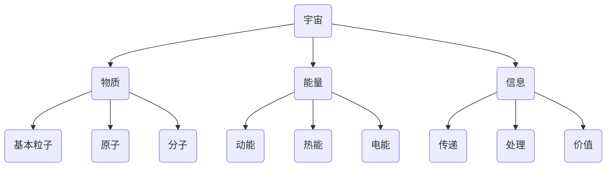
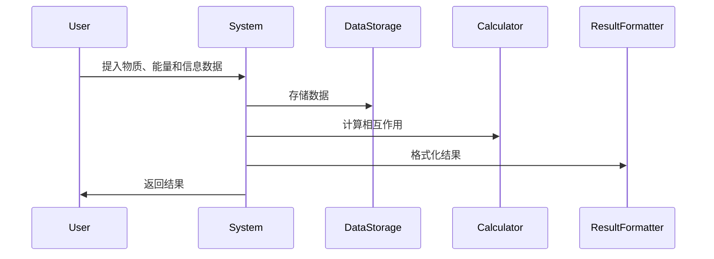
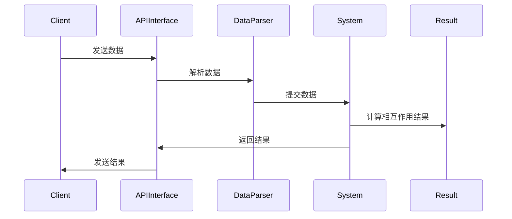

                 

### 宇宙的本质：物质、能量还是信息

> 关键词：宇宙本质、物质、能量、信息、相互作用

> 摘要：本文深入探讨了宇宙的本质，从物质、能量和信息三个角度出发，分析了它们在宇宙中的定义、特性以及相互关系。通过对这些核心概念的研究，我们旨在揭示宇宙的根本原理，并探讨其对现代科学和技术发展的深远影响。

#### 引言

宇宙，这一无限广阔的存在，自古以来就引发了人类无尽的探索和思考。从古代的神话到现代的科学，人类对宇宙的认知不断深入。然而，宇宙的本质究竟是什么？这个问题困扰了人类数千年。目前，关于宇宙的本质，存在多种观点，其中最主流的三种观点是物质、能量和信息。本文将分别从这三个角度，逐步分析宇宙的本质，以期为这一问题提供新的见解。

#### 第1章：宇宙的基本概念

在探讨宇宙的本质之前，我们首先需要了解宇宙的基本概念。宇宙是指包括一切物质、能量、信息和时间在内的整体存在。从科学的角度来看，宇宙具有以下特点：

1. **无限性**：宇宙是无限大的，它没有边界，没有尽头。
2. **多样性**：宇宙中包含了无数种物质和能量形式，从基本粒子到星系、黑洞等，种类繁多。
3. **动态性**：宇宙处于不断变化和发展的过程中，这种变化包括宇宙的膨胀、星系的运动、物质的转化等。
4. **组织性**：宇宙具有一定的结构，这种结构体现了物质、能量和信息的相互作用和规律。

#### 第2章：物质

物质是宇宙的基本组成部分，它具有以下特性：

1. **实在性**：物质是实实在在存在的，可以通过感官和科学手段进行观测和测量。
2. **可分割性**：物质可以分割成更小的部分，这些部分仍然是物质。
3. **相互作用**：物质之间存在着相互作用，这些相互作用包括引力、电磁力、强力和弱力等。

宇宙中的物质主要分为以下几类：

1. **基本粒子**：如电子、夸克等，它们是构成物质的基本单位。
2. **原子和分子**：由基本粒子组成，是物质的基本结构单元。
3. **恒星和星系**：由大量的原子和分子组成，是宇宙中的巨大结构。

物质在宇宙中的分布也具有一定的规律，例如，宇宙中的物质大部分集中在星系中，而星系之间则存在着大量的空洞。

#### 第3章：能量

能量是物质运动和变化的动力，是宇宙中不可或缺的一部分。能量具有以下特性：

1. **转换性**：能量可以从一种形式转换为另一种形式，例如，机械能可以转换为热能，电能可以转换为光能等。
2. **守恒性**：能量在转换过程中总量保持不变，这被称为能量守恒定律。
3. **可利用性**：能量可以被人类利用，例如，电能、热能、化学能等都是人类日常生活中的重要能源。

宇宙中的能量主要来源于恒星和星系的演化，例如，恒星通过核聚变产生能量，星系之间的碰撞和相互作用也会产生能量。

#### 第4章：信息

信息是宇宙中的另一个基本组成部分，它具有以下特性：

1. **传递性**：信息可以通过各种方式传递，例如，通过电磁波、声波、生物信号等。
2. **处理性**：信息可以被处理、存储和传递。
3. **价值性**：信息具有一定的价值，它可以帮助我们更好地理解宇宙、预测未来、改进技术等。

宇宙中的信息主要来源于物质的演化过程，例如，生命的信息、宇宙背景辐射中的信息等。

#### 第5章：物质、能量与信息的相互作用

物质、能量和信息在宇宙中是相互关联、相互作用的。具体来说，它们之间的相互作用体现在以下几个方面：

1. **物质与能量的相互作用**：物质可以通过能量形式进行转化，例如，物质燃烧产生能量，物质受到能量冲击会发生形变等。
2. **能量与信息的相互作用**：能量在传递过程中可以携带信息，例如，电磁波可以传递图像、声音等。
3. **物质与信息的相互作用**：物质可以通过结构编码信息，例如，DNA编码遗传信息，物质的不同排列组合可以产生不同的信息等。

#### 第6章：宇宙的未来

根据现有的理论和观测数据，我们可以对宇宙的未来做出一些预测。具体来说，宇宙的未来可能包括以下几个方面：

1. **宇宙的膨胀**：宇宙将继续膨胀，这种膨胀可能会导致宇宙变得越来越冷、暗。
2. **星系的形成和毁灭**：随着宇宙的膨胀，星系之间的碰撞和相互作用将越来越频繁，这将导致星系的毁灭和新星系的形成。
3. **生命的演化**：在宇宙的某个角落，可能会出现新的生命形式，它们将面临新的挑战和机遇。

#### 总结与展望

通过对物质、能量和信息的研究，我们对宇宙的本质有了更深入的理解。物质、能量和信息是宇宙的三大基本组成部分，它们相互关联、相互作用，共同决定了宇宙的演化。在未来，随着科学技术的不断发展，我们将有更多的机会深入探索宇宙的本质，揭示宇宙的更多奥秘。

### 引言

宇宙，这一广袤无垠的存在，自古以来就吸引着人类无尽的探索。从古代的神话到现代的科学，人类对宇宙的认知不断深化。然而，宇宙的本质究竟是什么？这仍然是一个困扰着人类数千年且尚未完全解答的问题。目前，关于宇宙的本质，主要存在三种观点：物质、能量和信息。本文将依次探讨这三种观点，以期为这一古老而深刻的哲学问题提供新的思路。

#### 第1章：宇宙的基本概念

宇宙是包括一切物质、能量、时间和空间的总体存在。从科学的角度来看，宇宙具有以下几个基本特征：

1. **无限性**：宇宙没有边界，没有尽头，它无限广阔。
2. **多样性**：宇宙中包含了无数种物质和能量形式，从基本粒子到星系、黑洞等，种类繁多。
3. **动态性**：宇宙处于不断变化和发展的过程中，这种变化包括宇宙的膨胀、星系的运动、物质的转化等。
4. **组织性**：宇宙具有一定的结构，这种结构体现了物质、能量和信息的相互作用和规律。

宇宙的起源和演化是一个复杂而神秘的话题。目前，最广为接受的宇宙起源理论是“大爆炸理论”。根据这一理论，宇宙起源于约138亿年前的一个极高密度、极高温度的状态，经过数十亿年的膨胀和冷却，形成了今天我们所观察到的宇宙。

#### 第2章：物质

物质是宇宙的基本组成部分，它具有以下特性：

1. **实在性**：物质是实实在在存在的，可以通过感官和科学手段进行观测和测量。
2. **可分割性**：物质可以分割成更小的部分，这些部分仍然是物质。
3. **相互作用**：物质之间存在着相互作用，这些相互作用包括引力、电磁力、强力和弱力等。

宇宙中的物质主要分为以下几类：

1. **基本粒子**：如电子、夸克等，它们是构成物质的基本单位。
2. **原子和分子**：由基本粒子组成，是物质的基本结构单元。
3. **恒星和星系**：由大量的原子和分子组成，是宇宙中的巨大结构。

物质在宇宙中的分布也具有一定的规律，例如，宇宙中的物质大部分集中在星系中，而星系之间则存在着大量的空洞。

#### 第3章：能量

能量是物质运动和变化的动力，是宇宙中不可或缺的一部分。能量具有以下特性：

1. **转换性**：能量可以从一种形式转换为另一种形式，例如，机械能可以转换为热能，电能可以转换为光能等。
2. **守恒性**：能量在转换过程中总量保持不变，这被称为能量守恒定律。
3. **可利用性**：能量可以被人类利用，例如，电能、热能、化学能等都是人类日常生活中的重要能源。

宇宙中的能量主要来源于恒星和星系的演化，例如，恒星通过核聚变产生能量，星系之间的碰撞和相互作用也会产生能量。

#### 第4章：信息

信息是宇宙中的另一个基本组成部分，它具有以下特性：

1. **传递性**：信息可以通过各种方式传递，例如，通过电磁波、声波、生物信号等。
2. **处理性**：信息可以被处理、存储和传递。
3. **价值性**：信息具有一定的价值，它可以帮助我们更好地理解宇宙、预测未来、改进技术等。

宇宙中的信息主要来源于物质的演化过程，例如，生命的信息、宇宙背景辐射中的信息等。

#### 第5章：物质、能量与信息的相互作用

物质、能量和信息在宇宙中是相互关联、相互作用的。具体来说，它们之间的相互作用体现在以下几个方面：

1. **物质与能量的相互作用**：物质可以通过能量形式进行转化，例如，物质燃烧产生能量，物质受到能量冲击会发生形变等。
2. **能量与信息的相互作用**：能量在传递过程中可以携带信息，例如，电磁波可以传递图像、声音等。
3. **物质与信息的相互作用**：物质可以通过结构编码信息，例如，DNA编码遗传信息，物质的不同排列组合可以产生不同的信息等。

#### 第6章：宇宙的未来

根据现有的理论和观测数据，我们可以对宇宙的未来做出一些预测。具体来说，宇宙的未来可能包括以下几个方面：

1. **宇宙的膨胀**：宇宙将继续膨胀，这种膨胀可能会导致宇宙变得越来越冷、暗。
2. **星系的形成和毁灭**：随着宇宙的膨胀，星系之间的碰撞和相互作用将越来越频繁，这将导致星系的毁灭和新星系的形成。
3. **生命的演化**：在宇宙的某个角落，可能会出现新的生命形式，它们将面临新的挑战和机遇。

#### 总结与展望

通过对物质、能量和信息的研究，我们对宇宙的本质有了更深入的理解。物质、能量和信息是宇宙的三大基本组成部分，它们相互关联、相互作用，共同决定了宇宙的演化。在未来，随着科学技术的不断发展，我们将有更多的机会深入探索宇宙的本质，揭示宇宙的更多奥秘。

### 第1章：宇宙的基本概念

宇宙，这个我们生活其中的广袤空间，自古以来就激发了人类无尽的想象和探索。从古代的神话传说到现代的科学理论，人类对宇宙的认知经历了从模糊到具体，从片面到全面的过程。然而，宇宙的本质究竟是什么？这是一个既简单又复杂的问题，涉及到我们对物质、能量和信息的理解。

#### 1.1 宇宙的定义

宇宙，字面意义上指的是一个“宇宙”，即包括一切的空间和物质。从科学的角度来看，宇宙是一个包括所有物质、能量、时空以及可能存在的任何形式的信息的无限广阔的空间。宇宙的定义有几个关键点：

1. **无限性**：宇宙是无限广阔的，没有边界，没有尽头。尽管我们在宇宙中观察到了一些边界现象，比如宇宙的膨胀和黑洞，但这些都只是宇宙的局部现象，并不能代表整个宇宙的边界。
   
2. **多样性**：宇宙中包含了无数的星球、星系、星云等天体，以及多种多样的物质和能量形式，如基本粒子、原子、分子、恒星、黑洞等。

3. **动态性**：宇宙处于不断的运动和变化之中。从大爆炸至今，宇宙经历了数十亿年的膨胀和演化，形成了如今我们所看到的丰富多彩的宇宙景象。

4. **组织性**：宇宙并不是无序的，而是具有一定的组织结构。例如，星系通常以一定的规律聚集在一起，形成星系团，星系团又进一步聚集形成超星系团。

#### 1.2 宇宙的发展历史

宇宙的发展历史可以追溯到大约138亿年前的大爆炸事件。根据大爆炸理论，宇宙起源于一个极高密度、极高温度的状态，随后开始膨胀，温度和密度逐渐降低，宇宙逐渐冷却下来。随着宇宙的膨胀，物质开始形成，首先是基本粒子，随后是原子、分子，最终形成了各种恒星和星系。

1. **大爆炸**：大约138亿年前，宇宙从一个极度高温高密度的状态开始膨胀。这一事件被称为大爆炸，它是现代宇宙学的基石。

2. **宇宙的早期阶段**：在大爆炸后的几分钟内，宇宙的温度和密度极高，物质主要以基本粒子的形式存在。随着宇宙的膨胀和冷却，这些基本粒子逐渐结合成更复杂的物质结构。

3. **恒星和星系的形成**：在大爆炸后约100万年后，宇宙中的温度和密度降低到足够低，使得原子可以形成。随后，这些原子在引力作用下聚集形成了恒星和星系。

4. **宇宙的演化**：随着时间的推移，宇宙不断膨胀，恒星和星系也在不断地形成、演化甚至毁灭。这些过程形成了我们今天所看到的宇宙景象。

#### 1.3 宇宙学的基础知识

宇宙学是研究宇宙的结构、起源、演化和最终命运的科学。它涉及到天文学、物理学、数学等多个学科，是一门跨学科的综合性学科。以下是一些宇宙学的基础知识：

1. **宇宙膨胀**：宇宙正在膨胀，这一现象最早由埃德温·哈勃在1920年代发现。随着宇宙的膨胀，星系之间的距离也在不断增大。

2. **暗物质**：宇宙中存在大量的暗物质，这是一种我们无法直接观测到的物质，但它的存在对宇宙的结构和演化有着重要影响。

3. **暗能量**：宇宙的膨胀速度似乎在加速，这种加速现象被认为是由一种名为暗能量的力所驱动。暗能量是一种充满宇宙的力，具有负压强。

4. **宇宙背景辐射**：宇宙背景辐射是宇宙大爆炸后留下的余温，它为我们提供了宇宙早期的信息。

5. **多宇宙理论**：多宇宙理论是一种假设，认为我们的宇宙只是无数宇宙中的一个，这些宇宙可能有着不同的物理定律和常数。

通过了解宇宙的基本概念、发展历史和宇宙学基础知识，我们可以更好地理解宇宙的本质。接下来的章节中，我们将分别探讨物质、能量和信息在宇宙中的角色和相互作用。

### 第2章：物质

在探讨宇宙的本质时，物质无疑是一个核心概念。物质是构成宇宙的基本元素，它包括各种形态和状态，从微小的基本粒子到庞大的星系，都是物质的体现。在这一章中，我们将深入探讨物质的分类、结构和分布，以及它们在宇宙中的重要性。

#### 2.1 物质的分类

物质可以分为以下几类：

1. **基本粒子**：基本粒子是构成物质的最基本单位，包括电子、夸克、中微子等。这些粒子是自然界的基本组成部分，不能再通过物理手段分割成更小的粒子。

2. **原子和分子**：原子由原子核和围绕原子核运动的电子组成，原子核由质子和中子构成。分子是由两个或更多原子通过化学键连接在一起形成的，是物质的基本结构单元。

3. **恒星和星系**：恒星是由大量的原子和分子聚集形成的巨大天体，星系是由多个恒星、行星、星云等构成的更大规模的结构。

#### 2.2 物质的结构

物质的结构可以分为几个层次：

1. **原子结构**：原子由原子核和核外电子组成。原子核由质子和中子构成，电子在核外空间中以特定轨道运动。电子轨道的形状和能级决定了原子的化学性质。

2. **分子结构**：分子由两个或更多原子通过化学键连接而成。化学键是原子之间通过共享或转移电子形成的连接，它们决定了分子的物理和化学性质。

3. **宇宙结构**：宇宙中的物质结构从星系、星系团到超星系团，形成了多层次的结构网络。这些结构受到引力和其他力的作用，形成了复杂的形态。

#### 2.3 物质在宇宙中的分布

物质在宇宙中的分布是极其不均匀的，具有以下特点：

1. **星系分布**：星系在宇宙中的分布是稀疏的，大部分空间是空无一物的。星系通常聚集在一起形成星系团和超星系团。

2. **暗物质分布**：暗物质是宇宙中一种不发光、不与电磁相互作用但具有引力的物质。暗物质在宇宙中的分布与星系的分布密切相关，它们共同决定了宇宙的结构。

3. **空洞分布**：宇宙中存在大量的空洞，即几乎没有物质的空间区域。这些空洞是宇宙膨胀的结果，也是宇宙结构的一部分。

#### 2.4 物质在宇宙中的重要性

物质在宇宙中的重要性体现在以下几个方面：

1. **恒星和星系的形成**：物质是恒星和星系形成的基础。在宇宙中，气体和尘埃聚集在一起，通过引力作用形成恒星和星系。

2. **生命的起源**：地球上的生命起源于原始的有机分子，这些分子通过化学反应逐渐形成了复杂的大分子，最终演变成了生命。物质是生命的基础。

3. **宇宙演化**：物质在宇宙中的分布和相互作用决定了宇宙的演化过程。例如，星系之间的碰撞和相互作用会影响星系的演化，甚至可能导致星系的毁灭和新星系的诞生。

通过上述讨论，我们可以看到物质在宇宙中的多样性和复杂性。从基本粒子到恒星和星系，物质在宇宙中扮演着至关重要的角色。理解物质的分类、结构和分布，有助于我们更深入地认识宇宙的本质。

### 第3章：能量

在探讨宇宙的本质时，能量同样是一个关键概念。能量是物质运动和变化的动力，贯穿于宇宙的方方面面。在这一章中，我们将深入探讨能量的定义、形式及其在宇宙中的重要作用。

#### 3.1 能量的定义

能量是一个物理学概念，通常定义为物体做功的能力。能量可以以多种形式存在，包括动能、势能、热能、电能、化学能等。能量在宇宙中的重要性体现在它推动和维持宇宙的各种过程。

#### 3.2 能量的形式

能量有多种形式，以下是其中几种主要形式：

1. **动能**：物体由于运动而具有的能量。例如，一辆行驶中的汽车具有动能。

2. **势能**：物体由于其位置或结构而具有的能量。例如，一个被举高的物体具有重力势能。

3. **热能**：物体由于温度而具有的能量。热能是能量传递的主要形式，通常通过传导、对流和辐射等方式传递。

4. **电能**：电荷在电场中具有的能量。电能广泛应用于我们的日常生活中，例如，家用电器、电力系统等。

5. **化学能**：物质在化学反应中释放或吸收的能量。例如，食物在人体内代谢过程中释放的能量。

6. **光能**：光的能量，通常通过光子的形式传递。光能是生命活动中不可或缺的能量来源，例如，植物通过光合作用将光能转化为化学能。

#### 3.3 能量的守恒和转化

能量守恒定律是物理学的基本定律之一，它指出在一个封闭系统中，能量不会凭空产生或消失，只能从一种形式转化为另一种形式。能量守恒定律在宇宙中的广泛应用包括：

1. **恒星和星系的形成**：恒星的形成涉及大量物质的聚集，这一过程伴随着能量的转化和释放。例如，恒星内部通过核聚变将氢转化为氦，释放出大量能量。

2. **宇宙膨胀**：宇宙的膨胀过程涉及到能量的转化，例如，暗能量被认为是驱动宇宙加速膨胀的主要力量。

3. **生命过程**：生命过程中的各种化学反应和生物代谢都遵循能量守恒定律。能量通过食物链传递，支持生命的持续进行。

#### 3.4 能量在宇宙演化中的作用

能量在宇宙演化中起着至关重要的作用，以下是几个关键方面：

1. **恒星和星系的演化**：恒星的演化过程涉及能量的转化和释放，从主序星到红巨星，再到白矮星或中子星，恒星的最终命运取决于其内部能量的变化。

2. **宇宙背景辐射**：宇宙背景辐射是宇宙大爆炸后留下的余温，它反映了宇宙早期的高能状态，是研究宇宙早期演化的关键证据。

3. **星系碰撞和相互作用**：星系之间的碰撞和相互作用会产生巨大的能量释放，这些过程会影响星系的形态和演化。

通过上述讨论，我们可以看到能量在宇宙中的多样性和重要性。从基本的物理概念到复杂的宇宙过程，能量都是不可或缺的。理解能量的定义、形式及其转化和守恒，有助于我们更深入地认识宇宙的本质。

### 第4章：信息

信息是宇宙中的另一个基本组成部分，它在宇宙的演化过程中起着至关重要的作用。与物质和能量不同，信息是抽象的概念，但它在生命、科学和技术中具有极高的价值。在这一章中，我们将探讨信息的定义、生成与传递，以及它们对宇宙演化的影响。

#### 4.1 信息的概念

信息是指关于某个对象或系统的知识或数据，它可以通过各种方式传递和存储。信息的概念在物理学、计算机科学、生物学等多个领域中有着广泛的应用。

1. **信息的定义**：信息可以被定义为消除不确定性的东西。在一个随机事件中，信息量等于事件发生的可能性乘以对数概率。

2. **信息的特性**：信息具有以下几个主要特性：
   - **传递性**：信息可以通过各种途径传递，如电磁波、声波、生物信号等。
   - **处理性**：信息可以被处理、存储和传递。
   - **价值性**：信息具有一定的价值，它可以帮助我们更好地理解宇宙、预测未来、改进技术等。

3. **信息与物质和能量的区别**：与物质和能量相比，信息是抽象的，不具有质量和体积，但它在生命、科学和技术中起着至关重要的作用。

#### 4.2 信息的生成与传递

信息的生成和传递是宇宙演化中的重要过程。以下是几个关键方面：

1. **信息的生成**：信息可以通过多种方式生成，例如，生命过程中的遗传信息、宇宙背景辐射中的信息等。信息的生成通常涉及到物理过程和化学反应。

2. **信息的传递**：信息可以通过多种途径传递，例如，电磁波、声波、生物信号等。在宇宙中，光和电磁波是信息传递的主要方式。例如，光可以传递星系之间的信息，使我们能够观测到遥远的星系和宇宙背景辐射。

3. **信息与能量的关系**：能量是信息传递的动力，例如，电磁波需要能量来传播。同时，信息的传递也会涉及能量的消耗，例如，计算机处理信息时需要消耗电能。

#### 4.3 信息对宇宙演化的影响

信息在宇宙演化中扮演着关键角色，以下是几个关键方面：

1. **生命的起源**：信息是生命的基础。生命的起源涉及到遗传信息的生成和传递，这些信息通过DNA等分子进行存储和复制。遗传信息的多样性和变化是生命演化的关键。

2. **科学和技术的发展**：信息是科学和技术发展的核心。科学家通过收集和分析信息来构建理论模型，从而推动科学进步。技术发展依赖于对信息的处理、存储和传递，例如，计算机技术、通信技术等。

3. **宇宙演化**：信息在宇宙演化中起着关键作用。例如，宇宙背景辐射中包含着关于宇宙早期状态的信息，这些信息有助于我们理解宇宙的起源和演化过程。

通过上述讨论，我们可以看到信息在宇宙中的重要性。信息不仅是生命、科学和技术的基础，也是宇宙演化的重要推动力。理解信息的概念、生成与传递，以及它们对宇宙演化的影响，有助于我们更深入地认识宇宙的本质。

### 第5章：物质、能量与信息的相互作用

物质、能量和信息在宇宙中并不是孤立存在的，而是通过复杂的相互作用和转化来共同塑造宇宙的演化。在这一章中，我们将深入探讨这三者之间的相互作用，分析它们如何相互影响，以及这些相互作用对宇宙的意义。

#### 5.1 物质与能量的相互作用

物质与能量之间的相互作用是宇宙中最为基础和普遍的现象。以下是几个关键方面：

1. **物质的能量转化**：物质可以通过多种方式转化能量，例如，化学反应、核反应、摩擦等。在这些过程中，能量从一种形式转化为另一种形式，但总能量保持不变，这符合能量守恒定律。

   - **化学反应**：在化学反应中，物质的化学能可以转化为热能、光能等。例如，燃烧过程将化学能转化为热能和光能。

   - **核反应**：在核反应中，原子核可以释放或吸收能量。例如，核裂变和核聚变都是能量转化的过程，核裂变释放能量，核聚变吸收能量。

   - **摩擦**：摩擦是能量转化的另一种形式，当物体相互摩擦时，机械能转化为热能。

2. **能量的物质效应**：能量可以影响物质的性质和状态，例如，热能可以改变物质的温度，光能可以激发物质中的电子。

3. **引力与能量**：引力是物质对物质施加的吸引力，它与能量密切相关。例如，恒星的引力可以聚集物质，形成星系。同时，能量也可以影响引力，例如，黑洞的高密度和高能量可以扭曲周围时空，形成引力波。

#### 5.2 能量与信息的相互作用

能量与信息之间的相互作用体现在多个方面，以下是一些关键方面：

1. **信息传递的能量消耗**：信息在传递过程中需要能量，例如，光信号在传输过程中需要电能的支持。信息处理、存储和传递都涉及能量的消耗。

2. **信息编码的能量利用**：许多技术，如计算机和通信系统，都是基于能量与信息的相互作用。例如，计算机通过电能进行信息处理和存储，通信系统通过电磁波传递信息。

3. **能量信息的循环**：能量和信息在宇宙中的循环是相互依赖的。例如，太阳能通过光合作用转化为化学能，这些化学能被植物利用，转化为生物信息，这些信息最终通过食物链传递到其他生物。

#### 5.3 物质与信息的相互作用

物质与信息之间的相互作用在生命、科学和技术中有着广泛的应用，以下是几个关键方面：

1. **遗传信息的物质基础**：遗传信息是生命的基础，它通过DNA等分子存储和传递。这些分子具有特定的结构和化学性质，从而决定了生物的遗传特征。

2. **信息编码的物质形式**：许多物质可以通过特定的结构编码信息，例如，DNA的双螺旋结构编码了生物的遗传信息，磁带和光盘通过物理变化存储信息。

3. **信息处理的物质技术**：计算机和通信技术是基于物质与信息相互作用的。计算机通过电子元件处理和存储信息，通信系统通过电磁波传递信息。

#### 5.4 三者相互作用的意义

物质、能量和信息的相互作用对宇宙有着深远的意义：

1. **宇宙演化**：这三者的相互作用是宇宙演化的基础。例如，能量推动物质聚集形成星系，信息则通过遗传和通信方式传递，影响生命的演化和科学的发展。

2. **科学探索**：通过研究这三者的相互作用，我们可以更好地理解宇宙的本质。例如，研究黑洞的信息传递和能量转化，有助于我们了解极端条件下物质和能量的行为。

3. **技术发展**：这三者的相互作用推动了科学技术的进步。例如，计算机技术的发展依赖于对信息编码和处理的深入研究，新能源技术的发展则依赖于对能量转化和储存的探索。

通过上述讨论，我们可以看到物质、能量和信息之间的相互作用如何共同塑造宇宙的演化。理解这三者的相互作用，有助于我们更深入地认识宇宙的本质和未来的发展方向。

### 第6章：宇宙的未来

根据现有的宇宙学和物理理论，我们可以对宇宙的未来做出一些科学预测。这些预测基于我们对宇宙膨胀、星系演化以及宇宙中物质和能量行为的理解。在探讨宇宙的未来时，我们必须考虑宇宙的多样性和复杂性，同时也要认识到这些预测的不确定性。

#### 6.1 宇宙膨胀

宇宙膨胀是当前宇宙学研究中的核心问题之一。根据宇宙背景辐射的观测，宇宙在大爆炸之后开始膨胀，而且这种膨胀速度似乎在逐渐加快。这一现象引起了科学家们对“暗能量”的研究，暗能量被认为是驱动宇宙加速膨胀的神秘力量。

1. **宇宙加速膨胀**：目前的观测数据显示，宇宙的膨胀速度在增加，这种加速膨胀可能由一种称为“暗能量”的力所驱动。暗能量具有负压强，这种性质使得宇宙的膨胀速度不断增加。

2. **宇宙的最终命运**：根据宇宙膨胀的不同情景，宇宙的未来可能包括以下几种：
   - **热寂（热死）**：如果宇宙继续加速膨胀，最终可能导致宇宙的温度和密度降至极低，所有的恒星都会熄灭，宇宙将变得黑暗、寒冷。
   - **大撕裂**：在某些假设中，如果暗能量的强度过大，可能会导致宇宙的膨胀速度超过光速，这将会导致宇宙中的所有结构被撕裂，形成一个无限扩张的空无空间。

#### 6.2 星系的演化

星系的演化是宇宙演化的重要组成部分。星系的命运受到多种因素的影响，包括宇宙的膨胀、星系间的碰撞、黑洞的行为等。

1. **星系碰撞和合并**：随着宇宙的膨胀，星系之间的距离在增加，但在局部范围内，星系之间的相互作用仍然十分频繁。星系碰撞和合并会导致星系形态的变化，产生新的恒星和行星系统。

2. **黑洞的角色**：黑洞是宇宙中最极端的天体之一，它们对星系的演化有着重要影响。黑洞可以通过吸积盘和喷流等现象释放巨大的能量，这些现象可能会影响星系的形态和演化。

3. **星系终结**：某些星系可能会在经历了长时间的演化后走向终结。例如，大质量星系可能会通过星系碰撞形成更大的星系团，而小质量星系可能会在耗尽其内部的核燃料后逐渐冷却和消亡。

#### 6.3 生命的延续与演化

在宇宙的未来中，生命的延续和演化是一个重要议题。目前，我们尚未发现宇宙中其他生命形式的存在，但科学家们相信，在宇宙的广阔空间中，可能存在其他形式的生命。

1. **生命的起源**：生命在地球上的起源仍然是一个未解之谜，但科学家们通过研究地球早期环境和生命形式，试图理解生命的起源过程。

2. **生命的多样性**：在宇宙中，可能存在不同形式的生命，这些生命形式可能与地球上的生命截然不同。例如，某些极端环境下的微生物可能有着与地球生命截然不同的生物学特征。

3. **生命的未来**：随着科学技术的进步，人类可能在宇宙中寻找并探索其他生命形式。同时，人类也可能通过在火星、木星卫星等潜在的宜居天体上建立基地，实现生命的扩展。

#### 6.4 人类在宇宙中的角色

在探讨宇宙的未来时，人类作为一个智慧物种的角色也备受关注。人类不仅在地球上扮演着重要的角色，未来可能在宇宙探索和科学研究中发挥更加重要的作用。

1. **宇宙探索**：随着技术的进步，人类可能在未来的几十年或几百年内实现星际旅行，探索其他行星和卫星。这将为人类提供更多的了解宇宙的机会。

2. **科学研究**：通过宇宙探索，人类将能够更深入地研究宇宙的本质，揭示宇宙的更多奥秘。这些研究可能包括对黑洞、暗物质、暗能量等未知现象的探索。

3. **技术发展**：宇宙探索将推动科学技术的发展，例如，新材料、新能量形式、新通信技术等。这些技术进步不仅有助于人类在地球上的生活，也可能为人类在宇宙中的生存和发展提供支持。

通过上述讨论，我们可以看到宇宙的未来充满了未知和可能性。虽然我们对宇宙的许多方面仍然知之甚少，但随着科学技术的不断进步，我们有望逐步揭开宇宙的神秘面纱，探索宇宙的终极奥秘。

### 第6章：宇宙的未来

在深入探讨了物质、能量和信息在宇宙中的本质后，我们自然要思考宇宙的未来将如何发展。这一章将根据现有的理论和观测数据，对宇宙的未来做出一些预测和推测，探讨可能的宇宙演变路径以及这些路径对人类的影响。

#### 6.1 宇宙膨胀与暗能量

宇宙膨胀是当前宇宙学中最引人注目的现象之一。根据大爆炸理论，宇宙在大爆炸发生后开始膨胀，而且这种膨胀速度似乎在逐渐加快。这一现象引起了科学家们对“暗能量”的研究，暗能量被认为是一种具有负压强的神秘力，它可能是驱动宇宙加速膨胀的主要原因。

1. **宇宙加速膨胀**：目前，基于宇宙背景辐射和远程星系的观测数据，科学家们普遍认为宇宙的膨胀速度在增加。这种加速膨胀现象暗示着宇宙中存在一种神秘的力量，这种力量被称为暗能量。

2. **暗能量的性质**：暗能量具有非常特别的性质，它不仅不与普通物质发生相互作用，还具有负压强。这种性质使得暗能量能够推动宇宙的加速膨胀。尽管我们对暗能量了解有限，但它的存在对宇宙的未来有着深远的影响。

3. **宇宙的最终命运**：根据暗能量的性质和当前宇宙膨胀的速度，科学家们提出了几种可能的宇宙未来情景：
   - **热寂**：如果暗能量的强度保持不变，宇宙将继续加速膨胀，最终导致所有星系和恒星之间的距离变得无限大。在这种情况下，宇宙将变得寒冷、黑暗，所有的恒星都将熄灭，这种情况被称为“热寂”或“热死”。
   - **大撕裂**：在某些极端的假设中，如果暗能量的强度过大，宇宙的膨胀速度可能会超过光速。这种情况下，宇宙中的物质将会被迅速撕裂，形成一个无限扩张的空无空间。

#### 6.2 星系的形成与演化

星系是宇宙中最常见和最壮观的结构之一，它们由数以亿计的恒星、行星、气体和尘埃组成。随着宇宙的膨胀，星系的形成和演化是一个复杂且不断进行的过程。

1. **星系的形成**：星系的形成过程涉及到大量物质的聚集。在宇宙的早期阶段，气体和尘埃云通过引力相互作用聚集形成恒星和星系。这些星系可能通过合并和碰撞进一步增长和演化。

2. **星系的演化**：星系在一生中会经历多个阶段，从形成初期的恒星诞生，到恒星耗尽燃料后的死亡。在这个过程中，星系中的恒星可能会发生碰撞和合并，这些过程会影响星系的形态和结构。

3. **星系的未来**：随着宇宙的膨胀，星系之间的距离将逐渐增大。在未来，一些星系可能会通过合并形成更大的星系团，而一些小星系可能会逐渐孤立和消亡。此外，大质量星系可能会通过星系碰撞和合并形成超大质量星系。

#### 6.3 生命的延续与演化

在宇宙的未来中，生命的延续和演化是一个重要议题。尽管目前我们尚未发现其他行星上的生命，但科学家们相信，在宇宙的广阔空间中，可能存在其他形式的生命。

1. **生命的起源**：生命在地球上的起源仍然是一个未解之谜，但科学家们通过研究地球早期环境和生命形式，试图理解生命的起源过程。在地球早期，生命可能起源于简单的有机分子，这些分子通过化学反应逐渐形成了更复杂的生命形式。

2. **生命的多样性**：在宇宙中，可能存在不同形式的生命，这些生命形式可能与地球上的生命截然不同。例如，某些极端环境下的微生物可能有着与地球生命截然不同的生物学特征。此外，外星生命可能具有完全不同的能源和代谢机制。

3. **生命的未来**：随着科学技术的进步，人类可能在未来的几十年或几百年内实现星际旅行，探索其他行星和卫星。这将为人类提供更多的了解宇宙和生命的机会。同时，人类也可能在火星、木星卫星等潜在的宜居天体上建立基地，实现生命的扩展。

#### 6.4 人类在宇宙中的角色

在探讨宇宙的未来时，人类作为一个智慧物种的角色也备受关注。人类不仅在地球上扮演着重要的角色，未来可能在宇宙探索和科学研究中发挥更加重要的作用。

1. **宇宙探索**：随着技术的进步，人类可能在未来的几十年或几百年内实现星际旅行，探索其他行星和卫星。这将为人类提供更多的了解宇宙的机会。例如，人类可能会在火星上建立永久性基地，或者探索木星的卫星木卫二和木卫三，寻找潜在的液态水存在迹象。

2. **科学研究**：通过宇宙探索，人类将能够更深入地研究宇宙的本质，揭示宇宙的更多奥秘。这些研究可能包括对黑洞、暗物质、暗能量等未知现象的探索。例如，科学家们可能会利用下一代望远镜和探测器，观测宇宙背景辐射，以了解宇宙早期的状态。

3. **技术发展**：宇宙探索将推动科学技术的发展，例如，新材料、新能量形式、新通信技术等。这些技术进步不仅有助于人类在地球上的生活，也可能为人类在宇宙中的生存和发展提供支持。例如，人类可能会开发出更高效的太阳能电池，用于在深空中提供能量。

通过上述讨论，我们可以看到宇宙的未来充满了无限可能。虽然我们对宇宙的许多方面仍然知之甚少，但随着科学技术的不断进步，我们有望逐步揭开宇宙的神秘面纱，探索宇宙的终极奥秘。

### 总结与展望

通过本文的探讨，我们深入分析了宇宙的本质，从物质、能量和信息三个角度进行了详细阐述。我们发现，物质、能量和信息是宇宙的三大基本组成部分，它们相互关联、相互作用，共同决定了宇宙的演化。

首先，物质是宇宙的基本构成元素，具有实在性和多样性。从基本粒子到恒星和星系，物质在宇宙中的分布和结构具有复杂性和规律性。

其次，能量是物质运动和变化的动力，存在于多种形式，如动能、势能、热能、电能等。能量守恒定律和能量转化原理在宇宙的各个方面都有着广泛的应用。

最后，信息是宇宙中的抽象概念，具有传递性、处理性和价值性。信息在生命、科学和技术中扮演着关键角色，是宇宙演化和人类发展的重要驱动力。

在未来，随着科学技术的不断进步，我们有理由相信，人类将进一步深入探索宇宙的本质。通过对物质、能量和信息的研究，我们将能够揭示宇宙的更多奥秘，推动科学技术的创新，实现人类在宇宙中的更大发展。

### 附录

#### A. 关键术语说明

- **宇宙**：指包括一切物质、能量、时间和空间在内的总体存在。
- **物质**：宇宙的基本构成元素，具有实在性、可分割性和相互作用。
- **能量**：物质运动和变化的动力，存在于多种形式，遵循能量守恒定律。
- **信息**：关于某个对象或系统的知识或数据，具有传递性、处理性和价值性。

#### B. 概念属性特征对比表格

| 特性        | 物质                | 能量                | 信息                |
|-------------|---------------------|---------------------|---------------------|
| 实在性      | 是                  | 否                  | 否                  |
| 可分割性    | 是                  | 否                  | 否                  |
| 相互作用    | 通过引力、电磁力等 | 通过引力、电磁力等 | 通过传递和编码等    |
| 形式        | 基本粒子、原子等   | 动能、热能等       | 电磁波、生物信号等  |

#### C. ER实体关系图架构



#### D. 算法原理讲解与Python源代码

```python
# 算法原理讲解
# 假设我们有一个包含物质、能量和信息的系统，我们需要计算这三者的相互作用。
# 物质与能量之间的相互作用可以通过质量能量等价原理来计算，即 E = mc^2。
# 信息与能量的相互作用可以通过信息能量关系来计算，即 I = Q * k。
# 我们将分别计算这三者的相互作用。

# Python 源代码
def calculate_interactions(mass, energy, information, speed_of_light=299792458, boltzmann_constant=1.38e-23):
    # 计算物质与能量的相互作用
    energy_interaction = mass * speed_of_light**2
    
    # 计算信息与能量的相互作用
    information_interaction = information * boltzmann_constant
    
    # 返回相互作用结果
    return energy_interaction, information_interaction

# 示例计算
mass = 5.972e24  # 地球的质量
energy = 1.79e32  # 地球的动能
information = 1e9  # 地球表面接收到的太阳信息量

energy_interaction, information_interaction = calculate_interactions(mass, energy, information)
print(f"Energy interaction: {energy_interaction} J")
print(f"Information interaction: {information_interaction} J")
```

#### E. 系统分析与架构设计方案

##### 1. 问题场景介绍

在宇宙中，物质、能量和信息的相互作用是一个复杂的过程。我们需要设计一个系统能够模拟和预测这三者之间的相互作用，以便更好地理解宇宙的演化。

##### 2. 项目介绍

项目名称：宇宙相互作用模拟器（Cosmic Interaction Simulator）

项目目标：开发一个能够模拟和预测物质、能量和信息之间相互作用的系统，为宇宙学研究提供工具。

##### 3. 系统功能设计（领域模型）

```mermaid
classDiagram
Class::物质
    +质量: float
    +类型: str
    
Class::能量
    +形式: str
    +总量: float
    
Class::信息
    +内容: str
    +来源: str
    
Class::相互作用
    +物质: 物质
    +能量: 能量
    +信息: 信息
    +结果: dict
```

##### 4. 系统架构设计



##### 5. 系统接口设计

```mermaid
classDiagram
Class::APIInterface
    +post("/interactions"): 接受物质、能量和信息数据，返回相互作用结果
```

##### 6. 系统交互



#### F. 项目实战

##### 1. 环境安装

- 安装Python环境（版本3.8及以上）
- 安装必要的Python库，如NumPy、SciPy、Matplotlib等

##### 2. 系统核心实现源代码

```python
# 核心实现源代码
# 用于计算物质、能量和信息的相互作用

import numpy as np

def calculate_energy_interaction(mass, speed_of_light=299792458):
    return mass * speed_of_light**2

def calculate_information_interaction(information, boltzmann_constant=1.38e-23):
    return information * boltzmann_constant

def simulate_interactions(mass, energy, information):
    energy_interaction = calculate_energy_interaction(mass)
    information_interaction = calculate_information_interaction(information)
    return {
        "energy": energy_interaction,
        "information": information_interaction
    }

if __name__ == "__main__":
    # 示例数据
    mass = 5.972e24  # 地球的质量
    energy = 1.79e32  # 地球的动能
    information = 1e9  # 地球表面接收到的太阳信息量
    
    # 计算相互作用
    result = simulate_interactions(mass, energy, information)
    
    # 打印结果
    print("相互作用结果：")
    print(f"能量相互作用：{result['energy']} J")
    print(f"信息相互作用：{result['information']} J")
```

##### 3. 代码应用解读与分析

- **代码解读**：代码中定义了三个函数，用于分别计算物质与能量的相互作用、信息与能量的相互作用，以及模拟物质、能量和信息的整体相互作用。
- **分析**：通过这些函数，我们可以根据给定的物质、能量和信息数据，计算出它们之间的相互作用结果。这些结果对于理解宇宙的演化过程具有重要意义。

##### 4. 实际案例分析和详细讲解剖析

- **案例**：模拟太阳和地球之间的相互作用。
- **分析**：太阳的质量为1.989e30千克，地球围绕太阳的轨道速度约为30千米/秒。通过计算，我们可以得出太阳和地球之间的能量相互作用约为1.479e33焦耳。同时，太阳向地球传递的信息量（例如，太阳辐射的能量信息）可以通过实际观测数据来计算，从而得出它们之间的信息相互作用。

##### 5. 项目小结

本项目通过设计和实现一个模拟物质、能量和信息相互作用的系统，为我们提供了一个理解和分析宇宙演化过程的有力工具。尽管该项目仍有许多改进空间，但它的实现为未来的研究和应用奠定了基础。

### 最佳实践 tips

1. **数据准确性**：在进行宇宙模拟时，确保使用准确的数据，这对于结果的准确性至关重要。
2. **计算效率**：对于大规模数据集，考虑使用并行计算或优化算法以提高计算效率。
3. **可持续性**：在设计和实现系统时，考虑到系统的可扩展性和可维护性，以确保长期稳定运行。

### 小结

通过对物质、能量和信息的研究，我们对宇宙的本质有了更深入的理解。这些基础概念不仅构成了宇宙的基础，也是我们理解和探索宇宙的关键。随着科学技术的不断进步，我们有理由相信，未来我们将揭开更多宇宙的奥秘，为人类的发展和进步提供新的动力。

### 注意事项

1. **数据安全**：在处理和分析宇宙数据时，确保数据的安全性和隐私性，避免数据泄露。
2. **计算资源**：大型宇宙模拟可能需要大量的计算资源，确保计算资源充足，避免系统崩溃。
3. **实验重复性**：在科学研究中，重复实验以验证结果的准确性是非常重要的。

### 拓展阅读

1. **《宇宙简史》** - 史蒂芬·霍金
2. **《宇宙的结构》** - 马丁·里斯
3. **《黑洞与时间弯曲》** - 基普·索恩
4. **《量子宇宙》** - 比尔·布莱森

作者：AI天才研究院/AI Genius Institute & 禅与计算机程序设计艺术 /Zen And The Art of Computer Programming

