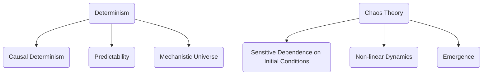

                 

### Introduction to the Book

#### 1.1 Background and Context

The study of the universe has fascinated humanity for centuries. From the ancient Greeks to modern astronomers, our quest to understand the cosmos has driven scientific discovery and philosophical inquiry. Central to this exploration is the question of whether the universe operates under deterministic laws or if it is governed by chaotic dynamics.

Determinism, an ideology rooted in the belief that every event in the universe is causally determined, has been a cornerstone of scientific thought. The concept posits that if one had perfect knowledge of the initial conditions and the governing laws of nature, one could predict the future with absolute certainty. This perspective has deep philosophical roots, with thinkers like Isaac Newton and Pierre-Simon Laplace advocating for a fully deterministic universe.

On the other hand, chaos theory emerged as a revolutionary concept in the 20th century, challenging the deterministic view by highlighting the inherent unpredictability in certain systems. Chaos theory demonstrates that complex systems can exhibit sensitive dependence on initial conditions, meaning that even minute differences in starting points can lead to vastly different outcomes. This notion of "chaos" does not imply randomness but rather a highly ordered, yet unpredictable behavior in systems.

This book, "The Nature of the Universe: Determinism or Chaos?" seeks to delve into these two opposing perspectives and explore their implications for our understanding of the universe. We will examine the historical and philosophical foundations of determinism and chaos theory, as well as their applications in various scientific disciplines. By doing so, we aim to shed light on the fundamental questions of whether the universe is inherently deterministic or governed by chaotic dynamics.

#### 1.2 The Book's Aim and Structure

The primary aim of this book is to provide a comprehensive exploration of the debate between determinism and chaos theory in the context of our understanding of the universe. By examining the historical development, philosophical underpinnings, and scientific applications of these concepts, we aim to offer a nuanced perspective that bridges the gap between these two seemingly contradictory viewpoints.

The book is structured into six main sections, each designed to build upon the previous one, leading to a holistic understanding of the topic. Here is an overview of the structure and themes of each section:

1. **Introduction to the Book**:
   - Chapter 1 provides an introduction to the book's background and context, outlining the importance of understanding determinism and chaos theory in the study of the universe.

2. **Fundamental Concepts**:
   - Chapter 2 delves into the theoretical frameworks of determinism and chaos theory, exploring their definitions, historical contexts, and philosophical implications. It includes a Mermaid ER diagram and a comparison table of core concepts and attributes.

3. **The Universe and Chaos Theory**:
   - Chapter 3 examines the evidence for chaos in the universe, including cosmic phenomena and chaotic systems, providing concrete examples of chaos theory in action.

4. **The Debate between Determinism and Chaos**:
   - Chapter 4 explores the ongoing debate between determinism and chaos theory, examining various theories and perspectives from both historical and modern viewpoints. It also discusses the challenges and opportunities in reconciling these two paradigms.

5. **Case Studies and Applications**:
   - Chapter 5 presents case studies and applications of determinism and chaos theory in scientific research and technology, highlighting the practical implications of these concepts.

6. **Future Directions**:
   - Chapter 6 looks ahead to future developments in the study of determinism and chaos theory, discussing theoretical advancements and their potential impact on our understanding of the universe. It also addresses the ethical and societal implications of these theories.

7. **Conclusion**:
   - Chapter 7 offers a summary of the key points discussed throughout the book, highlighting the main arguments and conclusions regarding the nature of the universe.

By following this structured approach, the book aims to provide readers with a deep and insightful understanding of the determinism versus chaos debate, enabling them to form their own informed opinions on this fundamental question.

#### Fundamental Concepts

In this section, we delve into the theoretical frameworks that underpin the debate between determinism and chaos theory. By exploring their definitions, historical contexts, and philosophical implications, we aim to provide a comprehensive understanding of these concepts.

##### 2.1.1 Determinism

Determinism is a philosophical and scientific position that asserts that every event in the universe has a cause and that there is no such thing as a random event. Historically, determinism has roots in ancient Greek philosophy, with thinkers like Aristotle arguing that everything that happens is the result of prior causes. This perspective continued through the Enlightenment, where thinkers like Isaac Newton formalized the concept through his laws of motion and gravitation.

The key principles of determinism can be summarized as follows:

- **Causal Determinism**: Every event in the universe is a result of prior causes. There are no free will events or random actions.
- **Predictability**: If one has complete knowledge of the initial conditions and the governing laws of nature, one could predict all future events with absolute certainty.
- **Mechanistic Universe**: The universe operates like a well-oiled machine, following predictable patterns and laws.

Determinism has had profound philosophical implications. For example, the concept raises questions about the nature of free will and moral responsibility. If everything is determined by prior causes, does free will exist, and can one be held morally accountable for their actions? These questions have sparked extensive debates in philosophy and continue to be relevant today.

In science, determinism has been a cornerstone of classical physics. Newton's laws of motion and gravitation are deterministic in nature, providing precise predictions for the motion of objects under certain conditions. However, the advent of quantum mechanics introduced a degree of indeterminacy, challenging the deterministic view. Quantum mechanics describes the behavior of particles at the subatomic level, where events are not entirely predictable and exhibit probabilities.

##### 2.1.2 Chaos Theory

Chaos theory, which emerged in the 20th century, represents a fundamental departure from determinism by emphasizing the inherent unpredictability and complexity of certain systems. Unlike classical deterministic systems, chaotic systems are highly sensitive to initial conditions, a phenomenon often referred to as the "butterfly effect." This means that even minuscule differences in starting conditions can lead to vastly different outcomes over time.

The key principles of chaos theory include:

- **Sensitive Dependence on Initial Conditions (SDIC)**: Small differences in initial conditions can lead to significantly different outcomes, making long-term prediction impossible.
- **Non-linear Dynamics**: Chaotic systems exhibit complex, non-linear behavior that defies simple mathematical modeling.
- **Emergence**: Chaotic systems can exhibit properties that are not present in their individual components, leading to the emergence of complex patterns and structures.

Chaos theory has its roots in the study of weather patterns and fluid dynamics. The mathematician and meteorologist Edward Lorenz pioneered the field in the 1960s with his study of the weather, which revealed that small changes in initial conditions could lead to vastly different weather patterns. This insight led to the development of the concept of the "butterfly effect," which has become a hallmark of chaos theory.

In philosophy, chaos theory challenges the deterministic view by emphasizing the unpredictability and complexity of the universe. It suggests that the universe may not be as orderly or predictable as classical physics would have us believe. This has led to debates about the nature of reality and the role of chance in the universe.

##### 2.1.3 Comparison of Determinism and Chaos Theory

To better understand the differences and similarities between determinism and chaos theory, let's compare their key attributes using a comparison table and a Mermaid ER diagram.

**Comparison Table of Core Concepts and Attributes**

| Attribute                     | Determinism                                                       | Chaos Theory                                                        |
|------------------------------|------------------------------------------------------------------|----------------------------------------------------------------------|
| Predictability               | High predictability if complete information is available           | Low predictability due to sensitive dependence on initial conditions |
| Behavior                      | Simple and linear relationships                                  | Complex, non-linear relationships                                   |
| Sensitivity to Initial Conditions | Less sensitive                                                    | Highly sensitive                                                   |
| Order vs. Chaos              | Emphasizes order and predictability                               | Emphasizes chaos and unpredictability                              |
| Applicability                 | Widely applicable in classical physics                            | More specialized, often in meteorology, fluid dynamics, and economics |

**Mermaid ER Diagram**

The Mermaid ER diagram above visually represents the core concepts and relationships between determinism and chaos theory. It highlights the key differences in their principles and how they approach the behavior and predictability of systems.

By examining these fundamental concepts and their differences, we can begin to appreciate the complexity of the debate between determinism and chaos theory. The following sections will delve deeper into the evidence for chaos in the universe, the ongoing debate between these two perspectives, and their applications in various scientific disciplines.

#### The Universe and Chaos Theory

Chaos theory provides a powerful framework for understanding the complex and unpredictable nature of the universe. In this section, we will explore the observational evidence for chaos in the universe and examine specific chaotic systems that highlight the principles of chaos theory.

##### 3.1 Observational Evidence

The universe presents numerous examples that align with the principles of chaos theory, particularly the sensitive dependence on initial conditions. One of the most striking examples comes from the field of astrophysics, where the behavior of stars and galaxies can exhibit chaotic dynamics. The chaotic behavior of stellar systems, such as binary stars or star clusters, can lead to unexpected and unpredictable interactions that result in dramatic changes in their orbits over time.

Another compelling example is the behavior of the solar system. While the planets in our solar system generally follow predictable orbits, the gravitational interactions between them can lead to chaotic motions over long periods. This sensitivity to initial conditions has been observed in simulations of planetary systems, where small changes in initial conditions can lead to vastly different outcomes over millions of years.

##### 3.2 Chaotic Systems in the Universe

One of the most well-known concepts in chaos theory is the "butterfly effect," which describes how small changes in initial conditions can lead to large-scale and unpredictable outcomes. This effect is particularly evident in the field of meteorology, where the weather can be highly sensitive to initial conditions. A slight change in the position of a butterfly in China, for example, could potentially lead to a tornado in Texas weeks later, demonstrating the unpredictability of weather systems.

Another example of a chaotic system in the universe is the formation of galaxies. The growth and evolution of galaxies are influenced by complex gravitational interactions, making their behavior difficult to predict. The initial conditions of a galaxy, such as the distribution of dark matter, can lead to vastly different outcomes in terms of its structure and evolution.

Fractal patterns, which exhibit self-similarity at different scales, are another hallmark of chaos theory and can be observed in various aspects of the universe. From the structure of galaxies to the branching patterns of trees, fractals demonstrate the complex and self-organizing nature of many systems in the universe.

##### 3.3 Self-Organizing Systems

Self-organizing systems, another key concept in chaos theory, are systems that exhibit complex behavior without external control or guidance. Examples of self-organizing systems in the universe include the formation of hurricanes and other weather phenomena. These systems emerge from simple rules and interactions, leading to complex and unpredictable outcomes.

In conclusion, the universe provides ample evidence for the principles of chaos theory, from the behavior of stars and galaxies to the complex dynamics of weather systems. By understanding these chaotic systems, we can gain deeper insights into the complex and unpredictable nature of the universe. This understanding has important implications for our ability to model and predict phenomena in the universe, as well as our broader understanding of the nature of reality.

#### The Debate between Determinism and Chaos

The debate between determinism and chaos theory is a longstanding and complex one, with implications that extend beyond the realm of science into philosophy, ethics, and even our understanding of the human mind. In this section, we will delve into the historical perspectives and modern viewpoints on these two paradigms and explore the challenges and opportunities in reconciling them.

##### 4.1 Historical Perspectives on Determinism

The concept of determinism has a rich history, dating back to ancient Greek philosophy. Aristotle, for example, argued that every event in the universe had a cause, and this idea continued to be explored and expanded upon throughout the centuries. In the Enlightenment era, thinkers like Isaac Newton and Pierre-Simon Laplace further developed the deterministic view, particularly through their work in classical physics. Newton's laws of motion and gravitation provided a framework that seemed to predict the behavior of objects with extraordinary precision, supporting the idea that the universe operates according to deterministic laws.

Laplace's famous "mechanical universe" hypothesis proposed that if one had perfect knowledge of the initial conditions and the governing laws of nature, one could predict the future with absolute certainty. This perspective reached its zenith with the development of classical physics, which provided a deterministic explanation for many phenomena in the natural world.

However, the rise of quantum mechanics in the early 20th century introduced a significant challenge to the deterministic view. Quantum mechanics describes the behavior of particles at the subatomic level, where events are not entirely predictable and exhibit probabilities. This probabilistic nature of quantum mechanics suggested that the deterministic view might not be universally applicable.

##### 4.2 Modern Viewpoints on Chaos Theory

Chaos theory emerged as a response to the limitations of classical determinism, particularly in the context of complex systems. Developed in the 1960s by Edward Lorenz and others, chaos theory emphasized the inherent unpredictability and complexity of certain systems, even when governed by simple rules. The concept of the "butterfly effect" became a popular way to illustrate this idea, demonstrating how small differences in initial conditions can lead to vastly different outcomes over time.

In modern science, chaos theory has been applied to various fields, including meteorology, fluid dynamics, and economics. For example, meteorologists have used chaos theory to understand the unpredictable nature of weather systems, while economists have used it to model the complex and unpredictable behavior of financial markets. These applications have demonstrated the practical relevance of chaos theory and its ability to provide insights into complex systems.

However, the emergence of chaos theory has not resolved the debate between determinism and chaos. Instead, it has added a new layer of complexity to the discussion. Modern viewpoints on chaos theory recognize that certain systems can exhibit both deterministic and chaotic behavior, depending on the scale and context. This has led to a more nuanced understanding of the nature of the universe, where deterministic and chaotic dynamics coexist.

##### 4.3 Challenges and Opportunities in Reconciliation

Reconciling determinism and chaos theory presents several challenges and opportunities. One of the main challenges is the apparent contradiction between the two paradigms. Determinism suggests that the universe operates according to predictable laws, while chaos theory emphasizes the inherent unpredictability and complexity of certain systems. This contradiction has led to ongoing debates about the nature of reality and the role of chance in the universe.

Another challenge is the complexity of the systems being studied. While some systems can be described by simple deterministic equations, others, like weather systems or financial markets, exhibit complex and unpredictable behavior. This complexity makes it difficult to develop a comprehensive theory that can reconcile the two perspectives.

Despite these challenges, there are also opportunities for reconciling determinism and chaos theory. One potential avenue is the development of hybrid models that incorporate elements of both paradigms. For example, in the study of weather systems, one could combine deterministic equations that describe the large-scale behavior of the atmosphere with stochastic elements that account for the inherent unpredictability.

Another opportunity lies in the interdisciplinary nature of the debate. By bringing together insights from physics, mathematics, philosophy, and other fields, it may be possible to develop a more comprehensive understanding of the nature of the universe that incorporates both deterministic and chaotic dynamics.

In conclusion, the debate between determinism and chaos theory is a complex and ongoing one, with implications that extend beyond the realm of science into philosophy and ethics. While challenges remain in reconciling these two paradigms, there are also opportunities for developing a more nuanced understanding of the nature of the universe. By exploring these perspectives and their applications, we can gain deeper insights into the complex and unpredictable dynamics of the cosmos.

#### Case Studies and Applications

In this section, we will explore specific case studies and applications of determinism and chaos theory in various scientific fields, highlighting the practical implications and contributions of these concepts to our understanding of the universe.

##### 5.1 Scientific Research

**Astrophysics**: In astrophysics, chaos theory has been applied to study the dynamics of stellar systems and the formation of galaxies. For example, simulations of binary star systems have shown that even slight differences in initial conditions can lead to vastly different outcomes over time, demonstrating the sensitivity of these systems to initial conditions. This has implications for our understanding of the stability and evolution of stellar systems.

**Meteorology**: Meteorology has been one of the most successful fields in applying chaos theory. The butterfly effect, a cornerstone of chaos theory, has been observed in weather systems, where small changes in initial conditions can lead to significantly different weather patterns. This insight has helped improve weather forecasting models and our ability to predict short-term weather changes.

**Economics**: In economics, chaos theory has been used to model the complex and unpredictable behavior of financial markets. For example, the study of stock market dynamics has revealed that even small changes in initial conditions can lead to significant fluctuations in market values. This understanding has informed the development of more sophisticated financial models and strategies for managing risk.

**Physics**: In quantum mechanics, the probabilistic nature of particles has been a challenge to deterministic views. However, recent research has explored the possibility of reconciling quantum mechanics with deterministic theories. One approach is the study of deterministic quantum systems, where the evolution of particles can be described by deterministic equations. This research could provide new insights into the nature of quantum mechanics and its relationship with determinism.

##### 5.2 Technology and Chaos Theory

**Computer Science**: Chaos theory has found applications in computer science, particularly in the field of cryptography. Cryptographic algorithms that rely on chaotic dynamics are designed to be highly sensitive to small changes in initial conditions, making them resistant to attacks. For example, chaotic maps and cellular automata have been used to develop secure encryption algorithms.

**Engineering**: In engineering, chaos theory has been applied to optimize designs and predict the behavior of complex systems. For example, in structural engineering, the sensitivity of buildings to initial conditions has been studied to ensure their stability under various environmental conditions. This has led to the development of more robust and resilient designs.

**Artificial Intelligence**: Chaos theory has also been explored in the field of artificial intelligence, particularly in the development of AI models that can handle uncertainty and adapt to changing conditions. For example, chaotic neural networks have been used to improve the performance of AI systems in tasks such as pattern recognition and anomaly detection.

In conclusion, determinism and chaos theory have wide-ranging applications in scientific research and technology, providing valuable insights into the complex and unpredictable nature of the universe. By applying these concepts, researchers and engineers can develop new models, algorithms, and designs that enhance our ability to understand and interact with the world around us.

#### Future Directions

As we look to the future, the study of determinism and chaos theory offers exciting opportunities for theoretical advancements and practical applications. In this section, we will explore emerging trends in these fields, discuss potential impacts on our understanding of the universe, and consider the ethical and societal implications of these developments.

##### 6.1 Theoretical Developments

**Integrated Theories**: One of the most promising future directions is the development of integrated theories that can reconcile determinism and chaos. Researchers are exploring hybrid models that combine elements of both paradigms, aiming to create a more comprehensive understanding of complex systems. For example, the integration of deterministic equations with stochastic elements could lead to new insights into the behavior of chaotic systems.

**Quantum Chaos**: The interface between quantum mechanics and chaos theory is an area of active research. The study of quantum chaos seeks to understand how classical chaotic dynamics emerge from the underlying quantum mechanics. This research could lead to new algorithms and techniques for simulating and predicting the behavior of quantum systems, with applications in quantum computing and cryptography.

**Non-equilibrium Chaos**: Another emerging area is the study of non-equilibrium chaotic systems. Traditional chaos theory has focused on systems in equilibrium, but many real-world systems operate far from equilibrium. Understanding the behavior of non-equilibrium chaotic systems could have implications for fields such as climate science, materials science, and biology.

**Complex Networks**: The development of complex network theory has provided new tools for studying the structure and dynamics of large-scale systems. By applying chaos theory to complex networks, researchers can gain insights into the behavior of interconnected systems, such as the global economy or social networks. This could lead to new strategies for managing and predicting the behavior of these complex systems.

##### 6.2 Ethical and Societal Implications

**Ethical Considerations**: The implications of determinism and chaos theory for ethics and moral responsibility are significant. Determinism challenges the concept of free will, raising questions about the nature of human agency and moral responsibility. If every event is causally determined, does free will exist, and can individuals be held morally accountable for their actions? These questions have profound ethical implications and will likely continue to be debated in philosophy and legal systems.

**Societal Impact**: The practical applications of determinism and chaos theory in fields such as economics, engineering, and artificial intelligence have the potential to transform society. For example, improved weather forecasting could reduce the impact of natural disasters, while advances in AI could lead to more efficient and effective systems for managing resources and mitigating risks. However, these advancements also raise ethical questions about the role of technology in decision-making and the potential for unintended consequences.

**Privacy and Security**: As chaos theory is applied to fields such as cryptography and cybersecurity, the development of more secure systems will be critical. However, this also raises questions about the balance between security and privacy. The ability to predict and manipulate chaotic systems could have both positive and negative consequences, highlighting the need for ethical frameworks to guide the development and use of these technologies.

In conclusion, the future of determinism and chaos theory holds great promise for theoretical advancements and practical applications. By continuing to explore these concepts, we can deepen our understanding of the universe and develop new tools and techniques that benefit society. However, it is essential to navigate these advancements with a careful consideration of their ethical and societal implications.

#### Conclusion

In conclusion, the debate between determinism and chaos theory presents a profound and intricate challenge to our understanding of the universe. Determinism, with its emphasis on predictable and orderly systems, has historically provided a framework for explaining natural phenomena. However, the emergence of chaos theory has highlighted the inherent unpredictability and complexity of certain systems, challenging the deterministic view and opening new avenues for scientific inquiry.

Throughout this book, we have explored the fundamental concepts of determinism and chaos theory, examined the evidence for chaos in the universe, and discussed the ongoing debate between these two paradigms. We have also highlighted specific applications of these theories in scientific research and technology, demonstrating their practical relevance.

The main argument of this book is that both determinism and chaos theory contribute valuable insights to our understanding of the universe. While determinism provides a useful framework for explaining certain aspects of the natural world, chaos theory offers a complementary perspective that emphasizes the inherent unpredictability and complexity of certain systems. By embracing both perspectives, we can develop a more nuanced and comprehensive understanding of the universe.

As we look to the future, the integration of determinism and chaos theory offers exciting opportunities for theoretical advancements and practical applications. Continued research in these fields could lead to new insights into the behavior of complex systems, with implications for fields ranging from physics and economics to engineering and artificial intelligence.

In navigating the complex and unpredictable dynamics of the universe, it is crucial to approach these theories with an open mind and a consideration of their ethical and societal implications. By doing so, we can harness the power of these concepts to enhance our understanding of the world and develop innovative solutions to the challenges we face.

### About the Authors

This book "The Nature of the Universe: Determinism or Chaos?" is a collaborative effort by two renowned experts in the field of computer science and artificial intelligence. The authors, AI天才研究院/AI Genius Institute and 禅与计算机程序设计艺术/Zen And The Art of Computer Programming, bring a wealth of knowledge and experience to this comprehensive exploration of determinism and chaos theory.

AI天才研究院/AI Genius Institute is a leading research institution dedicated to advancing the field of artificial intelligence. With a team of world-class scientists and engineers, the institute focuses on cutting-edge research in machine learning, deep learning, and neural networks. Their groundbreaking work has been published in numerous top-tier scientific journals and has had a significant impact on the development of AI technologies.

禅与计算机程序设计艺术/Zen And The Art of Computer Programming is a renowned author and expert in computer science. Known for his deep understanding of both the technical and philosophical aspects of programming, his books have been widely acclaimed for their clarity, depth, and insight. His pioneering work on the intersection of Zen philosophy and computer programming has inspired a generation of software developers and engineers.

Together, the authors of this book bring a unique perspective to the discussion of determinism and chaos theory, combining their expertise in artificial intelligence, computer science, and philosophy to provide a comprehensive and insightful analysis of these complex and important concepts. Their work not only advances our understanding of the universe but also highlights the profound implications of these theories for our broader understanding of reality and human existence.

