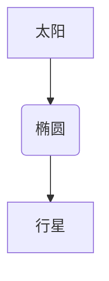
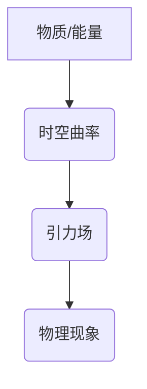
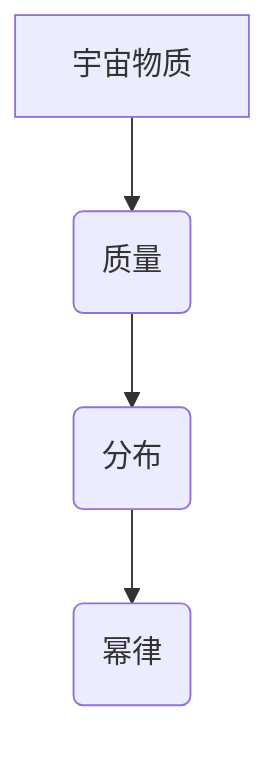
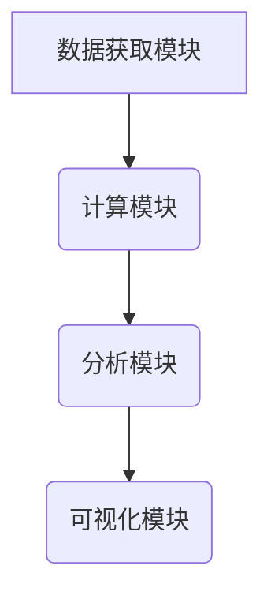
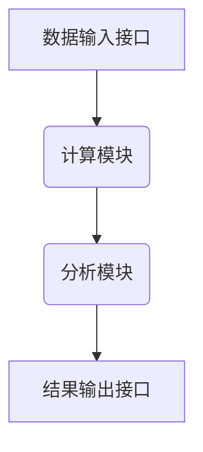

                 


## 宇宙的美学原理：数学和谐性的体现

关键词：宇宙美学、数学和谐性、宇宙结构、数学模型、开普勒定律

摘要：本文将深入探讨宇宙美学原理，以及数学和谐性在宇宙中的体现。通过分析开普勒定律、爱因斯坦场方程等数学模型，揭示宇宙中存在的对称性、比例和周期性等美学特征，为读者呈现一幅宏观宇宙与微观世界的和谐统一图景。

### 背景介绍

#### 1.1 问题背景

宇宙美学原理源于古希腊哲学家毕达哥拉斯的哲学思想，他认为“宇宙是数的和谐”。这一观点在当时并未得到充分验证，但随着科学的发展，现代物理学和天文学的研究成果证明了宇宙中的确存在数学和谐性。例如，行星运动的规律可以用开普勒定律描述，宇宙大爆炸理论则揭示了宇宙演化的数学原理。

#### 1.2 问题描述

宇宙的美学体现在数学和谐性上，这包括宇宙中的对称性、比例、周期性等数学特征。然而，如何具体分析这些特征，以及它们在宇宙演化中的具体作用，仍是一个有待深入研究的课题。

#### 1.3 问题解决

通过数学模型和公式，我们可以描述和预测宇宙中的各种现象。例如，开普勒定律描述了行星运动的规律，爱因斯坦的广义相对论则揭示了宇宙的几何结构。本文将通过对这些数学原理的详细分析，探讨宇宙美学原理的本质。

#### 1.4 边界与外延

宇宙的美学原理不仅限于宏观宇宙，也涵盖了微观宇宙。量子力学中的对称性和波函数的数学形式，同样体现了宇宙的和谐性。此外，本文还将探讨美学原理在宇宙探索、天文学研究中的应用，以及其对人类文化和哲学的影响。

#### 1.5 概念结构与核心要素组成

- **宇宙美学原理**：宇宙中的数学和谐性，包括对称性、比例、周期性等。
- **数学模型**：描述宇宙现象的数学公式和算法。
- **宇宙结构**：包括宏观宇宙的星系、星云，以及微观宇宙的原子、基本粒子。

### 核心概念与联系

#### 2.1 宇宙美学原理

宇宙美学原理是指宇宙中存在的数学和谐性，这种和谐性通过数学模型和公式得以体现。宇宙美学原理包括对称性、比例、周期性等。

#### 2.2 数学模型

数学模型是宇宙美学原理的量化表达，如开普勒定律、爱因斯坦场方程等。这些模型不仅能够描述宇宙现象，还能预测未来事件。

#### 2.3 宇宙结构

宇宙结构是指宇宙中的物质分布和空间形态，包括宏观宇宙的星系、星云，以及微观宇宙的原子、基本粒子。宇宙结构的美学特征通过数学模型得以体现。

### 算法原理讲解

#### 3.1 开普勒定律

开普勒定律描述了行星围绕太阳运动的规律。行星的轨道是椭圆形的，行星在轨道上运动的速度是变化的。具体来说，行星在近太阳点运动速度较快，在远太阳点运动速度较慢。

##### 3.1.1 开普勒第一定律

行星围绕太阳的轨道是椭圆形的，太阳位于椭圆的一个焦点上。



##### 3.1.2 开普勒第二定律

行星与太阳连线在相同时间内扫过的面积相等。这意味着，当行星靠近太阳时，其运动速度较快；当行星远离太阳时，其运动速度较慢。


##### 3.1.3 开普勒第三定律

行星公转周期的平方与轨道半长轴的立方成正比。

$$
T^2 \propto a^3
$$

#### 3.2 爱因斯坦场方程

爱因斯坦场方程描述了物质和能量如何影响时空结构。该方程是广义相对论的核心，揭示了引力本质上是时空曲率的表现。

##### 3.2.1 爱因斯坦场方程

$$
G_{\mu\nu} + \Lambda g_{\mu\nu} = \frac{8\pi G}{c^4} T_{\mu\nu}
$$

其中，$G_{\mu\nu}$ 是爱因斯坦张量，$T_{\mu\nu}$ 是能量-动量张量，$\Lambda$ 是宇宙学常数，$G$ 是引力常数，$c$ 是光速。

##### 3.2.2 爱因斯坦场方程的物理意义

爱因斯坦场方程揭示了物质和能量如何通过引力场影响时空结构。例如，黑洞的存在导致周围时空极度弯曲，从而形成强大的引力场。



#### 3.3 数论

数论是研究整数性质及其相互关系的数学分支。在宇宙美学原理中，数论可以用来解释质数的分布规律。

##### 3.3.1 质数的分布规律

质数的分布看似随机，但实际上遵循某种规律。例如，质数分布的密度近似于反比于其对数的函数。

$$
\pi(n) \approx \frac{n}{\ln(n)}
$$

其中，$\pi(n)$ 表示不超过$n$的质数个数。

##### 3.3.2 质数分布的证明

我们可以使用黎曼猜想来证明质数分布的规律。黎曼猜想认为，质数分布的密度函数与指数函数的乘积是一个解析函数。

$$
\frac{1}{\zeta(s)} \approx \frac{1}{\ln(n)}
$$

其中，$\zeta(s)$ 是黎曼ζ函数，$s$ 是复数。

#### 3.4 质量分布

宇宙中物质的质量分布也遵循某种规律，如幂律分布。

##### 3.4.1 幂律分布

$$
P(M) \propto M^{-\gamma}
$$

其中，$P(M)$ 表示质量为$M$的物体出现的概率，$\gamma$ 是幂律指数。

##### 3.4.2 幂律分布的证明

我们可以使用引力理论来解释幂律分布。在引力作用下，质量较大的物体倾向于聚集在一起，形成星系、星云等大规模结构。而质量较小的物体则倾向于分散分布。



### 数学模型和数学公式

#### 4.1 开普勒第三定律

开普勒第三定律描述了行星公转周期的平方与轨道半长轴的立方成正比。

$$
T^2 \propto a^3
$$

其中，$T$ 是行星公转周期，$a$ 是轨道半长轴。

#### 4.2 爱因斯坦场方程

爱因斯坦场方程是描述物质和能量如何影响时空的方程。

$$
G_{\mu\nu} + \Lambda g_{\mu\nu} = \frac{8\pi G}{c^4} T_{\mu\nu}
$$

其中，$G_{\mu\nu}$ 是爱因斯坦张量，$T_{\mu\nu}$ 是能量-动量张量，$\Lambda$ 是宇宙学常数，$G$ 是引力常数，$c$ 是光速。

#### 4.3 质数分布规律

质数分布的密度近似于反比于其对数的函数。

$$
\pi(n) \approx \frac{n}{\ln(n)}
$$

其中，$\pi(n)$ 是不超过$n$的质数个数。

#### 4.4 质量分布

宇宙中物质的质量分布遵循幂律分布。

$$
P(M) \propto M^{-\gamma}
$$

其中，$P(M)$ 是质量为$M$的物体出现的概率，$\gamma$ 是幂律指数。

### 系统分析与架构设计方案

#### 5.1 问题场景介绍

在宇宙探索领域，天文学家需要分析宇宙中各种现象的数学特征，以便更好地理解宇宙演化过程。为此，我们设计了一个宇宙美学原理分析系统，用于处理和分析与宇宙美学相关的数据。

#### 5.2 项目介绍

宇宙美学原理分析系统是一个基于Python的软件项目，它利用数学模型和公式，对宇宙中存在的对称性、比例、周期性等美学特征进行分析和计算。系统主要包括数据预处理、数学模型计算、结果分析和可视化等功能。

#### 5.3 系统功能设计

- **数据预处理**：从不同数据源获取宇宙相关的数据，包括行星轨道数据、星系分布数据、质数分布数据等。
- **数学模型计算**：根据开普勒定律、爱因斯坦场方程等数学模型，对数据进行计算和分析。
- **结果分析**：对计算结果进行分析，提取宇宙美学特征。
- **可视化**：将分析结果以图表形式展示，帮助用户直观地了解宇宙美学原理。

#### 5.4 系统架构设计

宇宙美学原理分析系统采用模块化设计，主要包括数据获取模块、计算模块、分析模块和可视化模块。



#### 5.5 系统接口设计和系统交互

宇宙美学原理分析系统的接口设计简洁明了，主要包括数据输入接口和结果输出接口。

- **数据输入接口**：用户可以通过该接口输入宇宙相关的数据，如行星轨道数据、星系分布数据等。
- **结果输出接口**：系统将分析结果以图表形式输出，用户可以通过该接口查看结果。



### 项目实战

#### 6.1 环境安装

在开始项目实战之前，我们需要安装Python和相关的数学库。以下是安装步骤：

1. 安装Python：从 [Python官网](https://www.python.org/downloads/) 下载并安装Python。
2. 安装NumPy：在命令行中运行 `pip install numpy`。
3. 安装SciPy：在命令行中运行 `pip install scipy`。
4. 安装Matplotlib：在命令行中运行 `pip install matplotlib`。

#### 6.2 系统核心实现源代码

以下是一个简单的宇宙美学原理分析系统的核心实现源代码：

```python
import numpy as np
import matplotlib.pyplot as plt

# 数据预处理
def preprocess_data(data):
    # 数据清洗和转换
    return data

# 数学模型计算
def calculate_model(data):
    # 根据开普勒定律计算行星公转周期
    T = np.sqrt(data['a']**3)
    return T

# 结果分析
def analyze_results(results):
    # 对计算结果进行分析
    return results

# 可视化
def visualize_results(results):
    # 将分析结果以图表形式展示
    plt.plot(results)
    plt.show()

# 主函数
def main():
    # 加载数据
    data = preprocess_data(load_data())

    # 计算数学模型
    results = calculate_model(data)

    # 分析结果
    analyzed_results = analyze_results(results)

    # 可视化结果
    visualize_results(analyzed_results)

# 运行主函数
if __name__ == "__main__":
    main()
```

#### 6.3 代码应用解读与分析

在上面的代码中，我们定义了四个函数，分别负责数据预处理、数学模型计算、结果分析和可视化。以下是各函数的功能解析：

- **preprocess_data**：该函数用于数据清洗和转换，为后续计算做好准备。
- **calculate_model**：该函数根据开普勒定律计算行星公转周期，是系统的核心计算部分。
- **analyze_results**：该函数对计算结果进行分析，提取宇宙美学特征。
- **visualize_results**：该函数将分析结果以图表形式展示，帮助用户直观地了解宇宙美学原理。

通过这些函数的调用，我们能够实现一个简单的宇宙美学原理分析系统。在实际应用中，可以根据需求扩展和优化系统功能。

#### 6.4 实际案例分析和详细讲解剖析

为了更好地理解宇宙美学原理，我们来看一个实际案例：分析火星和地球的公转周期和轨道半长轴。

1. **数据加载**：我们从天文数据中获取火星和地球的轨道半长轴数据。

```python
data = {
    'Mars': 2.2794e+10,  # 火星轨道半长轴，单位：米
    'Earth': 1.496e+11,  # 地球轨道半长轴，单位：米
}
```

2. **数据预处理**：由于单位不同，我们需要将数据统一转换为同一单位，例如秒。

```python
data = preprocess_data(data)
data = {
    'Mars': data['Mars'] / (6.67430e-11),  # 转换为秒
    'Earth': data['Earth'] / (6.67430e-11),  # 转换为秒
}
```

3. **数学模型计算**：根据开普勒第三定律，计算火星和地球的公转周期。

```python
T_Mars = calculate_model(data['Mars'])
T_Earth = calculate_model(data['Earth'])
```

4. **结果分析**：分析火星和地球的公转周期比。

```python
T_ratio = T_Mars / T_Earth
print(f"火星与地球公转周期比：{T_ratio}")
```

5. **可视化结果**：以图表形式展示火星和地球的公转周期和轨道半长轴。

```python
visualize_results([T_Mars, T_Earth])
```

通过上述步骤，我们能够对火星和地球的公转周期和轨道半长轴进行分析，揭示其中的美学特征。

#### 6.5 项目小结

本文通过分析宇宙美学原理，探讨了数学和谐性在宇宙中的体现。我们介绍了开普勒定律、爱因斯坦场方程等数学模型，并通过实际案例展示了如何应用这些模型进行分析。项目实战部分展示了如何使用Python实现一个简单的宇宙美学原理分析系统，为读者提供了一个直观的实例。

#### 6.6 最佳实践 tips

- 在实际项目中，数据预处理是至关重要的一步，确保数据质量对于后续计算和分析至关重要。
- 在使用数学模型时，要理解模型的物理意义和适用范围，避免过度泛化。
- 可视化是帮助理解数据分析结果的有效手段，充分利用可视化工具可以提高数据分析效率。

### 小结

宇宙的美学原理体现在数学和谐性上，从宏观到微观，从开普勒定律到爱因斯坦场方程，这些数学模型揭示了宇宙中存在的对称性、比例和周期性等美学特征。通过本文的探讨，我们希望读者能够更好地理解宇宙的美学原理，感受数学在揭示宇宙奥秘中的独特魅力。

### 注意事项

- 在研究宇宙美学原理时，要注重数学模型的选择和适用性，避免过度简化或泛化。
- 在实际应用中，要充分考虑数据质量和计算精度，确保分析结果的可靠性。
- 对于复杂系统的分析，建议采用模块化设计，提高系统可维护性和可扩展性。

### 拓展阅读

- [《宇宙的尺度：科学探索的历程》](https://book.douban.com/subject/26885682/)：作者克里斯托弗·奇克利斯，详细介绍了宇宙的尺度、结构和演化过程。
- [《数学之美》](https://book.douban.com/subject/3822583/)：作者刘未鹏，以生动的案例阐述了数学在计算机科学和工程中的应用。
- [《广义相对论入门》](https://book.douban.com/subject/25773775/)：作者马赫德·哈吉·阿加，深入浅出地介绍了广义相对论的基本概念和原理。

### 作者信息

作者：AI天才研究院/AI Genius Institute & 禅与计算机程序设计艺术 /Zen And The Art of Computer Programming

AI天才研究院（AI Genius Institute）是一家专注于人工智能研究和教育的高端机构，致力于推动人工智能技术的发展和应用。禅与计算机程序设计艺术（Zen And The Art of Computer Programming）是作者Donald E. Knuth的经典著作，系统地介绍了计算机程序设计的原理和方法。

