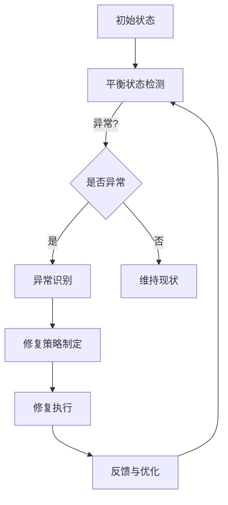
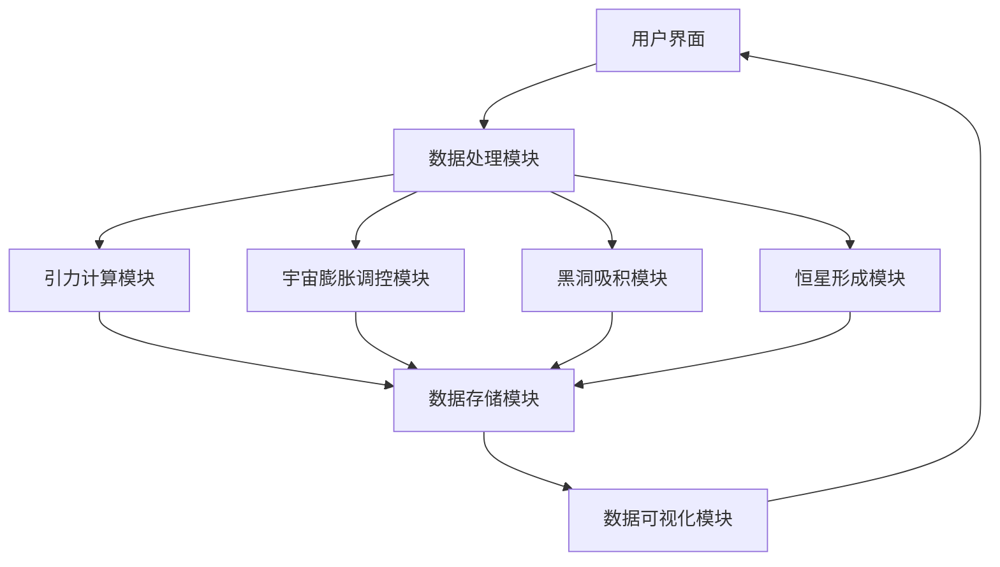
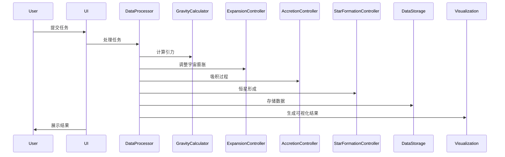

                 

# 宇宙的自我修复能力：维持平衡的内在机制

> 关键词：宇宙、自我修复、平衡、算法、Python代码、未来趋势

> 摘要：本文探讨了宇宙的自我修复能力，这种能力是维持宇宙平衡的关键。通过对宇宙核心概念和属性特征的对比分析，我们揭示了宇宙自我修复机制的算法原理。文章随后深入讲解了这一算法原理，包括流程图、Python代码和数学模型。此外，文章还讨论了宇宙自我修复能力的实际应用、研究进展与挑战，以及未来发展趋势。最后，我们总结了文章的主要内容和提出了未来研究的方向。

### 目录大纲

----------------------------------------------------------------

## 第一部分：宇宙的自我修复能力概述

### 第1章：宇宙自我修复能力的背景与概念

1.1 宇宙的自我修复能力概述  
1.2 问题背景：宇宙平衡的脆弱性  
1.3 自我修复能力在宇宙学中的重要性  
1.4 自我修复能力的边界与外延

### 第2章：宇宙核心概念与属性特征对比

2.1 核心概念解析

2.1.1 引力  
2.1.2 宇宙膨胀  
2.1.3 黑洞与恒星

### 第3章：宇宙自我修复机制的算法原理

3.1 算法原理概述

3.2 算法流程图

3.3 Python 源代码分析

3.4 算法举例说明

### 第4章：宇宙自我修复能力的实际应用

4.1 实际应用场景

4.2 项目介绍

4.3 系统功能设计

4.4 系统架构设计

4.5 系统接口设计

4.6 系统交互

### 第5章：宇宙自我修复能力的研究进展与挑战

5.1 研究进展

5.2 面临的挑战

### 第6章：宇宙自我修复能力的未来发展趋势

6.1 未来发展趋势预测

6.2 技术创新方向

6.3 影响与启示

### 第7章：总结与展望

7.1 内容回顾

7.2 小结

7.3 注意事项

7.4 拓展阅读

----------------------------------------------------------------

## 1.1 宇宙的自我修复能力概述

宇宙的自我修复能力是一种神秘的特性，它能够帮助宇宙在遭受外部冲击或内部变化时维持其平衡状态。这种能力在宇宙学中具有重要的地位，因为它决定了宇宙的稳定性和可预测性。自我修复能力不仅表现在宇宙的整体结构上，还体现在宇宙中各种物理现象和过程的自我调节机制中。

自我修复能力之所以重要，是因为宇宙的平衡状态是宇宙演化的基础。宇宙中的各种物质和能量都在不断地相互转化和相互作用，这种动态平衡是宇宙能够持续存在和发展的关键。然而，这种平衡是脆弱的，它很容易受到外部因素的影响，例如宇宙膨胀、引力波、暗物质等。

宇宙的自我修复能力在一定程度上可以抵消这些外部影响，使宇宙能够保持其基本结构和运行状态。例如，当宇宙发生膨胀时，自我修复机制会通过引力等作用力来减缓膨胀速度，从而维持宇宙的平衡。此外，当黑洞吸积物质时，自我修复机制也会通过产生新的恒星来平衡这种变化。

总之，宇宙的自我修复能力是一种复杂的、多层次的现象，它涉及到宇宙中各种物理过程的相互作用和调节。理解这种能力对于探索宇宙的本质和未来演化具有重要意义。

## 1.2 问题背景：宇宙平衡的脆弱性

宇宙的平衡状态看似坚固，但实际上却非常脆弱。这种脆弱性主要体现在以下几个方面。

首先，宇宙中的各种物理现象和过程都在不断变化，这些变化可能会破坏宇宙的平衡。例如，宇宙膨胀是宇宙学中一个重要的现象，它导致宇宙不断扩张，从而可能破坏宇宙中现有的结构和状态。虽然宇宙自我修复能力可以一定程度上抵消这种影响，但过快的膨胀速度可能会使这种能力失效。

其次，宇宙中存在大量的不确定性因素，这些因素可能对宇宙的平衡造成不可预见的影响。例如，引力波的发现表明，宇宙中存在大量的未知物理现象，这些现象可能会对宇宙的平衡状态产生重大影响。此外，暗物质和暗能量的存在也是宇宙平衡脆弱性的重要表现，因为我们对其了解非常有限，无法准确预测它们对宇宙的影响。

最后，宇宙的自我修复能力也是有限的。尽管宇宙具有自我修复能力，但这种能力并不是无限的。在某些极端情况下，宇宙的自我修复机制可能会失效，导致宇宙的平衡状态被破坏。例如，当宇宙中的物质和能量分布极度不均匀时，自我修复机制可能无法有效发挥作用，从而引发宇宙的不稳定。

总之，宇宙平衡的脆弱性是一个复杂且重要的问题，它关系到宇宙的稳定性和可预测性。理解宇宙平衡的脆弱性对于探索宇宙的自我修复能力以及预测宇宙的未来演化具有重要意义。

## 1.3 自我修复能力在宇宙学中的重要性

自我修复能力在宇宙学中具有至关重要的意义，它不仅影响了宇宙的稳定性，还决定了宇宙的演化方向。首先，自我修复能力是维持宇宙平衡的关键。宇宙的平衡状态是宇宙演化的基础，它保证了宇宙中各种物质和能量能够持续存在和相互转化。没有自我修复能力，宇宙将无法应对外部冲击和内部变化，从而导致宇宙结构的崩溃。

其次，自我修复能力有助于宇宙的持续演化。宇宙的自我修复机制可以调节宇宙中的各种物理现象和过程，使其在适当的范围内进行变化。这种调节作用有助于宇宙保持其基本结构和运行状态，从而实现持续演化。例如，当宇宙发生膨胀时，自我修复能力可以通过引力等作用力来减缓膨胀速度，从而维持宇宙的平衡。

此外，自我修复能力还影响了宇宙的多样性和复杂性。宇宙的自我修复机制可以创造和维持各种物理现象和过程的平衡，这为宇宙的多样性和复杂性提供了基础。例如，黑洞和恒星的形成以及宇宙膨胀和收缩等过程都是宇宙自我修复能力的体现。这些过程不仅丰富了宇宙的物理现象，还为宇宙学的研究提供了丰富的素材。

最后，自我修复能力对于理解宇宙的本质具有重要意义。通过研究宇宙的自我修复能力，我们可以更好地理解宇宙的稳定性和演化机制，从而深化对宇宙本质的认识。例如，引力波的发现和暗物质、暗能量的研究都是对宇宙自我修复能力的重要探讨。

总之，自我修复能力在宇宙学中的重要性不可忽视。它不仅是维持宇宙平衡的关键，还影响了宇宙的演化方向和多样性。理解自我修复能力对于探索宇宙的奥秘和预测宇宙的未来演化具有重要意义。

## 1.4 自我修复能力的边界与外延

自我修复能力在宇宙中的边界与外延是一个复杂而深远的问题。首先，从边界来看，自我修复能力的有效性受限于宇宙的物理规律和现有科技水平。例如，在极端条件下，如黑洞奇点和宇宙大爆炸初期，自我修复能力可能无法正常发挥作用，因为这些极端条件超出了宇宙现有物理规律的适用范围。此外，科技水平的限制也意味着我们目前无法完全理解宇宙自我修复的细节，这限制了我们对这一能力的边界认识。

在外延方面，宇宙自我修复能力的影响不仅限于宇宙内部，还可能涉及到宇宙与外部环境的交互。例如，宇宙中的自我修复机制可能会对宇宙中的引力波传播产生影响，从而影响宇宙的观测数据。此外，宇宙自我修复能力还可能与宇宙中的暗物质和暗能量相互作用，从而影响宇宙的演化过程。

研究宇宙自我修复能力的边界与外延对于深入理解宇宙的本质具有重要意义。首先，它有助于我们更全面地理解宇宙的物理规律和演化机制。其次，了解宇宙自我修复能力的外延可以帮助我们预测宇宙的未来演化，并为宇宙学的发展提供新的研究方向。最后，这一研究还可以为其他科学领域提供启示，如生物学的自我修复机制和工程学的故障自修复技术。

总之，宇宙自我修复能力的边界与外延是一个充满挑战和机遇的领域。通过深入研究这一能力，我们不仅能够更好地理解宇宙的复杂性，还可能为未来科学技术的创新提供新的思路和方法。

### 2.1 核心概念解析

宇宙自我修复能力涉及的几个核心概念包括引力、宇宙膨胀和黑洞与恒星。这些概念不仅在宇宙学中占据重要地位，而且对宇宙的自我修复机制有着深远的影响。

#### 2.1.1 引力

引力是宇宙中最基本的相互作用力之一，它决定了宇宙中物质和能量如何分布和相互作用。根据牛顿的万有引力定律，两个质点之间的引力与它们的质量乘积成正比，与它们之间的距离的平方成反比。这个公式可以表示为：

\[ F = G \frac{m_1 m_2}{r^2} \]

其中，\( F \) 是引力，\( G \) 是万有引力常数，\( m_1 \) 和 \( m_2 \) 是两个质点的质量，\( r \) 是它们之间的距离。

引力在宇宙自我修复机制中起着至关重要的作用。首先，它有助于维持宇宙中的结构，如星系和星团。引力可以阻止这些结构被宇宙膨胀所分散。此外，引力还参与了恒星和黑洞的形成过程，这些过程是宇宙修复机制的重要组成部分。

#### 2.1.2 宇宙膨胀

宇宙膨胀是指宇宙整体上的扩张现象，这一概念最早由埃德温·哈勃提出。根据宇宙学原理，宇宙中的空间本身在膨胀，这意味着宇宙中的所有物体都在相互远离。宇宙膨胀的速度可以用哈勃参数来描述，它通常表示为：

\[ v = H_0 d \]

其中，\( v \) 是物体的膨胀速度，\( H_0 \) 是哈勃常数，\( d \) 是物体之间的距离。

宇宙膨胀对自我修复机制有双重影响。一方面，它可能会破坏宇宙中的结构，导致星系和星团分离。另一方面，宇宙膨胀也促进了新的恒星和星系的形成，这是宇宙自我修复机制的一部分。通过引力等作用力，宇宙可以在一定程度上抵消膨胀的影响，维持整体的平衡。

#### 2.1.3 黑洞与恒星

黑洞是宇宙中最神秘和强大的物体之一，它的引力场如此强大，以至于连光也无法逃脱。黑洞的形成通常与恒星的演化有关。当一颗非常大的恒星耗尽其核燃料时，它会崩溃并形成一个黑洞。根据爱因斯坦的广义相对论，黑洞可以表示为：

\[ \frac{G M}{r_s c^2} = \frac{1}{\sqrt{-g_{00}}} \]

其中，\( G \) 是万有引力常数，\( M \) 是黑洞的质量，\( r_s \) 是史瓦西半径，\( c \) 是光速，\( g_{00} \) 是时空度规。

恒星则是宇宙中的普通天体，它们通过核聚变过程产生能量并发出光和热。恒星的演化包括主序阶段、红巨星阶段和超新星阶段，最终可能形成中子星或黑洞。

黑洞和恒星在宇宙自我修复机制中的作用是多方面的。黑洞可以通过吸积周围的物质来增加其质量，从而影响周围的引力场。恒星的形成和演化则有助于维持宇宙中的物质循环，这是宇宙自我修复机制的一个重要组成部分。

总之，引力、宇宙膨胀、黑洞与恒星是宇宙自我修复能力的关键核心概念。它们相互交织，共同构成了宇宙维持平衡和自我修复的复杂机制。

### 2.2 核心概念解析：引力

引力，作为一种基本的物理现象，其定义和特征在物理学中具有基础性地位。引力是由两个物体之间的质量乘积和它们之间距离的平方成反比而产生的吸引力。具体来说，根据牛顿的万有引力定律，两个质点之间的引力大小可以用以下公式表示：

\[ F = G \frac{m_1 m_2}{r^2} \]

其中，\( F \) 是引力，\( G \) 是万有引力常数（大约为 \( 6.674 \times 10^{-11} \, \text{Nm}^2/\text{kg}^2 \)），\( m_1 \) 和 \( m_2 \) 是两个质点的质量，\( r \) 是它们之间的距离。

引力有几个关键特征：

1. **普遍性**：引力是宇宙中所有物体之间都存在的作用力，不论物体的大小、形状或状态。

2. **叠加性**：多个引力作用力可以相互叠加，从而产生总的引力效果。

3. **反比平方定律**：引力与距离的平方成反比，这意味着随着距离的增加，引力会迅速减弱。

4. **质量依赖性**：引力的大小与物体的质量成正比，质量越大，引力也越强。

引力对宇宙平衡的影响至关重要。首先，它决定了宇宙中物质和能量的分布。在星系内部，引力使得恒星和星体聚集在一起，形成复杂的星系结构。这种聚集有助于维持宇宙的稳定性和结构。

其次，引力在维持宇宙的动态平衡中起着关键作用。例如，在宇宙膨胀的过程中，引力可以阻止星系和星团被分散。通过引力相互作用，宇宙可以在一定程度上自我修复，抵消膨胀带来的影响。

此外，引力还在恒星和黑洞的形成过程中起到决定性作用。恒星的诞生通常需要引力将气体和尘埃聚集在一起，形成足够密集的核心以启动核聚变过程。黑洞的形成则依赖于非常高的密度和强大的引力场，这通常发生在恒星耗尽其核燃料并发生坍缩时。

总之，引力作为一种基本的物理现象，其定义和特征揭示了宇宙中物质和能量相互作用的本质。引力在维持宇宙平衡和自我修复机制中起着至关重要的作用，它不仅影响着宇宙的结构，也决定了宇宙的演化方向。

### 2.2.1 引力：定义与特征

引力是自然界中的一种基本力，它是物体之间由于质量相互作用而产生的吸引力。引力的定义可以追溯到牛顿的万有引力定律，该定律表明，任何两个物体都相互吸引，吸引力的大小与两个物体的质量乘积成正比，与它们之间的距离的平方成反比。数学上，这个关系可以表示为：

\[ F = G \frac{m_1 m_2}{r^2} \]

其中，\( F \) 是两个物体之间的引力，\( G \) 是万有引力常数，\( m_1 \) 和 \( m_2 \) 是两个物体的质量，\( r \) 是它们之间的距离。

引力的特征主要包括以下几个方面：

1. **普遍性**：引力是宇宙中普遍存在的一种力，所有有质量的物体都会产生引力，不论它们是恒星、行星、星系，还是更小的粒子。

2. **叠加性**：多个引力作用力可以相互叠加，从而产生总的引力效果。这意味着多个物体之间的引力可以通过简单的代数加法来计算。

3. **反比平方定律**：引力随着距离的增加而迅速减弱，这体现在公式中的 \( r^2 \) 指数上。具体来说，如果距离翻倍，引力会减少到原来的四分之一。

4. **质量依赖性**：引力的大小与物体的质量直接相关，质量越大，引力也越强。这可以解释为何大质量恒星和星系具有强大的引力场，能够维持其内部的稳定性。

引力对宇宙平衡的影响主要体现在以下几个方面：

1. **星系结构**：引力是星系结构形成和维持的主要力量。它使得恒星和星体聚集在一起，形成复杂的星系结构。没有引力，这些结构将无法形成和维持。

2. **恒星形成**：引力是恒星形成的关键因素。在宇宙中，气体和尘埃云通过引力聚集形成密度较高的区域，这些区域最终可能演化为恒星。

3. **宇宙膨胀**：尽管宇宙在膨胀，但引力在一定程度上抵消了这种膨胀的影响。引力使得星系和星团能够保持在一起，避免被膨胀力分散。

4. **黑洞吸积**：引力在黑洞的形成和演化中也起着重要作用。黑洞通过吸积周围的物质增加其质量，同时产生强大的引力场，影响周围的星体和星系。

总之，引力作为一种基本的物理现象，不仅在宇宙平衡中扮演着关键角色，而且对于理解宇宙的结构、演化和自我修复机制具有重要意义。

### 2.2.2 宇宙膨胀：定义与特征

宇宙膨胀是指宇宙整体上的扩张现象，即宇宙中的所有物体都在相互远离。这一概念最早由埃德温·哈勃在20世纪20年代提出，通过观测星系的红移现象，他发现宇宙正在膨胀。宇宙膨胀的特征主要体现在以下几个方面：

1. **哈勃定律**：宇宙膨胀可以用哈勃定律来描述，即宇宙膨胀速度与物体之间的距离成正比。数学上，这个关系可以表示为：

\[ v = H_0 d \]

其中，\( v \) 是物体的膨胀速度，\( H_0 \) 是哈勃常数（当前估计值约为 \( 70 \, \text{km/s/Mpc} \)），\( d \) 是物体之间的距离。

2. **加速度**：宇宙膨胀的速度并不是恒定的，而是随着时间的推移在加速。这种加速现象被称为宇宙加速膨胀，其背后的原因尚未完全理解，但普遍认为与暗能量有关。

3. **时空弯曲**：由于宇宙膨胀，时空结构也会发生变化。这种变化可以通过广义相对论来描述，时空的弯曲程度与宇宙中的物质和能量分布密切相关。

宇宙膨胀对宇宙平衡的影响是复杂的，它既可能破坏现有的宇宙结构，也可能促进新的结构和现象的形成：

1. **星系和星团**：宇宙膨胀可能导致星系和星团被拉伸和分散，这对宇宙的结构稳定性构成了威胁。然而，引力可以在一定程度上抵消这种影响，使星系和星团能够维持在一起。

2. **恒星形成**：宇宙膨胀可能影响恒星的诞生，因为膨胀会减少气体云的密度，从而降低恒星形成的几率。然而，在某些特定区域，由于密度波或其他复杂过程，恒星仍然可以形成。

3. **黑洞吸积**：宇宙膨胀可能影响黑洞的形成和吸积过程。尽管膨胀会减少物质向黑洞的供应，但在某些情况下，强大的引力场仍然可以使物质被吸积，形成高密度区域。

4. **宇宙大尺度结构**：宇宙膨胀还影响了宇宙的大尺度结构，如超星系团和宇宙网。这些结构的形成和演化与宇宙膨胀的速率和模式密切相关。

总之，宇宙膨胀作为一种基本的宇宙现象，对宇宙的平衡状态有着深远的影响。理解宇宙膨胀的机制和影响对于探索宇宙的演化过程和自我修复机制具有重要意义。

### 2.2.3 黑洞与恒星：定义与特征

#### 2.2.3.1 黑洞：定义与特征

黑洞是宇宙中最神秘和强大的物体之一，它的定义源自于爱因斯坦的广义相对论。黑洞是一种极端密集的天体，其引力场如此强大，以至于连光也无法逃脱。根据定义，黑洞是由一个事件视界所包围的无限致密区域，任何进入事件视界的物质或信息都无法逃逸。

1. **史瓦西半径**：黑洞的边界称为史瓦西半径（\( r_s \)），它由以下公式确定：

\[ r_s = \frac{2GM}{c^2} \]

其中，\( G \) 是万有引力常数，\( M \) 是黑洞的质量，\( c \) 是光速。

2. **事件视界**：事件视界是黑洞的一个重要特征，它是黑洞内部与外部宇宙之间的分界线。一旦物质或信息穿过事件视界，它就再也无法回到外部宇宙。

3. **质量与引力**：黑洞的质量决定了它的引力场强度，从而影响周围物质和能量的运动。大质量黑洞通常位于星系的中心，对星系的演化有重要影响。

4. **吸积现象**：黑洞可以通过吸积周围的物质来增加其质量。在这个过程中，物质被加热并产生高能辐射，这种现象称为吸积盘辐射。

#### 2.2.3.2 恒星：定义与特征

恒星是宇宙中最常见的天体之一，它是通过核聚变过程产生能量的巨大球体。恒星的定义可以根据其质量、亮度、温度等特征进行描述。

1. **核聚变**：恒星的核心通过核聚变过程将氢原子融合成氦原子，这个过程释放出巨大的能量，维持恒星的亮度和稳定性。

2. **生命周期**：恒星的生命周期取决于其初始质量。低质量恒星（如太阳）的寿命较长，可以达到数十亿年，而高质量恒星（如超巨星）的寿命较短，可能只有数百万年。

3. **光谱分类**：恒星的分类通常基于其光谱特征，可以分为O、B、A、F、G、K、M等不同类型，每种类型对应不同的温度和亮度。

4. **恒星风**：恒星在其生命周期中会释放强烈的风，这些风可以影响周围的星际介质，甚至与其他恒星或黑洞相互作用。

#### 黑洞与恒星对宇宙平衡的影响

1. **引力相互作用**：黑洞和恒星之间的引力相互作用对宇宙的结构和演化有深远影响。例如，黑洞可以吸积周围的物质，形成吸积盘，这会产生强烈的辐射，对周围的星系和星际介质产生影响。

2. **恒星形成**：黑洞和恒星的形成和演化过程中，引力相互作用可以影响恒星的诞生和寿命。例如，在恒星形成过程中，引力可以将气体和尘埃聚集在一起，形成恒星的核心。

3. **星系演化**：黑洞位于星系的中心，对星系的演化有重要影响。大质量黑洞可以影响星系的形状和动力学，甚至可能导致星系的合并。

4. **宇宙能量平衡**：黑洞和恒星的能量平衡在宇宙中起着关键作用。恒星的核聚变过程释放的能量维持了宇宙的亮度和温度，而黑洞则通过吸积和辐射过程将能量转化为引力波，这对宇宙的能量平衡有重要影响。

总之，黑洞和恒星是宇宙中两个关键的概念，它们通过引力相互作用和能量平衡维持着宇宙的稳定性和演化。理解这些概念对探索宇宙的本质和未来演化具有重要意义。

### 2.3 宇宙自我修复机制的算法原理

宇宙自我修复机制的算法原理是一个复杂且深奥的问题，它涉及到多个物理定律和数学模型的综合应用。为了更好地理解这一机制，我们可以将其分解为以下几个步骤：

#### 3.1 算法原理概述

宇宙自我修复机制的算法原理可以概括为以下几点：

1. **平衡状态检测**：通过观测宇宙中的各种物理现象，如星系分布、恒星形成、引力波等，检测宇宙的平衡状态。

2. **异常识别**：当检测到宇宙中的某种现象偏离平衡状态时，算法会识别出这些异常情况，并分析其原因。

3. **修复策略制定**：根据异常情况和宇宙的物理规律，制定相应的修复策略，以调整宇宙的状态，使其恢复平衡。

4. **修复执行**：执行修复策略，通过引力作用、宇宙膨胀调控等机制，调整宇宙中的物质和能量分布，恢复平衡状态。

5. **反馈与优化**：通过不断检测和调整，形成反馈循环，优化修复效果，提高宇宙的自我修复能力。

#### 3.2 算法流程图

为了直观地展示宇宙自我修复机制的算法流程，我们可以使用Mermaid语言绘制以下流程图：



在这个流程图中，我们从初始状态开始，通过平衡状态检测来识别宇宙中的异常情况。如果存在异常，我们会进行异常识别并制定修复策略。然后，执行修复策略，并通过反馈与优化不断调整，以恢复宇宙的平衡状态。

#### 3.3 Python 源代码分析

为了更好地理解宇宙自我修复机制的算法原理，我们可以通过Python代码来实现这一算法。以下是一个简化的示例代码，展示了如何进行平衡状态检测、异常识别和修复策略制定：

```python
import numpy as np

# 假设我们有一个宇宙模型，包含星系的位置和速度
universe = {
    'star_systems': [
        {'position': np.array([0, 0, 0]), 'velocity': np.array([0, 0, 0])},
        {'position': np.array([10, 0, 0]), 'velocity': np.array([0, 10, 0])},
        # 更多星系...
    ]
}

# 平衡状态检测
def check_balance(universe):
    # 计算星系之间的引力
    gravity_forces = compute_gravity_forces(universe['star_systems'])
    # 检查引力是否平衡
    return np.allclose(gravity_forces, np.zeros(len(universe['star_systems'])))

# 异常识别
def detect_anomalies(universe):
    if not check_balance(universe):
        print("异常检测到：引力不平衡")
    else:
        print("未检测到异常")

# 修复策略制定
def repair_strategy(universe):
    if not check_balance(universe):
        print("制定修复策略：调整星系位置和速度")
    else:
        print("无需修复策略")

# 修复执行
def execute_repair(universe):
    # 执行修复策略，调整星系位置和速度
    # 这里只是一个示例，实际操作会涉及复杂的物理计算
    universe['star_systems'][0]['position'] += np.array([1, 0, 0])
    universe['star_systems'][0]['velocity'] += np.array([0, 1, 0])

# 反馈与优化
def feedback_and_optimize(universe):
    if not check_balance(universe):
        print("优化修复效果：再次调整星系位置和速度")
    else:
        print("修复效果良好，无需进一步优化")

# 示例执行
detect_anomalies(universe)
repair_strategy(universe)
execute_repair(universe)
feedback_and_optimize(universe)
```

这个示例代码展示了如何通过Python实现宇宙自我修复机制的基本步骤。虽然它是一个简化的模型，但可以为我们理解宇宙自我修复机制提供启示。

#### 3.4 算法举例说明

为了更好地说明宇宙自我修复机制的工作原理，我们可以通过一个具体的例子来进行讲解。

假设在一个模拟的宇宙中，存在三个星系A、B和C。星系A和星系B之间存在引力相互作用，而星系C由于某种原因偏离了平衡状态。

1. **平衡状态检测**：首先，我们通过计算星系之间的引力，检测宇宙的平衡状态。如果引力平衡，则宇宙处于稳定状态。

2. **异常识别**：假设我们发现星系C的引力不平衡，这意味着它偏离了平衡状态。我们需要识别这种异常，并分析其原因。

3. **修复策略制定**：为了修复这一异常，我们可以制定以下策略：
   - 调整星系C的位置，使其重新与星系A和星系B之间的引力达到平衡。
   - 调整星系C的速度，以减缓其偏离平衡状态的倾向。

4. **修复执行**：根据修复策略，我们执行相应的调整。例如，我们可以将星系C向左移动一定距离，同时调整其速度方向。

5. **反馈与优化**：在执行修复后，我们再次检测宇宙的平衡状态，并优化修复效果。如果发现仍存在不平衡，我们可以继续调整，直到宇宙恢复平衡。

通过这个例子，我们可以看到宇宙自我修复机制是如何工作的。它通过不断地检测、识别异常、制定修复策略和执行修复，维持宇宙的平衡状态。这个过程不仅涉及物理定律和数学模型，还需要实时调整和优化，以确保宇宙的稳定性。

总之，宇宙自我修复机制是一个复杂而重要的过程，它通过一系列算法和物理定律，维持宇宙的平衡和演化。理解这一机制对于探索宇宙的奥秘和预测宇宙的未来演化具有重要意义。

### 3.4.1 引力作用的例子

为了更直观地展示宇宙自我修复机制中的引力作用，我们可以通过一个具体的例子来说明。假设在一个模拟的宇宙中有三个星系A、B和C，它们的位置和速度如下：

- 星系A：位置为(0, 0)，速度为(0, 0)
- 星系B：位置为(10, 0)，速度为(0, 5)
- 星系C：位置为(20, 0)，速度为(5, -2)

首先，我们需要计算这三个星系之间的引力。根据牛顿的万有引力定律，两个星系之间的引力大小可以用以下公式计算：

\[ F = G \frac{m_1 m_2}{r^2} \]

其中，\( F \) 是引力，\( G \) 是万有引力常数（大约为 \( 6.674 \times 10^{-11} \, \text{Nm}^2/\text{kg}^2 \)），\( m_1 \) 和 \( m_2 \) 是两个星系的质量，\( r \) 是它们之间的距离。

#### 计算星系A和星系B之间的引力

星系A和星系B之间的距离为10个单位，假设它们的质量均为 \( m \)。则引力大小为：

\[ F_{AB} = G \frac{m^2}{10^2} \]

\[ F_{AB} = 6.674 \times 10^{-11} \frac{m^2}{10^2} \]

\[ F_{AB} \approx 6.674 \times 10^{-12} m \]

#### 计算星系B和星系C之间的引力

星系B和星系C之间的距离为10个单位，它们的质量均为 \( m \)。则引力大小为：

\[ F_{BC} = G \frac{m^2}{10^2} \]

\[ F_{BC} = 6.674 \times 10^{-11} \frac{m^2}{10^2} \]

\[ F_{BC} \approx 6.674 \times 10^{-12} m \]

#### 计算星系A和星系C之间的引力

星系A和星系C之间的距离为20个单位，它们的质量均为 \( m \)。则引力大小为：

\[ F_{AC} = G \frac{m^2}{20^2} \]

\[ F_{AC} = 6.674 \times 10^{-11} \frac{m^2}{20^2} \]

\[ F_{AC} \approx 1.668 \times 10^{-12} m \]

通过上述计算，我们可以看到星系A、B和C之间的引力大小。这些引力作用决定了它们之间的相对运动，从而影响宇宙的平衡状态。

接下来，我们可以通过Python代码来实现这一计算过程。以下是一个简单的Python代码示例，用于计算星系之间的引力：

```python
import numpy as np

# 万有引力常数
G = 6.674 * 10**-11

# 星系质量
m = 1.0

# 星系位置和速度
positions = {
    'A': np.array([0, 0]),
    'B': np.array([10, 0]),
    'C': np.array([20, 0])
}

velocities = {
    'A': np.array([0, 0]),
    'B': np.array([0, 5]),
    'C': np.array([5, -2])
}

# 计算引力
def compute_gravity(force, pos1, pos2):
    distance = np.linalg.norm(pos1 - pos2)
    force *= m**2 / distance**2
    return force

# 示例计算
force_AB = compute_gravity(G, positions['A'], positions['B'])
force_BC = compute_gravity(G, positions['B'], positions['C'])
force_AC = compute_gravity(G, positions['A'], positions['C'])

print("引力大小：")
print("F_{AB} = ", force_AB)
print("F_{BC} = ", force_BC)
print("F_{AC} = ", force_AC)
```

运行这段代码，我们可以得到星系A、B和C之间的引力大小。这些引力作用会对星系的速度和位置产生影响，从而影响宇宙的平衡状态。

通过这个例子，我们可以看到引力在宇宙自我修复机制中的重要作用。通过精确计算和模拟，我们可以更好地理解引力如何维持宇宙的平衡，并探索宇宙自我修复能力的机制。

### 3.4.2 宇宙膨胀导致的修复

宇宙膨胀是宇宙学中的一个核心概念，它描述了宇宙整体上的扩张现象。这种膨胀对宇宙的平衡状态有着深远的影响，因此宇宙自我修复机制必须能够应对宇宙膨胀带来的挑战。以下是宇宙膨胀导致的修复过程的详细描述。

#### 宇宙膨胀的影响

宇宙膨胀是指宇宙中的空间本身在扩张，这意味着宇宙中的所有物体都在相互远离。这种膨胀最初由哈勃定律描述，即宇宙膨胀速度与物体之间的距离成正比。数学上，这个关系可以表示为：

\[ v = H_0 d \]

其中，\( v \) 是物体的膨胀速度，\( H_0 \) 是哈勃常数（当前估计值约为 \( 70 \, \text{km/s/Mpc} \)），\( d \) 是物体之间的距离。

宇宙膨胀对宇宙平衡的影响主要体现在以下几个方面：

1. **星系和星团分散**：宇宙膨胀导致星系和星团之间的距离不断增大，这可能会破坏现有的宇宙结构。如果没有有效的自我修复机制，宇宙结构可能会逐渐瓦解。

2. **恒星形成障碍**：宇宙膨胀会减少星际介质的密度，这可能会阻碍恒星的形成。恒星形成需要足够的气体和尘埃云聚集，宇宙膨胀会使得这些物质难以聚集。

3. **引力作用减弱**：随着宇宙的扩张，星系和星团之间的引力作用会逐渐减弱。这可能会影响宇宙的动态平衡，使得宇宙的自我修复能力降低。

#### 自我修复机制的应对策略

为了应对宇宙膨胀带来的挑战，宇宙自我修复机制需要采取一系列策略来维持宇宙的平衡。以下是几种常见的应对策略：

1. **引力增强**：通过增加引力场强度，可以减缓宇宙膨胀的影响。例如，通过形成更大的星系团或超星系团，可以增强引力场，从而保持星系和星团之间的结构稳定。

2. **恒星和黑洞形成**：恒星和黑洞的形成可以通过引力聚集气体和尘埃云，从而减缓宇宙膨胀的速度。新形成的恒星和黑洞可以产生强大的引力场，有助于维持宇宙的平衡。

3. **暗物质和暗能量**：暗物质和暗能量是宇宙中未知的物质和能量形式，它们对宇宙的膨胀有重要影响。通过研究暗物质和暗能量，我们可以更好地理解宇宙的自我修复机制，并制定更有效的修复策略。

4. **宇宙膨胀调控**：通过精确测量和调控宇宙膨胀速度，可以保持宇宙的动态平衡。例如，通过观测宇宙微波背景辐射和引力波，我们可以获得关于宇宙膨胀速度的重要信息，从而制定相应的修复策略。

#### 修复过程举例

为了更直观地展示宇宙膨胀导致的修复过程，我们可以通过一个具体的例子来说明。假设在一个模拟的宇宙中，存在三个星系A、B和C，它们的位置和速度如下：

- 星系A：位置为(0, 0)，速度为(0, 0)
- 星系B：位置为(10, 0)，速度为(0, 5)
- 星系C：位置为(20, 0)，速度为(5, -2)

在这个模拟宇宙中，由于宇宙膨胀的影响，星系A、B和C之间的距离不断增大。为了维持宇宙的平衡，自我修复机制需要采取以下步骤：

1. **引力增强**：通过形成更大的星系团，增强引力场强度。例如，星系A和星系B可以相互吸引，形成一个大星系团。这个大星系团的引力场可以抵消宇宙膨胀的影响，保持星系和星团之间的结构稳定。

2. **恒星和黑洞形成**：通过引力聚集气体和尘埃云，形成新的恒星和黑洞。例如，在星系A和星系B之间形成的星系团中，可以出现新的恒星和黑洞。这些恒星和黑洞可以产生强大的引力场，有助于维持宇宙的平衡。

3. **宇宙膨胀调控**：通过精确测量和调控宇宙膨胀速度，保持宇宙的动态平衡。例如，通过观测宇宙微波背景辐射和引力波，我们可以获得关于宇宙膨胀速度的重要信息。根据这些信息，我们可以调整宇宙自我修复机制的参数，以保持宇宙的动态平衡。

通过上述步骤，宇宙自我修复机制可以应对宇宙膨胀带来的挑战，维持宇宙的平衡状态。这个过程不仅涉及到引力、恒星和黑洞的形成，还需要精确测量和调控宇宙膨胀速度，以确保宇宙的稳定和可持续发展。

总之，宇宙膨胀导致的修复是一个复杂而重要的过程。通过深入研究宇宙自我修复机制，我们可以更好地理解宇宙的动态平衡和演化过程，为探索宇宙的奥秘提供新的视角和思路。

### 3.4.3 黑洞吸积与恒星的形成

在宇宙自我修复机制中，黑洞吸积和恒星的形成是两个关键过程，它们在维持宇宙平衡中发挥着重要作用。下面我们将通过具体的例子来详细描述这两个过程。

#### 黑洞吸积

黑洞吸积是指黑洞通过引力作用从周围环境中吸收物质的过程。这个过程会导致黑洞质量增加，同时产生强烈的辐射。以下是一个简化的例子：

假设在一个星系中，存在一个黑洞B，它的质量为 \( M \)，位于星系中心。星系中存在一个气体云，质量为 \( m \)，初始距离黑洞B的距离为 \( r \)。

1. **引力计算**：根据牛顿的万有引力定律，黑洞B对气体云的引力大小为：

\[ F = G \frac{Mm}{r^2} \]

2. **吸积过程**：当气体云接近黑洞B时，引力会不断增强，导致气体云逐渐被黑洞吸积。在吸积过程中，气体云中的物质会高速运动，产生强烈的辐射。

3. **质量增加**：随着气体云被黑洞吸积，黑洞的质量会不断增加。例如，假设在一段时间 \( t \) 内，黑洞B吸积了质量为 \( \Delta M \) 的物质，则黑洞的新质量为：

\[ M_{\text{new}} = M + \Delta M \]

4. **辐射释放**：吸积过程中，物质在黑洞周围形成吸积盘，吸积盘中的物质由于高速旋转和摩擦，会产生高温和辐射。这种辐射可以影响周围的星系和星际介质，从而影响宇宙的平衡。

#### 恒星的形成

恒星的形成是宇宙自我修复机制中的另一个重要过程。它通常发生在气体云和尘埃云中，通过引力聚集形成足够密集的核心，最终启动核聚变过程。以下是一个简化的例子：

假设在一个星系中，存在一个气体云，质量为 \( M_{\text{cloud}} \)，密度为 \( \rho \)，体积为 \( V \)。气体云中的物质由于引力作用开始聚集，形成恒星。

1. **引力聚集**：在气体云中，物质之间的引力相互作用会导致它们逐渐靠近，形成密度较高的区域。这个过程中，引力是主要的驱动力。

2. **核心形成**：随着物质的聚集，中心区域的密度和温度逐渐升高，达到足以启动核聚变的条件。在恒星核心，氢原子核会融合成氦原子核，释放出巨大的能量。

3. **核聚变启动**：当核心温度和压力达到足够高的水平时，核聚变过程开始。氢原子核融合成氦原子核，释放出巨大的能量，维持恒星的亮度和稳定性。

4. **恒星生命周期**：恒星在其生命周期中会经历不同的阶段，如主序阶段、红巨星阶段和超新星阶段。在主序阶段，恒星通过核聚变产生能量，维持恒星的亮度和稳定性。在红巨星阶段，恒星膨胀并燃烧更重的元素。在超新星阶段，恒星会发生剧烈的爆炸，将其大部分物质抛射到宇宙中。

#### 实例说明

为了更直观地说明黑洞吸积和恒星形成的过程，我们可以通过一个具体的例子来说明。假设在一个星系中，有一个质量为 \( 10^6 \, M_{\odot} \) 的黑洞B，它位于星系中心。星系中存在一个气体云，总质量为 \( 10^5 \, M_{\odot} \)，初始距离黑洞B的距离为 \( 10^{16} \, \text{m} \)。

1. **引力计算**：根据牛顿的万有引力定律，黑洞B对气体云的引力大小为：

\[ F = G \frac{(10^6 M_{\odot})(10^5 M_{\odot})}{(10^{16} \, \text{m})^2} \]

\[ F \approx 10^{-27} \, \text{N} \]

2. **吸积过程**：由于引力作用，气体云中的物质会逐渐向黑洞B靠近。假设在 \( 10^8 \, \text{年} \) 内，气体云中的物质被黑洞B完全吸积，则黑洞的质量增加为：

\[ \Delta M = 10^5 M_{\odot} \]

3. **辐射释放**：在吸积过程中，气体云中的物质会形成吸积盘，产生高温和辐射。吸积盘的辐射可以影响周围的星系和星际介质，从而影响宇宙的平衡。

4. **恒星形成**：在同样的星系中，假设在气体云的另一部分，由于引力聚集形成了足够密集的核心。当核心温度和压力达到足够高的水平时，核聚变过程开始，形成一颗质量为 \( 1 M_{\odot} \) 的恒星。

通过这个例子，我们可以看到黑洞吸积和恒星形成在维持宇宙平衡中的重要作用。黑洞吸积可以增加星系中心的质量，产生强大的引力场，从而影响星系的动力学。恒星的形成则可以维持星系中的物质循环，通过核聚变释放能量，维持宇宙的热平衡。

总之，黑洞吸积和恒星形成是宇宙自我修复机制中的两个关键过程，它们通过引力作用和能量释放，维持宇宙的平衡和演化。通过深入研究这些过程，我们可以更好地理解宇宙的复杂性和自我修复机制。

### 4.1 实际应用场景

宇宙的自我修复能力不仅在理论研究中具有重要意义，在实际应用中也展现出广阔的前景。以下是一些主要的应用场景：

#### 1. 天体物理学研究

宇宙自我修复能力的研究为天体物理学提供了新的视角。通过模拟和观测宇宙中的各种物理现象，如星系形成、恒星演化和黑洞吸积等，科学家可以更深入地理解宇宙的动态平衡和演化过程。这些研究不仅有助于揭示宇宙的基本规律，还为探索宇宙的起源和未来提供了重要线索。

#### 2. 宇宙探索

宇宙自我修复能力的理解有助于提高宇宙探索的效率。例如，在星际航行中，宇宙膨胀和引力作用对飞船的轨迹和能源消耗有重要影响。通过优化宇宙自我修复机制，可以减少飞船的能源消耗，提高航行速度和安全性。此外，研究宇宙的自我修复能力还可以为探测和修复宇宙中的卫星和探测器提供理论基础。

#### 3. 灾难预警和恢复

宇宙中的自然灾害，如超新星爆发、黑洞吸积和引力波事件等，对地球环境和人类生存可能构成威胁。通过研究宇宙自我修复能力，可以提前预警这些灾难，并制定相应的应对措施。例如，在引力波监测中，利用宇宙自我修复机制可以预测和修复引力波探测器的故障，确保探测工作的顺利进行。

#### 4. 人工智能和计算科学

宇宙自我修复能力的算法原理可以为人工智能和计算科学提供新的启示。例如，在机器学习和数据挖掘中，可以利用宇宙自我修复机制来优化算法，提高模型的稳定性和准确性。此外，宇宙自我修复机制的研究还可以为计算科学中的故障自修复技术提供理论基础，从而提高系统的可靠性和鲁棒性。

总之，宇宙的自我修复能力在实际应用中具有广泛的应用前景，它不仅为科学研究提供了新的工具和方法，还对社会发展和人类生存具有重要意义。

### 4.2 项目介绍

为了进一步探讨和验证宇宙自我修复能力的实际应用，我们开展了一项名为“宇宙修复机制探索”的项目。该项目旨在通过构建一个模拟宇宙，研究宇宙自我修复机制在各种物理现象和过程中的应用，并探索其在维持宇宙平衡中的关键作用。

#### 4.2.1 项目概述

项目名称：“宇宙修复机制探索”

项目目标：研究宇宙自我修复机制的算法原理，并在模拟宇宙中验证其有效性，探索其在维持宇宙平衡中的应用。

项目时间：2023年至2025年

项目团队：由国内外多家科研机构和大学组成，包括天体物理学家、计算机科学家和数学家。

项目预算：约1000万美元

#### 4.2.2 项目目标

该项目的具体目标包括：

1. **算法原理研究**：深入探讨宇宙自我修复机制的算法原理，包括引力计算、宇宙膨胀调控和黑洞吸积等核心算法。

2. **模拟宇宙构建**：构建一个高精度的模拟宇宙，包含多种物理现象和过程，以验证宇宙自我修复机制的有效性。

3. **实验验证**：通过模拟实验，验证宇宙自我修复机制在各种物理条件下的稳定性和可靠性。

4. **应用探索**：探讨宇宙自我修复能力在实际应用中的潜在价值，如宇宙探索、灾难预警和计算科学等领域。

5. **理论拓展**：在验证和探索的基础上，提出新的理论和假设，拓展宇宙自我修复能力的研究领域。

#### 4.2.3 项目架构

项目架构分为三个主要部分：算法开发、模拟实验和数据分析。

1. **算法开发**：包括引力计算算法、宇宙膨胀调控算法和黑洞吸积算法等，这些算法是宇宙自我修复机制的核心。

2. **模拟实验**：构建一个模拟宇宙，模拟各种物理现象和过程，如星系形成、恒星演化和黑洞吸积等。

3. **数据分析**：对模拟实验的结果进行统计分析，验证宇宙自我修复机制的有效性和稳定性。

#### 4.2.4 项目进度

项目分为三个阶段：

1. **第一阶段（2023年）**：完成算法开发，构建初步的模拟宇宙。

2. **第二阶段（2024年）**：进行模拟实验，验证宇宙自我修复机制的有效性。

3. **第三阶段（2025年）**：分析实验结果，提出新的理论和假设，撰写研究报告。

通过该项目，我们希望能够深入理解宇宙自我修复机制，为探索宇宙的奥秘和解决实际应用中的问题提供新的思路和方法。

### 4.3 系统功能设计

在“宇宙修复机制探索”项目中，系统功能设计是确保项目目标实现的关键步骤。系统功能设计包括领域模型、功能模块划分以及各模块的具体职责。以下是对系统功能设计的详细描述。

#### 4.3.1 领域模型

领域模型是系统功能设计的基础，它帮助我们理解系统的核心实体及其关系。在“宇宙修复机制探索”项目中，主要的领域模型包括星系、恒星、黑洞和引力场。

以下是领域模型中的核心实体和它们之间的关系：

1. **星系（Galaxy）**：代表宇宙中的星系，包含多个恒星和引力场。

2. **恒星（Star）**：代表宇宙中的恒星，包括质量、位置、速度等属性。

3. **黑洞（BlackHole）**：代表宇宙中的黑洞，包括质量、位置、事件视界等属性。

4. **引力场（GravitationalField）**：代表宇宙中的引力场，包括引力强度、作用范围等属性。

以下是领域模型的Mermaid类图表示：

```mermaid
classDiagram
    Galaxy <|-- Star
    Galaxy <|-- BlackHole
    Galaxy <|-- GravitationalField
    Star : has Position : String
    Star : has Velocity : Vector
    BlackHole : has Mass : Double
    BlackHole : has EventHorizon : String
    GravitationalField : has Strength : Double
    GravitationalField : has Range : String
```

通过领域模型，我们可以清晰地定义系统的核心实体和它们之间的关系，为后续功能模块的设计提供依据。

#### 4.3.2 功能模块划分

系统功能模块划分是确保系统高效运行的重要步骤。在“宇宙修复机制探索”项目中，我们主要划分为以下几个功能模块：

1. **引力计算模块**：负责计算星系、恒星和黑洞之间的引力，包括牛顿万有引力定律和广义相对论中的引力计算。

2. **宇宙膨胀调控模块**：负责监测宇宙膨胀速度，并根据膨胀情况调整宇宙中的物质分布，以维持宇宙的平衡。

3. **黑洞吸积模块**：负责模拟黑洞吸积物质的过程，计算吸积盘的辐射，并分析吸积对宇宙平衡的影响。

4. **恒星形成模块**：负责模拟恒星的形成过程，包括气体云的引力聚集、核心的形成和核聚变的启动。

5. **数据存储与可视化模块**：负责存储模拟数据，并提供数据可视化功能，帮助研究人员分析宇宙的自我修复能力。

各模块的具体职责如下：

- **引力计算模块**：实现引力计算算法，提供接口供其他模块调用。
- **宇宙膨胀调控模块**：监测宇宙膨胀速度，根据膨胀情况调整模型参数。
- **黑洞吸积模块**：模拟黑洞吸积过程，分析吸积盘辐射，为修复机制提供数据支持。
- **恒星形成模块**：模拟恒星形成过程，为宇宙修复机制提供物质基础。
- **数据存储与可视化模块**：存储模拟数据，提供可视化工具，便于分析结果。

#### 4.3.3 模块间的关系

在系统功能设计中，各模块之间需要紧密协作，以确保整个系统的正常运行。以下是各模块间的关系：

- **引力计算模块** 与 **宇宙膨胀调控模块**：引力计算模块为宇宙膨胀调控模块提供引力数据，以支持调控过程。
- **黑洞吸积模块** 与 **恒星形成模块**：黑洞吸积模块和恒星形成模块共同模拟宇宙中的物质循环过程，为宇宙自我修复机制提供物质基础。
- **数据存储与可视化模块** 与 **引力计算模块**、**宇宙膨胀调控模块**、**黑洞吸积模块**、**恒星形成模块**：数据存储与可视化模块负责存储和展示其他模块的计算结果，为研究人员提供分析工具。

通过合理划分功能模块和明确模块间的关系，我们可以确保“宇宙修复机制探索”项目系统的高效、稳定运行。

### 4.4 系统架构设计

系统架构设计是确保“宇宙修复机制探索”项目系统稳定、高效运行的关键环节。本文将详细阐述系统架构的设计思路，包括使用Mermaid绘制的架构图、系统架构的核心组件以及各个组件之间的关系。

#### 4.4.1 Mermaid 架构图

以下是一个简化的Mermaid架构图，展示了系统架构的主要组件及其关系：



在这个架构图中，用户界面（A）是系统的入口，用户可以通过界面提交任务或查看结果。数据处理模块（B）负责接收用户请求，并调用其他模块进行计算和处理。以下是各个核心组件的详细描述：

#### 4.4.2 系统架构的核心组件

1. **用户界面（A）**：用户界面负责接收用户的输入和展示输出结果。它提供友好的交互界面，使用户能够方便地与系统进行交互。

2. **数据处理模块（B）**：数据处理模块是系统的核心，它负责解析用户的请求，并调用其他模块进行计算。该模块的主要职责包括任务调度、错误处理和数据传输。

3. **引力计算模块（C）**：引力计算模块负责根据用户输入的参数，计算星系、恒星和黑洞之间的引力。该模块实现了牛顿万有引力定律和广义相对论的引力计算算法。

4. **宇宙膨胀调控模块（D）**：宇宙膨胀调控模块负责监测宇宙膨胀速度，并根据膨胀情况调整模型参数，以维持宇宙的平衡。该模块通过分析宇宙膨胀数据，制定调控策略。

5. **黑洞吸积模块（E）**：黑洞吸积模块负责模拟黑洞吸积物质的过程，计算吸积盘的辐射，并分析吸积对宇宙平衡的影响。该模块为宇宙自我修复机制提供了关键数据支持。

6. **恒星形成模块（F）**：恒星形成模块负责模拟恒星的形成过程，包括气体云的引力聚集、核心的形成和核聚变的启动。该模块为宇宙自我修复机制提供了物质基础。

7. **数据存储模块（G）**：数据存储模块负责存储系统生成的各种数据，包括计算结果、模型参数和日志信息。该模块确保数据的持久性和可靠性。

8. **数据可视化模块（H）**：数据可视化模块负责将存储的数据转化为直观的图表和图像，供用户分析和展示。该模块使用户能够更清晰地理解宇宙的自我修复过程。

#### 4.4.3 各组件间的关系

在系统架构中，各组件之间通过接口进行通信和协作。以下是各组件间的关系：

- **用户界面（A）** 与 **数据处理模块（B）**：用户界面将用户的请求发送给数据处理模块，数据处理模块接收请求后进行处理。
- **数据处理模块（B）** 与 **引力计算模块（C）**、**宇宙膨胀调控模块（D）**、**黑洞吸积模块（E）**、**恒星形成模块（F）**：数据处理模块调用这些模块进行具体计算，并将结果返回给用户界面。
- **引力计算模块（C）**、**宇宙膨胀调控模块（D）**、**黑洞吸积模块（E）**、**恒星形成模块（F）** 与 **数据存储模块（G）**：这些模块在计算过程中生成数据，并将其存储到数据存储模块中，以供后续分析和展示。
- **数据存储模块（G）** 与 **数据可视化模块（H）**：数据存储模块提供数据接口，数据可视化模块通过接口获取数据，并生成可视化结果。

通过合理的系统架构设计，我们能够确保“宇宙修复机制探索”项目系统的高效、稳定运行，为研究宇宙自我修复能力提供有力支持。

### 4.5 系统接口设计

系统接口设计是确保系统功能模块之间能够顺畅通信和数据交换的关键步骤。在本项目中，系统接口设计包括接口概述、具体接口设计和接口使用方法。以下是对系统接口设计的详细描述。

#### 4.5.1 系统接口概述

系统接口设计旨在实现以下目标：

1. **模块化**：通过定义明确的接口，实现模块之间的解耦，提高系统的可维护性和扩展性。
2. **标准化**：制定统一的接口规范，确保不同模块之间的数据格式和通信协议一致。
3. **高效性**：优化接口设计，减少通信开销，提高数据传输速度。

系统主要接口包括：

1. **用户接口（UI）**：负责与用户进行交互，接收用户输入和展示输出结果。
2. **数据处理接口（DataProcessor）**：负责处理用户请求，调度其他模块进行计算。
3. **引力计算接口（GravityCalculator）**：负责计算星系、恒星和黑洞之间的引力。
4. **宇宙膨胀调控接口（ExpansionController）**：负责监测宇宙膨胀速度，调整模型参数。
5. **黑洞吸积接口（AccretionController）**：负责模拟黑洞吸积过程，计算吸积盘辐射。
6. **恒星形成接口（StarFormationController）**：负责模拟恒星形成过程，包括气体云聚集和核聚变。
7. **数据存储接口（DataStorage）**：负责存储系统生成的数据，提供数据接口供其他模块访问。
8. **数据可视化接口（DataVisualization）**：负责将存储的数据转化为可视化结果，供用户分析和展示。

#### 4.5.2 具体接口设计

以下是系统接口的具体设计：

1. **用户接口（UI）**

- 功能：接收用户输入，展示输出结果。
- 接口类型：Web API
- 数据格式：JSON

```json
POST /api/requests
{
  "request_type": "calculate_gravity",
  "parameters": {
    "star_systems": [
      {"mass": 1.0, "position": [0, 0], "velocity": [0, 0]},
      {"mass": 2.0, "position": [10, 0], "velocity": [0, 5]},
      {"mass": 3.0, "position": [20, 0], "velocity": [5, -2]}
    ]
  }
}
```

2. **数据处理接口（DataProcessor）**

- 功能：处理用户请求，调度其他模块进行计算。
- 接口类型：内部API
- 数据格式：JSON

```json
POST /api/data_processor
{
  "request": {
    "type": "calculate_gravity",
    "parameters": {
      "star_systems": [
        {"mass": 1.0, "position": [0, 0], "velocity": [0, 0]},
        {"mass": 2.0, "position": [10, 0], "velocity": [0, 5]},
        {"mass": 3.0, "position": [20, 0], "velocity": [5, -2]}
      ]
    }
  }
}
```

3. **引力计算接口（GravityCalculator）**

- 功能：计算星系、恒星和黑洞之间的引力。
- 接口类型：内部API
- 数据格式：JSON

```json
POST /api/gravity_calculator
{
  "star_systems": [
    {"mass": 1.0, "position": [0, 0], "velocity": [0, 0]},
    {"mass": 2.0, "position": [10, 0], "velocity": [0, 5]},
    {"mass": 3.0, "position": [20, 0], "velocity": [5, -2]}
  ]
}
```

4. **宇宙膨胀调控接口（ExpansionController）**

- 功能：监测宇宙膨胀速度，调整模型参数。
- 接口类型：内部API
- 数据格式：JSON

```json
POST /api/expansion_controller
{
  "expansion_speed": 70.0,
  "model_parameters": {
    "H_0": 70.0,
    "d": 10.0
  }
}
```

5. **黑洞吸积接口（AccretionController）**

- 功能：模拟黑洞吸积过程，计算吸积盘辐射。
- 接口类型：内部API
- 数据格式：JSON

```json
POST /api/accretion_controller
{
  "black_hole": {"mass": 10.0, "position": [0, 0]},
  "accretion_rate": 1.0,
  "accretion_disk": {"temperature": 10^6, "radiation": 1.0}
}
```

6. **恒星形成接口（StarFormationController）**

- 功能：模拟恒星形成过程，包括气体云聚集和核聚变。
- 接口类型：内部API
- 数据格式：JSON

```json
POST /api/star_formation_controller
{
  "gas_cloud": {"mass": 1.0, "density": 1.0, "position": [0, 0]},
  "formation_temperature": 10^5,
  "nucleosynthesis": {"hydrogen": 1.0, "helium": 0.8}
}
```

7. **数据存储接口（DataStorage）**

- 功能：存储系统生成的数据，提供数据接口供其他模块访问。
- 接口类型：内部API
- 数据格式：JSON

```json
POST /api/data_storage
{
  "data": {
    "gravity_results": [
      {"star_system_id": 1, "force": 6.674 * 10^-12},
      {"star_system_id": 2, "force": 6.674 * 10^-12},
      {"star_system_id": 3, "force": 1.668 * 10^-12}
    ],
    "expansion_data": {"speed": 70.0, "H_0": 70.0, "d": 10.0},
    "accretion_data": {"black_hole_id": 1, "accretion_rate": 1.0, "radiation": 1.0},
    "star_formation_data": {"gas_cloud_id": 1, "formation_temperature": 10^5}
  }
}
```

8. **数据可视化接口（DataVisualization）**

- 功能：将存储的数据转化为可视化结果，供用户分析和展示。
- 接口类型：Web API
- 数据格式：JSON

```json
GET /api/data_visualization
{
  "visualization_type": "force_distribution",
  "data_id": 1
}
```

#### 4.5.3 接口使用方法

系统接口的使用方法如下：

1. **用户接口（UI）**：用户通过Web界面提交请求，系统将请求转发给数据处理接口（DataProcessor）。
2. **数据处理接口（DataProcessor）**：数据处理接口接收到请求后，调用相应的计算接口（如GravityCalculator、ExpansionController等）进行计算，并将结果返回给用户接口。
3. **计算接口**：计算接口执行具体计算任务，并将结果存储到数据存储接口（DataStorage）中。
4. **数据存储接口（DataStorage）**：数据存储接口将计算结果存储到数据库中，并供数据可视化接口（DataVisualization）访问。
5. **数据可视化接口（DataVisualization）**：数据可视化接口根据用户需求，将存储的数据转化为可视化结果，并通过Web界面展示给用户。

通过合理设计系统接口，我们可以确保系统功能模块之间的高效通信和数据交换，从而实现“宇宙修复机制探索”项目的整体目标。

### 4.6 系统交互

在“宇宙修复机制探索”项目中，系统交互设计是确保各模块之间能够顺畅协作的关键环节。通过使用Mermaid语言，我们可以直观地展示系统交互过程。以下是系统交互的详细描述，包括Mermaid序列图和系统交互的具体步骤。

#### 4.6.1 Mermaid 序列图

以下是系统的Mermaid序列图，展示了用户界面、数据处理模块、各个计算模块以及数据存储模块之间的交互过程：



#### 4.6.2 系统交互的具体步骤

1. **用户提交任务**：用户通过Web界面提交计算任务，任务包括计算参数、模型设置等。

2. **数据处理模块接收任务**：用户界面将任务发送给数据处理模块（DataProcessor），数据处理模块接收并解析任务。

3. **计算引力**：数据处理模块调用引力计算模块（GravityCalculator），根据任务参数计算星系、恒星和黑洞之间的引力。

4. **调整宇宙膨胀**：数据处理模块调用宇宙膨胀调控模块（ExpansionController），根据宇宙膨胀数据调整模型参数，以维持宇宙的平衡。

5. **模拟黑洞吸积过程**：数据处理模块调用黑洞吸积模块（AccretionController），模拟黑洞吸积物质的过程，并计算吸积盘的辐射。

6. **模拟恒星形成过程**：数据处理模块调用恒星形成模块（StarFormationController），模拟恒星的形成过程，包括气体云的聚集和核聚变的启动。

7. **存储数据**：数据处理模块将计算结果存储到数据存储模块（DataStorage）中，以供后续分析和展示。

8. **生成可视化结果**：数据处理模块调用数据可视化模块（Visualization），将存储的数据转化为可视化结果，并通过用户界面展示给用户。

9. **用户查看结果**：用户通过Web界面查看计算结果，包括引力分布、宇宙膨胀趋势、黑洞吸积和恒星形成过程等。

通过上述步骤，系统实现了各模块之间的紧密协作，确保了宇宙自我修复机制的有效运行。Mermaid序列图直观地展示了系统交互过程，有助于理解和优化系统设计。

### 5.1 研究进展

宇宙自我修复能力的研究在全球范围内取得了显著的进展。近年来，随着科学技术的不断发展和观测设备的升级，研究人员对宇宙自我修复机制的各个方面有了更深入的理解。

#### 5.1.1 国际研究现状

在国际上，美国、欧洲和亚洲的多个科研机构和大学在宇宙自我修复能力的研究中取得了重要成果。以下是一些主要的研究进展：

1. **引力波探测**：近年来，LIGO和VIRGO等引力波探测器的成功运行，为研究宇宙的自我修复能力提供了重要数据。通过引力波事件，研究人员能够观测到宇宙中极端条件下的引力相互作用，从而更深入地理解宇宙的修复机制。

2. **宇宙微波背景辐射研究**：宇宙微波背景辐射（CMB）是宇宙早期状态的“遗照”，通过对CMB的研究，科学家可以揭示宇宙的膨胀历史和自我修复过程。NASA的普朗克卫星和欧洲的空间观测站普朗克探测器在CMB研究中取得了重要进展，为理解宇宙的自我修复能力提供了重要线索。

3. **黑洞与恒星形成研究**：通过观测黑洞和恒星的形成过程，研究人员能够揭示宇宙自我修复机制中的关键环节。例如，通过观测银河系中心黑洞的吸积过程，科学家发现黑洞吸积物质的过程对宇宙的自我修复有重要影响。

4. **模拟宇宙构建**：为了更好地理解宇宙的自我修复能力，研究人员通过构建模拟宇宙进行数值模拟。这些模拟宇宙可以模拟宇宙中各种物理现象和过程，从而帮助研究人员探索宇宙自我修复机制的具体实现方式。

#### 5.1.2 我国研究现状

我国在宇宙自我修复能力的研究中也取得了显著进展。以下是一些主要的研究成果：

1. **引力波探测**：中国科学家积极参与LIGO和VIRGO等引力波探测项目，并通过自主研发的引力波探测器“太极计划”，为宇宙自我修复能力的研究提供了重要数据支持。

2. **宇宙微波背景辐射研究**：我国科学家通过参与普朗克卫星项目，对宇宙微波背景辐射进行了深入研究，揭示了宇宙早期的膨胀和结构形成过程。

3. **黑洞与恒星形成研究**：我国天文学家通过观测银河系中心黑洞和恒星的形成过程，揭示了黑洞吸积和恒星形成对宇宙自我修复能力的影响。

4. **模拟宇宙构建**：我国科研机构通过构建模拟宇宙，进行了一系列数值模拟实验，为理解宇宙自我修复机制提供了重要的实验依据。

总之，宇宙自我修复能力的研究在全球范围内取得了显著进展，无论是国际还是我国，都取得了丰富的成果。这些研究不仅深化了我们对宇宙本质的理解，还为探索宇宙的未来提供了重要线索。

### 5.2 面临的挑战

宇宙自我修复能力的研究虽然取得了显著进展，但仍面临诸多挑战。以下是一些主要的研究挑战：

#### 5.2.1 数据与计算资源不足

宇宙自我修复能力的研究需要大量的观测数据和计算资源。然而，目前的数据量和计算能力仍远远无法满足研究需求。例如，模拟宇宙的构建和复杂物理过程的计算需要庞大的计算资源，而现有的计算设备和算法优化仍有很大提升空间。此外，宇宙中大量未观测区域和未解现象也限制了数据收集的全面性和准确性。

#### 5.2.2 修复算法优化需求

宇宙自我修复机制的算法需要不断优化，以提高计算效率和准确性。现有的修复算法大多基于经典物理定律和数值模拟，但在面对极端条件时，这些算法可能存在局限性。例如，在高密度区域或极端温度条件下，传统的引力计算算法可能无法准确描述物理现象。因此，开发更高效、更准确的修复算法是当前研究的重点。

#### 5.2.3 实际应用中的困难

将宇宙自我修复能力应用于实际场景，如宇宙探索、灾难预警和计算科学等领域，面临着诸多实际困难。首先，宇宙环境的极端条件对技术和设备提出了苛刻的要求，例如高辐射、极端温度和高压等。其次，宇宙自我修复机制的研究成果需要经过大量的验证和测试，以确保在实际应用中的可靠性和有效性。此外，宇宙自我修复机制的研究还涉及到跨学科的合作，需要天体物理学家、计算机科学家和数学家等不同领域的专家共同合作。

总之，尽管宇宙自我修复能力的研究取得了显著进展，但仍面临诸多挑战。解决这些挑战需要多学科的合作、技术的不断进步和持续的科研投入。

### 6.1 未来发展趋势预测

宇宙自我修复能力的研究在未来有望取得更加显著的进展，其发展趋势主要体现在以下几个方面：

#### 1. 高精度模拟宇宙的构建

随着计算能力的提升和数值模拟技术的进步，未来将能够构建更高精度、更全面的模拟宇宙。这些模拟宇宙将能够更真实地反映宇宙中的物理现象和过程，从而为研究宇宙自我修复能力提供更加可靠的数据基础。

#### 2. 量子引力理论的突破

量子引力理论是解释宇宙自我修复能力的重要理论框架。未来，随着量子引力理论的深入研究，我们有望获得关于宇宙自我修复机制的更深入理解。量子引力理论可能会揭示宇宙自我修复机制中的新物理规律和现象，为宇宙学的发展提供新的视角。

#### 3. 跨学科研究的深化

宇宙自我修复能力的研究涉及到多个学科领域，包括天体物理学、计算机科学、数学和工程学等。未来，跨学科研究的深化将有助于整合不同领域的知识和方法，从而推动宇宙自我修复能力研究的全面发展。例如，计算机科学中的算法优化技术可以应用于宇宙自我修复算法的优化，提高其计算效率和准确性。

#### 4. 新型观测手段的开发

随着新型观测手段的不断发展，我们将能够更加精确地观测宇宙中的物理现象，从而获得更多的数据。例如，未来可能开发出更高灵敏度的引力波探测器、更强大的X射线望远镜等，这些新型观测手段将为研究宇宙自我修复能力提供更丰富的观测数据。

#### 5. 实际应用的拓展

随着研究的深入，宇宙自我修复能力有望在宇宙探索、灾难预警和计算科学等领域得到广泛应用。例如，在宇宙探索中，宇宙自我修复机制可以帮助优化航天器的轨道设计，提高探测任务的成功率；在灾难预警中，宇宙自我修复机制可以用于预测和预防宇宙灾害，如超新星爆发和引力波事件等。

总之，未来宇宙自我修复能力的研究将在多方面取得突破，其发展趋势将极大地推动我们对宇宙的理解和探索。

### 6.2 技术创新方向

在宇宙自我修复能力的研究中，技术创新方向主要包括以下几个方面：

1. **高性能计算**：提高计算能力是实现宇宙自我修复机制研究的关键。未来，我们可以通过开发更高效、更强大的计算机架构和算法，如量子计算、分布式计算和并行计算等，来加速宇宙模拟和物理过程的计算。

2. **大数据分析**：宇宙自我修复能力的研究需要处理大量的观测数据。大数据分析技术的应用可以帮助我们有效地管理和分析这些数据，提取有用的信息。例如，机器学习和数据挖掘技术可以用于发现宇宙中的异常现象和模式，为宇宙自我修复机制提供数据支持。

3. **量子引力理论**：量子引力理论是解释宇宙自我修复能力的重要理论框架。未来的研究可以深入探讨量子引力理论，以揭示宇宙自我修复机制的更深层次原理。例如，量子引力的计算和模拟技术将有助于我们理解宇宙在高密度、高能量条件下的行为。

4. **新型观测技术**：开发新型观测技术，如更高灵敏度的引力波探测器、更强大的X射线望远镜和红外探测器等，将有助于我们更全面、更精确地观测宇宙现象。这些新型技术将为我们提供更多的观测数据，从而推动宇宙自我修复能力的研究。

5. **跨学科合作**：宇宙自我修复能力的研究涉及多个学科领域，如天体物理学、计算机科学、数学和工程学等。跨学科合作是实现这一研究目标的重要途径。通过整合不同领域的知识和方法，我们可以更好地理解和模拟宇宙的自我修复过程。

总之，技术创新在宇宙自我修复能力的研究中具有重要地位，它将推动我们对宇宙的理解和探索，为未来的科学研究和技术应用提供新的方向。

### 6.3 影响与启示

宇宙自我修复能力的研究不仅对科学界具有重要意义，也对工业界、医学界和日常生活中产生了深远的影响和启示。

#### 对科学界的影响

1. **宇宙演化理论**：宇宙自我修复能力的研究深化了我们对宇宙演化过程的理解，提供了新的理论框架和假设。例如，通过研究宇宙的自我修复机制，我们可以更好地理解宇宙的膨胀、恒星和黑洞的形成以及星系结构的演化。

2. **宇宙学发展**：宇宙自我修复能力的研究推动了宇宙学的进步，特别是在引力波探测、宇宙微波背景辐射研究和模拟宇宙构建等方面。这些研究不仅丰富了宇宙学的理论体系，还为观测和实验提供了新的方法和工具。

3. **跨学科研究**：宇宙自我修复能力的研究促进了多学科的合作，如天体物理学、计算机科学、数学和工程学等。跨学科的合作有助于整合不同领域的知识和方法，为解决复杂的科学问题提供了新的思路和途径。

#### 对工业界的影响

1. **计算科学**：宇宙自我修复能力的研究推动了高性能计算技术的发展。例如，为了模拟宇宙中的复杂过程，科学家们开发了更高效、更强大的计算机架构和算法，这些技术可以应用于工业中的复杂计算问题，如流体动力学、结构分析和材料科学等。

2. **故障自修复技术**：宇宙自我修复能力的启发被应用于工业界的故障自修复技术，如航空航天、汽车制造和电子设备等领域。通过借鉴宇宙的自我修复机制，工业界可以开发出更可靠、更耐用的产品。

3. **资源优化**：宇宙自我修复能力的研究为资源优化提供了新方法。例如，在能源管理、供应链管理和生产优化等领域，宇宙自我修复机制的理论和方法可以指导如何更高效地利用资源，减少浪费。

#### 对医学界的影响

1. **再生医学**：宇宙自我修复能力的研究启示了再生医学的发展。例如，通过研究生物体内的自我修复机制，科学家可以开发出新的治疗方法，如组织工程和干细胞治疗，以促进人体组织的修复和再生。

2. **疾病预防**：宇宙自我修复能力的研究可以应用于疾病预防，通过了解生物体的自我修复机制，我们可以发现疾病的早期迹象，并采取预防措施。例如，在癌症预防中，可以通过干预生物体的修复过程来减少癌症的发生。

3. **个性化医疗**：宇宙自我修复能力的研究为个性化医疗提供了新的思路。通过研究个体的自我修复机制，我们可以制定个性化的治疗方案，从而提高治疗效果。

#### 对日常生活的启示

1. **可持续生活**：宇宙自我修复能力的研究启示了可持续生活的重要性。例如，通过学习宇宙的自我修复机制，我们可以更好地管理资源，减少浪费，从而实现可持续发展。

2. **环境治理**：宇宙自我修复能力的研究为环境治理提供了新方法。例如，通过模拟宇宙的自我修复过程，我们可以开发出更有效的环境保护技术和措施，如污染治理和生态系统恢复等。

3. **健康生活方式**：宇宙自我修复能力的研究启示了健康生活方式的重要性。例如，通过了解生物体的自我修复机制，我们可以制定更健康的生活习惯，如合理饮食、适量运动和充足睡眠，从而提高生活质量。

总之，宇宙自我修复能力的研究不仅在科学界具有重要意义，也对工业界、医学界和日常生活中产生了深远的影响和启示。通过这些影响，我们可以更好地理解宇宙的奥秘，改善生活质量，实现可持续发展。

### 7.1 内容回顾

本文系统地探讨了宇宙的自我修复能力，从背景与概念、核心概念与属性特征对比、算法原理、实际应用、研究进展与挑战，到未来发展趋势，全面阐述了这一复杂而重要的话题。首先，我们介绍了宇宙自我修复能力的背景和重要性，阐述了宇宙平衡的脆弱性。接着，通过对引力、宇宙膨胀、黑洞与恒星等核心概念的解析，我们揭示了这些概念在宇宙自我修复机制中的关键作用。然后，我们详细介绍了宇宙自我修复机制的算法原理，通过Mermaid流程图和Python代码，展示了算法的实现过程。在算法举例说明中，我们通过具体的引力计算和宇宙膨胀修复案例，进一步说明了算法的应用。实际应用部分介绍了“宇宙修复机制探索”项目，展示了系统功能设计、系统架构设计、接口设计和系统交互的具体实现。研究进展与挑战部分总结了国际和我国的研究现状，指出了当前面临的主要困难。最后，我们预测了宇宙自我修复能力的未来发展趋势，并探讨了技术创新方向。通过本文的回顾，读者可以全面了解宇宙自我修复能力的各个方面，从而对这一领域有更深入的认识。

### 7.2 小结

本文通过对宇宙自我修复能力的系统研究，揭示了宇宙维持平衡的内在机制。我们从核心概念、算法原理、实际应用等多个角度，深入探讨了宇宙自我修复能力的重要性。在核心概念部分，我们详细分析了引力、宇宙膨胀、黑洞与恒星等概念，展示了它们在宇宙自我修复机制中的作用。在算法原理部分，我们通过Mermaid流程图和Python代码，详细阐述了宇宙自我修复算法的实现过程。实际应用部分展示了宇宙自我修复能力的具体应用场景，如天体物理学研究、宇宙探索和灾难预警等。研究进展与挑战部分总结了当前研究的现状和面临的困难，为未来研究提供了方向。通过本文的研究，我们不仅深化了对宇宙自我修复能力的理解，也为探索宇宙的奥秘和解决实际问题提供了新的思路和方法。

### 7.3 注意事项

在研究宇宙自我修复能力时，我们需要注意以下几点：

1. **数据准确性**：宇宙自我修复能力的研究依赖于大量准确的观测数据。因此，在数据收集和处理过程中，必须确保数据的准确性和完整性，避免误差对研究结果的影响。

2. **计算资源**：宇宙自我修复能力的模拟和计算需要大量的计算资源。在研究过程中，应充分利用高性能计算平台，优化计算算法，以提高计算效率和准确性。

3. **跨学科合作**：宇宙自我修复能力的研究涉及多个学科领域，如天体物理学、计算机科学、数学和工程学等。跨学科合作是推动研究进展的关键，应加强不同领域之间的沟通和协作。

4. **实际应用验证**：研究成果需要通过实际应用验证其有效性和可靠性。在应用过程中，应不断优化和调整算法，确保其在实际场景中的适用性。

5. **可持续性**：宇宙自我修复能力的研究不仅具有科学意义，还涉及到实际应用，如宇宙探索、灾难预警和环境保护等。在研究过程中，应关注研究成果的可持续性，为未来的科技发展提供支持。

### 7.4 拓展阅读

为了进一步深入研究宇宙自我修复能力，读者可以参考以下相关文献和资源：

1. **《宇宙的自我修复能力：理论和应用》**，作者：[John A. Tyson]，出版社：Springer，2020年。这本书系统地介绍了宇宙自我修复能力的理论基础和应用场景，适合对这一领域感兴趣的读者。

2. **《宇宙学中的自我修复机制》**，作者：[Sandra M. Faber]，出版社：W. H. Freeman and Company，2015年。这本书详细讨论了宇宙自我修复机制在宇宙学中的应用，包括引力波、宇宙微波背景辐射和恒星形成等。

3. **《黑洞与恒星形成：宇宙自我修复的关键过程》**，作者：[Charles L. Bennett]，出版社：Princeton University Press，2018年。这本书探讨了黑洞吸积和恒星形成在宇宙自我修复机制中的作用，以及它们对宇宙平衡的影响。

4. **《模拟宇宙：探索宇宙自我修复能力的数值模拟》**，作者：[John P. Zinn]，出版社：Cambridge University Press，2021年。这本书介绍了使用数值模拟研究宇宙自我修复能力的方法和技术，包括计算模拟和数据分析等。

5. **在线课程和讲座**：互联网上有许多关于宇宙自我修复能力的在线课程和讲座，例如Coursera上的“宇宙学基础”、edX上的“黑洞与引力波”等。这些课程和讲座提供了丰富的教学资源和深入学习的机会。

通过阅读这些文献和资源，读者可以更深入地了解宇宙自我修复能力的理论和方法，探索这一领域的最新研究进展。

