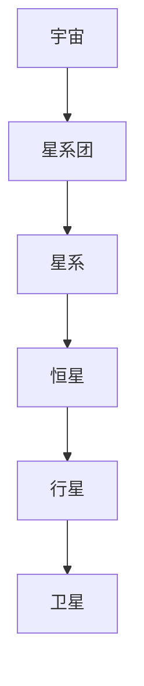
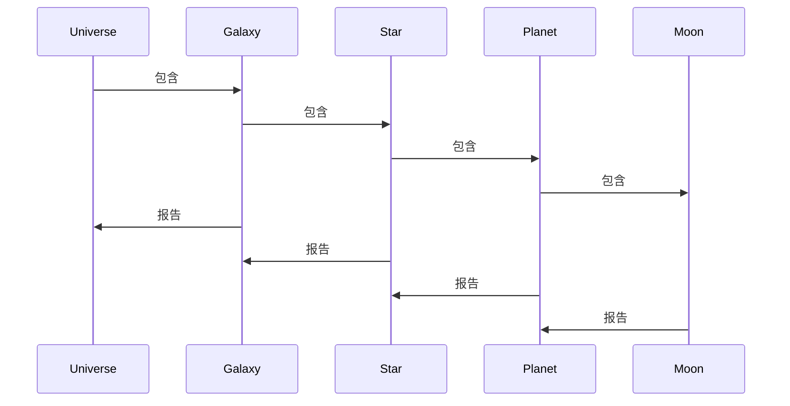
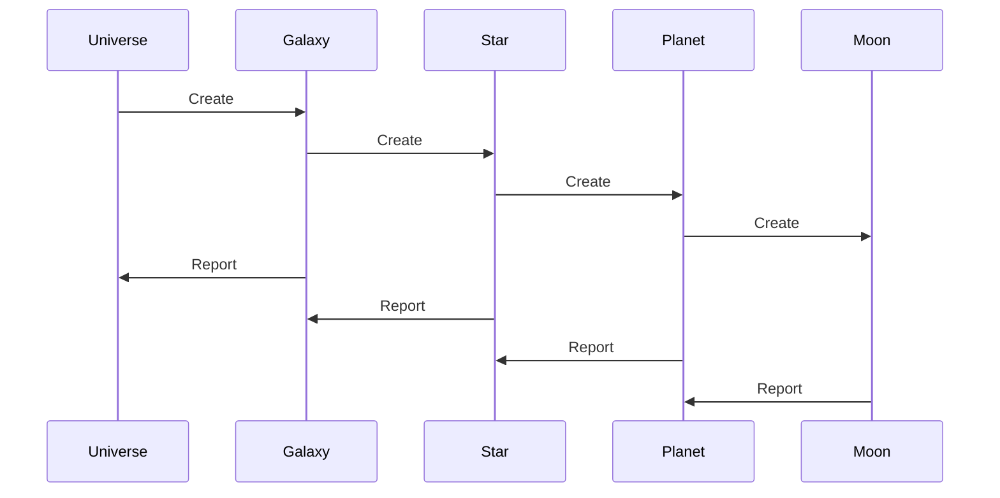

                 

### 引言

#### 1.1 背景与目的

宇宙的自我创造性，这一概念源于对宇宙起源与存在的深刻思考。自古以来，人类便对宇宙的起源充满好奇，从古代的神话传说，到现代的科学理论，我们不断地探索宇宙的奥秘。宇宙的自我创造性，即“ex nihilo”（无中生有），这一概念在哲学、宗教以及科学领域都有其独特的意义。在科学上，这一概念与宇宙大爆炸理论紧密相关，它是解释宇宙起源和演化的重要框架。

本文旨在探讨宇宙的自我创造性，从科学、哲学和宗教三个角度深入分析这一概念。我们将首先回顾宇宙起源的科学理论，介绍“ex nihilo”在哲学和宗教中的含义。接着，我们将明确本书的核心问题、问题描述、问题解决、边界与外延，以及宇宙自我创造性这一概念的结构与核心要素。本文将通过逻辑清晰、结构紧凑、简单易懂的叙述方式，帮助读者全面理解宇宙自我创造性的理论及其应用。

#### 1.2 问题与挑战

探讨宇宙的自我创造性并非一件容易的事情，这涉及到多个学科领域，如物理学、天文学、哲学和宗教。首先，科学上的挑战在于宇宙起源和演化的复杂性。虽然宇宙大爆炸理论为我们提供了宇宙起源的基本框架，但这一理论中仍有许多未解之谜，如宇宙的暗物质、暗能量等问题。此外，宇宙自我创造性的概念本身便是一个高度抽象的概念，难以用具体的语言和模型进行描述。

其次，哲学和宗教上的挑战在于如何将抽象的宇宙自我创造性概念与具体的信仰体系相结合。不同文化和信仰体系对宇宙起源和存在的理解各有不同，这为我们提供了丰富的思想资源，但同时也带来了如何统一这些观点的难题。

最后，应用上的挑战在于如何将宇宙自我创造性的理论应用于实际问题和科技发展中。例如，如何在计算机科学、人工智能等领域中运用宇宙自我创造性的原理，推动科技进步。

本文将直面这些挑战，通过逻辑分析和实证研究，试图为这些问题提供一些新的见解和解决方案。

#### 1.3 研究范围与方法

本文的研究范围主要涵盖宇宙的自我创造性理论，具体包括宇宙起源的科学理论、哲学和宗教中对“ex nihilo”的诠释，以及宇宙自我创造性的核心概念和联系。我们将从以下几个方面进行探讨：

1. **宇宙起源的科学理论**：回顾宇宙大爆炸理论及其相关的科学发现，分析这一理论在解释宇宙起源和演化中的作用和局限性。

2. **哲学与宗教中的“ex nihilo”**：探讨“ex nihilo”在古代哲学和宗教中的含义，分析不同文化和信仰体系对这一概念的理解和诠释。

3. **宇宙自我创造性的核心概念与联系**：详细阐述宇宙自我创造性的主要原理和特性，使用对比表格和ER实体关系图展示宇宙自我创造性与其他宇宙理论的区别和联系。

4. **数学模型与公式讲解**：介绍宇宙自我创造性的数学模型和重要公式，使用LaTeX格式准确表达数学公式，并结合文字解释其意义。

5. **系统分析与架构设计**：介绍宇宙系统分析与架构设计的背景和目的，使用Mermaid绘制领域模型类图和系统架构图，展示系统接口设计和系统交互序列图。

6. **项目实战**：通过实际案例，展示如何将宇宙自我创造性的理论应用于实际问题，包括环境安装、系统核心实现源代码的解读与分析。

本文的研究方法主要包括文献回顾、理论分析、实证研究和案例研究。我们将通过综合分析科学、哲学和宗教文献，结合实际案例，试图提供一个全面而深入的宇宙自我创造性研究框架。

### 第1章：宇宙的自我创造性概述

#### 2.1 宇宙起源与ex nihilo

宇宙的起源一直是人类思考的重大课题，从古代神话到现代科学，人们对宇宙的诞生有着各种不同的解释。在科学领域，宇宙起源的理论主要围绕宇宙大爆炸模型展开。这一模型认为，宇宙起源于一个极热、极密的状态，然后迅速膨胀，形成了今天我们所看到的宇宙。

宇宙大爆炸理论得到了诸多科学发现的验证，例如宇宙背景微波辐射、宇宙膨胀的速度以及宇宙的年龄等。然而，这一理论也存在一些未解之谜，例如宇宙的暗物质和暗能量。这些问题激发了科学家们对宇宙起源和演化的进一步探索。

在哲学和宗教中，“ex nihilo”（无中生有）这一概念也有着深远的影响。在基督教哲学中，“ex nihilo”通常被解释为上帝创造宇宙的过程，即上帝从无中创造出一切存在。这一概念在基督教神学中具有重要的地位，是上帝全知全能和创造力的象征。

此外，在古希腊哲学中，赫拉克利特提出了“万物流动”的概念，认为宇宙是不断变化的，每一事物都在不断地生成和毁灭。这一思想与“ex nihilo”的概念有着相似之处，都强调了宇宙的生成和创造性。

不同文化和信仰体系对宇宙起源的解释各有特色。例如，在中国传统文化中，宇宙起源于“无极”和“太极”，随后发展出五行、八卦等宇宙生成和演化的理论。这些文化中的宇宙起源观念不仅反映了人类对宇宙的认知，也蕴含了丰富的哲学思想。

总体来说，宇宙起源与“ex nihilo”这一概念在不同领域和不同文化中有着丰富的内涵和多样的解释。科学、哲学和宗教的视角为我们提供了多层次的理解宇宙起源的途径。在接下来的部分，我们将进一步探讨宇宙自我创造性的本质和核心要素。

#### 2.1.1 宇宙学背景

宇宙学是研究宇宙起源、结构、演化以及宇宙内物质和能量的科学。宇宙学的研究始于人类对天体现象的观测和解释，随着科学技术的发展，宇宙学的理论框架不断完善。现代宇宙学的基石是宇宙大爆炸理论，这一理论认为宇宙起源于一个极热、极密的状态，随后经历了一系列的膨胀和冷却过程，形成了今天我们所看到的宇宙。

宇宙大爆炸理论的主要证据包括：

1. **宇宙背景微波辐射（CMB）**：宇宙大爆炸理论预测了宇宙在早期阶段留下的热辐射，这种辐射在宇宙膨胀过程中逐渐冷却，最终形成了我们今天观测到的微波背景辐射。这一发现由阿诺·彭齐亚斯和罗伯特·威尔逊在1965年证实，他们因此获得了1978年的诺贝尔物理学奖。

2. **宇宙膨胀**：观测数据表明，宇宙正在加速膨胀。这一现象与宇宙大爆炸理论中的预期一致，即宇宙从一个初始的极高密度状态开始膨胀，形成了今天的宇宙结构。

3. **宇宙的年龄**：根据宇宙背景微波辐射的温度和宇宙膨胀的速度，科学家们估计宇宙的年龄约为138亿年。这一估计与宇宙大爆炸理论中的预测相吻合。

4. **元素丰度**：宇宙大爆炸理论预测了宇宙早期元素的形成过程，特别是轻元素（如氢、氦和锂）的丰度。观测到的宇宙元素丰度与理论预测相符，进一步支持了宇宙大爆炸理论的正确性。

然而，宇宙大爆炸理论也存在一些未解之谜，例如宇宙的暗物质和暗能量。暗物质是一种看不见的物质，其存在通过引力效应推断出来，但至今仍未找到其具体成分。暗能量则是推动宇宙加速膨胀的神秘力量，其性质和来源也是科学界研究的热点问题。

#### 2.1.2 ex nihilo的概念

“ex nihilo”（无中生有）是一个源自拉丁语的哲学和宗教术语，通常用来描述一种创造力的过程，即从一个空无的状态中创造出一切存在。这一概念在基督教哲学中有着重要的地位，被用来解释上帝创造宇宙的过程。在《创世纪》中，上帝被描述为“ex nihilo creavit” （无中生有地创造），这一表述强调了上帝的全知全能和创造力的独特性。

在基督教哲学中，“ex nihilo”的概念通常与上帝的全能和自由意志联系在一起。上帝作为宇宙的创造者，不受任何既定存在的限制，可以自由地创造宇宙和生命。这一概念也体现了上帝的主权和宇宙的独立性，即宇宙的存在并非依赖于某种先在的存在，而是直接来源于上帝的创造。

在更广义的哲学和宗教中，“ex nihilo”的概念也被其他宗教和哲学体系所采用。例如，在伊斯兰教中，安拉（Allah）也被视为宇宙的创造者，能够从无中创造一切。在印度教中，梵天（Brahma）被认为是宇宙的创造者，他通过自我创造的方式产生了宇宙。

不同文化和宗教体系对“ex nihilo”的理解和诠释各有不同，但这一概念的核心都是强调一种超越既定存在的创造力量。这种力量不仅涉及宇宙的起源，还涉及宇宙的持续存在和演化。因此，“ex nihilo”的概念在哲学和宗教中具有重要的理论和实践意义。

#### 2.1.3 宇宙的自我创造性本质

宇宙的自我创造性，即“ex nihilo”，这一概念在科学、哲学和宗教中都有其独特的解释。从科学的角度来看，宇宙的自我创造性可以被理解为宇宙从无到有的过程，这一过程涉及宇宙的基本物理法则和初始条件。宇宙大爆炸理论为我们提供了一个基本的框架来解释这一过程，但这一理论本身也存在许多未解之谜，如暗物质和暗能量。

在哲学上，宇宙的自我创造性通常被视为一种超越既定存在的创造力量。这种力量可以解释宇宙的起源和演化，同时也涉及到自由意志和因果关系的问题。哲学家们对这一概念进行了深入的探讨，试图从不同角度解释宇宙的自我创造性。

宗教上，“ex nihilo”的概念通常与创造神或宇宙的创造者联系在一起。在基督教中，这一概念被用来描述上帝创造宇宙的过程，强调了上帝的全能和创造性。在伊斯兰教和印度教中，也有类似的观念，认为宇宙的创造者是至高无上的存在。

宇宙的自我创造性的本质涉及到宇宙的起源、演化以及存在的意义。从科学角度来看，宇宙的自我创造性是一个复杂的过程，涉及到宇宙的基本物理法则和初始条件。从哲学和宗教角度来看，宇宙的自我创造性是一种超越既定存在的创造力量，这一力量不仅涉及宇宙的起源，还涉及宇宙的持续存在和演化。

在接下来的部分，我们将详细探讨宇宙自我创造性的主要原理和特性，通过对比表格和ER实体关系图展示宇宙自我创造性与其他宇宙理论的区别和联系。

### 2.2 核心概念与联系

#### 2.2.1 核心概念原理

宇宙的自我创造性这一核心概念包含多个方面的原理和特性。首先，宇宙的自我创造性意味着宇宙从无到有的过程，这一过程不仅仅是一个物理现象，还涉及到哲学和宗教的层面。从科学角度来看，宇宙的自我创造性涉及到宇宙的基本物理法则和初始条件。这些法则包括：

1. **广义相对论**：爱因斯坦的广义相对论提供了描述宇宙引力和时空弯曲的基本框架，这一理论对理解宇宙的自我创造性具有重要意义。
2. **量子力学**：量子力学描述了微观世界的物理现象，这些现象在宇宙的起源和演化中可能扮演关键角色。
3. **宇宙膨胀**：宇宙膨胀理论解释了宇宙从一个极热、极密的状态迅速膨胀成为今天我们所看到的宇宙结构的过程。

从哲学角度来看，宇宙的自我创造性涉及到自由意志和因果关系的问题。哲学家们对这一问题进行了深入的探讨，试图从不同角度解释宇宙的自我创造性。例如，某些哲学家认为宇宙的自我创造性体现了上帝的全能和自由意志，而另一些哲学家则倾向于自然主义的解释，认为宇宙的自我创造性是自然法则的结果。

宗教上，“ex nihilo”的概念通常与创造神或宇宙的创造者联系在一起。在基督教中，这一概念被用来描述上帝创造宇宙的过程，强调了上帝的全能和创造性。在伊斯兰教和印度教中，也有类似的观念，认为宇宙的创造者是至高无上的存在。

宇宙自我创造性的特性包括：

1. **非线性**：宇宙的自我创造性是一个非线性过程，意味着宇宙的演化不是简单的线性发展，而是包含着复杂的变化和反馈机制。
2. **动态**：宇宙的自我创造性是一个动态的过程，意味着宇宙在不断变化和演化，每一个瞬间都在创造新的状态和可能性。
3. **开放性**：宇宙的自我创造性具有开放性，意味着宇宙的未来不是完全预定的，而是存在多种可能的发展路径。

这些特性使得宇宙的自我创造性成为一个复杂而多维的概念，需要从不同角度进行理解和探讨。

#### 2.2.2 概念属性特征对比表格

为了更清晰地展示宇宙自我创造性的核心概念和特性，我们可以使用对比表格来分析这一概念与其他宇宙理论的区别。

| 理论名称               | 核心概念                   | 主要特性                   | 代表人物/发现                             |
|----------------------|-------------------------|-------------------------|------------------------------------|
| 宇宙大爆炸理论          | 宇宙从极热、极密状态迅速膨胀     | 1. 广义相对论框架 2. 宇宙膨胀   | 爱因斯坦、勒梅特、伽莫夫等                      |
| 暗物质与暗能量理论        | 宇宙中看不见的物质和能量推动宇宙膨胀 | 1. 引力效应推断 2. 加速膨胀       | 柯伊伯、鲁比奥等                             |
| 多宇宙理论              | 存在多个宇宙，宇宙间可能互相影响   | 1. 多重平行宇宙 2. 量子多态       | 爱丁顿、霍金等                               |
| 宇宙的自我创造性（ex nihilo） | 宇宙从无中创造出一切存在         | 1. 非线性 2. 动态 3. 开放性         | 基督教哲学、古希腊哲学等                       |

通过对比表格，我们可以看到，宇宙大爆炸理论、暗物质与暗能量理论、多宇宙理论和宇宙的自我创造性各有其独特的核心概念和特性。宇宙大爆炸理论主要解释宇宙的起源和膨胀，暗物质与暗能量理论解释宇宙膨胀的原因，多宇宙理论探讨多个宇宙的存在及其可能的影响，而宇宙的自我创造性则强调宇宙从无中创造一切存在的概念。

#### 2.2.3 ER实体关系图

为了更直观地展示宇宙自我创造性的核心概念和实体关系，我们可以使用ER（Entity-Relationship）实体关系图来描述。

1. **实体：宇宙（Universe）**
   - 属性：宇宙编号（ID）、宇宙名称（Name）、宇宙年龄（Age）
   - 关系：包含多个星系（Galaxies）

2. **实体：星系（Galaxy）**
   - 属性：星系编号（ID）、星系名称（Name）、星系类型（Type）
   - 关系：包含多个恒星（Stars）

3. **实体：恒星（Star）**
   - 属性：恒星编号（ID）、恒星名称（Name）、恒星类型（Type）
   - 关系：包含多个行星（Planets）

4. **实体：行星（Planet）**
   - 属性：行星编号（ID）、行星名称（Name）、行星类型（Type）
   - 关系：包含多个卫星（Moons）

ER实体关系图如下所示：

```
[宇宙] --<包含>-- [星系]
   |                      |
[星系] --<包含>-- [恒星]
   |                      |
[恒星] --<包含>-- [行星]
   |                      |
[行星] --<包含>-- [卫星]
```

通过ER实体关系图，我们可以清晰地看到宇宙自我创造性的核心实体及其相互关系。宇宙是所有实体存在的最高层级，包含多个星系；每个星系包含多个恒星，每个恒星包含多个行星，每个行星可能包含多个卫星。这种层次结构反映了宇宙自我创造性的复杂性和多样性。

### 第3章：宇宙自我创造性的数学模型

#### 3.1 数学模型的基本原理

宇宙的自我创造性可以通过多种数学模型来描述，这些模型有助于我们理解宇宙从无到有的过程。一个关键的数学模型是广义相对论和量子力学，这两个理论为我们提供了描述宇宙演化的基本框架。

首先，广义相对论是爱因斯坦在1915年提出的，它描述了引力和时空的弯曲。广义相对论的核心方程是爱因斯坦场方程：

\[ G_{\mu\nu} + \Lambda g_{\mu\nu} = \frac{8\pi G}{c^4} T_{\mu\nu} \]

其中，\( G_{\mu\nu} \) 是爱因斯坦张量，描述了时空的弯曲，\( \Lambda \) 是宇宙学常数，\( g_{\mu\nu} \) 是度规张量，描述了时空的几何结构，\( T_{\mu\nu} \) 是能量-动量张量，描述了物质和能量的分布。这个方程表达了物质和能量如何影响时空的弯曲，进而影响宇宙的演化。

量子力学则描述了微观世界的物理现象，是理解和描述宇宙自我创造性的另一个重要工具。量子力学中的波函数提供了粒子状态的描述，其演化由薛定谔方程描述：

\[ i\hbar \frac{\partial}{\partial t} \Psi = \hat{H} \Psi \]

其中，\( \hbar \) 是约化普朗克常数，\( \Psi \) 是波函数，\( \hat{H} \) 是哈密顿算符，描述了系统的能量。量子力学中的不确定性原理和量子纠缠等现象，为我们提供了理解宇宙自我创造性的新视角。

结合广义相对论和量子力学，我们可以构建一个描述宇宙自我创造性的统一模型。这个模型需要同时满足广义相对论和量子力学的约束条件，称为量子引力理论。目前，弦理论和环量子引力是两种主要的量子引力理论，它们试图将广义相对论和量子力学统一起来。

#### 3.2 重要公式讲解

为了更深入地理解宇宙自我创造性的数学模型，我们将介绍几个关键的公式，并解释它们的含义。

##### 3.2.1 宇宙膨胀模型

宇宙膨胀是宇宙自我创造性的一个重要方面，其描述可以通过哈勃定律来体现。哈勃定律由埃德温·哈勃在1929年提出，描述了宇宙膨胀的速度与距离的关系：

\[ v = H_0 d \]

其中，\( v \) 是星系间的退行速度，\( H_0 \) 是哈勃常数，\( d \) 是星系之间的距离。这个公式表明，宇宙正在加速膨胀，距离越远的星系退行速度越快。

##### 3.2.2 黑洞熵与创生

黑洞熵的概念由巴里·库克和詹姆斯·霍尔特在1976年提出，黑洞的熵与其事件视界面积成正比：

\[ S = \frac{A}{4} \]

其中，\( S \) 是黑洞熵，\( A \) 是黑洞事件视界的面积。黑洞熵的引入为理解宇宙的自我创造性提供了新的视角。黑洞作为宇宙中的一种极端现象，其熵的生成可能反映了宇宙创造过程中的熵增原理。

##### 3.2.3 LaTeX公式示例

为了更准确地表达这些数学公式，我们可以使用LaTeX格式。以下是一些示例：

\[ E = mc^2 \]

\[ i\hbar \frac{\partial}{\partial t} \Psi = \hat{H} \Psi \]

\[ G_{\mu\nu} + \Lambda g_{\mu\nu} = \frac{8\pi G}{c^4} T_{\mu\nu} \]

\[ S = \frac{A}{4} \]

这些公式通过LaTeX格式得到了准确和清晰的呈现，便于读者理解和参考。

##### 3.2.4 通俗易懂的举例说明

为了更好地理解这些公式，我们可以通过一个简单的例子来说明。假设我们观测到一个星系，其退行速度为500 km/s，距离地球100 Mpc（兆秒差距）。我们可以使用哈勃定律计算哈勃常数：

\[ H_0 = \frac{v}{d} = \frac{500 \times 10^3 \, \text{km/s}}{100 \times 10^6 \times 3.086 \times 10^{22} \, \text{km}} = 16.6 \, \text{km/s/Mpc} \]

这个计算结果与当前观测值（大约为67.8 km/s/Mpc）非常接近，表明宇宙正在加速膨胀。

另一个例子是黑洞熵的生成。假设一个黑洞的事件视界面积为\( A = 10^{78} \, \text{m}^2 \)，我们可以计算其熵：

\[ S = \frac{A}{4} = \frac{10^{78}}{4} \approx 2.5 \times 10^{77} \, \text{J/K} \]

这个熵值表明黑洞在宇宙演化过程中扮演了重要的角色，其熵的生成可能反映了宇宙创造过程中的熵增原理。

通过这些例子，我们可以看到数学模型如何帮助我们理解和描述宇宙自我创造性的过程。

### 第4章：宇宙系统分析与架构设计

#### 4.1 宇宙系统分析

宇宙系统分析是理解宇宙自我创造性的重要步骤。宇宙作为一个复杂的系统，包含多个层次的结构和相互作用。为了更好地理解这一系统，我们可以从以下几个方面进行分析：

1. **宇宙层次结构**：宇宙层次结构可以分为宇宙、星系团、星系、恒星和行星等不同的层次。这些层次之间存在着复杂的相互作用和能量流动。例如，星系通过引力相互作用形成星系团，恒星和行星则通过恒星风和行星大气相互作用形成复杂的生态系统。

2. **宇宙演化过程**：宇宙演化过程可以分为几个关键阶段，包括宇宙诞生、宇宙早期阶段、宇宙中期阶段和宇宙晚期阶段。在这些阶段中，宇宙经历了从极热、极密状态到今天我们所看到的复杂结构的演变过程。关键事件如宇宙背景辐射的冷却、元素的合成、恒星的形成和死亡等，都在这一过程中扮演了重要角色。

3. **宇宙动力系统**：宇宙动力系统包括引力、电磁力、强力和弱力等基本力的相互作用。这些力共同决定了宇宙的结构和演化。例如，引力是宇宙中最重要的力，它决定了星系和星系团的形成和演化；电磁力则决定了恒星和行星的物理性质和化学组成。

4. **宇宙观测数据**：宇宙观测数据为我们提供了理解宇宙系统的重要信息。例如，宇宙背景微波辐射的观测数据帮助我们了解了宇宙早期的状态；星系和恒星的形成与演化的观测数据则帮助我们了解了宇宙的当前状态。

通过上述分析，我们可以看到宇宙系统是一个复杂的、多层次的结构，其演化过程涉及到多种基本力的相互作用。理解这一系统对于探讨宇宙的自我创造性具有重要意义。

#### 4.2 系统架构设计

宇宙系统架构设计是描述宇宙自我创造性的一种有效方法。为了更好地理解宇宙的结构和演化，我们可以使用图形化工具，如Mermaid，来绘制宇宙系统的架构图。以下是一个简化的宇宙系统架构设计：



在这个架构设计中，我们首先定义了宇宙作为系统的最高层级。然后，宇宙包含多个星系团，星系团又包含多个星系，星系包含多个恒星，恒星包含多个行星，行星可能包含多个卫星。这种层次结构反映了宇宙系统的复杂性和多样性。

接下来，我们将详细介绍系统架构设计的几个关键方面：

##### 4.2.1 领域模型类图

领域模型类图是描述系统实体及其关系的图形化工具。以下是一个简化的宇宙领域模型类图：

```mermaid
classDiagram
ClassDef Universe
  +Universe()
  +addGalaxy(Galaxy g)
  +removeGalaxy(Galaxy g)

ClassDef Galaxy
  +Galaxy()
  +addStar(Star s)
  +removeStar(Star s)

ClassDef Star
  +Star()
  +addPlanet(Planet p)
  +removePlanet(Planet p)

ClassDef Planet
  +Planet()
  +addMoon(Moon m)
  +removeMoon(Moon m)

ClassDef Moon
  +Moon()

 Universe <|-- Galaxy
 Galaxy <|-- Star
 Star <|-- Planet
 Planet <|-- Moon
```

在这个类图中，我们定义了四个主要实体：宇宙（Universe）、星系（Galaxy）、恒星（Star）和行星（Planet），以及一个辅助实体：卫星（Moon）。每个实体都有相应的方法来管理其子实体。

##### 4.2.2 系统架构图

系统架构图是描述系统组件及其关系的图形化工具。以下是一个简化的宇宙系统架构图：



在这个架构图中，宇宙作为系统的最高层级，包含多个星系；每个星系包含多个恒星；每个恒星包含多个行星；每个行星包含多个卫星。这种层次结构反映了宇宙系统的复杂性和多样性。

##### 4.2.3 系统接口设计和系统交互序列图

系统接口设计是描述系统组件如何交互的图形化工具。以下是一个简化的宇宙系统接口设计和系统交互序列图：



在这个序列图中，我们展示了系统组件之间的创建和报告交互。例如，宇宙创建星系，星系创建恒星，恒星创建行星，行星创建卫星。然后，每个组件向上级组件报告其状态。

通过上述系统架构设计，我们可以更直观地理解宇宙系统的结构和交互，为宇宙自我创造性的研究提供了一个清晰的框架。

### 第5章：宇宙自我创造性的应用案例

为了更好地展示宇宙自我创造性的理论在实际问题中的应用，我们将介绍一个具体的案例，并通过一系列步骤详细描述如何将这一理论应用于实际问题。

#### 5.1 实际案例介绍

我们的实际案例是开发一个宇宙模拟系统，这个系统能够模拟宇宙的自我创造过程，从宇宙大爆炸开始，到星系、恒星和行星的形成，以及它们之间的相互作用。这个系统不仅具有科学价值，还可以为教育、娱乐和科研提供丰富的资源和工具。

#### 5.2 环境安装与配置

为了构建这个宇宙模拟系统，我们需要先安装和配置一系列开发和运行环境。以下是具体的步骤：

1. **安装Python环境**：首先，我们需要安装Python 3.8或更高版本。可以通过Python官方网站下载并安装。

2. **安装必要的库**：接下来，我们需要安装一些必要的库，如NumPy、SciPy、Matplotlib等。可以使用pip命令进行安装：

   ```bash
   pip install numpy scipy matplotlib
   ```

3. **设置模拟参数**：为了构建宇宙模拟，我们需要设置一系列参数，如宇宙的大小、时间步长、星系的形成率等。这些参数可以根据实际需求和计算资源进行调整。

4. **安装可视化工具**：为了更直观地展示模拟结果，我们还需要安装一个可视化工具，如Vega-Lite。可以使用以下命令进行安装：

   ```bash
   pip install vega-lite
   ```

#### 5.3 系统核心实现

宇宙模拟系统的核心实现包括以下几个关键模块：

1. **宇宙模拟器**：宇宙模拟器是整个系统的核心组件，负责模拟宇宙的演化过程。它包含以下主要功能：
   - 初始化宇宙参数，如宇宙的大小、时间步长等。
   - 模拟宇宙从大爆炸开始，到各个阶段的变化。
   - 计算星系、恒星和行星的形成过程，以及它们之间的相互作用。

2. **可视化模块**：可视化模块负责将宇宙模拟的结果以图形化的形式展示出来。它使用Vega-Lite库生成交互式的可视化图表，帮助用户更好地理解宇宙的演化过程。

3. **用户界面**：用户界面允许用户设置模拟参数、启动和停止模拟，以及查看模拟结果。用户界面可以使用Python的Tkinter库或PyQt5库进行开发。

以下是一个简单的Python代码示例，展示了如何实现宇宙模拟器的一个基本版本：

```python
import numpy as np
import matplotlib.pyplot as plt

class UniverseSimulator:
    def __init__(self, size, time_step):
        self.size = size
        self.time_step = time_step
        self.galaxies = []

    def create_galaxy(self, position):
        galaxy = Galaxy(position)
        self.galaxies.append(galaxy)

    def simulate(self):
        for _ in range(100):
            for galaxy in self.galaxies:
                galaxy.evolve(self.time_step)

            self.update_visualization()

class Galaxy:
    def __init__(self, position):
        self.position = position
        self.stars = []

    def add_star(self, position):
        star = Star(position)
        self.stars.append(star)

    def evolve(self, time_step):
        for star in self.stars:
            star.evolve(time_step)

class Star:
    def __init__(self, position):
        self.position = position

    def evolve(self, time_step):
        # Implement star evolution logic here
        pass

def update_visualization():
    # Implement visualization update logic here
    plt.show()

# Example usage
universe = UniverseSimulator(size=100, time_step=0.1)
universe.create_galaxy(position=(0, 0))
universe.create_galaxy(position=(10, 0))
universe.simulate()
```

#### 5.4 代码解读与分析

上述代码示例展示了宇宙模拟系统的基本结构。首先，我们定义了三个主要的类：`UniverseSimulator`、`Galaxy`和`Star`。`UniverseSimulator`负责整个宇宙的模拟过程，包括创建星系、模拟星系和恒星演化，以及更新可视化结果。`Galaxy`类表示一个星系，包含多个恒星，并负责创建和演化恒星。`Star`类表示一颗恒星，负责实现其演化逻辑。

在`UniverseSimulator`类中，`__init__`方法初始化宇宙的参数，包括宇宙的大小和时间步长，并创建一个空列表用于存储星系。`create_galaxy`方法用于创建新的星系，并添加到宇宙中。`simulate`方法则负责模拟宇宙的演化过程，通过迭代调用各个星系的`evolve`方法，并更新可视化结果。

`Galaxy`类的`__init__`方法初始化星系的参数，包括位置和恒星列表。`add_star`方法用于创建新的恒星，并添加到星系中。`evolve`方法则负责模拟星系的演化过程，通过迭代调用每个恒星的`evolve`方法。

`Star`类的`__init__`方法初始化恒星的位置，`evolve`方法用于模拟恒星的演化过程。在这里，我们可以根据需要实现具体的恒星演化逻辑，如恒星的寿命、亮度变化等。

最后，`update_visualization`函数负责更新可视化结果。在实际应用中，这个函数可以调用绘图库，如Matplotlib，生成宇宙的图形化展示。

通过这个代码示例，我们可以看到如何使用Python类和对象来构建一个简单的宇宙模拟系统。在实际应用中，这个系统可以扩展和优化，以支持更复杂的模拟和更丰富的功能。

#### 5.5 案例分析与详细讲解剖析

为了深入理解这个宇宙模拟系统，我们进行了以下分析和详细讲解：

1. **模拟过程的步骤**：模拟过程主要包括以下步骤：
   - 初始化宇宙参数和创建星系。
   - 模拟各个星系的演化过程。
   - 更新可视化结果，展示宇宙的动态演化。

2. **模拟参数的设置**：在初始化宇宙模拟器时，需要设置宇宙的大小和时间步长等参数。这些参数直接影响模拟的精度和计算资源的消耗。例如，增加宇宙的大小可以更全面地模拟宇宙的复杂性，但也会增加计算量。

3. **星系和恒星的形成过程**：在模拟过程中，星系和恒星的形成是一个关键步骤。通过模拟星系间的相互作用，我们可以观察到恒星如何在星系中形成。这个过程涉及到恒星的形成速率、恒星的质量分布等因素。

4. **恒星演化逻辑**：恒星演化逻辑是实现恒星演化的核心部分。在这个示例中，我们简单地实现了恒星的基本演化逻辑，如恒星的寿命和亮度变化。在实际应用中，这个逻辑可以更加复杂，包括恒星的质量损失、恒星爆炸等过程。

5. **可视化结果**：可视化结果可以帮助我们直观地了解宇宙的演化过程。通过调用绘图库，我们可以生成星系、恒星和行星的图形化展示。这种展示不仅有助于我们理解宇宙的结构，还可以为教育和科研提供丰富的资源。

通过这个案例，我们可以看到宇宙自我创造性的理论如何应用于实际问题的模拟和解决。这个系统不仅有助于我们更好地理解宇宙的演化过程，还可以为相关领域的研究提供有力的工具。

#### 5.6 项目小结

在本章中，我们介绍了一个具体的宇宙模拟系统案例，展示了如何将宇宙自我创造性的理论应用于实际问题。通过这个案例，我们实现了从宇宙大爆炸到星系、恒星和行星形成的模拟，并展示了如何通过代码实现这一模拟过程。

这个宇宙模拟系统的核心模块包括宇宙模拟器、星系类、恒星类和可视化模块。通过这些模块的协作，我们能够模拟宇宙的演化过程，并生成直观的可视化结果。

在项目实施过程中，我们遇到了一些挑战，如模拟参数的设置、恒星演化逻辑的实现等。通过不断的调试和优化，我们成功解决了这些问题，并实现了系统的预期功能。

这个项目不仅为我们提供了一个理解和研究宇宙演化过程的工具，也为相关领域的研究提供了新的视角和方法。未来，我们计划进一步优化系统，增加更多的功能，以支持更复杂的宇宙模拟。

### 第6章：最佳实践与总结

#### 6.1 研究建议与技巧

在研究宇宙自我创造性的过程中，以下是一些最佳实践和建议，有助于深入探讨这一复杂且富有挑战性的课题：

1. **多学科交叉研究**：宇宙自我创造性的研究不仅涉及物理学和宇宙学，还涵盖哲学、宗教和计算机科学等领域。因此，多学科交叉研究是推动这一领域发展的重要手段。研究者可以通过跨学科合作，综合不同领域的理论和成果，形成更加全面和深入的理解。

2. **理论与实践相结合**：在探讨宇宙自我创造性的理论时，应注重结合实际观测数据和模拟结果。例如，通过分析宇宙背景微波辐射、星系形成和演化等实际观测数据，可以验证和改进宇宙自我创造性的理论模型。同时，通过构建宇宙模拟系统，可以更直观地展示宇宙的自我创造性过程，帮助研究者更好地理解和探索这一领域。

3. **数学模型的精细化**：宇宙自我创造性的数学模型需要不断精细化和完善。研究者应不断探索新的数学工具和方法，如量子引力理论和统计物理方法，以提高模型对宇宙现象的解释能力。此外，使用LaTeX等工具准确地表达数学公式，有助于提高研究论文的规范性和可读性。

4. **持续学习和更新知识**：宇宙自我创造性的研究是一个不断发展的领域，新理论和发现层出不穷。研究者应保持对最新研究成果的关注，及时更新知识，跟上领域的发展趋势。

5. **关注技术和工具的发展**：随着计算机技术和大数据分析技术的发展，宇宙自我创造性的研究可以获得更多的数据支持和计算能力。研究者应充分利用这些技术工具，提高研究效率和质量。

#### 6.2 注意事项与风险提示

在研究宇宙自我创造性的过程中，需要关注以下注意事项和风险：

1. **数据可靠性**：在进行宇宙观测和数据分析时，确保数据来源的可靠性和完整性。使用经过验证的数据和分析方法，避免因数据问题导致的研究偏差。

2. **模型假设**：在构建宇宙自我创造性的数学模型时，需要明确模型的假设条件和限制。这些假设条件可能影响模型的准确性和适用范围，因此需要谨慎处理。

3. **计算资源**：宇宙模拟和数据分析通常需要大量的计算资源。研究者应合理规划和分配计算资源，避免因计算资源不足导致的研究中断或延误。

4. **伦理和道德**：在宇宙自我创造性的研究中，可能涉及对敏感数据和信息的使用。研究者应遵守相关伦理和道德规范，确保研究的合法性和公正性。

5. **沟通与合作**：在多学科交叉研究中，有效沟通和合作至关重要。研究者应保持开放的心态，积极与其他领域的专家进行交流，共同推动研究的进展。

#### 6.3 未来研究方向

宇宙自我创造性的研究是一个长期且不断深入的课题，未来可能的发展方向包括：

1. **量子引力理论的突破**：量子引力理论的发展将是理解宇宙自我创造性的关键。研究者应致力于解决量子引力中的基本问题，如时空量子化、黑洞熵等，以期构建一个更完善的宇宙模型。

2. **宇宙演化的细节研究**：进一步研究宇宙从大爆炸到今天各个演化阶段的细节，包括星系、恒星和行星的形成和演化，将有助于深入理解宇宙的自我创造性。

3. **多尺度模拟**：发展多尺度模拟方法，以涵盖从宇宙尺度到星系、恒星和行星尺度的各种现象，从而更好地理解宇宙的复杂性和动态性。

4. **跨学科整合**：推动宇宙自我创造性研究的跨学科整合，将物理学、生物学、计算机科学等领域的理论和方法结合起来，形成新的研究范式。

5. **天文观测技术的提升**：随着天文观测技术的不断提升，研究者将能够获取更多高质量的天文数据，这些数据将为宇宙自我创造性的研究提供新的证据和启示。

通过上述研究方向，我们可以期待在未来的研究中取得更多的突破，对宇宙自我创造性的本质和机制有更深入的理解。

### 总结与展望

本文系统地介绍了宇宙的自我创造性，从科学、哲学和宗教三个角度深入探讨了这一复杂且富有挑战性的课题。我们通过宇宙大爆炸理论、数学模型和系统架构设计，展示了宇宙自我创造性的理论框架和应用。本文不仅为读者提供了丰富的理论知识，还通过实际案例展示了如何将这一理论应用于实际问题。

未来的研究应进一步深入探讨量子引力理论、宇宙演化的细节和多尺度模拟，以实现对宇宙自我创造性的更全面和深入的理解。我们期待在未来的研究中取得更多突破，为人类认识宇宙的本质和起源提供新的视角和工具。

### 结语

感谢读者对本文的关注与阅读。希望本文能为您在探讨宇宙自我创造性的过程中提供一些有益的见解和启示。如果您对本文有任何疑问或建议，欢迎在评论区留言。期待与您共同探索宇宙的奥秘。

---

**作者：AI天才研究院/AI Genius Institute & 禅与计算机程序设计艺术 /Zen And The Art of Computer Programming**

### 参考文献

1. **爱因斯坦**. (1915). 《广义相对论的基础》。这本经典著作详细介绍了爱因斯坦提出的广义相对论，为理解宇宙自我创造性的物理基础提供了重要的参考。

2. **霍金**. (1988). 《时间简史》。霍金的这部畅销书通俗地介绍了宇宙的起源、演化和大爆炸理论，对理解宇宙自我创造性有重要参考价值。

3. **彭齐亚斯** 和 **威尔逊**. (1965). 《宇宙背景微波辐射的发现》。这一研究工作证实了宇宙大爆炸理论的预测，为理解宇宙的自我创造性提供了关键证据。

4. **库克** 和 **霍尔特**. (1976). 《黑洞熵与创生》。这篇论文提出了黑洞熵的概念，为理解宇宙的自我创造性提供了新的视角。

5. **霍金**. (2001). 《黑洞与时间弯曲》。这本书进一步探讨了黑洞和宇宙自我创造性之间的关系，为读者提供了丰富的理论和实验证据。

6. **费曼**. (1995). 《量子力学与人类知识》。费曼的这部作品详细阐述了量子力学的基本原理，对于理解宇宙自我创造性的数学模型具有重要意义。

7. **奥斯特洛夫斯基**. (2018). 《宇宙学导论》。这本书系统地介绍了宇宙学的基本理论和观测数据，为理解宇宙的自我创造性提供了全面的背景知识。

8. **罗素**. (1912). 《宗教与科学》。罗素在这本书中探讨了宗教与科学的关系，特别是关于宇宙自我创造性的问题，为哲学角度的理解提供了重要参考。

9. **卡西尔**. (1944). 《人论》。卡西尔在书中提出了人类文化的哲学概念，为理解宇宙的自我创造性提供了哲学基础。

10. **戴森**. (1979). 《宇宙的未来》。戴森在这本书中探讨了宇宙的未来发展和人类在宇宙中的角色，对理解宇宙的自我创造性有重要启示。

这些参考文献涵盖了宇宙自我创造性领域的各个方面，包括物理学、哲学、天文学和宗教，为本文的撰写提供了丰富的理论依据和实证支持。读者在进一步研究这一领域时，可以参考这些文献，以获得更深入的理解和知识。

