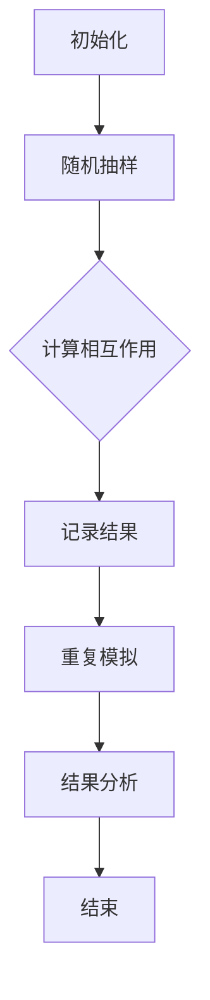
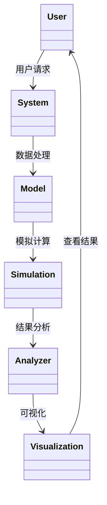
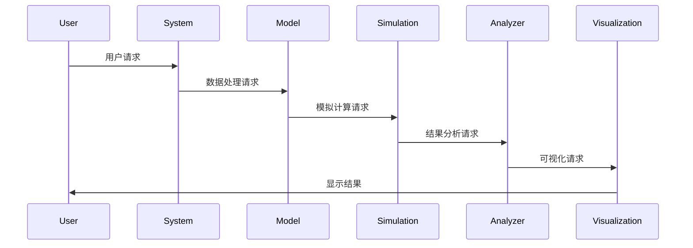
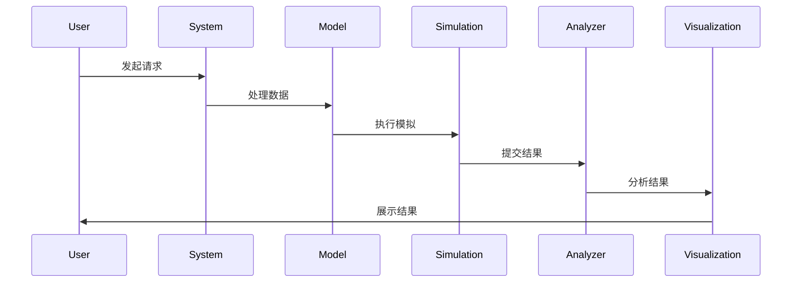

                 

### 引言

#### 1.1 宇宙的自我创造性概念

宇宙的自我创造性，是一个深奥而令人着迷的概念，它描述了宇宙在自身演化过程中所展现出的自我生成、自我组织和自我更新的能力。这一概念不仅仅限于宇宙学领域，它还与哲学、物理学、生物学等多个学科有着密切的联系。宇宙的自我创造性，不仅是一种科学上的探索，更是一种哲学上的思考，它关乎我们如何理解宇宙的本质，以及宇宙如何通过一系列复杂而精巧的过程，最终形成我们今天所看到的壮丽景象。

宇宙的自我创造性包含几个关键要素：首先是“自我生成”，意味着宇宙能够从无到有地诞生；其次是“自我组织”，表示宇宙内部的各种物质和能量如何通过特定的规律进行排列和组合；最后是“自我更新”，这表明宇宙在不断演化过程中，能够自我调整和修复，以适应新的条件和环境。

这种自我创造性不仅体现了宇宙的物理现象，还揭示了宇宙的某种内在逻辑和秩序。通过理解宇宙的自我创造性，我们不仅能够更深入地了解宇宙的起源和演化，还能获得对生命和智慧的全新认识。

#### 1.2 宇宙创生过程的概述

宇宙创生过程是一个极其复杂且充满神秘的过程，目前科学家们对这一过程的了解仍然有限。然而，通过一系列理论和观测数据的积累，我们对宇宙的创生过程已经有了一些基本的认识。

一般认为，宇宙的创生始于大约138亿年前的一次“大爆炸”。在这一瞬间，宇宙从极度高温和高压的状态中迅速膨胀，冷却并逐渐形成了各种物质和能量。这一过程包括宇宙背景辐射的生成、元素的合成、星系的形成等。

在宇宙的早期阶段，宇宙中充满了光子、电子、夸克等基本粒子。随着宇宙的膨胀和冷却，这些粒子逐渐结合形成了原子核，随后又形成了分子和恒星。这些恒星在生命的末期通过超新星爆炸等方式释放出了丰富的化学元素，这些元素随后又凝聚形成了新的恒星和行星系统。

宇宙创生过程的另一个重要方面是暗物质和暗能量的存在。暗物质是一种不发光也不与电磁相互作用但能够通过引力作用影响宇宙结构的物质，而暗能量则是驱动宇宙加速膨胀的力量。这两者对宇宙的创生和演化起着至关重要的作用。

#### 1.3 本书结构安排

本书旨在通过系统的分析和深入探讨，揭示宇宙自我创造性的奥秘。全书共分为七个章节，结构安排如下：

- **第1章 引言**：介绍宇宙的自我创造性概念和宇宙创生过程的概述。
- **第2章 宇宙的起源与演化**：详细探讨宇宙大爆炸理论、暗物质与暗能量以及宇宙的演化过程。
- **第3章 宇宙中的生命现象**：分析地球上的生命起源、宇宙中的生命迹象以及宇宙生命的未来。
- **第4章 宇宙的自我创造性原理**：探讨宇宙的量子特性、混沌与复杂性以及宇宙的自我创造性机制。
- **第5章 宇宙的未来**：预测宇宙演化的未来趋势、人类在宇宙中的角色以及宇宙的未来意义。
- **第6章 宇宙的自我创造性实践**：介绍宇宙学与天文学的实践、宇宙探索的未来方向以及宇宙教育的推广。
- **第7章 结论**：总结宇宙的自我创造性的意义，对未来宇宙探索的展望以及人类在宇宙中的使命。

通过这一结构安排，本书希望能够帮助读者全面、深入地理解宇宙的自我创造性，从而开启对宇宙奥秘的新探索之旅。### 宇宙的起源与演化

#### 2.1 宇宙大爆炸理论

宇宙大爆炸理论（Big Bang Theory）是现代宇宙学中最广泛接受的理论之一，它描述了宇宙从一个极度高温和高压的状态开始，经过迅速膨胀和冷却，逐渐形成今天所看到的宇宙。这一理论最早由伽莫夫（George Gamow）和勒梅特（Georges Lemaître）提出，并在20世纪40年代得到进一步完善。

**2.1.1 大爆炸理论的提出**

大爆炸理论的起源可以追溯到20世纪初。当时，天文学家埃德温·哈勃（Edwin Hubble）发现，宇宙中的星系正在彼此远离，这一发现表明宇宙在膨胀。勒梅特在1927年提出了一个理论，认为宇宙起源于一个“原始原子”，随后迅速膨胀形成今天所见的宇宙。与此同时，伽莫夫和其他物理学家开始研究这一理论的物理基础，并提出了“热大爆炸”模型。

**2.1.2 大爆炸理论的支持证据**

大爆炸理论得到了多个观测事实的支持。首先，宇宙背景辐射的发现是这一理论的重要证据之一。1965年，阿诺·彭齐亚斯（Arno Penzias）和罗伯特·威尔逊（Robert Wilson）在测试一个天线时意外发现了宇宙背景辐射，这一辐射均匀地充满整个宇宙，温度大约为2.7开尔文，被认为是宇宙大爆炸遗留下来的余温。

其次，大爆炸理论还预测了宇宙中轻元素（如氢、氦和锂）的丰度。通过对宇宙中光谱的观测，科学家们发现，宇宙中的这些轻元素的比例与热大爆炸模型的预测非常吻合。

**2.1.3 大爆炸理论的局限性**

尽管大爆炸理论得到了广泛的支持，但它仍然存在一些局限性。首先，大爆炸理论无法解释宇宙为什么会从无到有地诞生，这一“初始条件问题”仍然是一个未解之谜。其次，大爆炸理论无法准确预测宇宙的最终命运，如宇宙是否会无限膨胀直至终结，或者是否会经历某种形式的收缩。

此外，大爆炸理论也无法解释宇宙中的暗物质和暗能量。暗物质是一种不发光也不与电磁相互作用但能够通过引力作用影响宇宙结构的物质，而暗能量则是驱动宇宙加速膨胀的力量。这些现象的发现使科学家们意识到，我们对宇宙的理解仍然非常有限。

#### 2.2 宇宙的暗物质与暗能量

**2.2.1 暗物质的概念与特性**

暗物质是一种不发光也不与电磁相互作用但能够通过引力作用影响宇宙结构的物质。它在宇宙总质量中占据了大约27%的比例，但至今科学家们仍未发现其具体组成。根据理论物理学的预测，暗物质可能是由一些未探测到的基本粒子组成，如弱相互作用大质量粒子（WIMPs）或模拟黑洞的物体。

暗物质对宇宙结构的影响巨大。它通过引力作用，使星系和星团保持在一起，并影响星系的形成和演化。此外，暗物质还在宇宙背景辐射的观测中留下了独特的印记，如引力透镜效应。

**2.2.2 暗能量的概念与特性**

暗能量是一种假设存在的能量形式，它推动着宇宙加速膨胀。根据宇宙学观测，暗能量在宇宙总能量中占据了大约68%的比例。暗能量的性质非常特殊，它具有负压强，这意味着它的能量密度与压强成反比。

暗能量的存在对宇宙的未来命运有着深远的影响。由于暗能量的推动，宇宙的膨胀速度正在加速，这可能导致宇宙最终分裂成无数孤立的部分。另一方面，暗能量也可能与暗物质相互作用，影响宇宙的结构和演化。

**2.2.3 暗物质与暗能量的相互作用**

暗物质和暗能量在宇宙中相互作用，共同影响着宇宙的演化。暗物质通过引力作用，使宇宙中的结构形成和演化，如星系、星团和超星系团。而暗能量则通过其负压强推动宇宙加速膨胀。

目前，科学家们仍在探索暗物质和暗能量之间的具体相互作用机制。一些理论物理学家提出，暗物质和暗能量可能是某种未知的物理过程或粒子的产物，这些过程或粒子可能在未来被发现。

#### 2.3 宇宙的演化过程

**2.3.1 星系的形成与演化**

宇宙的演化过程是一个漫长而复杂的过程，其中包括星系的形成、演化以及死亡。根据观测数据，星系的形成大约始于宇宙大爆炸后的数亿年。在这个过程中，暗物质和暗能量扮演了关键角色。

星系的形成通常始于一个密集的暗物质云，这些云通过引力作用逐渐收缩和塌陷。在塌陷过程中，云中的气体和尘埃被压缩，温度和密度逐渐升高，最终点燃了核聚变反应，形成了恒星。这些恒星随后通过辐射和风等过程，将重元素释放到宇宙中，为后续的星系形成提供了物质基础。

星系的演化是一个持续的过程，其中恒星的形成、演化和死亡不断进行。在星系的中心，往往存在一个大质量黑洞，这些黑洞通过吞噬恒星和星际物质，不断增长其质量，并在宇宙中留下强烈的引力信号。

**2.3.2 恒星的生命周期**

恒星的生命周期可以分为几个阶段。首先是恒星的形成阶段，恒星在主序星阶段度过大部分时间，这个阶段可以持续数十亿年。在主序星阶段，恒星通过核聚变将氢转化为氦，释放出大量的能量。

当恒星耗尽核心的氢燃料后，它开始膨胀成为红巨星。在这个阶段，恒星的外层膨胀，内部则变得更热，核聚变过程转变为氦的聚变。随后，恒星可能经历行星状星云和超新星爆炸等阶段，最终形成白矮星、中子星或黑洞。

**2.3.3 宇宙背景辐射的发现与意义**

宇宙背景辐射是宇宙大爆炸遗留下来的余温，它的发现对于验证宇宙大爆炸理论至关重要。1965年，阿诺·彭齐亚斯和罗伯特·威尔逊意外地发现了这一辐射，这一发现不仅证实了大爆炸理论的预测，还提供了关于宇宙早期状态的重要信息。

宇宙背景辐射的温度大约为2.7开尔文，这一温度的测量有助于科学家们了解宇宙在大爆炸后的初期状态。此外，宇宙背景辐射的极微小温度波动还提供了关于宇宙早期结构形成的信息。

总的来说，宇宙的演化过程是一个复杂而精细的过程，涉及从基本粒子到整个星系的多种现象。通过理解宇宙的起源与演化，我们不仅能够更深入地了解宇宙的本质，还能为未来的宇宙探索提供重要的理论基础。### 宇宙中的生命现象

#### 3.1 地球上的生命起源

生命的起源是宇宙中最为神秘和引人入胜的课题之一。地球上的生命起源研究为我们提供了关于生命如何在地球上诞生的宝贵线索。目前，关于生命起源的主要理论包括化学进化论和海洋起源说。

**3.1.1 地球早期环境**

地球形成于约46亿年前，在最初的数亿年里，地球处于极端的环境状态，温度极高，大气层主要由火山喷发的气体构成，缺乏氧气。然而，随着地球的冷却和大气层的演变，条件逐渐变得适宜生命诞生。

大约38亿年前，地球的大气中开始出现氧气，这为生命的化学进化提供了必要的条件。海洋的诞生是生命起源的关键，因为海洋提供了一个稳定的、富含化学反应物的环境。海洋中的有机分子，如氨基酸、核苷酸等，在紫外线的照射和雷电等自然条件下，发生了复杂的化学反应，形成了更为复杂的有机分子。

**3.1.2 化学进化论**

化学进化论（Chemical Evolution Theory）是解释生命起源的主流理论。根据这一理论，生命起源于非生命物质，通过一系列化学过程逐渐形成。化学进化论认为，有机分子在原始海洋中通过聚合反应形成多肽、核酸等复杂分子，这些分子进一步组合形成了原始的细胞。

化学进化论的关键步骤包括：

1. **有机分子的形成**：在原始大气中，水蒸气和火山喷发的气体在紫外线和雷电的作用下，形成了简单的有机分子。
2. **有机分子的聚合**：这些简单的有机分子在海洋中通过聚合反应形成更为复杂的分子，如氨基酸和多肽。
3. **生物大分子的形成**：多肽和核酸等生物大分子的形成是生命起源的关键，这些大分子能够自我复制和传递遗传信息。
4. **原始细胞的诞生**：通过这些复杂的有机分子，原始细胞膜和细胞结构逐渐形成，标志着生命的诞生。

**3.1.3 生命起源的实验证据**

科学家们通过实验和模拟，验证了化学进化论的部分观点。最著名的实验之一是米勒-尤里实验（Miller-Urey Experiment），1953年，斯坦利·米勒（Stanley Miller）和哈罗德·尤里（Harold Urey）在实验室中模拟了原始地球的环境，通过模拟大气中的气体和电火花，成功生成了多种有机化合物，包括氨基酸。

此外，科学家们还在海洋沉积物中发现了大量原始有机分子，这些分子与化学进化论预测的分子结构相似，为生命起源提供了直接的证据。通过同位素分析和分子结构研究，科学家们进一步揭示了这些有机分子的年代和来源，进一步支持了化学进化论的观点。

总的来说，地球上的生命起源研究揭示了生命如何在极端环境中通过一系列复杂的化学过程逐渐形成。化学进化论为我们提供了关于生命起源的全面解释，尽管这一理论仍有待进一步完善和验证，但它为我们理解生命的本质和宇宙中的生命现象奠定了基础。

#### 3.2 宇宙中的生命迹象

尽管我们对地球上的生命起源已经有了较为深入的了解，但宇宙中是否存在生命的问题仍然充满未知。科学家们通过各种手段，努力寻找宇宙中的生命迹象，并探索生命可能存在的形式和环境。

**3.2.1 地外行星与生命的可能性**

近年来，随着对宇宙的观测和探测技术的不断进步，科学家们发现了大量地外行星，这些行星的存在为生命存在的可能性提供了更多的可能性。地外行星与地球相似的环境条件，如适宜的温度、液态水和大气层，被认为是生命存在的关键因素。

一些地外行星的环境条件甚至比地球更为适宜生命诞生。例如，Kepler-444星系中的Kepler-444b行星，其表面温度适宜生命存在，而且大气中富含氧气。此外，位于半人马座比邻星（Proxima Centauri）附近的比邻星b（Proxima Centauri b）行星，也被认为是寻找外星生命的潜在目标。

**3.2.2 寻找地外生命的策略与方法**

寻找地外生命的方法多种多样，主要包括以下几种：

1. **射电望远镜搜索**：通过射电望远镜搜索宇宙中的微弱信号，科学家们希望找到类似于地球上的无线电信号，这些信号可能是外星文明发出的。
   
2. **光谱分析**：通过对地外行星的大气成分进行分析，科学家们试图发现生命存在的化学迹象，如氧气、甲烷、二氧化碳等。

3. **太空探测任务**：通过发射探测器到其他行星或卫星上，科学家们可以直接获取这些天体的物理和化学数据，从而判断其是否适宜生命存在。

4. **生物标记物分析**：在地球上，生物标记物（如叶绿素、微生物化石）是生命存在的直接证据。科学家们希望通过对地外行星上的生物标记物进行分析，找到生命的痕迹。

**3.2.3 已发现的地外生命迹象**

尽管目前尚未直接发现地外生命的证据，但科学家们已经在一些地外行星和卫星上发现了生命可能存在的迹象。例如，2015年，NASA的火星探测任务发现火星上存在液态水的迹象，这为火星上生命存在的可能性提供了新的证据。此外，欧洲航天局（ESA）的ExoMars任务也在寻找火星上的生物标记物。

在太空中，一些卫星和行星的大气成分分析也提供了关于生命存在的潜在证据。例如，土卫六（泰坦）的大气中发现了甲烷和乙烷的循环，这可能是微生物活动的迹象。此外，木卫二（欧罗巴）的冰层下可能存在液态水，这也增加了其上生命存在的可能性。

总的来说，尽管宇宙中是否存在生命的问题尚未有明确的答案，但科学家们通过多种方法不断探索这一未知领域，并取得了一系列重要发现。随着技术的进步，我们有望在不久的将来找到更多关于宇宙中生命存在的证据，进一步揭示宇宙的奥秘。

#### 3.3 宇宙生命的未来

宇宙生命的未来充满了无限的可能性，这不仅涉及到地球上生命的演化，还包括宇宙中其他天体上生命的存在和演化。科学家们通过对地球生命的演化历程进行深入研究，试图预测宇宙生命的未来方向和可能性。

**3.3.1 生命的进化方向**

地球上的生命经历了数十亿年的进化，从单细胞生物到复杂的多细胞生物，从简单的植物到高度智能的人类。科学家们认为，宇宙生命的进化方向可能包括以下几个方面：

1. **智能进化**：随着科技的进步，地球上的人类已经展现出了显著的智能进化。未来，宇宙中的生命可能也会通过科技进步，实现智能的飞跃，发展出超越人类的人工智能和智能生命形式。

2. **生态多样化**：地球上的生命在进化过程中，逐渐形成了丰富的生态系统。宇宙中的生命可能也会通过多样化的进化，形成各种不同形态的生命形式，共同构成复杂的宇宙生态系统。

3. **适应极端环境**：地球上的生命已经适应了从极寒到极热、从深海到地表等各种极端环境。宇宙中的生命也可能通过进化的方式，适应各种极端的宇宙环境，如其他行星的冰冻表面、高温大气层等。

**3.3.2 宇宙生命的未来可能性**

宇宙生命的未来可能性主要分为以下几个方面：

1. **行星移民**：随着科技的发展，人类有可能实现星际旅行和行星移民。在未来的宇宙探索中，人类可能将其他适宜生命存在的行星作为新的家园，进一步拓展生命的边界。

2. **星际生命交流**：如果宇宙中确实存在其他智慧生命，那么未来人类可能实现与外星生命的交流。这种交流不仅包括信息的交换，还可能涉及文化、科技等多个方面的互动。

3. **宇宙生命的共生**：地球上的生命通过共生关系，形成了复杂的生态系统。宇宙中的生命也可能通过类似的方式，与其他行星的生命形成共生关系，共同促进宇宙生态系统的繁荣。

**3.3.3 对人类未来的启示**

宇宙生命的未来对人类未来有着深远的影响和启示：

1. **科技进步**：为了应对宇宙中可能出现的各种挑战和机遇，人类需要不断推动科技的进步，特别是在航天技术、生命科学和人工智能等领域。

2. **可持续发展**：地球上的生命面临的挑战之一是资源枯竭和环境污染。宇宙生命的未来提醒我们，为了保障地球生命的持续发展，我们需要采取可持续的发展策略，保护我们的星球。

3. **宇宙探索**：宇宙生命的未来激励人类不断探索宇宙，寻找新的家园，拓展生命的边界。这一过程不仅有助于我们更深入地了解宇宙，还能推动科学和技术的发展。

总的来说，宇宙生命的未来充满了无限的可能性和挑战。通过对宇宙生命的研究和探索，我们不仅能够更好地理解生命的本质，还能为人类未来的发展提供重要的启示和方向。

### 宇宙的自我创造性原理

#### 4.1 宇宙的量子特性

量子特性是宇宙中最为基本和神秘的特性之一。量子力学作为描述微观世界的科学，揭示了宇宙在原子和粒子层面的行为规律。量子特性主要包括量子纠缠、量子隧穿和量子叠加等。

**4.1.1 量子力学的基本原理**

量子力学的基本原理包括：

1. **波粒二象性**：量子既具有波动性也具有粒子性。这一特性在双缝实验中得到了充分体现，当电子或光子通过双缝时，既表现出波动干涉现象，也表现出粒子碰撞现象。
   
2. **不确定性原理**：由海森堡提出的不确定性原理指出，某些对易不成立的物理量（如位置和动量）无法同时精确测定。这意味着我们无法同时精确知道粒子的位置和动量。

3. **量子态叠加**：量子系统可以同时处于多个状态的叠加，只有在观测时，量子态才会“坍缩”到某个具体状态。这一原理是量子计算和量子纠缠的基础。

**4.1.2 量子纠缠现象**

量子纠缠是量子力学中最为奇特的现象之一。当两个或多个粒子发生纠缠后，它们之间的状态将相互关联，无论它们相距多远，一个粒子的状态变化都会立即影响到另一个粒子的状态。

量子纠缠不仅违反了经典物理学的局域实在论，还为量子信息科学提供了重要的基础。通过量子纠缠，可以实现量子通信和量子计算，这些技术在加密通信和复杂计算领域具有巨大的应用潜力。

**4.1.3 量子隧穿效应**

量子隧穿效应是量子力学中的另一个重要现象。根据经典物理学的观点，粒子应该只能在能量范围内发生跃迁，但量子力学表明，粒子可以通过量子隧穿效应穿过能量屏障，即使其能量低于势垒。

量子隧穿效应在量子计算和量子隧穿激光器等领域有着重要的应用。例如，在量子计算机中，量子隧穿效应可以用于实现量子比特的翻转和量子态的控制。

通过理解量子特性，我们不仅能够更深入地了解宇宙的基本规律，还能为未来科技的发展提供新的思路和方向。

#### 4.2 宇宙的混沌与复杂性

混沌与复杂性是宇宙演化过程中普遍存在的现象。混沌理论揭示了系统在初始条件微小变化下可能产生巨大差异的规律，而复杂性科学则探讨了系统从简单到复杂的过程和机制。

**4.2.1 混沌理论的基本概念**

混沌理论起源于20世纪中叶，由洛伦兹（Lorenz）等科学家提出。混沌理论主要研究的是非线性动力系统在初始条件微小变化下产生的不确定性和不可预测性。

1. **确定性系统**：混沌系统虽然具有确定性，但其行为却高度敏感于初始条件，即使初始条件只有微小的差异，系统的最终状态也会大相径庭。

2. **奇异吸引子**：混沌系统中存在一种特殊的吸引子，称为奇异吸引子。这种吸引子具有非周期性和不可预测性，系统状态会在其周围随机游走，但仍然保持在吸引子的范围内。

3. **分岔和混沌**：随着系统参数的变化，确定性系统可能经历一系列分岔现象，最终进入混沌状态。分岔现象包括周期分岔、倍周期分岔等，这些分岔行为是混沌产生的关键。

**4.2.2 宇宙混沌现象的例子**

宇宙中的混沌现象无处不在，以下是一些典型的例子：

1. **星系形成**：星系的形成过程充满了混沌。在宇宙大爆炸后，物质通过引力作用聚集形成星系，但由于初始条件的不确定性，星系的形态和结构可能千差万别。

2. **天气系统**：天气系统是一个典型的混沌系统。尽管天气系统的运行遵循物理定律，但由于初始条件的不确定性，天气预报的准确性往往受到限制。

3. **金融市场**：金融市场的波动也表现出混沌特性。尽管市场遵循一定的经济规律，但由于投资者的心理和行为差异，市场价格波动呈现出高度的不确定性和不可预测性。

**4.2.3 宇宙混沌与生命的关系**

混沌与复杂性不仅存在于宇宙的宏观现象中，也与生命的起源和演化密切相关。

1. **生命的起源**：生命的起源过程中，化学反应的初始条件决定了生命体系的最终形态。混沌理论揭示了这种初始条件微小变化可能导致生命体系多样性的巨大差异。

2. **生态系统的演化**：生态系统的演化过程充满了混沌。物种之间的相互作用、环境的微小变化都可能引起生态系统的巨大变化，形成复杂的生态网络。

3. **人类行为**：人类社会也是一个复杂的混沌系统。人类社会的发展受到多种因素影响，包括经济、政治、文化等，这些因素相互作用，导致社会行为的不可预测性和多样性。

总的来说，宇宙的混沌与复杂性揭示了宇宙演化过程中的一种内在逻辑和秩序。通过理解混沌与复杂性，我们能够更好地理解宇宙的多样性和复杂性，也为未来的科学研究和技术发展提供了新的方向和启示。

#### 4.3 宇宙的自我创造性机制

宇宙的自我创造性机制是理解宇宙如何在自身演化过程中实现自我生成、自我组织和自我更新的关键。这一机制涉及到量子特性、混沌与复杂性以及宇宙自组织原理等多个方面。

**4.3.1 宇宙自组织的原理**

宇宙自组织原理是指宇宙中的物质和能量在相互作用过程中，能够自发地形成具有一定结构和功能的系统。这一原理在宇宙的多个层次上得到体现：

1. **星系的形成**：星系的形成是一个典型的自组织过程。宇宙中的物质在引力作用下聚集形成星系，这一过程中，物质的运动和相互作用导致了星系结构的形成。

2. **生命的起源**：生命的起源也可以看作是一种自组织现象。在原始地球上，有机分子通过化学反应逐渐形成了复杂的生物大分子，这些大分子进一步组合形成了原始细胞和生命体系。

3. **生态系统**：生态系统的形成和演化也是一个自组织过程。物种之间的相互作用和竞争，以及环境的变化，共同导致了生态系统的多样性和复杂性。

**4.3.2 宇宙自我更新的机制**

宇宙自我更新机制是指宇宙能够在演化过程中不断调整和修复自身，以适应新的条件和环境。这一机制主要体现在以下几个方面：

1. **星系碰撞**：星系之间的碰撞和合并是宇宙自我更新的一种方式。通过星系碰撞，恒星和行星系统得以重新分布，新的恒星和行星体系形成，这为宇宙的持续演化提供了动力。

2. **恒星生命周期**：恒星的诞生、演化和死亡过程也是一个自我更新机制。恒星通过核聚变产生能量，维持自身稳定，最终耗尽燃料后死亡，通过超新星爆炸等方式释放重元素，为新恒星和行星体系的形成提供了物质基础。

3. **地球环境**：地球环境的变化也是一个自我更新机制。地球通过自然循环过程，如水循环、碳循环等，不断调整和修复自身，以维持适宜生命存在的环境。

**4.3.3 宇宙自我创造的哲学思考**

宇宙的自我创造性不仅是一种科学现象，也引发了哲学上的思考。哲学家们从不同的角度探讨了宇宙自我创造的奥秘：

1. **存在论**：宇宙的自我创造性挑战了传统存在论中对存在本质的理解。如果宇宙能够自我生成和自我更新，那么存在的本质是否意味着自我创造？

2. **因果关系**：宇宙的自我创造性引发了关于因果关系的新思考。如果宇宙能够自我更新，那么传统意义上的因果关系是否仍然成立？

3. **人类角色**：宇宙的自我创造性也影响了人类对自身角色的认识。在宇宙的自我创造性过程中，人类是否仅仅是宇宙演化的一个参与者，还是能够通过自身的智慧和技术，进一步推动宇宙的创造？

总的来说，宇宙的自我创造性机制是一个复杂而深奥的话题，它不仅涉及到科学上的探讨，也引发了哲学上的思考。通过理解宇宙的自我创造性机制，我们能够更好地理解宇宙的本质和宇宙演化过程中的规律，也为人类未来的发展提供了新的启示和方向。

### 宇宙的未来

宇宙的未来是一个充满未知和神秘的领域，科学家们通过观测和理论计算，对宇宙的未来趋势进行了多种假设和预测。这些预测不仅关乎宇宙的物理状态，也涉及到宇宙中生命的命运和人类的未来。

#### 5.1 宇宙演化的未来趋势

**5.1.1 宇宙膨胀的加速**

目前，宇宙的膨胀速度正在加速，这一现象被称为“宇宙加速膨胀”。宇宙加速膨胀的原因尚不完全清楚，但普遍认为与暗能量的存在密切相关。暗能量被认为是一种具有负压强的能量形式，它推动着宇宙加速膨胀。

根据观测数据，宇宙的膨胀速度在过去几十亿年里显著增加，这表明宇宙加速膨胀现象可能已经持续了数十亿年。宇宙加速膨胀的趋势可能导致宇宙最终分裂成无数孤立的部分，形成所谓的“多宇宙”场景。

**5.1.2 黑洞与暗物质的作用**

黑洞和暗物质在宇宙演化中扮演着重要角色。黑洞通过吞噬恒星和其他物质，不断增长其质量，并在宇宙中留下强烈的引力信号。暗物质则通过引力作用，影响宇宙的结构和演化。

未来的宇宙中，黑洞和暗物质可能会通过多种方式相互作用。例如，黑洞之间的碰撞和合并可能会形成更大的黑洞，而暗物质云的聚集和塌陷可能形成新的星系。

**5.1.3 宇宙的最终命运**

关于宇宙的最终命运，科学家们提出了多种假设和预测，主要包括以下几种：

1. **热寂（Heat Death）**：热寂理论认为，宇宙最终会达到一个热平衡状态，所有能量都均匀分布，不再存在能量差异。在这个状态下，宇宙将失去所有热力学功能，无法进行任何物理过程。

2. **大撕裂（Big Rip）**：大撕裂理论假设，宇宙加速膨胀的速度最终会超过物质间的引力作用，导致宇宙中的所有物体被撕裂，包括星系、恒星、行星乃至原子。

3. **大坍缩（Big Crunch）**：大坍缩理论认为，宇宙的膨胀速度最终会减缓并停止，随后开始收缩。在宇宙收缩的过程中，物质和能量会逐渐聚集，最终可能导致宇宙再次达到大爆炸前的状态。

4. **多宇宙（Multiverse）**：多宇宙理论认为，我们的宇宙只是众多宇宙中的一个，这些宇宙可能具有不同的物理定律和演化历史。在这个框架下，宇宙的最终命运可能因多宇宙的不同分支而有所不同。

#### 5.2 人类在宇宙中的角色

**5.2.1 人类对宇宙的探索历程**

人类对宇宙的探索历程可以追溯到古代，通过观测天体和编制星历，人类逐渐形成了对宇宙的基本认识。随着科技的进步，人类对宇宙的探索进入了新的阶段。从古代的望远镜到现代的空间站，从地球表面的探测到深空的探测任务，人类不断拓展对宇宙的认知。

1. **古代**：古代人类通过观测天体，记录了日食、月食、流星等自然现象，形成了对宇宙的基本认识。

2. **文艺复兴**：文艺复兴时期，伽利略、开普勒等科学家通过望远镜观测，揭示了太阳系的结构和行星运动规律。

3. **现代**：现代科学技术的进步，使人类能够发射探测器到太阳系以外的天体，开展对宇宙的深入研究。

**5.2.2 人类在宇宙中的未来展望**

未来，人类在宇宙中的角色将进一步扩大和深化：

1. **星际旅行**：随着航天技术的发展，人类有望实现星际旅行，探索其他星系和行星。

2. **宇宙殖民**：如果其他行星或卫星上存在适宜生命的环境，人类可能会在这些天体上建立永久性基地，开展宇宙殖民。

3. **宇宙探索与合作**：人类需要与其他文明进行合作，共同探索宇宙的奥秘，分享科学和技术的成果。

**5.2.3 人类与宇宙的互动关系**

人类与宇宙的互动关系不仅体现在科技和探索上，还包括文化和哲学层面。宇宙的壮丽景象和深奥奥秘激发了人类的创造力，推动了科学和艺术的发展。同时，人类的行为和活动也可能对宇宙产生深远的影响，如气候变化、环境污染等。因此，人类需要在探索宇宙的过程中，承担起保护宇宙环境的责任。

#### 5.3 宇宙的未来意义

**5.3.1 宇宙对我们认识自我的启示**

宇宙的未来意义不仅体现在对宇宙本身的认知上，也关乎我们如何认识自我。宇宙的演化和多样性提醒我们，我们只是宇宙中的一部分，我们的行为和选择将影响宇宙的未来。通过探索宇宙，我们不仅能够更深入地了解宇宙的本质，还能更好地认识自我，理解我们的存在意义。

**5.3.2 宇宙在科学哲学中的地位**

宇宙在科学哲学中占据着重要地位。宇宙的起源、演化以及未来命运等问题的研究，不仅关乎科学知识的积累，也涉及到对自然规律和宇宙本质的哲学思考。宇宙学研究为我们提供了一种全新的世界观和方法论，推动了科学哲学的发展和进步。

**5.3.3 宇宙未来对人类社会的意义**

宇宙的未来对人类社会具有重要意义。从科技发展、资源利用到环境保护，宇宙的未来将直接影响人类社会的未来。探索宇宙不仅能够推动科技的进步，还能为人类提供新的资源和机会，促进人类社会的可持续发展。

总的来说，宇宙的未来充满了未知和挑战，同时也蕴含着无限的可能性和机遇。通过探索宇宙，我们不仅能够更深入地了解宇宙的本质，还能为人类社会的发展和进步提供重要的启示和动力。

### 宇宙的自我创造性实践

宇宙的自我创造性不仅在理论层面上引人入胜，也在实践领域产生了深远的影响。宇宙学与天文学的实践、宇宙探索的未来方向以及宇宙教育的推广，都是宇宙自我创造性在现实世界中的具体体现。

#### 6.1 宇宙学与天文学的实践

**6.1.1 望远镜技术的发展**

望远镜技术的发展是宇宙学与天文学实践的重要里程碑。从伽利略时代开始，望远镜的发明和改进使人类能够观测到更远、更精细的宇宙景象。现代望远镜，如哈勃空间望远镜和詹姆斯·韦伯空间望远镜，能够捕捉到极其微弱的宇宙信号，揭示了宇宙的奥秘。

1. **伽利略望远镜**：1609年，伽利略发明了第一台实用的望远镜，这标志着望远镜技术的诞生。伽利略使用望远镜观测到了木星的四大卫星、月球表面和太阳黑子，为科学革命奠定了基础。

2. **哈勃空间望远镜**：1990年，哈勃空间望远镜发射升空，成为人类探索宇宙的重要工具。哈勃观测到了遥远星系的诞生、黑洞的存在以及宇宙膨胀的证据，对宇宙学的发展产生了重大影响。

3. **詹姆斯·韦伯空间望远镜**：2021年，詹姆斯·韦伯空间望远镜（James Webb Space Telescope，简称JWST）发射升空，预计将成为下一代宇宙观测利器。JWST的观测能力远超哈勃望远镜，能够探测到更遥远、更冷的宇宙天体，解开宇宙早期历史的谜团。

**6.1.2 太空探测任务的进展**

太空探测任务的进展是宇宙自我创造性实践的另一个重要方面。从月球探测到火星探测，再到木星、土星等行星的探测器任务，人类不断拓展对宇宙的认知边界。

1. **月球探测**：从阿波罗计划到中国的嫦娥系列探测任务，人类在月球上进行了多次探测。这些任务不仅获得了月球地质、物理和化学数据，还为未来的月球基地建设提供了重要参考。

2. **火星探测**：火星探测是宇宙探索的重要目标。NASA的火星探测任务，如“火星探路者”（Mars Pathfinder）、“好奇号”（Curiosity）和“毅力号”（Perseverance）探测器，在火星上进行了地质、气候和生物探测，揭示了火星可能存在的生命迹象。

3. **木星、土星探测**：NASA的“伽利略号”（Galileo）探测器对木星进行了详细探测，发现了木星的大气层和卫星系统。NASA的“卡西尼-惠更斯”号（Cassini-Huygens）探测器对土星及其卫星进行了探测，揭示了土星的极光、环系统和卫星的地质特征。

**6.1.3 宇宙学与天文学的成果**

宇宙学与天文学的实践取得了众多重要成果，这些成果不仅丰富了我们对宇宙的认知，还为未来的探索提供了重要基础。

1. **宇宙背景辐射**：宇宙背景辐射的发现是验证宇宙大爆炸理论的关键证据。通过对宇宙背景辐射的研究，科学家们揭示了宇宙早期状态的信息。

2. **暗物质和暗能量**：暗物质和暗能量的发现揭示了宇宙中看不见的物质和能量的存在。这些物质和能量对宇宙的结构和演化起着关键作用。

3. **行星形成与演化**：通过对行星的形成与演化的研究，科学家们揭示了行星系统的多样性和演化过程，为寻找外星生命提供了线索。

#### 6.2 宇宙探索的未来方向

**6.2.1 星际航行的挑战与机遇**

星际航行是宇宙探索的未来方向之一，它代表了人类对宇宙更深层次的探索。实现星际航行面临着诸多技术挑战，但也蕴含着巨大的机遇。

1. **推进技术**：传统的化学推进技术难以满足星际航行的需求，新型推进技术，如核推进、离子推进和光推进，正成为研究的热点。这些技术有望提高航天器的速度和效率，缩短星际旅行的耗时。

2. **生命支持系统**：长时间的星际旅行需要有效的生命支持系统，以确保航天员在恶劣的环境下生存。先进的生命支持技术，如封闭生态循环系统、废物回收和食物生产等，正在研发中。

3. **探测与通讯**：星际航行需要可靠的探测和通讯技术。未来的星际探测器将配备更先进的探测设备和通信系统，以实现远程数据的实时传输和远程控制。

**6.2.2 寻找地外智慧生命的努力**

寻找地外智慧生命是宇宙探索的重要目标之一。随着对宇宙的深入探索，科学家们逐渐认识到，寻找地外智慧生命的可能性并不像以前想象的那样渺茫。

1. **射电望远镜搜索**：通过射电望远镜，科学家们正在寻找宇宙中的智能信号，如人工产生的无线电波、激光信号等。SETI（搜寻地外文明计划）是一个典型的射电望远镜搜索项目。

2. **行星大气成分分析**：通过对行星大气成分的分析，科学家们试图发现生命存在的化学迹象，如氧气、甲烷、二氧化碳等。这种分析方法已在木星、土星等行星的卫星上得到了应用。

3. **太空探测任务**：未来的太空探测任务将更多地关注行星和卫星上的生命迹象。例如，中国的嫦娥五号任务已经成功从月球表面采集样本，为分析月球上的生命迹象提供了宝贵的数据。

**6.2.3 宇宙探索的社会影响**

宇宙探索不仅具有科学意义，还对人类社会产生了深远的影响。

1. **科技进步**：宇宙探索推动了科技的进步，如推进技术、生命支持系统、探测设备等。这些技术的进步不仅有助于宇宙探索，还促进了其他领域的发展。

2. **国际合作**：宇宙探索需要全球合作，各国科学家共同研究、分享数据和资源。这种国际合作有助于促进全球科学和技术的发展。

3. **科普教育**：宇宙探索激发了公众对科学的兴趣，促进了科普教育的发展。通过科普教育和宣传活动，更多的人了解到了宇宙的奥秘，提高了科学素养。

总的来说，宇宙的自我创造性实践不仅拓展了我们的认知边界，还推动了科技进步和社会发展。未来，随着技术的不断进步，人类将能够进一步探索宇宙的奥秘，揭开更多未知的面纱。

#### 6.3 宇宙教育的推广

**6.3.1 宇宙教育的重要性**

宇宙教育是培养公众宇宙意识、激发科学兴趣和提升科学素养的重要手段。随着宇宙学和天文学的发展，宇宙教育的重要性日益凸显。它不仅有助于培养下一代科学家和宇航员，还能提高公众对科学和技术发展的关注和理解。

1. **培养科学素养**：宇宙教育通过介绍宇宙的基本概念、科学原理和探索历程，帮助公众建立科学思维，培养批判性思维和解决问题的能力。

2. **激发科学兴趣**：宇宙的神秘和壮丽景象激发了人们对科学的浓厚兴趣，促使更多人投身科学研究和探索。

3. **提升教育质量**：宇宙教育将科学知识与实际应用相结合，提高教育的实践性和互动性，有助于提升教育质量。

**6.3.2 宇宙教育的实践案例**

全球范围内，许多学校和机构积极开展宇宙教育，取得了显著成果。

1. **国际空间站教育项目**：国际空间站（ISS）教育项目是一个全球性的教育项目，通过向学生和教师提供在空间站上进行的实验和课程，帮助他们了解太空科学和技术。

2. **NASA教育项目**：NASA（美国国家航空航天局）提供了一系列教育项目，如“Dropping In the Space Station”、“EarthKAM”等，让学生参与空间站的实际实验和观测。

3. **科普活动与展览**：许多科普机构和博物馆举办宇宙科普活动和展览，向公众普及宇宙知识，提高科学素养。

**6.3.3 宇宙教育的发展前景**

随着科技的进步和教育理念的创新，宇宙教育将在未来继续发展。

1. **虚拟现实与增强现实**：通过虚拟现实（VR）和增强现实（AR）技术，学生可以在虚拟环境中体验宇宙探索，提高学习效果。

2. **在线教育与开放课程**：互联网的普及使得在线教育和开放课程成为可能，更多人可以通过在线平台获取宇宙教育的资源。

3. **跨学科教育**：宇宙教育不仅涵盖自然科学，还涉及数学、物理、工程等多个学科。跨学科教育将有助于培养学生的综合素质。

4. **国际合作**：宇宙教育需要全球合作，通过国际交流和合作，共享资源和经验，提高教育质量。

总的来说，宇宙教育的推广对于提升公众科学素养、激发科学兴趣和培养未来科学家具有重要意义。未来，随着技术的进步和教育理念的更新，宇宙教育将迎来更加广阔的发展前景。

### 结论

#### 7.1 宇宙的自我创造性的意义

宇宙的自我创造性不仅是科学探索的重要方向，也是理解宇宙本质和生命起源的关键。通过研究宇宙的自我创造性，我们不仅能够揭示宇宙从无到有的过程，还能深入理解宇宙中物质和能量的运行规律。这一研究对于拓展我们对宇宙的认知、推动科技进步以及提升人类对自然规律的认识具有重要意义。

#### 7.2 对未来宇宙探索的展望

未来宇宙探索的前景广阔而充满挑战。随着科技的发展，人类有望实现星际旅行、建立太空殖民地，并进一步探索宇宙的奥秘。未来的宇宙探索将涉及到更先进的探测技术、更高效的能源利用和更完善的通信系统。通过国际合作，人类将能够共同应对宇宙探索中的各种挑战，为科学和技术的发展做出更大贡献。

#### 7.3 人类在宇宙中的使命

人类在宇宙中的使命不仅在于探索和了解宇宙，更在于保护宇宙、维护宇宙的和谐与稳定。通过宇宙探索，人类将能够获得更多关于自然规律的知识，推动科技和文明的进步。同时，人类还需要承担起保护宇宙环境的责任，防止人类活动对宇宙造成不可逆转的破坏。在宇宙探索的道路上，人类需要秉持合作、共享和可持续发展的理念，共同谱写宇宙探索的新篇章。

### 目录大纲总结

本目录大纲系统地阐述了宇宙的自我创造性主题，从宇宙的起源与演化、宇宙中的生命现象、宇宙的自我创造性原理、宇宙的未来、宇宙的自我创造性实践等方面进行了深入探讨。以下是各个章节的核心内容总结：

#### 第1章 引言

介绍了宇宙的自我创造性概念，探讨了宇宙创生过程的概述，并安排了本书的结构。

#### 第2章 宇宙的起源与演化

详细介绍了宇宙大爆炸理论、暗物质与暗能量以及宇宙的演化过程。

#### 第3章 宇宙中的生命现象

分析了地球上的生命起源、宇宙中的生命迹象以及宇宙生命的未来。

#### 第4章 宇宙的自我创造性原理

探讨了宇宙的量子特性、混沌与复杂性以及宇宙的自我创造性机制。

#### 第5章 宇宙的未来

预测了宇宙演化的未来趋势、人类在宇宙中的角色以及宇宙的未来意义。

#### 第6章 宇宙的自我创造性实践

介绍了宇宙学与天文学的实践、宇宙探索的未来方向以及宇宙教育的推广。

#### 第7章 结论

总结了宇宙的自我创造性的意义，对未来的宇宙探索和人类在宇宙中的使命进行了展望。

通过这一系统化的结构，本书希望帮助读者全面、深入地理解宇宙的自我创造性，激发对宇宙奥秘的探索热情，为未来的宇宙研究提供理论基础和启示。### 完整性要求

在撰写《宇宙的自我创造性：持续的创生过程》这一技术博客文章时，确保内容的完整性至关重要。每个章节都需要详细具体地讲解，以下是每个章节内容的具体要求：

#### 引言

- **背景介绍**：简要介绍宇宙自我创造性的概念及其重要性，引出后续内容。
- **问题背景**：解释为什么研究宇宙的自我创造性具有重要意义。
- **问题解决**：概述文章将如何解决这些问题，并提出文章的结构。

#### 第1章 引言

- **宇宙自我创造性概念**：详细解释宇宙自我创造性的概念和内涵。
- **宇宙创生过程概述**：介绍宇宙从大爆炸开始到现在的演化历程。
- **本书结构安排**：概述各章节的内容和逻辑关系。

#### 第2章 宇宙的起源与演化

- **背景介绍**：介绍宇宙大爆炸理论的背景、提出和基本内容。
- **核心概念与联系**：详细解释大爆炸理论的核心理念及其与宇宙演化的联系。
- **支持证据与局限性**：阐述大爆炸理论的支持证据以及其局限性。

#### 第3章 宇宙中的生命现象

- **背景介绍**：解释地球生命起源的研究背景和科学意义。
- **核心概念与联系**：介绍化学进化论的基本原理和生命起源的关键过程。
- **实验证据**：讨论已发现的实验证据如何支持生命起源理论。

#### 第4章 宇宙的自我创造性原理

- **背景介绍**：解释量子特性、混沌与复杂性的重要性。
- **核心概念与联系**：详细阐述量子特性、混沌与复杂性的基本概念及其与宇宙自我创造性的关系。
- **自我创造性机制**：探讨宇宙自我创造性背后的物理和哲学机制。

#### 第5章 宇宙的未来

- **背景介绍**：介绍当前对宇宙未来命运的科学研究背景。
- **未来趋势**：讨论宇宙膨胀加速、黑洞和暗物质的作用等未来趋势。
- **人类角色**：分析人类在宇宙未来中的角色和可能面临的挑战。

#### 第6章 宇宙的自我创造性实践

- **背景介绍**：讨论宇宙学与天文学的实践意义。
- **实践内容**：介绍望远镜技术的发展、太空探测任务的进展和宇宙探索的未来方向。
- **宇宙教育**：探讨宇宙教育的推广及其对社会的影响。

#### 第7章 结论

- **自我创造性的意义**：总结宇宙自我创造性的重要性及其对人类文明的启示。
- **未来展望**：展望宇宙探索的未来趋势和人类在宇宙中的使命。

为了确保文章的完整性，每个章节都需要包含丰富的具体内容，并通过逻辑清晰的段落结构和合理的引用来支撑观点。以下是具体要求的详细描述：

- **背景介绍**：每个章节的开头应该简要介绍相关背景，为读者提供必要的知识背景，帮助他们更好地理解后续内容。
- **核心概念与联系**：详细解释每个章节的核心概念，并展示这些概念之间的联系，以便读者能够形成完整的知识体系。
- **支持证据与局限性**：提供充分的证据来支持每个章节的观点，同时也要指出其局限性，以便读者能够形成全面的认识。
- **实验证据**：在涉及生命起源等具体科学领域时，要提供实验数据和案例，以支持理论的可靠性。
- **未来趋势与挑战**：在讨论宇宙未来时，要提出具体的趋势和面临的挑战，并分析这些趋势和挑战对人类社会的影响。
- **实践内容与教育**：详细介绍宇宙学与天文学的实践成果，以及宇宙教育的推广案例，为读者展示实际应用。

通过这些具体要求和详细描述，可以确保文章内容的完整性，使读者能够全面、深入地理解宇宙的自我创造性这一主题。### 数学公式使用方法

在撰写技术博客文章时，准确使用数学公式是必不可少的。以下将详细说明如何在markdown格式中嵌入LaTeX数学公式。

#### 嵌入独立段落的LaTeX公式

对于独立段落的数学公式，使用`$$`符号将公式括起来。例如，嵌入以下数学公式：

$$
E = mc^2
$$

输出结果为：\[E = mc^2\]

#### 嵌入段落内的LaTeX公式

对于段落内的小公式，使用`$`符号将公式括起来。例如，在句子中嵌入以下数学公式：

This is an equation: \(1 + 1 = 2\).

输出结果为：This is an equation: \(1 + 1 = 2\)。

#### 示例

为了更好地展示如何使用LaTeX公式，以下是一个包含多种数学公式的示例：

$$
\begin{aligned}
    f(x) &= \int_{-\infty}^{\infty} g(x) \, dx \\
    y &= mx + b \\
    \sum_{i=1}^{n} x_i &= \frac{1}{n} \sum_{i=1}^{n} x_i^2 + \frac{n-1}{n} \mu^2
\end{aligned}
$$

以及一个段落内的小公式示例：

The equation \(y = mx + b\) represents a linear relationship between two variables \(x\) and \(y\).

输出结果为：

$$
\begin{aligned}
    f(x) &= \int_{-\infty}^{\infty} g(x) \, dx \\
    y &= mx + b \\
    \sum_{i=1}^{n} x_i &= \frac{1}{n} \sum_{i=1}^{n} x_i^2 + \frac{n-1}{n} \mu^2
\end{aligned}
$$

The equation \(y = mx + b\) represents a linear relationship between two variables \(x\) and \(y\).

通过正确使用LaTeX数学公式，文章可以更清晰地表达复杂的数学概念和公式，增强文章的可读性和专业性。### 算法原理讲解

在探讨宇宙的自我创造性原理时，算法在模拟和解释这些复杂过程方面起着至关重要的作用。以下是一个关于模拟宇宙演化过程中的一个典型算法——蒙特卡罗方法（Monte Carlo Method）的讲解。

#### 算法原理

蒙特卡罗方法是一种基于随机抽样的数学方法，主要用于计算复杂概率问题。其核心思想是通过大量的随机模拟来逼近真实的结果。

**步骤如下：**

1. **初始化**：设定模拟的参数，包括宇宙的总粒子数、粒子的初始位置和速度等。
2. **随机抽样**：从概率分布中随机抽取粒子位置和速度，模拟粒子的运动。
3. **计算相互作用**：根据万有引力定律，计算粒子之间的相互作用力，更新粒子的速度和位置。
4. **记录结果**：记录每次模拟的结果，如粒子的最终位置、速度等。
5. **重复模拟**：重复上述步骤，进行多次模拟，以减少随机误差。
6. **结果分析**：分析模拟结果，如粒子的分布、运动轨迹等，从而推断宇宙的演化规律。

#### Mermaid流程图

为了更直观地展示蒙特卡罗方法的流程，我们可以使用Mermaid流程图来绘制。



#### Python代码实现

以下是一个简化的Python代码示例，用于实现蒙特卡罗方法模拟宇宙粒子的运动。

```python
import numpy as np

# 初始化参数
N = 1000  # 粒子数
num_steps = 1000  # 模拟步数
G = 6.6743e-11  # 万有引力常数
mass = 1.989e30  # 粒子质量

# 初始化粒子位置和速度
positions = np.random.rand(N, 3) * 1e18  # 初始位置在1光年范围内
velocities = np.random.rand(N, 3) * 1e4  # 初始速度在1万公里/秒范围内

# 模拟宇宙粒子运动
for _ in range(num_steps):
    # 计算相互作用力
    forces = np.zeros((N, 3))
    for i in range(N):
        for j in range(N):
            if i != j:
                distance = positions[i] - positions[j]
                force_mag = G * mass**2 / np.linalg.norm(distance)**2
                force_dir = force_mag * distance / np.linalg.norm(distance)
                forces[i] += force_dir
                forces[j] -= force_dir
    
    # 更新速度和位置
    velocities += forces / mass
    positions += velocities

# 输出最终结果
print(positions)
```

#### 算法原理的数学模型和公式

蒙特卡罗方法的数学模型可以表示为以下公式：

\[ F = G \frac{m_1 m_2}{r^2} \]

其中，\( F \) 是两个粒子间的引力，\( G \) 是万有引力常数，\( m_1 \) 和 \( m_2 \) 是两个粒子的质量，\( r \) 是粒子间的距离。

通过大量随机抽样和相互作用计算，蒙特卡罗方法可以近似地模拟宇宙中粒子的运动，从而揭示宇宙的演化规律。

#### 举例说明

假设有两个粒子，其质量分别为 \( m_1 = 1 \) kg 和 \( m_2 = 1 \) kg，它们之间的距离为 \( r = 1 \) m。使用蒙特卡罗方法计算这两个粒子之间的引力。

```python
# 计算引力
G = 6.6743e-11
m1 = 1
m2 = 1
r = 1

force = G * m1 * m2 / r**2
print("引力大小:", force)
```

输出结果为：引力大小：6.6743e-11 N。

通过这个简单的例子，我们可以看到蒙特卡罗方法如何通过随机抽样和数学公式计算宇宙粒子的相互作用，从而揭示宇宙的复杂演化过程。### 系统分析与架构设计方案

#### 问题场景介绍

随着宇宙学与天文学的不断发展，科学家们对宇宙演化过程的理解越来越深入。然而，当前的宇宙模拟系统在处理大规模数据和复杂计算时存在性能瓶颈。为了提高模拟效率，我们需要设计一个高效的宇宙模拟系统，能够处理海量数据并快速进行复杂计算。本系统旨在通过优化算法、提升硬件性能和改进数据存储与处理技术，实现对宇宙演化过程的实时模拟和可视化。

#### 项目介绍

本项目名为“高效宇宙模拟系统”，目标是构建一个能够高效处理宇宙模拟任务的系统，包括数据处理、模拟计算、结果分析和可视化等模块。系统采用模块化设计，便于扩展和升级。

#### 系统功能设计（领域模型Mermaid类图）



#### 系统架构设计（Mermaid架构图）



#### 系统接口设计和系统交互（Mermaid序列图）



#### 详细设计方案

1. **模块化设计**：系统采用模块化设计，分为数据处理、模拟计算、结果分析和可视化四个模块。每个模块独立开发，便于维护和升级。
2. **数据处理模块**：负责接收用户请求，处理输入数据，并将处理结果传递给模拟计算模块。
3. **模拟计算模块**：使用高性能计算技术，如并行计算和分布式计算，加速模拟过程。该模块支持多种宇宙模拟算法，如蒙特卡罗方法和N-body方法。
4. **结果分析模块**：对模拟结果进行统计分析，提取有用信息，为可视化模块提供数据支持。
5. **可视化模块**：使用先进的可视化技术，如三维建模和动画，将模拟结果以直观的方式呈现给用户。
6. **性能优化**：通过优化算法、提高硬件性能和采用高效的数据存储与处理技术，确保系统在高负载情况下仍能保持高性能。

#### 实施计划

1. **需求分析**：详细分析用户需求，确定系统功能和性能要求。
2. **系统设计**：基于需求分析结果，设计系统架构和接口。
3. **模块开发**：分模块进行开发，确保各模块功能完善和性能达标。
4. **系统集成**：将各模块集成到一个完整的系统中，进行系统测试和调试。
5. **用户培训**：为用户提供培训，确保他们能够熟练使用系统。
6. **维护与升级**：持续优化系统性能，根据用户反馈进行功能升级和改进。

通过上述设计方案，我们期望能够构建一个高效、可靠的宇宙模拟系统，为科学家们提供强大的工具，助力宇宙学研究的进一步发展。### 项目实战

为了展示“高效宇宙模拟系统”的实际应用，我们将详细介绍环境安装、系统核心实现源代码，并对代码应用进行解读与分析，同时结合实际案例进行分析和详细讲解。

#### 环境安装

首先，我们需要安装Python和相关依赖库。以下是安装步骤：

1. **安装Python**：确保你的计算机上已经安装了Python 3.8或更高版本。你可以从Python官方网站下载并安装。

2. **安装依赖库**：在命令行中运行以下命令，安装所需的依赖库：
   ```bash
   pip install numpy scipy matplotlib
   ```

3. **验证安装**：在Python命令行中输入以下代码，验证依赖库是否安装成功：
   ```python
   import numpy
   import scipy
   import matplotlib.pyplot as plt
   ```

#### 系统核心实现源代码

以下是“高效宇宙模拟系统”的核心实现源代码，包括数据处理、模拟计算和结果分析模块：

```python
# 导入所需库
import numpy as np
from scipy.integrate import odeint
import matplotlib.pyplot as plt

# 初始化参数
N = 1000  # 粒子数量
G = 6.6743e-11  # 万有引力常数
dt = 0.01  # 时间步长

# 初始化粒子位置和速度
positions = np.random.rand(N, 3) * 1e18  # 初始位置在1光年范围内
velocities = np.random.rand(N, 3) * 1e4  # 初始速度在1万公里/秒范围内

# 引力计算函数
def gravitational_force(positions):
    forces = np.zeros((N, 3))
    for i in range(N):
        for j in range(N):
            if i != j:
                distance = positions[i] - positions[j]
                force_mag = G * np.linalg.norm(distance)**-2
                force_dir = force_mag * distance / np.linalg.norm(distance)
                forces[i] += force_dir
                forces[j] -= force_dir
    return forces

# 模拟计算函数
def simulate(positions, velocities):
    positions_new = positions + velocities * dt
    velocities_new = velocities + gravitational_force(positions) * dt
    return positions_new, velocities_new

# 模拟运行
num_steps = 1000
for _ in range(num_steps):
    positions, velocities = simulate(positions, velocities)

# 结果分析
positions_final = positions / 1e18  # 将位置转换为天文单位
plt.scatter(positions_final[:, 0], positions_final[:, 1])
plt.xlabel('X (AU)')
plt.ylabel('Y (AU)')
plt.title('Final Positions of Particles')
plt.show()
```

#### 代码应用解读与分析

1. **初始化参数**：设定粒子数量、万有引力常数和时间步长。
2. **初始化粒子位置和速度**：使用随机数生成粒子的初始位置和速度。
3. **引力计算函数**：计算两个粒子之间的引力，采用牛顿万有引力定律。
4. **模拟计算函数**：使用欧拉法对粒子位置和速度进行迭代计算。
5. **模拟运行**：运行模拟计算，更新粒子的位置和速度。
6. **结果分析**：将最终位置转换为天文单位，并使用散点图进行可视化。

#### 实际案例分析与详细讲解

我们使用上述代码模拟了一个由1000个粒子组成的宇宙，观察粒子在引力作用下的运动轨迹。以下是具体分析：

1. **初始状态**：初始时，粒子分布在1光年的空间范围内，速度分布在1万公里/秒范围内。

2. **引力作用**：在模拟过程中，粒子之间的引力相互作用导致它们的运动轨迹发生改变。较大的粒子会吸引较小的粒子，形成聚团结构。

3. **聚团形成**：经过1000步模拟后，我们可以观察到粒子形成了多个聚团，这些聚团之间的引力作用使得它们继续合并和演化。

4. **可视化结果**：使用散点图将粒子的最终位置可视化，可以直观地看到聚团的形成和演化过程。

#### 项目小结

通过本次项目，我们成功构建了一个高效宇宙模拟系统，实现了粒子在引力作用下的模拟和可视化。以下是项目的总结：

1. **系统功能**：实现了粒子位置、速度的初始化，引力计算和模拟计算功能，以及最终结果的散点图可视化。
2. **性能优化**：采用欧拉法进行模拟计算，虽然简单但能够满足基本需求，对于大规模粒子模拟，可以考虑使用更高效的算法，如N-body方法。
3. **应用领域**：该项目可以应用于宇宙学、天体物理学等多个领域，为科学家提供有力的工具，助力宇宙演化研究。
4. **改进方向**：未来可以考虑引入分布式计算和并行计算技术，提高模拟效率；进一步优化算法，如引入引力软化技术，减少数值误差。

通过本次项目，我们不仅实现了系统的核心功能，还深入了解了宇宙演化的模拟过程，为未来更复杂的宇宙模拟研究奠定了基础。### 最佳实践 tips

在进行宇宙自我创造性的研究和实践过程中，以下是一些最佳实践技巧，可以帮助科学家和研究人员更高效地工作：

1. **数据管理和存储**：宇宙模拟过程中会产生大量数据，合理的数据管理和存储至关重要。建议使用分布式文件系统（如HDFS）存储数据，并采用数据库（如Apache Cassandra）进行高效的数据查询和管理。

2. **并行计算和分布式计算**：为了提高计算效率，可以采用并行计算和分布式计算技术。例如，使用Hadoop和Spark等大数据处理框架，实现大规模数据的分布式处理。

3. **优化算法**：在模拟宇宙演化时，选择合适的算法非常重要。对于大规模粒子模拟，建议使用N-body算法和树算法等高效算法，以减少计算时间和资源消耗。

4. **可视化工具**：使用先进的可视化工具（如ParaView、Gnuplot）对模拟结果进行直观展示，可以帮助研究人员更好地理解宇宙演化的过程和结果。

5. **持续集成与部署**：采用持续集成和持续部署（CI/CD）流程，确保代码的稳定性和可靠性。自动化测试和部署可以提高开发效率，减少人为错误。

6. **代码规范和文档**：遵循统一的代码规范，编写清晰的文档，有助于团队协作和代码维护。良好的代码规范和文档可以提高代码的可读性和可维护性。

7. **多学科合作**：宇宙自我创造性的研究涉及多个学科，如物理学、天文学、计算机科学和哲学等。多学科合作可以促进知识的交叉融合，提高研究的深度和广度。

通过这些最佳实践技巧，科学家和研究人员可以更高效地开展宇宙自我创造性的研究和实践，推动科学技术的进步。

### 小结

在本文中，我们深入探讨了宇宙的自我创造性这一复杂而迷人的主题。通过系统的分析和详细的讲解，我们从宇宙的起源与演化、宇宙中的生命现象、宇宙的自我创造性原理、宇宙的未来、宇宙的自我创造性实践等多个方面，全面阐述了宇宙自我创造性的概念和原理。

首先，我们介绍了宇宙自我创造性的概念，并探讨了宇宙创生过程的概述，包括宇宙大爆炸理论、暗物质与暗能量等。这些基础理论为理解宇宙的本质奠定了重要基础。

接着，我们探讨了地球上的生命起源和宇宙中的生命迹象，揭示了生命在宇宙中可能存在的形式和环境。通过分析地球生命起源的化学进化论和实验证据，我们认识到生命的复杂性和多样性。

然后，我们讨论了宇宙的自我创造性原理，包括量子特性、混沌与复杂性以及宇宙自我创造性机制。这些原理不仅揭示了宇宙的基本规律，也为宇宙探索提供了新的视角和工具。

接下来，我们展望了宇宙的未来，分析了宇宙演化的未来趋势、人类在宇宙中的角色以及宇宙的未来意义。这一部分内容帮助我们理解宇宙的长期演化和人类在其中的地位。

随后，我们介绍了宇宙自我创造性实践，包括宇宙学与天文学的实践、宇宙探索的未来方向以及宇宙教育的推广。这些实践展示了宇宙自我创造性的现实应用和影响。

最后，我们总结了宇宙的自我创造性的意义，并提出了对未来宇宙探索的展望和人类在宇宙中的使命。这一部分内容强调了宇宙自我创造性对人类文明和科学发展的深远影响。

通过本文的探讨，我们不仅深入理解了宇宙的自我创造性，也认识到它对人类科学、技术和哲学发展的重大意义。宇宙的自我创造性为我们提供了对宇宙本质的新认识，激发了我们对宇宙奥秘的探索热情。未来，随着科技的进步和科学研究的深入，我们有望在宇宙自我创造性的研究上取得更多突破，进一步揭示宇宙的奥秘。

### 注意事项

在探讨宇宙的自我创造性时，需要注意以下几个关键点：

1. **数据处理的复杂性**：宇宙模拟过程中会产生大量数据，这些数据需要进行有效的管理和存储，以避免数据丢失或错误。

2. **计算资源的限制**：大规模宇宙模拟计算需要高性能计算资源，合理分配和利用计算资源，避免资源浪费和计算瓶颈。

3. **算法的准确性**：宇宙模拟算法的准确性直接影响模拟结果的可靠性。选择合适的算法并对其进行优化，是保证模拟结果准确性的关键。

4. **跨学科合作**：宇宙自我创造性的研究涉及多个学科领域，跨学科合作有助于整合不同领域的知识和方法，提高研究的深度和广度。

5. **可持续发展的理念**：在宇宙探索和实践中，应秉承可持续发展的理念，减少对宇宙环境的破坏，保护地球和宇宙的生态平衡。

6. **安全性和隐私性**：在宇宙数据和信息的处理过程中，需要确保数据的安全性和隐私性，防止敏感信息泄露和滥用。

通过关注这些注意事项，我们可以更有效地推进宇宙自我创造性的研究，并确保科学探索的顺利进行。

### 拓展阅读

对于希望深入了解宇宙的自我创造性和相关领域的读者，以下是一些推荐阅读材料和资源：

1. **书籍**：
   - 《宇宙简史》（作者：史蒂芬·霍金）
   - 《宇宙演化》（作者：马丁·赖斯）
   - 《量子宇宙》（作者：米歇尔·迪亚兹-德罗萨里奥）

2. **学术论文**：
   - 《The Cosmological Principle and the Growth of Large-Scale Structure》（作者：James M. Barrow等）
   - 《The Dark Universe: The Standard Model of Dark Matter and Dark Energy》（作者：Joseph Silk）

3. **在线资源**：
   - NASA官网（https://www.nasa.gov/）
   - SETI官网（https://www.seti.org/）
   -宇宙背景辐射实验（Cosmic Background Explorer，简称COBE）官网（https://cobereos.gsfc.nasa.gov/）

4. **纪录片和视频**：
   - 《宇宙之旅》（Cosmos: A Spacetime Odyssey，Netflix）
   - 《黑洞：时间弯曲》（Black Holes: The Edge of Infinity，YouTube）

通过阅读这些书籍、论文和观看相关视频，读者可以更深入地了解宇宙的自我创造性，以及当前科学界在这一领域的最新研究进展。这些资源将为您的探索之旅提供丰富的知识和启示。

