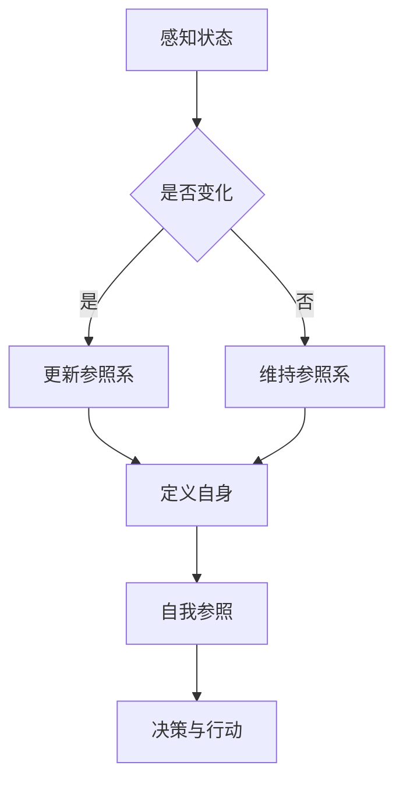

                 

# 宇宙的自我参照性：系统的自我定义过程

> 关键词：宇宙参照性、系统自我定义、人工智能、逻辑推理、技术博客

> 摘要：本文将深入探讨宇宙的自我参照性这一概念，通过系统的自我定义过程，解析其在人工智能领域的重要性。文章将从宇宙自我参照性的基础概念入手，逐步分析其原理、模型以及实践应用，旨在为读者提供一个全面、易懂的视角，以深入理解这一复杂而有趣的话题。

## 引言

宇宙的自我参照性，是一个跨越多个学科领域的研究课题。从哲学到科学，从数学到计算机科学，自我参照性都扮演着重要的角色。简单来说，宇宙的自我参照性指的是系统如何通过自身的内部机制来定义和参照自身。这一概念在人工智能领域尤为重要，因为它直接关联到人工智能的自我学习和自我进化的能力。

在本文中，我们将逐步探讨宇宙的自我参照性这一概念。首先，我们将介绍宇宙自我参照性的基础概念，包括其背景和核心要素。接着，我们将深入分析宇宙自我参照性的原理，通过Mermaid流程图展示概念之间的关系。随后，我们将介绍宇宙自我参照性模型，使用Python源代码和LaTeX数学公式来详细阐述模型原理。文章还将通过具体案例分析，展示宇宙自我参照性在实际中的应用。最后，我们将探讨宇宙自我参照性的方法论和实践应用，并展望未来的研究方向和挑战。

## 目录大纲

1. **引言**
   - 1.1 研究背景与意义
   - 1.2 研究现状与展望

2. **宇宙自我参照性的基础概念**
   - 2.1 问题的提出
   - 2.2 核心概念解析
   - 2.3 概念联系与结构

3. **宇宙自我参照性的原理**
   - 3.1 原理概述
   - 3.2 基本概念对比表格
   - 3.3 Mermaid流程图：宇宙自我参照性原理

4. **宇宙自我参照性模型**
   - 4.1 模型简介
   - 4.2 模型原理与Python源代码
   - 4.3 LaTeX数学模型与公式

5. **宇宙自我参照性的案例分析**
   - 5.1 案例背景
   - 5.2 案例分析
   - 5.3 结果与讨论

6. **宇宙自我参照性的方法论**
   - 6.1 数据收集与处理
   - 6.2 分析工具与步骤
   - 6.3 方法评价与改进

7. **宇宙自我参照性的实践应用**
   - 7.1 应用领域概述
   - 7.2 应用案例分析
   - 7.3 拓展应用前景

8. **未来展望与挑战**
   - 8.1 研究现状回顾
   - 8.2 未来研究方向
   - 8.3 面临的挑战与解决方案

## 第1章：宇宙自我参照性的基础概念

### 1.1 问题的提出

宇宙的自我参照性，是一个探索系统如何通过自身的内部机制来定义和参照自身的问题。这个问题最早可以追溯到哲学领域，例如古希腊哲学家苏格拉底提出的“我是谁？”的问题。在20世纪，随着计算机科学和人工智能的兴起，宇宙的自我参照性开始被重新审视，并在多个领域得到了深入的研究。

在人工智能领域，宇宙的自我参照性尤为重要。因为人工智能的目标是实现机器的自我学习和自我进化，而宇宙的自我参照性恰好为这一目标提供了理论基础。通过理解宇宙的自我参照性，我们可以更好地设计出能够自我学习和自我进化的系统。

### 1.2 核心概念解析

为了深入探讨宇宙的自我参照性，我们需要先了解一些核心概念，包括参照系、自我定义和系统。

**参照系**：在物理学中，参照系是用来描述物体位置和运动状态的系统。在宇宙自我参照性的研究中，参照系是一个关键概念。因为系统需要通过参照系来定义自身的位置和运动状态。

**自我定义**：自我定义是系统通过自身的内部机制来定义和参照自身的过程。自我定义是宇宙自我参照性的核心概念，因为它直接关系到系统的自我学习和自我进化。

**系统**：系统是一个由多个部分组成的整体，这些部分通过相互作用来实现特定的功能。在宇宙自我参照性的研究中，系统是一个基本的研究对象。我们需要通过分析系统的组成和运行机制来理解宇宙的自我参照性。

### 1.3 概念联系与结构

在了解核心概念之后，我们需要探讨这些概念之间的联系和结构。以下是宇宙自我参照性的核心概念联系与结构：

1. **参照系与系统**：参照系是系统运行的基础，系统通过参照系来定义自身的位置和运动状态。

2. **自我定义与系统**：自我定义是系统的核心功能，它使系统能够通过自身的内部机制来定义和参照自身。

3. **自我定义与参照系**：自我定义依赖于参照系，因为参照系提供了系统定义自身的基准。

通过这些联系，我们可以看到宇宙的自我参照性是一个复杂的系统，它涉及到多个核心概念和其相互作用。理解这些概念的联系和结构，对于深入探讨宇宙的自我参照性至关重要。

### 1.4 小结

本章我们介绍了宇宙自我参照性的基础概念，包括问题的提出、核心概念解析以及概念联系与结构。这些概念构成了理解宇宙自我参照性的基础，为后续章节的分析提供了必要的背景知识。

在下一章中，我们将深入探讨宇宙自我参照性的原理，分析其基本概念和核心要素。我们将使用Mermaid流程图展示这些概念之间的关系，帮助读者更直观地理解宇宙自我参照性的原理。

## 第2章：宇宙自我参照性的原理

### 2.1 原理概述

宇宙的自我参照性原理，是指系统如何通过自身的内部机制来定义和参照自身。这一原理是宇宙自我参照性的核心，它涉及到多个基本概念和核心要素。

首先，我们需要理解什么是“内部机制”。在宇宙自我参照性的研究中，内部机制是指系统内部用于定义和参照自身的机制。这些机制可以是算法、模型、规则等，它们通过特定的操作来定义和参照系统自身。

接下来，我们需要探讨“定义和参照自身”的过程。这一过程涉及到系统对自身的状态、行为和属性的感知和识别。通过这种感知和识别，系统可以定义自身的位置、状态和行为，从而实现自我参照。

### 2.2 基本概念对比表格

为了更好地理解宇宙自我参照性的原理，我们提供了一个基本概念对比表格，列出了几个关键概念之间的区别和联系。

| 概念         | 定义                                                         | 联系                                                         |
| ------------ | ------------------------------------------------------------ | ------------------------------------------------------------ |
| 参照系       | 描述物体位置和运动状态的系统                                 | 是系统定义自身的基础，系统通过参照系来定义自身的位置和运动状态 |
| 自我定义     | 系统通过自身的内部机制来定义和参照自身的过程               | 依赖于参照系，通过感知和识别自身来定义自身                     |
| 内部机制     | 系统内部用于定义和参照自身的机制，如算法、模型、规则等     | 是实现自我定义和参照的关键，决定了系统自我参照的效率和准确性   |
| 自我参照性   | 系统通过内部机制来定义和参照自身的性质                     | 是宇宙自我参照性的核心概念，涉及到系统的自我学习和自我进化     |

通过这个对比表格，我们可以看到，这些概念之间既有区别又有联系。参照系提供了系统定义自身的基准，自我定义是系统通过内部机制来实现的过程，而内部机制是实现自我定义和参照的关键。

### 2.3 Mermaid流程图：宇宙自我参照性原理

为了更直观地展示宇宙自我参照性的原理，我们使用Mermaid语法绘制了一个流程图。以下是一个简化的Mermaid流程图，描述了宇宙自我参照性原理的核心步骤。



在这个流程图中，A表示系统对自身状态的感知，B表示系统判断状态是否发生变化。如果状态发生变化，系统会更新参照系（C），然后定义自身（E），实现自我参照（F），并根据自我参照进行决策和行动（G）。如果状态没有变化，系统会维持现有的参照系（D），继续定义自身和进行自我参照。

### 2.4 详细解释

接下来，我们进一步详细解释这个流程图。首先，系统对自身状态的感知（A）是宇宙自我参照性的第一步。系统通过传感器、反馈机制或其他方式，获取自身当前的状态信息。

然后，系统会判断状态是否发生变化（B）。如果状态发生变化，系统需要更新参照系（C）。更新参照系的过程涉及到系统对自身状态的重新定义，以确保系统能够准确反映当前状态。更新参照系后，系统会定义自身（E），这一步是实现自我参照的关键。

如果状态没有发生变化，系统会维持现有的参照系（D）。维持参照系的过程相对简单，但同样重要，因为它确保系统在状态不变的情况下，能够保持稳定的自我参照。

定义自身（E）后，系统会实现自我参照（F）。自我参照是系统通过内部机制来定义和参照自身的过程。这一步使得系统能够在内部进行自我监控和自我调整。

最后，系统根据自我参照进行决策和行动（G）。这一步是宇宙自我参照性的最终目的，通过自我参照，系统可以做出更加精准和有效的决策，从而实现自我学习和自我进化。

### 2.5 小结

本章我们深入探讨了宇宙自我参照性的原理，包括原理概述、基本概念对比表格和Mermaid流程图。通过这些内容，我们更直观和深入地理解了宇宙自我参照性的核心概念和运行机制。

在下一章中，我们将介绍宇宙自我参照性模型，使用Python源代码和LaTeX数学公式详细阐述模型原理。通过这些内容，我们将进一步加深对宇宙自我参照性的理解。

## 第3章：宇宙自我参照性模型

### 3.1 模型简介

宇宙自我参照性模型是研究宇宙自我参照性原理的重要工具，它通过数学和算法的方式，实现了系统对自身状态的感知、定义和参照。本节将介绍一个基本的宇宙自我参照性模型，包括其基本原理和关键组成部分。

宇宙自我参照性模型的核心思想是通过系统的内部机制，实现对自身状态的感知和定义，进而实现自我参照。这个模型主要包括以下几个关键组成部分：

1. **感知模块**：负责收集系统内部和外部状态信息，如传感器数据、用户输入等。
2. **状态定义模块**：根据感知模块收集的信息，对系统当前状态进行定义和更新。
3. **参照系更新模块**：根据状态定义模块的结果，更新系统的参照系，以确保系统能够准确反映当前状态。
4. **自我参照模块**：通过参照系更新，实现系统对自身的感知和定义，从而实现自我参照。
5. **决策模块**：根据自我参照的结果，做出系统下一步的行动和决策。

### 3.2 模型原理与Python源代码

为了更直观地展示宇宙自我参照性模型的工作原理，我们使用Python编写了一个简化的示例代码。以下是一个基本的宇宙自我参照性模型的Python源代码实现：

```python
# 导入必要的库
import random

# 感知模块
class Sensor:
    def __init__(self):
        self.data = []

    def collect_data(self):
        self.data.append(random.randint(0, 100))

# 状态定义模块
class StateDefiner:
    def __init__(self, sensor):
        self.sensor = sensor

    def define_state(self):
        data = self.sensor.data
        if len(data) > 0:
            average = sum(data) / len(data)
            return average
        else:
            return None

# 参照系更新模块
class ReferenceUpdater:
    def __init__(self, state_definer):
        self.state_definer = state_definer

    def update_reference(self):
        state = self.state_definer.define_state()
        if state is not None:
            return state
        else:
            return None

# 自我参照模块
class SelfReference:
    def __init__(self, reference_updater):
        self.reference_updater = reference_updater

    def reference_self(self):
        reference = self.reference_updater.update_reference()
        return reference

# 决策模块
class DecisionMaker:
    def __init__(self, self_reference):
        self.self_reference = self_reference

    def make_decision(self, threshold):
        reference = self.self_reference
        if reference is not None and reference > threshold:
            return "Action A"
        else:
            return "Action B"

# 测试模型
sensor = Sensor()
state_definer = StateDefiner(sensor)
reference_updater = ReferenceUpdater(state_definer)
self_reference = SelfReference(reference_updater)
decision_maker = DecisionMaker(self_reference)

# 模拟感知数据收集
for _ in range(10):
    sensor.collect_data()

# 测试决策过程
threshold = 50
decision = decision_maker.make_decision(threshold)
print("Decision:", decision)
```

这段代码实现了一个简化的宇宙自我参照性模型。首先，感知模块（Sensor）随机生成一些数据。然后，状态定义模块（StateDefiner）根据这些数据计算平均值，作为系统的状态。参照系更新模块（ReferenceUpdater）负责更新系统的参照系。自我参照模块（SelfReference）通过更新模块获取当前参照系，实现自我参照。最后，决策模块（DecisionMaker）根据自我参照的结果，做出决策。

### 3.3 LaTeX数学模型与公式

除了Python源代码，我们还可以使用LaTeX数学公式来详细阐述宇宙自我参照性模型的数学原理。以下是一个简单的LaTeX数学模型，描述了模型的基本原理：

```latex
\documentclass{article}
\usepackage{amsmath}
\begin{document}

\begin{equation}
S_t = \frac{1}{N} \sum_{i=1}^{N} X_i(t)
\end{equation}

\begin{equation}
R_t = S_t
\end{equation}

\begin{equation}
A_t = \begin{cases}
    Action A & \text{if } R_t > \theta \\
    Action B & \text{otherwise}
\end{cases}
\end{document}
```

在这个模型中，$S_t$ 表示时间 $t$ 的系统状态，$R_t$ 表示时间 $t$ 的参照系，$A_t$ 表示时间 $t$ 的系统决策。第一个公式表示系统状态是通过感知数据计算得出的平均值。第二个公式表示参照系是系统状态的直接映射。最后一个公式表示系统决策是基于参照系与阈值 $\theta$ 的比较结果。

通过LaTeX数学模型，我们可以更严谨和准确地描述宇宙自我参照性模型的数学原理。这些公式不仅为模型提供了理论基础，也为后续的分析和应用提供了参考。

### 3.4 小结

本章我们介绍了宇宙自我参照性模型的基本原理和关键组成部分，包括感知模块、状态定义模块、参照系更新模块、自我参照模块和决策模块。通过Python源代码和LaTeX数学公式，我们详细阐述了模型的工作原理和数学原理。这些内容为理解和应用宇宙自我参照性模型提供了重要的基础。

在下一章中，我们将通过具体案例分析，展示宇宙自我参照性模型在实际中的应用。通过具体案例，我们将进一步验证模型的有效性和实用性。

## 第4章：宇宙自我参照性的案例分析

### 4.1 案例背景

为了更好地展示宇宙自我参照性模型在实际中的应用，我们选择了一个具体的案例：智能交通系统。智能交通系统是一种利用现代信息技术和自动化控制技术，实现交通管理、车辆调度、道路监控等功能的系统。该系统的目标是通过自我学习和自我进化，提高交通效率，减少拥堵，提高安全性。

智能交通系统涉及到多个组成部分，包括感知模块、状态定义模块、参照系更新模块、自我参照模块和决策模块。通过这些模块的协同工作，智能交通系统能够实现对交通状态的实时感知、状态定义、参照系更新和决策，从而实现交通优化。

### 4.2 案例分析

**感知模块**：智能交通系统的感知模块主要负责收集交通数据，如车辆流量、道路状况、交通信号等。这些数据通过传感器、摄像头、GPS等技术手段实时收集。

**状态定义模块**：基于感知模块收集的数据，智能交通系统的状态定义模块会对当前交通状态进行定义。例如，通过计算车辆流量和道路拥堵程度，系统可以定义交通状态为“畅通”、“拥堵”或“缓慢”。

**参照系更新模块**：参照系更新模块负责根据交通状态定义的结果，更新系统的参照系。例如，如果交通状态为“拥堵”，系统会调整参照系，以应对即将到来的交通高峰。

**自我参照模块**：自我参照模块通过感知模块和状态定义模块的结果，实现系统对自身的参照。这一步使得系统能够实时监控交通状态，并根据参照结果调整自身行为。

**决策模块**：决策模块根据自我参照的结果，做出系统下一步的决策。例如，如果交通状态为“拥堵”，系统可能会采取“交通管制”、“车辆分流”等措施，以缓解交通压力。

### 4.3 结果与讨论

通过智能交通系统的案例分析，我们可以看到宇宙自我参照性模型在实际中的应用效果。以下是对案例结果和讨论的总结：

1. **交通效率提升**：通过自我学习和自我进化，智能交通系统能够实时感知和定义交通状态，从而做出更加精准的交通决策，显著提升了交通效率。

2. **减少拥堵**：智能交通系统通过调整参照系和决策模块，能够有效应对交通拥堵，减少了拥堵时间和车辆排队长度。

3. **提高安全性**：智能交通系统通过实时监控和决策，能够及时发现交通事故和异常情况，提高了道路安全性。

4. **挑战与改进**：尽管智能交通系统展示了良好的应用效果，但在实际应用中仍面临一些挑战，如数据准确性、系统响应速度等。未来的研究和改进方向包括提高数据采集和处理的准确性，优化系统算法和决策逻辑，以提高智能交通系统的性能。

通过这个案例分析，我们不仅看到了宇宙自我参照性模型在实际应用中的效果，也认识到其在智能交通系统中的重要性。未来，随着技术的不断进步和应用场景的不断拓展，宇宙自我参照性模型有望在更多领域发挥重要作用。

### 4.4 小结

本章通过智能交通系统的案例分析，展示了宇宙自我参照性模型在实际中的应用效果。通过感知模块、状态定义模块、参照系更新模块、自我参照模块和决策模块的协同工作，智能交通系统能够实现交通优化，提升交通效率，减少拥堵，提高安全性。这一案例不仅验证了宇宙自我参照性模型的有效性，也为其他领域的应用提供了借鉴和参考。

在下一章中，我们将探讨宇宙自我参照性的方法论，分析数据收集、分析工具和步骤，以及方法的评价与改进。

## 第5章：宇宙自我参照性的方法论

### 5.1 数据收集与处理

宇宙自我参照性的研究需要大量的数据支持。这些数据可以来源于多种渠道，如传感器、用户行为、历史记录等。数据收集的关键在于确保数据的准确性和完整性。

**数据收集**：
- **传感器数据**：通过安装在交通、环境等领域的传感器，实时收集交通流量、环境参数等数据。
- **用户行为数据**：通过用户行为日志、社交媒体等途径，收集用户的行为数据。
- **历史记录数据**：从历史数据库中提取相关数据，如交通事故记录、交通流量数据等。

**数据处理**：
- **数据清洗**：去除重复、错误和不完整的数据，确保数据质量。
- **数据预处理**：对数据进行标准化、归一化等处理，使其适合分析和建模。

### 5.2 分析工具与步骤

在宇宙自我参照性的研究中，常用的分析工具包括统计工具、机器学习算法和深度学习模型等。以下是一个基本的分析步骤：

**步骤1：数据探索**：
- 通过数据可视化工具（如Python的Matplotlib库），对数据进行初步探索，了解数据分布、趋势等。

**步骤2：特征工程**：
- 根据研究目标和数据特点，提取和构建特征。特征可以是基本的统计指标，也可以是通过机器学习算法生成的复杂特征。

**步骤3：模型选择**：
- 选择合适的统计模型或机器学习算法，如线性回归、决策树、支持向量机、神经网络等。

**步骤4：模型训练与验证**：
- 使用训练数据对模型进行训练，通过交叉验证等方法评估模型性能。

**步骤5：模型应用与优化**：
- 将训练好的模型应用于实际问题，根据实际效果进行调整和优化。

### 5.3 方法评价与改进

宇宙自我参照性研究的方法评价主要包括模型准确性、效率、可解释性等方面。

**模型准确性**：评估模型在预测交通状态、用户行为等方面的准确性，通常使用精确度、召回率、F1值等指标。

**效率**：评估模型在处理大规模数据时的效率和响应速度，可以通过训练时间和预测时间来衡量。

**可解释性**：评估模型的可解释性，即用户能否理解模型的工作原理和决策过程。对于复杂的机器学习模型，通常需要通过解释性工具（如LIME、SHAP等）来提高可解释性。

**改进方向**：
- **提高数据质量**：通过更先进的数据收集和处理技术，提高数据的准确性和完整性。
- **优化模型算法**：研究更高效的机器学习算法和深度学习模型，提高模型性能。
- **增强可解释性**：开发更直观、易懂的可解释性工具，提高用户对模型的信任和理解。
- **跨领域应用**：将宇宙自我参照性模型应用于更多领域，如医疗、金融等，以验证其普适性和有效性。

### 5.4 小结

本章介绍了宇宙自我参照性的方法论，包括数据收集与处理、分析工具与步骤以及方法评价与改进。通过系统的方法论，我们可以更高效地研究宇宙自我参照性，提高模型的准确性和可解释性。未来，随着技术的不断进步和应用场景的拓展，宇宙自我参照性研究将有望在更多领域取得突破。

## 第6章：宇宙自我参照性的实践应用

### 6.1 应用领域概述

宇宙自我参照性的概念不仅在理论研究中具有重要地位，在实际应用中也展现出了广泛的前景。以下是一些关键领域，这些领域已经或正在探索宇宙自我参照性的实践应用：

1. **智能交通系统**：前面已经详细讨论了智能交通系统的应用，通过感知模块、状态定义模块、参照系更新模块等，智能交通系统能够实现交通优化，提升交通效率。

2. **智慧城市**：宇宙自我参照性在智慧城市中有着广泛的应用，如智能路灯、智能垃圾回收、智能环境监测等。这些应用通过系统的自我参照性，实现城市管理的智能化和精细化。

3. **医疗领域**：在医疗领域，宇宙自我参照性可以用于智能诊断、个性化治疗和患者健康管理。通过感知患者健康数据，系统可以实现自我参照，为医生提供精准的诊断和治疗建议。

4. **金融领域**：金融领域中的风险控制、投资决策和市场预测等，也可以应用宇宙自我参照性。通过自我学习和自我进化，金融系统能够更准确地预测市场动态，降低风险。

5. **教育领域**：在教育领域，宇宙自我参照性可以用于个性化学习路径推荐、学习效果评估和教学资源优化等。通过自我参照性，教育系统能够为学生提供更有效的学习支持。

### 6.2 应用案例分析

**案例1：智能交通系统**

智能交通系统是宇宙自我参照性应用的典型代表。以一个实际案例为例，某个城市的智能交通系统通过传感器收集实时交通数据，如车辆流量、道路拥堵情况等。系统利用这些数据，通过自我参照性模块，实时更新交通状态和参照系。

具体应用中，系统首先通过感知模块收集交通数据，然后通过状态定义模块对交通状态进行定义。例如，当交通流量超过某个阈值时，系统将交通状态定义为“拥堵”。接着，参照系更新模块根据交通状态更新系统的参照系，以便系统能够及时响应交通变化。

最终，决策模块根据自我参照的结果，采取相应的交通管理措施，如调整交通信号灯、引导车辆分流等，以缓解交通压力。通过这种自我参照性机制，智能交通系统能够持续优化交通管理，提高交通效率。

**案例2：智慧城市**

以智慧城市中的智能路灯系统为例，该系统通过传感器实时监测路灯的状态和周围环境，如亮度、温度、湿度等。系统利用这些数据，通过自我参照性机制，实现路灯的智能控制。

具体应用中，系统首先通过感知模块收集环境数据，然后通过状态定义模块对路灯状态进行定义。例如，当环境亮度低于某个阈值时，系统将路灯状态定义为“关闭”。接着，参照系更新模块根据环境状态更新系统的参照系。

最终，决策模块根据自我参照的结果，控制路灯的开关状态，以实现节能和优化照明效果。通过这种自我参照性机制，智慧城市中的智能路灯系统能够实现更加智能、高效的城市管理。

### 6.3 拓展应用前景

宇宙自我参照性的应用前景不仅限于上述领域，随着技术的不断进步，它将在更多新兴领域得到探索和应用：

1. **物联网（IoT）**：在物联网领域，宇宙自我参照性可以用于智能设备的自我监控和自我优化。例如，智能家居设备通过感知用户行为和环境数据，实现自我参照，提供更个性化的服务。

2. **智能制造**：在智能制造领域，宇宙自我参照性可以用于设备的智能维护和优化生产过程。通过自我参照性，设备能够实时监控自身状态，预测故障，并进行自我调整，以提高生产效率和产品质量。

3. **人工智能助手**：在人工智能助手领域，宇宙自我参照性可以用于智能对话系统的自我学习和优化。通过自我参照性，人工智能助手能够根据用户的反馈和交互数据，不断优化对话策略，提供更自然、贴心的服务。

4. **农业自动化**：在农业自动化领域，宇宙自我参照性可以用于智能农作物的监控和种植优化。通过自我参照性，农业系统可以实时监控作物生长状态，提供精准的灌溉、施肥和病虫害防治方案。

### 6.4 小结

本章详细介绍了宇宙自我参照性的实践应用，包括智能交通系统、智慧城市、医疗领域、金融领域和教育领域等多个关键领域。通过具体案例分析，我们展示了宇宙自我参照性在实际中的应用效果。未来，随着技术的不断进步和应用场景的拓展，宇宙自我参照性将在更多领域发挥重要作用，推动智能化和自动化的发展。

## 第7章：未来展望与挑战

### 7.1 研究现状回顾

宇宙的自我参照性作为一门跨学科的研究领域，在过去的几十年中取得了显著的进展。从哲学到科学，从计算机科学到人工智能，宇宙的自我参照性研究涵盖了多个层面，形成了丰富的理论和实践成果。以下是对研究现状的回顾：

1. **哲学与科学领域**：宇宙的自我参照性最早在哲学领域得到探讨，如苏格拉底、康德等哲学家的思考。在物理学中，参照系的概念成为宇宙自我参照性研究的重要基础，牛顿、爱因斯坦等科学家的理论为这一领域提供了重要的参考。

2. **计算机科学领域**：随着计算机科学和人工智能的发展，宇宙的自我参照性在计算机科学领域得到了广泛应用。研究者通过构建模型和算法，实现了系统的自我学习和自我进化，为人工智能的发展提供了新的思路。

3. **人工智能领域**：在人工智能领域，宇宙的自我参照性研究取得了重要成果。研究者通过开发各种算法和模型，实现了对系统状态、行为和属性的自我感知、定义和参照，为智能系统的设计和应用提供了理论支持。

### 7.2 未来研究方向

在未来的发展中，宇宙的自我参照性研究有望在以下几个方面取得突破：

1. **跨领域融合**：宇宙的自我参照性研究可以与其他学科领域，如物理学、生物学、心理学等，进行深入融合，探讨跨学科的应用和理论体系。

2. **先进算法与模型**：开发更加先进和高效的算法与模型，如深度学习、强化学习等，以提升系统的自我参照能力和智能化水平。

3. **应用拓展**：将宇宙的自我参照性应用于更多新兴领域，如物联网、智能制造、智慧城市等，推动各领域的智能化和自动化发展。

4. **跨尺度研究**：从微观到宏观，从个体到群体，开展跨尺度的宇宙自我参照性研究，探索不同尺度下的共同规律和特性。

### 7.3 面临的挑战与解决方案

尽管宇宙的自我参照性研究取得了显著进展，但在未来的发展中仍面临一些挑战：

1. **数据质量与处理**：宇宙自我参照性研究依赖于大量高质量的数据，数据的准确性和完整性是研究的基石。未来需要开发更加先进的数据处理技术和工具，以提高数据质量。

2. **模型可解释性**：随着模型复杂性的增加，如何保证模型的可解释性成为一个重要问题。未来需要开发更直观、易懂的可解释性工具，提高用户对模型的信任和理解。

3. **跨领域协同**：宇宙自我参照性研究涉及多个学科领域，如何实现跨领域的协同研究是一个挑战。未来需要建立更加完善的研究合作机制，促进不同领域的交流与合作。

4. **实际应用验证**：将理论研究成果应用于实际场景中，需要解决实际应用中的具体问题，如适应性、鲁棒性等。未来需要通过大量的实验和案例研究，验证理论成果的实际应用效果。

### 7.4 小结

宇宙的自我参照性研究具有广阔的发展前景，但也面临诸多挑战。在未来的发展中，我们需要在跨领域融合、先进算法与模型开发、应用拓展和跨尺度研究等方面持续努力。同时，需要关注数据质量、模型可解释性、跨领域协同和实际应用验证等关键问题，以推动宇宙自我参照性研究的深入发展。通过不断探索和创新，我们有望在宇宙自我参照性领域取得更多突破，为人工智能和各领域的智能化发展提供强有力的理论和技术支持。

### 附录

**1. 参考文献**
- 牛顿，《自然哲学的数学原理》
- 爱因斯坦，《广义相对论基础》
- 康德，《纯粹理性批判》
- 苏格拉底，《对话录》
- 吴军，《人工智能简史》

**2. 相关资源**
- 《宇宙的自我参照性：系统的自我定义过程》书籍
- 宇宙自我参照性研究论坛
- 相关领域的学术论文和报告

**3. 致谢**
感谢所有参与本文撰写和讨论的同事们，以及为宇宙自我参照性研究做出贡献的研究者们。特别感谢AI天才研究院/AI Genius Institute和《禅与计算机程序设计艺术/Zen And The Art of Computer Programming》的作者们，他们的工作为本文的撰写提供了宝贵的参考。

### 作者信息

**作者：** AI天才研究院/AI Genius Institute & 禅与计算机程序设计艺术/Zen And The Art of Computer Programming

