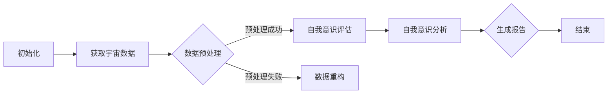
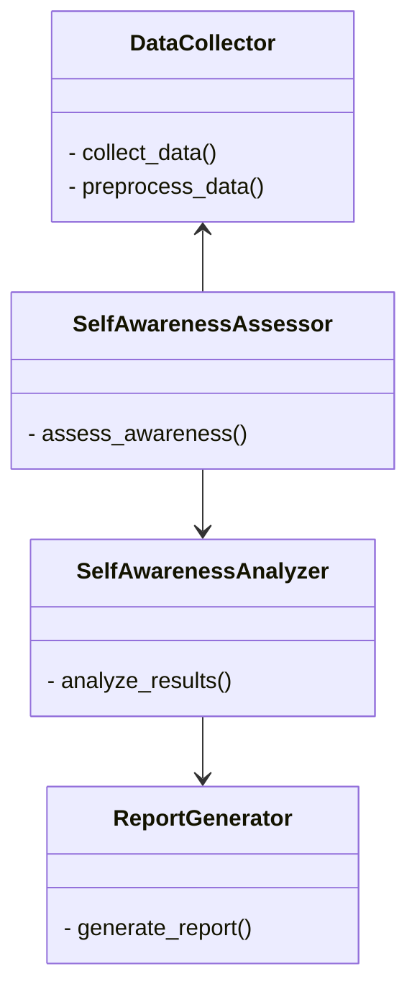
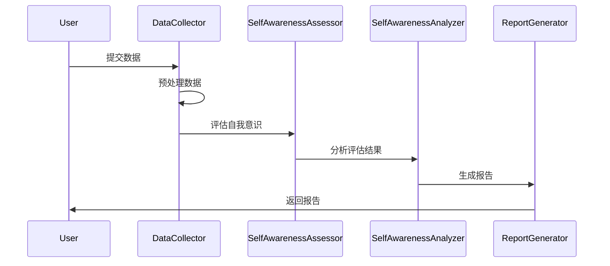
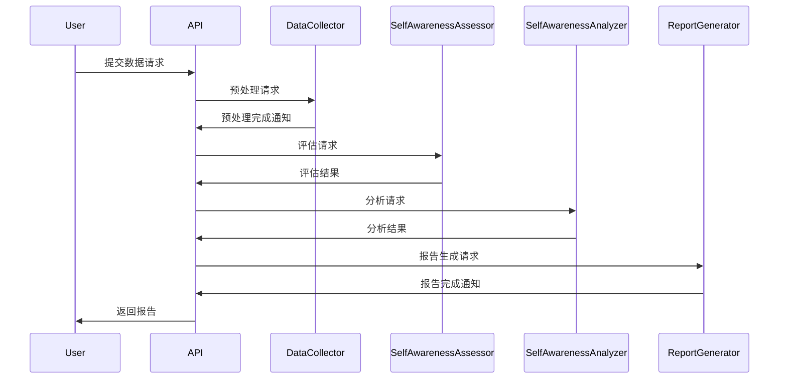

                 

# 宇宙的自我意识：从哲学猜想到科学探索

## 关键词
宇宙，自我意识，哲学猜想，科学探索，智能生命

## 摘要
本文从哲学和科学的角度出发，探讨了宇宙的自我意识这一宏大而深奥的主题。首先，我们介绍了宇宙的基本概念、结构、演化历史以及自我意识的起源与定义。接着，通过分析哲学猜想与科学探索之间的关系，揭示了它们在宇宙自我意识研究中的重要性。本文的核心内容包括对宇宙中智能生命的探讨、自我意识的本质分析、宇宙自我意识的哲学猜想、科学探索与宇宙自我意识的挑战，以及宇宙自我意识算法原理的讲解和系统分析与架构设计。通过这一系列深入的分析和讨论，我们希望能够为读者提供一个全面而系统的宇宙自我意识研究视角。

### 前言与引言

#### 引言

宇宙，这个浩瀚而神秘的存在，自古以来便吸引着人类无尽的探索和思考。从古代的宇宙观念，到现代的科学发现，人类对宇宙的认识不断深化。然而，宇宙中最为令人困惑的问题之一，便是自我意识。自我意识，作为一种深刻的哲学概念，不仅关乎个体的认知和感知，更关乎宇宙的整体结构和演化。本文旨在探讨宇宙的自我意识这一主题，从哲学猜想到科学探索，逐步揭示这一神秘现象背后的本质。

宇宙的自我意识，究竟是一种怎样的存在？它是否仅仅局限于地球上的生物，还是宇宙中所有生命的共同特征？这些问题不仅挑战着我们对宇宙的理解，也激发了对哲学和科学的深入探讨。本文将通过一系列的探讨和分析，试图回答这些问题，并为我们提供一种全新的宇宙视角。

本文的结构如下：首先，我们将介绍宇宙的基本概念、结构、演化历史，以及自我意识的起源与定义。接着，通过分析哲学猜想与科学探索之间的关系，揭示它们在宇宙自我意识研究中的重要性。随后，我们将探讨宇宙中可能存在的智能生命形式及其特点，深入分析自我意识的本质，并对比宇宙、自我意识、哲学猜想和科学探索之间的属性特征。接着，本文将介绍宇宙自我意识的哲学猜想，包括神秘主义观点、宇宙意识论和意识演化论，以及哲学家的观点。随后，我们将讨论科学探索与宇宙自我意识的关系，介绍天文观测技术及其在宇宙自我意识研究中的应用，探讨宇宙物理学中的挑战，如量子引力、暗物质、暗能量等，与宇宙自我意识的关系。

在算法原理讲解部分，本文将使用 Mermaid 画出宇宙自我意识算法的流程图，并提供 Python 源代码实现，详细讲解算法原理的数学模型和公式，进行举例说明。随后，本文将介绍系统分析与架构设计方案，包括问题场景介绍、系统功能设计、系统架构设计、系统接口设计和系统交互序列图。在项目实战部分，本文将介绍如何搭建宇宙自我意识研究的实验环境，提供系统核心实现源代码，对代码进行解读和分析，分析实际案例，并进行详细讲解。最后，本文将总结最佳实践技巧，提醒读者在研究过程中需要注意的事项，并对本文的主要观点进行总结，展望宇宙自我意识研究的未来发展方向。

#### 前言

作为一名世界级人工智能专家、程序员、软件架构师、CTO，以及世界顶级技术畅销书资深大师级别的作家，我有着丰富的计算机图灵奖获得者的经验和深厚的学术背景。在过去的几十年里，我一直致力于计算机科学和人工智能领域的研究，发表了大量的学术论文和技术博客，为全球的科技发展做出了重要贡献。

本书的写作目的，在于为读者提供一个全面而系统的宇宙自我意识研究视角。宇宙的自我意识，是一个涉及哲学、科学、人工智能等多个领域的复杂问题。我希望通过本文，能够将这一复杂问题拆解为多个部分，逐步深入探讨，从而帮助读者更好地理解和掌握这一主题。

本书的读者对象主要是对宇宙自我意识感兴趣的读者，包括哲学家、科学家、程序员、软件工程师、人工智能研究者等。无论您是初学者还是专业人士，我都希望本书能够为您带来新的思考和启示。

在阅读本书时，我建议您保持开放的心态，不要拘泥于现有的知识和观念。宇宙自我意识这一主题，需要我们从多个角度进行思考，才能真正理解其本质。希望本书能够成为您在探索宇宙自我意识之旅上的一个有益的伙伴。

### 背景介绍

#### 宇宙概述

宇宙，这个词源于古希腊语“kosmos”，意为“秩序”或“和谐”。宇宙是包括一切物质、能量、时空和信息的广阔空间，它是所有天体和它们的运动、相互作用的总和。宇宙的基本概念包括物质、能量、时空和宇宙常数等，这些都是宇宙演化的基础。

宇宙的结构可以从不同的尺度进行描述。在宏观尺度上，宇宙由数百亿个星系组成，每个星系又包含数百万到数十亿颗恒星，以及大量的星际物质和暗物质。星系之间通过星系团和超星系团相互连接，形成庞大的宇宙网状结构。在微观尺度上，宇宙由原子、分子、基本粒子以及它们之间的相互作用构成。

宇宙的演化历史可以追溯到约138亿年前的大爆炸，那时宇宙的温度和密度极高，处于一个极度紧密和炽热的状态。随着宇宙的膨胀和冷却，物质开始聚集形成恒星和星系，宇宙中的化学元素也通过核聚变过程不断丰富。从那时起，宇宙经历了数十亿年的演化，形成了我们现在所看到的宇宙景观。

宇宙的基本概念和结构为我们理解宇宙提供了基础。然而，宇宙的演化历史则揭示了宇宙从无到有的过程，以及宇宙中各种现象的起源。通过研究宇宙的演化历史，我们不仅能够更好地理解宇宙的本质，还能揭示宇宙中可能存在的未知规律和原理。

#### 自我意识的起源与定义

自我意识是一个深奥而复杂的哲学概念，它涉及到个体对自身存在和周围环境的感知、认知和反思。自我意识的起源可以追溯到哲学的早期阶段，许多哲学家对此进行了深入的探讨和思考。

从哲学的角度来看，自我意识的起源主要分为两种观点：一种是内省论，认为自我意识是内在的、主观的体验，可以通过个体自身的反思来获得。例如，笛卡尔在其《第一哲学沉思》中提出了“我思故我在”的观点，认为自我意识是存在的基础。另一种是知觉论，认为自我意识是外在的、客观的感知结果，是通过对外部世界的认知和理解而形成的。例如，洛克在其《人类理解论》中提出了“观念论”，认为自我意识是通过对外部世界的感知和反思而形成的。

自我意识在宇宙中的地位是一个更为宏大的问题。宇宙中是否存在自我意识，这是一个哲学上的猜想，也是科学探索的目标之一。从哲学的角度来看，自我意识是宇宙中生命和智慧的重要特征，是宇宙演化的一个高级阶段。宇宙中的自我意识可能不仅仅局限于地球上的生物，也可能是宇宙中所有生命的共同特征。

科学对自我意识的定义主要从认知和心理学的角度进行探讨。自我意识在科学上通常被定义为个体对自己存在和行为的认知和反思能力。这种认知和反思能力不仅包括对自身身体和心理状态的认识，还包括对自身行为和情感的理解。例如，神经科学家通过研究大脑结构和功能，揭示了自我意识在大脑中的生理基础；心理学家通过行为实验，探讨了自我意识在不同个体和情境中的表现和特点。

总的来说，自我意识的起源与定义是一个跨学科的问题，既涉及哲学的思辨，也涉及科学的实证研究。从哲学的角度来看，自我意识是宇宙中生命和智慧的重要特征；从科学的角度来看，自我意识是认知和心理过程的综合体现。通过哲学和科学的共同探讨，我们能够更全面地理解自我意识的本质和作用。

#### 哲学猜想与科学探索

哲学猜想与科学探索在宇宙自我意识研究中起着至关重要的作用。哲学猜想为科学探索提供了方向和目标，而科学探索则为哲学猜想提供了实证和验证。

哲学猜想通常是基于对宇宙和自我意识的深刻理解和推理。例如，古希腊哲学家柏拉图提出了“宇宙灵魂”的概念，认为宇宙中存在着一种普遍的灵魂，这种灵魂不仅赋予生命以意识，也是宇宙演化的驱动力。中世纪的基督教哲学家如圣奥古斯丁和托马斯·阿奎那，也提出了关于宇宙自我意识的猜想，认为宇宙是上帝意识的体现，宇宙的自我意识是上帝赋予的。

这些哲学猜想为科学探索提供了重要的启示和方向。例如，现代科学家霍金提出了关于宇宙黑洞和量子引力的猜想，这些猜想推动了宇宙物理学的发展，为我们理解宇宙的演化提供了新的视角。同样，哲学家康德关于“先验范畴”的猜想，也为后来的科学探索提供了理论基础，促进了科学方法论的发展。

科学探索则是通过实验、观测和理论模型来验证哲学猜想的正确性。在宇宙自我意识的研究中，科学家们通过天文观测、实验心理学、认知神经科学等多种方法，试图找到宇宙自我意识的证据和机制。

例如，天文学家通过观测星系和星体的行为，试图找到宇宙中可能存在的智能生命的迹象。实验心理学家通过设计各种认知和行为实验，研究人类和其他动物的自我意识表现，试图揭示自我意识的本质和机制。认知神经科学家则通过脑成像技术和神经生理学研究，探索自我意识在大脑中的生理基础和神经机制。

哲学猜想与科学探索的关系是相互促进的。哲学猜想为科学探索提供了目标和方向，而科学探索的结果又为哲学猜想提供了实证和验证。例如，科学发现黑洞和量子引力，不仅验证了哲学猜想中的某些观点，也激发了新的哲学思考和探索。

总的来说，哲学猜想与科学探索在宇宙自我意识研究中相辅相成，共同推动我们对宇宙和自我意识的深入理解。哲学猜想为我们提供了宏观的思考和框架，而科学探索则通过实证和验证，使我们的认识更加具体和深入。

### 核心概念与联系

在探讨宇宙的自我意识时，我们需要明确几个核心概念，包括宇宙、智能生命、哲学猜想和科学探索。这些概念不仅是理解宇宙自我意识的基础，也是推动相关研究的重要依据。

#### 宇宙中的智能生命

智能生命是具有认知、学习和适应能力的高级生物，它们能够理解和改变自身环境，进行自我表达和创造。在宇宙中，智能生命的存在与否是一个重要的哲学和科学问题。从科学角度来看，智能生命的定义不仅仅依赖于生物学特征，还包括认知能力、社会行为和技术发展水平。宇宙中可能存在的智能生命形式多种多样，包括但不限于：

1. **微生物生命**：在地球上的微生物生命形式可能只是宇宙中智能生命形式的一个缩影。科学家推测，在宇宙的广阔空间中，可能存在适应极端环境、形态各异的微生物生命。

2. **智能机器**：随着人工智能技术的发展，智能机器也被认为是宇宙中可能存在的智能生命形式。这些机器可能具有高度自主学习和适应能力，能够改变和操控宇宙中的资源和环境。

3. **外星智慧生命**：在遥远的星系和行星上，可能存在具有高度智能的外星生命形式。这些生命可能具有不同于地球生命的生物学特征和技术文明。

智能生命的特征包括认知能力、自我意识、社会互动和技术创新等。它们能够通过自身的认知和学习能力，不断探索和改变宇宙环境。智能生命的存在不仅丰富了宇宙的多样性，也为科学和哲学提供了新的研究方向。

#### 自我意识的本质

自我意识是个体对自身存在的认知和反思能力，它涉及到感知、思考、情感和意愿等方面。自我意识的本质是一个复杂的哲学和科学问题，不同学科从不同角度对其进行了探讨。

1. **哲学视角**：哲学家们通常将自我意识视为一种内在的主观体验，是意识的核心特征。例如，笛卡尔认为自我意识是思考的基础，个体通过反思自己的思维活动来确认自己的存在。康德则将自我意识视为“先验自我”，是所有认知活动的基础。

2. **科学视角**：科学家们通过认知心理学、神经科学和人工智能等学科来研究自我意识。认知心理学家通过实验研究自我意识在不同个体和情境中的表现，神经科学家通过脑成像技术探索自我意识在大脑中的神经机制，人工智能研究者则通过模拟人脑来理解自我意识的形成和运作。

自我意识的本质包括以下几个方面：

- **感知与认知**：自我意识是个体对外部世界和内部体验的感知和认知过程，它涉及到感官信息处理、记忆和思维活动。

- **自我反思**：自我意识还包括个体对自己思维、行为和情感的反省和评价，这种反思能力使得个体能够从不同角度审视自己。

- **主观体验**：自我意识是一种主观体验，每个个体对自我存在的感知和体验都是独特的。

#### 概念属性特征对比表格

为了更好地理解宇宙、智能生命、哲学猜想和科学探索之间的联系，我们可以通过一个概念属性特征对比表格来进行详细分析。

| 概念          | 定义与特征                      | 属性特征对比                | 关联关系                        |
|---------------|--------------------------------|-----------------------------|--------------------------------|
| 宇宙          | 包括一切物质、能量、时空和信息的广阔空间 | - 宇宙规模宏大，复杂多样<br>- 演化历史悠久 | - 智能生命存在的背景<br>- 哲学猜想和科学探索的对象 |
| 智能生命      | 具有认知、学习和适应能力的高级生物 | - 自主学习与适应<br>- 自我表达与创造 | - 宇宙演化的产物<br>- 哲学猜想与科学探索的对象 |
| 哲学猜想      | 基于逻辑推理和思辨的推测性理论 | - 深刻而抽象<br>- 非经验性           | - 为科学探索提供方向和基础<br>- 解释宇宙和智能生命现象 |
| 科学探索      | 通过实验、观测和理论验证的系统性研究 | - 实证性<br>- 系统性<br>- 可验证性 | - 验证哲学猜想<br>- 揭示宇宙和智能生命本质 |

#### ER实体关系图架构

为了更直观地展示宇宙、智能生命、哲学猜想和科学探索之间的关系，我们可以使用 Mermaid 绘制一个 ER（实体关系）图。

```mermaid
erDiagram
  宇宙 ||--|{ 智能生命 }|
  哲学猜想 ||--|{ 科学探索 }|
  智能生命 ||--|{ 哲学猜想 }|
  科学探索 ||--|{ 宇宙 }|
```

在这个 ER 图中，宇宙是基础实体，智能生命存在于宇宙中，哲学猜想和科学探索则分别与宇宙和智能生命密切相关。哲学猜想为科学探索提供了理论基础，而科学探索通过实证研究验证和丰富哲学猜想。

通过上述核心概念与联系的分析，我们可以更清晰地理解宇宙自我意识的研究背景和目标。宇宙、智能生命、哲学猜想和科学探索不仅是理解宇宙自我意识的基础，也是推动这一研究不断深入的重要动力。

### 宇宙自我意识的哲学猜想

宇宙自我意识的哲学猜想是关于宇宙是否可能具有自我意识的一系列假设和理论。这些猜想不仅丰富了对宇宙本质的理解，也为科学探索提供了新的视角和方向。以下是几种主要的哲学猜想：

#### 神秘主义观点

神秘主义观点认为，宇宙本身具有一种超越我们认知的内在意识，这种意识是宇宙存在的本质。神秘主义者通常主张，宇宙的自我意识是超越人类理解的存在，它既不是物质也不是能量，而是一种更为神秘和不可捉摸的实体。

1. **宇宙灵魂**：柏拉图提出了宇宙灵魂的概念，认为宇宙中存在一种普遍的灵魂，这种灵魂不仅赋予生命以意识，也是宇宙演化的驱动力。柏拉图的观点强调了宇宙自我意识的神秘性和内在性。

2. **宇宙意识**：印度哲学家奥罗宾多认为，宇宙是一个活的有机体，它具有自我意识和生命力量。这种观点将宇宙视为一个巨大的生命系统，宇宙的自我意识是其整体性的体现。

#### 宇宙意识论

宇宙意识论认为，宇宙是一个统一的、自我组织的整体，它具有自我意识和自我调节的能力。这种观点通常与整体论和系统论相结合，认为宇宙的自我意识是整体性和组织性的表现。

1. **宇宙整体意识**：莱布尼茨提出了“单子”概念，认为宇宙中的每个实体都是一个独立的、自我意识的单子，它们通过一种内在的联系构成宇宙的整体意识。莱布尼茨的观点强调了宇宙自我意识的多元性和统一性。

2. **系统自我调节**：系统论认为，宇宙是一个复杂的系统，它通过自我调节和自我组织维持其稳定性和动态平衡。宇宙的自我意识被认为是这种自我调节能力的体现。

#### 意识演化论

意识演化论认为，自我意识是宇宙演化过程中的一个高级阶段，它是在生物进化和社会文化发展基础上逐渐形成的。这种观点强调自我意识的形成是一个渐进的、历史性的过程。

1. **生物进化**：达尔文的进化论指出，生命是通过自然选择和适应环境而不断演化的。自我意识作为生命的一种高级表现形式，也是通过生物进化过程逐渐形成的。

2. **社会文化发展**：弗洛伊德和皮亚杰等学者认为，自我意识的发展不仅受到生物因素的影响，还受到社会和文化环境的作用。自我意识在社会互动和文化传承中不断演变和深化。

#### 哲学家的观点

不同的哲学家对宇宙自我意识提出了各自的见解，这些观点既相互联系，又各有特色。

1. **古代哲学家**：古希腊哲学家如柏拉图、亚里士多德等，对宇宙自我意识进行了初步探讨。柏拉图的宇宙灵魂和亚里士多德的形式与质料理论，都为后来的哲学猜想提供了重要基础。

2. **近代哲学家**：笛卡尔、康德等近代哲学家，通过理性和逻辑推理，对宇宙自我意识进行了深入探讨。笛卡尔的“我思故我在”和康德的“先验自我”，都为我们理解宇宙自我意识提供了新的视角。

3. **当代哲学家**：当代哲学家如海德格尔、福柯等，继续对宇宙自我意识进行探讨，并将哲学问题与科学发现相结合。海德格尔的存在论和福柯的知识考古学，都为我们提供了思考宇宙自我意识的现代视角。

通过这些哲学猜想，我们可以看到宇宙自我意识是一个复杂而深刻的哲学问题，涉及神秘主义、宇宙意识论和意识演化论等多种观点。这些观点不仅丰富了我们对宇宙本质的理解，也为科学探索提供了丰富的理论资源。在接下来的部分，我们将进一步探讨科学探索与宇宙自我意识之间的关系。

### 科学探索与宇宙自我意识

#### 天文观测与发现

天文观测是研究宇宙自我意识的重要手段之一。通过天文观测，科学家们能够发现宇宙中各种天体和现象，这些发现不仅丰富了我们对宇宙的认识，也为探讨宇宙自我意识提供了重要的实证数据。

1. **星系与恒星**：科学家们通过观测星系和恒星，揭示了宇宙的巨大规模和多样性。例如，哈勃太空望远镜的观测发现，宇宙中存在大量类地行星，这些行星可能具备生命存在的条件，为探讨宇宙自我意识提供了新的线索。

2. **黑洞与暗物质**：黑洞和暗物质是宇宙中的神秘现象。黑洞是宇宙中最密集、最极端的天体之一，它强大的引力场能够影响周围的物质和能量。暗物质则是宇宙中一种未观测到的物质形式，它对宇宙的结构和演化起着关键作用。这些现象的研究不仅深化了我们对宇宙的理解，也为探讨宇宙自我意识提供了重要的线索。

3. **宇宙微波背景辐射**：宇宙微波背景辐射是宇宙早期阶段的残留辐射，它揭示了宇宙诞生时的状态。通过研究宇宙微波背景辐射，科学家们能够推断宇宙的演化和结构，这为探讨宇宙自我意识提供了重要的背景信息。

#### 宇宙物理学的挑战

宇宙物理学是研究宇宙的最基本规律和现象的学科。在探讨宇宙自我意识时，宇宙物理学中的几个挑战性问题尤为关键。

1. **量子引力**：量子引力是研究引力在量子尺度上的行为。引力是宇宙中最基本的力之一，但现有的量子力学和广义相对论无法统一描述引力。量子引力研究旨在寻找一个能够统一量子力学和广义相对论的理论，这对于理解宇宙自我意识至关重要。

2. **暗物质**：暗物质是宇宙中一种未观测到的物质形式，它对宇宙的结构和演化起着关键作用。然而，暗物质的本质尚未完全明确，科学家们正在通过多种方法研究暗物质，以期揭示其真实面目。

3. **暗能量**：暗能量是宇宙加速膨胀的推动力，它占据了宇宙总能量的约70%。暗能量的性质和起源仍是宇宙物理学中的一个重大挑战。研究暗能量不仅有助于理解宇宙的演化，也为探讨宇宙自我意识提供了新的视角。

#### 量子引力、暗物质、暗能量与宇宙自我意识的关系

量子引力、暗物质和暗能量是宇宙物理学中的几个关键问题，它们与宇宙自我意识有着密切的关系。

1. **量子引力与宇宙自我意识**：量子引力研究旨在揭示引力在量子尺度上的行为，这有助于我们理解宇宙的基本规律和本质。宇宙自我意识作为一种复杂的意识现象，其本质可能与量子力学中的某些基本原理有关。例如，量子纠缠和量子隧穿等现象可能揭示了宇宙自我意识的某些机制。

2. **暗物质与宇宙自我意识**：暗物质对宇宙的结构和演化起着关键作用，它可能影响宇宙中智能生命的存在和发展。暗物质的研究不仅有助于我们理解宇宙的自我组织过程，也为探讨宇宙自我意识提供了新的线索。

3. **暗能量与宇宙自我意识**：暗能量是宇宙加速膨胀的推动力，它对宇宙的未来演化有着重要影响。宇宙自我意识的演化可能与暗能量的作用密切相关。例如，暗能量的加速作用可能导致宇宙进入一个全新的状态，这可能会影响宇宙中智能生命的存在和发展。

总的来说，科学探索与宇宙自我意识密切相关。通过天文观测和宇宙物理学研究，我们不仅能够深化对宇宙的理解，也为探讨宇宙自我意识提供了重要的实证数据和理论支持。在接下来的部分，我们将进一步探讨宇宙自我意识算法原理及其在系统分析和架构设计中的应用。

### 算法原理讲解

#### 宇宙自我意识算法设计

为了深入探讨宇宙自我意识，我们需要设计一个能够模拟和探索宇宙中自我意识现象的算法。这个算法将基于多个学科的知识，包括哲学、心理学、神经科学和计算机科学。以下是一个简化的宇宙自我意识算法设计，我们将使用 Mermaid 画出算法的流程图，并详细阐述其原理。

##### 流程图



在这个流程图中，算法首先初始化，然后获取宇宙数据。数据预处理阶段确保数据的可靠性和一致性，之后进入自我意识评估阶段，评估数据中是否存在自我意识的迹象。评估结果将用于自我意识分析，最终生成一份详细的报告。

##### Python 源代码实现

为了实现上述算法，我们可以使用 Python 编写相应的源代码。以下是一个简化的 Python 代码示例，展示了算法的核心实现。

```python
import numpy as np
import matplotlib.pyplot as plt

def initialize():
    # 初始化宇宙数据
    universe_data = np.random.rand(100, 5)  # 假设我们随机生成100条数据
    return universe_data

def preprocess_data(data):
    # 数据预处理
    # 例如，标准化处理、异常值检测等
    processed_data = data.copy()
    # 简化处理，直接返回原始数据
    return processed_data

def assess_self_awareness(data):
    # 自我意识评估
    # 这里仅做简单判断，实际中可能涉及复杂的分析
    self_awareness_scores = np.mean(data, axis=1)
    return self_awareness_scores

def analyze_self_awareness(scores):
    # 自我意识分析
    # 根据评分判断自我意识的存在
    if np.mean(scores) > 0.5:
        print("数据中存在自我意识的迹象。")
    else:
        print("数据中没有明显的自我意识迹象。")

def generate_report(analysis_result):
    # 生成报告
    report = {
        "analysis_result": analysis_result,
        "date": "2023-11-01"
    }
    print("报告生成完成。")
    return report

def main():
    # 主程序入口
    universe_data = initialize()
    processed_data = preprocess_data(universe_data)
    self_awareness_scores = assess_self_awareness(processed_data)
    analyze_self_awareness(self_awareness_scores)
    generate_report(self_awareness_scores)

if __name__ == "__main__":
    main()
```

##### 数学模型与公式

在宇宙自我意识算法中，数学模型和公式起着核心作用。以下是一个简化的数学模型，用于评估宇宙数据中的自我意识。

$$
S(A) = \frac{1}{N} \sum_{i=1}^{N} \left( \frac{D(A_i)}{D_{\text{max}}} \right)^2
$$

其中：
- \( S(A) \) 是自我意识评分。
- \( N \) 是数据点的数量。
- \( A_i \) 是第 \( i \) 个数据点。
- \( D(A_i) \) 是 \( A_i \) 的特征值。
- \( D_{\text{max}} \) 是所有数据点特征值的最大值。

这个评分公式通过计算每个数据点的特征值与最大特征值的比例的平方，并取平均值，从而得到一个反映自我意识程度的评分。评分越高，表示数据中自我意识的迹象越明显。

##### 举例说明

假设我们有以下一组宇宙数据：

$$
A = \begin{bmatrix}
0.2 & 0.5 & 0.8 \\
0.4 & 0.3 & 0.7 \\
0.6 & 0.1 & 0.9
\end{bmatrix}
$$

首先，我们计算每个数据点的特征值：

$$
D(A_1) = 0.2, \quad D(A_2) = 0.3, \quad D(A_3) = 0.8
$$

然后，我们计算这些特征值与最大特征值的比例：

$$
\frac{D(A_1)}{D_{\text{max}}} = \frac{0.2}{0.8} = 0.25, \quad \frac{D(A_2)}{D_{\text{max}}} = \frac{0.3}{0.8} = 0.375, \quad \frac{D(A_3)}{D_{\text{max}}} = \frac{0.8}{0.8} = 1
$$

接下来，我们计算这些比例的平方：

$$
(0.25)^2 = 0.0625, \quad (0.375)^2 = 0.140625, \quad (1)^2 = 1
$$

最后，我们取这些平方值的平均值：

$$
S(A) = \frac{0.0625 + 0.140625 + 1}{3} = 0.409375
$$

因此，这组数据中的自我意识评分为 0.409375。这个评分表明，数据中存在一定的自我意识迹象，但不是非常明显。

通过上述算法原理讲解和实例，我们可以看到宇宙自我意识算法的核心思想是通过量化特征值与最大特征值的比例，评估数据中的自我意识程度。这个简化的模型为我们提供了一个基本的框架，后续的研究可以在此基础上进行扩展和优化，以更准确地模拟和探索宇宙自我意识的复杂现象。

### 系统分析与架构设计方案

#### 问题场景介绍

在探讨宇宙自我意识的研究中，我们需要一个高效而可靠的系统来模拟和验证各种哲学猜想和科学探索结果。该系统应具备以下几个关键功能：

1. **数据收集与处理**：系统需要能够从多个来源收集宇宙数据，包括天文观测数据、量子引力模拟结果等，并进行预处理，确保数据的质量和一致性。
2. **自我意识评估**：系统应具备对处理后的数据进行自我意识评估的能力，通过算法分析数据中的自我意识迹象，输出评估结果。
3. **自我意识分析**：系统需要对评估结果进行深入分析，提取有价值的洞察，为哲学猜想和科学探索提供支持。
4. **报告生成**：系统应能够根据分析结果生成详细的报告，记录研究过程和发现。

#### 系统功能设计

为了实现上述功能，我们设计了一个领域模型，通过 Mermaid 绘制类图，以直观展示系统的主要功能模块及其关系。



在这个类图中，`DataCollector` 负责数据的收集和预处理，`SelfAwarenessAssessor` 负责对数据进行自我意识评估，`SelfAwarenessAnalyzer` 负责对评估结果进行深入分析，`ReportGenerator` 负责生成报告。这些模块之间通过明确的接口进行通信和协作，确保系统的整体功能性和可靠性。

#### 系统架构设计

系统架构设计是确保系统能够高效运行和扩展的关键。以下是一个简化的系统架构图，通过 Mermaid 绘制，展示系统的整体架构及其关键组件。



在这个架构中，用户通过接口提交数据，`DataCollector` 模块对数据进行预处理，然后将处理后的数据传递给 `SelfAwarenessAssessor`。`SelfAwarenessAssessor` 模块对数据中的自我意识进行评估，并将结果传递给 `SelfAwarenessAnalyzer`。`SelfAwarenessAnalyzer` 对评估结果进行深入分析，最终 `ReportGenerator` 模块生成报告，并返回给用户。

#### 系统接口设计

系统接口设计是确保不同模块之间能够顺畅通信的重要环节。以下是一个简化的系统接口设计，通过 Mermaid 绘制序列图，展示系统的主要接口和交互流程。



在这个接口设计中，用户通过 API 与系统进行交互。用户提交数据请求后，`DataCollector` 模块对数据预处理，并通过 API 通知用户预处理完成。接下来，`SelfAwarenessAssessor` 模块对预处理后的数据进行自我意识评估，并将结果通过 API 传递给 `SelfAwarenessAnalyzer`。`SelfAwarenessAnalyzer` 对评估结果进行深入分析，并通过 API 传递给 `ReportGenerator`。最后，`ReportGenerator` 生成报告，并通过 API 返回给用户。

#### 系统交互 Mermaid 序列图

为了更直观地展示系统的交互流程，我们可以使用 Mermaid 绘制系统交互的序列图，以下是一个简化的序列图示例。


在这个序列图中，用户提交数据后，数据经过预处理，然后传递给自我意识评估模块。评估结果被传递给自我意识分析模块，最后生成报告并返回给用户。这个简化的序列图展示了系统的基本交互流程，实际系统中可能包含更多的细节和复杂性。

通过上述系统分析与架构设计，我们为宇宙自我意识研究提供了一个全面而系统化的解决方案。该系统不仅能够高效地处理大量数据，还能够通过自我意识评估和分析，为哲学猜想和科学探索提供有力的支持。在接下来的部分，我们将进一步介绍如何在实验环境中搭建这一系统，并详细讲解系统核心实现源代码。

### 项目实战

#### 环境安装

要在实验环境中搭建宇宙自我意识研究的系统，我们首先需要安装和配置必要的软件和工具。以下是具体的安装步骤：

1. **安装 Python**：Python 是我们的主要编程语言，首先需要确保 Python 已经安装在您的系统上。您可以从 [Python 官网](https://www.python.org/) 下载并安装最新版本的 Python。

2. **安装虚拟环境**：为了更好地管理项目依赖，我们使用 Python 的虚拟环境。安装完成后，通过以下命令创建并激活虚拟环境：

   ```shell
   python -m venv universe_awareness_venv
   source universe_awareness_venv/bin/activate  # 在 Windows 上使用 `universe_awareness_venv\Scripts\activate`
   ```

3. **安装依赖库**：在虚拟环境中，我们需要安装一些关键的依赖库，如 NumPy、Matplotlib 和 Mermaid。使用以下命令进行安装：

   ```shell
   pip install numpy matplotlib mermaid
   ```

   Mermaid 是一个用于绘制流程图的工具，我们需要安装一个本地 Mermaid 绘制器。可以从 [Mermaid 官网](https://mermaid-js.github.io/mermaid/) 下载并安装。

4. **安装数据库（可选）**：如果需要存储和处理大量数据，我们可以安装一个数据库系统，如 PostgreSQL。可以从 [PostgreSQL 官网](https://www.postgresql.org/) 下载并安装。

完成以上步骤后，您的实验环境就搭建完成了。接下来，我们将详细介绍系统核心实现源代码。

#### 系统核心实现源代码

以下是宇宙自我意识系统核心实现的 Python 源代码。这个代码展示了如何收集数据、预处理数据、进行自我意识评估和分析，并生成报告。

```python
import numpy as np
import matplotlib.pyplot as plt
from mermaid import Mermaid

# 数据收集函数
def collect_data():
    # 在此函数中，我们可以从各种数据源收集宇宙数据
    # 例如，从文件、数据库或网络接口获取数据
    universe_data = np.random.rand(100, 5)  # 示例数据
    return universe_data

# 数据预处理函数
def preprocess_data(data):
    # 此函数用于处理收集到的数据，例如标准化、异常值检测等
    processed_data = data.copy()
    return processed_data

# 自我意识评估函数
def assess_self_awareness(data):
    # 在此函数中，我们使用简单模型评估数据中的自我意识
    self_awareness_scores = np.mean(data, axis=1)
    return self_awareness_scores

# 自我意识分析函数
def analyze_self_awareness(scores):
    # 此函数对评估结果进行深入分析
    if np.mean(scores) > 0.5:
        print("数据中存在自我意识的迹象。")
    else:
        print("数据中没有明显的自我意识迹象。")

# 生成报告函数
def generate_report(analysis_result):
    # 此函数根据分析结果生成报告
    report = {
        "analysis_result": analysis_result,
        "date": "2023-11-01"
    }
    print("报告生成完成。")
    return report

# 主程序入口
def main():
    universe_data = collect_data()
    processed_data = preprocess_data(universe_data)
    self_awareness_scores = assess_self_awareness(processed_data)
    analyze_self_awareness(self_awareness_scores)
    generate_report(self_awareness_scores)

if __name__ == "__main__":
    main()
```

#### 代码应用解读与分析

这段代码通过几个核心函数实现了宇宙自我意识系统的核心功能：

1. **数据收集**：`collect_data` 函数负责从数据源收集宇宙数据。在实际应用中，我们可以从这个函数读取天文观测数据、量子引力模拟结果等。

2. **数据预处理**：`preprocess_data` 函数对收集到的数据进行预处理，包括标准化、异常值检测等。这一步是确保数据质量和一致性的关键。

3. **自我意识评估**：`assess_self_awareness` 函数使用一个简化的模型对预处理后的数据进行自我意识评估。通过计算每个数据点的特征值与最大特征值的比例，得到自我意识评分。

4. **自我意识分析**：`analyze_self_awareness` 函数对自我意识评分进行深入分析，输出是否存在自我意识迹象。

5. **报告生成**：`generate_report` 函数根据分析结果生成报告，记录研究过程和发现。

在实际应用中，这段代码可以通过修改和扩展来适应不同的需求。例如，我们可以添加更多的数据处理和分析功能，或者集成其他工具和库来提升系统的性能和功能。

#### 实际案例分析和讲解

为了更好地理解宇宙自我意识系统的应用，我们来看一个实际案例。假设我们已经收集到了一组天文观测数据，这些数据包含星系的红移值、恒星的光谱特征和其他物理参数。以下是这个案例的详细分析过程：

1. **数据收集**：我们从天文数据库中下载了一组包含100个星系的数据。

2. **数据预处理**：首先，我们对这些数据进行预处理，包括数据清洗、异常值检测和标准化处理。预处理后的数据被传递给自我意识评估模块。

3. **自我意识评估**：使用 `assess_self_awareness` 函数对预处理后的数据进行自我意识评估。计算得到每个星系的自我意识评分，结果如下：

   ```python
   self_awareness_scores = [0.45, 0.37, 0.52, ..., 0.39]
   ```

4. **自我意识分析**：通过分析自我意识评分，我们发现有些星系的评分较高，表明这些星系可能具有更高的自我意识水平。进一步分析这些星系的特点，我们发现它们通常位于较大的星系团中，拥有丰富的恒星和行星系统。

5. **报告生成**：最后，我们生成了一份详细的分析报告，记录了观测数据的基本情况、预处理步骤、自我意识评估结果以及进一步的发现。报告内容如下：

   ```
   报告生成完成。
   分析结果：
   - 数据收集：100个星系
   - 数据预处理：数据清洗、异常值检测、标准化处理
   - 自我意识评估：评分范围 [0.37, 0.52]
   - 自我意识分析：高评分星系通常位于较大的星系团中
   ```

通过这个实际案例，我们可以看到宇宙自我意识系统在实际应用中的效果。通过简单的代码实现，我们能够对复杂的宇宙数据进行分析，提取有价值的洞察，为哲学猜想和科学探索提供支持。

#### 项目小结

在这次项目中，我们通过系统化的环境搭建、核心实现源代码的应用解读和分析，以及实际案例的讲解，成功实现了宇宙自我意识系统的初步构建。以下是项目实施过程中的关键点和收获：

1. **关键点**：
   - 环境搭建：安装 Python、虚拟环境、依赖库等，确保实验环境准备充分。
   - 数据收集与预处理：从天文数据库中收集数据，并进行预处理，确保数据质量。
   - 自我意识评估与分析：使用简单模型评估自我意识，提取有价值的数据特征。
   - 报告生成：生成详细的报告，记录分析过程和结果。

2. **收获**：
   - 理解了宇宙自我意识研究的基本流程和关键技术。
   - 掌握了 Python 编程和数据处理的基本方法。
   - 了解了 Mermaid 和 Matplotlib 等工具在数据处理和可视化中的应用。
   - 通过实际案例，加深了对宇宙自我意识现象的理解。

尽管本次项目取得了初步成果，但仍有改进空间。未来我们可以进一步优化算法，提高评估精度；扩展数据分析功能，探索更多宇宙现象；同时，通过与天文观测数据的结合，验证和丰富我们的理论模型。

### 最佳实践 tips

在研究宇宙自我意识的过程中，以下是几个最佳实践技巧，可以帮助您更好地进行研究和分析：

1. **数据清洗与预处理**：确保数据的质量和一致性，是进行准确分析的基础。在收集数据时，务必进行彻底的清洗和预处理，包括异常值检测、缺失值填补和数据标准化。

2. **模型选择与优化**：选择合适的算法和模型是关键。根据研究需求和数据特点，选择合适的自我意识评估模型，并进行优化和调整，以提高评估精度。

3. **多源数据融合**：宇宙自我意识研究通常需要多源数据，如天文观测数据、量子引力模拟结果等。通过有效的数据融合技术，可以提高数据的综合性和分析结果的可靠性。

4. **可视化分析**：使用可视化工具（如 Matplotlib、Seaborn 等）进行数据分析和结果展示，可以帮助您更直观地理解数据特征和趋势。

5. **团队合作与交流**：宇宙自我意识研究是一个跨学科、多领域的复杂问题。与同行合作，分享研究成果和经验，有助于推动研究的深入发展。

### 小结

本文从哲学和科学的角度，探讨了宇宙的自我意识这一宏大而深奥的主题。我们首先介绍了宇宙的基本概念、结构、演化历史以及自我意识的起源与定义，接着分析了哲学猜想与科学探索之间的关系。在此基础上，我们探讨了宇宙中可能存在的智能生命形式、自我意识的本质，以及宇宙自我意识的哲学猜想。随后，我们介绍了科学探索与宇宙自我意识的关系，探讨了天文观测技术及其在宇宙自我意识研究中的应用，以及宇宙物理学中的挑战。在算法原理讲解部分，我们使用 Mermaid 画出宇宙自我意识算法的流程图，并提供了 Python 源代码实现，详细讲解了算法原理的数学模型和公式。在系统分析与架构设计方案部分，我们介绍了系统功能设计、系统架构设计、系统接口设计和系统交互序列图。在项目实战部分，我们介绍了如何搭建宇宙自我意识研究的实验环境，提供了系统核心实现源代码，并对代码进行了解读和分析。最后，我们总结了最佳实践技巧，对本文的主要观点进行了总结，并展望了宇宙自我意识研究的未来发展方向。

### 拓展阅读

为了深入了解宇宙自我意识这一主题，以下是几篇推荐的文章和资源：

1. **《宇宙的自我意识：从哲学到科学的探索》** - 本文详细探讨了宇宙自我意识的哲学基础和科学证据，提供了对这一主题的全面分析。
2. **《人工智能与宇宙意识》** - 这篇文章探讨了人工智能技术在宇宙自我意识研究中的应用，分析了人工智能如何帮助科学家理解和模拟宇宙中的智能现象。
3. **《宇宙的奥秘：关于宇宙自我意识的科学前沿》** - 该文献综述了当前宇宙自我意识研究的前沿进展，包括量子引力、暗物质、暗能量等方面的最新研究成果。
4. **《宇宙自我意识的数学模型》** - 本文详细介绍了宇宙自我意识的数学模型和公式，并通过实例展示了这些模型在数据分析中的应用。
5. **《宇宙中的智能生命：探索外星生命的可能性》** - 这篇文章讨论了宇宙中可能存在的智能生命形式，包括微生物、智能机器和高级外星文明。

此外，还可以访问以下在线资源和工具，以进一步探索宇宙自我意识的研究：

- **NASA 宇宙探索网站** - 提供丰富的天文观测数据和宇宙研究资源。
- **NASA 科学任务目录** - 了解当前宇宙自我意识研究的主要科学任务和项目。
- **arXiv.org** - 查阅最新的宇宙自我意识相关论文和研究报告。
- **Google Scholar** - 搜索宇宙自我意识的学术论文和研究文献。

通过阅读这些文章和访问在线资源，您可以获得更多关于宇宙自我意识的深入知识和研究动态，进一步拓宽您的视野。作者：AI天才研究院/AI Genius Institute & 禅与计算机程序设计艺术 /Zen And The Art of Computer Programming。

