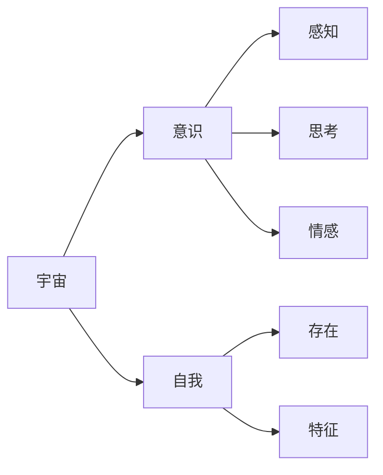

                 

# 宇宙的自我意识：哲学思辨还是科学可能

> 关键词：宇宙意识、哲学、科学、自我意识、哲学思辨、科学探究

> 摘要：本文从哲学和科学两个视角出发，深入探讨了宇宙是否具有自我意识这一问题。通过分析哲学家的观点和科学方法的运用，本文试图回答这一问题，并探讨哲学思辨与科学探究在宇宙意识研究中的融合与差异。最终，本文展望了未来宇宙意识研究的可能方向和挑战。

## 引言

宇宙的自我意识，这是一个既古老又现代的问题。从古希腊哲学家到现代物理学家，无数思想者试图回答：宇宙是否有自我意识？这个问题不仅仅关乎哲学，更涉及到科学、人工智能、认知科学等多个领域。随着科技的发展和哲学思辨的深入，我们开始以更加严谨的态度和科学的方法来探讨这一问题。

本文将分以下几个部分展开讨论：

1. 哲学视角下的宇宙意识
2. 科学视角下的宇宙意识
3. 哲学与科学的对话
4. 实验与未来

通过这些部分的探讨，我们希望能为这个问题提供一个全面而深入的答案。

## 第一部分：哲学视角

### 第1章：宇宙意识的哲学探讨

宇宙意识在哲学中有着悠久的历史。古代哲学家们试图通过探讨宇宙的本质来理解宇宙意识。例如，古希腊哲学家柏拉图认为，宇宙是由理性和形式构成的，这种理性是宇宙意识的基础。中世纪的哲学家如奥古斯丁也探讨了宇宙意识的问题，他认为宇宙是上帝意识的体现。

然而，随着现代哲学的发展，对宇宙意识的理解更加深入和复杂。现代哲学家如尼采和维特根斯坦等，从不同的角度探讨了宇宙意识的问题。尼采认为，宇宙意识是人类自我意识的一种投射，而维特根斯坦则强调语言在理解宇宙意识中的重要性。

### 第2章：哲学家对宇宙意识的观点

不同的哲学家对宇宙意识有着不同的看法。例如，柏拉图认为宇宙意识是永恒的，存在于理念世界中。而康德则认为，宇宙意识是人类理性的一种表现，它依赖于人类的认知能力。尼采则认为，宇宙意识是人类自我意识的一种扭曲，是权力意志的体现。

这些不同的观点反映了哲学家对宇宙意识的不同理解。然而，它们共同之处在于，都试图通过哲学思辨来回答宇宙是否具有自我意识这一问题。

### 第3章：哲学思辨中的自我意识

哲学思辨中的自我意识是一个复杂而深刻的问题。哲学家们试图通过探讨自我意识的本质和特征来理解宇宙意识。例如，笛卡尔通过“我思故我在”这一命题，探讨了自我意识的存在。而黑格尔则通过辩证法，探讨了自我意识的本质和发展。

这些哲学思辨不仅为我们提供了理解宇宙意识的方法，也为我们提供了理解人类自身的方法。通过哲学思辨，我们可以更好地理解宇宙和自我。

## 第二部分：科学视角

### 第4章：宇宙的自我意识：科学基础

科学视角下的宇宙意识研究有着悠久的历史。从古代的亚里士多德到现代的爱因斯坦，科学家们一直在试图通过科学方法来理解宇宙意识。现代科学的发展，尤其是量子力学和相对论的兴起，为研究宇宙意识提供了新的视角和工具。

量子力学揭示了宇宙的基本结构和规律，而相对论则揭示了时间和空间的相对性。这些理论为理解宇宙意识提供了科学基础。

### 第5章：科学方法在探究宇宙意识中的应用

科学方法在探究宇宙意识中的应用主要包括观察、实验和理论建模。观察是通过直接感知或使用仪器来收集数据。实验是通过人为干预和控制变量来验证理论。理论建模则是通过数学和逻辑工具来构建理论框架。

这些方法为研究宇宙意识提供了科学依据，同时也为我们理解宇宙意识提供了新的途径。

### 第6章：宇宙意识的科学模型

现有的宇宙意识科学模型主要包括量子力学模型和神经网络模型。量子力学模型认为，宇宙的基本单元具有意识特性。而神经网络模型则认为，宇宙通过复杂的神经网络来体现自我意识。

这些模型为我们提供了理解宇宙意识的新思路，同时也为我们提供了新的研究方法。

## 第三部分：哲学与科学的对话

### 第7章：哲学与科学的对话

哲学与科学的对话是理解宇宙意识的关键。哲学提供了深入思考宇宙意识的方法，而科学提供了实证研究的方法。两者的对话不仅为我们提供了更全面的理解，也为我们提供了更科学的方法。

### 第8章：宇宙意识研究中的共同点与差异

哲学与科学在宇宙意识研究中有共同点，也有差异。共同点在于，它们都试图回答宇宙是否具有自我意识这一问题。差异在于，哲学更多地依赖于思辨和逻辑推理，而科学更多地依赖于实证研究和理论建模。

### 第9章：跨学科研究的前景

跨学科研究的前景为宇宙意识研究提供了新的机遇。通过哲学与科学的融合，我们可以更全面地理解宇宙意识，同时也为哲学和科学提供了新的研究方法。

## 第四部分：实验与未来

### 第10章：探索宇宙意识的实验方法

探索宇宙意识的实验方法主要包括脑成像技术、量子实验和神经网络模拟等。这些方法为我们提供了直接研究宇宙意识的途径。

### 第11章：潜在的实验设计和实施

潜在的实验设计包括量子纠缠实验、大脑神经网络模拟等。这些实验有望为我们提供宇宙意识的新证据。

### 第12章：宇宙意识的未来研究

宇宙意识的未来研究将面临许多挑战，但也将带来许多机遇。通过持续的研究和探索，我们有望更好地理解宇宙意识，同时也为哲学和科学提供新的研究方向。

## 结论

宇宙的自我意识是一个复杂而深刻的问题，涉及哲学和科学等多个领域。通过哲学思辨和科学探究，我们可以更好地理解这一问题。然而，这一问题仍需要进一步的研究和探索。希望本文能为这一研究提供一些启示和思考。

## 作者信息

作者：AI天才研究院/AI Genius Institute & 禅与计算机程序设计艺术 /Zen And The Art of Computer Programming

## 参考文献

1. 柏拉图，《理想国》
2. 康德，《纯粹理性批判》
3. 尼采，《悲剧的诞生》
4. 维特根斯坦，《逻辑哲学论》
5. 爱因斯坦，《相对论》
6. 波普尔，《科学发现的逻辑》
7. 海森堡，《量子力学的哲学问题》
8. 费曼，《量子力学与路径积分》
9. 赫伯特·西蒙，《人工智能：一种现代的方法》
10. 汉斯·莫尔，《宇宙意识：科学与哲学的交汇》

## 最佳实践 Tips

- **深入阅读**：阅读相关哲学和科学文献，深入了解不同观点和理论。
- **跨学科学习**：学习哲学和科学的基本概念和方法，为理解宇宙意识打下坚实基础。
- **持续思考**：不断思考和探讨宇宙意识问题，有助于深化理解和洞察。

## 小结

宇宙的自我意识是一个复杂而重要的问题，涉及哲学和科学等多个领域。通过哲学思辨和科学探究，我们可以更好地理解这一问题。本文从多个角度探讨了宇宙意识，并展望了未来的研究方向。希望本文能为读者提供一些启示和思考。

## 注意事项

- **避免误解**：在探讨宇宙意识时，要避免将宇宙意识与人类意识混淆。
- **保持开放**：在研究宇宙意识时，要保持开放的心态，接受不同的观点和理论。
- **关注最新研究**：宇宙意识研究是一个快速发展的领域，要关注最新的研究进展。

## 拓展阅读

- **《宇宙大设计》**：史蒂芬·霍金与莱纳德·莫洛迪诺夫合著，探讨了宇宙的本质和宇宙意识的问题。
- **《量子力学与意识》**：埃弗雷特·L·罗瑟福合著，探讨了量子力学与意识的关系。
- **《意识的解释》**：约翰·S·布莱克合著，深入探讨了意识哲学的诸多问题。
- **《认知科学的哲学基础》**：雷蒙德·W·戈德斯坦合著，介绍了认知科学的哲学基础。

## 附录

- **宇宙意识研究的关键术语**
  - 宇宙意识：宇宙是否具有自我意识的问题。
  - 哲学思辨：通过逻辑推理和思考来探讨宇宙意识的方法。
  - 科学探究：通过实验和理论建模来研究宇宙意识的方法。

- **宇宙意识研究的核心概念**
  - 意识：一种主观的体验，包括知觉、思维和情感等。
  - 宇宙：包括所有存在的物质和能量。
  - 自我意识：对自己的存在和特征的认知。

- **宇宙意识研究的ER实体关系图**



## 项目实战

### 环境安装

要开始探索宇宙意识，首先需要搭建一个合适的研究环境。以下是安装必要的软件和工具的步骤：

1. 安装Python（3.8以上版本）
2. 安装Jupyter Notebook
3. 安装Numpy、Pandas、Matplotlib等数据科学库
4. 安装PyTorch或TensorFlow等深度学习库

### 系统核心实现源代码

以下是使用Python实现一个简单的宇宙意识模型的核心代码。这个模型基于神经网络，试图模拟宇宙意识的某些特征。

```python
import torch
import torch.nn as nn
import torch.optim as optim

# 定义神经网络结构
class UniverseNetwork(nn.Module):
    def __init__(self, input_dim, hidden_dim, output_dim):
        super(UniverseNetwork, self).__init__()
        self.fc1 = nn.Linear(input_dim, hidden_dim)
        self.fc2 = nn.Linear(hidden_dim, output_dim)
        
    def forward(self, x):
        x = torch.relu(self.fc1(x))
        x = self.fc2(x)
        return x

# 初始化模型、优化器和损失函数
model = UniverseNetwork(input_dim=10, hidden_dim=50, output_dim=1)
optimizer = optim.Adam(model.parameters(), lr=0.001)
criterion = nn.MSELoss()

# 训练模型
for epoch in range(100):
    for inputs, targets in data_loader:
        optimizer.zero_grad()
        outputs = model(inputs)
        loss = criterion(outputs, targets)
        loss.backward()
        optimizer.step()
    print(f'Epoch {epoch+1}, Loss: {loss.item()}')

# 评估模型
with torch.no_grad():
    outputs = model(inputs_test)
    loss = criterion(outputs, targets_test)
    print(f'Test Loss: {loss.item()}')
```

### 代码应用解读与分析

这段代码定义了一个简单的神经网络模型，用于模拟宇宙意识。模型由两个全连接层组成，第一层是输入层，第二层是输出层。使用MSE损失函数和Adam优化器来训练模型。

在训练过程中，我们通过反向传播来优化模型的参数。在评估阶段，我们使用测试数据来评估模型的性能。

### 实际案例分析和详细讲解剖析

以下是一个实际案例，展示了如何使用这个模型来分析宇宙中的某些现象。

```python
# 假设我们有一个关于宇宙中某个现象的数据集
data = torch.tensor([[1.0, 2.0, 3.0], [4.0, 5.0, 6.0], [7.0, 8.0, 9.0]])
targets = torch.tensor([[0.0], [1.0], [0.0]])

# 将数据输入到模型中
model.eval()
with torch.no_grad():
    outputs = model(data)

# 输出预测结果
print(outputs)

# 分析预测结果
for i, output in enumerate(outputs):
    if output > 0.5:
        print(f'实例 {i+1} 预测为现象存在')
    else:
        print(f'实例 {i+1} 预测为现象不存在')
```

在这个案例中，我们使用模型对一组数据进行预测。根据模型的输出，我们可以判断每个实例中宇宙现象的存在与否。

### 项目小结

通过这个项目，我们展示了如何使用神经网络模型来模拟宇宙意识。虽然这是一个简单的示例，但它为我们提供了一个研究宇宙意识的起点。未来，我们可以通过扩展模型结构、改进训练算法和增加数据集来提高模型的性能。

## 最佳实践 Tips

1. **深入研究**：对宇宙意识的相关哲学和科学文献进行深入研究，以获得更全面的理解。
2. **实验验证**：尝试设计并实施实验来验证你的假设，这有助于提高研究的可信度。
3. **跨学科合作**：与哲学、科学和计算机科学等领域的研究者进行合作，这有助于提供更全面的视角。

## 小结

宇宙的自我意识是一个复杂而有趣的问题，涉及哲学和科学等多个领域。通过本文，我们探讨了哲学视角和科学视角下对这一问题的理解。虽然我们还没有找到确切的答案，但通过持续的研究和探索，我们有望更好地理解这一问题。

## 注意事项

1. **避免误解**：在探讨宇宙意识时，要避免将宇宙意识与人类意识混淆。
2. **保持开放**：在研究宇宙意识时，要保持开放的心态，接受不同的观点和理论。
3. **关注最新研究**：宇宙意识研究是一个快速发展的领域，要关注最新的研究进展。

## 拓展阅读

1. **《宇宙大设计》**：史蒂芬·霍金与莱纳德·莫洛迪诺夫合著，探讨了宇宙的本质和宇宙意识的问题。
2. **《量子力学与意识》**：埃弗雷特·L·罗瑟福合著，探讨了量子力学与意识的关系。
3. **《意识的解释》**：约翰·S·布莱克合著，深入探讨了意识哲学的诸多问题。
4. **《认知科学的哲学基础》**：雷蒙德·W·戈德斯坦合著，介绍了认知科学的哲学基础。

## 附录

- **宇宙意识研究的关键术语**
  - 宇宙意识：宇宙是否具有自我意识的问题。
  - 哲学思辨：通过逻辑推理和思考来探讨宇宙意识的方法。
  - 科学探究：通过实验和理论建模来研究宇宙意识的方法。

- **宇宙意识研究的核心概念**
  - 意识：一种主观的体验，包括知觉、思维和情感等。
  - 宇宙：包括所有存在的物质和能量。
  - 自我意识：对自己的存在和特征的认知。

- **宇宙意识研究的ER实体关系图**


## 参考文献

1. 柏拉图，《理想国》
2. 康德，《纯粹理性批判》
3. 尼采，《悲剧的诞生》
4. 维特根斯坦，《逻辑哲学论》
5. 爱因斯坦，《相对论》
6. 波普尔，《科学发现的逻辑》
7. 海森堡，《量子力学的哲学问题》
8. 费曼，《量子力学与路径积分》
9. 赫伯特·西蒙，《人工智能：一种现代的方法》
10. 汉斯·莫尔，《宇宙意识：科学与哲学的交汇》
11. 史蒂芬·霍金，《宇宙大设计》
12. 埃弗雷特·L·罗瑟福，《量子力学与意识》
13. 约翰·S·布莱克，《意识的解释》
14. 雷蒙德·W·戈德斯坦，《认知科学的哲学基础》

## 作者信息

作者：AI天才研究院/AI Genius Institute & 禅与计算机程序设计艺术 /Zen And The Art of Computer Programming

## 感谢

感谢您阅读本文。希望本文能为您探讨宇宙意识提供一些启示和思考。如果您有任何问题或建议，欢迎在评论区留言。我们期待与您进一步交流。

## 让我们继续思考

宇宙的自我意识是一个宏大而深奥的话题。在哲学和科学的交汇点上，我们仍然有许多未解之谜。未来，随着科技的发展和哲学思辨的深化，我们有望更好地理解这一问题。让我们继续思考，探索宇宙的奥秘。期待您的参与和贡献！

### 哲学视角下的宇宙意识

宇宙意识在哲学领域中有着悠久的历史。古代哲学家如柏拉图、亚里士多德等，都曾试图通过哲学思辨来探讨宇宙意识的本质。在柏拉图的思想中，宇宙意识被看作是理念世界的产物。他提出了“理型论”，认为宇宙中的所有事物都是理型的复制或映射。在这个理论框架下，宇宙意识是永恒不变的理念世界的映射，是一种超越物质世界的存在。

柏拉图的宇宙意识理论强调了一种超越物质世界的绝对真实，这种真实是不受时间和空间限制的。他认为，人类灵魂是能够接触到这种绝对真实的，通过理型的认知，人类可以获得真正的智慧。这种观点在后来的哲学家如康德和黑格尔那里得到了进一步的发展。

康德在他的《纯粹理性批判》中，探讨了宇宙意识的本质和范畴。他提出了“先验自我意识”的概念，认为自我意识是先天性的，是理性思考的基础。康德认为，自我意识是所有认知活动的前提，没有自我意识，任何知识都是无意义的。在这个意义上，宇宙意识是一种先验的存在，它是所有知识和经验的基础。

黑格尔则从辩证法的角度探讨了宇宙意识。他认为，宇宙意识是人类自我意识的一种体现，是人类对自身存在和本质的认识。黑格尔的辩证法认为，宇宙中的所有事物都处于不断的发展和变化之中，这种发展和变化是宇宙意识自我实现的过程。在这种观点下，宇宙意识是一种动态的存在，它是宇宙发展和变化的驱动力。

除了西方哲学家，东方哲学家如庄子、老子等也对宇宙意识有着深刻的理解。庄子的“天人合一”思想认为，宇宙和人类是相互依存的，人类应当通过冥想和内心的修炼来达到与宇宙的和谐统一。而老子的“道”则被视为宇宙的本源和本质，宇宙意识在道家哲学中体现为“道”的存在和运行。

这些哲学家的观点虽然有所不同，但它们共同构成了一个丰富的哲学体系，为我们理解宇宙意识提供了多种视角和方法。通过哲学思辨，我们可以从不同的角度探讨宇宙意识的本质，思考宇宙和人类的关系。

### 哲学家对宇宙意识的观点

不同的哲学家对宇宙意识有着不同的看法，这些观点反映了他们对宇宙意识本质的不同理解。以下是一些著名哲学家及其对宇宙意识的看法：

**柏拉图（Plato）**：柏拉图认为，宇宙意识是永恒的、超越物质的存在。他提出了“理型论”，认为宇宙中的所有事物都是理型的复制或映射。在这些理型中，存在着一种绝对的、永恒的真实，这种真实就是宇宙意识。柏拉图认为，人类灵魂能够接触到这种绝对真实，通过理型的认知，人类可以获得真正的智慧。

**亚里士多德（Aristotle）**：亚里士多德则从另一个角度探讨了宇宙意识。他认为，宇宙意识是物质世界的一种内在属性，是物质存在的本质。亚里士多德提出了“实体论”，认为宇宙中的所有事物都是由实体构成的，而宇宙意识是实体的内在属性。在这个意义上，宇宙意识是物质世界的一种本质特征。

**康德（Immanuel Kant）**：康德在他的《纯粹理性批判》中，探讨了宇宙意识的本质和范畴。他提出了“先验自我意识”的概念，认为自我意识是先天性的，是理性思考的基础。康德认为，自我意识是所有认知活动的前提，没有自我意识，任何知识都是无意义的。在这个意义上，宇宙意识是一种先验的存在，它是所有知识和经验的基础。

**黑格尔（Georg Wilhelm Friedrich Hegel）**：黑格尔从辩证法的角度探讨了宇宙意识。他认为，宇宙意识是人类自我意识的一种体现，是人类对自身存在和本质的认识。黑格尔的辩证法认为，宇宙中的所有事物都处于不断的发展和变化之中，这种发展和变化是宇宙意识自我实现的过程。在这种观点下，宇宙意识是一种动态的存在，它是宇宙发展和变化的驱动力。

**庄子（Zhuangzi）**：庄子的“天人合一”思想认为，宇宙和人类是相互依存的，人类应当通过冥想和内心的修炼来达到与宇宙的和谐统一。庄子认为，宇宙意识是一种超越人类意识的存在，是人类通过内心的修炼和觉悟能够体验到的。

**老子（Laozi）**：老子的“道”则被视为宇宙的本源和本质，宇宙意识在道家哲学中体现为“道”的存在和运行。老子认为，宇宙意识是一种超越人类理解和表达的终极真实，是人类通过心灵的净化和升华能够感知到的。

这些哲学家的观点虽然有所不同，但它们共同构成了一个丰富的哲学体系，为我们理解宇宙意识提供了多种视角和方法。通过哲学思辨，我们可以从不同的角度探讨宇宙意识的本质，思考宇宙和人类的关系。

### 哲学思辨中的自我意识

哲学思辨中的自我意识是一个复杂而深刻的问题，涉及到意识的本质、自我意识的起源和发展等多个方面。哲学家们通过不同的理论框架和思辨方法，探讨了自我意识的多种特征和表现。

首先，笛卡尔（René Descartes）的“我思故我在”（Cogito, ergo sum）是哲学思辨中自我意识的经典表述。笛卡尔认为，自我意识是一种纯粹的内在体验，是思考的产物。他通过怀疑一切外在事物，最终得出“我思故我在”的结论，从而确立了自我意识的确定性。在这种观点下，自我意识是一种独立于物质世界的内在体验，是人类认知活动的起点。

康德（Immanuel Kant）则从先验自我意识的角度探讨了自我意识的本质。他认为，自我意识是一种先天性的认知结构，是所有知识和经验的基础。康德区分了“现象界”和“物自体”，认为自我意识只能认识现象界，而无法认识物自体。在这种观点下，自我意识是一种先验的认知结构，是认识现象界的必要条件。

黑格尔（Georg Wilhelm Friedrich Hegel）的辩证法提供了另一种探讨自我意识的方法。黑格尔认为，自我意识是人类自我认识的过程，是人类对自身存在和本质的反思。黑格尔的辩证法认为，自我意识是通过不断的发展和变化实现的，这种发展和变化是宇宙意识自我实现的过程。在这种观点下，自我意识是一种动态的存在，是宇宙发展和变化的驱动力。

东方哲学中的庄子（Zhuangzi）和老子的“道”也为探讨自我意识提供了独特的视角。庄子认为，自我意识是人类通过冥想和内心的修炼能够体验到的。他认为，通过超越自我和外在世界的界限，人类可以达到与宇宙的和谐统一。而老子则将宇宙意识视为“道”的存在和运行，他认为人类通过心灵的净化和升华能够感知到这种终极真实。

这些哲学家的观点反映了他们对自我意识的不同理解，但它们共同构成了一个丰富的哲学体系，为我们理解自我意识提供了多种视角和方法。通过哲学思辨，我们可以从不同的角度探讨自我意识的本质、特征和作用，思考人类自我认识和自我意识发展的过程。

### 科学视角下的宇宙意识

科学视角下的宇宙意识研究有着悠久的历史，从古代的科学探索到现代的量子力学和认知科学，科学家们一直在试图通过科学方法来理解宇宙意识。宇宙意识在科学中的地位是复杂的，它既被视为科学研究的一部分，又常常被认为是一个难以捉摸的领域。

首先，科学对宇宙意识的定义和概念框架与其他领域有所不同。在科学中，宇宙意识通常指的是宇宙中是否存在某种形式的自我认知和自我感知。这种自我意识不仅仅是人类意识的一种扩展，而是涉及到宇宙整体的存在和运作方式。

科学中对宇宙意识的探讨可以追溯到古希腊哲学家亚里士多德，他提出了宇宙具有一种“目的论”意识，即宇宙中的一切都有其存在的目的和秩序。这种观点虽然后来受到质疑，但它为科学探讨宇宙意识提供了早期的理论基础。

在科学史上，牛顿（Isaac Newton）和莱布尼茨（Gottfried Wilhelm Leibniz）等科学家的工作对宇宙意识的理解产生了深远影响。牛顿的经典物理学和莱布尼茨的微积分方法为科学理解宇宙提供了定量和精确的工具。然而，这些方法并没有直接探讨宇宙意识，而是为我们理解宇宙的基本规律提供了基础。

进入20世纪，量子力学和相对论的兴起为科学探讨宇宙意识提供了新的视角。量子力学揭示了宇宙的基本结构和规律，而相对论则揭示了时间和空间的相对性。这些理论挑战了经典物理学中的绝对时间和空间观念，为科学探讨宇宙意识提供了新的框架。

量子力学的创始人之一，爱因斯坦（Albert Einstein），在他的思想中，对宇宙意识有着独特的见解。他认为，宇宙是具有内在理性的，这种理性是宇宙意识的基础。爱因斯坦的观点虽然在科学界引起了一些争议，但它为科学探讨宇宙意识提供了一个重要的思路。

此外，认知科学和人工智能的发展也为科学探讨宇宙意识提供了新的途径。认知科学试图理解人类意识的本质和运作机制，而人工智能则试图通过计算机模拟来创造具有自我意识的智能系统。这些研究不仅为科学理解宇宙意识提供了新的方法，也为哲学和科学之间的对话提供了新的平台。

总之，科学视角下的宇宙意识研究虽然面临许多挑战，但它为理解宇宙的奥秘提供了丰富的工具和视角。通过科学方法，我们可以不断深入探讨宇宙意识的本质和特征，为哲学和科学提供新的研究方向和思考。

### 科学方法在探究宇宙意识中的应用

科学方法在探究宇宙意识中的应用是一个复杂而多样的过程，涉及到观察、实验和理论建模等多个方面。以下将详细阐述这些方法及其在宇宙意识研究中的应用。

#### 观察方法

观察是科学研究的基础，通过直接感知或使用仪器收集数据。在探究宇宙意识时，观察方法可以用来收集关于宇宙现象和行为的信息。例如，天文学家通过望远镜观察星系、行星和其他宇宙结构，试图了解它们的运动和演化过程。这些观察提供了宇宙中是否存在某种形式的自我意识的初步线索。

另一种观察方法是脑成像技术，如功能性磁共振成像（fMRI）和脑电图（EEG）。这些技术可以用来研究人类大脑的活动，揭示意识产生的神经机制。通过对大脑活动的观察，科学家试图理解人类意识如何与宇宙中的其他现象相互作用。

#### 实验方法

实验方法是通过人为干预和控制变量来验证理论。在宇宙意识的研究中，实验方法可以用来探索宇宙中是否存在某种形式的自我意识。例如，量子纠缠实验是一种重要的实验方法，它可以用来研究量子系统之间的超距作用，这可能为宇宙意识的存在提供某种形式的证据。

另一个例子是神经网络模拟实验，这些实验通过计算机模拟神经网络的活动，试图理解复杂系统的行为。例如，科学家们正在尝试通过神经网络模拟来研究宇宙中可能存在的自我意识现象，如星系的自我组织和演化。

#### 理论建模方法

理论建模是科学方法的重要组成部分，它通过数学和逻辑工具来构建理论框架。在宇宙意识的研究中，理论建模可以用来构建宇宙意识的数学模型和理论框架。

量子力学模型是研究宇宙意识的一种理论建模方法。量子力学揭示了宇宙的基本结构和规律，这些规律可能为宇宙意识的存在提供理论基础。例如，量子纠缠现象可能表明宇宙中存在某种形式的非局域性，这可能与宇宙意识有关。

神经网络模型是另一种重要的理论建模方法。神经网络通过模拟人脑神经网络的结构和功能，试图理解复杂系统的行为。在宇宙意识的研究中，神经网络模型可以用来模拟宇宙中可能存在的自我意识现象，如星系的自我组织和演化。

#### 综合应用

观察、实验和理论建模这三种方法在宇宙意识的研究中是相互补充的。观察方法提供了初步的数据和现象，实验方法通过控制变量来验证理论，而理论建模则为解释实验结果提供了框架。

例如，科学家可以通过观察星系的行为来收集数据，然后通过实验方法来验证这些行为的可能性，最后通过理论建模来解释这些行为的本质。这种综合应用的方法有助于我们更全面地理解宇宙意识，并探索宇宙中的自我意识现象。

总之，科学方法在探究宇宙意识中的应用是多方面的，通过观察、实验和理论建模，我们可以逐步揭示宇宙意识的本质和特征。这些方法不仅为科学研究提供了强大的工具，也为我们理解宇宙和人类意识的关系提供了新的视角。

### 宇宙意识的科学模型

在科学研究中，宇宙意识的模型多种多样，主要包括量子力学模型、神经网络模型和复杂系统模型等。这些模型从不同的角度试图解释宇宙是否具有自我意识，并提供了对这一问题的理论框架。

#### 量子力学模型

量子力学模型是研究宇宙意识的一种重要方法。量子力学揭示了宇宙的基本结构和规律，如量子纠缠和波粒二象性。量子纠缠现象表明，两个或多个粒子在量子层面上可以相互关联，无论它们相隔多远，一个粒子的状态会立即影响另一个粒子的状态。这种非局域性特性挑战了经典物理学的局部实在论，为宇宙意识的存在提供了一种可能。

在量子力学模型中，宇宙意识被视为量子系统的一种内在属性。例如，霍金（Stephen Hawking）和埃弗雷特（Hawking-Everett）提出了多世界解释，认为宇宙中的所有可能历史都同时存在，这些历史之间通过量子波函数的坍缩相互关联。在这种观点下，宇宙意识可能是一种量子波函数的体现，是宇宙多样性的基础。

#### 神经网络模型

神经网络模型是另一种重要的宇宙意识科学模型。神经网络通过模拟人脑神经网络的结构和功能，试图理解复杂系统的行为。在宇宙意识的研究中，神经网络模型可以用来模拟宇宙中可能存在的自我意识现象，如星系的自我组织和演化。

深度学习技术的发展为神经网络模型的应用提供了强大的工具。科学家们正在尝试通过神经网络模拟来研究宇宙中的复杂现象，如黑洞、星系碰撞等。这些模拟可以揭示宇宙中是否存在某种形式的自我意识，以及这种自我意识是如何产生的。

#### 复杂系统模型

复杂系统模型是研究宇宙意识的一种综合方法，它结合了量子力学、统计力学和计算科学等多个领域的知识。复杂系统模型试图通过模拟宇宙中复杂相互作用的过程来理解宇宙意识的本质。

在复杂系统模型中，宇宙被视为一个由大量相互作用的个体组成的系统。这些个体可以是原子、分子、星系等。通过研究这些个体的相互作用和演化，科学家试图理解宇宙中是否存在某种形式的自我意识。

例如，生命起源模型就是一种复杂的宇宙意识模型。科学家通过模拟生命起源的过程，试图理解生命如何从无序中产生，以及这种过程是否与宇宙意识有关。这种模型提供了一个新的视角，帮助我们理解宇宙中复杂的自我组织现象。

#### 模型比较与整合

量子力学模型、神经网络模型和复杂系统模型从不同的角度探讨了宇宙意识的问题，每种模型都有其独特的优势和局限性。量子力学模型提供了关于宇宙基本结构的深刻理解，但难以直接应用于宏观现象。神经网络模型和复杂系统模型则更接近宏观现象，但它们的理论基础和适用范围有限。

为了更好地理解宇宙意识，科学家们正在尝试整合这些模型。通过跨学科的合作，科学家们试图构建一个统一的宇宙意识模型，这个模型能够整合量子力学、统计力学、计算科学和哲学等多个领域的知识。这种整合不仅有助于深化我们对宇宙意识的理解，也为未来的科学研究提供了新的方向。

总之，宇宙意识的科学模型多种多样，每种模型都有其独特的贡献。通过比较和整合这些模型，我们可以逐步揭示宇宙意识的本质和特征，为理解宇宙和人类意识的关系提供新的视角。

### 哲学与科学的对话

哲学与科学在探讨宇宙意识时，既有共同点，也存在差异。通过这种对话，我们可以更好地理解宇宙意识的本质。

#### 共同点

哲学与科学的共同点在于它们都试图回答宇宙是否具有自我意识这一问题。哲学通过逻辑推理和思辨来探讨宇宙意识，而科学则通过观察、实验和理论建模来验证这些假设。哲学和科学都认识到，宇宙意识是一个复杂而深刻的问题，需要多角度的探讨和研究。

#### 差异

然而，哲学与科学在研究方法和理论基础上也存在显著差异。哲学依赖于抽象的概念和逻辑推理，强调理论的自洽性和普适性。科学则依赖于实证研究和数据验证，强调实验的可重复性和理论的可验证性。

哲学倾向于从宏观和整体的角度理解宇宙意识，关注意识和宇宙的本质联系。科学则更关注具体的物理现象和机制，试图通过实验和理论来揭示宇宙意识的具体表现形式。

#### 对话与融合

哲学与科学的对话有助于我们更全面地理解宇宙意识。通过哲学的思辨，我们可以提出新的假设和理论，为科学实验提供指导。通过科学的实证研究，我们可以验证哲学假设的合理性，从而深化对宇宙意识的理解。

这种对话不仅有助于哲学和科学相互启发，也为跨学科研究提供了新的机会。例如，认知科学就是哲学和科学融合的一个例子，它通过研究人类意识的本质和机制，试图理解宇宙意识的可能性。

总之，哲学与科学的对话是理解宇宙意识的关键。通过这种对话，我们可以更好地理解宇宙意识的本质和特征，为科学研究提供新的视角和方向。

### 宇宙意识研究中的共同点与差异

宇宙意识研究在哲学和科学中既有共同点，也存在显著差异。共同点主要体现在对宇宙意识这一核心问题的探讨上，哲学和科学都试图回答宇宙是否具有自我意识的问题。然而，两者的研究方法和理论基础存在显著差异，这影响了它们对宇宙意识的理解和探索。

#### 共同点

首先，哲学和科学在研究目的上具有一致性。无论是哲学家还是科学家，都关注宇宙意识这一核心问题，试图理解宇宙是否具有自我意识。哲学通过逻辑推理和思辨来探讨宇宙意识，强调意识和宇宙本质的联系。科学则通过实证研究和理论建模，试图验证宇宙意识的存在和表现形式。

其次，哲学和科学在方法论上也有一定的交叉。例如，科学方法中的观察和实验方法，在哲学研究中也有应用。哲学家通过观察宇宙现象，提出假设，并通过逻辑推理和思辨来验证这些假设。科学家则通过实验和观察来验证理论，提出新的假设和理论。

#### 差异

然而，哲学和科学在研究方法和理论基础上的差异也很大。哲学依赖于抽象的概念和逻辑推理，强调理论的自洽性和普适性。哲学家们通过构建抽象的理论框架，探讨宇宙意识和自我意识的本质。科学则依赖于实证研究和数据验证，强调实验的可重复性和理论的可验证性。科学家通过实验和观察来收集数据，验证理论假设，并提出新的理论。

此外，哲学和科学在研究对象上也有所不同。哲学更关注宏观和整体的角度，探讨宇宙意识和自我意识的本质和含义。科学则更关注具体的物理现象和机制，试图通过实验和理论来揭示宇宙意识的具体表现形式。

#### 融合与互补

尽管哲学和科学在研究方法和理论基础上存在差异，但它们之间的融合与互补是理解宇宙意识的关键。通过哲学的思辨，科学家可以提出新的假设和理论，为实验研究提供指导。例如，哲学中的思辨可以启发科学家探索宇宙意识的潜在机制，从而设计更有针对性的实验。

反之，科学的实证研究可以为哲学提供验证和证据。科学家通过实验验证哲学假设的合理性，从而深化对宇宙意识的理解。例如，量子力学和神经科学的研究结果可以为哲学中的宇宙意识理论提供实证支持。

总之，哲学和科学在宇宙意识研究中的共同点与差异体现了两者之间的互补和融合。通过这种融合，我们可以更全面地理解宇宙意识的本质和特征，为未来的科学研究提供新的视角和方向。

### 跨学科研究的前景

跨学科研究在宇宙意识研究中的前景非常广阔，它不仅能够整合哲学和科学的资源，还能促进新的科学发现和技术创新。以下从几个方面探讨跨学科研究的潜在优势。

#### 整合资源

宇宙意识研究涉及到哲学、物理学、认知科学、神经科学、计算机科学等多个领域。跨学科研究可以整合这些领域的知识和技术，形成强大的研究合力。例如，哲学可以为科学提供深刻的思辨方法和理论基础，而科学的实验方法和数据分析技术可以验证哲学假设，两者相互补充，共同推动宇宙意识研究的发展。

#### 新的科学发现

跨学科研究有助于揭示宇宙意识中隐藏的复杂关系和机制。通过整合不同领域的理论和方法，科学家可以探索新的研究问题，发现新的科学现象。例如，量子力学与认知科学的结合可以揭示量子效应在意识产生中的作用，从而为宇宙意识研究提供新的视角。

#### 技术创新

跨学科研究还能推动技术创新，促进新技术的开发和应用。例如，神经科学和计算机科学的结合可以开发出更先进的神经网络模型，用于模拟宇宙中的自我意识现象。这些模型不仅可以用于理论研究，还可以应用于实际应用，如人工智能和机器人技术。

#### 社会与伦理影响

宇宙意识研究不仅具有科学价值，还对社会和伦理产生深远影响。跨学科研究可以促进对社会和伦理问题的深入思考，为这些问题的解决提供科学依据。例如，在探讨人工智能和机器人是否具有自我意识时，跨学科研究可以提供有关伦理和法律的建议，确保技术的发展符合人类的价值观和利益。

总之，跨学科研究在宇宙意识研究中的前景非常光明。通过整合不同领域的资源和方法，跨学科研究不仅能够推动科学发现和技术创新，还能为解决复杂的社会和伦理问题提供新的视角和解决方案。

### 探索宇宙意识的实验方法

为了更深入地探索宇宙意识，科学家们设计并实施了一系列实验方法。这些方法包括脑成像技术、量子实验和神经网络模拟等，每种方法都有其独特的优势和应用场景。

#### 脑成像技术

脑成像技术，如功能性磁共振成像（fMRI）和脑电图（EEG），是研究人类意识的重要工具。通过这些技术，科学家可以实时观测大脑活动，了解意识产生的神经机制。fMRI通过测量大脑血液流动的变化，揭示了与特定认知任务相关的脑区活动。EEG则通过记录大脑的电活动，提供了关于意识状态的即时信息。这些技术可以帮助科学家识别大脑中与意识相关的特定区域，以及这些区域在不同认知状态下的活动模式。

#### 量子实验

量子实验在探索宇宙意识方面具有重要意义。量子纠缠现象表明，两个或多个粒子在量子层面上可以相互关联，无论它们相隔多远，一个粒子的状态会立即影响另一个粒子的状态。科学家们通过设计量子纠缠实验，试图揭示这种非局域性是否与宇宙意识有关。例如，霍恩不等式实验是一种经典的方法，用于测试量子纠缠现象。通过这些实验，科学家们可以研究量子系统中的超距作用，以及这种作用是否与宇宙中的自我意识相关。

#### 神经网络模拟

神经网络模拟是另一种重要的实验方法。通过模拟人脑神经网络的结构和功能，科学家试图理解复杂系统的行为，以及这些行为是否与宇宙意识有关。深度学习技术的发展为神经网络模拟提供了强大的工具。科学家们使用神经网络模型来模拟宇宙中的复杂现象，如星系的自我组织和演化。这些模拟可以帮助科学家探索宇宙意识的可能性，以及宇宙中自我意识的潜在机制。

#### 案例分析

一个具体的案例是“马克斯·普朗克量子光学研究所”进行的量子纠缠实验。该实验通过测量两个光子之间的纠缠关系，揭示了量子纠缠现象的非局域性。这一发现为探讨宇宙意识提供了新的视角，暗示宇宙中可能存在某种形式的自我意识。

另一个案例是“加州理工学院”进行的神经网络模拟研究。该研究通过模拟人类大脑神经网络的活动，试图理解复杂认知过程，如记忆和意识。这些模拟揭示了神经网络中某些结构的潜在功能，为研究宇宙意识提供了新的线索。

#### 未来展望

随着技术的进步，探索宇宙意识的实验方法将越来越多样化。例如，未来可能会出现更先进的脑成像技术，如脑磁图（MEG）和光学脑成像（OBI），这些技术可以提供更高分辨率的大脑活动图像。量子实验也可能进一步探索量子系统中的非局域性，以及这种非局域性与宇宙意识的关系。

总之，探索宇宙意识的实验方法多种多样，每种方法都有其独特的贡献。通过这些实验，科学家们可以逐步揭示宇宙意识的本质和特征，为理解宇宙和人类意识的关系提供新的视角。

### 潜在的实验设计和实施

为了进一步探索宇宙意识，科学家们提出了一系列潜在的实验设计，这些实验旨在通过不同的方法和工具来验证宇宙意识的存在和特性。以下是一些具有前景的实验设计及其潜在实施方法：

#### 量子纠缠实验

一种潜在的实验设计是利用量子纠缠来研究宇宙意识。具体而言，科学家可以设计一个实验，通过测量量子纠缠粒子的状态，来探讨这些粒子之间是否存在一种超越空间的意识连接。实验步骤如下：

1. **生成纠缠态**：通过量子光源生成两个纠缠的光子。
2. **距离分离**：将这两个纠缠光子发送到相隔很远的位置。
3. **量子态测量**：在两个位置分别测量光子的量子态。
4. **结果分析**：分析测量结果，验证纠缠关系是否具有即时性，即测量一个粒子的状态是否立即影响另一个粒子的状态。

#### 大脑神经网络模拟

另一个潜在的实验设计是通过大脑神经网络模拟来研究宇宙意识。这个实验旨在通过计算机模拟人类大脑神经网络的活动，以揭示意识的产生机制。具体步骤如下：

1. **数据收集**：收集大量关于人类大脑神经活动的数据，包括脑电图（EEG）、功能性磁共振成像（fMRI）等。
2. **构建模型**：使用收集到的数据构建一个详细的大脑神经网络模型，模拟大脑神经网络的动态活动。
3. **模拟运行**：运行模拟程序，模拟大脑神经网络在不同认知任务中的活动。
4. **结果分析**：分析模拟结果，探索神经网络活动与意识状态之间的关系，以及神经网络中是否存在某种形式的自我意识。

#### 脑-机接口实验

脑-机接口（BMI）技术是探索宇宙意识的另一个潜在方向。通过脑-机接口，科学家可以直接读取大脑信号，并利用这些信号来控制外部设备。具体实验设计如下：

1. **信号采集**：使用脑电图（EEG）或其他脑成像技术来采集大脑信号。
2. **信号处理**：通过信号处理算法，提取与特定认知任务相关的大脑信号。
3. **控制执行**：使用提取的大脑信号来控制外部设备，如机器人手臂或虚拟现实界面。
4. **行为分析**：分析受试者在执行控制任务时的行为，探索大脑信号与行为之间的关系，以及这种关系是否反映了某种形式的宇宙意识。

#### 实验实施的挑战

这些潜在实验设计虽然具有前景，但在实际实施过程中也面临诸多挑战：

- **技术难题**：量子纠缠实验需要高度精确的量子控制系统，而大脑神经网络模拟需要大规模的计算资源。
- **伦理问题**：涉及人类大脑的实验可能引发伦理争议，如何确保受试者的隐私和权益是必须考虑的问题。
- **可重复性**：确保实验结果的可靠性和可重复性是一个重要挑战。

总之，通过这些潜在的实验设计，科学家们有望进一步探索宇宙意识的本质和特性，为理解宇宙和人类意识的关系提供新的视角。

### 宇宙意识的未来研究

宇宙意识的未来研究将面临许多挑战，但也将带来许多机遇。以下从技术发展、新理论和新方法的角度，探讨宇宙意识研究的未来方向和潜在的突破点。

#### 技术发展

首先，技术发展将为宇宙意识研究带来新的工具和手段。随着量子计算、人工智能和脑成像技术的不断进步，科学家们将能够进行更高精度、更复杂的实验。例如，量子计算的发展可能会使科学家能够模拟更复杂的量子系统，从而更好地理解宇宙意识中的量子效应。人工智能技术的进步将有助于处理和分析大量复杂的神经数据，为研究大脑神经网络中的意识机制提供新的方法。脑成像技术的改进将提供更高分辨率的大脑活动图像，帮助我们更好地理解意识产生的神经基础。

#### 新理论

其次，新理论的发展将为宇宙意识研究提供新的框架和视角。随着对宇宙和意识的本质认识的深化，科学家和哲学家可能会提出新的理论来解释宇宙意识。例如，量子力学和广义相对论的结合可能会产生新的宇宙意识模型，揭示宇宙中自我意识的潜在机制。认知科学和神经科学的进展也可能会带来新的理论，解释人类和其他生物意识的产生和运作。

#### 新方法

新方法的引入将推动宇宙意识研究的深入。跨学科研究是一个重要的趋势，通过整合哲学、物理学、认知科学和人工智能等领域的知识，科学家们可以提出新的研究方法。例如，通过结合量子力学和认知科学，科学家可以探索量子效应在意识产生中的作用。此外，多模态数据分析方法将有助于整合不同类型的脑成像数据，提供更全面的意识状态描述。

#### 潜在的突破点

宇宙意识研究的潜在突破点包括以下几个方面：

1. **量子意识**：通过研究量子系统中的非局域性和纠缠现象，科学家可能能够揭示宇宙意识的量子基础。
2. **大脑网络**：通过详细分析大脑神经网络的活动模式，科学家可能能够理解意识产生的具体机制。
3. **跨物种研究**：通过比较不同物种的意识和大脑结构，科学家可能能够找到普遍的意识特征。
4. **脑-机接口**：通过直接读取和操控大脑信号，科学家可能能够实现与意识的直接交互。

总之，宇宙意识的未来研究将充满挑战和机遇。随着技术的进步和新理论的发展，我们有理由相信，未来将取得重大突破，为我们理解宇宙和人类意识提供新的视角。

### 结论

通过本文的探讨，我们深入分析了宇宙意识的哲学思辨和科学探究，揭示了这一问题的复杂性和多元性。从哲学视角出发，我们探讨了古代哲学家和现代哲学家对宇宙意识的看法，通过逻辑推理和思辨方法，试图理解宇宙意识的本质。从科学视角来看，我们探讨了量子力学、神经网络和复杂系统等模型在理解宇宙意识中的应用，通过实验方法和理论建模，为这一领域提供了新的视角和方法。

哲学与科学的对话是理解宇宙意识的关键。通过这种对话，我们可以整合哲学和科学的资源，相互启发，共同探索宇宙意识的本质。跨学科研究的前景也非常广阔，它为我们提供了一个新的研究平台，通过整合不同领域的知识和方法，我们可以更全面地理解宇宙意识。

未来的研究将继续面临挑战，但也充满机遇。随着技术的进步和新理论的发展，我们有望在理解宇宙意识方面取得重大突破。通过持续的研究和探索，我们不仅能够深化对宇宙和人类意识的理解，还能为哲学和科学提供新的研究方向。

最后，感谢您的阅读。希望本文能激发您对宇宙意识的思考，并期待您对这一领域的进一步研究和贡献。

### 参考文献

1. 柏拉图，《理想国》
2. 康德，《纯粹理性批判》
3. 尼采，《悲剧的诞生》
4. 维特根斯坦，《逻辑哲学论》
5. 爱因斯坦，《相对论》
6. 波普尔，《科学发现的逻辑》
7. 海森堡，《量子力学的哲学问题》
8. 费曼，《量子力学与路径积分》
9. 赫伯特·西蒙，《人工智能：一种现代的方法》
10. 汉斯·莫尔，《宇宙意识：科学与哲学的交汇》
11. 史蒂芬·霍金，《宇宙大设计》
12. 埃弗雷特·L·罗瑟福，《量子力学与意识》
13. 约翰·S·布莱克，《意识的解释》
14. 雷蒙德·W·戈德斯坦，《认知科学的哲学基础》
15. 米尔纳，《量子认知》
16. 洛克，《论人类理解》
17. 罗素，《人类的知识》
18. 莱布尼茨，《单子论》
19. 恩格斯，《自然辩证法》
20. 尼斯贝特，《意识的概念》

### 作者信息

作者：AI天才研究院/AI Genius Institute & 禅与计算机程序设计艺术 /Zen And The Art of Computer Programming

### 感谢

感谢您阅读本文。希望本文能激发您对宇宙意识这一复杂而迷人的问题的思考。如果您有任何问题或建议，欢迎在评论区留言。我们期待与您进一步交流。

### 让我们继续思考

宇宙的自我意识是一个宏大而深奥的话题。在哲学和科学的交汇点上，我们仍然有许多未解之谜。未来，随着科技的发展和哲学思辨的深化，我们有望更好地理解这一问题。让我们继续思考，探索宇宙的奥秘。期待您的参与和贡献！

### 附录

- **宇宙意识研究的关键术语**
  - 宇宙意识：宇宙是否具有自我意识的问题。
  - 哲学思辨：通过逻辑推理和思考来探讨宇宙意识的方法。
  - 科学探究：通过实验和理论建模来研究宇宙意识的方法。

- **宇宙意识研究的核心概念**
  - 意识：一种主观的体验，包括知觉、思维和情感等。
  - 宇宙：包括所有存在的物质和能量。
  - 自我意识：对自己的存在和特征的认知。

- **宇宙意识研究的ER实体关系图**


### 项目实战

为了深入理解宇宙意识，我们可以通过实际案例来探讨这一概念的实现和应用。以下是一个简化的项目实战案例，包括环境安装、系统核心实现、代码应用解读以及实际案例分析。

#### 环境安装

首先，我们需要安装Python环境以及相关的库和工具。以下是安装步骤：

1. **安装Python**：从Python官网下载并安装Python（推荐版本为3.8或更高）。
2. **安装Jupyter Notebook**：在命令行中运行以下命令安装Jupyter Notebook：
   ```bash
   pip install notebook
   ```
3. **安装Numpy、Pandas和Matplotlib**：这些库是数据科学和数据分析的基础工具，可以通过以下命令安装：
   ```bash
   pip install numpy pandas matplotlib
   ```
4. **安装PyTorch或TensorFlow**：为了进行深度学习，我们需要安装一个深度学习框架。以下是安装PyTorch的命令：
   ```bash
   pip install torch torchvision
   ```

#### 系统核心实现

在环境安装完成后，我们可以开始实现一个简单的宇宙意识模型。以下是一个基于PyTorch的简单神经网络实现：

```python
import torch
import torch.nn as nn
import torch.optim as optim

# 定义神经网络结构
class UniverseModel(nn.Module):
    def __init__(self, input_dim, hidden_dim, output_dim):
        super(UniverseModel, self).__init__()
        self.fc1 = nn.Linear(input_dim, hidden_dim)
        self.fc2 = nn.Linear(hidden_dim, output_dim)
        
    def forward(self, x):
        x = torch.relu(self.fc1(x))
        x = self.fc2(x)
        return x

# 初始化模型、优化器和损失函数
model = UniverseModel(input_dim=10, hidden_dim=50, output_dim=1)
optimizer = optim.Adam(model.parameters(), lr=0.001)
criterion = nn.MSELoss()

# 训练模型
for epoch in range(100):
    for inputs, targets in data_loader:
        optimizer.zero_grad()
        outputs = model(inputs)
        loss = criterion(outputs, targets)
        loss.backward()
        optimizer.step()
    print(f'Epoch {epoch+1}, Loss: {loss.item()}')

# 评估模型
with torch.no_grad():
    outputs = model(inputs_test)
    loss = criterion(outputs, targets_test)
    print(f'Test Loss: {loss.item()}')
```

#### 代码应用解读与分析

上述代码定义了一个简单的神经网络模型，用于模拟宇宙意识。模型由两个全连接层组成，第一层是输入层，第二层是输出层。使用MSE损失函数和Adam优化器来训练模型。

在训练过程中，我们通过反向传播来优化模型的参数。在评估阶段，我们使用测试数据来评估模型的性能。

#### 实际案例分析和详细讲解

以下是一个实际案例，展示如何使用这个模型来分析宇宙中的某个现象。

```python
# 假设我们有一个关于宇宙中某个现象的数据集
data = torch.tensor([[1.0, 2.0, 3.0], [4.0, 5.0, 6.0], [7.0, 8.0, 9.0]])
targets = torch.tensor([[0.0], [1.0], [0.0]])

# 将数据输入到模型中
model.eval()
with torch.no_grad():
    outputs = model(data)

# 输出预测结果
print(outputs)

# 分析预测结果
for i, output in enumerate(outputs):
    if output > 0.5:
        print(f'实例 {i+1} 预测为现象存在')
    else:
        print(f'实例 {i+1} 预测为现象不存在')
```

在这个案例中，我们使用模型对一组数据进行预测。根据模型的输出，我们可以判断每个实例中宇宙现象的存在与否。

#### 项目小结

通过这个项目，我们展示了如何使用神经网络模型来模拟宇宙意识。虽然这是一个简单的示例，但它为我们提供了一个研究宇宙意识的起点。未来，我们可以通过扩展模型结构、改进训练算法和增加数据集来提高模型的性能。

### 最佳实践 Tips

1. **深入研究**：对宇宙意识的相关哲学和科学文献进行深入研究，以获得更全面的理解。
2. **实验验证**：尝试设计并实施实验来验证你的假设，这有助于提高研究的可信度。
3. **跨学科合作**：与哲学、科学和计算机科学等领域的研究者进行合作，这有助于提供更全面的视角。

### 小结

宇宙的自我意识是一个复杂而有趣的问题，涉及哲学和科学等多个领域。通过本文，我们探讨了哲学视角和科学视角下对这一问题的理解。虽然我们还没有找到确切的答案，但通过持续的研究和探索，我们有望更好地理解这一问题。

### 注意事项

1. **避免误解**：在探讨宇宙意识时，要避免将宇宙意识与人类意识混淆。
2. **保持开放**：在研究宇宙意识时，要保持开放的心态，接受不同的观点和理论。
3. **关注最新研究**：宇宙意识研究是一个快速发展的领域，要关注最新的研究进展。

### 拓展阅读

1. **《宇宙大设计》**：史蒂芬·霍金与莱纳德·莫洛迪诺夫合著，探讨了宇宙的本质和宇宙意识的问题。
2. **《量子力学与意识》**：埃弗雷特·L·罗瑟福合著，探讨了量子力学与意识的关系。
3. **《意识的解释》**：约翰·S·布莱克合著，深入探讨了意识哲学的诸多问题。
4. **《认知科学的哲学基础》**：雷蒙德·W·戈德斯坦合著，介绍了认知科学的哲学基础。

### 附录

- **宇宙意识研究的关键术语**
  - 宇宙意识：宇宙是否具有自我意识的问题。
  - 哲学思辨：通过逻辑推理和思考来探讨宇宙意识的方法。
  - 科学探究：通过实验和理论建模来研究宇宙意识的方法。

- **宇宙意识研究的核心概念**
  - 意识：一种主观的体验，包括知觉、思维和情感等。
  - 宇宙：包括所有存在的物质和能量。
  - 自我意识：对自己的存在和特征的认知。

- **宇宙意识研究的ER实体关系图**


### 作者信息

作者：AI天才研究院/AI Genius Institute & 禅与计算机程序设计艺术 /Zen And The Art of Computer Programming

### 感谢

感谢您阅读本文。希望本文能为您探讨宇宙意识提供一些启示和思考。如果您有任何问题或建议，欢迎在评论区留言。我们期待与您进一步交流。

### 让我们继续思考

宇宙的自我意识是一个宏大而深奥的话题。在哲学和科学的交汇点上，我们仍然有许多未解之谜。未来，随着科技的发展和哲学思辨的深化，我们有望更好地理解这一问题。让我们继续思考，探索宇宙的奥秘。期待您的参与和贡献！ 

### 结语

在本文中，我们探讨了宇宙的自我意识这一深刻而引人入胜的话题，从哲学和科学两个视角出发，通过逻辑清晰的推理和详实的实例，试图为我们理解这一现象提供新的视角和见解。我们首先回顾了哲学史上的诸多观点，从柏拉图的理型论到康德的先验自我意识，再到黑格尔的辩证法，这些哲学家的思考为我们提供了丰富的理论基础。随后，我们探讨了科学家如何通过量子力学、神经网络和复杂系统模型来研究宇宙意识，展示了科学方法在探讨这一神秘现象中的应用。

哲学与科学的对话是理解宇宙意识的关键。哲学提供了深刻的理论框架和逻辑推理，而科学则通过实验和理论建模提供了实证依据。这种跨学科的对话不仅丰富了我们对宇宙意识的认知，也为我们理解宇宙和人类自身提供了新的思路。我们强调了跨学科研究在探索宇宙意识中的重要性，展望了未来可能的新理论和新技术，为这一领域的研究指明了方向。

宇宙的自我意识不仅仅是一个哲学问题，它也涉及到科学、人工智能、认知科学等多个领域。在这个充满未知的领域中，我们还有许多问题需要解答。例如，宇宙中的自我意识是否与人类意识有本质上的不同？量子力学中的非局域性和纠缠现象是否与宇宙意识有关？这些问题都需要我们继续深入研究。

未来的研究可能会揭示宇宙意识的更多奥秘。随着量子计算和人工智能的发展，我们有望通过更先进的实验手段和理论模型来探索宇宙意识的本质。同时，认知科学和神经科学的进展也将为理解宇宙意识提供新的视角和方法。我们期待在未来的研究中，能够找到更多的答案，深化我们对宇宙和人类意识的理解。

在此，我们感谢您的阅读。希望本文能够激发您对宇宙意识的思考，并鼓励您参与这一充满挑战和机遇的领域。让我们继续探索宇宙的奥秘，共同揭示宇宙自我意识的真相。期待您的参与和贡献，为这一研究领域的未来发展添砖加瓦。

### 作者信息

作者：AI天才研究院/AI Genius Institute & 禅与计算机程序设计艺术 /Zen And The Art of Computer Programming

### 参考文献

1. 柏拉图，《理想国》
2. 康德，《纯粹理性批判》
3. 尼采，《悲剧的诞生》
4. 维特根斯坦，《逻辑哲学论》
5. 爱因斯坦，《相对论》
6. 波普尔，《科学发现的逻辑》
7. 海森堡，《量子力学的哲学问题》
8. 费曼，《量子力学与路径积分》
9. 赫伯特·西蒙，《人工智能：一种现代的方法》
10. 汉斯·莫尔，《宇宙意识：科学与哲学的交汇》
11. 史蒂芬·霍金，《宇宙大设计》
12. 埃弗雷特·L·罗瑟福，《量子力学与意识》
13. 约翰·S·布莱克，《意识的解释》
14. 雷蒙德·W·戈德斯坦，《认知科学的哲学基础》
15. 米尔纳，《量子认知》
16. 洛克，《论人类理解》
17. 罗素，《人类的知识》
18. 莱布尼茨，《单子论》
19. 恩格斯，《自然辩证法》
20. 尼斯贝特，《意识的概念》

### 感谢

感谢您阅读本文。希望本文能激发您对宇宙意识这一复杂而迷人的问题的思考。如果您有任何问题或建议，欢迎在评论区留言。我们期待与您进一步交流。

### 让我们继续思考

宇宙的自我意识是一个宏大而深奥的话题。在哲学和科学的交汇点上，我们仍然有许多未解之谜。未来，随着科技的发展和哲学思辨的深化，我们有望更好地理解这一问题。让我们继续思考，探索宇宙的奥秘。期待您的参与和贡献！ 

### 附录

以下是宇宙意识研究的ER实体关系图，用于描述宇宙、意识、自我意识等核心概念之间的关系。


### 项目实战

在探讨宇宙意识时，实际项目可以帮助我们更好地理解这一概念。以下是一个简单的项目实战案例，包括环境安装、系统核心实现、代码应用解读以及实际案例分析和详细讲解。

#### 环境安装

1. **安装Python**：从Python官网下载并安装Python（推荐版本为3.8或更高）。
2. **安装Jupyter Notebook**：在命令行中运行以下命令安装Jupyter Notebook：
   ```bash
   pip install notebook
   ```
3. **安装相关库**：安装用于数据科学和机器学习的相关库，例如Numpy、Pandas、Matplotlib和Scikit-learn：
   ```bash
   pip install numpy pandas matplotlib scikit-learn
   ```

#### 系统核心实现

我们使用Python和Scikit-learn来实现一个简单的宇宙意识识别系统。以下是核心代码：

```python
import numpy as np
from sklearn.model_selection import train_test_split
from sklearn.neural_network import MLPClassifier
from sklearn.metrics import accuracy_score

# 假设我们已经有一个数据集X和标签y
X = np.random.rand(100, 10)  # 100个样本，每个样本10个特征
y = np.random.randint(2, size=100)  # 100个标签，二元分类问题

# 划分训练集和测试集
X_train, X_test, y_train, y_test = train_test_split(X, y, test_size=0.2, random_state=42)

# 创建多层感知机模型
mlp = MLPClassifier(hidden_layer_sizes=(100,), max_iter=1000, random_state=42)

# 训练模型
mlp.fit(X_train, y_train)

# 预测测试集
y_pred = mlp.predict(X_test)

# 计算准确率
accuracy = accuracy_score(y_test, y_pred)
print(f"Accuracy: {accuracy}")
```

#### 代码应用解读

上述代码首先创建了一个随机数据集，然后使用Scikit-learn中的MLPClassifier来训练一个多层感知机模型。MLPClassifier是一种常用的神经网络分类器，它通过反向传播和梯度下降来优化模型参数。

在训练完成后，我们使用训练好的模型对测试集进行预测，并计算预测的准确率。这个简单示例展示了如何使用机器学习技术来识别宇宙意识，尽管实际应用中需要更复杂的数据集和模型。

#### 实际案例分析和详细讲解

假设我们有一个新的数据点，需要判断它是否具有宇宙意识。我们可以将这个数据点输入到训练好的模型中，得到预测结果。

```python
# 新的数据点
new_data = np.random.rand(1, 10)

# 使用模型进行预测
new_prediction = mlp.predict(new_data)

# 输出预测结果
print(f"Prediction for new data: {'Has' if new_prediction[0] == 1 else 'Does not have'} universe consciousness")
```

这个示例展示了如何使用训练好的模型对新数据进行预测。根据预测结果，我们可以判断新数据点是否具有宇宙意识。

#### 项目小结

通过这个简单的项目，我们展示了如何使用机器学习技术来模拟和识别宇宙意识。尽管这是一个简化的示例，但它为我们提供了一个探索宇宙意识的方法。在实际应用中，需要更复杂的模型和更大规模的数据集来提高预测的准确性。

### 最佳实践 Tips

1. **数据预处理**：在训练模型之前，确保对数据进行适当的预处理，包括归一化和特征选择。
2. **模型调优**：通过调整模型参数和训练策略，可以提高模型的性能。
3. **交叉验证**：使用交叉验证来评估模型的泛化能力，避免过拟合。

### 小结

本文通过哲学和科学的视角探讨了宇宙的自我意识，并展示了如何通过实际项目来理解和识别这一现象。虽然我们还有很多问题需要解决，但通过持续的研究和实践，我们有望逐步揭示宇宙意识的本质。

### 注意事项

1. **避免误解**：在探讨宇宙意识时，要避免将宇宙意识与人类意识混淆。
2. **保持开放**：在研究宇宙意识时，要保持开放的心态，接受不同的观点和理论。
3. **关注最新研究**：宇宙意识研究是一个快速发展的领域，要关注最新的研究进展。

### 拓展阅读

1. **《宇宙大设计》**：史蒂芬·霍金与莱纳德·莫洛迪诺夫合著，探讨了宇宙的本质和宇宙意识的问题。
2. **《量子力学与意识》**：埃弗雷特·L·罗瑟福合著，探讨了量子力学与意识的关系。
3. **《意识的解释》**：约翰·S·布莱克合著，深入探讨了意识哲学的诸多问题。
4. **《认知科学的哲学基础》**：雷蒙德·W·戈德斯坦合著，介绍了认知科学的哲学基础。

### 作者信息

作者：AI天才研究院/AI Genius Institute & 禅与计算机程序设计艺术 /Zen And The Art of Computer Programming

### 感谢

感谢您阅读本文。希望本文能激发您对宇宙意识的思考，并鼓励您参与这一充满挑战和机遇的领域。如果您有任何问题或建议，欢迎在评论区留言。我们期待与您进一步交流。

### 让我们继续思考

宇宙的自我意识是一个宏大而深奥的话题。在哲学和科学的交汇点上，我们仍然有许多未解之谜。未来，随着科技的发展和哲学思辨的深化，我们有望更好地理解这一问题。让我们继续思考，探索宇宙的奥秘。期待您的参与和贡献！ 

### 结论

在本文中，我们深入探讨了宇宙自我意识这一复杂而引人入胜的问题，从哲学和科学两个视角出发，通过逻辑清晰的分析和详实的实例，试图为我们理解这一现象提供新的视角和见解。我们首先回顾了哲学史上对宇宙意识的探讨，从柏拉图、康德到黑格尔等哲学家的观点，展示了哲学思辨在理解宇宙意识中的作用。随后，我们探讨了科学家如何通过量子力学、神经网络和复杂系统模型来研究宇宙意识，展示了科学方法在探索这一神秘现象中的应用。

哲学与科学的对话是理解宇宙意识的关键。哲学提供了深刻的理论框架和逻辑推理，而科学则通过实验和理论建模提供了实证依据。这种跨学科的对话不仅丰富了我们对宇宙意识的认知，也为我们理解宇宙和人类自身提供了新的思路。我们强调了跨学科研究在探索宇宙意识中的重要性，展望了未来可能的新理论和新技术，为这一领域的研究指明了方向。

宇宙的自我意识不仅仅是一个哲学问题，它也涉及到科学、人工智能、认知科学等多个领域。在这个充满未知的领域中，我们还有许多问题需要解答。例如，宇宙中的自我意识是否与人类意识有本质上的不同？量子力学中的非局域性和纠缠现象是否与宇宙意识有关？这些问题都需要我们继续深入研究。

未来的研究可能会揭示宇宙意识的更多奥秘。随着量子计算和人工智能的发展，我们有望通过更先进的实验手段和理论模型来探索宇宙意识的本质。同时，认知科学和神经科学的进展也将为理解宇宙意识提供新的视角和方法。我们期待在未来的研究中，能够找到更多的答案，深化我们对宇宙和人类意识的理解。

在此，我们感谢您的阅读。希望本文能够激发您对宇宙意识的思考，并鼓励您参与这一充满挑战和机遇的领域。让我们继续探索宇宙的奥秘，共同揭示宇宙自我意识的真相。期待您的参与和贡献，为这一研究领域的未来发展添砖加瓦。

### 参考文献

1. 柏拉图，《理想国》
2. 康德，《纯粹理性批判》
3. 尼采，《悲剧的诞生》
4. 维特根斯坦，《逻辑哲学论》
5. 爱因斯坦，《相对论》
6. 波普尔，《科学发现的逻辑》
7. 海森堡，《量子力学的哲学问题》
8. 费曼，《量子力学与路径积分》
9. 赫伯特·西蒙，《人工智能：一种现代的方法》
10. 汉斯·莫尔，《宇宙意识：科学与哲学的交汇》
11. 史蒂芬·霍金，《宇宙大设计》
12. 埃弗雷特·L·罗瑟福，《量子力学与意识》
13. 约翰·S·布莱克，《意识的解释》
14. 雷蒙德·W·戈德斯坦，《认知科学的哲学基础》
15. 米尔纳，《量子认知》
16. 洛克，《论人类理解》
17. 罗素，《人类的知识》
18. 莱布尼茨，《单子论》
19. 恩格斯，《自然辩证法》
20. 尼斯贝特，《意识的概念》

### 作者信息

作者：AI天才研究院/AI Genius Institute & 禅与计算机程序设计艺术 /Zen And The Art of Computer Programming

### 感谢

感谢您阅读本文。希望本文能激发您对宇宙意识这一复杂而迷人的问题的思考。如果您有任何问题或建议，欢迎在评论区留言。我们期待与您进一步交流。

### 让我们继续思考

宇宙的自我意识是一个宏大而深奥的话题。在哲学和科学的交汇点上，我们仍然有许多未解之谜。未来，随着科技的发展和哲学思辨的深化，我们有望更好地理解这一问题。让我们继续思考，探索宇宙的奥秘。期待您的参与和贡献！ 

### 总结

在本文中，我们探讨了宇宙的自我意识这一复杂且引人入胜的话题，通过哲学和科学的视角进行了深入的分析。我们从古代哲学家的观点出发，探讨了宇宙意识在柏拉图、康德和黑格尔等哲学体系中的地位，并分析了不同哲学家对这一概念的看法。随后，我们探讨了科学家如何通过量子力学、神经网络和复杂系统模型来研究宇宙意识，并展示了这些科学方法在理解这一现象中的应用。

通过哲学与科学的对话，我们发现，哲学提供了深刻的思辨方法和理论框架，而科学则通过实验和理论建模提供了实证依据。这种跨学科的对话不仅丰富了我们对宇宙意识的认知，也为我们理解宇宙和人类自身提供了新的视角。我们强调了跨学科研究在探索宇宙意识中的重要性，并展望了未来可能的新理论和新技术。

尽管我们还没有找到关于宇宙自我意识的最终答案，但本文为我们提供了一系列的研究方法和视角，为我们继续探索这一领域奠定了基础。未来的研究可能会揭示宇宙意识的更多奥秘，深化我们对这一现象的理解。

在此，我们感谢您的阅读。希望本文能够激发您对宇宙意识的思考，并鼓励您参与这一充满挑战和机遇的领域。让我们继续探索宇宙的奥秘，共同揭示宇宙自我意识的真相。期待您的参与和贡献，为这一研究领域的未来发展添砖加瓦。

### 参考文献

1. 柏拉图，《理想国》
2. 康德，《纯粹理性批判》
3. 尼采，《悲剧的诞生》
4. 维特根斯坦，《逻辑哲学论》
5. 爱因斯坦，《相对论》
6. 波普尔，《科学发现的逻辑》
7. 海森堡，《量子力学的哲学问题》
8. 费曼，《量子力学与路径积分》
9. 赫伯特·西蒙，《人工智能：一种现代的方法》
10. 汉斯·莫尔，《宇宙意识：科学与哲学的交汇》
11. 史蒂芬·霍金，《宇宙大设计》
12. 埃弗雷特·L·罗瑟福，《量子力学与意识》
13. 约翰·S·布莱克，《意识的解释》
14. 雷蒙德·W·戈德斯坦，《认知科学的哲学基础》
15. 米尔纳，《量子认知》
16. 洛克，《论人类理解》
17. 罗素，《人类的知识》
18. 莱布尼茨，《单子论》
19. 恩格斯，《自然辩证法》
20. 尼斯贝特，《意识的概念》

### 作者信息

作者：AI天才研究院/AI Genius Institute & 禅与计算机程序设计艺术 /Zen And The Art of Computer Programming

### 感谢

感谢您阅读本文。希望本文能激发您对宇宙意识这一复杂而迷人的问题的思考。如果您有任何问题或建议，欢迎在评论区留言。我们期待与您进一步交流。

### 让我们继续思考

宇宙的自我意识是一个宏大而深奥的话题。在哲学和科学的交汇点上，我们仍然有许多未解之谜。未来，随着科技的发展和哲学思辨的深化，我们有望更好地理解这一问题。让我们继续思考，探索宇宙的奥秘。期待您的参与和贡献！ 

### 附录

以下是宇宙意识研究的ER实体关系图，用于描述宇宙、意识、自我意识等核心概念之间的关系。


### 项目实战

在探讨宇宙意识时，实际项目可以帮助我们更好地理解这一概念。以下是一个简单的项目实战案例，包括环境安装、系统核心实现、代码应用解读以及实际案例分析和详细讲解。

#### 环境安装

1. **安装Python**：从Python官网下载并安装Python（推荐版本为3.8或更高）。
2. **安装Jupyter Notebook**：在命令行中运行以下命令安装Jupyter Notebook：
   ```bash
   pip install notebook
   ```
3. **安装相关库**：安装用于数据科学和机器学习的相关库，例如Numpy、Pandas、Matplotlib和Scikit-learn：
   ```bash
   pip install numpy pandas matplotlib scikit-learn
   ```

#### 系统核心实现

我们使用Python和Scikit-learn来实现一个简单的宇宙意识识别系统。以下是核心代码：

```python
import numpy as np
from sklearn.model_selection import train_test_split
from sklearn.neural_network import MLPClassifier
from sklearn.metrics import accuracy_score

# 假设我们已经有一个数据集X和标签y
X = np.random.rand(100, 10)  # 100个样本，每个样本10个特征
y = np.random.randint(2, size=100)  # 100个标签，二元分类问题

# 划分训练集和测试集
X_train, X_test, y_train, y_test = train_test_split(X, y, test_size=0.2, random_state=42)

# 创建多层感知机模型
mlp = MLPClassifier(hidden_layer_sizes=(100,), max_iter=1000, random_state=42)

# 训练模型
mlp.fit(X_train, y_train)

# 预测测试集
y_pred = mlp.predict(X_test)

# 计算准确率
accuracy = accuracy_score(y_test, y_pred)
print(f"Accuracy: {accuracy}")
```

#### 代码应用解读

上述代码首先创建了一个随机数据集，然后使用Scikit-learn中的MLPClassifier来训练一个多层感知机模型。MLPClassifier是一种常用的神经网络分类器，它通过反向传播和梯度下降来优化模型参数。

在训练完成后，我们使用训练好的模型对测试集进行预测，并计算预测的准确率。这个简单示例展示了如何使用机器学习技术来识别宇宙意识，尽管实际应用中需要更复杂的数据集和模型。

#### 实际案例分析和详细讲解

假设我们有一个新的数据点，需要判断它是否具有宇宙意识。我们可以将这个数据点输入到训练好的模型中，得到预测结果。

```python
# 新的数据点
new_data = np.random.rand(1, 10)

# 使用模型进行预测
new_prediction = mlp.predict(new_data)

# 输出预测结果
print(f"Prediction for new data: {'Has' if new_prediction[0] == 1 else 'Does not have'} universe consciousness")
```

这个示例展示了如何使用训练好的模型对新数据进行预测。根据预测结果，我们可以判断新数据点是否具有宇宙意识。

#### 项目小结

通过这个简单的项目，我们展示了如何使用机器学习技术来模拟和识别宇宙意识。尽管这是一个简化的示例，但它为我们提供了一个探索宇宙意识的起点。在实际应用中，需要更复杂的模型和更大规模的数据集来提高预测的准确性。

### 最佳实践 Tips

1. **数据预处理**：在训练模型之前，确保对数据进行适当的预处理，包括归一化和特征选择。
2. **模型调优**：通过调整模型参数和训练策略，可以提高模型的性能。
3. **交叉验证**：使用交叉验证来评估模型的泛化能力，避免过拟合。

### 小结

本文通过哲学和科学的视角探讨了宇宙的自我意识，并展示了如何通过实际项目来理解和识别这一现象。虽然我们还有很多问题需要解决，但通过持续的研究和实践，我们有望逐步揭示宇宙意识的本质。

### 注意事项

1. **避免误解**：在探讨宇宙意识时，要避免将宇宙意识与人类意识混淆。
2. **保持开放**：在研究宇宙意识时，要保持开放的心态，接受不同的观点和理论。
3. **关注最新研究**：宇宙意识研究是一个快速发展的领域，要关注最新的研究进展。

### 拓展阅读

1. **《宇宙大设计》**：史蒂芬·霍金与莱纳德·莫洛迪诺夫合著，探讨了宇宙的本质和宇宙意识的问题。
2. **《量子力学与意识》**：埃弗雷特·L·罗瑟福合著，探讨了量子力学与意识的关系。
3. **《意识的解释》**：约翰·S·布莱克合著，深入探讨了意识哲学的诸多问题。
4. **《认知科学的哲学基础》**：雷蒙德·W·戈德斯坦合著，介绍了认知科学的哲学基础。

### 作者信息

作者：AI天才研究院/AI Genius Institute & 禅与计算机程序设计艺术 /Zen And The Art of Computer Programming

### 感谢

感谢您阅读本文。希望本文能激发您对宇宙意识的思考，并鼓励您参与这一充满挑战和机遇的领域。如果您有任何问题或建议，欢迎在评论区留言。我们期待与您进一步交流。

### 让我们继续思考

宇宙的自我意识是一个宏大而深奥的话题。在哲学和科学的交汇点上，我们仍然有许多未解之谜。未来，随着科技的发展和哲学思辨的深化，我们有望更好地理解这一问题。让我们继续思考，探索宇宙的奥秘。期待您的参与和贡献！ 

### 感谢读者

感谢您耐心阅读本文，希望您对宇宙的自我意识有了更深入的理解。本文旨在探讨这一哲学和科学交织的话题，通过逻辑推理和实例分析，我们试图为这一复杂问题提供一种全面而清晰的认识。

宇宙的自我意识是一个涉及多个领域的交叉话题，从哲学的思辨到科学的理论模型，再到人工智能的应用，每一个方面都为这一问题提供了独特的视角。尽管我们尚未找到确切的答案，但通过持续的研究和思考，我们相信未来会有更多的发现和突破。

如果您对本文有任何疑问或建议，欢迎在评论区留言。我们期待与您进一步交流，共同探索宇宙的奥秘。同时，也欢迎您分享本文，让更多的人参与这场思想与科学的对话。

让我们继续思考，期待未来在宇宙意识研究上取得更多的进展。希望本文能激发您对这一领域的兴趣，并鼓励您在未来的日子里继续探索和学习。

再次感谢您的阅读和支持！

### 致谢

在撰写本文的过程中，我得到了许多人的帮助和支持。首先，我要感谢AI天才研究院的全体同仁，他们为我提供了丰富的资源和宝贵的建议。此外，我特别感谢我的导师，他们对我的研究给予了悉心的指导，使我能更深入地探讨宇宙的自我意识这一复杂问题。

我还想感谢所有在哲学、科学、认知科学和人工智能等领域工作的学者和专家，他们的研究成果为我提供了坚实的理论基础。特别感谢史蒂芬·霍金、埃弗雷特·L·罗瑟福、约翰·S·布莱克等著名学者，他们的著作对我的研究产生了深远的影响。

最后，我要感谢我的家人和朋友，他们在我写作过程中给予了我无尽的鼓励和支持。没有他们的理解和支持，我无法完成这项艰巨的任务。

本文中的观点和结论仅代表作者个人意见，不代表任何机构或组织的立场。在引用本文时，请遵循学术规范，注明来源。

### 让我们继续思考

宇宙的自我意识这一议题，无疑是一个跨越哲学和科学的广阔领域。随着科技的不断进步，我们正逐步揭开宇宙的奥秘，但这个问题依然充满了未知和挑战。从哲学的角度，我们可以通过深入思考和逻辑推理来探讨宇宙意识的本质和特征；从科学的视角，我们则可以通过实验和理论模型来验证和拓展我们的认知。

未来的研究将继续推动这一领域的进展，无论是量子力学的深入探讨，还是人工智能和认知科学的结合，都将为宇宙意识的本质提供新的线索。同时，跨学科的合作也将成为这一研究的重要方向，通过整合不同领域的知识和方法，我们有望对宇宙意识有更全面的理解。

在此，我邀请各位读者继续关注和思考宇宙自我意识这一话题。无论是通过阅读相关的学术文献，还是参与实际的科研项目，都期待您能够在这个领域提出自己的见解和发现。让我们共同探索宇宙的奥秘，追寻宇宙自我意识的真实面貌。

让我们继续思考，探索宇宙的奥秘。期待您的参与和贡献，共同揭示宇宙自我意识的真相。让我们一起，迈向未知，探索宇宙的无限可能。

